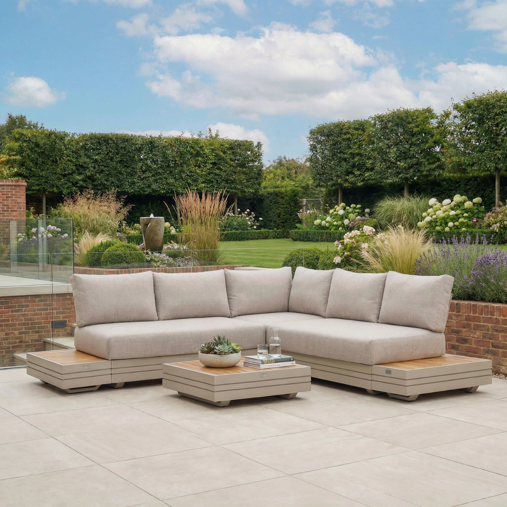
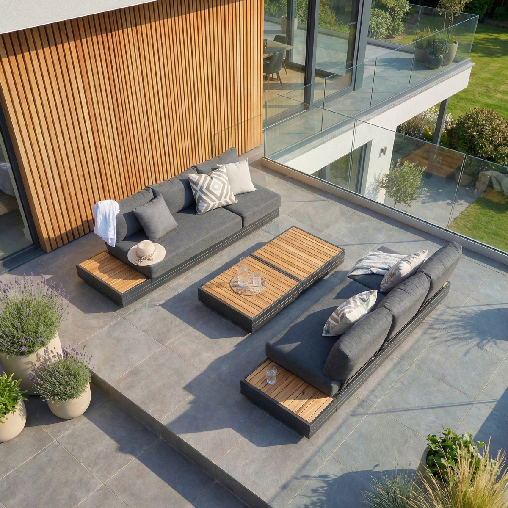
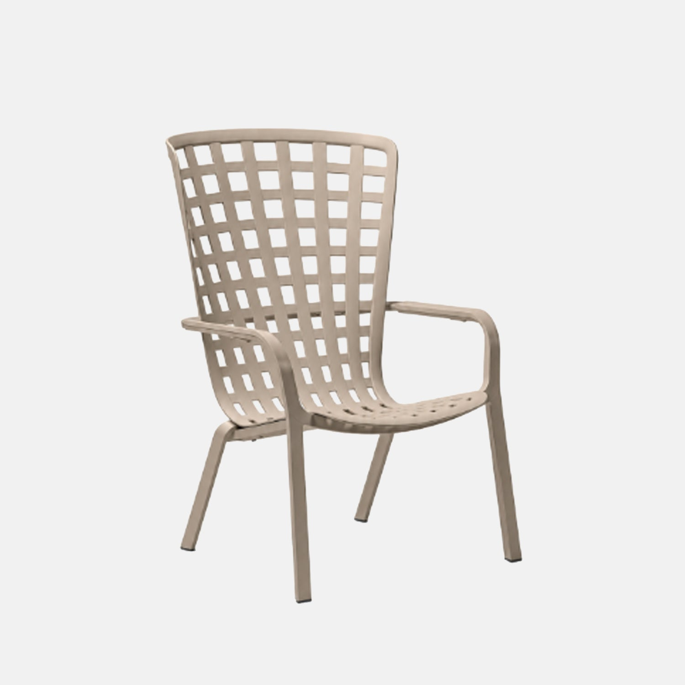
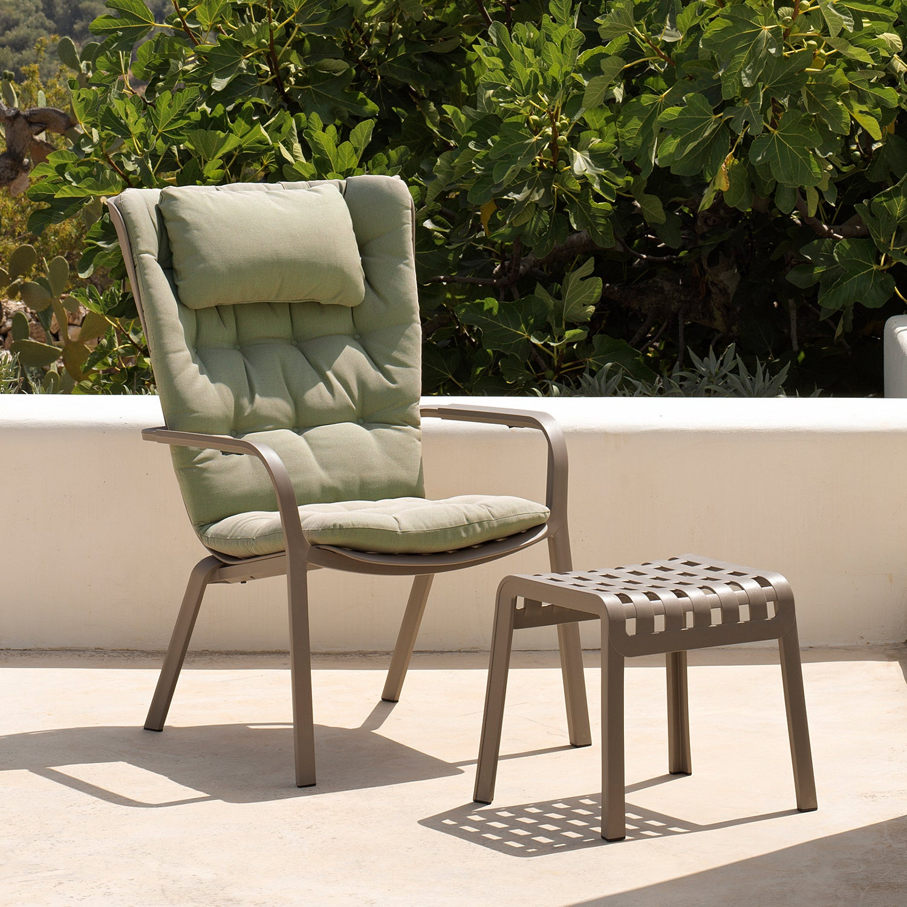
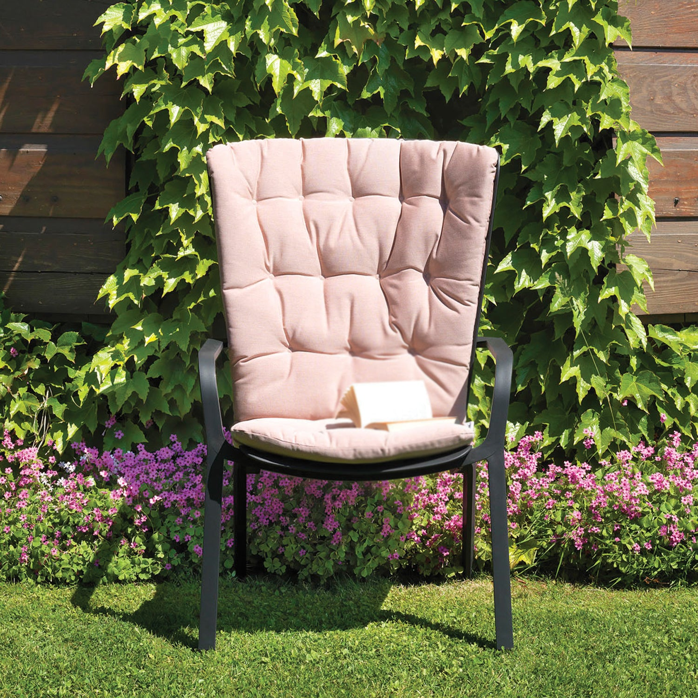
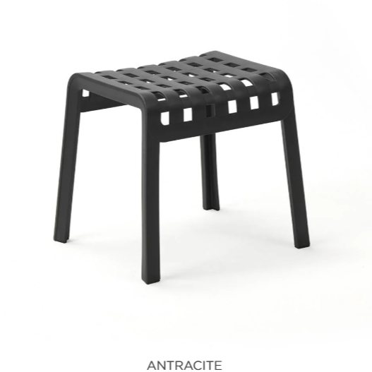

# Roof Terrace — Final Outdoor Furniture Choices

*Working summary for Chris. Records the **confirmed** picks, the **shopping list per supplier**, and what is **still to finalise**. Full research is in [furniture-options.md](furniture-options.md) (lounge) and [teak-furniture.md](teak-furniture.md) (dining). Ronan's drawings/specs remain authoritative for anything structural.*

**Last updated: 28 June 2026**

---

## At a glance

| Zone | Item | Qty | Supplier | Cost |
|---|---|---|---|---|
| **Dining** | Luxus Sydney teak armchair | 12 | Luxus Home & Garden | £2,118 |
| **Dining** | Azura 10–12 extending table | 1 | Sustainable Furniture | £1,280 |
| **Lounge (FA3)** | Harbour Panama — 3-seat sofa | 2 | Harbour Lifestyle | £2,338 |
| **Lounge (FA3)** | Harbour Panama — corner/footstool unit (used as 1-seater) | 2 | Harbour Lifestyle | £1,170 |
| **Lounge (FA3)** | Harbour Panama — coffee table | 1 | Harbour Lifestyle | £359 |
| **Lounge (FA3)** | Harbour Panama — side table | 1 | Harbour Lifestyle | £225 |
| **Narrow terrace** | Nardi Folio recliner — **Corda (sand)** | 4 | Julia Jones | £612 |
| **Narrow terrace** | Nardi Folio comfort cushion (seat+back, "Natural") | 4 | BF Home | £676 |
| **Narrow terrace** | Nardi Folio "Poggio" footstool | 2 | Julia Jones | £120 |
| | | | **Confirmed total** | **≈ £8,898** |

*Prices are the latest quoted/listed figures and need re-confirming at order time (Panama sets are currently out of stock — buy by the module).*

> ⏸ **Parked for later (deliberately not in this total):** the **bistro set** (table + chairs) and the **coffee / drinks side tables**. We're getting everything else in place first and will add these later. Their best routes are fully recorded in **[furniture-options.md](furniture-options.md)** — §4 (bistro: lead = Field & Hawken "Mortimer" teak) and §5 (side tables: lead = Nardi Doga for true all-year, or a travertine drum with a winter cover).

---

## 1 · Dining — ✅ CONFIRMED

<table>
<tr>
<td width="50%" valign="top">

**Chair — Luxus Sydney armchair × 12**

~£176/chair · **sold in sets of 4 = £706**
65cm W · 59cm D · 76cm H · stackable · SVLK teak
[luxushomeandgarden.com](https://www.luxushomeandgarden.com/products/4-x-sydney-chairs-with-cushions)

</td>
<td width="50%" valign="top">

**Table — Sustainable Furniture Azura 10–12 × 1**

£1,280 · SVLK teak · X cross-leg
240cm compact → 320cm extended · 100cm wide · H75cm
[sustainable-furniture.co.uk](https://sustainable-furniture.co.uk/product/azura-10-12-seater-extending-dining-table/)

</td>
</tr>
</table>

**Seating:** 8 everyday on the 240cm compact table (3 per long side + 1 each end); **10–12 when extended to 320cm**. The 12 chairs cover the extended table; when compact, 4 are spare *(a bistro table for them is parked for later — see options sheet).*

### 🛒 Shopping list — dining

**Luxus Home & Garden** — [luxushomeandgarden.com](https://www.luxushomeandgarden.com/products/4-x-sydney-chairs-with-cushions)
| Item | Qty | Unit | Total |
|---|---|---|---|
| Sydney teak armchair (with cushions) — bought as **3 × sets of 4** | 12 | £706/set of 4 | **£2,118** |

**Sustainable Furniture** — [sustainable-furniture.co.uk](https://sustainable-furniture.co.uk/product/azura-10-12-seater-extending-dining-table/)
| Item | Qty | Unit | Total |
|---|---|---|---|
| Azura 10–12 extending dining table (240→320cm) | 1 | £1,280 | **£1,280** |

**Dining subtotal: £3,398**

---

## 2 · Lounge (FA3) — ✅ CONFIRMED — Harbour Panama

*The Panama range comes in **Latte (beige, top photo)**, **Charcoal (anthracite, lower photo)** and Washed Grey — all powder-coated aluminium with teak tables; the 3-seaters convert to sun-loungers (shown reclined); cushions stored indoors (not all-weather). We'd leaned **Charcoal** to tie into the building's standing-seam cladding, but **Latte is the warmer option** — colourway to confirm.*

**Chosen layout** (built from the Panama modules):

- **East (back) 3-seater** + **north 3-seater** (slid inward, so the ~0.24m slack sits outside the U against the north flowerbed)
- **Two 1-seaters** on the south side (west end)
- **Side table** at the SW junction + **central coffee table**
- **~0.74 × 0.74m square gap at the SE corner** (south of the side table) — **left open for now: plants OR a second coffee table** (see "Still to finalise")
- **8 seats** (9–10 lounging when the 3-seaters extend to loungers)

### 🛒 Shopping list — lounge

**Harbour Lifestyle** — Panama range (buy by the module; sets currently out of stock)
| Item | Qty | Unit | Total |
|---|---|---|---|
| Panama 3-seat sofa (converts to sun-lounger) | 2 | £1,169 | £2,338 |
| Panama corner / footstool unit (used as a 1-seater) | 2 | £585 | £1,170 |
| Panama coffee table | 1 | £359 | £359 |
| Panama side table | 1 | £225 | £225 |

**Lounge subtotal: £4,092** *(+£359 if a second coffee table fills the SE corner)*

⚠ **Confirm with Harbour before ordering:**
1. A single corner/footstool unit works as a **forward-facing 1-seater with a proper backrest**.
2. **C5 coastal coating** spec (seafront exposure).
3. **Cushions are stored indoors** (Panama cushions aren't all-weather) — confirm cushion storage volume.
4. Stock / lead time (sets OOS → module-by-module).

---

## 3 · Narrow terrace — lounge chairs — ✅ CONFIRMED

A relaxed corner between the outdoor kitchen and the dining area. **Lounge chairs are confirmed below;** the **bistro set and side tables are parked for later** (best routes in [furniture-options.md](furniture-options.md)).

### Lounge chairs — Nardi Folio in "Corda" (sand) × 4 ✅

 

*Left: the **bare** Folio in **Corda (sand)** — our colour. Right: **with** the comfort cushion + matching Poggio footstool (frame shown in taupe).*

  

*Left: the comfort seat+back cushion. Centre: the Poggio footstool. Right: the frame colour range (Bianco · Antracite · Agave · **Tortora** · plus **Corda** / Tabacco — Corda is ours).*

- **4 × Nardi Folio recliner, Corda (sand)** — £153 ea = **£612** · [juliajones.co.uk](https://www.juliajones.co.uk/nardi-folio-outdoor-armchair/p2098)
- **4 × Folio comfort cushion (seat+back, "Natural" oatmeal)** — £169 ea = **£676** · [bfhome.co.uk](https://www.bfhome.co.uk/products/folio-comfort-cushion) — the plush deluxe cushion (Chris's pick; Sunbrella seat-pad alternative dropped). Stored indoors. *(Chairs also look great **bare** — see the with/without photos in the options sheet — so cushions could be added later if trimming budget.)*
- **2 × Folio "Poggio" footstool, Corda** — £60 ea = **£120** · [juliajones.co.uk](https://www.juliajones.co.uk/nardi-folio-outdoor-footstool/p2104)
- Through-colour fibreglass resin — **no paint to chip, salt/UV-proof, hoses clean after gulls**; reclines 2 positions. Light (8.2 kg) → tuck against the kitchen wall / bring in for a gale.

**Narrow-terrace (lounge chairs) subtotal: £1,408.**

---

## 4 · Parked for later

These are **deliberately deferred** — we'll add them once everything else is in place. The full research + best routes live in **[furniture-options.md](furniture-options.md)**.

| Item | Leading route (to revisit) |
|---|---|
| **Bistro table** (round Ø600–650) | ⭐ **Field & Hawken "Mortimer" 60cm folding solid teak, £199** — matches the teak dining set, bombproof coastal, no project. *(A ready-made teak-base + stone-top round under £450 doesn't exist; the warm-stone alt = Bramblecrest "Monterey" ceramic, but on a powder-coated-alu + rattan base.)* §4 in the options sheet. |
| **Bistro chairs** (2–4) | Nardi Costa in Tortora (resin, matches the Folios, ~£63) **or** Jati teak (Winchester £110 / Solana £125, matches the dining set, good as overflow). §4 in the options sheet. |
| **Coffee / drinks side tables** (×2) | True all-year: **Nardi Doga/Step in Tortora** (resin). Travertine-drum look (needs a winter cover): MgO "Sadole" (~£60) or Cox & Cox "Pescara" (£395). §5 in the options sheet. |
| **Dining chair count** (optional) | Could drop the Sydney set 12 → 8 (save ~£706) and use bistro + indoor chairs as overflow — only relevant once the bistro chairs are chosen. |

[↑ Top](#top)
