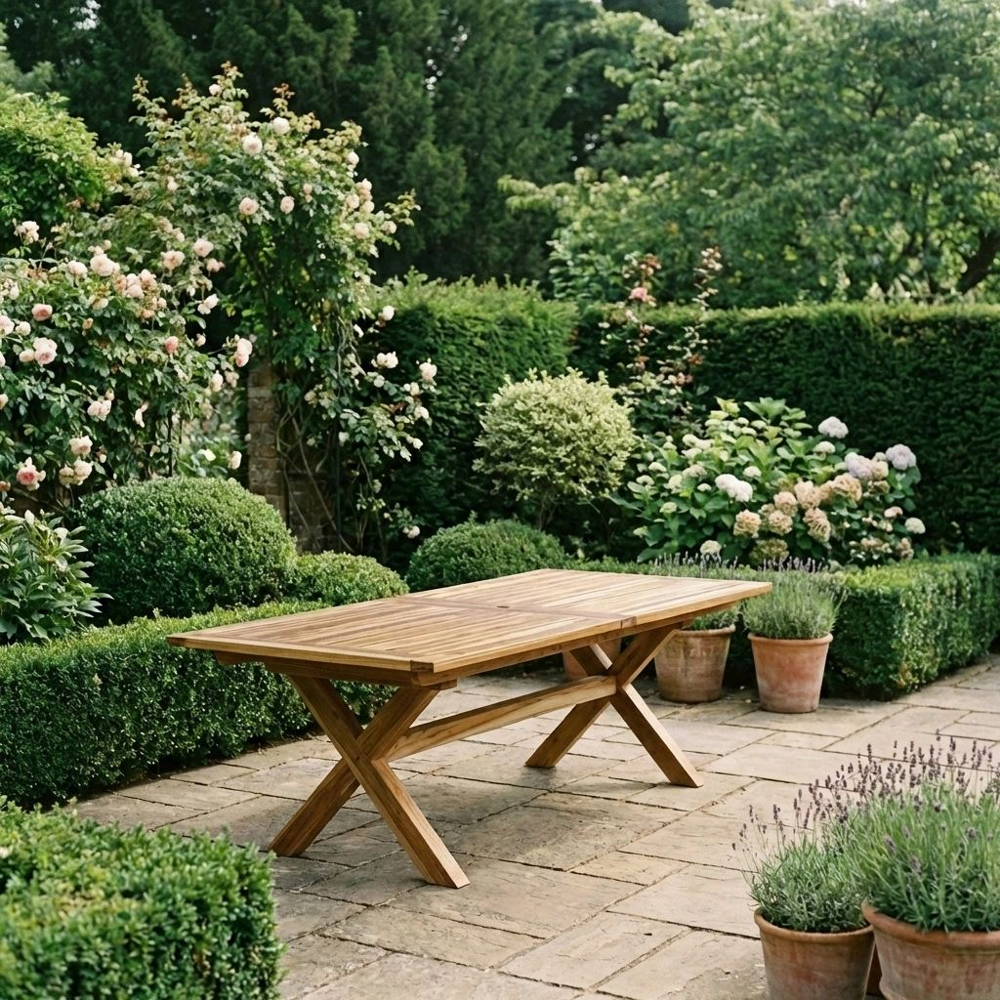
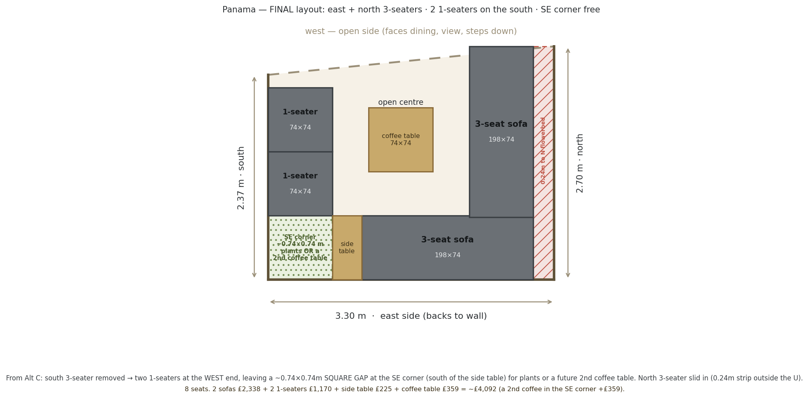

# Roof Terrace — Final Outdoor Furniture Choices

*Working summary for Chris. Records the **confirmed** picks, the **shopping list per supplier**, and what is **still to finalise**. Full research is in [furniture-options.md](furniture-options.md) (lounge) and [teak-furniture.md](teak-furniture.md) (dining). Ronan's drawings/specs remain authoritative for anything structural.*

**Last updated: 28 June 2026**

---

## At a glance

| Zone | Item | Qty | Supplier | Cost |
|---|---|---|---|---|
| **Dining** | Luxus Sydney teak armchair | 12 | Luxus Home & Garden | £2,118 |
| **Dining** | Azura 10–12 extending table | 1 | Sustainable Furniture | £1,280 |
| **Lounge (FA3)** | Harbour Panama — 3-seat sofa | 2 | Harbour Lifestyle | £2,338 |
| **Lounge (FA3)** | Harbour Panama — corner/footstool unit (used as 1-seater) | 2 | Harbour Lifestyle | £1,170 |
| **Lounge (FA3)** | Harbour Panama — coffee table | 1 | Harbour Lifestyle | £359 |
| **Lounge (FA3)** | Harbour Panama — side table | 1 | Harbour Lifestyle | £225 |
| | | | **Confirmed total** | **≈ £7,490** |

*Prices are the latest quoted/listed figures and need re-confirming at order time (Panama sets are currently out of stock — buy by the module).*

---

## 1 · Dining — ✅ CONFIRMED

<table>
<tr>
<td width="50%" valign="top">

**Chair — Luxus Sydney armchair × 12**

~£176/chair · **sold in sets of 4 = £706**
65cm W · 59cm D · 76cm H · stackable · SVLK teak
[luxushomeandgarden.com](https://www.luxushomeandgarden.com/products/4-x-sydney-chairs-with-cushions)

</td>
<td width="50%" valign="top">

**Table — Sustainable Furniture Azura 10–12 × 1**

£1,280 · SVLK teak · X cross-leg
240cm compact → 320cm extended · 100cm wide · H75cm
[sustainable-furniture.co.uk](https://sustainable-furniture.co.uk/product/azura-10-12-seater-extending-dining-table/)

</td>
</tr>
</table>

**Seating:** 8 everyday on the 240cm compact table (3 per long side + 1 each end); **10–12 when extended to 320cm**. The 12 chairs cover the extended table; when compact, the **4 spare chairs go around the bistro table** (see "Still to finalise").

### 🛒 Shopping list — dining

**Luxus Home & Garden** — [luxushomeandgarden.com](https://www.luxushomeandgarden.com/products/4-x-sydney-chairs-with-cushions)
| Item | Qty | Unit | Total |
|---|---|---|---|
| Sydney teak armchair (with cushions) — bought as **3 × sets of 4** | 12 | £706/set of 4 | **£2,118** |

**Sustainable Furniture** — [sustainable-furniture.co.uk](https://sustainable-furniture.co.uk/product/azura-10-12-seater-extending-dining-table/)
| Item | Qty | Unit | Total |
|---|---|---|---|
| Azura 10–12 extending dining table (240→320cm) | 1 | £1,280 | **£1,280** |

**Dining subtotal: £3,398**

---

## 2 · Lounge (FA3) — ✅ CONFIRMED — Harbour Panama

*The Panama range: powder-coated aluminium (anthracite/charcoal) with teak tables; the 3-seaters convert to sun-loungers; cushions stored indoors (not all-weather).*

**Chosen layout** (built from the Panama modules):

- **East (back) 3-seater** + **north 3-seater** (slid inward, so the ~0.24m slack sits outside the U against the north flowerbed)
- **Two 1-seaters** on the south side (west end)
- **Side table** at the SW junction + **central coffee table**
- **~0.74 × 0.74m square gap at the SE corner** (south of the side table) — **left open for now: plants OR a second coffee table** (see "Still to finalise")
- **8 seats** (9–10 lounging when the 3-seaters extend to loungers)

### 🛒 Shopping list — lounge

**Harbour Lifestyle** — Panama range (buy by the module; sets currently out of stock)
| Item | Qty | Unit | Total |
|---|---|---|---|
| Panama 3-seat sofa (converts to sun-lounger) | 2 | £1,169 | £2,338 |
| Panama corner / footstool unit (used as a 1-seater) | 2 | £585 | £1,170 |
| Panama coffee table | 1 | £359 | £359 |
| Panama side table | 1 | £225 | £225 |

**Lounge subtotal: £4,092** *(+£359 if a second coffee table fills the SE corner)*

⚠ **Confirm with Harbour before ordering:**
1. A single corner/footstool unit works as a **forward-facing 1-seater with a proper backrest**.
2. **C5 coastal coating** spec (seafront exposure).
3. **Cushions are stored indoors** (Panama cushions aren't all-weather) — confirm cushion storage volume.
4. Stock / lead time (sets OOS → module-by-module).

---

## 3 · Still to finalise

| Item | Qty | Notes |
|---|---|---|
| **Comfy chairs** | 4 | Type/supplier TBD — candidates in [furniture-options.md](furniture-options.md). |
| **Coffee table** | 1 | TBD — separate from the Panama coffee table; could be the one that fills the SE corner of the lounge. |
| **Bistro table** | 1 | TBD — **uses the 4 spare Sydney dining chairs** around it (no extra chairs needed). The Sustainable Furniture **Rune Square 80cm (£240)** is a candidate (see teak-furniture.md). |

[↑ Top](#top)
