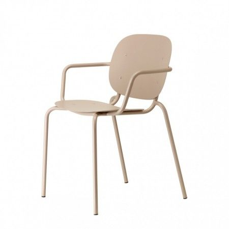
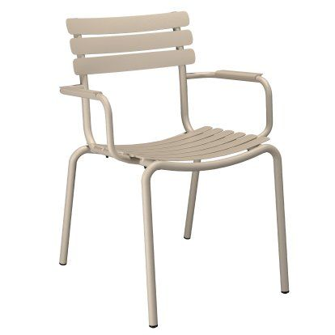
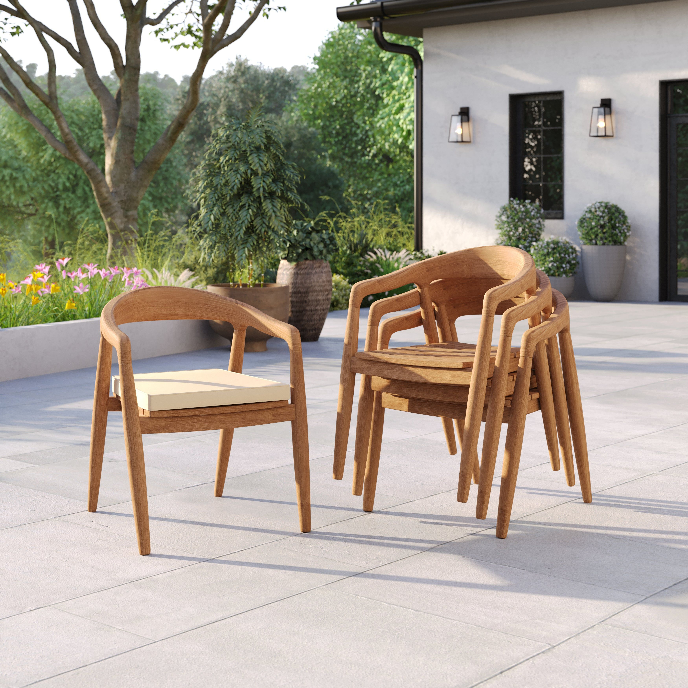
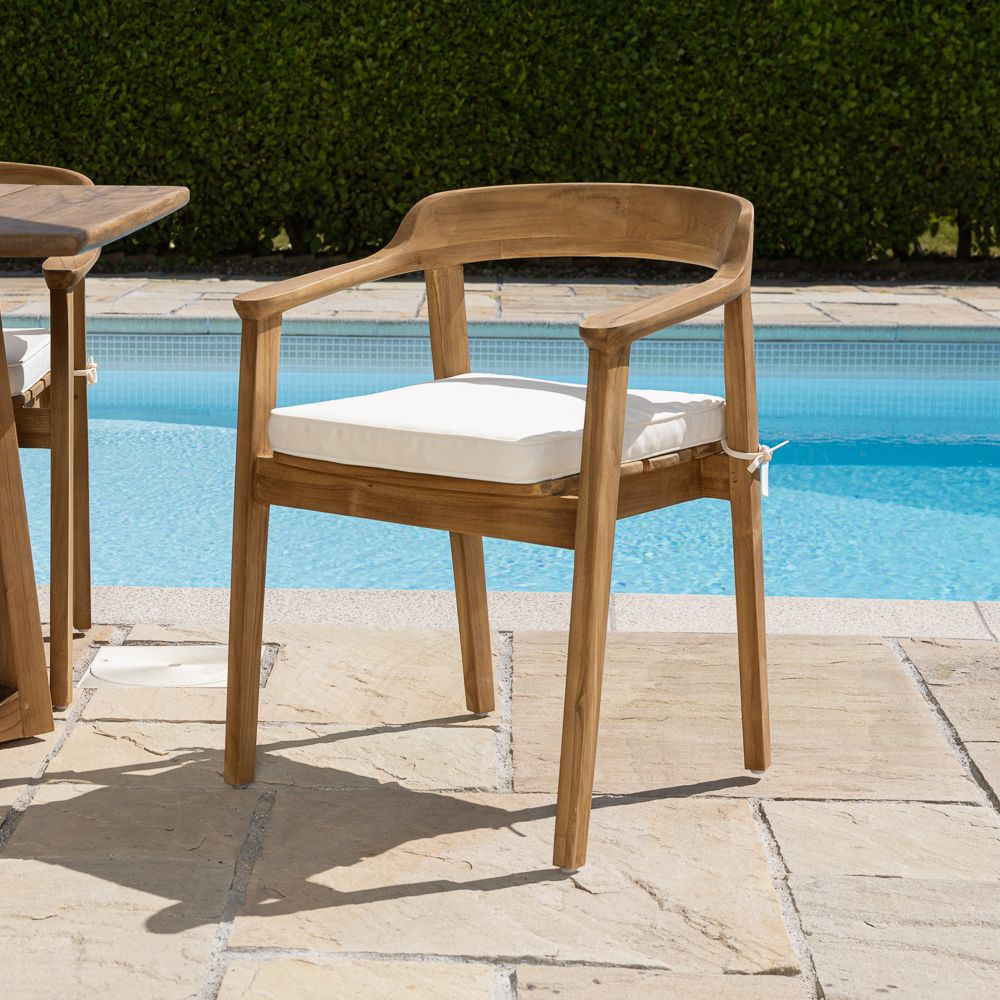
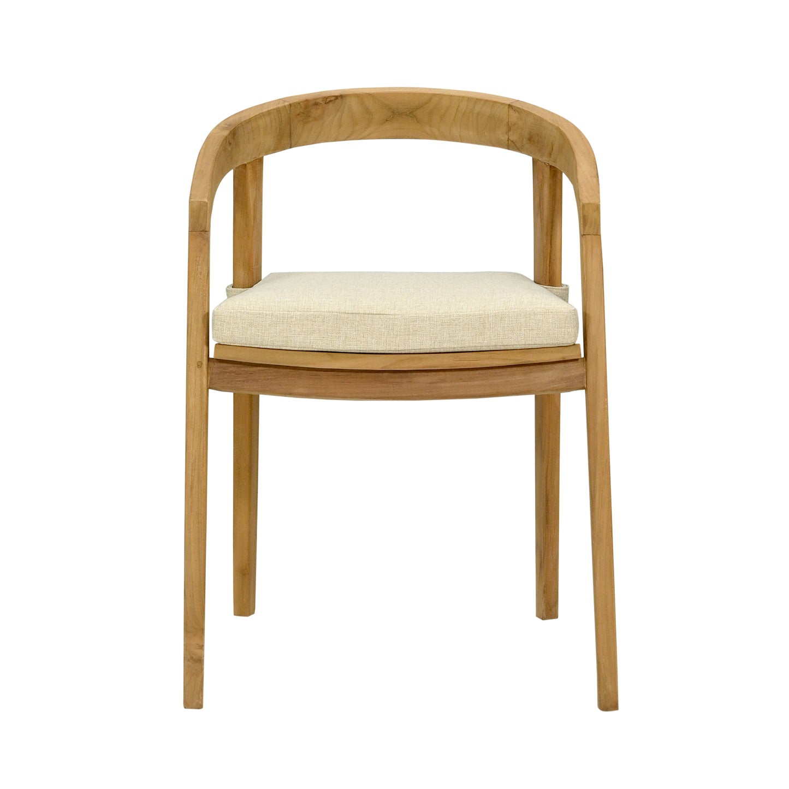
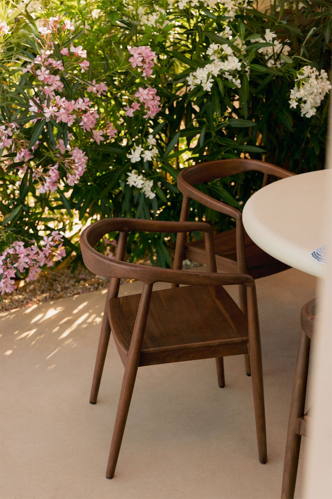
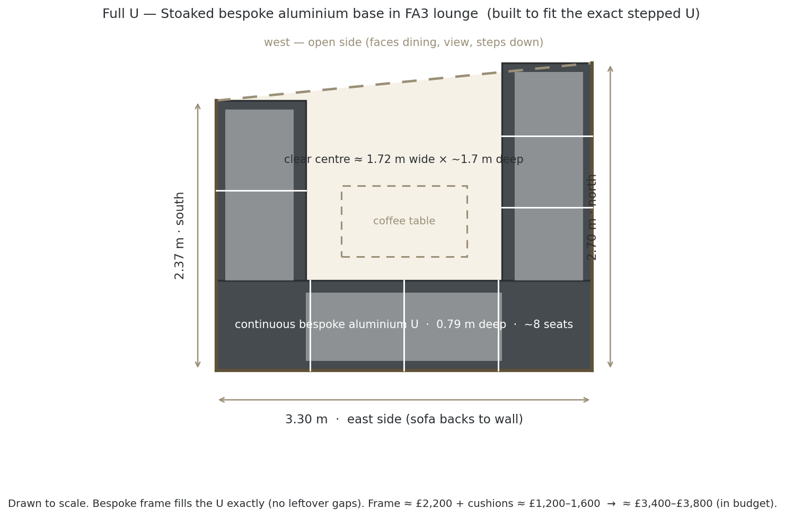
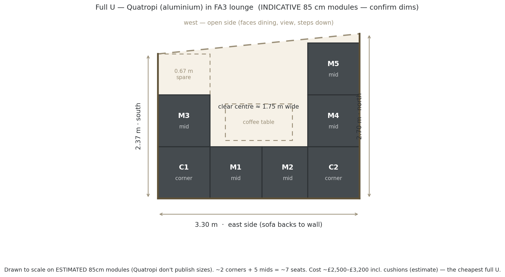
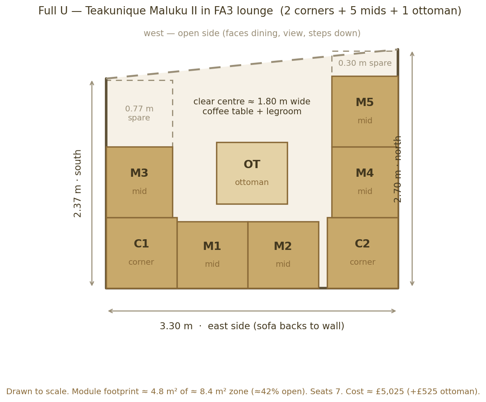
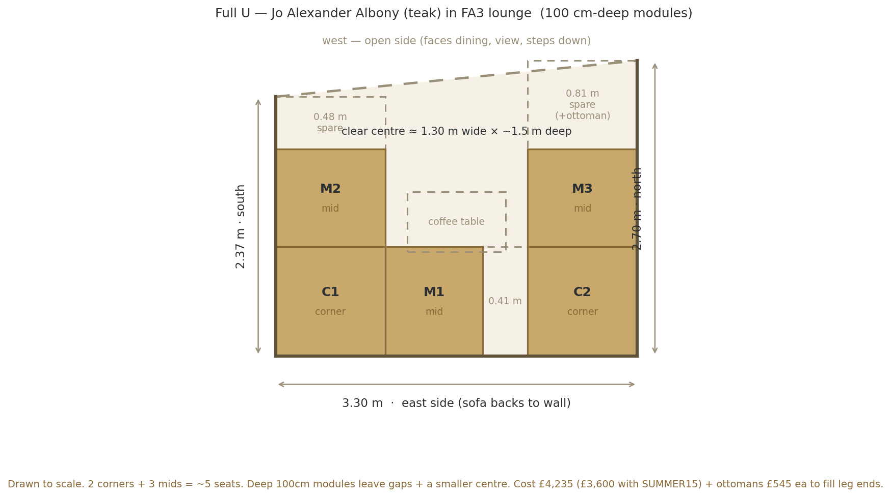

# Roof Terrace — Garden Furniture Options

*Shortlist for the 22 Sussex Square roof terrace (Brighton seafront). Three sections: **Dining tables**, **Dining chairs**, **Sofas & comfy chairs**. Prices captured June 2026 — confirm live before ordering.*

---

## Contents

**[What we're optimising for](#optimising)** · **[Recommended basket](#basket)** · **[How it looks](#looks)**

**[1 · Dining Tables](#tables)**
- Metal tops: [Nardi Rio £1,439](#nardi-rio) · [Mobellia Amalfi £599–799](#mobellia-amalfi) · [Vermobil Extia £1,333 ⭐](#extia)
- Stone tops: [Bramblecrest Sofia £1,799 ⭐](#bramblecrest-sofia)
- Teak top: [Maze Jakarta £1,059 ⭐](#maze-jakarta)

**[2 · Dining Chairs](#chairs)**
- **With arms:** [Fox armchair £177 ⭐](#fox) · [Si-Si armchair ~£185 ⭐](#si-si) · [Twist armchair £209 ⭐](#twist) · [Daisy armchair ~£209+ ⭐](#daisy) · [Alua with arms ~£260](#alua)
- **Without arms:** [Fox side £167 ⭐](#fox) · [Si-Si side £181 ⭐](#si-si) · [Alua £233 ⭐](#alua)
- **Teak — Route A:** [Luxus Sydney ~£176](#teak-sydney) · [Sustainable Arc £195](#teak-arc) · [Teakunique Poppy £205 ⭐](#teak-poppy) · [Sklum Rokan £250](#teak-rokan)

**[3 · Sofas & comfy chairs](#sofas)**
- **Aluminium (route to a full U in budget):** [Stoaked bespoke U-base ⭐](#stoaked) · [Quatropi sections ⭐](#quatropi) · [Harbour Panama £2,969 ⭐](#harbour-panama) · [over-budget refs](#alu-references)
- **Teak (warm-wood, near-U):** [Maluku II ⭐](#maluku) · [Albony ⭐](#albony) · [Sherborne](#sherborne)

**[Heat science — colour limits by material](#heat-science)** · **[Timing & checklist](#checklist)**

---

## What we're optimising for
- **Severe coastal exposure** — salt air + high wind. Heavy / corrosion-proof; **teak**, **cast aluminium** or **316 stainless** only — no steel, no thin tube aluminium.
- **Contemporary look** — clean, low, modern lines.
- **Seagull-proof table top** — gulls will foul the dining table, so the **top must be non-porous and wipe-clean**: **ceramic / sintered stone / HPL / glass / powder-coated (or wood-effect) aluminium.** Real **teak/wood tops are porous and stain** from droppings — avoid for the table.
- **Frames out, cushions stored** — only hard frames live outside; all cushions come indoors (storage being built in).
- **Budget** ~£3,000–£6,000 combined.

[↑ Contents](#contents)

---

## Recommended basket (contemporary, dark top, seagull-proof, wind-stable)
| | Item | Price |
|---|---|---|
| **Table** | Bramblecrest Sofia — **dark anthracite ceramic** top, X-leg, table + 10 chairs | **£1,799** |
| **Chairs** | Included with Sofia — or upgrade to Si-Si/Twist/Fox in preferred colour | **£0–£2,090** |
| **Lounge** | **Aluminium U (Stoaked bespoke base / Quatropi sections / Harbour Panama)** — full U + daybed + stored cushions in budget; anthracite ties to the building. Teak (Maluku/Albony) = warm-wood near-U alternative | **~£2,900–£4,000** |
| | **Total (table + included chairs + lounge)** | **~£3,740** |

Teak alt: **Maze Jakarta** (warm teak top, dark grey frame, £1,059) + teak chairs (10× Poppy ~£2,050) + lounge → ~£5,050. Stone alt: **Bramblecrest** as above. Metal alt: **Extia + Daisy armchairs** for a warm/light beige/tortora look.

[↑ Contents](#contents)

---

## How it looks — the options

### Route B — Bramblecrest Sofia stone table + SCAB Si-Si chairs (with cushions)

### Route A — Teak table + Poppy teak chairs aged to silver-grey (zero maintenance, honest look)

### Vermobil — Extia steel table (Beige) + Daisy armchairs

### Nardi Rio (Tortora) + Daisy armchairs (Beige) — warm tone-on-tone

### Mobellia Amalfi (Taupe) + Daisy armchairs (White)

[↑ Contents](#contents)

---

# 1 · Dining Tables

**Extending is a hard rule** — every table here extends. **Contemporary = slim aluminium A-frame/legs. Seagull-proof = a non-porous, wipe-clean top.** Grouped by top material — all stain-proof against droppings. (Real teak/wood tops are dropped: porous, they stain.)

---

## Metal (aluminium) tops — no rust, drains, wipe clean

### Nardi — Rio ⭐ (aluminium slat top)

*Photo: Tortora (warm greige/taupe) — the preferred colour. Also available in Anthracite and Bianco.*

- **Price:** £1,439 table-only
- **Size:** 210×100cm → **280×100cm** (extends, ~10 seats) · H76cm
- **Material:** Powder-coated aluminium frame + slatted aluminium top
- **Colour:** **Tortora** (warm greige, preferred) · Bianco (white) · Anthracite — 3 options
- **Heat safety (slatted aluminium):** ✅ Bianco · ✅ Tortora · ⚠ Anthracite (hot on still days — slatted gaps help a little; Brighton breeze usually compensates)
- **Weight:** ~54 kg (unusually heavy for aluminium)
- **Reviews:** juliajones.co.uk — not independently checked on Trustpilot; established UK specialist outdoor furniture retailer. Nardi is Italian contract/commercial-grade, award-winning — well-regarded by the trade.

**Pros:**
- Slatted top drains rain/hose instantly; wipe-clean; seagull-proof
- 54 kg = very heavy for aluminium; won't blow in normal weather
- Italian contract grade

**Cons:**
- One buyer report: top scratches easily; transit-damage claim refused — inspect carefully on delivery
- Order the "Rio Alu" version (not the resin Rio); request Nardi's optional saltwater anti-corrosion treatment

[juliajones.co.uk — Nardi Rio](https://www.juliajones.co.uk/nardi-rio-aluminium-outdoor-extending-dining-table-210-280cm/p2120)

[↑ Tables](#tables) · [↑ Contents](#contents)

---

### Mobellia — Amalfi (aluminium A-frame)

*Photo: white frame + taupe top (recommended combination — ✅ heat safe and warm look).*

- **Price:** 10-seat £599 · 12-seat £799
- **Size:** **⭐ Preferred: 10-seat 200→260×96cm** (fits ≤220cm compact constraint) · 12-seat 240→300×96cm · H75cm
- **Material:** Aluminium A-frame; **cemented composite top** (non-porous, wipe-clean — confirmed from Mobellia's site)
- **Colour:** Anthracite frame · White frame; top in **anthracite, taupe, or wood-effect** — 4 combinations
- **Heat safety (solid aluminium/composite top):** ✅ White frame + taupe top · ✅ White frame + wood-effect top · ⚠ White frame + anthracite top (top still gets hot despite pale frame) · ❌ Anthracite frame + anthracite top
- **Reviews:** mobellia.com — not independently verified on Trustpilot; online-only retailer; check returns policy before ordering.

**Pros:**
- Lowest price by far; tool-free extension; modern A-frame look
- Composite top is seagull-proof (non-porous)
- **Starts at 200cm** — fits when you need it compact

**Cons:**
- Light build — ballast against wind
- No independent review base found

[mobellia.com — Amalfi 10-seat (200→260cm)](https://www.mobellia.com/en-gb/products/automatic-extendable-garden-table-10-seats-aluminium-amalfi-200-260x96?variant=56303906750812)

[↑ Tables](#tables) · [↑ Contents](#contents)

---

### Vermobil — Extia ⭐ (steel flat top — matches Fox & Twist palette)

*Extia table in Beige BE — solid flat steel top, clean contemporary lines.*

- **Price:** £1,333 (from £1,778 — 25% off) table-only
- **Size:** Size 1: 140→200×80cm · **Size 2: 180→250×90cm** (preferred — more width and length for 8–10 seats)
- **Material:** **Duplex galvanised + qualicoat powder-coated steel** — same coastal-safe construction as the Fox & Si-Si chairs
- **Top:** Solid flat steel — wipe-clean, seagull-proof ✓
- **Colour:** **7 options — identical palette to Fox chairs and Twist armchair**: Black NE · Grey Mud FA · Ancient Grey AG · Ivory White BS · Matt White BCU · Bronzo BRO · Beige BE (see swatch below)
- **Heat safety (solid steel top — strictest rule):** ✅ Ivory White BS · ✅ Matt White BCU · ✅ Beige BE · ⚠ Ancient Grey AG (borderline — likely fine with Brighton coastal breeze) · ❌ Black NE · ❌ Bronzo BRO · ❌ Grey Mud FA
- **Weight:** Not published — steel construction likely heavier than aluminium alts ✓
- **Reviews:** deluxdeco.co.uk — **5.0/5 Trustpilot (235 reviews).** Same retailer as Fox; excellent service.
- **Lead time:** 6–10 weeks (made to order)
- **Guarantee:** 10-year frame

*Shared colour palette — Fox chairs, Twist armchair, and Extia table all available in these 7 finishes.*

**Pros:**
- ⭐ **Designed as a matched set** with Fox chairs and Twist armchair — table and chairs in identical colour, from one supplier
- Duplex galv construction = dark colours + coastal-safe (zinc under every chip)
- Solid flat top = completely seagull-proof, wipe-clean
- Both sizes start ≤220cm compact ✓
- 10-year guarantee; excellent retailer

**Cons:**
- Steel top gets hot in direct sun — **choose Ivory, Matt White, Beige or Ancient Grey** (see Heat safety above); darker colours will be uncomfortable to rest arms on
- Size 2 at 250cm extended seats 8–10; confirm 10 chairs fit comfortably (armchairs need more room per seat)
- 6–10 week lead time — order before August for September fit-out
- Weight not published; confirm it's heavy enough to resist wind without ballasting

[deluxdeco.co.uk — Extia extendable table](https://www.deluxdeco.co.uk/extia-extendable-table.html)

[↑ Tables](#tables) · [↑ Contents](#contents)

---

## Stone tops — sintered stone / ceramic — ultra stain & scratch-proof

### Bramblecrest — Sofia ⭐ (dark ceramic X-leg, best value)

- **Price:** £1,799 for table + 10 chairs
- **Size:** Extending X-leg table; standard Sofia tables run 165–200×95cm (6–8 seats); 10-seat extending version — ⚠ **exact extended dimensions not published online; confirm with Crownhill or Bramblecrest before ordering**
- **Material:** Aluminium X-leg frame + dark anthracite ceramic top
- **Colour:** Anthracite
- **Heat safety (ceramic top — most lenient):** ✅ Anthracite ceramic is comfortable to touch — ceramic's low thermal effusivity means it doesn't burn even when hot
- **Reviews:** Bramblecrest brand — **4.5/5 Trustpilot (4,600+ reviews), 5-year structural guarantee.** One of the better-reviewed brands here. Strong customer service.

**Pros:**
- ⭐ Excellent value — dark ceramic top + sculptural X-base + 10 chairs for £1,799
- Dark anthracite ties directly to the palette
- Take the table and pair with better chairs of your choice

**Cons:**
- Sold as a set only (not table-only)
- ⚠ Exact extended dimensions not published — **confirm before ordering**

[crownhillgarden.com — Bramblecrest Sofia](https://crownhillgarden.com/product/bramblecrest-sofia-aluminium-10-seat-patio-set-with-x-leg-extending-table-and-10-chairs-in-anthracite/)

*Other dark-ceramic alternatives:* **Alexander Rose Rimini** ~£1,293 (table-only, ceramic-glass, mid-grey not charcoal, extends to 300cm) · **Cane-line Drop (Fossil Black)** £5,100 (the deepest dark ceramic — premium reference only).

[↑ Tables](#tables) · [↑ Contents](#contents)

---

## Teak top — warm, natural, pairs with both teak and metal chairs

### Maze — Jakarta ⭐ (teak slat top + dark grey aluminium frame)

*Photo shown extended with upholstered chairs — the table top and dark grey frame are the point.*

- **Price:** £1,059 table-only (from [mazeliving.co.uk](https://www.mazeliving.co.uk/product/maze-jakarta-10-seat-extending-dining-table-teak-grey-frame))
- **Size:** **200×100cm → 260×100cm → 320×100cm** (three-step extension, 6→8→10 seats) · H75cm · ✓ **Starts at 200cm — fits the ≤220cm compact constraint**
- **Material:** Dark grey powder-coated aluminium frame + **solid teak slat top**
- **Colour:** Single option — warm teak top + dark grey frame
- **Heat safety:** ✅ Teak top stays comfortable at any temperature (very low thermal effusivity — like wood). Grey aluminium frame is on the underside/legs — not a contact surface.
- **Teak top note:** Teak is porous — seagull droppings must be wiped promptly or they can stain. With regular wiping (which you'd do anyway), entirely manageable. Top will silver to a warm grey patina if not oiled; apply teak oil once a season to maintain the warm honey colour.
- **Weight:** Not published — solid teak + aluminium frame will be substantially heavier than all-aluminium alts ✓
- **Reviews:** mazeliving.co.uk — **~9,600 Trustpilot reviews, mixed.** Strong on contemporary ranges; known delivery-damage risk on larger items — inspect carefully on arrival.

**Pros:**
- ⭐ **Bridges Route A and Route B** — warm teak top looks natural with teak chairs OR with dark/beige metal chairs
- Dark grey frame is contemporary and contrasts beautifully with the warm teak
- Competitive price vs other stone/ceramic tables
- Three-step extension; 200cm compact ✓

**Cons:**
- Teak top requires prompt wiping of bird fouling (seagulls) — less forgiving than ceramic/sintered stone
- Teak grade not specified in spec sheets — confirm Grade A / FSC before ordering
- Mixed Maze delivery reviews — inspect on arrival

[mazeliving.co.uk — Maze Jakarta](https://www.mazeliving.co.uk/product/maze-jakarta-10-seat-extending-dining-table-teak-grey-frame)

[↑ Tables](#tables) · [↑ Contents](#contents)

---

# 2 · Dining Chairs

Two routes. **Route B = metal** (this group, below): aluminium won't rust; steel needs to be **duplex galvanised** (zinc under the colour, survives chips) or **316 stainless**; all seats bare metal — wipe-clean, drain, no fixed cushions. **Route A = teak** is a separate group further down → [Teak dining chairs — Route A](#teak-chairs).

**Chairs with arms** (Alex's preference): [Zaltana £145](#zaltana) · [Fox armchair £177](#fox) · [Culip £179](#culip) · [Joncols £199](#joncols) · [Twist armchair £209](#twist) · [Daisy armchair ~£209+](#daisy). Any of these mix well with the armless versions from the same brand/palette.

---

### Vermobil — Fox · £167 (side chair) / £177 (armchair) ⭐ matches Extia table & Twist armchair

**Side chair — no arms:**

**With optional seat cushion:**

*Seat cushion shown in Grey Mud (olive) — available in 8 outdoor fabrics, store indoors.*

**Armchair — with arms (£10 more):**

*Fox armchair with the Extia table — same Vermobil collection.*

**Colour palette (shared with Extia table and Twist armchair):**

- **Price:** Side chair £167 (RRP £222) · Armchair £177 (RRP £236) · **Lead time: 6–10 weeks** (made to order)
- **Size:** Side chair W45 × D53 × H81cm · Armchair wider — confirm with deluxdeco
- **Material:** **Duplex galvanised + qualicoat powder-coated steel** — confirmed coastal-safe
- **Colour:** 7 options — **same palette as Extia table and Twist armchair** (see swatch above) · **Heat safety (solid pressed steel seat — strictest rule):** ✅ Ivory White BS · ✅ Matt White BCU · ✅ Beige BE · ⚠ Ancient Grey AG (borderline — coastal breeze usually fine) · ❌ Black NE · ❌ Grey Mud FA · ❌ Bronzo BRO — solid seat means full skin contact; dark colours will be painful to sit on in shorts in direct sun · **Weight:** Unpublished · **Arms:** Armchair version £177 · **Stackable:** Yes · **Seat:** Smooth pressed steel shell (wipe-clean); 8 cushion fabrics separately (UV/water/mould resistant, 5-yr warranty)
- **Reviews:** deluxdeco.co.uk — **5.0/5 Trustpilot (235 reviews). Excellent.**

**Pros:** Confirmed duplex galv = properly coastal-safe; smooth pressed-steel seat; armchair option; perfectly matched to Extia table and Twist armchair from same brand; excellent retailer · **Cons:** ⚠ 6–10 week lead time — order July for Sept fit-out; weight unpublished

[deluxdeco.co.uk — Fox side chair](https://www.deluxdeco.co.uk/fox-chair.html) · [Fox armchair](https://www.deluxdeco.co.uk/fox-armchair.html)

[↑ Chairs](#chairs) · [↑ Contents](#contents)

---

### Vermobil — Twist armchair ⭐ · £209 (with arms — matches Fox & Extia)

*Photo in dark bronze/anthracite — same slatted seat, slim arms, dining height.*

**Colour palette (shared with Fox chairs and Extia table):**

- **Price:** £209 (from £279 — 25% off) · **Lead time: 9–15 weeks** ⚠ (made to order — order by July for September fit-out)
- **Size:** W55 × D56 × H88cm (dining height)
- **Material:** **Duplex galvanised + qualicoat powder-coated steel** — same coastal-safe construction as Fox
- **Colour:** 7 options — **identical palette to Fox chairs and Extia table** (see swatch above) · **Heat safety (slatted steel seat, solid arms):** ✅ Ivory White BS · ✅ Matt White BCU · ✅ Beige BE · ⚠ Ancient Grey AG · ❌ Black NE · ❌ Grey Mud FA · ❌ Bronzo BRO — slatted seat is slightly cooler than Fox's solid pan; arms are solid steel and will be hot in dark colours · **Weight:** Unpublished · **Arms:** Yes ✓ · **Stackable:** Yes · **Seat:** Slatted metal (drains, wipe-clean); cushion options likely available — confirm with deluxdeco
- **Reviews:** deluxdeco.co.uk — 5.0/5 Trustpilot (235 reviews). Excellent.

**Note:** Back panel appears to have a separate insert in the product photo — **confirm with deluxdeco whether the back is all-metal or includes a fabric/textile component** (if fabric, it needs to come indoors like cushions).

**Pros:** ⭐ Arms make it more comfortable for long dinners; perfectly matched to Fox side chairs and Extia table — can mix armchairs and side chairs in one palette; stackable; duplex galv = coastal-safe · **Cons:** 9–15 week lead time is the longest on this list — order early; 55cm width means armchairs take more table room (8 fit around a 250cm table, not 10); back panel to confirm

[deluxdeco.co.uk — Twist armchair](https://www.deluxdeco.co.uk/twist-armchair.html)

[↑ Chairs](#chairs) · [↑ Contents](#contents)

---

### Vermobil — Daisy armchair ⭐ · ~£209+ (confirm with arredinitaly or Vermobil UK dealer)

*Photo: Daisy armchair in beige/taupe with cushion.*

- **Price:** ~£209+ (was from £209 at deluxdeco who no longer stock Vermobil — confirm current price via [arredinitaly.com/gb](https://www.arredinitaly.com/gb/98_vermobil) or Vermobil's new UK dealer)
- **Material:** **Duplex galvanised + qualicoat powder-coated steel** — same coastal-safe construction as the Fox, Si-Si, and Extia
- **Colour:** Beige/taupe and other options (confirm range with supplier) · **Heat safety (duplex steel, solid arms):** ✅ Beige/Ivory — the warm light tone + duplex galv construction makes this the best heat-safe armchair on the list; ⚠ mid-tones; ❌ dark anthracite/black
- **Weight:** Not published · **Arms:** Yes ✓ · **Stackable:** Yes (up to 8) · **Seat:** Cushioned seat + wire/panel back; cushion stored indoors
- **Available from:** arredinitaly.com/gb (ships to UK — already our Si-Si supplier) or Vermobil's new UK dealer (pending)

**Pros:**
- ⭐ **Ideal companion for Nardi Rio Tortora, Mobellia taupe, Extia Beige, or Jakarta** — beige/white options create a warm, cohesive look across the full dining set
- Arms ✓; stackable ✓; duplex galv coastal-safe ✓
- Same Vermobil family as Fox, Mogan, Twist, Extia — consistent build quality

**Cons:**
- Price unconfirmed since deluxdeco dropped Vermobil — get a quote before assuming the ~£209 figure
- Cushions required for comfort (seat cushion stored indoors)

[arredinitaly.com/gb — Vermobil range](https://www.arredinitaly.com/gb/98_vermobil)

[↑ Chairs](#chairs) · [↑ Contents](#contents)

---

### SCAB Design — Si-Si ⭐ · £181 (2503 side chair) / ~£185 (2502 armchair)

**Side chair 2503 — no arms:**

*Si-Si 2503 in **anthracite** — the correct dark colourway (ZA).*

**With optional seat cushion (shown in dove grey ZT):**

*Cushion shown in Dove Grey (ZT) — same cushion available in anthracite. Seat cushion is an optional extra; store indoors when not in use.*

**Armchair 2502 — with arms (~£185):**

*Si-Si 2502 armchair in linen/sand — same curved pressed-steel seat and back, slim steel arms added. Same colours as the 2503 including anthracite and dove grey. Sold in pairs; confirm current UK price at arredinitaly.com/gb.*

- **Price:** 2503 side £181/chair · 2502 armchair ~£185/chair (both sold in pairs)
- **Size:** 2503 side W51 × D55 × H80cm · 2502 armchair W62 × D55 × H80cm · Seat H44cm (CATAS-certified)
- **Material:** **Duplex galvanised + powder-coated steel** — zinc under the paint → dark AND rustproof
- **Colour:** **Anthracite (ZA)** and **Dove Grey (ZT)** both available (full range incl. linen, terracotta, aviation blue, olive green) · **Heat safety (solid pressed steel seat — strictest rule):** ⚠ Dove Grey ZT (borderline — better than anthracite but still warm for steel; use a seat cushion in summer) · ❌ Anthracite ZA (dark steel seat will be hot on bare skin in shorts) · **Weight:** ~8.7 kg/chair (per italivingoutdoor spec; sold in pairs) · **Arms:** 2503: No · 2502: Yes · **Stackable:** Yes (both models) · **Seat:** Pressed/curved steel sheet (wipe-clean)
- **Reviews:** arredinitaly.com — positive Trustpilot (47 reviews — small sample; Chamber of Commerce registered; legitimate Italian retailer).

**Pros:** **~8.7 kg** — best wind resistance of any non-teak option; duplex galv = dark AND coastal-safe; **dove grey is a genuine grey option**; armchair version ~£4 more; Italian CATAS-certified · **Cons:** Small retailer (47 reviews); sold in pairs only; confirm UK delivery lead time; 2502 armchair UK price unconfirmed (listed at ~£185 est.)

[arredinitaly.com — SCAB Si-Si 2503](https://www.arredinitaly.com/gb/metal-chairs/13893-si-si-2503-chairs-scab-design.html)

[↑ Chairs](#chairs) · [↑ Contents](#contents)

---

### HOUE — Alua ⭐ · ~£233 armless *(stretch)* / ~£260 with arms

**Armless (side chair):**

**Also available with arms (~£260):**

*Alua armchair in beige — same slatted aluminium, slim arms added. ~€299/~£260/chair at smow or connox. Same 6 colours, stackable to 10, 5-year warranty.*

- **Price:** Armless ~£233/chair (Holloways) · With arms ~£260/chair (smow/connox — stretch)
- **Material:** Powder-coated marine aluminium
- **Colour:** Black · Muted white · Olive green · Beige · Cayenne red · Ice blue — **no grey available** · **Heat safety (slatted aluminium):** ✅ Muted white · ✅ Beige · ✅ Ice blue · ⚠ Olive green (medium tone) · ⚠ Cayenne red (medium-dark absorptivity) · ❌ Black · **Weight:** ~4.8 kg armless / ~5 kg with arms (published) · **Arms:** No (armless) / Yes (armchair version) · **Stackable:** Yes (up to 10) · **Seat:** Curved slatted seat + back (drains)
- **Reviews:** Holloways of Ludlow — **4.9/5 Trustpilot (500+ reviews). Excellent.**

**Pros:** Most refined / architectural aluminium chair here; published weight; stacks 10 high; armchair version available; Danish design; 5-year warranty · **Cons:** Over budget at £233–260 (stretch); no grey colourway available; armchair pushes further into stretch territory

[hollowaysofludlow.com — HOUE Alua](https://www.hollowaysofludlow.com/products/houe-alua-dining-chair)

[↑ Chairs](#chairs) · [↑ Contents](#contents)

---

**Steer:** **Vermobil Fox (£167/177)** — confirmed duplex galv, side or armchair, matches Extia/Twist palette; 6–10 week lead time. **SCAB Si-Si (£181/~185, 8.7 kg)** — heaviest, side or armchair, dove grey option. **HOUE Alua (£233)** — most architectural aluminium, armchair version also available at ~£260.

[↑ Top](#top) · [↑ Contents](#contents)

---

## Teak dining chairs — Route A

Solid teak instead of metal. Teak is naturally oily, rot-proof and salt-tough — left out it silvers to grey with **zero maintenance**, and at ~8–12 kg it passes the Brighton wind test where light aluminium doesn't. All bare-teak seats drain and are seagull-proof; any removable pad stores indoors. Sorted cheapest first. **Verify by eye and order a sample first** — teak grade and finish vary a lot between sellers.

All four chairs share the same **rounded barrel-back** aesthetic — very clean and contemporary. Sydney and Arc have arms; Poppy is armless with the narrowest footprint; Rokan is darker oiled.

---

### Luxus Home & Garden — Sydney · ~£176 (armchair, stackable)

*Set of 4 stacked — clear view of the curved barrel back and stackability. Seat cushion included, stored indoors.*

- **Price:** ~£176/chair (sold in sets of 4, £706 — or as part of a table set)
- **Material:** Indonesian teak, **SVLK certified** (EU Timber Regulation compliant)
- **Colour:** Natural teak (silvers if left out) · **Weight:** Unpublished · **Arms:** Yes (flowing arms extending from the curved back) · **Stackable:** Yes (confirmed) · **Seat:** Cushioned seat pad (store indoors); bare teak seat base drains
- **Dimensions:** 65cm W × 59cm D × 76cm H
- **Reviews:** luxushomeandgarden.com — **4.6/5 Trustpilot (675 reviews).** Generally positive; same retailer as the Amalfi sofa set.

**Pros:** Beautiful rounded barrel-back — the same family as the Poppy aesthetic at lower price; stackable; certified teak; good retailer · **Cons:** Arms (wider profile); cushion must come indoors; SVLK but no Grade A/FSC stated; weight unpublished

[luxushomeandgarden.com — Sydney chair (set of 4)](https://www.luxushomeandgarden.com/products/4-x-sydney-chairs-with-cushions)

[↑ Chairs](#chairs) · [↑ Contents](#contents)

---

### Sustainable Furniture — Arc · £195 (armchair, stackable)

*Poolside lifestyle shot — clear curved rounded back and slim arm profile. Seat cushion included, stored indoors.*

- **Price:** £195/chair
- **Material:** Indonesian teak, **SVLK certified**
- **Colour:** Natural teak · **Weight:** Unpublished · **Arms:** Yes (slim, integrated with the curved back) · **Stackable:** Yes · **Seat:** Seat cushion included (store indoors); seat height 45cm
- **Reviews:** sustainable-furniture.co.uk — smaller retailer; SVLK certification and dedicated outdoor focus are positive signals. Arrives fully assembled.

**Pros:** Refined modern silhouette; sculpted curved back; stackable; SVLK certified; fully assembled · **Cons:** Arms; smaller/less-reviewed retailer; weight unpublished; cushion must come in

[sustainable-furniture.co.uk — Arc](https://sustainable-furniture.co.uk/product/arc-stacking-dining-armchair/)

[↑ Chairs](#chairs) · [↑ Contents](#contents)

---

### Teakunique — Poppy ⭐ · £205 (armless, stackable)

*Poppy in natural teak — the rounded arch back extends down to form a clean enclosure around the seat. No forward armrests: truly armless.*

- **Price:** £205/chair
- **Material:** Solid teak, responsibly sourced — certified plantation teak. No FSC/Grade-A label stated but "high-grade responsibly sourced" per Teakunique; **10-year guarantee.**
- **Colour:** Natural teak (silvers left out; oil to keep honey colour) · **Weight:** Unpublished (Teakunique site: "to follow") · **Arms:** No · **Stackable:** Yes · **Seat:** Optional seat pad sold separately (stored indoors); seat 45cm W (front) × 36cm W (back) × 42cm D, height 43cm
- **Dimensions:** 53cm W × 58cm D × 76cm H
- **Reviews:** teakunique.co.uk — self-hosted; Chris has quality/provenance concerns — limited independent review coverage for this brand.

**Pros:** ⭐ **The benchmark** — curved arch back, truly armless, stackable, narrowest footprint; longest guarantee (10 yr); the design most chairs on this list are compared against · **Cons:** No independent Trustpilot; weight unpublished; Grade A/FSC not explicitly stated; slightly higher price for an unverified brand

[teakunique.co.uk — Poppy](https://www.teakunique.co.uk/collections/teak-dining-chairs/products/poppy-stacking-chairs)

[↑ Chairs](#chairs) · [↑ Contents](#contents)

---

### Sklum — Rokan · £250 *(stretch)*

*Rokan in darker oiled teak — rich warm tone, very clean rounded back. Shown with a round marble-style table.*

- **Price:** £250/chair (was £275)
- **Material:** Teak — stated explicitly; ⚠ no Grade A, FSC, or SVLK certification mentioned
- **Colour:** Dark oiled teak (richer/darker than the other chairs here) · **Weight:** Unpublished · **Arms:** Yes · **Stackable:** Not confirmed · **Seat:** Bare teak (drains, seagull-friendly); integrated cushion shown in photo — confirm if removable
- **Reviews:** sklum.com — Sklum is an established European furniture retailer (same brand as the Archer metal chair already considered).

**Pros:** Striking contemporary Japandi aesthetic; darker tone works well against a stone table; clean rounded back; Sklum is a known retailer · **Cons:** Stretch at £250; no sustainability certification; stackability unconfirmed; arms; weight unpublished

[sklum.com — Rokan](https://www.sklum.com/uk/buy-garden-chairs/171293-rokan-teak-garden-chair.html)

[↑ Chairs](#chairs) · [↑ Contents](#contents)

---

**Steer (teak / Route A):** All four share the rounded barrel-back look. **Luxus Sydney (~£176)** and **Sustainable Arc (£195)** — armchair versions, certified teak, stackable, cushion in. **Teakunique Poppy (£205) ⭐** — armless, narrowest footprint, 10-yr guarantee; brand provenance less independently verified. **Sklum Rokan (£250)** — beautiful darker finish; stretch, no certification, stackability unconfirmed.

*Dead ends (checked, rejected):* Tikamoon **Blaise** £369 (wishbone Y-back + indoor varnish) and **Jonàk** £189 (indoor; ~6 kg — borderline for wind); Indian Ocean **Oslo** (teak + aluminium frame, 5.5 kg — fails weight); **Barlow Tyrie Equinox** / **Gloster Sway** (teak frame + sling, not solid teak; £400+); most Wayfair "teak" chairs are **acacia / teak-effect**; Teakunique **Riverbank** (traditional spindle) / **Snapdragon** (folding); **Garden Furniture Centre Bari** (seat height 32cm = bar-height, not dining); **Urban Deco Otero** (no image, back design unverified).

[↑ Top](#top) · [↑ Contents](#contents)

---

# 3 · Sofas & Comfy Chairs

**Daybed key:** ✅✅ push modules into a bed · ✅ pieces combine into a daybed · ◐ reconfigures (L/R, splits) but not flat.

> **Material decision (27 Jun 2026).** A fully-backed three-sided U in **solid teak can't be done in budget** (best teak near-U is the Albony at ~£3,850 with a sale code; a real full U is ~£5,500–5,700). Because a lounge frame is mostly **hidden under cushions** (so the dining-seat heat/look concerns barely apply), we opened the material up. Findings: **steel is out** — no marine-grade (316/duplex) modular sofa base exists at this budget (only Barlow Tyrie Layout 316, ~£12k+); cheap "galvanised" sofas are mild steel inside PE rattan (rust + wicker fail at the seafront). **Non-teak hardwood is out** — iroko/eucalyptus are less durable than teak exactly in marine conditions. **The winner is powder-coated _aluminium_:** rust-proof, anthracite to tie into the building's standing-seam cladding, and the only route to a genuine **full U + daybed within ~£4k** (frame + stored cushions). Teak stays as the warm-wood alternative (accepting a near-U).

### Full-U comparison — what a complete three-sided U costs in the FA3 zone

Costed for our U: **3.30 m back run + 2.70 m (north) & 2.37 m (south) legs.** Scaled plans are under each entry below (Stoaked, Quatropi, Maluku II, Albony).

| Option | Material | Full U *here*? | Full-U cost (incl. cushions) | Seats | Daybed | ≤ budget |
|---|---|---|---|---|---|---|
| **Stoaked** ⭐ | aluminium, **bespoke** | ✅ **fits exactly, no gaps** | **~£3,400–£3,800** | ~8 | ✅ | ✅ |
| **Quatropi** | aluminium, modular\* | ✅ (small gaps) | **~£2,500–£3,200**\* | ~7 | ◐ | ✅ **cheapest** |
| **Harbour Panama** | aluminium, fixed set | ✗ only via oversize Large U | £5,175 (Large U) | ~7 | ◐ loungers | ✗ as a U |
| **Maluku II** | teak, modular | ✅ (gaps) | £5,025 + £525 ottoman | 7 | ✅ | ✗ over |
| **Albony** | teak, modular (100 cm deep) | near-U (leg gaps) | £4,235 — **£3,600 w/ SUMMER15** | ~5 | ✅✅ | ✓ w/ sale |
| **Sherborne** | teak, fixed L-corner | ✗ not a U system | £1,499 (its 5-seat L) | 5 | ◐ | ✓ (not a U) |
| *Ref:* Fermob / Gloster / Bramblecrest Manhattan | aluminium | ✅ by design | ~£5,400–£6,000+ | varies | ✅ | ✗ over |
| *Ref:* Maze Pulse | aluminium | ◐ | ~£2,169–£3,545 | ~6 | ◐ | ✓ (cushions integral) |

\* Quatropi don't publish module dims — figures indicative. **Cushion basis:** Stoaked total includes bespoke cushions; Maluku/Albony module prices include their own seat cushions (Albony backs = extra scatter cushions); Harbour/Maze/Quatropi include cushions. **Takeaway: a true full U in budget = aluminium** (Stoaked fits exactly; Quatropi cheapest). Teak gives a partial/near-U only (Maluku over budget, Albony ~5 seats with gaps); the fixed sets (Harbour, Sherborne) can't form our U at all.

## Aluminium — frame + stored cushions (the route to a full U in budget)

*Universal caveat for all aluminium below: aluminium itself never rusts, but the **powder-coat** can corrode at edges in C5 salt — get the marine/seaside-class coating spec (+ pre-treatment) in writing before ordering, and confirm seat height + exact dims (most don't publish them).*

### Stoaked — bespoke aluminium U sofa base ⭐ NEW · frame ~£2,000–£2,400 + cushions

- **Price:** stock symmetric U **£2,310–£2,363** (matt anthracite grey); **bespoke** to our size likely ~£2,000–£2,400. **Frame only — add cushions ~£900–£1,600** (bespoke). **Total ≈ £2,900–£4,000** — fits £4k, cushions are the swing.
- **Material:** powder-coated aluminium (won't rust), architectural Interpon coat · ⚠ **no explicit marine/C5 claim; lifetime guarantee excludes weathering — get the coastal coating spec in writing.**
- **Modularity:** ✅✅ — 3 welded sections push together; split/rearrange/butt into a flat daybed. **Low 30cm seat**, 79cm deep, 68.5cm back.
- **Bespoke fit:** handmade in Devon, CAD to any size → **builds the exact unequal U (3.30 back / 2.70 + 2.40 legs, stepped)** — the only option that fits our space precisely *and* does a full U in budget. 4–6 wks (+ bespoke), free delivery to BN2.
- **Cushions:** sourced separately (Cushion Guys / Gardenista / The Foam Shop) — spec Sunbrella or Agora + quick-dry foam + zipped covers to store indoors.
- **Reviews:** small maker (since 2017); thin online reviews, no Trustpilot — legitimate, but verify by phone/sample.

**Pros:** Exact bespoke fit to the stepped U; anthracite matches the building; true full-U + daybed in budget; rust-proof aluminium · **Cons:** Cushions extra (+ effort to source); coastal coating spec unconfirmed; thin reviews

[stoaked.co.uk — outdoor seating bases](https://www.stoaked.co.uk/outdoor-seating-bases/outdoor-u-shaped-33-corner-sofa-bases/)

#### Full-U layout in the FA3 lounge — measured plan

Because Stoaked build to order, the U is **made to fit the exact stepped zone** — a continuous aluminium base **0.79 m deep** wrapping all three sides, with **no awkward leftover gaps** (the key contrast with the off-the-peg teak modules).

| Run | Length | Depth | Seats |
|---|---|---|---|
| East back run (backs to wall) | 3.30 m | 0.79 m | ~4 |
| North leg (longer) | 2.70 m | 0.79 m | ~3 |
| South leg (shorter) | 2.37 m | 0.79 m | ~2 |
| **Total continuous U** | — | — | **~8 seats** |

**Spare space:** none wasted at the edges (bespoke fills the U); the leftover is the usable **clear centre ≈ 1.72 m wide × ~1.7 m deep** for the coffee table + legroom. Seat height is low at **30 cm** (≈ 41 cm with a cushion).

> **Cost — a full U _does_ fit the budget here.** Bespoke aluminium frame ≈ **£2,200** (stock symmetric U is £2,310; ours is slightly smaller) **+ cushions ≈ £1,200–£1,600** (bespoke ~8-seat set, Sunbrella/Agora + quick-dry foam + zip covers) = **≈ £3,400–£3,800 all-in.** Compare the teak Maluku II full U at **£5,025** frame-only (+£525 ottoman) — the aluminium route delivers the *full* three-sided U, fitted exactly, ~£1,500–1,800 cheaper. **Cheaper still:** a **Quatropi** à-la-carte aluminium U ≈ **£1,500–£2,200 incl. cushions** (charcoal, not bespoke-fitted). *⚠ Frame figure is an estimate — get Stoaked's bespoke CAD quote + the marine coating spec; cushion price firms up once the frame size is set.*

[↑ Sofas](#sofas) · [↑ Contents](#contents)

---

### Quatropi — build-your-own aluminium modular sections ⭐ NEW · ~£1,200–£2,000

- **Price:** corner sections £250–£450, middles £225–£600 → a U for our space ≈ 4–5 modules ≈ **£1,200–£2,000** (cushions included). **Cheapest route, and you buy exactly the leg lengths** the unequal U needs.
- **Material:** aluminium frame; **charcoal** is the darkest (no true anthracite) · ⚠ confirm marine coat + seat height (unpublished).
- **Modularity:** ✅ — independent seat blocks push together to a flat platform (verify flatness — arm modules can interrupt).
- **Cushions:** included, removable → store indoors.

**Pros:** Best value; à-la-carte sizing suits the unequal U perfectly; modern, clean · **Cons:** Charcoal not true anthracite; seat height/marine-coat unpublished — confirm; cushions less premium than a bespoke spec

[quatropi.com — outdoor modular sofa sections](https://quatropi.com/collections/outdoor-garden-modular-sofa-sections)

#### Full-U layout in the FA3 lounge — indicative plan

⚠ **Indicative only** — Quatropi don't publish module sizes, so this is drawn on **estimated 85 cm modules**; confirm real dims + seat height before relying on it. On that basis: **~2 corners + 5 mids = ~7 seats**, one ~0.67 m spare at the south leg end, clear centre ~1.75 m. **Cost ~£2,500–£3,200 incl. cushions (estimate) — the cheapest full U of the lot.**

[↑ Sofas](#sofas) · [↑ Contents](#contents)

---

### Harbour Lifestyle — Panama corner group ⭐ NEW · £2,969 (complete set)

- **Price:** standard corner group, **charcoal £2,969** (was £3,299) — complete set incl. cushions + free winter cover. ⚠ the **Large U-Shape version is £5,175 — over budget, don't order that one.**
- **Material:** "rust-proof aluminium" frame; UV/water-repellent polyester cushions; teak coffee/side tables.
- **Modularity:** ✅ — rearranges to an L, **sun loungers or a double sofa**.
- **Cushions:** removable; **free winter cover included** → store indoors.
- **Reviews:** Harbour Lifestyle — large Trustpilot base, generally positive (confirm Panama specifically; inspect on delivery).

**Pros:** Off-the-shelf complete set in budget; reconfigures to loungers; charcoal aluminium; reputable retailer · **Cons:** Standard corner group, not a bespoke U — confirm dims fit the zone; the true U version is over budget

[harbourlifestyle.co.uk — Panama](https://www.harbourlifestyle.co.uk/products/panama-luxury-outdoor-corner-group-set-charcoal)

**Full-U note (no scaled plan):** Panama is sold as **fixed sets, not a module system**, so it can't be built into our bespoke U. The standard set is an **L-shaped corner group**; the only U is the **Large U-Shape at £5,175 — over budget** (and its dimensions aren't published, so a scaled fit-plan isn't possible). In budget it's an L, not a U.

[↑ Sofas](#sofas) · [↑ Contents](#contents)

---

### Aluminium — over-budget references (the design ideal)

- **Fermob Bellevie** (modular) — flat-aluminium frame + thin removable cushions, the purest "frame + stored cushion" concept, ~23 RAL colours incl. anthracite; but a U is **~£6,000+**. [fermob-london.co.uk](https://www.fermob-london.co.uk/shop-by-category/lounge/sofas/modular-sofas/c158)
- **Gloster Grid** — powder-coated aluminium, "almost limitless configurations" incl. a true daybed/chaise; flagship quality, **well over £4k** for a U. [gloster.com](https://www.gloster.com/en/products/collections/grid)
- **Maze Pulse** (aluminium, charcoal, ~£2,169–£3,545) — in budget but cushions are deep/integral (less "store indoors") and one Trustpilot review reports weather/colour failure — watch C5 durability.
- **Bramblecrest Manhattan** — genuine all-aluminium modular (Carbon/anthracite), but the **U-Shape is £5,399**; only the Square set (£3,749) fits, and it's not a U.

[↑ Sofas](#sofas) · [↑ Contents](#contents)

---

## Teak (the warm-wood alternative — accepts a near-U, not a full U in budget)

### Sherborne — Teak Corner · £1,499 (value classic)

- **Price:** £1,499 (5-seat corner + coffee table)
- **Material:** Grade A teak; made in England · **Modularity:** ◐ — chaise clamps L/R
- **Reviews:** gardenbenches.com (Sloane & Sons) — **4.4/5 Trustpilot (77 reviews).** 84% 5-star; good communication; responds to 100% of negative reviews. Solid UK teak specialist.

**Pros:** Excellent value for solid teak; UK-made; good customer service · **Cons:** High-back classic style — not the low modern look; not a true daybed

[gardenbenches.com — Sherborne Teak Corner](https://www.gardenbenches.com/wooden-garden-corner-sofa-sets)

**Full-U note (no scaled plan):** Sherborne is a **fixed 5-seat L-corner set** (the chaise just clamps to the left or right), **not a module system** — it can't be built into our three-sided U. Listed for completeness; likely a cut (high-back classic, not a U).

[↑ Sofas](#sofas) · [↑ Contents](#contents)

---

### Teakunique — Maluku II Modular ⭐ · the true-daybed contender (Sussex showroom — go and see it)

- **Price (per module):** corner 80×80×70 **£825** · mid 80×75×70 **£675** · ottoman 80×70×33 **£525**. **Seat height 45cm.** Building a full U for your space gets expensive fast: a tight L+chaise (2 corners + 1 mid + 1 ottoman) ≈ **£2,850**, but a deep U (2 corners + 2 mids + 1 ottoman) ≈ **£3,500 — over budget.**
- **Material:** Solid teak (wording is "high-grade timber" — vaguer than Cyan's stated Grade-A); 10-yr guarantee · **Modularity:** ✅✅ — corner/mid/ottoman push together; ottoman matches the 45cm seat height for a flush chaise/daybed. *(No documented locking/connector hardware — modules simply butt together; confirm true flat-daybed alignment with Teakunique.)*
- **Cushions:** ✅ detachable, **removable Sunproof Olefin covers**, store indoors.
- **Reviews:** thin online (no Trustpilot profile; an unverified "5.0/47 Google" badge on their own page) — **BUT Teakunique has a showroom in Sussex, so you can go and see/sit on the actual teak in person.** That in-the-flesh check beats any online review and neutralises the no-reviews worry. Real registered UK family firm. *(Confirm showroom address/opening before going.)*
- **Look:** mostly modern/low/clean, **but the backrests use closely-spaced vertical slats/spindles** that read slightly more "craftsman/transitional" than the crisp Sydney/Azura aesthetic — judge it for yourself at the showroom.

**Pros:** The genuine config-1 push-together daybed in budget; solid teak; conforms to the unequal U-shape; 10-yr guarantee; **viewable at a Sussex showroom** · **Cons:** A full deep U busts £3k (£525–825/module); backs slightly more traditional than your dining set; no documented daybed-locking mechanism — confirm flat-daybed alignment on the visit

[teakunique.co.uk — Maluku II range](https://teakunique.co.uk/collections/teak-sofas-and-loungers)

#### Full-U layout in the FA3 lounge — measured plan

The FA3 lounge is a U-shaped zone: **3.30 m** back run (east) with two return legs — **2.37 m** (south) and **2.70 m** (north), unequal because of the step down. A full three-sided U in Maluku II needs **2 corners + 5 mids + 1 ottoman** = **7 seats**, laid out as above.

| Code | Module | Footprint | Position | Price |
|---|---|---|---|---|
| C1 / C2 | 2 × corner | 80×80 | the two east corners (base↔arm) | £1,650 |
| M1 / M2 | 2 × mid | 80×75 | the 3.30 m east base | £1,350 |
| M3 | 1 × mid | 80×75 | south arm (shorter leg) | £675 |
| M4 / M5 | 2 × mid | 80×75 | north arm (longer leg) | £1,350 |
| OT | 1 × ottoman | 80×70 | centre — footrest / extra seat / **push to a sofa = daybed** | £525 |

**Spare space left over:** south arm **0.77 m** clear at the open end · north arm **0.30 m** · east base ~0.10 m tolerance · **open centre ≈ 1.80 m wide × ~1.55 m deep** for the coffee table + legroom. Furniture covers ≈ 4.8 m² of the ≈ 8.4 m² zone, so **~42% of the floor stays open**, plus the whole west side is the unobstructed entry/view side.

> ⚠ **Cost reality — a full U busts the budget.** 2 corners + 5 mids = **£5,025**; with the ottoman **£5,550** — about £2,000–£2,500 over a £3k cap. What ~£3k buys is an **L-plus-chaise** (≈4 modules, e.g. 1 corner + 2 mids + 1 ottoman = **£2,850**), not a full three-sided U. A genuine full U here means lifting the budget (~£5.5k) or choosing a cheaper modular range. *(Wider hunt at a £4k ceiling in progress.)*

[↑ Sofas](#sofas) · [↑ Contents](#contents)

---

### Jo Alexander — "Albony" Modular Corner Daybed ⭐ NEW · ~£3,060 (check sale)

- **Price:** corner 100×100×75 **£925** · mid 89×100×75 **£795** · ottoman 89×89 **£545**. A corner + 2 mids + ottoman ≈ **£3,060** before sale (right on/over budget; a Summer Sale + 15%-over-£1,000 code can bring it under — verify live).
- **Material:** A-grade plantation solid teak (Indonesian Legal Wood certified); kiln-dried · **Modularity:** ✅✅ — explicitly sold as modular corner *daybed* sections; deep 100cm sections sit flat as a daybed, or form an L. The most genuine two-mode daybed found besides Maluku.
- **Cushions:** ✅ detachable Sunproof covers (40°C wash) — **but base cushion only is included; backrest is via separately-bought scatter cushions**, so it reads more "deep daybed/lounger" than a backed sofa.
- **Reviews:** ~4★ / 57 (Birdeye); uses Feefo verified reviews. **Mixed** — praise for craftsmanship/service, but at least one notable complaint. Established Cambridge teak retailer.
- **Fit vs your U:** sections are large (100cm deep) — fills the space with fewer modules, but the low-back daybed look is loungier than a sofa set.

**Pros:** A true flat-daybed modular system in solid A-grade teak; established retailer with a real (if mixed) review base; deep, comfortable · **Cons:** At/over budget without the sale; low-back daybed style (backs are scatter cushions, sold separately) — less "sofa," more "lounger"

[joalexander.co.uk — Albony modular daybed sections](https://www.joalexander.co.uk/teak-day-bed-modular-sections)

#### Full-U layout in the FA3 lounge — measured plan

Albony's modules are **100 cm deep** (vs 79–80 cm for the others), so a full U eats more floor: only **~5 seats** fit, with **awkward leftover gaps** (0.48 m south leg, 0.81 m north leg, 0.41 m on the back run) and a smaller centre (~1.30 m). The leg-end gaps need **ottomans (£545 each)** to look finished.

| Module | Footprint | Position | Price |
|---|---|---|---|
| C1 / C2 | 2 × corner 100×100 | the two east corners | £1,850 |
| M1 | 1 × mid 89×100 | east back run | £795 |
| M2 / M3 | 2 × mid 89×100 | one per leg | £1,590 |
| **Total** | 2 corners + 3 mids = ~5 seats | | **£4,235** |

**Cost:** £4,235 full, **£3,600 with code SUMMER15** — fits budget with the sale, but it's a ~5-seat near-U with gaps, not a clean full U. (Adding ottomans to fill the legs pushes it back over £4k.)

[↑ Sofas](#sofas) · [↑ Contents](#contents)

---

[↑ Top](#top) · [↑ Contents](#contents)

---

## Why colour and material both matter — the heat science

### The two factors

**1. Colour → surface temperature**
All surfaces in sunlight reach thermal equilibrium between solar energy absorbed and heat lost to convection and radiation. Dark surfaces absorb 80–98% of solar radiation; white surfaces absorb only 15–30%. Brighton peak summer irradiance is roughly 850 W/m².

Estimated surface temperatures in direct sun (22°C ambient, moderate coastal breeze reducing temperatures by ~15°C vs still air):

| Colour | Solar absorptivity | Est. surface temp |
|---|---|---|
| Black | 0.97 | 60–65°C |
| Dark anthracite / Bronzo | 0.80–0.85 | 53–60°C |
| Olive / Grey Mud | 0.65 | 46–52°C |
| Mid-grey (Ancient Grey) | 0.55 | 42–48°C |
| Ivory White / Beige | 0.30 | 32–38°C |
| Matt White | 0.20 | 28–33°C |

Note: all paints emit thermal radiation at similar rates in the infrared regardless of visible colour — so colour only affects how much solar energy is *absorbed*, not how quickly it is *lost*.

**2. Material → how hot it *feels* (thermal effusivity)**
Surface temperature alone doesn't predict pain. What matters is **thermal effusivity** — a material's ability to transfer heat into your skin on contact. It equals √(conductivity × density × heat capacity).

| Material | Thermal effusivity (J/m²·K·s½) | Max comfortable surface temp (prolonged contact) |
|---|---|---|
| Aluminium | ~24,000 | ~43°C |
| Steel (mild/duplex) | ~13,000 | ~45°C |
| Ceramic / sintered stone | ~1,500–2,500 | ~60–65°C |
| Teak (oiled) | ~400–500 | ~68–75°C |

Steel feels ~25× "hotter" than teak at the *same surface temperature*, and aluminium is worse still — because they transfer heat into your skin so rapidly. This is why a wooden-handled pan doesn't burn you while the metal rim does, even though both are the same temperature.

### Resulting colour rules by material

| Material | ✅ Safe | ⚠ Borderline | ❌ Avoid |
|---|---|---|---|
| **Steel (solid top/seat)** | White, Ivory, Beige | Light grey (with coastal breeze) | Everything darker |
| **Steel (slatted seat)** | White, Ivory, Beige | Light grey | Anthracite, darker |
| **Aluminium (solid top)** | White, Ivory, Taupe | — | Anthracite, darker |
| **Aluminium (slatted)** | White, Ivory, Taupe | Mid-grey, Olive | Anthracite, Black |
| **Ceramic / sintered stone** | All colours | — | — |
| **Teak** | All colours | — | — |

### Brighton's saving grace

The coastal breeze at 4 storeys above the seafront can reduce surface temperatures by 15–25°C compared with still-air conditions. On a windy day, borderline colours become comfortable; on a rare still hot day, they become genuinely unpleasant. The ⚠ ratings assume a typical Brighton breeze; the ❌ ratings will be uncomfortable regardless of wind.

### Chairs matter as much as tables

A dining table edge you rest your arm on matters — but a chair you sit on in shorts, with bare thighs on the seat and bare forearms on metal arms, matters even more. Apply the same colour rules to chairs. A seat cushion (stored indoors and brought out for dining) transforms the experience of a dark metal chair and costs very little.

[↑ Top](#top) · [↑ Contents](#contents)

---

## Timing & checklist

- **Buy in the Aug–Sept clearance** (fit-out completes late Sept 2026) — best discounts on aluminium/rope sets; teak specialists barely move seasonally.
- [ ] Confirm the table's **top is non-porous** (ceramic/HPL/aluminium) and its **largest size seats 10–12**.
- [ ] **⚠ Bramblecrest Sofia extending dimensions** — confirm exact cm before ordering (not published online).
- [ ] Confirm sofa cushions are **Olefin/Sunbrella + quick-dry foam**; frames have a slatted base so they look right with cushions off.
- [ ] **Ballast/anchor** big pieces + the aluminium table against wind (no roof penetration — coordinate with Ronan).
- [ ] Order **samples** before committing.
- [ ] **⚠ Vermobil Fox/Mogan: 6–10 week lead time** — order July 2026 to arrive for Sept fit-out.
- [ ] For SCAB Si-Si: confirm UK delivery lead time with arredinitaly.com.
- [ ] For Teakunique: order a teak sample before committing (no independent Trustpilot reviews).
- [ ] For Kave Home chairs (Zaltana/Culip/Joncols): confirm stock availability + delivery lead time upfront.

[↑ Top](#top) · [↑ Contents](#contents)
