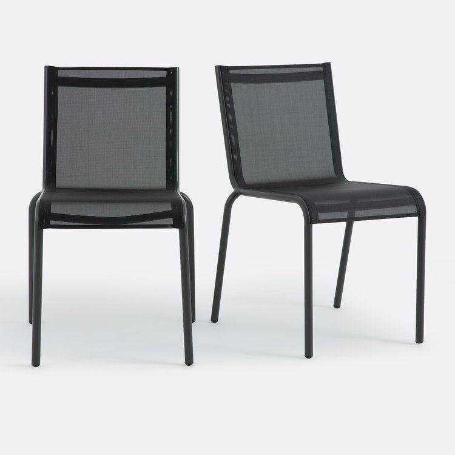
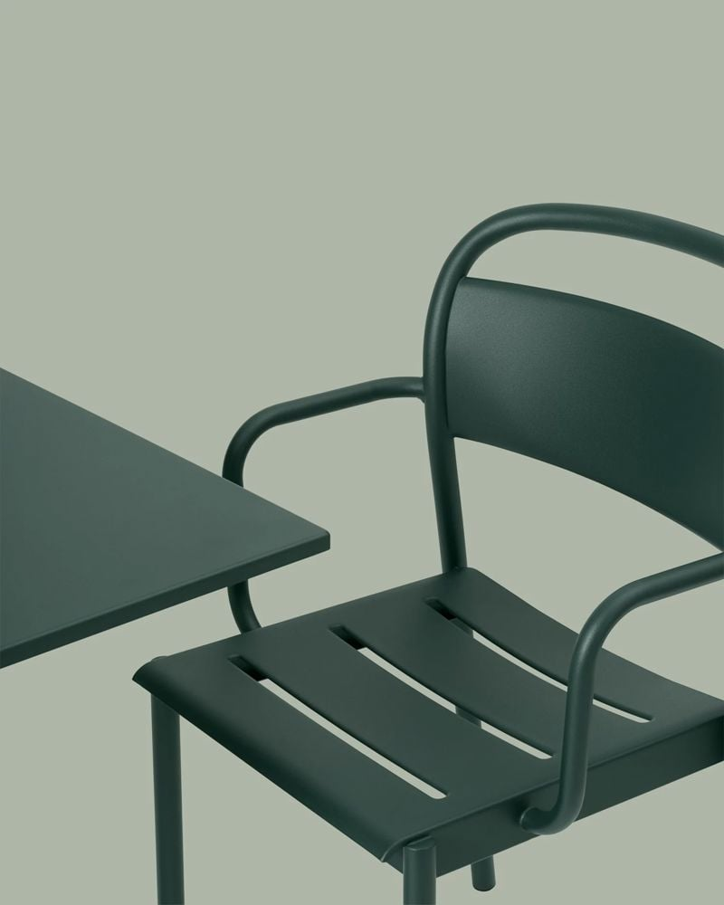
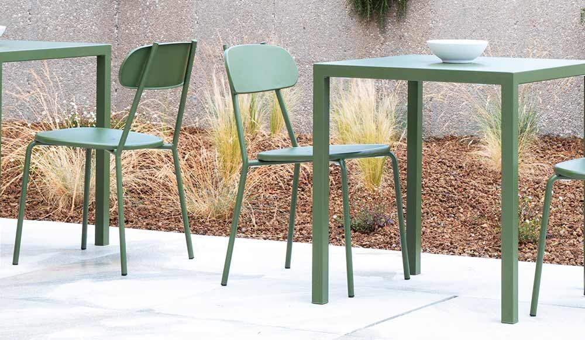
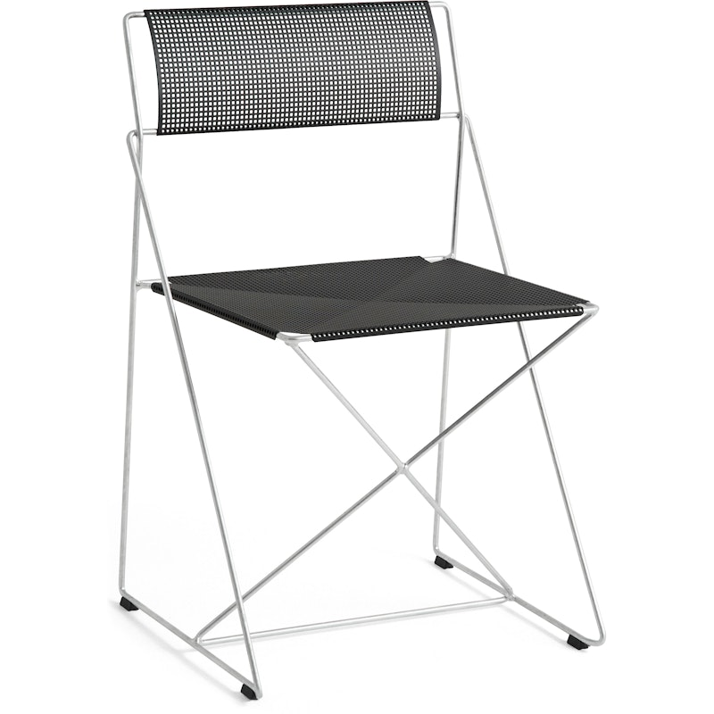
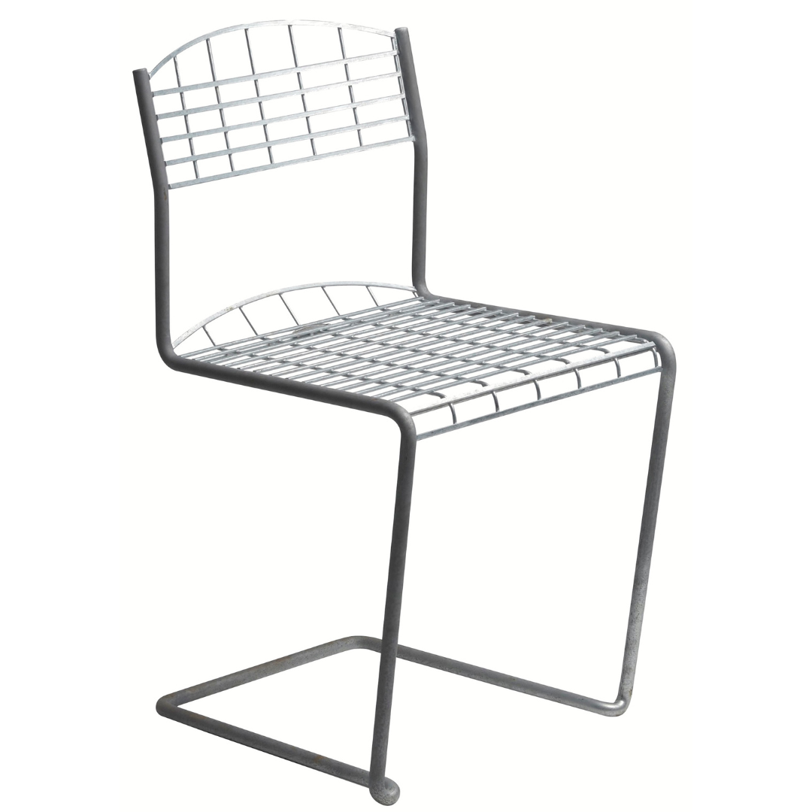
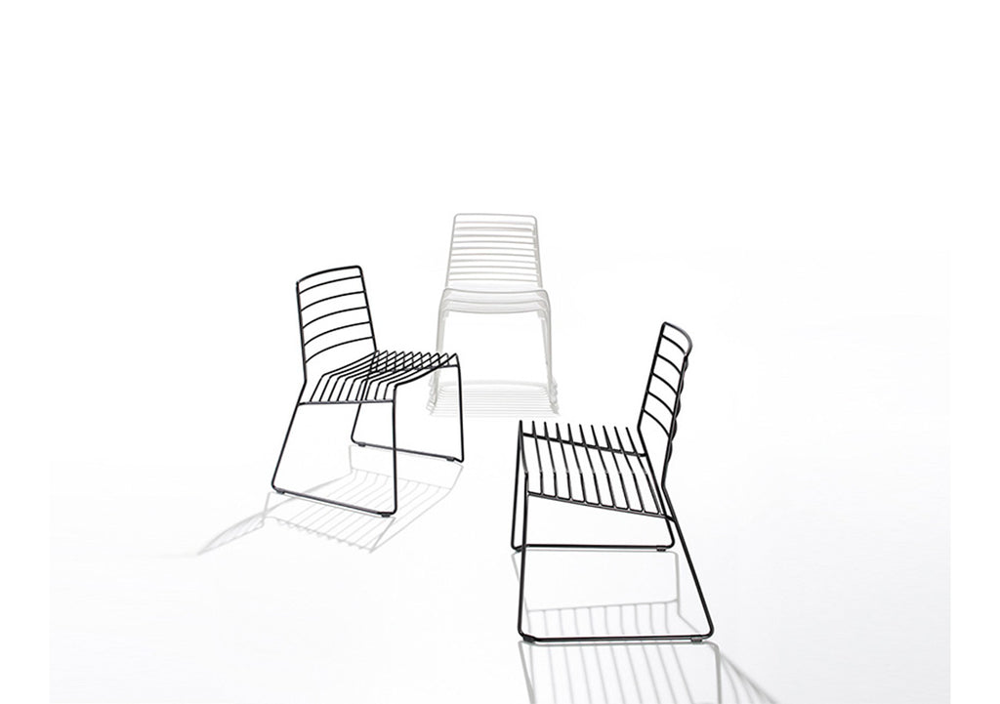
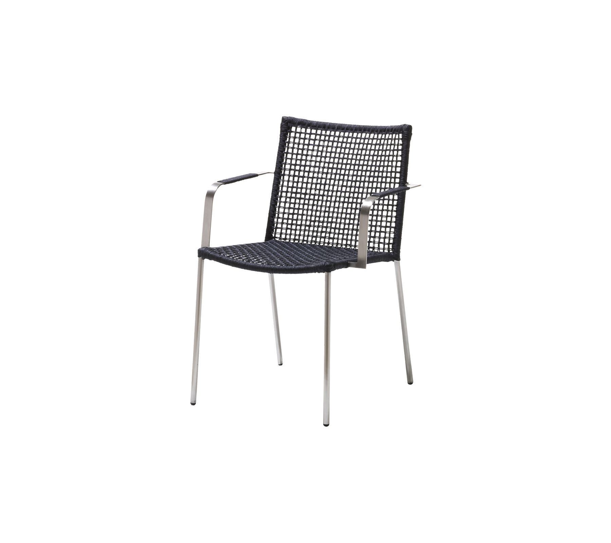

# Roof Terrace — Garden Furniture Options

*Shortlist for the 22 Sussex Square roof terrace (Brighton seafront). Three sections: **Dining tables**, **Dining chairs**, **Sofas & comfy chairs**. Prices captured June 2026 — confirm live before ordering.*

## What we're optimising for
- **Severe coastal exposure** — salt air + high wind. Heavy / corrosion-proof; **teak**, **cast aluminium** or **316 stainless** only — no steel, no thin tube aluminium.
- **Contemporary look** — clean, low, modern lines.
- **Seagull-proof table top** — gulls will foul the dining table, so the **top must be non-porous and wipe-clean**: **ceramic / sintered stone / HPL / glass / powder-coated (or wood-effect) aluminium.** Real **teak/wood tops are porous and stain** from droppings — avoid for the table.
- **Frames out, cushions stored** — only hard frames live outside; all cushions come indoors (storage being built in).
- **Budget** ~£3,000–£6,000 combined.

## Recommended basket (contemporary, dark top, seagull-proof, wind-stable)
| | Item | Price |
|---|---|---|
| **Table** | Maze Maxim — **dark charcoal sintered-stone** top, heavy & wind-stable, table-only | **£1,999** |
| **Chairs** | 10× Teakunique Poppy teak (~8 kg, passes wind) | **£2,050** |
| **Lounge** | Luxus Amalfi Corner teak — or Maluku modular daybed (~£3,000) | **£1,941** |
| | **Total** | **~£5,990** |

Cheaper table alt: **Nardi Rio anthracite** (dark aluminium slat, 54 kg, £1,439) → drops the total to ~£5,430. Both tables are dark, seagull-proof and heavy enough for wind.

---

## How it looks — front-runner pairings

*In our palette: dark table top · anthracite standing-seam wall behind · buff/yellow granite floor · teak Poppy chairs. The teak reads as a warm/cool contrast against the dark top — no clash — and ties to the granite.*

### Maze charcoal stone-top table + Poppy teak chairs

### Nardi Rio anthracite aluminium table + Poppy teak chairs (cleaner, more minimal)

---

# 1 · DINING TABLES

**Extending is a hard rule** — every table here extends. **Contemporary = slim aluminium A-frame/legs. Seagull-proof = a non-porous, wipe-clean top.** Grouped by top material — all stain-proof against droppings. (Real teak/wood tops are dropped: porous, they stain.)

## Metal (aluminium) tops — no rust, drains, wipe clean

### Nardi — Rio ⭐ (aluminium slat top)

- **Price:** £1,439 table-only; extends 210→280cm (~10 seats)
- **Material:** Powder-coated aluminium frame + slatted aluminium top
- **Colour:** Anthracite (dark)
- **Weight:** ~54 kg (unusually heavy for aluminium)

**Pros:**
- Slatted top drains rain/hose instantly; wipe-clean; no seagull residue issue
- 54 kg = very heavy for aluminium — won't blow in normal weather
- Italian contract/commercial-grade; award-winning design

**Cons:**
- One buyer report: top scratches easily; transit-damage claim refused — inspect carefully on delivery
- Order the "Rio Alu" version (not the resin Rio); request Nardi's optional saltwater anti-corrosion treatment

[juliajones.co.uk — Nardi Rio](https://www.juliajones.co.uk/nardi-rio-aluminium-outdoor-extending-dining-table-210-280cm/p2120)

---

### Mobellia — Amalfi (aluminium A-frame)

- **Price:** 10-seat £599 · 12-seat £799
- **Material:** Aluminium A-frame; teak-look composite top (confirm not real wood)
- **Colour:** White or anthracite frame

**Pros:**
- Lowest price; tool-free extension; modern A-frame look

**Cons:**
- ⚠ Confirm the top is **aluminium/composite, not real wood** (wood tops stain from gulls)
- Light build — ballast against wind

[mobellia.com — extending tables](https://www.mobellia.com/en-gb/collections/extending-table)

---

## Stone tops — sintered stone / ceramic — ultra stain & scratch-proof

### Maze — Maxim ⭐ (sintered-stone top)

- **Price:** £1,999 table-only; extends 8→12 seats
- **Material:** Aluminium frame + sintered-stone top
- **Colour:** Charcoal (dark)

**Pros:**
- Sintered stone = toughest, most stain-proof surface going; seagull-proof
- Heavy stone top = the most wind-stable table on this list
- Rare: sold **table-only** — pick any chairs you like
- ⭐ Best all-round choice for the seafront

**Cons:**
- Known delivery-damage risk on stone edges (chip in transit) — inspect on arrival
- Narrow warranty (structural + rust only; 48-hr defect window) — confirm stone top is covered in writing

[mazeliving.co.uk — Maze Maxim](https://www.mazeliving.co.uk/product/maze-maxim-extending-aluminium-dining-table)

---

### Maze — Ambition (ceramic top)

- **Price:** £3,349 (table + 10 chairs — only sold as a full set)
- **Material:** Aluminium frame + ceramic top

**Pros:**
- Ceramic top is stain/scratch-proof

**Cons:**
- **Not available table-only** — if you want a stone/ceramic top without the chairs, the Maxim above is the one

[mazeliving.co.uk — Maze Ambition](https://www.mazeliving.co.uk/product/maze-ambition-10-seat-extending-dining-set/colour/oatmeal-with-grey-frame)

---

### Bramblecrest — Sofia ⭐ (dark ceramic X-leg, best value)

- **Price:** £1,799 for table + 10 chairs
- **Material:** Aluminium X-leg frame + dark anthracite ceramic top
- **Colour:** Anthracite

**Pros:**
- ⭐ Excellent value — dark ceramic top + sculptural X-base + 10 chairs for £1,799
- Dark anthracite ties directly to the palette
- Take the table and pair with better chairs of your choice

**Cons:**
- Sold as a set only (not table-only)

[crownhillgarden.com — Bramblecrest Sofia](https://crownhillgarden.com/product/bramblecrest-sofia-aluminium-10-seat-patio-set-with-x-leg-extending-table-and-10-chairs-in-anthracite/)

*Other dark-ceramic alternatives:* **Alexander Rose Rimini** ~£1,293 (table-only, ceramic-glass, mid-grey not charcoal, extends to 300cm) · **Cane-line Drop (Fossil Black)** £5,100 (the deepest dark ceramic — premium reference only).

*Note: most dark-ceramic 10–12-seat extenders only come as full sets. The Maxim is unusual in being sold table-only.*

---

# 2 · DINING CHAIRS

Metal, not wood (wood fights the dark ceramic/stone tops). Affordable, dark, contemporary **aluminium** dining chairs exist in the **contract/hospitality channel** — built for café terraces, won't rust, slatted seats drain. Lightness (~4–6 kg) is managed by the **wind plan** (tuck under the heavy stone table + bring in for storms). Want heavier → duplex-galvanised or hot-galvanised steel (see the steel section below).

---

## ⭐ Front-runners — contract aluminium (dark, contemporary, won't rust, affordable)

### Cafe Reality — Bastille ⭐

- **Price:** £126/chair
- **Material:** Powder-coated marine aluminium
- **Colour:** Charcoal
- **Weight:** ~4–6 kg (unpublished — email to confirm)
- **Arms:** No · **Stackable:** Yes · **Seat:** Vertical slat (drains)

**Pros:**
- Contemporary vertical-slat look — clean and modern
- Coastal-safe aluminium; contract-grade (built for café terraces)
- One of the best value picks on the list

**Cons:**
- Weight unpublished — confirm before ordering
- Light: wind plan applies (tuck under table, bring in for storms)

[cafereality.co.uk — Bastille](https://www.cafereality.co.uk/prod/bastille-outdoor-aluminium-side-chair)

---

### Cafe Reality — Chazey

- **Price:** £114/chair (cheapest on the list)
- **Material:** Powder-coated marine aluminium
- **Colour:** Black / charcoal
- **Weight:** ~4–6 kg (unpublished)
- **Arms:** No · **Stackable:** Yes · **Seat:** Slatted (drains)

**Pros:**
- Cheapest verified coastal-safe chair here
- Clean dark slat look; stackable; aluminium won't rust

**Cons:**
- Weight unpublished — confirm before ordering
- Light: wind plan applies

[cafereality.co.uk — Chazey](https://www.cafereality.co.uk/prod/chazey-outdoor-aluminium-side-chairs)

---

### Sklum — Archer

- **Price:** £89/chair (best price on the list)
- **Material:** Powder-coated marine aluminium
- **Colour:** Anthracite
- **Weight:** ~4–6 kg (unpublished)
- **Arms:** Yes · **Stackable:** Yes · **Seat:** Mesh (drains)

**Pros:**
- Best value by price; includes arms (unusual at this price)
- Mesh seat drains; aluminium won't rust

**Cons:**
- Weight unpublished
- Less refined look than Bastille; light: wind plan applies

[sklum.com — Archer](https://www.sklum.com/uk/buy-garden-chairs/103265-aluminium-stackable-garden-chair-archer.html)

---

## More dark aluminium — verified by eye

### La Redoute — Lyona ⭐

- **Price:** £200/chair (set of 2 = £399.99; ~£130 spotted at Made/Next — worth checking)
- **Material:** Powder-coated marine aluminium
- **Colour:** Matte black
- **Weight:** 3.9 kg (published)
- **Arms:** No · **Stackable:** Yes · **Seat:** Perforated mesh back + slatted seat (drains)

**Pros:**
- The most "design-shop" clean look here — matte-black, slim tapered legs, architectural
- Published weight (3.9 kg) — rare; you know what you're getting
- Stackable; contemporary without being industrial

**Cons:**
- At the top of the budget (£200/chair)
- Lightest of the aluminium picks at 3.9 kg — wind plan most critical here

[laredoute.co.uk — Lyona](https://www.laredoute.co.uk/ppdp/prod-350903799.aspx)

---

### Kave Home — Zaltana ⭐

- **Price:** £145/chair (best value with arms)
- **Material:** Powder-coated marine aluminium
- **Colour:** Anthracite
- **Weight:** Unpublished — email Kave to confirm
- **Arms:** Yes · **Stackable:** Yes · **Seat:** Textilene mesh sling (drains; no cushion needed)

**Pros:**
- Best value arms + contemporary look on the list
- Textilene mesh sling drains and wipes clean; no cushion to store
- Stackable; aluminium won't rust

**Cons:**
- Weight unpublished
- Light: wind plan applies

[kavehome.com — Zaltana](https://kavehome.com/gb/en/p/zaltana-stackable-outdoor-chair-in-aluminium-with-a-matt-dark-grey-painted-finish)

---

### La Redoute — Zory

- **Price:** £155/chair (set of 2 = £309.99)
- **Material:** Powder-coated marine aluminium
- **Colour:** Black
- **Weight:** 2.2 kg (published)
- **Arms:** No · **Stackable:** Yes · **Seat:** Textilene sling (drains)

**Pros:**
- Minimal black textilene sling; stackable; clean and contemporary

**Cons:**
- ⚠ **Lightest on the list at 2.2 kg** — wind plan is critical; must tuck under table whenever unoccupied
- At the top of the budget

[laredoute.co.uk — Zory](https://www.laredoute.co.uk/ppdp/prod-351331322.aspx)

---

### Kave Home — Culip

- **Price:** £179/chair
- **Material:** Powder-coated marine aluminium frame + outdoor cord weave seat
- **Colour:** Black frame + dark grey cord
- **Weight:** Unpublished
- **Arms:** Yes · **Stackable:** Yes · **Seat:** Woven cord (drains; stays out)

**Pros:**
- The Cane-line Lean look at a fraction of the price; arms included; stackable

**Cons:**
- Woven cord seat stays out permanently (not bare metal, not a removable cushion) — flag if you want metal-only seat
- Weight unpublished

[kavehome.com — Culip](https://kavehome.com/gb/en/p/culip-aluminium-and-cord-stackable-outdoor-chair-in-grey)

---

### Kave Home — Joncols

- **Price:** £199/chair (top of budget)
- **Material:** Powder-coated marine aluminium
- **Colour:** Black
- **Weight:** Unpublished
- **Arms:** Yes · **Stackable:** Yes · **Seat:** Horizontal flat-slat back + slatted seat (drains)

**Pros:**
- Clean architectural look — horizontal flat slats, square geometry; arms; stackable

**Cons:**
- At the top of the budget (£199/chair); weight unpublished

[kavehome.com — Joncols](https://kavehome.com/gb/en/p/joncols-stackable-outdoor-chair-in-aluminium-with-grey-painted-finish)

---

### HOUE — Alua ⭐

- **Price:** ~£233/chair (stretch)
- **Material:** Powder-coated marine aluminium
- **Colour:** Black (+ 5 other colours)
- **Weight:** 4.8 kg (published)
- **Arms:** No · **Stackable:** Yes (up to 10) · **Seat:** Curved slatted seat + back (drains)

**Pros:**
- The most refined / architectural aluminium chair here — Danish design; published weight
- Curved slatted form looks genuinely designed, not contract-café
- Stacks 10 high

**Cons:**
- Over budget at ~£233 (stretch price)

[hollowaysofludlow.com — HOUE Alua](https://www.hollowaysofludlow.com/products/houe-alua-dining-chair)

---

## Coastal steel — galvanised

*Contemporary, dark, coastal-safe steel barely exists — almost all "contract metal" chairs are plain mild steel that rusts. These are the genuine finds: all hot-dip galvanised or duplex (galv + powder coat), all verified by eye. Heavier than aluminium; a real bonus if you want more wind resistance.*

### Muuto — Linear Steel side chair ⭐

- **Price:** ~£259/chair (stretch)
- **Material:** **Duplex galvanised + powder-coated steel** (zinc under the colour → dark AND rustproof)
- **Colour:** Anthracite Black (also dark green, dark grey)
- **Weight:** ~7.5 kg
- **Arms:** No · **Stackable:** Yes (×5) · **Seat:** Bare slatted steel (drains)

**Pros:**
- Genuinely dark + genuinely coastal-safe — duplex is the best of both worlds
- 7.5 kg — noticeably heavier than aluminium alternatives; better wind resistance
- Made-to-order quality; minimalist Scandinavian design

**Cons:**
- Over budget at ~£259 (stretch); made-to-order ~5 weeks lead time

[nest.co.uk — Muuto Linear Steel](https://www.nest.co.uk/product/muuto-outdoor-linear-steel-side-chair)

---

### SCAB Design — Si-Si 2503 ⭐

*Note: photo shows a pale colourway — Anthracite (Antracite Opaco) is confirmed available*

- **Price:** £181/chair (arredinitaly.com; sold in pairs)
- **Material:** **Duplex galvanised + powder-coated steel** (galvanised then painted = dark AND rustproof)
- **Colour:** Anthracite (Antracite Opaco) — confirmed
- **Weight:** 8.7 kg (the heaviest chair on this entire list)
- **Arms:** No · **Stackable:** Yes · **Seat:** Pressed/curved steel sheet (wipe-clean)

**Pros:**
- **Heaviest chair on the list at 8.7 kg** — best wind resistance of any non-teak option here
- Duplex galvanised = dark AND coastal-safe; zinc layer survives scratches
- Italian CATAS-certified quality; comfortable pressed steel seat wipes clean
- Just under budget at £181

**Cons:**
- European supplier (arredinitaly.com) — confirm UK delivery lead time before ordering

[arredinitaly.com — SCAB Si-Si 2503](https://www.arredinitaly.com/gb/metal-chairs/13893-si-si-2503-chairs-scab-design.html)

---

### Vermobil — Fox

- **Price:** £167/chair (deluxdeco.co.uk)
- **Material:** Galvanised steel + thermosetting powder coat (qualicoat-rated — confirm duplex with supplier)
- **Colour:** Anthracite
- **Weight:** Unpublished — confirm with supplier
- **Arms:** No · **Stackable:** Yes · **Seat:** Smooth pressed steel seat pan (wipe-clean)

**Pros:**
- Under budget at £167; contemporary clean lines
- Galvanised frame = coastal-safe base; anthracite powder coat over galv = likely duplex
- Made in Italy; stackable

**Cons:**
- Weight unpublished — confirm before ordering
- ⚠ **Confirm explicitly that it's duplex** (galv-then-powder, not just powder-over-mild-steel) with deluxdeco/Vermobil in writing before treating as coastal-safe

[deluxdeco.co.uk — Vermobil Fox](https://www.deluxdeco.co.uk/fox-chair.html)

---

### Vermobil — Mogan

- **Price:** £185/chair (deluxdeco.co.uk; RRP £247)
- **Material:** Galvanised steel + powder coat (confirm duplex with supplier)
- **Colour:** Anthracite
- **Weight:** Unpublished — confirm with supplier
- **Arms:** No · **Stackable:** Yes · **Seat:** Square-back horizontal slatted steel (drains)

**Pros:**
- Clean square-back rail design — geometric and architectural
- Under budget at £185 (good saving on the £247 RRP); galvanised for coastal resistance
- Made in Italy; stackable

**Cons:**
- Weight unpublished — confirm before ordering
- ⚠ Confirm duplex spec with supplier in writing

[deluxdeco.co.uk — Vermobil Mogan](https://www.deluxdeco.co.uk/mogan-chair.html)

---

### HAY — X-Line Chair (hot-galvanised silver)

- **Price:** ~£226/chair (stretch)
- **Material:** Hot-dip galvanised steel frame (silver) + powder-coated perforated steel seat/back panel
- **Colour:** Silver galvanised frame + **black** perforated panel (also other panel colours)
- **Weight:** ~4–5 kg (unpublished; slim wire frame)
- **Arms:** No · **Stackable:** Yes (×10) · **Seat:** Perforated steel panel (drains)

**Pros:**
- Design classic (1977) — genuinely architectural, not café/Tolix
- True hot-dip galvanised frame = maintenance-free coastal finish
- Stacks ×10; perforated seat wipes clean and drains

**Cons:**
- Over budget at ~£226 (stretch)
- Frame is silver (not dark) — the black panel adds contrast, but the frame itself is bare galvanised silver

[royaldesign.co.uk — HAY X-Line](https://royaldesign.co.uk/x-line-chair-hot-galvanized-steel-powder-coated)

---

### Grythyttan Stålmöbler — High Tech Chair (hot-galvanised silver)

- **Price:** ~£175/chair (SCP or Holloways of Ludlow)
- **Material:** Hot-dip galvanised steel (wire cantilever/sled frame + wire grid seat)
- **Colour:** Bare hot-galvanised silver (also available powder-coated in other colours, but galv is the coastal-safe version)
- **Weight:** ~7 kg
- **Arms:** No · **Stackable:** Yes · **Seat:** Wire grid (drains perfectly)

**Pros:**
- True hot-dip galvanised = genuinely coastal-safe; maintenance-free zinc finish
- ~7 kg — good wind resistance for a non-teak chair
- Swedish design classic (1984); cantilever sled form is timeless and instantly recognisable
- Wire grid seat drains instantly; comfortable with or without a cushion
- Two reputable UK stockists (SCP + Holloways)

**Cons:**
- Silver (not dark) — the bare galvanised look. Powder-coated colours are available, but for coastal confidence the plain hot-galv is the correct finish
- Cantilever sled needs a stable, level surface

[scp.co.uk — Grythyttan High Tech](https://www.scp.co.uk/products/high-tech-chair) · [hollowaysofludlow.com](https://www.hollowaysofludlow.com/products/grythyttan-stalmobler-outdoor-high-tech-chair)

---

## Steel — reference only (premium / border-of-budget)

*Not primary recommendations — flagged for awareness.*

### SCAB Design — Summer

- **Price:** ~£148/chair (tecnoarredo3.co.uk)
- **Material:** Duplex galvanised + powder-coated steel (horizontal wire-rod construction)
- **Weight:** Unpublished

**Pros:** Duplex galvanised (dark AND coastal-safe); affordable; clean horizontal wire-rod look

**Cons:** Wire-rod form more industrial than the Si-Si or Vermobil options; check it suits the look

[tecnoarredo3.co.uk — SCAB Summer](https://www.tecnoarredo3.co.uk/summer-chair-scab)

---

### B-Line — Park (reference, premium)

- **Price:** ~£455 (reference only — over budget)
- **Material:** Duplex galvanised steel; wire sled base

**Pros:** Duplex galvanised; iconic sled-base wire design · **Cons:** Well over budget — reference only

---

### Cane-line — Straw (reference, premium)

- **Price:** ~£600 (reference only — over budget)
- **Material:** Stainless steel legs + cord seat (confirm stainless grade — ask UK stockist for 316 in writing)

**Pros:** Elegant cord + stainless combination; the aspiration look at premium price · **Cons:** Well over budget; stainless grade unconfirmed

---

## Heavier options — ruled out on looks
*Duplex-galvanised gun-metal café chairs (Bolero/LeisureBench), Jati teak-on-galvanised (12–15 kg), Lazy Susan cast aluminium — all out on look. So it's the light aluminium above **+ the wind plan**, or the heavier steel picks above.*

## Premium aluminium — reference only
- **Cane-line Lean** (£375–490, **6.45 kg**, black weave + aluminium — lovely, heaviest aluminium chair found, but ~£4–6k for 10–12)
- **Pedrali Intrigo** (~£250, 5.5 kg, anthracite die-cast aluminium)
- **Fermob Bellevie** (£695, 19.5 kg — the only dark + genuinely heavy + aluminium; priced out at scale)

**Steer:** for value go **Cafe Reality Bastille (£126)** or **Chazey (£114)**. For dark + heavy + coastal-safe steel go **SCAB Si-Si (£181, 8.7 kg)** — the standout. For a design icon in silver: **Grythyttan High Tech (~£175, ~7 kg)** or **HAY X-Line (~£226)**. For the stretch: **Muuto Linear Steel (£259, 7.5 kg)** is the only dark + duplex + genuinely contemporary steel chair on the list.

*Swyft Garden Dining Chair 01 (£140) — same nice aluminium-slat look, but **olive/taupe only, no dark**; currently sold out; and Swyft's table is fixed ~6–8 seats (no extending). Doesn't fit the brief.*

---

# 3 · SOFAS & COMFY CHAIRS

**Daybed key:** ✅✅ push modules into a bed · ✅ pieces combine into a daybed · ◐ reconfigures (L/R, splits) but not flat.

### Luxus — Amalfi Corner Teak ⭐

- **Price:** £1,941 (was £2,999)
- **Material:** Solid teak
- **Modularity:** ◐ — customisable L-shape

**Pros:**
- Sleek low modern profile; excellent value at sale price
- Solid teak = coastal-proof; frames left out indefinitely

**Cons:**
- Not a true daybed (◐ — L-shape only, doesn't flatten into a bed)

[luxushomeandgarden.com — Amalfi Corner](https://www.luxushomeandgarden.com/products/amalfi-corner-teak-sofa-and-table-set)

---

### Teakunique — Maluku II Modular ⭐ (best for a daybed)

- **Price:** £825/corner module; full set ≈ £2,500–£3,500
- **Material:** Solid teak
- **Modularity:** ✅✅ — ottomans push together into a true flat daybed

**Pros:**
- Best daybed option on the list
- Solid teak = outdoor/coastal-proof; modular — scale to budget

**Cons:**
- Expensive at full set cost; no independent review base — order a sample first to check teak grade

[teakunique.co.uk — Maluku II](https://teakunique.co.uk/products/maluku-modular-sofa-corner-section)

---

### 4 Seasons Outdoor — Piacenza ⭐ (mid-price)

- **Price:** £2,499
- **Material:** Dark aluminium frame + rope detailing; light cushions (store indoors)
- **Modularity:** ✅ — rounded chaise end to stretch out

**Pros:**
- Reputable brand, in stock; dark aluminium frame ties to the palette
- Rounded chaise for lounging; cushions storable

**Cons:**
- Not a flat daybed

[themodernfurniturecompany.com — 4 Seasons Piacenza](https://themodernfurniturecompany.com/collections/outdoor-sofas)

---

### 4 Seasons Outdoor — Alicante (sofa + chairs + stools combo)

- **Price:** £2,699 (sofa + 2 armchairs + footstools + coffee table)
- **Material:** Dark aluminium frame + rope; light cushions
- **Modularity:** ◐ — footstools nudge together for a lounger

**Pros:**
- Complete set; great sociable layout with armchairs + footstools
- Dark frame; cushions storable

**Cons:**
- Not a flat daybed

[themodernfurniturecompany.com — 4 Seasons Alicante](https://themodernfurniturecompany.com/collections/outdoor-sofas)

---

### Sherborne — Teak Corner (value classic)

- **Price:** £1,499 (5-seat corner + coffee table)
- **Material:** Grade A teak; made in England
- **Modularity:** ◐ — chaise clamps L/R

**Pros:**
- Excellent value for solid teak; UK-made
- Solid teak = coastal-proof

**Cons:**
- High-back classic style — not the low modern look of the Amalfi/Maluku
- Not a true daybed

[gardenbenches.com — Sherborne Teak Corner](https://www.gardenbenches.com/wooden-garden-corner-sofa-sets)

---

### Maze — Eve Corner ⭐ (value, dark frame)

- **Price:** £1,985
- **Material:** Slim charcoal aluminium frame; fabric cushions (store indoors)
- **Modularity:** ◐ — arms convert to side tables; reconfigurable

**Pros:**
- Dark charcoal aluminium ties straight into the palette
- Modern low profile; arms convert to side tables; in stock

**Cons:**
- Not a flat daybed

[outdoorluxeonline.com — Maze Eve](https://outdoorluxeonline.com/products/maze-outdoor-fabric-eve-corner-group-charcoa)

---

### Tribu — Mood (premium teak)

- **Price:** £2,560
- **Material:** A-grade teak frame + woven Tricord
- **Modularity:** ◐

**Pros:**
- Premium Belgian design; low minimalist profile
- Teak + cord combination is handsome and coastal-durable

**Cons:**
- Premium price; cord weave seat is fixed (confirm it drains)

[gomodern.co.uk — Tribu Mood](https://www.gomodern.co.uk/tribu-mood-garden-sofa.html)

---

### Cane-line — Space (premium reference — the aspiration look)

- **Price:** ~£4,470/module (a full set is well over budget)
- **Material:** Slim dark aluminium base + integrated teak table + light cushions

**Pros:**
- Very low modern modular daybed; dark/teak palette match is perfect; the look to aim for

**Cons:**
- Well over budget — reference only. The Piacenza and Maluku get a similar low-modular look for far less

[worm.co.uk — Cane-line Space](https://www.worm.co.uk/products/space-daybed-module-with-teak-table-left)

*More options (not pictured):* Fast Aikana aluminium daybed (£3,330, Go Modern) · Heal's Eos modular (£1,808) · Skagerak Tradition teak modular (~£1,865/module) · Emu Tami matt-black aluminium (£3,170).

---

## Build quality — independent checks

- **Nardi Rio** — Italian contract/commercial-grade; well-regarded by the trade. But almost no independent buyer reviews, and one report of **the top scratching easily** + a **refused transit-damage claim**. **Do:** order the "Rio Alu" (not the resin Rio); request Nardi's optional saltwater anti-corrosion treatment; get warranty + delivery-damage cover in writing; inspect on arrival.
- **Teakunique Poppy** — small UK family firm; **strong 10-year warranty**. No complaint cluster — but no independent review base; "Grade A teak" is self-asserted. **Do:** order a sample first.
- **Maze (Maxim/Ambition)** — Trustpilot ~4.3/5 (≈9,000 reviews), but a real tail of complaints: **delivery damage / chipped stone tops**, **powder-coat peeling**, slow replacement parts, **narrow warranty** (structural + rust only; 48-hr defect window). **Do:** confirm the stone top is covered in writing; inspect on arrival.

**Bottom line:** Nardi Rio and the Teakunique chairs are sound coastal choices *with conditions*. The Maxim is good value but has a known delivery-damage risk on the stone — inspect on arrival or consider the Bramblecrest Sofia. On all aluminium pieces the weak point at the seafront is the powder coating — inspect for chips on delivery and rinse salt off periodically.

## Timing & checklist
- **Buy in the Aug–Sept clearance** (fit-out completes late Sept 2026) — best discounts on aluminium/rope sets; teak specialists barely move seasonally.
- [ ] Confirm the table's **top is non-porous** (ceramic/HPL/aluminium) and its **largest size seats 10–12**.
- [ ] Confirm sofa cushions are **Olefin/Sunbrella + quick-dry foam**; frames have a slatted base so they look right with cushions off.
- [ ] **Ballast/anchor** big pieces + the aluminium table against wind (no roof penetration — coordinate with Ronan).
- [ ] Order **samples** before committing.
- [ ] For Vermobil Fox/Mogan: **confirm duplex galvanising in writing** with deluxdeco/Vermobil before ordering.
- [ ] For SCAB Si-Si: confirm UK delivery lead time with arredinitaly.com.
