

# Roof Terrace — Garden Furniture Options

*Shortlist for the 22 Sussex Square roof terrace (Brighton seafront). Three sections: **Dining tables**, **Dining chairs**, **Sofas & comfy chairs**. Prices captured June 2026 — confirm live before ordering.*

---

## Contents

**[What we're optimising for](#optimising)** · **[Recommended basket](#basket)** · **[How it looks](#looks)**

**[1 · Dining Tables](#tables)**
- Metal tops: [Nardi Rio £1,439](#nardi-rio) · [Mobellia Amalfi £599–799](#mobellia-amalfi) · [Vermobil Extia £1,333 ⭐](#extia)
- Stone tops: [Bramblecrest Sofia £1,799 ⭐](#bramblecrest-sofia)
- Teak top: [Maze Jakarta £1,059 ⭐](#maze-jakarta)

**[2 · Dining Chairs](#chairs)**
- **With arms:** [Zaltana £145 ⭐](#zaltana) · [Fox armchair £177 ⭐](#fox) · [Culip £179](#culip) · [Joncols £199](#joncols) · [Twist armchair £209 ⭐](#twist) · [Daisy armchair ~£209+ ⭐](#daisy)
- **Without arms:** [Chazey £114](#chazey) · [Bastille £126 ⭐](#bastille) · [Summer £148 ⭐](#summer) · [Fox side chair £167 ⭐](#fox) · [Si-Si £181 ⭐](#si-si) · [Mogan £185](#mogan) · [Lyona £200 ⭐](#lyona) · [Alua £233 ⭐](#alua)
- **Teak — Route A:** [Cyan Vero £125 ⭐](#teak-vero) · [Cyan Sora £125](#teak-sora) · [Eterna Oxford £149](#teak-oxford) · [B&S Semeru £169 ⭐](#teak-semeru) · [Treviso £260](#teak-treviso) · [4S Julia £360](#teak-julia) · [Skagerak Plank £619 ⭐](#teak-plank) · [Cane-line Grace £1,005](#teak-grace) · [Tribu Kos £1,220](#teak-kos)

**[3 · Sofas & comfy chairs](#sofas)**
- [Sherborne £1,499](#sherborne) · [Luxus Amalfi £1,941 ⭐](#luxus-amalfi) · [Maze Eve £1,985 ⭐](#maze-eve) · [4S Piacenza £2,499 ⭐](#piacenza) · [Teakunique Maluku £825/mod ⭐](#maluku) · [Tribu Mood £2,560](#tribu-mood) · [4S Alicante £2,699](#alicante) · [Cane-line Space (ref)](#cane-line-space)

**[Heat science — colour limits by material](#heat-science)** · **[Timing & checklist](#checklist)**

---

## What we're optimising for
- **Severe coastal exposure** — salt air + high wind. Heavy / corrosion-proof; **teak**, **cast aluminium** or **316 stainless** only — no steel, no thin tube aluminium.
- **Contemporary look** — clean, low, modern lines.
- **Seagull-proof table top** — gulls will foul the dining table, so the **top must be non-porous and wipe-clean**: **ceramic / sintered stone / HPL / glass / powder-coated (or wood-effect) aluminium.** Real **teak/wood tops are porous and stain** from droppings — avoid for the table.
- **Frames out, cushions stored** — only hard frames live outside; all cushions come indoors (storage being built in).
- **Budget** ~£3,000–£6,000 combined.

[↑ Contents](#contents)

---

## Recommended basket (contemporary, dark top, seagull-proof, wind-stable)
| | Item | Price |
|---|---|---|
| **Table** | Bramblecrest Sofia — **dark anthracite ceramic** top, X-leg, table + 10 chairs | **£1,799** |
| **Chairs** | Included with Sofia — or upgrade to Si-Si/Twist/Fox in preferred colour | **£0–£2,090** |
| **Lounge** | Luxus Amalfi Corner teak — or Maluku modular daybed (~£3,000) | **£1,941** |
| | **Total (table + included chairs + lounge)** | **~£3,740** |

Teak alt: **Maze Jakarta** (warm teak top, dark grey frame, £1,059) + teak chairs (10× Poppy ~£2,050) + lounge → ~£5,050. Stone alt: **Bramblecrest** as above. Metal alt: **Extia + Daisy Rope armchairs** for a warm/light beige/tortora look.

[↑ Contents](#contents)

---

## How it looks — the options

### Route B — Bramblecrest Sofia stone table + SCAB Si-Si chairs (no cushions)

### Route B — Bramblecrest Sofia stone table + SCAB Si-Si chairs (with cushions)

### Route A — Teak table + Poppy teak chairs aged to silver-grey (zero maintenance, honest look)

### Vermobil — Extia steel table (Beige) + Daisy Rope armchairs

### Nardi Rio (Tortora) + Daisy Rope armchairs (Beige) — warm tone-on-tone

[↑ Contents](#contents)

---

# 1 · Dining Tables

**Extending is a hard rule** — every table here extends. **Contemporary = slim aluminium A-frame/legs. Seagull-proof = a non-porous, wipe-clean top.** Grouped by top material — all stain-proof against droppings. (Real teak/wood tops are dropped: porous, they stain.)

---

## Metal (aluminium) tops — no rust, drains, wipe clean

### Nardi — Rio ⭐ (aluminium slat top)

*Photo: Tortora (warm greige/taupe) — the preferred colour. Also available in Anthracite and Bianco.*

- **Price:** £1,439 table-only
- **Size:** 210×100cm → **280×100cm** (extends, ~10 seats) · H76cm
- **Material:** Powder-coated aluminium frame + slatted aluminium top
- **Colour:** **Tortora** (warm greige, preferred) · Bianco (white) · Anthracite — 3 options
- **Heat safety (slatted aluminium):** ✅ Bianco · ✅ Tortora · ⚠ Anthracite (hot on still days — slatted gaps help a little; Brighton breeze usually compensates)
- **Weight:** ~54 kg (unusually heavy for aluminium)
- **Reviews:** juliajones.co.uk — not independently checked on Trustpilot; established UK specialist outdoor furniture retailer. Nardi is Italian contract/commercial-grade, award-winning — well-regarded by the trade.

**Pros:**
- Slatted top drains rain/hose instantly; wipe-clean; seagull-proof
- 54 kg = very heavy for aluminium; won't blow in normal weather
- Italian contract grade

**Cons:**
- One buyer report: top scratches easily; transit-damage claim refused — inspect carefully on delivery
- Order the "Rio Alu" version (not the resin Rio); request Nardi's optional saltwater anti-corrosion treatment

[juliajones.co.uk — Nardi Rio](https://www.juliajones.co.uk/nardi-rio-aluminium-outdoor-extending-dining-table-210-280cm/p2120)

[↑ Tables](#tables) · [↑ Contents](#contents)

---

### Mobellia — Amalfi (aluminium A-frame)

*Photo: white frame + taupe top (recommended combination — ✅ heat safe and warm look).*

- **Price:** 10-seat £599 · 12-seat £799
- **Size:** **⭐ Preferred: 10-seat 200→260×96cm** (fits ≤220cm compact constraint) · 12-seat 240→300×96cm · H75cm
- **Material:** Aluminium A-frame; **cemented composite top** (non-porous, wipe-clean — confirmed from Mobellia's site)
- **Colour:** Anthracite frame · White frame; top in **anthracite, taupe, or wood-effect** — 4 combinations
- **Heat safety (solid aluminium/composite top):** ✅ White frame + taupe top · ✅ White frame + wood-effect top · ⚠ White frame + anthracite top (top still gets hot despite pale frame) · ❌ Anthracite frame + anthracite top
- **Reviews:** mobellia.com — not independently verified on Trustpilot; online-only retailer; check returns policy before ordering.

**Pros:**
- Lowest price by far; tool-free extension; modern A-frame look
- Composite top is seagull-proof (non-porous)
- **Starts at 200cm** — fits when you need it compact

**Cons:**
- Light build — ballast against wind
- No independent review base found

[mobellia.com — Amalfi 10-seat (200→260cm)](https://www.mobellia.com/en-gb/products/automatic-extendable-garden-table-10-seats-aluminium-amalfi-200-260x96?variant=56303906750812)

[↑ Tables](#tables) · [↑ Contents](#contents)

---

### Vermobil — Extia ⭐ (steel flat top — matches Fox & Twist palette)

*Fox armchairs at the Extia table — same Vermobil collection, perfectly matched.*

*Fox side chairs at the Extia table in Grey Mud (olive/sage) — same design, 7 shared colour options.*

- **Price:** £1,333 (from £1,778 — 25% off) table-only
- **Size:** Size 1: 140→200×80cm · **Size 2: 180→250×90cm** (preferred — more width and length for 8–10 seats)
- **Material:** **Duplex galvanised + qualicoat powder-coated steel** — same coastal-safe construction as the Fox & Si-Si chairs
- **Top:** Solid flat steel — wipe-clean, seagull-proof ✓
- **Colour:** **7 options — identical palette to Fox chairs and Twist armchair**: Black NE · Grey Mud FA · Ancient Grey AG · Ivory White BS · Matt White BCU · Bronzo BRO · Beige BE (see swatch below)
- **Heat safety (solid steel top — strictest rule):** ✅ Ivory White BS · ✅ Matt White BCU · ✅ Beige BE · ⚠ Ancient Grey AG (borderline — likely fine with Brighton coastal breeze) · ❌ Black NE · ❌ Bronzo BRO · ❌ Grey Mud FA
- **Weight:** Not published — steel construction likely heavier than aluminium alts ✓
- **Reviews:** deluxdeco.co.uk — **5.0/5 Trustpilot (235 reviews).** Same retailer as Fox; excellent service.
- **Lead time:** 6–10 weeks (made to order)
- **Guarantee:** 10-year frame

*Shared colour palette — Fox chairs, Twist armchair, and Extia table all available in these 7 finishes.*

**Pros:**
- ⭐ **Designed as a matched set** with Fox chairs and Twist armchair — table and chairs in identical colour, from one supplier
- Duplex galv construction = dark colours + coastal-safe (zinc under every chip)
- Solid flat top = completely seagull-proof, wipe-clean
- Both sizes start ≤220cm compact ✓
- 10-year guarantee; excellent retailer

**Cons:**
- Steel top gets hot in direct sun — **choose Ivory, Matt White, Beige or Ancient Grey** (see Heat safety above); darker colours will be uncomfortable to rest arms on
- Size 2 at 250cm extended seats 8–10; confirm 10 chairs fit comfortably (armchairs need more room per seat)
- 6–10 week lead time — order before August for September fit-out
- Weight not published; confirm it's heavy enough to resist wind without ballasting

[deluxdeco.co.uk — Extia extendable table](https://www.deluxdeco.co.uk/extia-extendable-table.html)

[↑ Tables](#tables) · [↑ Contents](#contents)

---

## Stone tops — sintered stone / ceramic — ultra stain & scratch-proof

### Bramblecrest — Sofia ⭐ (dark ceramic X-leg, best value)

- **Price:** £1,799 for table + 10 chairs
- **Size:** Extending X-leg table; standard Sofia tables run 165–200×95cm (6–8 seats); 10-seat extending version — ⚠ **exact extended dimensions not published online; confirm with Crownhill or Bramblecrest before ordering**
- **Material:** Aluminium X-leg frame + dark anthracite ceramic top
- **Colour:** Anthracite
- **Heat safety (ceramic top — most lenient):** ✅ Anthracite ceramic is comfortable to touch — ceramic's low thermal effusivity means it doesn't burn even when hot
- **Reviews:** Bramblecrest brand — **4.5/5 Trustpilot (4,600+ reviews), 5-year structural guarantee.** One of the better-reviewed brands here. Strong customer service.

**Pros:**
- ⭐ Excellent value — dark ceramic top + sculptural X-base + 10 chairs for £1,799
- Dark anthracite ties directly to the palette
- Take the table and pair with better chairs of your choice

**Cons:**
- Sold as a set only (not table-only)
- ⚠ Exact extended dimensions not published — **confirm before ordering**

[crownhillgarden.com — Bramblecrest Sofia](https://crownhillgarden.com/product/bramblecrest-sofia-aluminium-10-seat-patio-set-with-x-leg-extending-table-and-10-chairs-in-anthracite/)

*Other dark-ceramic alternatives:* **Alexander Rose Rimini** ~£1,293 (table-only, ceramic-glass, mid-grey not charcoal, extends to 300cm) · **Cane-line Drop (Fossil Black)** £5,100 (the deepest dark ceramic — premium reference only).

[↑ Tables](#tables) · [↑ Contents](#contents)

---

## Teak top — warm, natural, pairs with both teak and metal chairs

### Maze — Jakarta ⭐ (teak slat top + dark grey aluminium frame)

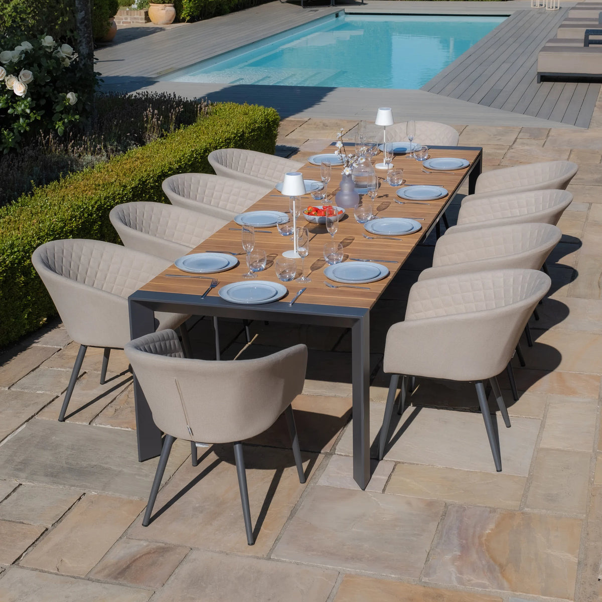

*Photo shown extended with upholstered chairs — the table top and dark grey frame are the point.*

- **Price:** £1,059 table-only (from [mazeliving.co.uk](https://www.mazeliving.co.uk/product/maze-jakarta-10-seat-extending-dining-table-teak-grey-frame))
- **Size:** **200×100cm → 260×100cm → 320×100cm** (three-step extension, 6→8→10 seats) · H75cm · ✓ **Starts at 200cm — fits the ≤220cm compact constraint**
- **Material:** Dark grey powder-coated aluminium frame + **solid teak slat top**
- **Colour:** Single option — warm teak top + dark grey frame
- **Heat safety:** ✅ Teak top stays comfortable at any temperature (very low thermal effusivity — like wood). Grey aluminium frame is on the underside/legs — not a contact surface.
- **Teak top note:** Teak is porous — seagull droppings must be wiped promptly or they can stain. With regular wiping (which you'd do anyway), entirely manageable. Top will silver to a warm grey patina if not oiled; apply teak oil once a season to maintain the warm honey colour.
- **Weight:** Not published — solid teak + aluminium frame will be substantially heavier than all-aluminium alts ✓
- **Reviews:** mazeliving.co.uk — **~9,600 Trustpilot reviews, mixed.** Strong on contemporary ranges; known delivery-damage risk on larger items — inspect carefully on arrival.

**Pros:**
- ⭐ **Bridges Route A and Route B** — warm teak top looks natural with teak chairs OR with dark/beige metal chairs
- Dark grey frame is contemporary and contrasts beautifully with the warm teak
- Competitive price vs other stone/ceramic tables
- Three-step extension; 200cm compact ✓

**Cons:**
- Teak top requires prompt wiping of bird fouling (seagulls) — less forgiving than ceramic/sintered stone
- Teak grade not specified in spec sheets — confirm Grade A / FSC before ordering
- Mixed Maze delivery reviews — inspect on arrival

[mazeliving.co.uk — Maze Jakarta](https://www.mazeliving.co.uk/product/maze-jakarta-10-seat-extending-dining-table-teak-grey-frame)

[↑ Tables](#tables) · [↑ Contents](#contents)

---

# 2 · Dining Chairs

Two routes. **Route B = metal** (this group, below): aluminium won't rust; steel needs to be **duplex galvanised** (zinc under the colour, survives chips) or **316 stainless**; all seats bare metal — wipe-clean, drain, no fixed cushions. **Route A = teak** is a separate group further down → [Teak dining chairs — Route A](#teak-chairs).

**Chairs with arms** (Alex's preference): [Zaltana £145](#zaltana) · [Fox armchair £177](#fox) · [Culip £179](#culip) · [Joncols £199](#joncols) · [Twist armchair £209](#twist) · [Daisy armchair ~£209+](#daisy). Any of these mix well with the armless versions from the same brand/palette.

---

### Cafe Reality — Chazey · £114

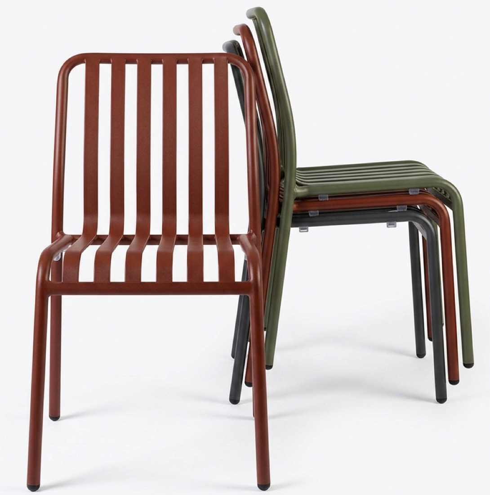

*Photo shows multiple Chazey colourways stacked — grey/anthracite is the rightmost dark chair in the stack. Cafe Reality site is Cloudflare-blocked so a standalone grey shot couldn't be retrieved; contact them to confirm grey availability.*

- **Price:** £114/chair
- **Material:** Powder-coated marine aluminium
- **Colour:** Black / charcoal / grey (confirm availability with Cafe Reality) · **Heat safety (slatted aluminium):** ✅ Grey · ⚠ Charcoal · ❌ Black · **Weight:** ~4–6 kg (unpublished) · **Arms:** No · **Stackable:** Yes · **Seat:** Slatted (drains)
- **Reviews:** cafereality.co.uk — **no independent Trustpilot listing found**; reviews self-hosted. Established UK contract/hospitality supplier serving cafés and restaurants. No red flags.

**Pros:** Cheapest coastal-safe chair here; clean dark slat look; stackable · **Cons:** No independent review verification; light (wind plan applies)

[cafereality.co.uk — Chazey](https://www.cafereality.co.uk/prod/chazey-outdoor-aluminium-side-chairs)

[↑ Chairs](#chairs) · [↑ Contents](#contents)

---

### Cafe Reality — Bastille ⭐ · £126

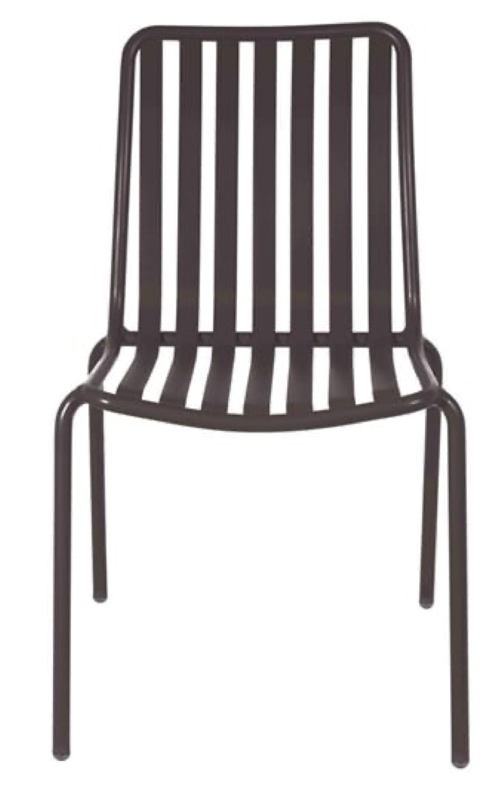

- **Price:** £126/chair
- **Material:** Powder-coated marine aluminium
- **Colour:** Charcoal (single colour) · **Heat safety (slatted aluminium):** ⚠ Charcoal — warm on still sunny days; slatted gaps and coastal breeze usually keep it acceptable · **Weight:** ~4–6 kg (unpublished) · **Arms:** No · **Stackable:** Yes · **Seat:** Vertical slat (drains)
- **Reviews:** cafereality.co.uk — same as Chazey above; established UK contract supplier, no independent Trustpilot listing.

**Pros:** Contemporary vertical-slat look — clean and modern; contract-grade; coastal-safe · **Cons:** No independent review base; light (wind plan applies)

[cafereality.co.uk — Bastille](https://www.cafereality.co.uk/prod/bastille-outdoor-aluminium-side-chair)

[↑ Chairs](#chairs) · [↑ Contents](#contents)

---

### Kave Home — Zaltana ⭐ · £145

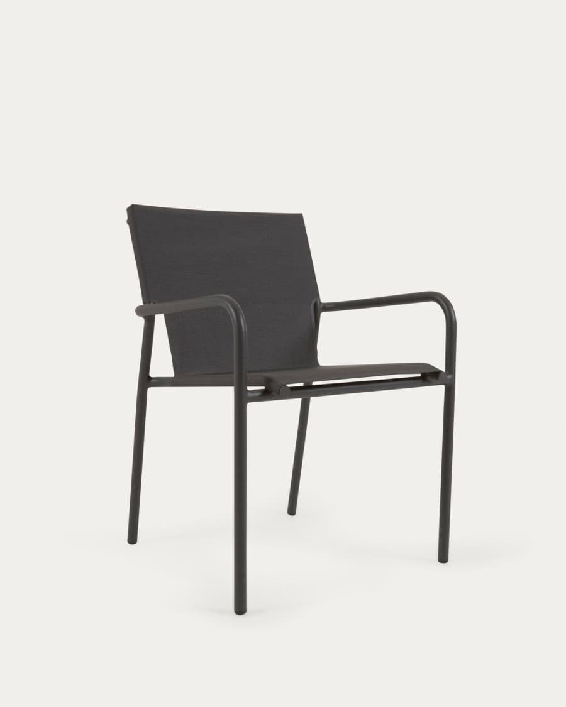

- **Price:** £145/chair
- **Material:** Powder-coated marine aluminium
- **Colour:** Anthracite (single colour) · **Heat safety:** ⚠ Frame/armrests: aluminium arms will be hot — avoid resting bare arms on them in full sun. Seat: textilene mesh is much cooler than bare metal at the same temperature (lower effusivity) — comfortable to sit on · **Weight:** Unpublished · **Arms:** Yes · **Stackable:** Yes · **Seat:** Textilene mesh sling (drains; no cushion)
- **Reviews:** kavehome.com — **Trustpilot: ~41,000 reviews, polarized.** Many 5-star but recurring delivery complaints. Confirm stock and lead time before ordering.

**Pros:** Best value with arms + contemporary look; textilene sling drains; stackable · **Cons:** Weight unpublished; delivery complaints; light (wind plan applies)

[kavehome.com — Zaltana](https://kavehome.com/gb/en/p/zaltana-stackable-outdoor-chair-in-aluminium-with-a-matt-dark-grey-painted-finish)

[↑ Chairs](#chairs) · [↑ Contents](#contents)

---

### SCAB Design — Summer ⭐ · £148

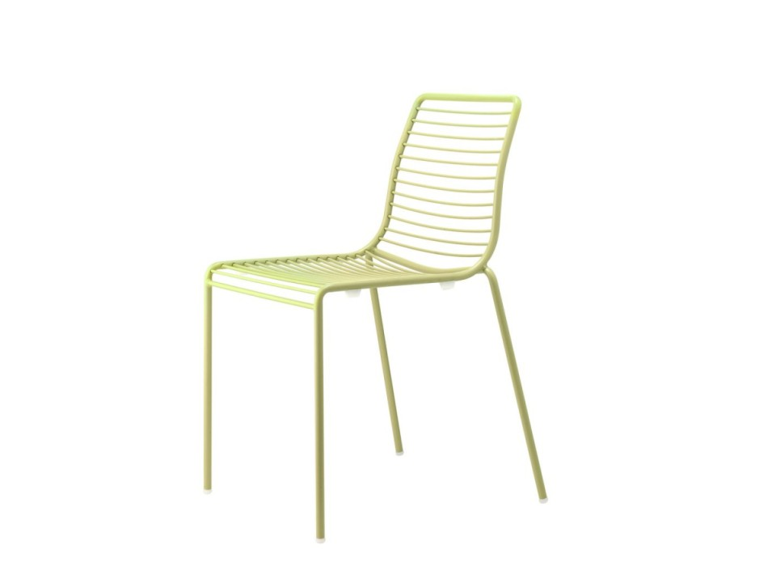

*Photo in anthracite — the correct colour. Optional seat cushions available as an accessory (stored indoors when not in use — no cushion product shots available online).*

- **Price:** ~£148/chair
- **Material:** **Duplex galvanised + powder-coated steel** — zinc under the colour → dark AND rustproof at the coast
- **Colour:** Dark anthracite confirmed; multiple finishes available — ask tecnoarredo3 for current colour chart · **Heat safety (duplex steel, wire-rod seat):** ❌ Dark anthracite will be hot on bare skin in direct sun — wire-rod reduces contact area but doesn't change surface temperature. Ask tecnoarredo3 for lighter colour options; **a seat cushion (stored indoors) transforms comfort** · **Weight:** Unpublished · **Arms:** No · **Stackable:** Yes · **Seat:** Horizontal wire-rod grid (drains perfectly, nothing pools)
- **Reviews:** tecnoarredo3.co.uk — **4.7/5 Trustpilot (224 reviews). Excellent.** 88% 5-star; legitimate Italian retailer; responsive customer service.

**Pros:** Duplex galv = dark AND coastal-safe (zinc survives chips); horizontal wire-rod drains perfectly; affordable at £148; best-reviewed steel-chair retailer on this list · **Cons:** More open/industrial look than the pressed-steel options; weight unpublished

[tecnoarredo3.co.uk — SCAB Summer](https://www.tecnoarredo3.co.uk/summer-chair-scab)

[↑ Chairs](#chairs) · [↑ Contents](#contents)

---

### Vermobil — Fox · £167 (side chair) / £177 (armchair) ⭐ matches Extia table & Twist armchair

**Side chair — no arms:**

**With optional seat cushion:**

*Seat cushion shown in Grey Mud (olive) — available in 8 outdoor fabrics, store indoors.*

**Armchair — with arms (£10 more):**

*Fox armchair with the Extia table — same Vermobil collection.*

**Colour palette (shared with Extia table and Twist armchair):**

- **Price:** Side chair £167 (RRP £222) · Armchair £177 (RRP £236) · **Lead time: 6–10 weeks** (made to order)
- **Size:** Side chair W45 × D53 × H81cm · Armchair wider — confirm with deluxdeco
- **Material:** **Duplex galvanised + qualicoat powder-coated steel** — confirmed coastal-safe
- **Colour:** 7 options — **same palette as Extia table and Twist armchair** (see swatch above) · **Heat safety (solid pressed steel seat — strictest rule):** ✅ Ivory White BS · ✅ Matt White BCU · ✅ Beige BE · ⚠ Ancient Grey AG (borderline — coastal breeze usually fine) · ❌ Black NE · ❌ Grey Mud FA · ❌ Bronzo BRO — solid seat means full skin contact; dark colours will be painful to sit on in shorts in direct sun · **Weight:** Unpublished · **Arms:** Armchair version £177 · **Stackable:** Yes · **Seat:** Smooth pressed steel shell (wipe-clean); 8 cushion fabrics separately (UV/water/mould resistant, 5-yr warranty)
- **Reviews:** deluxdeco.co.uk — **5.0/5 Trustpilot (235 reviews). Excellent.**

**Pros:** Confirmed duplex galv = properly coastal-safe; smooth pressed-steel seat; armchair option; perfectly matched to Extia table and Twist armchair from same brand; excellent retailer · **Cons:** ⚠ 6–10 week lead time — order July for Sept fit-out; weight unpublished

[deluxdeco.co.uk — Fox side chair](https://www.deluxdeco.co.uk/fox-chair.html) · [Fox armchair](https://www.deluxdeco.co.uk/fox-armchair.html)

[↑ Chairs](#chairs) · [↑ Contents](#contents)

---

### Vermobil — Twist armchair ⭐ · £209 (with arms — matches Fox & Extia)

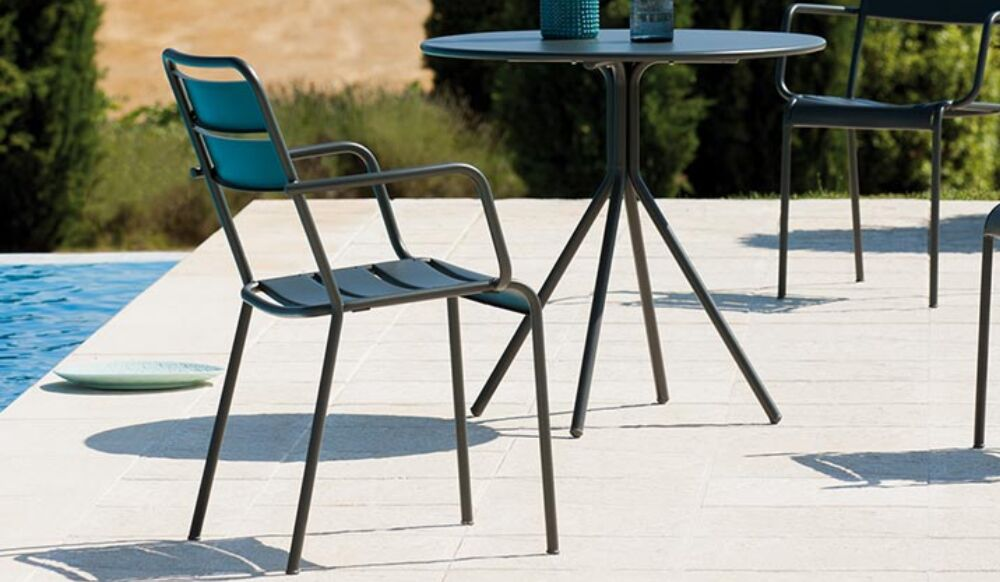

*Photo in dark bronze/anthracite — same slatted seat, slim arms, dining height.*

**Colour palette (shared with Fox chairs and Extia table):**

- **Price:** £209 (from £279 — 25% off) · **Lead time: 9–15 weeks** ⚠ (made to order — order by July for September fit-out)
- **Size:** W55 × D56 × H88cm (dining height)
- **Material:** **Duplex galvanised + qualicoat powder-coated steel** — same coastal-safe construction as Fox
- **Colour:** 7 options — **identical palette to Fox chairs and Extia table** (see swatch above) · **Heat safety (slatted steel seat, solid arms):** ✅ Ivory White BS · ✅ Matt White BCU · ✅ Beige BE · ⚠ Ancient Grey AG · ❌ Black NE · ❌ Grey Mud FA · ❌ Bronzo BRO — slatted seat is slightly cooler than Fox's solid pan; arms are solid steel and will be hot in dark colours · **Weight:** Unpublished · **Arms:** Yes ✓ · **Stackable:** Yes · **Seat:** Slatted metal (drains, wipe-clean); cushion options likely available — confirm with deluxdeco
- **Reviews:** deluxdeco.co.uk — 5.0/5 Trustpilot (235 reviews). Excellent.

**Note:** Back panel appears to have a separate insert in the product photo — **confirm with deluxdeco whether the back is all-metal or includes a fabric/textile component** (if fabric, it needs to come indoors like cushions).

**Pros:** ⭐ Arms make it more comfortable for long dinners; perfectly matched to Fox side chairs and Extia table — can mix armchairs and side chairs in one palette; stackable; duplex galv = coastal-safe · **Cons:** 9–15 week lead time is the longest on this list — order early; 55cm width means armchairs take more table room (8 fit around a 250cm table, not 10); back panel to confirm

[deluxdeco.co.uk — Twist armchair](https://www.deluxdeco.co.uk/twist-armchair.html)

[↑ Chairs](#chairs) · [↑ Contents](#contents)

---

### Vermobil — Daisy armchair ⭐ · ~£209+ (confirm with arredinitaly or Vermobil UK dealer)

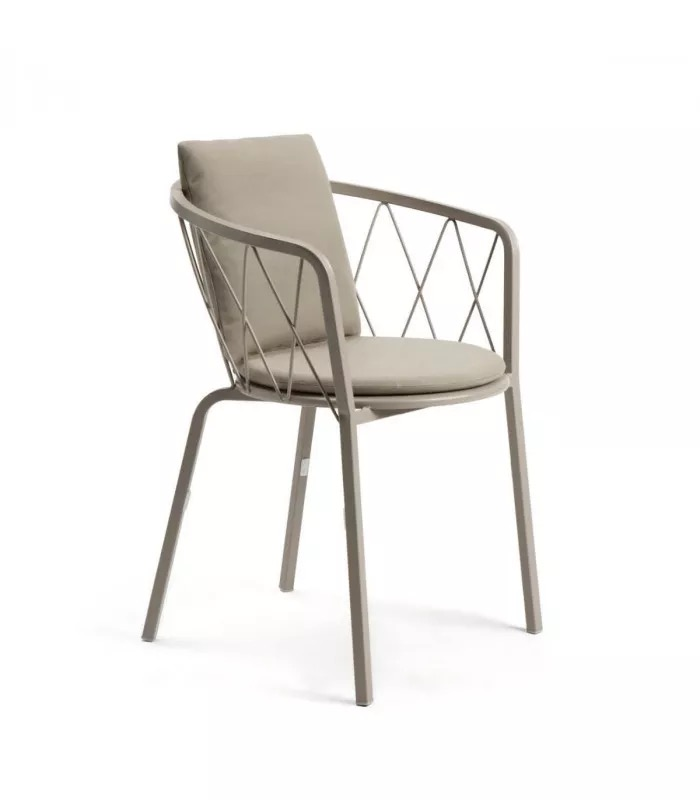

*Photo: Daisy standard version in beige/taupe with cushion. A Daisy Rope variant (woven-rope back and seat) is also available — see Extia+Daisy render above.*

- **Price:** ~£209+ (was from £209 at deluxdeco who no longer stock Vermobil — confirm current price via [arredinitaly.com/gb](https://www.arredinitaly.com/gb/98_vermobil) or Vermobil's new UK dealer)
- **Material:** **Duplex galvanised + qualicoat powder-coated steel** — same coastal-safe construction as the Fox, Si-Si, and Extia
- **Colour:** Beige/taupe and other options (confirm range with supplier) · **Heat safety (duplex steel, solid arms):** ✅ Beige/Ivory — the warm light tone + duplex galv construction makes this the best heat-safe armchair on the list; ⚠ mid-tones; ❌ dark anthracite/black
- **Weight:** Not published · **Arms:** Yes ✓ · **Stackable:** Yes (up to 8) · **Seat:** Standard Daisy: cushioned seat + wire-back panel. Daisy Rope: woven-rope back and seat (shown in Extia render above — more relaxed, slightly less formal)
- **Available from:** arredinitaly.com/gb (ships to UK — already our Si-Si supplier) or Vermobil's new UK dealer (pending)

**Pros:**
- ⭐ **Ideal companion for Nardi Rio Tortora, Mobellia taupe, Extia Beige, or Jakarta** — the beige/taupe tone creates a warm monochrome look across the full dining set
- Arms ✓; stackable ✓; duplex galv coastal-safe ✓
- The Rope version is distinctively contemporary and very comfortable
- Same Vermobil family as Fox, Mogan, Twist, Extia — consistent build quality

**Cons:**
- Price unconfirmed since deluxdeco dropped Vermobil — get a quote before assuming the ~£209 figure
- Cushions required for comfort (seat cushion stored indoors); no bare-metal seat option in standard Daisy
- Daisy Rope seat (woven cord) is comfortable but note it's not as wipe-clean as bare metal

[arredinitaly.com/gb — Vermobil range](https://www.arredinitaly.com/gb/98_vermobil)

[↑ Chairs](#chairs) · [↑ Contents](#contents)

---

### Kave Home — Culip · £179

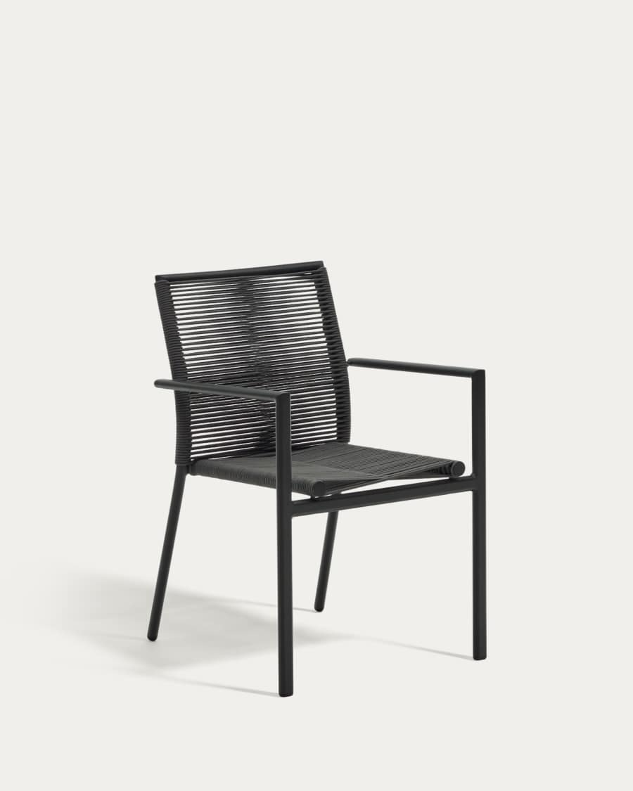

- **Price:** £179/chair
- **Material:** Powder-coated marine aluminium frame + outdoor cord weave seat
- **Colour:** Black frame + dark grey cord (single option) · **Heat safety:** ⚠ Frame/armrests: aluminium arms will be hot in direct sun. Cord seat: woven cord has lower thermal effusivity than bare metal — more comfortable to sit on than a bare steel seat at the same temperature, but still warm · **Weight:** Unpublished · **Arms:** Yes · **Stackable:** Yes · **Seat:** Woven cord (drains; stays out)
- **Reviews:** kavehome.com — same as Zaltana above; mixed Trustpilot, delivery concerns.

**Pros:** The Cane-line Lean look at far less; arms included; stackable · **Cons:** Woven cord seat stays out permanently (not bare metal); weight unpublished; delivery complaints

[kavehome.com — Culip](https://kavehome.com/gb/en/p/culip-aluminium-and-cord-stackable-outdoor-chair-in-grey)

[↑ Chairs](#chairs) · [↑ Contents](#contents)

---

### SCAB Design — Si-Si 2503 ⭐ · £181

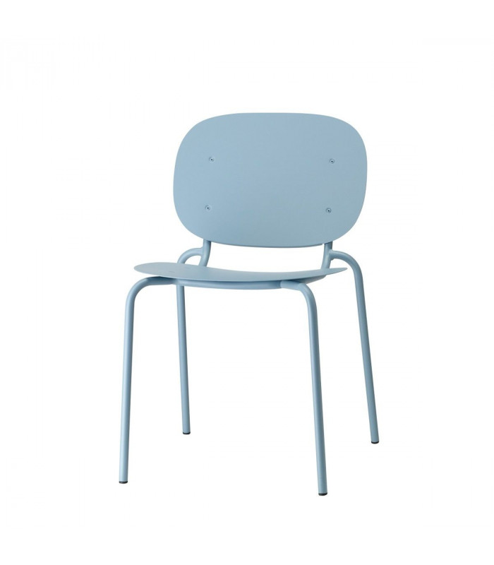

*Si-Si 2503 in **anthracite** — the correct dark colourway (ZA).*

**With optional seat cushion (shown in dove grey ZT):**

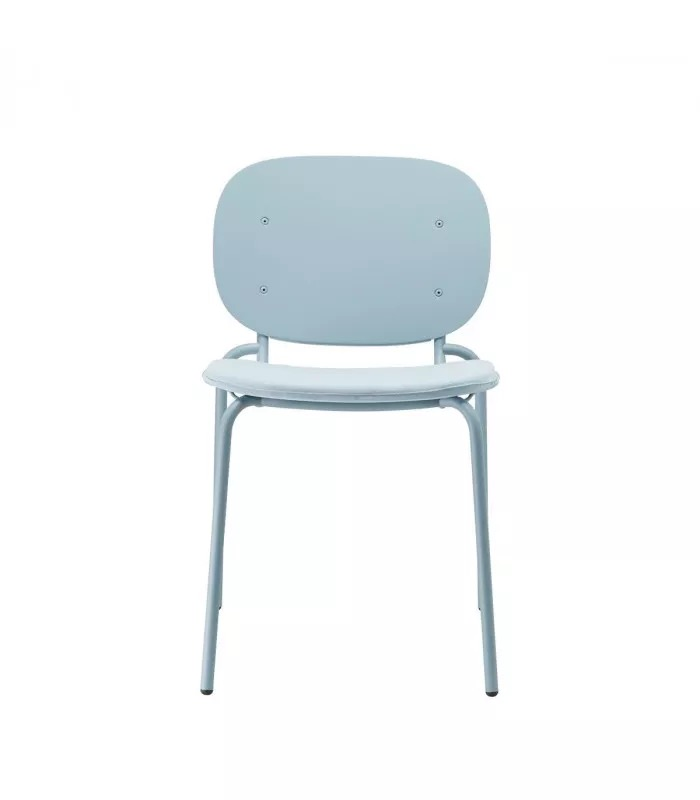

*Cushion shown in Dove Grey (ZT) — same cushion available in anthracite. Seat cushion is an optional extra; store indoors when not in use.*

- **Price:** £181/chair (sold in pairs)
- **Size:** W50 × D55 × H81cm (CATAS-certified)
- **Material:** **Duplex galvanised + powder-coated steel** — zinc under the paint → dark AND rustproof
- **Colour:** **Anthracite (ZA)** and **Dove Grey (ZT)** both available · **Heat safety (solid pressed steel seat — strictest rule):** ⚠ Dove Grey ZT (borderline — better than anthracite but still warm for steel; use a seat cushion in summer) · ❌ Anthracite ZA (dark steel seat will be hot on bare skin in shorts) · **Weight:** 8.7 kg (heaviest chair on this list) · **Arms:** No · **Stackable:** Yes · **Seat:** Pressed/curved steel sheet (wipe-clean)
- **Reviews:** arredinitaly.com — positive Trustpilot (47 reviews — small sample; Chamber of Commerce registered; legitimate Italian retailer).

**Pros:** **Heaviest chair at 8.7 kg** — best wind resistance of any non-teak option; duplex galv = dark AND coastal-safe; **dove grey is a genuine grey option**; Italian CATAS-certified · **Cons:** Small retailer (47 reviews); sold in pairs only; confirm UK delivery lead time

[arredinitaly.com — SCAB Si-Si 2503](https://www.arredinitaly.com/gb/metal-chairs/13893-si-si-2503-chairs-scab-design.html)

[↑ Chairs](#chairs) · [↑ Contents](#contents)

---

### Vermobil — Mogan · £185

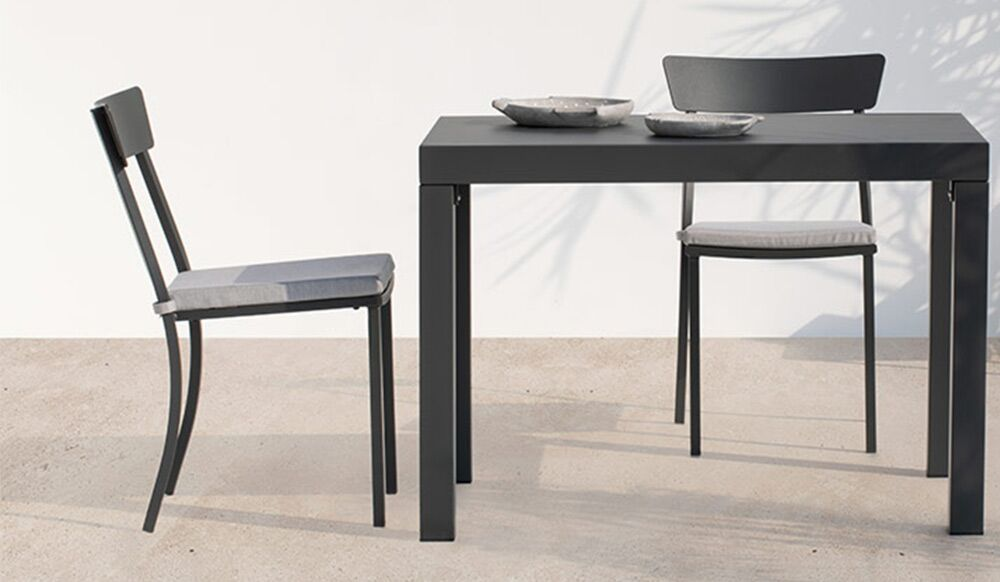

*The right-hand chair in the photo has an optional seat cushion pad — the chair itself has a bare slatted metal seat*

- **Price:** £185/chair (RRP £247) · **Lead time: 6–10 weeks** (made to order)
- **Material:** **Duplex galvanised steel** (same spec as Fox — galvanised + qualicoat powder coat)
- **Colour:** Anthracite + other options — **same 7-colour palette as Fox** (confirm with deluxdeco) · **Heat safety (slatted duplex steel — same rule as Fox):** ✅ Ivory White BS · ✅ Matt White BCU · ✅ Beige BE · ⚠ Ancient Grey AG · ❌ Anthracite and darker — slatted seat provides slight relief over Fox's solid pan · **Weight:** Unpublished · **Arms:** No · **Stackable:** Yes · **Seat:** Square-back horizontal slatted steel (drains)
- **Reviews:** deluxdeco.co.uk — **5.0/5 Trustpilot (235 reviews). Excellent.**

**Pros:** Clean square-back geometric design; good saving on RRP; confirmed duplex galv = coastal-safe; excellent retailer · **Cons:** ⚠ 6–10 week lead time — order July for Sept fit-out; weight unpublished

[deluxdeco.co.uk — Vermobil Mogan](https://www.deluxdeco.co.uk/mogan-chair.html)

[↑ Chairs](#chairs) · [↑ Contents](#contents)

---

### Kave Home — Joncols · £199

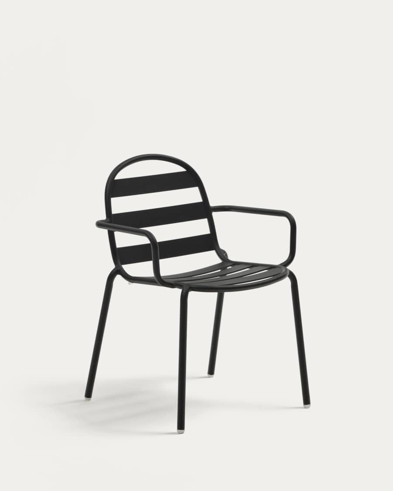

- **Price:** £199/chair
- **Material:** Powder-coated marine aluminium
- **Colour:** Black (single colour) · **Heat safety (slatted aluminium):** ❌ Black aluminium will be hot on bare arms and legs in direct sun — no lighter colour available; coastal breeze helps · **Weight:** Unpublished · **Arms:** Yes · **Stackable:** Yes · **Seat:** Horizontal flat-slat back + slatted seat (drains)
- **Reviews:** kavehome.com — same as above; mixed Trustpilot, delivery concerns.

**Pros:** Clean architectural horizontal slat look; arms; stackable · **Cons:** Top of under-£200 range; weight unpublished; delivery complaints

[kavehome.com — Joncols](https://kavehome.com/gb/en/p/joncols-stackable-outdoor-chair-in-aluminium-with-grey-painted-finish)

[↑ Chairs](#chairs) · [↑ Contents](#contents)

---

### La Redoute — Lyona ⭐ · £200

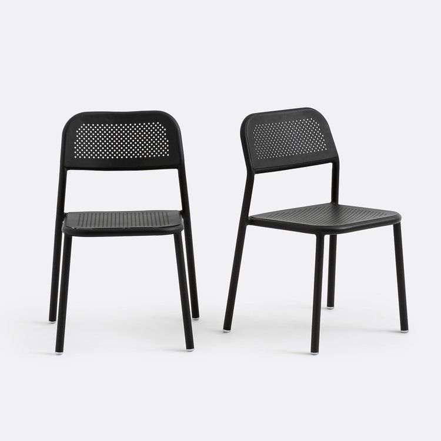

- **Price:** £200/chair (set of 2 = £399.99; ~£130 spotted at Made/Next — worth checking)
- **Material:** Powder-coated marine aluminium
- **Colour:** Matte black (single colour) · **Heat safety (slatted/perforated aluminium):** ❌ Matte black will be hot in direct sun — perforated mesh and slatted seat reduce contact area, which helps a little, but no lighter colour available · **Weight:** 3.9 kg (published) · **Arms:** No · **Stackable:** Yes · **Seat:** Perforated mesh back + slatted seat (drains)
- **Reviews:** laredoute.co.uk — mixed Trustpilot; delivery/returns concerns. Buy in a set of 2; pay by card.

**Pros:** The most design-shop clean look here; slim tapered legs; published weight; stackable · **Cons:** 3.9 kg = lightest aluminium chair on the list (wind plan critical); delivery concerns; sold in pairs

[laredoute.co.uk — Lyona](https://www.laredoute.co.uk/ppdp/prod-350903799.aspx)

[↑ Chairs](#chairs) · [↑ Contents](#contents)

---

### HOUE — Alua ⭐ · ~£233 *(stretch)*

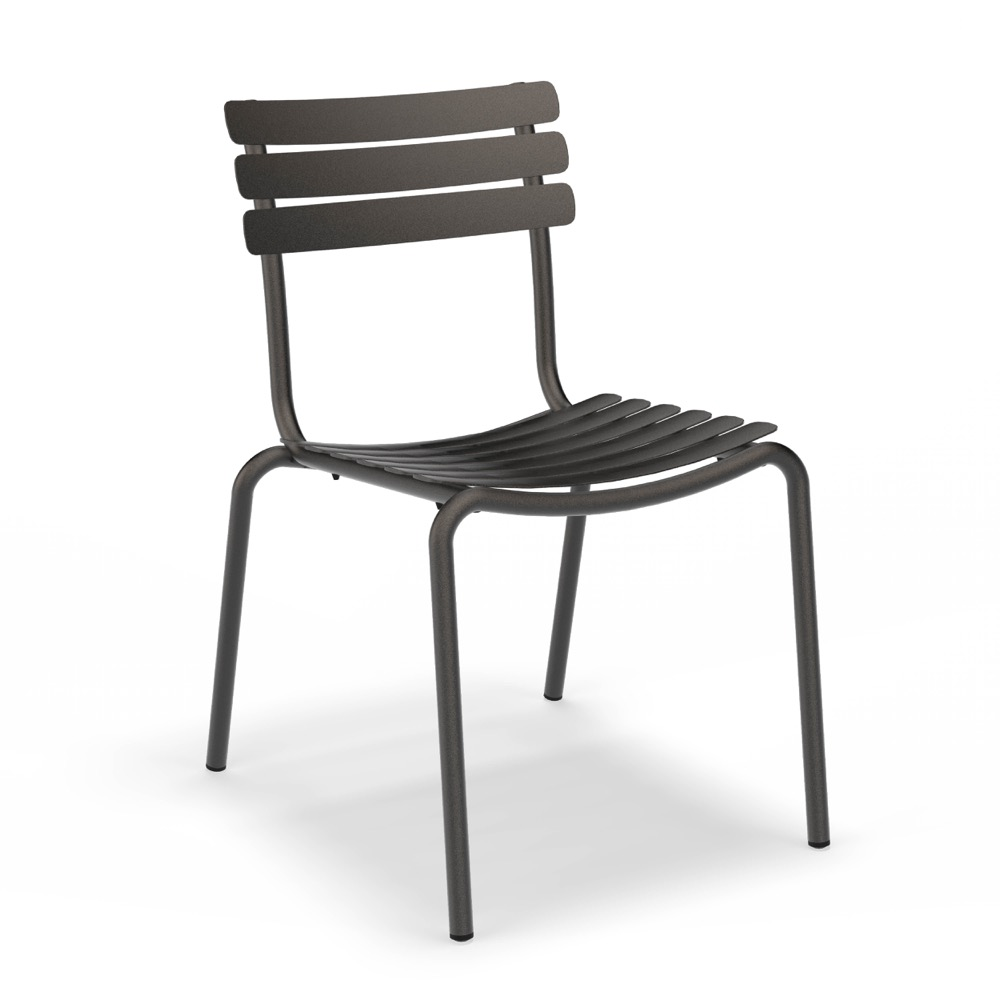

- **Price:** ~£233/chair (stretch)
- **Material:** Powder-coated marine aluminium
- **Colour:** Black · Muted white · Olive green · Beige · Cayenne red · Ice blue — **no grey available** · **Heat safety (slatted aluminium):** ✅ Muted white · ✅ Beige · ✅ Ice blue · ⚠ Olive green (medium tone) · ⚠ Cayenne red (medium-dark absorptivity) · ❌ Black · **Weight:** 4.8 kg (published) · **Arms:** No · **Stackable:** Yes (up to 10) · **Seat:** Curved slatted seat + back (drains)
- **Reviews:** Holloways of Ludlow — **4.9/5 Trustpilot (500+ reviews). Excellent.**

**Pros:** Most refined / architectural aluminium chair here; published weight; stacks 10 high; Danish design; 5-year warranty · **Cons:** Over budget at ~£233 (stretch); no grey colourway available

[hollowaysofludlow.com — HOUE Alua](https://www.hollowaysofludlow.com/products/houe-alua-dining-chair)

[↑ Chairs](#chairs) · [↑ Contents](#contents)

---

**Steer:** **Cafe Reality Bastille (£126)** or **Chazey (£114)** for lowest-cost coastal-safe aluminium. **SCAB Summer (£148)** is the duplex steel standout at the price. **SCAB Si-Si (£181, 8.7 kg)** is the heaviest and has a dove grey option. **Vermobil Fox (£167/177)** and **Mogan (£185)** both confirmed duplex galv via deluxdeco 5.0/5 — note the 6–10 week lead time. **HOUE Alua (£233)** via Holloways for the most architectural aluminium option.

*Swyft Garden Dining Chair 01 (£140) — same aluminium-slat look, but olive/taupe only (no dark), sold out, and Swyft's table is fixed ~6–8 seats. Doesn't fit the brief.*

[↑ Top](#top) · [↑ Contents](#contents)

---

## Teak dining chairs — Route A

Solid teak instead of metal. Teak is naturally oily, rot-proof and salt-tough — left out it silvers to grey with **zero maintenance**, and at ~8–12 kg it passes the Brighton wind test where light aluminium doesn't. All bare-teak seats drain and are seagull-proof; any removable pad stores indoors. Sorted cheapest first. **Verify by eye and order a sample first** — teak grade and finish vary a lot between sellers.

*Benchmark = the Teakunique Poppy (£205 · curved sculpted back · armless · stacks · ~8 kg). The chairs below are alternatives with a cleaner contemporary line and/or stronger independent reviews. All verified by eye from the product photo.*

---

### Cyan Teak — Vero ⭐ · £125 *(best value)*

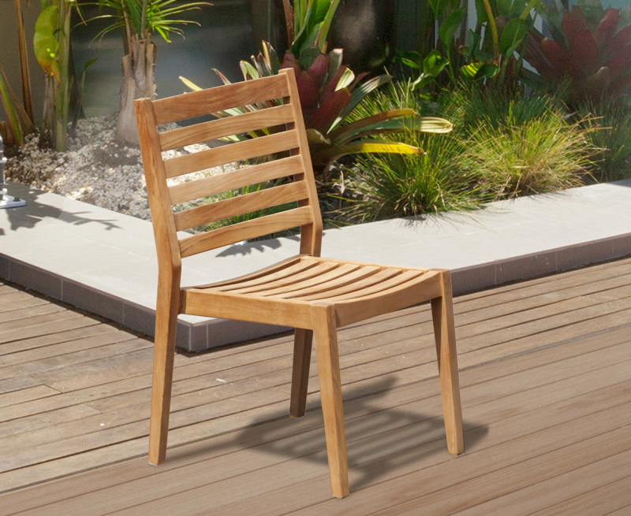

- **Price:** £125/chair
- **Material:** Grade-A teak (*Tectona grandis*) — mortise-and-tenon joints, stainless-steel fittings
- **Colour:** Natural teak (silvers if left out) · **Weight:** Unpublished — described "lightweight"; ⚠ confirm ≥7 kg for wind · **Arms:** No · **Stackable:** Yes · **Seat:** Curved/scooped slatted teak (drains)
- **Reviews:** cyan-teak-furniture.com — **Trustpilot 5.0 (~199 reviews, store-level).** Best-reviewed teak retailer here.

**Pros:** Cleanest contemporary Scandi line on the list at the lowest price; armless + stackable; genuine Grade-A teak; strong independent reviews · **Cons:** Weight unpublished (confirm it's heavy enough); reviews are store- not product-level

[cyan-teak-furniture.com — Vero](https://www.cyan-teak-furniture.com/vero-teak-stacking-side-chair)

[↑ Chairs](#chairs) · [↑ Contents](#contents)

---

### Cyan Teak — Sora · £125 *(woven back — cheap Banda look)*

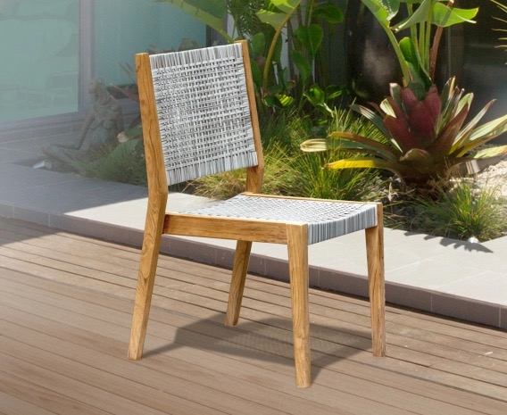

- **Price:** from £125/chair
- **Material:** Grade-A teak frame + **Rehau Raucord® woven panel** (⚠ synthetic rattan, **not** natural rope/cord)
- **Colour:** Natural teak + grey weave · **Weight:** Unpublished (high-back, lightweight) · **Arms:** No · **Stackable:** Yes · **Seat:** Teak seat; woven back panel
- **Reviews:** cyan-teak-furniture.com — same as Vero (Trustpilot 5.0, ~199 store-level).

**Pros:** The Teakunique Banda woven look at a quarter of the price; armless + stackable; clean Japandi profile · **Cons:** Weave is synthetic Raucord (stays outside permanently; not natural cord); weight unpublished

[cyan-teak-furniture.com — Sora](https://www.cyan-teak-furniture.com/sora-woven-stacking-chair)

[↑ Chairs](#chairs) · [↑ Contents](#contents)

---

### Eterna Home — Oxford · £149

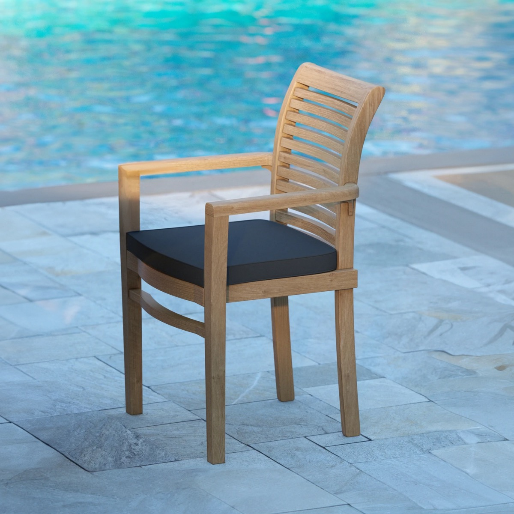

*Photo shows the **carver** (with arms) and a seat pad — Eterna also list an armless stacking side chair; confirm which you're ordering.*

- **Price:** £149/chair (sold in pairs, £298)
- **Material:** Grade-A teak (*Tectona grandis*), purpose-built **outdoor**; high natural oils, no treatment needed
- **Colour:** Natural teak · **Weight:** Unpublished · **Arms:** ⚠ carver shown has arms (an armless stacking version is listed) · **Stackable:** Yes (up to 4) · **Seat:** Curved horizontal-slat back; optional cushion
- **Reviews:** eternahome.co.uk — **Trustpilot 4.0 (~56 reviews — small sample; some delivery-delay complaints).**

**Pros:** Genuine *outdoor* Grade-A teak; stackable; curved slatted back reads contemporary; cushion option · **Cons:** Photo is the carver — confirm the armless side chair; young/small review base

[eternahome.co.uk — Oxford](https://eternahome.co.uk/products/teak-garden-furniture-stacking-chairs-priced-for-1)

[↑ Chairs](#chairs) · [↑ Contents](#contents)

---

### Barker & Stonehouse — Semeru ⭐ · £169 *(closest to the Poppy)*

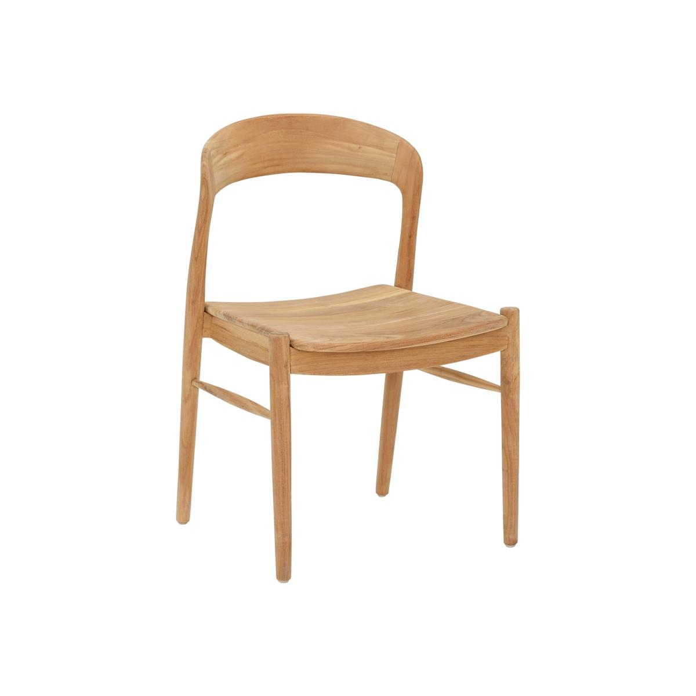

- **Price:** £169/chair (sale, was £215)
- **Material:** Solid teak — smooth, unfinished wood
- **Colour:** Natural teak · **Weight:** **8 kg (published — passes wind)** · **Arms:** No · **Stackable:** No · **Seat:** Sculpted solid-teak seat
- **Reviews:** barkerandstonehouse.co.uk — **Trustpilot ~4.5 (large, retailer-level).** Long-established UK retailer.
- ⚠ **Caveat:** marketed as an **indoor** unfinished-teak chair, not a designated outdoor model. Unfinished teak weathers fine outside (it silvers) but confirm coastal suitability + joinery/hardware with B&S. The range also has an armchair and a leather-seat variant — order the plain **armless wood** one.

**Pros:** The closest match to the Poppy benchmark — curved sculpted wrap-back, clean lines, armless; 8 kg published; keen price · **Cons:** Indoor-listed (confirm outdoor use); not stackable

[barkerandstonehouse.co.uk — Semeru](https://www.barkerandstonehouse.co.uk/chairs/semeru-dining-chair)

[↑ Chairs](#chairs) · [↑ Contents](#contents)

---

### Teak Warehouse — Treviso · ~£260 *(⚠ confirm UK shipping)*

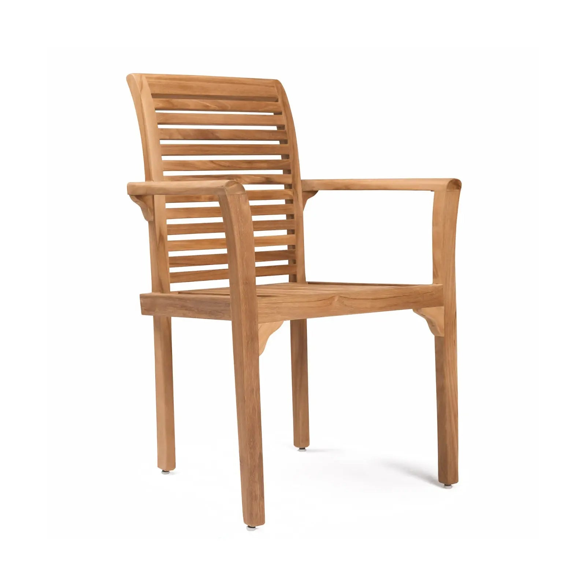

- **Price:** ~£260/chair (sale, ~$329, was ~$459)
- **Material:** A-grade teak, thick-cut
- **Colour:** Natural teak · **Weight:** **8.2 kg (published)** · **Arms:** Slim integrated · **Stackable:** Yes (up to 4) · **Seat:** Curved high slatted back
- **Reviews:** teakwarehouse.com — positive but modest volume; ⚠ the former **UK** arm has poor delivery reviews.
- ⚠ **Caveat:** ships from Dallas, USA — UK delivery + duties uncertain. Treat as a **look reference** unless they confirm UK shipping.

**Pros:** Strong nautical-contemporary curved back; 8.2 kg; stackable; A-grade teak · **Cons:** US shipping/duties + UK delivery doubt; slim arms

[teakwarehouse.com — Treviso](https://teakwarehouse.com/products/treviso-stacking-teak-dining-chair)

[↑ Chairs](#chairs) · [↑ Contents](#contents)

---

### 4 Seasons Outdoor — Julia · £360 *(stretch — comfort armchair)*

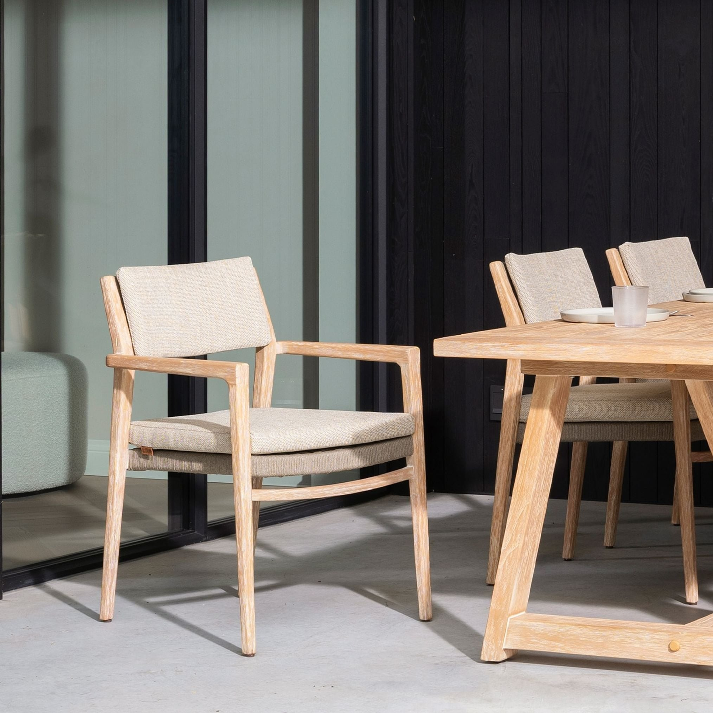

- **Price:** £360/chair (was £449)
- **Material:** **Brushed FSC teak** frame + removable seat & back cushions (store indoors)
- **Colour:** Brushed (limed) teak + neutral cushions · **Weight:** Unpublished · **Arms:** Slim modern · **Stackable:** Yes · **Seat:** Cushioned
- **Reviews:** 4 Seasons Outdoor brand well-regarded; retailer reviews self-hosted (The Modern Furniture Company).

**Pros:** Genuinely modern angular frame from a reputable garden brand; comfortable cushioned armchair; stackable; FSC teak · **Cons:** Over budget (stretch); has arms + cushions (cushions come in; confirm solid teak, not veneer)

[themodernfurniturecompany.com — 4S Julia](https://themodernfurniturecompany.com/products/4-season-outdoor-julia-living-chair-teak-brushed-with-2-cushions-copy)

[↑ Chairs](#chairs) · [↑ Contents](#contents)

---

### Skagerak (Fritz Hansen) — Plank ⭐ · ~£619 *(premium design benchmark)*

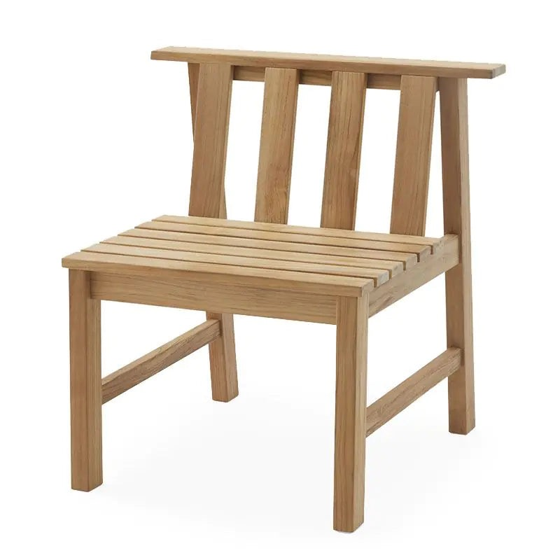

- **Price:** ~£619/chair (was £729)
- **Material:** Untreated solid teak, **FSC 100%**
- **Colour:** Natural teak · **Weight:** Unpublished · **Arms:** No · **Stackable:** No · **Seat:** Slatted teak; architectural plank back
- **Reviews:** innes.co.uk self-hosted; Skagerak / Fritz Hansen is a premium Danish design house.

**Pros:** The cleanest, most architectural design here — a true modern-design benchmark; certified solid teak; armless · **Cons:** Premium price (reference only); not stackable

[innes.co.uk — Skagerak Plank](https://www.innes.co.uk/products/skagerak-plank-outdoor-dining-chair)

[↑ Chairs](#chairs) · [↑ Contents](#contents)

---

### Cane-line — Grace · ~£1,005 *(premium reference — heaviest)*

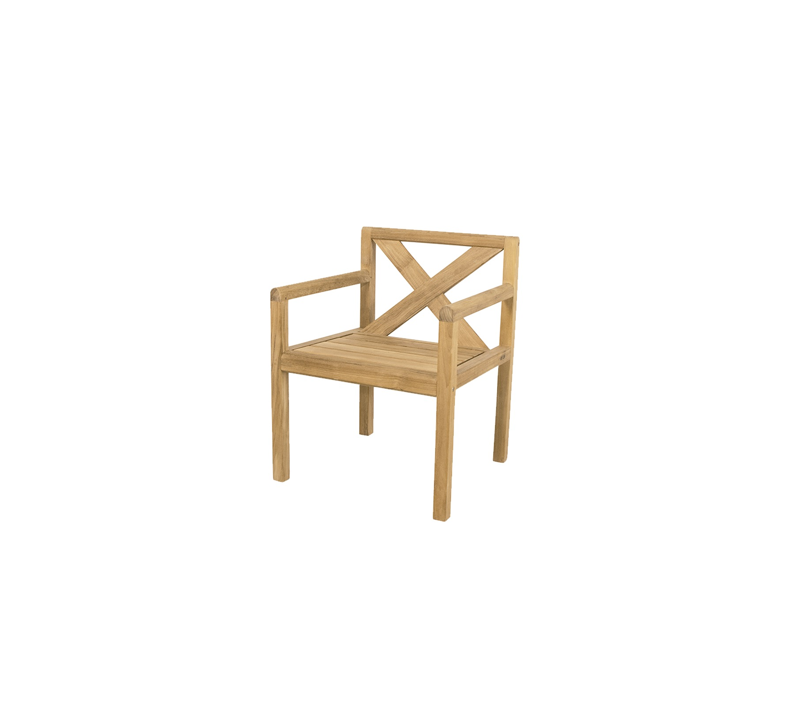

- **Price:** ~£1,005/chair
- **Material:** Grade-A teak, **SVLK certified**
- **Colour:** Natural teak · **Weight:** **13 kg (heaviest — best wind)** · **Arms:** Yes · **Stackable:** No · **Seat:** Slatted teak; cubic X cross-back
- **Reviews:** cane-line.co.uk self-hosted; Cane-line is a premium Danish brand.

**Pros:** Heaviest / most wind-proof; clean cubic X-back; full Grade-A teak · **Cons:** Premium price (reference); arms; not stackable

[cane-line.co.uk — Grace](https://cane-line.co.uk/products/grace-chair)

[↑ Chairs](#chairs) · [↑ Contents](#contents)

---

### Tribu — Kos · ~£1,220 *(premium reference)*

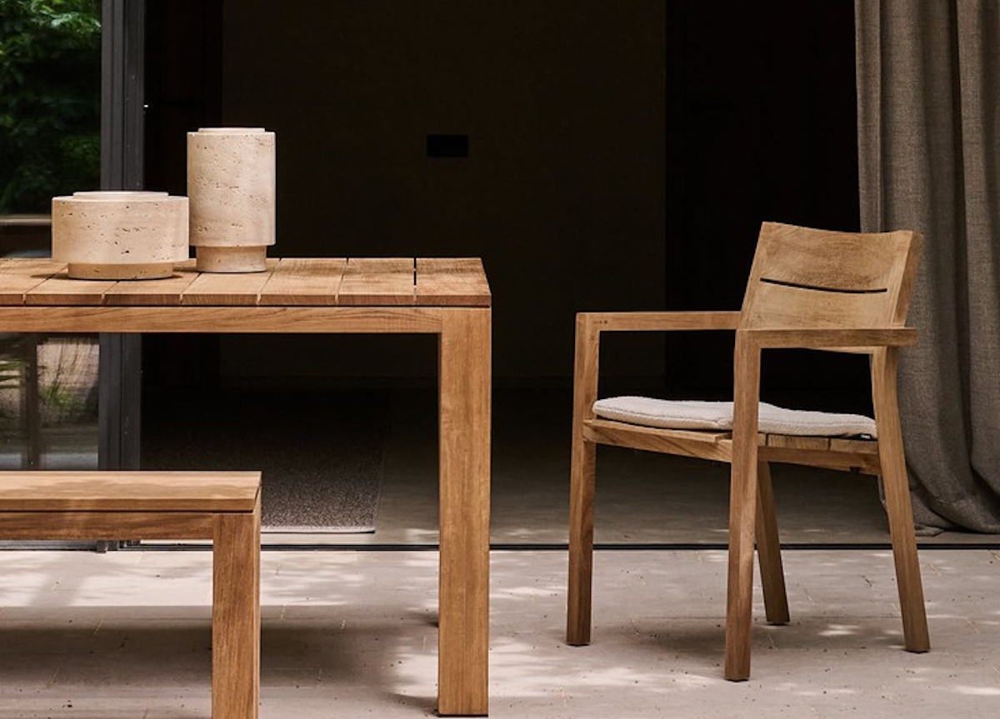

- **Price:** ~£1,220/chair
- **Material:** Teak frame, broad-slat (confirm seat/back are teak vs rope)
- **Colour:** Natural teak + cushion pad · **Weight:** Unpublished · **Arms:** Slim · **Stackable:** Yes (up to 3) · **Seat:** Broad-slat teak + pad
- **Reviews:** gomodern.co.uk self-hosted; Tribu is a premium Belgian brand.

**Pros:** Pure modern broad-slat design; stackable; premium build · **Cons:** Premium price (reference); slim arms

[gomodern.co.uk — Tribu Kos](https://www.gomodern.co.uk/tribu-kos-teak-garden-dining-chair.html)

[↑ Chairs](#chairs) · [↑ Contents](#contents)

---

**Steer (teak / Route A):** For value + the cleanest contemporary line, **Cyan Vero (£125)** is the standout — order a sample and confirm the weight. **Barker & Stonehouse Semeru (£169)** is the closest match to the Poppy's sculpted curved back (confirm outdoor use). **Cyan Sora (£125)** gives the woven Banda look cheaply. **Skagerak Plank (~£619)** is the design benchmark if budget flexes. Be aware the genuine-teak + contemporary + sub-£300 + reliable-UK-delivery intersection is narrow — most unambiguously clean designs (Plank / Grace / Kos) sit £600+.

*Dead ends (checked, rejected):* Tikamoon **Blaise** £369 (wishbone Y-back + indoor varnish) and **Jonàk** £189 (indoor; ~6 kg sister model — borderline for wind); Indian Ocean **Oslo** (teak **+ aluminium** frame, only 5.5 kg — fails solid-teak + weight); **Barlow Tyrie Equinox** / **Gloster Sway** (teak frame + sling, not solid teak; £400+); most Wayfair "teak" woven chairs are **acacia / teak-effect**; Teakunique **Riverbank** (traditional spindle) / **Snapdragon** (folding).

[↑ Top](#top) · [↑ Contents](#contents)

---

# 3 · Sofas & Comfy Chairs

Sorted by price (cheapest first). **Daybed key:** ✅✅ push modules into a bed · ✅ pieces combine into a daybed · ◐ reconfigures (L/R, splits) but not flat.

---

### Sherborne — Teak Corner · £1,499 (value classic)

- **Price:** £1,499 (5-seat corner + coffee table)
- **Material:** Grade A teak; made in England · **Modularity:** ◐ — chaise clamps L/R
- **Reviews:** gardenbenches.com (Sloane & Sons) — **4.4/5 Trustpilot (77 reviews).** 84% 5-star; good communication; responds to 100% of negative reviews. Solid UK teak specialist.

**Pros:** Excellent value for solid teak; UK-made; good customer service · **Cons:** High-back classic style — not the low modern look; not a true daybed

[gardenbenches.com — Sherborne Teak Corner](https://www.gardenbenches.com/wooden-garden-corner-sofa-sets)

[↑ Sofas](#sofas) · [↑ Contents](#contents)

---

### Luxus — Amalfi Corner Teak ⭐ · £1,941

- **Price:** £1,941 (was £2,999)
- **Material:** Solid teak · **Modularity:** ◐ — customisable L-shape
- **Reviews:** luxushomeandgarden.com — **4.6/5 Trustpilot (675 reviews).** 69% 5-star; company responds to 83% of negative reviews within a week. One report of furniture rotting after one year (company did replace). Generally positive.

**Pros:** Sleek low modern profile; great value at sale price; solid teak = coastal-proof · **Cons:** Not a true daybed (L-shape only)

[luxushomeandgarden.com — Amalfi Corner](https://www.luxushomeandgarden.com/products/amalfi-corner-teak-sofa-and-table-set)

[↑ Sofas](#sofas) · [↑ Contents](#contents)

---

### Maze — Eve Corner ⭐ · £1,985 (value, dark frame)

- **Price:** £1,985
- **Material:** Slim charcoal aluminium frame; fabric cushions (store indoors) · **Modularity:** ◐ — arms convert to side tables
- **Reviews:** mazeliving.co.uk — **~9,600 Trustpilot reviews, mixed.** Same caveat as the Maxim table: delivery delays reported, coating issues on some lines. Confirm the Eve sofa specifically before ordering; inspect on delivery.

**Pros:** Dark charcoal aluminium ties to the palette; modern low profile; arms convert to side tables · **Cons:** Not a flat daybed; mixed reviews

[outdoorluxeonline.com — Maze Eve](https://outdoorluxeonline.com/products/maze-outdoor-fabric-eve-corner-group-charcoa)

[↑ Sofas](#sofas) · [↑ Contents](#contents)

---

### 4 Seasons Outdoor — Piacenza ⭐ · £2,499

- **Price:** £2,499
- **Material:** Dark aluminium frame + rope detailing; light cushions (store indoors) · **Modularity:** ✅ — rounded chaise end
- **Reviews:** 4 Seasons Outdoor brand — **Trustpilot: 121 reviews, positive with caveats.** One long-term customer reports furniture in top condition after 8 years. Some quality concerns at purchase. themodernfurniturecompany.com as retailer: limited independent data.

**Pros:** Dark aluminium ties to palette; rounded chaise; reputable brand; cushions storable · **Cons:** Limited retailer review data; not a flat daybed

[themodernfurniturecompany.com — 4 Seasons Piacenza](https://themodernfurniturecompany.com/collections/outdoor-sofas)

[↑ Sofas](#sofas) · [↑ Contents](#contents)

---

### Teakunique — Maluku II Modular ⭐ · from £825/module (~£2,500–£3,500 full set)

- **Price:** £825/corner module; full corner set ≈ £2,500–£3,500
- **Material:** Solid teak · **Modularity:** ✅✅ — ottomans push together into a true flat daybed
- **Reviews:** teakunique.co.uk — ⚠ **no Trustpilot listing found.** Reviews are self-hosted only; no independent verification. Small UK family firm; self-stated 10-year warranty. Order a sample before committing.

**Pros:** Best daybed option on the list; solid teak = coastal-proof; modular — scale to budget · **Cons:** ⚠ No independent review base — verify teak quality with a sample first

[teakunique.co.uk — Maluku II](https://teakunique.co.uk/products/maluku-modular-sofa-corner-section)

[↑ Sofas](#sofas) · [↑ Contents](#contents)

---

### Tribu — Mood · £2,560 (premium teak)

- **Price:** £2,560
- **Material:** A-grade teak frame + woven Tricord · **Modularity:** ◐
- **Reviews:** gomodern.co.uk — **43 Trustpilot reviews, generally positive.** Small boutique retailer; praised for knowledgeable service. Tribu is Belgian premium brand, well-regarded in the trade.

**Pros:** Premium Belgian design; low minimalist profile; teak + Tricord is elegant and coastal-durable · **Cons:** Premium price; boutique retailer (small review sample)

[gomodern.co.uk — Tribu Mood](https://www.gomodern.co.uk/tribu-mood-garden-sofa.html)

[↑ Sofas](#sofas) · [↑ Contents](#contents)

---

### 4 Seasons Outdoor — Alicante · £2,699

- **Price:** £2,699 (sofa + 2 armchairs + footstools + coffee table)
- **Material:** Dark aluminium frame + rope; light cushions · **Modularity:** ◐ — footstools nudge together for a lounger
- **Reviews:** same as Piacenza above (4 Seasons Outdoor brand + The Modern Furniture Company as retailer).

**Pros:** Complete set including armchairs and footstools; great sociable layout; dark frame · **Cons:** Not a flat daybed; same retailer caveats as Piacenza

[themodernfurniturecompany.com — 4 Seasons Alicante](https://themodernfurniturecompany.com/collections/outdoor-sofas)

[↑ Sofas](#sofas) · [↑ Contents](#contents)

---

### Cane-line — Space · ~£4,470/module *(reference — the aspiration look)*

- **Price:** ~£4,470/module (a full set is well over budget)
- **Material:** Slim dark aluminium base + integrated teak table + light cushions
- **Reviews:** worm.co.uk — reputable UK design retailer. Cane-line is a well-established Danish premium brand.

**Pros:** Very low modern modular daybed; dark/teak palette match is perfect; the look to aim for · **Cons:** Well over budget — reference only; Piacenza and Maluku achieve a similar look for far less

[worm.co.uk — Cane-line Space](https://www.worm.co.uk/products/space-daybed-module-with-teak-table-left)

*More options (not pictured):* Fast Aikana aluminium daybed (£3,330) · Heal's Eos modular (£1,808) · Skagerak Tradition teak modular (~£1,865/module) · Emu Tami matt-black aluminium (£3,170).

[↑ Sofas](#sofas) · [↑ Contents](#contents)

---

[↑ Top](#top) · [↑ Contents](#contents)

---

## Why colour and material both matter — the heat science

### The two factors

**1. Colour → surface temperature**
All surfaces in sunlight reach thermal equilibrium between solar energy absorbed and heat lost to convection and radiation. Dark surfaces absorb 80–98% of solar radiation; white surfaces absorb only 15–30%. Brighton peak summer irradiance is roughly 850 W/m².

Estimated surface temperatures in direct sun (22°C ambient, moderate coastal breeze reducing temperatures by ~15°C vs still air):

| Colour | Solar absorptivity | Est. surface temp |
|---|---|---|
| Black | 0.97 | 60–65°C |
| Dark anthracite / Bronzo | 0.80–0.85 | 53–60°C |
| Olive / Grey Mud | 0.65 | 46–52°C |
| Mid-grey (Ancient Grey) | 0.55 | 42–48°C |
| Ivory White / Beige | 0.30 | 32–38°C |
| Matt White | 0.20 | 28–33°C |

Note: all paints emit thermal radiation at similar rates in the infrared regardless of visible colour — so colour only affects how much solar energy is *absorbed*, not how quickly it is *lost*.

**2. Material → how hot it *feels* (thermal effusivity)**
Surface temperature alone doesn't predict pain. What matters is **thermal effusivity** — a material's ability to transfer heat into your skin on contact. It equals √(conductivity × density × heat capacity).

| Material | Thermal effusivity (J/m²·K·s½) | Max comfortable surface temp (prolonged contact) |
|---|---|---|
| Aluminium | ~24,000 | ~43°C |
| Steel (mild/duplex) | ~13,000 | ~45°C |
| Ceramic / sintered stone | ~1,500–2,500 | ~60–65°C |
| Teak (oiled) | ~400–500 | ~68–75°C |

Steel feels ~25× "hotter" than teak at the *same surface temperature*, and aluminium is worse still — because they transfer heat into your skin so rapidly. This is why a wooden-handled pan doesn't burn you while the metal rim does, even though both are the same temperature.

### Resulting colour rules by material

| Material | ✅ Safe | ⚠ Borderline | ❌ Avoid |
|---|---|---|---|
| **Steel (solid top/seat)** | White, Ivory, Beige | Light grey (with coastal breeze) | Everything darker |
| **Steel (slatted seat)** | White, Ivory, Beige | Light grey | Anthracite, darker |
| **Aluminium (solid top)** | White, Ivory, Taupe | — | Anthracite, darker |
| **Aluminium (slatted)** | White, Ivory, Taupe | Mid-grey, Olive | Anthracite, Black |
| **Ceramic / sintered stone** | All colours | — | — |
| **Teak** | All colours | — | — |

### Brighton's saving grace

The coastal breeze at 4 storeys above the seafront can reduce surface temperatures by 15–25°C compared with still-air conditions. On a windy day, borderline colours become comfortable; on a rare still hot day, they become genuinely unpleasant. The ⚠ ratings assume a typical Brighton breeze; the ❌ ratings will be uncomfortable regardless of wind.

### Chairs matter as much as tables

A dining table edge you rest your arm on matters — but a chair you sit on in shorts, with bare thighs on the seat and bare forearms on metal arms, matters even more. Apply the same colour rules to chairs. A seat cushion (stored indoors and brought out for dining) transforms the experience of a dark metal chair and costs very little.

[↑ Top](#top) · [↑ Contents](#contents)

---

## Timing & checklist

- **Buy in the Aug–Sept clearance** (fit-out completes late Sept 2026) — best discounts on aluminium/rope sets; teak specialists barely move seasonally.
- [ ] Confirm the table's **top is non-porous** (ceramic/HPL/aluminium) and its **largest size seats 10–12**.
- [ ] **⚠ Bramblecrest Sofia extending dimensions** — confirm exact cm before ordering (not published online).
- [ ] Confirm sofa cushions are **Olefin/Sunbrella + quick-dry foam**; frames have a slatted base so they look right with cushions off.
- [ ] **Ballast/anchor** big pieces + the aluminium table against wind (no roof penetration — coordinate with Ronan).
- [ ] Order **samples** before committing.
- [ ] **⚠ Vermobil Fox/Mogan: 6–10 week lead time** — order July 2026 to arrive for Sept fit-out.
- [ ] For SCAB Si-Si: confirm UK delivery lead time with arredinitaly.com.
- [ ] For Teakunique: order a teak sample before committing (no independent Trustpilot reviews).
- [ ] For Kave Home chairs (Zaltana/Culip/Joncols): confirm stock availability + delivery lead time upfront.

[↑ Top](#top) · [↑ Contents](#contents)
