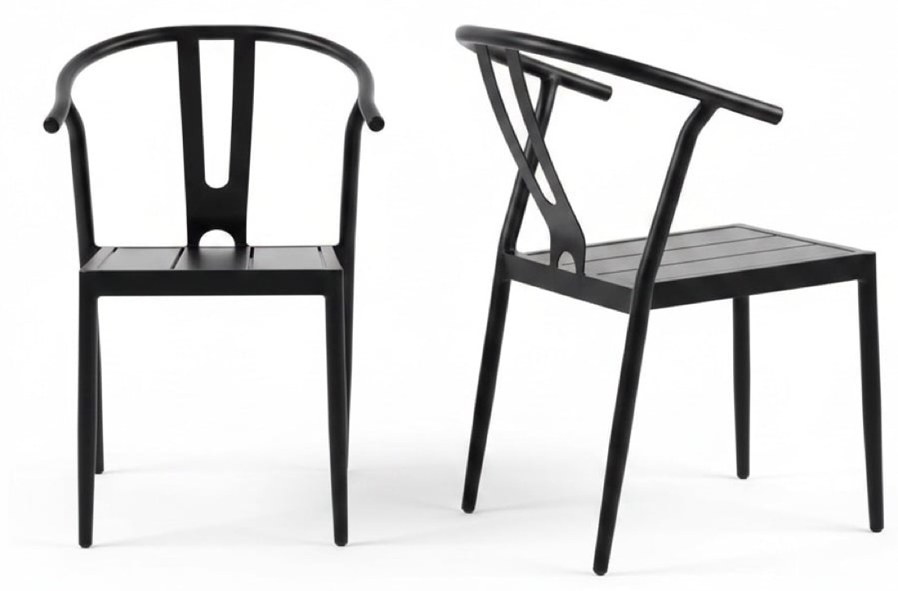
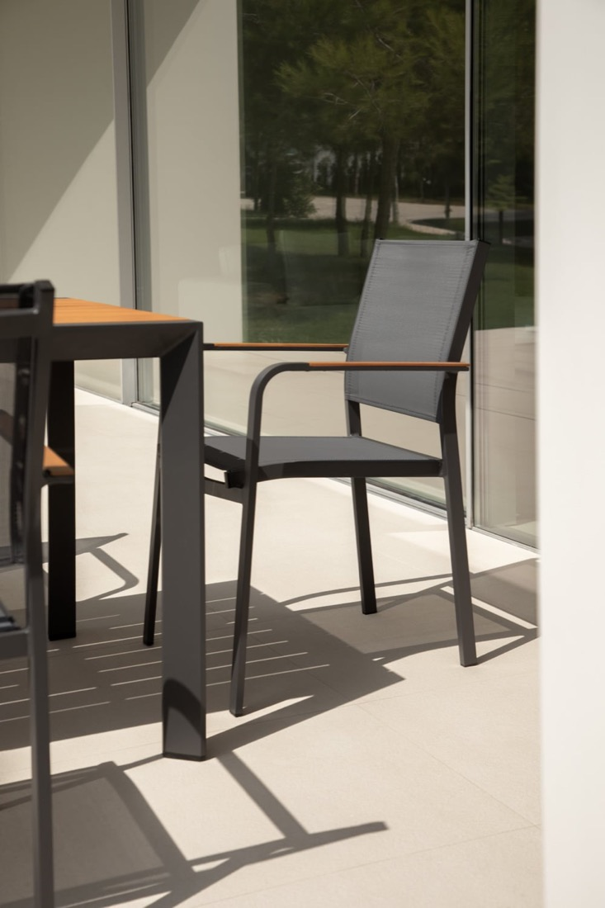

# Roof Terrace — Garden Furniture Options

*Shortlist for the 22 Sussex Square roof terrace (Brighton seafront). Three sections: **Dining tables**, **Dining chairs**, **Sofas & comfy chairs**. Prices captured June 2026 — confirm live before ordering.*

## What we're optimising for
- **Severe coastal exposure** — salt air + high wind. Heavy / corrosion-proof; **teak**, **cast aluminium** or **316 stainless** only — no steel, no thin tube aluminium.
- **Contemporary look** — clean, low, modern lines.
- **Seagull-proof table top** — gulls will foul the dining table, so the **top must be non-porous and wipe-clean**: **ceramic / sintered stone / HPL / glass / powder-coated (or wood-effect) aluminium.** Real **teak/wood tops are porous and stain** from droppings — avoid for the table.
- **Frames out, cushions stored** — only hard frames live outside; all cushions come indoors (storage being built in).
- **Budget** ~£3,000–£6,000 combined.

## Recommended basket (contemporary, dark top, seagull-proof, wind-stable)
| | Item | Price |
|---|---|---|
| **Table** | Maze Maxim — **dark charcoal sintered-stone** top, heavy & wind-stable, table-only | **£1,999** |
| **Chairs** | 10× Teakunique Poppy teak (~8 kg, passes wind) | **£2,050** |
| **Lounge** | Luxus Amalfi Corner teak — or Maluku modular daybed (~£3,000) | **£1,941** |
| | **Total** | **~£5,990** |

Cheaper table alt: **Nardi Rio anthracite** (dark aluminium slat, 54 kg, £1,439) → drops the total to ~£5,430. Both tables are dark, seagull-proof and heavy enough for wind.

---

## How it looks — front-runner pairings

*In our palette: dark table top · anthracite standing-seam wall behind · buff/yellow granite floor · teak Poppy chairs. The teak reads as a warm/cool contrast against the dark top — no clash — and ties to the granite.*

**Maze charcoal stone-top table + Poppy teak chairs**

**Nardi Rio anthracite aluminium table + Poppy teak chairs** (cleaner, more minimal)

---

# 1 · DINING TABLES

**Extending is a hard rule** — every table here extends. **Contemporary = slim aluminium A-frame/legs. Seagull-proof = a non-porous, wipe-clean top.** Grouped by top material — all stain-proof against droppings. (Real teak/wood tops are dropped: porous, they stain.)

## Metal (aluminium) tops — no rust, drains, wipe clean
### Nardi Rio ⭐ — aluminium slat top

- Italian, minimal — powder-coated **aluminium top + frame**; slatted so rain (and a hose) runs straight through. Comes in **anthracite (dark — matches your brief)**. **£1,439**, extends 210→280cm (~10 seats).
- **Weight ~54 kg** — surprisingly heavy for aluminium; **won't blow in normal weather**, anchor only for storm gusts.
- https://www.juliajones.co.uk/nardi-rio-aluminium-outdoor-extending-dining-table-210-280cm/p2120

### Mobellia Amalfi — aluminium A-frame
 

- White/anthracite aluminium A-frame, teak-look top, tool-free extension. **10-seat £599 · 12-seat £799.**
- ⚠ Confirm the top is **aluminium/composite, not real wood**. Light — **ballast against wind**.
- https://www.mobellia.com/en-gb/collections/extending-table

*Budget: generic powder-coated aluminium slatted-top 10-seat extenders (~£300–600, e.g. Garden Chic, Direct Home) — modern and they drain, just lighter-built.*

## Stone tops — sintered stone / ceramic — ultra stain & scratch-proof
### Maze Maxim ⭐ — sintered-stone top

- Aluminium frame + **sintered-stone top** (charcoal) — the toughest, most stain-proof surface going. **£1,999 table-only** (buy without Maze's chairs), extends 8→12.
- The stone top is **heavy → the most wind-stable table here**, *and* fully seagull-proof. **⭐ best all-round for the seafront** — pair with chairs of your choice.
- https://www.mazeliving.co.uk/product/maze-maxim-extending-aluminium-dining-table

### Maze Ambition — ceramic top

- Aluminium frame + **ceramic top**. **Sold only as a full set — £3,349** (table + 10 chairs); **not available table-only**, so if you want a stone top without the chairs, the **Maxim above is the one.**
- https://www.mazeliving.co.uk/product/maze-ambition-10-seat-extending-dining-set/colour/oatmeal-with-grey-frame

### Dark contemporary alternatives to the Maxim

- **Bramblecrest Sofia** ⭐ — **£1,799 for table + 10 chairs** · dark **anthracite ceramic** top on a sculptural **X-leg** aluminium frame (the X-base look from the render). Excellent value — or take the table and use Poppy/Banda chairs. [link](https://crownhillgarden.com/product/bramblecrest-sofia-aluminium-10-seat-patio-set-with-x-leg-extending-table-and-10-chairs-in-anthracite/)
- **Alexander Rose Rimini** — **~£1,293 table-only** · ceramic-glass, but **mid-grey, not charcoal** · extends to 300cm, seats 10–12. [link](https://alexanderrose.shop/products/rimini-extending-table-2-3m-3-0m-x-1-0m)
- **Cane-line Drop (Fossil Black)** — £5,100 table-only · the deepest dark ceramic — premium reference. [link](https://www.worm.co.uk/products/drop-extendable-dining-table)

*Note: the Maxim is unusual in being sold **table-only** — most dark-ceramic 10–12 extenders only come as full sets.*

## Premium design references
**Cane-line** (aluminium or **316 stainless** tops) and **Fermob** (powder-coated, 25 colours) — iconic contemporary. Note **Fermob is steel**, so coastally the coating must stay perfect — **aluminium, 316 stainless or stone tops are the safer seafront bets.**

*Dropped: traditional teak trestle tables (Orchid, Jati, Sandringham) — not contemporary, and a teak top stains from gulls.*

**Alexander Rose — checked (you like the brand):** lovely brand, but their *extending* tables don't fit. Only two extend: the **[Roble Tivoli](https://alexanderrose.shop/collections/outdoor-dining/products/roble-tivoli-extending-table-2m-2-9m-x-1m)** (a **wood** top — stains from gulls) and the **[Portofino](https://alexanderrose.shop/collections/outdoor-dining/products/portofino-metal-extending-table-2-7-1-5x0-9m)** (£531, but **steel** mesh — rusts at the coast, and only ~8 seats). Their nice ceramic **Rimini is fixed-top, not extending.** So AR's clean style is right, but for a dark-ceramic *extender* the Bramblecrest Sofia / Maze Maxim do it instead.

---

# 2 · DINING CHAIRS

Metal, not wood (wood fights the dark ceramic/stone tops). **The £695 chair is not the answer.** The overnight hunt found that affordable, dark, contemporary **aluminium** dining chairs *do* exist — they hide in the **contract / hospitality channel** (built for café terraces). Aluminium = won't rust; slatted seats drain and wipe clean. The one honest open item is **weight** (aluminium is light, ~4–6 kg) → managed by the **wind plan** (tuck under the heavy stone table + bring in for storms, same as the cushions). Want heavier → duplex-galvanised steel.

### ⭐ The solve — contract aluminium (dark, contemporary, won't rust, affordable)
   

*(L→R: Bastille · Chazey · Lincoln · Sklum Archer)*

| Chair | Look | Material | Price | Notes |
|---|---|---|---|---|
| **Cafe Reality Bastille** ⭐ | charcoal vertical-slat, clean modern | aluminium | **£126** | armless; slatted seat drains; contract-grade |
| **Cafe Reality Chazey** | dark slat, stackable | aluminium | **£114** | cheapest slat; black/charcoal |
| **Cafe Reality Lincoln** | black **wishbone** + slat seat | aluminium | **£138** | design-icon shape, with arms |
| **Sklum Archer** | anthracite frame + mesh seat | aluminium | **£89** | cheapest; mesh drains; with arms |

Browse the range (anthracite/charcoal/black, all <£150, contract-grade): [cafereality.co.uk/cat/aluminium-chairs](https://www.cafereality.co.uk/cat/aluminium-chairs). *Weight isn't published — email to confirm before ordering (aluminium, so expect ~4–6 kg → wind plan applies).*

### Heavier, if wind worries you more than looks
- **Duplex-galvanised steel café chairs** — Bolero gun-metal **~£27**, LeisureBench gunmetal £52 · ~5 kg · dark · zinc-under-paint (coastal-OK; treat as a ~5–8 yr consumable + annual freshwater rinse). Industrial Tolix look. [Bolero GL329](https://www.nisbets.co.uk/bolero-bistro-steel-side-chair-gun-metal/gl329)
- **Jati teak-on-hot-dip-galvanised** — **£120–140, 12–15 kg** (the weight champion, genuinely coastal) — but a *traditional café-folding* look, not modern. [Jati](https://www.jati.co.uk/cafe-folding-garden-bistro-chair-black)
- **Lazy Susan cast aluminium** — Kate £180 / 8.3 kg · dark · but lattice/traditional.

### Premium (reference only)
- **Cane-line Lean** (£375–490, **6.45 kg**, black weave + aluminium — lovely, the heaviest of the aluminium chairs, coastal-correct, but ~£4–6k for 10–12) · **Pedrali Intrigo** (~£250, 5.5 kg, anthracite die-cast aluminium) · **Fermob Bellevie** (£695, 19.5 kg — the only dark + genuinely heavy + alu, priced out at scale).
- *(Glassdomain — the retailer for the Lean — site is "new website in progress", no live prices; check back when it's live.)*

**My steer:** the **Cafe Reality Bastille (£126)** or **Chazey (£114)** is the answer — genuinely contemporary, dark, **aluminium so it won't rust**, and affordable; manage the lightness with the table-tuck + storm plan. If wind matters more than the look, the **duplex gun-metal Bolero (~£27)** or the heavy **Jati (12 kg)**. *(Galvanised rule: bare galvanised = silver; for dark you need either duplex galv-then-paint, or aluminium. Avoid plain powder-coated steel like the AR Oslo — it rusts.)*

Links: [Bastille](https://www.cafereality.co.uk/prod/bastille-outdoor-aluminium-side-chair) · [Chazey](https://www.cafereality.co.uk/prod/chazey-outdoor-aluminium-side-chairs) · [Lincoln](https://www.cafereality.co.uk/prod/lincoln-aluminium-outdoor-side-chair) · [Sklum Archer](https://www.sklum.com/uk/buy-garden-chairs/103265-aluminium-stackable-garden-chair-archer.html)

---

# 3 · SOFAS & COMFY CHAIRS

**Daybed key:** ✅✅ push modules into a bed · ✅ pieces combine into a daybed · ◐ reconfigures (L/R, splits) but not flat.

### Luxus Amalfi Corner Teak ⭐ — modern, recommended

- **£1,941** (was £2,999) · solid teak · sleek low modern profile. **Modularity ◐** (customisable L-shape).
- https://www.luxushomeandgarden.com/products/amalfi-corner-teak-sofa-and-table-set

### Teakunique Maluku II Modular ⭐ — best for a daybed
  

- Solid teak · **£825 per corner module** (full set ≈ **£2,500–£3,500**). **Modularity ✅✅** — ottomans push together into a daybed.
- https://teakunique.co.uk/products/maluku-modular-sofa-corner-section

### 4 Seasons Outdoor Piacenza — modern modular ⭐ (mid-price)

- **£2,499** · dark aluminium frame + rope detailing + light cushions · **rounded chaise end to stretch out**. Reputable brand, in stock. Frame ties to the anthracite/dark palette; cushions stored.
- https://themodernfurniturecompany.com/collections/outdoor-sofas

### 4 Seasons Outdoor Alicante — sofa + chairs + stools

- **£2,699** · sofa + 2 armchairs + footstools + coffee table — the "sofa + chairs + stools" combo; footstools nudge together for a lounger. Dark aluminium + rope, light cushions.
- https://themodernfurniturecompany.com/collections/outdoor-sofas

### Sherborne Teak Corner — value classic

- **£1,499** · Grade A teak, 5-seat corner + coffee table, made in England. **Modularity ◐** — chaise clamps L/R. *High-back classic style* (not the low modern look).
- https://www.gardenbenches.com/wooden-garden-corner-sofa-sets

### Maze Eve Corner — charcoal modular ⭐ (value, dark frame)

- **£1,985** · slim **charcoal aluminium**, low modern corner; **arms convert to side tables**; reconfigurable. In stock. The dark frame ties straight into the palette.
- https://outdoorluxeonline.com/products/maze-outdoor-fabric-eve-corner-group-charcoa

### Tribu Mood — premium teak

- **£2,560** · A-grade teak frame + woven Tricord, low minimalist lounger. Premium Belgian design.
- https://www.gomodern.co.uk/tribu-mood-garden-sofa.html

*More wider-supplier options (not pictured): Fast Aikana aluminium daybed (£3,330, Go Modern), Heal's Eos modular (£1,808), Skagerak Tradition teak modular (~£1,865/module), Emu Tami matt-black aluminium (£3,170).*

### Cane-line Space — premium reference (the look to aim for)

- Very low modern modular **daybed** — slim dark aluminium base + integrated **teak** table + light cushions; sits perfectly with the dark/teak palette. **Premium: ~£4,470 per module** (a full set is well over budget) — here as the aspiration; the Piacenza and Maluku get a similar low-modular look for far less.
- https://www.worm.co.uk/products/space-daybed-module-with-teak-table-left

---

## Build quality — independent checks

Honest summary of what independent sources say (the headline: review evidence is *thin* for Nardi and Teakunique — not bad, just sparse — and *mixed* for Maze).

- **Nardi Rio** — Italian, **contract/commercial-grade**, made in Italy, award-winning; well-regarded by the trade. But almost no independent buyer reviews, and the one substantive review reported the **aluminium top scratches easily** and a **refused transit-damage claim**. **Do:** order the **"Rio Alu"** (all-aluminium, not the resin Rio), **request Nardi's optional saltwater anti-corrosion treatment**, get the **~2-yr warranty + delivery-damage cover in writing**, and **inspect on arrival**.
- **Teakunique Poppy / Banda** — small UK family firm, Indonesia-made, **strong 10-year warranty**. No complaint cluster — but also **no independent review base**, and the "Grade A teak" claim is **self-asserted, not verified**. **Do:** **order a sample** to check the teak, and look up Teakunique's live Google rating before committing. (Teak will silver and develop hairline cracks — normal, not a defect.)
- **Maze (Maxim/Ambition)** — headline Trustpilot ~4.3/5 (≈9,000), but a real tail of complaints: **delivery damage / chipped sintered-stone tops**, **powder-coat peeling**, slow replacement parts, and a **narrow warranty** (structural + rust only; 48-hr defect window). **Do:** confirm the **ceramic/stone top is covered in writing**, and **inspect the top carefully on delivery** (the stone edges chip in transit). Reasonable mid-market value, not premium.

**Bottom line:** Nardi Rio and the Teakunique chairs are sound coastal choices *with conditions* (anti-corrosion spec + warranty in writing for Nardi; a sample for Teakunique). The Maxim is good value but has a known delivery-damage risk on the stone top — inspect on arrival or consider the Bramblecrest Sofia as the alternative. On all aluminium pieces the weak point at the seafront is the **powder coating** — inspect for chips on delivery and rinse salt off periodically.

## Timing & checklist
- **Buy in the Aug–Sept clearance** (fit-out completes late Sept 2026) — best discounts on aluminium/rope sets; teak specialists barely move seasonally.
- [ ] Confirm the table's **top is non-porous** (ceramic/HPL/aluminium) and its **largest size seats 10–12**.
- [ ] Confirm sofa cushions are **Olefin/Sunbrella + quick-dry foam**; frames have a slatted base so they look right with cushions off.
- [ ] **Ballast/anchor** big pieces + the aluminium table against wind (no roof penetration — coordinate with Ronan).
- [ ] Order **samples** before committing.
