

# Roof Terrace — Garden Furniture Options

*Shortlist for the 22 Sussex Square roof terrace (Brighton seafront). Sections: **Dining tables · Dining chairs · Sofas & comfy chairs (FA3)**, then the **narrow-terrace casual pieces — bistro table · coffee table · lounge chairs**. Prices captured June 2026 — confirm live before ordering.*

---

## Contents

**[What we're optimising for](#optimising)** · **[Recommended basket](#basket)** · **[How it looks](#looks)**

**[1 · Dining Tables](#tables)**
- Metal tops: [Nardi Rio £1,439](#nardi-rio) · [Mobellia Amalfi £599–799](#mobellia-amalfi) · [Vermobil Extia £1,333 ⭐](#extia)
- Stone tops: [Bramblecrest Sofia £1,799 ⭐](#bramblecrest-sofia)
- Teak top: [Maze Jakarta £1,059 ⭐](#maze-jakarta)

**[2 · Dining Chairs](#chairs)**
- **With arms:** [Fox armchair £177 ⭐](#fox) · [Si-Si armchair ~£185 ⭐](#si-si) · [Twist armchair £209 ⭐](#twist) · [Daisy armchair ~£209+ ⭐](#daisy) · [Alua with arms ~£260](#alua)
- **Without arms:** [Fox side £167 ⭐](#fox) · [Si-Si side £181 ⭐](#si-si) · [Alua £233 ⭐](#alua)
- **Teak — Route A:** [Luxus Sydney ~£176](#teak-sydney) · [Sustainable Arc £195](#teak-arc) · [Teakunique Poppy £205 ⭐](#teak-poppy) · [Sklum Rokan £250](#teak-rokan)

**[3 · Sofas & comfy chairs](#sofas)**
- **Aluminium (route to a full U in budget):** [Quatropi Zara ⭐](#zara) · [Kettler Elba ⭐](#kettler-elba) · [Stoaked bespoke U-base ⭐](#stoaked) · [Harbour Panama (by module)](#harbour-panama) · [4 Seasons Meteoro](#meteoro) · [other à-la-carte ranges](#alu-other)
- **Teak (~£5k, no real daybed):** [Maluku II ⭐](#maluku) · [Indian Ocean Cove](#cove)

**[4 · Bistro Table](#bistro)** *(round, ~70–75cm, narrow terrace)*
- [Nardi Combo Ø70 resin £145 ⭐](#nardi-combo) · [Nardi Spritz/Step Ø60.5 Tortora £90–110](#nardi-step) · ~~[Mason beige ceramic £168](#mason-bistro)~~ ✗ steel base, 90cm

**[5 · Coffee Table](#coffee)** *(round, low, narrow-terrace lounge)*
- [Nardi Step/Spritz Tortora £77–110 ⭐](#nardi-step) · [Maze Milan ceramic pair £195](#maze-milan) · ~~[Modus gas-lift £308](#modus-coffee)~~ ✗ steel base + gas-lift

**[6 · Narrow-terrace lounge chairs](#narrow-lounge)** *(paint-free through-colour resin)*
- [Nardi Folio £153 ⭐](#nardi-folio) · [Nardi Net Relax £122 ⭐](#nardi-net-relax) · [Allibert California ~£165](#allibert-california)

**[Heat science — colour limits by material](#heat-science)** · **[Timing & checklist](#checklist)**

---

## What we're optimising for
- **Severe coastal exposure** — salt air + high wind. Heavy / corrosion-proof; **teak**, **cast aluminium** or **316 stainless** only — no steel, no thin tube aluminium.
- **Contemporary look** — clean, low, modern lines.
- **Seagull-proof table top** — gulls will foul the dining table, so the **top must be non-porous and wipe-clean**: **ceramic / sintered stone / HPL / glass / powder-coated (or wood-effect) aluminium.** Real **teak/wood tops are porous and stain** from droppings — avoid for the table.
- **Frames out, cushions stored** — only hard frames live outside; all cushions come indoors (storage being built in).
- **Budget** ~£3,000–£6,000 combined.

[↑ Contents](#contents)

---

## Recommended basket (contemporary, dark top, seagull-proof, wind-stable)
| | Item | Price |
|---|---|---|
| **Table** | Bramblecrest Sofia — **dark anthracite ceramic** top, X-leg, table + 10 chairs | **£1,799** |
| **Chairs** | Included with Sofia — or upgrade to Si-Si/Twist/Fox in preferred colour | **£0–£2,090** |
| **Lounge** | **Aluminium U (Stoaked bespoke base / Quatropi sections / Harbour Panama)** — full U + daybed + stored cushions in budget; anthracite ties to the building. Teak (Maluku II) = warm-wood near-U alternative | **~£2,900–£4,000** |
| | **Total (table + included chairs + lounge)** | **~£3,740** |

Teak alt: **Maze Jakarta** (warm teak top, dark grey frame, £1,059) + teak chairs (10× Poppy ~£2,050) + lounge → ~£5,050. Stone alt: **Bramblecrest** as above. Metal alt: **Extia + Daisy armchairs** for a warm/light beige/tortora look.

[↑ Contents](#contents)

---

## How it looks — the options

### Route B — Bramblecrest Sofia stone table + SCAB Si-Si chairs (with cushions)

### Route A — Teak table + Poppy teak chairs aged to silver-grey (zero maintenance, honest look)

### Vermobil — Extia steel table (Beige) + Daisy armchairs

### Nardi Rio (Tortora) + Daisy armchairs (Beige) — warm tone-on-tone

### Mobellia Amalfi (Taupe) + Daisy armchairs (White)

[↑ Contents](#contents)

---

# 1 · Dining Tables

**Extending is a hard rule** — every table here extends. **Contemporary = slim aluminium A-frame/legs. Seagull-proof = a non-porous, wipe-clean top.** Grouped by top material — all stain-proof against droppings. (Real teak/wood tops are dropped: porous, they stain.)

---

## Metal (aluminium) tops — no rust, drains, wipe clean

### Nardi — Rio ⭐ (aluminium slat top)

*Photo: Tortora (warm greige/taupe) — the preferred colour. Also available in Anthracite and Bianco.*

- **Price:** £1,439 table-only
- **Size:** 210×100cm → **280×100cm** (extends, ~10 seats) · H76cm
- **Material:** Powder-coated aluminium frame + slatted aluminium top
- **Colour:** **Tortora** (warm greige, preferred) · Bianco (white) · Anthracite — 3 options
- **Heat safety (slatted aluminium):** ✅ Bianco · ✅ Tortora · ⚠ Anthracite (hot on still days — slatted gaps help a little; Brighton breeze usually compensates)
- **Weight:** ~54 kg (unusually heavy for aluminium)
- **Reviews:** juliajones.co.uk — not independently checked on Trustpilot; established UK specialist outdoor furniture retailer. Nardi is Italian contract/commercial-grade, award-winning — well-regarded by the trade.

**Pros:**
- Slatted top drains rain/hose instantly; wipe-clean; seagull-proof
- 54 kg = very heavy for aluminium; won't blow in normal weather
- Italian contract grade

**Cons:**
- One buyer report: top scratches easily; transit-damage claim refused — inspect carefully on delivery
- Order the "Rio Alu" version (not the resin Rio); request Nardi's optional saltwater anti-corrosion treatment

[juliajones.co.uk — Nardi Rio](https://www.juliajones.co.uk/nardi-rio-aluminium-outdoor-extending-dining-table-210-280cm/p2120)

[↑ Tables](#tables) · [↑ Contents](#contents)

---

### Mobellia — Amalfi (aluminium A-frame)

*Photo: white frame + taupe top (recommended combination — ✅ heat safe and warm look).*

- **Price:** 10-seat £599 · 12-seat £799
- **Size:** **⭐ Preferred: 10-seat 200→260×96cm** (fits ≤220cm compact constraint) · 12-seat 240→300×96cm · H75cm
- **Material:** Aluminium A-frame; **cemented composite top** (non-porous, wipe-clean — confirmed from Mobellia's site)
- **Colour:** Anthracite frame · White frame; top in **anthracite, taupe, or wood-effect** — 4 combinations
- **Heat safety (solid aluminium/composite top):** ✅ White frame + taupe top · ✅ White frame + wood-effect top · ⚠ White frame + anthracite top (top still gets hot despite pale frame) · ❌ Anthracite frame + anthracite top
- **Reviews:** mobellia.com — not independently verified on Trustpilot; online-only retailer; check returns policy before ordering.

**Pros:**
- Lowest price by far; tool-free extension; modern A-frame look
- Composite top is seagull-proof (non-porous)
- **Starts at 200cm** — fits when you need it compact

**Cons:**
- Light build — ballast against wind
- No independent review base found

[mobellia.com — Amalfi 10-seat (200→260cm)](https://www.mobellia.com/en-gb/products/automatic-extendable-garden-table-10-seats-aluminium-amalfi-200-260x96?variant=56303906750812)

[↑ Tables](#tables) · [↑ Contents](#contents)

---

### Vermobil — Extia ⭐ (steel flat top — matches Fox & Twist palette)

*Extia table in Beige BE — solid flat steel top, clean contemporary lines.*

- **Price:** £1,333 (from £1,778 — 25% off) table-only
- **Size:** Size 1: 140→200×80cm · **Size 2: 180→250×90cm** (preferred — more width and length for 8–10 seats)
- **Material:** **Duplex galvanised + qualicoat powder-coated steel** — same coastal-safe construction as the Fox & Si-Si chairs
- **Top:** Solid flat steel — wipe-clean, seagull-proof ✓
- **Colour:** **7 options — identical palette to Fox chairs and Twist armchair**: Black NE · Grey Mud FA · Ancient Grey AG · Ivory White BS · Matt White BCU · Bronzo BRO · Beige BE (see swatch below)
- **Heat safety (solid steel top — strictest rule):** ✅ Ivory White BS · ✅ Matt White BCU · ✅ Beige BE · ⚠ Ancient Grey AG (borderline — likely fine with Brighton coastal breeze) · ❌ Black NE · ❌ Bronzo BRO · ❌ Grey Mud FA
- **Weight:** Not published — steel construction likely heavier than aluminium alts ✓
- **Reviews:** deluxdeco.co.uk — **5.0/5 Trustpilot (235 reviews).** Same retailer as Fox; excellent service.
- **Lead time:** 6–10 weeks (made to order)
- **Guarantee:** 10-year frame

*Shared colour palette — Fox chairs, Twist armchair, and Extia table all available in these 7 finishes.*

**Pros:**
- ⭐ **Designed as a matched set** with Fox chairs and Twist armchair — table and chairs in identical colour, from one supplier
- Duplex galv construction = dark colours + coastal-safe (zinc under every chip)
- Solid flat top = completely seagull-proof, wipe-clean
- Both sizes start ≤220cm compact ✓
- 10-year guarantee; excellent retailer

**Cons:**
- Steel top gets hot in direct sun — **choose Ivory, Matt White, Beige or Ancient Grey** (see Heat safety above); darker colours will be uncomfortable to rest arms on
- Size 2 at 250cm extended seats 8–10; confirm 10 chairs fit comfortably (armchairs need more room per seat)
- 6–10 week lead time — order before August for September fit-out
- Weight not published; confirm it's heavy enough to resist wind without ballasting

[deluxdeco.co.uk — Extia extendable table](https://www.deluxdeco.co.uk/extia-extendable-table.html)

[↑ Tables](#tables) · [↑ Contents](#contents)

---

## Stone tops — sintered stone / ceramic — ultra stain & scratch-proof

### Bramblecrest — Sofia ⭐ (dark ceramic X-leg, best value)

- **Price:** £1,799 for table + 10 chairs
- **Size:** Extending X-leg table; standard Sofia tables run 165–200×95cm (6–8 seats); 10-seat extending version — ⚠ **exact extended dimensions not published online; confirm with Crownhill or Bramblecrest before ordering**
- **Material:** Aluminium X-leg frame + dark anthracite ceramic top
- **Colour:** Anthracite
- **Heat safety (ceramic top — most lenient):** ✅ Anthracite ceramic is comfortable to touch — ceramic's low thermal effusivity means it doesn't burn even when hot
- **Reviews:** Bramblecrest brand — **4.5/5 Trustpilot (4,600+ reviews), 5-year structural guarantee.** One of the better-reviewed brands here. Strong customer service.

**Pros:**
- ⭐ Excellent value — dark ceramic top + sculptural X-base + 10 chairs for £1,799
- Dark anthracite ties directly to the palette
- Take the table and pair with better chairs of your choice

**Cons:**
- Sold as a set only (not table-only)
- ⚠ Exact extended dimensions not published — **confirm before ordering**

[crownhillgarden.com — Bramblecrest Sofia](https://crownhillgarden.com/product/bramblecrest-sofia-aluminium-10-seat-patio-set-with-x-leg-extending-table-and-10-chairs-in-anthracite/)

*Other dark-ceramic alternatives:* **Alexander Rose Rimini** ~£1,293 (table-only, ceramic-glass, mid-grey not charcoal, extends to 300cm) · **Cane-line Drop (Fossil Black)** £5,100 (the deepest dark ceramic — premium reference only).

[↑ Tables](#tables) · [↑ Contents](#contents)

---

## Teak top — warm, natural, pairs with both teak and metal chairs

### Maze — Jakarta ⭐ (teak slat top + dark grey aluminium frame)

*Photo shown extended with upholstered chairs — the table top and dark grey frame are the point.*

- **Price:** £1,059 table-only (from [mazeliving.co.uk](https://www.mazeliving.co.uk/product/maze-jakarta-10-seat-extending-dining-table-teak-grey-frame))
- **Size:** **200×100cm → 260×100cm → 320×100cm** (three-step extension, 6→8→10 seats) · H75cm · ✓ **Starts at 200cm — fits the ≤220cm compact constraint**
- **Material:** Dark grey powder-coated aluminium frame + **solid teak slat top**
- **Colour:** Single option — warm teak top + dark grey frame
- **Heat safety:** ✅ Teak top stays comfortable at any temperature (very low thermal effusivity — like wood). Grey aluminium frame is on the underside/legs — not a contact surface.
- **Teak top note:** Teak is porous — seagull droppings must be wiped promptly or they can stain. With regular wiping (which you'd do anyway), entirely manageable. Top will silver to a warm grey patina if not oiled; apply teak oil once a season to maintain the warm honey colour.
- **Weight:** Not published — solid teak + aluminium frame will be substantially heavier than all-aluminium alts ✓
- **Reviews:** mazeliving.co.uk — **~9,600 Trustpilot reviews, mixed.** Strong on contemporary ranges; known delivery-damage risk on larger items — inspect carefully on arrival.

**Pros:**
- ⭐ **Bridges Route A and Route B** — warm teak top looks natural with teak chairs OR with dark/beige metal chairs
- Dark grey frame is contemporary and contrasts beautifully with the warm teak
- Competitive price vs other stone/ceramic tables
- Three-step extension; 200cm compact ✓

**Cons:**
- Teak top requires prompt wiping of bird fouling (seagulls) — less forgiving than ceramic/sintered stone
- Teak grade not specified in spec sheets — confirm Grade A / FSC before ordering
- Mixed Maze delivery reviews — inspect on arrival

[mazeliving.co.uk — Maze Jakarta](https://www.mazeliving.co.uk/product/maze-jakarta-10-seat-extending-dining-table-teak-grey-frame)

[↑ Tables](#tables) · [↑ Contents](#contents)

---

# 2 · Dining Chairs

Two routes. **Route B = metal** (this group, below): aluminium won't rust; steel needs to be **duplex galvanised** (zinc under the colour, survives chips) or **316 stainless**; all seats bare metal — wipe-clean, drain, no fixed cushions. **Route A = teak** is a separate group further down → [Teak dining chairs — Route A](#teak-chairs).

**Chairs with arms** (Alex's preference): [Zaltana £145](#zaltana) · [Fox armchair £177](#fox) · [Culip £179](#culip) · [Joncols £199](#joncols) · [Twist armchair £209](#twist) · [Daisy armchair ~£209+](#daisy). Any of these mix well with the armless versions from the same brand/palette.

---

### Vermobil — Fox · £167 (side chair) / £177 (armchair) ⭐ matches Extia table & Twist armchair

**Side chair — no arms:**

**With optional seat cushion:**

*Seat cushion shown in Grey Mud (olive) — available in 8 outdoor fabrics, store indoors.*

**Armchair — with arms (£10 more):**

*Fox armchair with the Extia table — same Vermobil collection.*

**Colour palette (shared with Extia table and Twist armchair):**

- **Price:** Side chair £167 (RRP £222) · Armchair £177 (RRP £236) · **Lead time: 6–10 weeks** (made to order)
- **Size:** Side chair W45 × D53 × H81cm · Armchair wider — confirm with deluxdeco
- **Material:** **Duplex galvanised + qualicoat powder-coated steel** — confirmed coastal-safe
- **Colour:** 7 options — **same palette as Extia table and Twist armchair** (see swatch above) · **Heat safety (solid pressed steel seat — strictest rule):** ✅ Ivory White BS · ✅ Matt White BCU · ✅ Beige BE · ⚠ Ancient Grey AG (borderline — coastal breeze usually fine) · ❌ Black NE · ❌ Grey Mud FA · ❌ Bronzo BRO — solid seat means full skin contact; dark colours will be painful to sit on in shorts in direct sun · **Weight:** Unpublished · **Arms:** Armchair version £177 · **Stackable:** Yes · **Seat:** Smooth pressed steel shell (wipe-clean); 8 cushion fabrics separately (UV/water/mould resistant, 5-yr warranty)
- **Reviews:** deluxdeco.co.uk — **5.0/5 Trustpilot (235 reviews). Excellent.**

**Pros:** Confirmed duplex galv = properly coastal-safe; smooth pressed-steel seat; armchair option; perfectly matched to Extia table and Twist armchair from same brand; excellent retailer · **Cons:** ⚠ 6–10 week lead time — order July for Sept fit-out; weight unpublished

[deluxdeco.co.uk — Fox side chair](https://www.deluxdeco.co.uk/fox-chair.html) · [Fox armchair](https://www.deluxdeco.co.uk/fox-armchair.html)

[↑ Chairs](#chairs) · [↑ Contents](#contents)

---

### Vermobil — Twist armchair ⭐ · £209 (with arms — matches Fox & Extia)

*Photo in dark bronze/anthracite — same slatted seat, slim arms, dining height.*

**Colour palette (shared with Fox chairs and Extia table):**

- **Price:** £209 (from £279 — 25% off) · **Lead time: 9–15 weeks** ⚠ (made to order — order by July for September fit-out)
- **Size:** W55 × D56 × H88cm (dining height)
- **Material:** **Duplex galvanised + qualicoat powder-coated steel** — same coastal-safe construction as Fox
- **Colour:** 7 options — **identical palette to Fox chairs and Extia table** (see swatch above) · **Heat safety (slatted steel seat, solid arms):** ✅ Ivory White BS · ✅ Matt White BCU · ✅ Beige BE · ⚠ Ancient Grey AG · ❌ Black NE · ❌ Grey Mud FA · ❌ Bronzo BRO — slatted seat is slightly cooler than Fox's solid pan; arms are solid steel and will be hot in dark colours · **Weight:** Unpublished · **Arms:** Yes ✓ · **Stackable:** Yes · **Seat:** Slatted metal (drains, wipe-clean); cushion options likely available — confirm with deluxdeco
- **Reviews:** deluxdeco.co.uk — 5.0/5 Trustpilot (235 reviews). Excellent.

**Note:** Back panel appears to have a separate insert in the product photo — **confirm with deluxdeco whether the back is all-metal or includes a fabric/textile component** (if fabric, it needs to come indoors like cushions).

**Pros:** ⭐ Arms make it more comfortable for long dinners; perfectly matched to Fox side chairs and Extia table — can mix armchairs and side chairs in one palette; stackable; duplex galv = coastal-safe · **Cons:** 9–15 week lead time is the longest on this list — order early; 55cm width means armchairs take more table room (8 fit around a 250cm table, not 10); back panel to confirm

[deluxdeco.co.uk — Twist armchair](https://www.deluxdeco.co.uk/twist-armchair.html)

[↑ Chairs](#chairs) · [↑ Contents](#contents)

---

### Vermobil — Daisy armchair ⭐ · ~£209+ (confirm with arredinitaly or Vermobil UK dealer)

*Photo: Daisy armchair in beige/taupe with cushion.*

- **Price:** ~£209+ (was from £209 at deluxdeco who no longer stock Vermobil — confirm current price via [arredinitaly.com/gb](https://www.arredinitaly.com/gb/98_vermobil) or Vermobil's new UK dealer)
- **Material:** **Duplex galvanised + qualicoat powder-coated steel** — same coastal-safe construction as the Fox, Si-Si, and Extia
- **Colour:** Beige/taupe and other options (confirm range with supplier) · **Heat safety (duplex steel, solid arms):** ✅ Beige/Ivory — the warm light tone + duplex galv construction makes this the best heat-safe armchair on the list; ⚠ mid-tones; ❌ dark anthracite/black
- **Weight:** Not published · **Arms:** Yes ✓ · **Stackable:** Yes (up to 8) · **Seat:** Cushioned seat + wire/panel back; cushion stored indoors
- **Available from:** arredinitaly.com/gb (ships to UK — already our Si-Si supplier) or Vermobil's new UK dealer (pending)

**Pros:**
- ⭐ **Ideal companion for Nardi Rio Tortora, Mobellia taupe, Extia Beige, or Jakarta** — beige/white options create a warm, cohesive look across the full dining set
- Arms ✓; stackable ✓; duplex galv coastal-safe ✓
- Same Vermobil family as Fox, Mogan, Twist, Extia — consistent build quality

**Cons:**
- Price unconfirmed since deluxdeco dropped Vermobil — get a quote before assuming the ~£209 figure
- Cushions required for comfort (seat cushion stored indoors)

[arredinitaly.com/gb — Vermobil range](https://www.arredinitaly.com/gb/98_vermobil)

[↑ Chairs](#chairs) · [↑ Contents](#contents)

---

### SCAB Design — Si-Si ⭐ · £181 (2503 side chair) / ~£185 (2502 armchair)

**Side chair 2503 — no arms:**

*Si-Si 2503 in **anthracite** — the correct dark colourway (ZA).*

**With optional seat cushion (shown in dove grey ZT):**

*Cushion shown in Dove Grey (ZT) — same cushion available in anthracite. Seat cushion is an optional extra; store indoors when not in use.*

**Armchair 2502 — with arms (~£185):**

*Si-Si 2502 armchair in linen/sand — same curved pressed-steel seat and back, slim steel arms added. Same colours as the 2503 including anthracite and dove grey. Sold in pairs; confirm current UK price at arredinitaly.com/gb.*

- **Price:** 2503 side £181/chair · 2502 armchair ~£185/chair (both sold in pairs)
- **Size:** 2503 side W51 × D55 × H80cm · 2502 armchair W62 × D55 × H80cm · Seat H44cm (CATAS-certified)
- **Material:** **Duplex galvanised + powder-coated steel** — zinc under the paint → dark AND rustproof
- **Colour:** **Anthracite (ZA)** and **Dove Grey (ZT)** both available (full range incl. linen, terracotta, aviation blue, olive green) · **Heat safety (solid pressed steel seat — strictest rule):** ⚠ Dove Grey ZT (borderline — better than anthracite but still warm for steel; use a seat cushion in summer) · ❌ Anthracite ZA (dark steel seat will be hot on bare skin in shorts) · **Weight:** ~8.7 kg/chair (per italivingoutdoor spec; sold in pairs) · **Arms:** 2503: No · 2502: Yes · **Stackable:** Yes (both models) · **Seat:** Pressed/curved steel sheet (wipe-clean)
- **Reviews:** arredinitaly.com — positive Trustpilot (47 reviews — small sample; Chamber of Commerce registered; legitimate Italian retailer).

**Pros:** **~8.7 kg** — best wind resistance of any non-teak option; duplex galv = dark AND coastal-safe; **dove grey is a genuine grey option**; armchair version ~£4 more; Italian CATAS-certified · **Cons:** Small retailer (47 reviews); sold in pairs only; confirm UK delivery lead time; 2502 armchair UK price unconfirmed (listed at ~£185 est.)

[arredinitaly.com — SCAB Si-Si 2503](https://www.arredinitaly.com/gb/metal-chairs/13893-si-si-2503-chairs-scab-design.html)

[↑ Chairs](#chairs) · [↑ Contents](#contents)

---

### HOUE — Alua ⭐ · ~£233 armless *(stretch)* / ~£260 with arms

**Armless (side chair):**

**Also available with arms (~£260):**

*Alua armchair in beige — same slatted aluminium, slim arms added. ~€299/~£260/chair at smow or connox. Same 6 colours, stackable to 10, 5-year warranty.*

- **Price:** Armless ~£233/chair (Holloways) · With arms ~£260/chair (smow/connox — stretch)
- **Material:** Powder-coated marine aluminium
- **Colour:** Black · Muted white · Olive green · Beige · Cayenne red · Ice blue — **no grey available** · **Heat safety (slatted aluminium):** ✅ Muted white · ✅ Beige · ✅ Ice blue · ⚠ Olive green (medium tone) · ⚠ Cayenne red (medium-dark absorptivity) · ❌ Black · **Weight:** ~4.8 kg armless / ~5 kg with arms (published) · **Arms:** No (armless) / Yes (armchair version) · **Stackable:** Yes (up to 10) · **Seat:** Curved slatted seat + back (drains)
- **Reviews:** Holloways of Ludlow — **4.9/5 Trustpilot (500+ reviews). Excellent.**

**Pros:** Most refined / architectural aluminium chair here; published weight; stacks 10 high; armchair version available; Danish design; 5-year warranty · **Cons:** Over budget at £233–260 (stretch); no grey colourway available; armchair pushes further into stretch territory

[hollowaysofludlow.com — HOUE Alua](https://www.hollowaysofludlow.com/products/houe-alua-dining-chair)

[↑ Chairs](#chairs) · [↑ Contents](#contents)

---

**Steer:** **Vermobil Fox (£167/177)** — confirmed duplex galv, side or armchair, matches Extia/Twist palette; 6–10 week lead time. **SCAB Si-Si (£181/~185, 8.7 kg)** — heaviest, side or armchair, dove grey option. **HOUE Alua (£233)** — most architectural aluminium, armchair version also available at ~£260.

[↑ Top](#top) · [↑ Contents](#contents)

---

## Teak dining chairs — Route A

Solid teak instead of metal. Teak is naturally oily, rot-proof and salt-tough — left out it silvers to grey with **zero maintenance**, and at ~8–12 kg it passes the Brighton wind test where light aluminium doesn't. All bare-teak seats drain and are seagull-proof; any removable pad stores indoors. Sorted cheapest first. **Verify by eye and order a sample first** — teak grade and finish vary a lot between sellers.

All four chairs share the same **rounded barrel-back** aesthetic — very clean and contemporary. Sydney and Arc have arms; Poppy is armless with the narrowest footprint; Rokan is darker oiled.

---

### Luxus Home & Garden — Sydney · ~£176 (armchair, stackable)

*Set of 4 stacked — clear view of the curved barrel back and stackability. Seat cushion included, stored indoors.*

- **Price:** ~£176/chair (sold in sets of 4, £706 — or as part of a table set)
- **Material:** Indonesian teak, **SVLK certified** (EU Timber Regulation compliant)
- **Colour:** Natural teak (silvers if left out) · **Weight:** Unpublished · **Arms:** Yes (flowing arms extending from the curved back) · **Stackable:** Yes (confirmed) · **Seat:** Cushioned seat pad (store indoors); bare teak seat base drains
- **Dimensions:** 65cm W × 59cm D × 76cm H
- **Reviews:** luxushomeandgarden.com — **4.6/5 Trustpilot (675 reviews).** Generally positive; same retailer as the Amalfi sofa set.

**Pros:** Beautiful rounded barrel-back — the same family as the Poppy aesthetic at lower price; stackable; certified teak; good retailer · **Cons:** Arms (wider profile); cushion must come indoors; SVLK but no Grade A/FSC stated; weight unpublished

[luxushomeandgarden.com — Sydney chair (set of 4)](https://www.luxushomeandgarden.com/products/4-x-sydney-chairs-with-cushions)

[↑ Chairs](#chairs) · [↑ Contents](#contents)

---

### Sustainable Furniture — Arc · £195 (armchair, stackable)

*Poolside lifestyle shot — clear curved rounded back and slim arm profile. Seat cushion included, stored indoors.*

- **Price:** £195/chair
- **Material:** Indonesian teak, **SVLK certified**
- **Colour:** Natural teak · **Weight:** Unpublished · **Arms:** Yes (slim, integrated with the curved back) · **Stackable:** Yes · **Seat:** Seat cushion included (store indoors); seat height 45cm
- **Reviews:** sustainable-furniture.co.uk — smaller retailer; SVLK certification and dedicated outdoor focus are positive signals. Arrives fully assembled.

**Pros:** Refined modern silhouette; sculpted curved back; stackable; SVLK certified; fully assembled · **Cons:** Arms; smaller/less-reviewed retailer; weight unpublished; cushion must come in

[sustainable-furniture.co.uk — Arc](https://sustainable-furniture.co.uk/product/arc-stacking-dining-armchair/)

[↑ Chairs](#chairs) · [↑ Contents](#contents)

---

### Teakunique — Poppy ⭐ · £205 (armless, stackable)

*Poppy in natural teak — the rounded arch back extends down to form a clean enclosure around the seat. No forward armrests: truly armless.*

- **Price:** £205/chair
- **Material:** Solid teak, responsibly sourced — certified plantation teak. No FSC/Grade-A label stated but "high-grade responsibly sourced" per Teakunique; **10-year guarantee.**
- **Colour:** Natural teak (silvers left out; oil to keep honey colour) · **Weight:** Unpublished (Teakunique site: "to follow") · **Arms:** No · **Stackable:** Yes · **Seat:** Optional seat pad sold separately (stored indoors); seat 45cm W (front) × 36cm W (back) × 42cm D, height 43cm
- **Dimensions:** 53cm W × 58cm D × 76cm H
- **Reviews:** teakunique.co.uk — self-hosted; Chris has quality/provenance concerns — limited independent review coverage for this brand.

**Pros:** ⭐ **The benchmark** — curved arch back, truly armless, stackable, narrowest footprint; longest guarantee (10 yr); the design most chairs on this list are compared against · **Cons:** No independent Trustpilot; weight unpublished; Grade A/FSC not explicitly stated; slightly higher price for an unverified brand

[teakunique.co.uk — Poppy](https://www.teakunique.co.uk/collections/teak-dining-chairs/products/poppy-stacking-chairs)

[↑ Chairs](#chairs) · [↑ Contents](#contents)

---

### Sklum — Rokan · £250 *(stretch)*

*Rokan in darker oiled teak — rich warm tone, very clean rounded back. Shown with a round marble-style table.*

- **Price:** £250/chair (was £275)
- **Material:** Teak — stated explicitly; ⚠ no Grade A, FSC, or SVLK certification mentioned
- **Colour:** Dark oiled teak (richer/darker than the other chairs here) · **Weight:** Unpublished · **Arms:** Yes · **Stackable:** Not confirmed · **Seat:** Bare teak (drains, seagull-friendly); integrated cushion shown in photo — confirm if removable
- **Reviews:** sklum.com — Sklum is an established European furniture retailer (same brand as the Archer metal chair already considered).

**Pros:** Striking contemporary Japandi aesthetic; darker tone works well against a stone table; clean rounded back; Sklum is a known retailer · **Cons:** Stretch at £250; no sustainability certification; stackability unconfirmed; arms; weight unpublished

[sklum.com — Rokan](https://www.sklum.com/uk/buy-garden-chairs/171293-rokan-teak-garden-chair.html)

[↑ Chairs](#chairs) · [↑ Contents](#contents)

---

**Steer (teak / Route A):** All four share the rounded barrel-back look. **Luxus Sydney (~£176)** and **Sustainable Arc (£195)** — armchair versions, certified teak, stackable, cushion in. **Teakunique Poppy (£205) ⭐** — armless, narrowest footprint, 10-yr guarantee; brand provenance less independently verified. **Sklum Rokan (£250)** — beautiful darker finish; stretch, no certification, stackability unconfirmed.

*Dead ends (checked, rejected):* Tikamoon **Blaise** £369 (wishbone Y-back + indoor varnish) and **Jonàk** £189 (indoor; ~6 kg — borderline for wind); Indian Ocean **Oslo** (teak + aluminium frame, 5.5 kg — fails weight); **Barlow Tyrie Equinox** / **Gloster Sway** (teak frame + sling, not solid teak; £400+); most Wayfair "teak" chairs are **acacia / teak-effect**; Teakunique **Riverbank** (traditional spindle) / **Snapdragon** (folding); **Garden Furniture Centre Bari** (seat height 32cm = bar-height, not dining); **Urban Deco Otero** (no image, back design unverified).

[↑ Top](#top) · [↑ Contents](#contents)

---

# 3 · Sofas & Comfy Chairs

## ✅ FINAL LAYOUT CHOSEN (28 Jun) — Harbour Panama

**Harbour Panama, this layout:** an **east (back) 3-seater** + a **north 3-seater** (slid inward, so the ~0.24 m slack sits outside the U against the north flowerbed) + **two 1-seaters on the south side** (west end), a **side table** at the SW junction and a **central coffee table**. The south 3-seater was dropped, leaving a **~0.74 × 0.74 m square gap at the SE corner** (south of the side table) — **to be decided later: plants, or a second coffee table.** **8 seats.** Indicative cost: 2 sofas £2,338 + 2 1-seaters £1,170 + side table £225 + coffee table £359 = **~£4,092** (+£359 if a 2nd coffee table fills the SE corner). *Still to confirm with Harbour: a single corner/footstool unit works as a forward-facing 1-seater with a proper backrest; C5 coating; cushions stored indoors (Panama cushions aren't all-weather).*

*The options below (comparison table, quality/comfort, and the other layouts) are kept for reference / the Alex review.*

---

**Daybed key:** ✅✅ push modules into a bed · ✅ pieces combine into a daybed · ◐ reconfigures (L/R, splits) but not flat.

> **Material decision (27 Jun 2026).** A fully-backed three-sided U in **solid teak can't be done in budget** (the teak modular full U — Maluku II — is ~£5,000–£5,700; Jo Alexander Albony was discounted — its 0.89 m mids don't tile cleanly and its 1 m-deep modules choke the centre to ~0.89 m). Because a lounge frame is mostly **hidden under cushions** (so the dining-seat heat/look concerns barely apply), we opened the material up. Findings: **steel is out** — no marine-grade (316/duplex) modular sofa base exists at this budget (only Barlow Tyrie Layout 316, ~£12k+); cheap "galvanised" sofas are mild steel inside PE rattan (rust + wicker fail at the seafront). **Non-teak hardwood is out** — iroko/eucalyptus are less durable than teak exactly in marine conditions. **The winner is powder-coated _aluminium_:** rust-proof, anthracite to tie into the building's standing-seam cladding, and the only route to a genuine **full U + daybed within ~£4k** (frame + stored cushions). Teak stays as the warm-wood alternative (accepting a near-U).

### Full-U comparison — what a complete three-sided U costs in the FA3 zone

Costed for our U: **3.30 m back run + 2.70 m (north) & 2.37 m (south) legs.** Sorted cheapest-first. Scaled plans are under each entry below (Zara, Stoaked, Maluku II, Panama).

| Option | Material | Full U *here*? | Full-U cost (incl. cushions) | Seats | Daybed | ≤ budget |
|---|---|---|---|---|---|---|
| [**Quatropi Zara**](#zara) ⭐ | aluminium, à-la-carte | ✅ daybed-L hybrid | **£2,300** (+ table) | ~6 | ✅ daybed-L | ✅ |
| [**Kettler Elba**](#kettler-elba) | aluminium, set-based | ◐ (coarse) | **~£3,000–3,500** | ~6 | ✗ | ✅ |
| [**Stoaked** ⭐](#stoaked) | aluminium, **bespoke** | ✅ **fits exactly, no gaps** | **~£3,400–3,800** | ~8 | ✅ | ✅ |
| [**Harbour Panama**](#harbour-panama) | aluminium, by module | ◐ 9-seat U; corner gap filled with a side table | **~£3,866** (+ side tables ~£4,316) | 9 | ◐ | ✅ / marginal w/ tables |
| [**Maluku II**](#maluku) | teak, modular | ✅ (gaps) | **£5,025** (+£525 ottoman) | 7 | ✅ | ✗ over |
| [**Indian Ocean Cove**](#cove) | teak, à-la-carte | ✅ (8–100cm gaps) | **~£5,205** | ~6 | ◐ | ✗ over |
| [**4 Seasons Meteoro**](#meteoro) | aluminium, modular | ✅ (coarse) | **~£5,800** *(best upright comfort)* | ~8 | ◐ | ✗ over |

**Cushion basis:** Stoaked total includes bespoke cushions; Zara / Kettler / Maluku II / Panama / Cove include cushions. **Still to confirm on any aluminium:** the C5 powder-coat spec; and exact per-module prices for Zara / 4 Seasons. **Takeaway: a true full U in budget = aluminium** — **Quatropi Zara** (cheapest true full-U, daybed-capable) or **Stoaked** (bespoke, exact fit). Teak = ~£5k and no real daybed. *(Jo Alexander Albony discounted — 0.89 m mids don't tile cleanly; 1 m depth chokes the centre.)*

### Quality & reliability — buyer's risk scorecard (27 Jun)

*"Don't buy a problem" check, ranked lowest-risk first. ⚠ **None** of these warrants the powder-coat or cushions against coastal fade/corrosion — on a C5 seafront roof treat the finish + cushions as consumables whatever you pick.*

| Option | Independent reviews | Company | Warranty vs our risks | Coastal weak point | Risk |
|---|---|---|---|---|---|
| **Quatropi (Zara)** | ⭐ Trustpilot **4.8 / 5,120**; refunds & replacements documented | est. **2004**, stable | 2yr frame / 1yr cushion (weather/fade excl.) | cushion sag + fabric **mould** (even under covers) | **Low–Med** |
| **Kettler (Elba)** | ~4★ Trustpilot + **2,490 Reviews.io** | est. **1985**, solvent | **3yr frame** (extreme-weather excl.) | **teak trim** greys/moves; delivery/parts hassle | **Low–Med** |
| **Indian Ocean (Cove)** | thin (3.8★/2 — the brutal reviews are a *different, dissolved* firm) | ⭐ est. **1990**, Harrods | only **2yr**, vague | rope + cushions + metal (teak fine) | **Med** (£5.2k, over budget) |
| **4 Seasons (Meteoro)** | ~4★ / ~120, mixed; responsive after-sales | stable, small | 5yr frame / 3yr cushion (extreme-weather excl.) | **QC-on-arrival defects**; Olefin cushions | **Med** |
| **Harbour (Panama)** | ~4.0 / ~2,000 (service/refund tail) | **young (2020)** | structural; **cushions excluded** | cushions not all-weather; ~£3,866 U (in budget) but a 0.58m corner gap | **Med** |
| **Stoaked** | thin (203, one curated site, no Trustpilot) | **micro**, est. 2017 | "lifetime" frame welds only — **weathering excluded** | offers steel — must lock 100% marine alu + A4/316 | **Med–High** |
| **Teakunique (Maluku II)** | ⚠ **none anywhere** | ⚠ micro, **weak finances** (~£21k net assets, −76%) | 10yr teak (excl. cushions/cracking) — **fragile backer** | teak fine; balance-sheet risk on the guarantee | **Med–High** |

**Before you buy — applies to ANY option:**
1. **A4/316 marine-grade stainless fixings, in writing** — at C5 the fixings corrode before the frame.
2. **Cushions = consumable:** specify Sunbrella/Agora marine fabric + quick-dry foam and **store indoors** (don't trust supplied covers — the mould happens *under* them).
3. **Confirm coating/warranty wording** — does salt/coastal exposure void cover? Treat the powder-coat as re-coatable.
4. **Pay by credit card (Section 75)** — especially for the small makers (Stoaked, Teakunique).

**Verdict:** on the don't-buy-a-problem test, **Quatropi Zara is the standout** — preferred look, fits the U, cheapest, *and* lowest-risk (huge verified review base + proven refunds + 22-yr company). **Kettler Elba is the strong safe alternative on company strength** (est. 1985 + 3-yr frame warranty, big review base) — but its cushions are **polyester, not Sunbrella** (correction), and it mixes in teak side-trays, so it has no real edge over the others on the parts that actually fail at C5. **Stoaked**, despite the perfect bespoke fit, is a **higher-risk bet** (tiny firm, thin evidence, warranty excludes exactly what a seafront inflicts) — only worth it if the marine-alu + coating spec is locked in writing. **Teakunique** carries small-firm risk *plus* a fragile balance sheet behind its 10-yr promise.

### Comfort — seat depth, back height & slouch risk (27 Jun)

*Worry checked: a deep seat + low back = slouching. The real driver is **seat depth** (a normal seat is ~55–60cm), not back height — **every** low-lounge sofa here has a low back (lumbar support only), so **a firm lumbar/scatter cushion per seat is the universal upright fix.** "Back above seat" figures are derived (total height − seat height) — confirm by sitting on one.*

| Option | Seat depth | Seat height | Back above seat | Cushions | Upright "sit & chat" | Lounge |
|---|---|---|---|---|---|---|
| **4 Seasons Meteoro** | **59 cm** (shallowest) | 44 cm | ~36 cm | thick Olefin | ✅ **best** (OK without extra) | ✅ |
| **Quatropi Zara** | **60 cm** *(the 93 is the module footprint, not the seat)* | 48 cm | ~43 cm | ⚠ soft (owners say they "sink") | ◐ good **+ firm lumbar cushion** | ✅✅ |
| **Stoaked** | bespoke (spec ~60 cm) | ⚠ **30 cm frame (~40 w/cushion — low, hard to rise)** | bespoke (spec 50–60 cm) | bespoke | ✅ if specced firm | ✅ |
| **Indian Ocean Cove** | ~79 cm (deep) | ~43 cm | taller (Full/Relax choice) | marine fibre + quick-dry foam | ✅ with "Full" cushion | ✅✅ |
| **Maluku II** | ~60 cm | 45 cm | ⚠ **~25 cm (very low)** — cushioned, not slatted | soft | ✅ upright "perch" | ✗ no shoulder support |
| **Harbour Panama** | ~62 cm | 43 cm | ~38 cm; back reclines | ⚠ firm polyester | ◐ (recline helps lounging only) | ✅ |
| **Kettler Elba** | ⚠ **80 cm (deepest)** | **35 cm (lowest)** | ~37 cm | 8cm double-piped foam (best fill) | ✗ slouchy (can't reach the back) | ✅✅ plush |

**Reads:**
- **The Zara slouch worry is largely a false alarm** — the 93 cm is the *floor footprint*; the seat is **60 cm** (normal-deep). The genuine watch-item is the **soft, sinking cushions** — a **firm lumbar/scatter cushion per seat** fixes both the sink and the low back.
- **Best upright out of the box: 4 Seasons Meteoro** (59 cm seat). **Worst upright: Kettler Elba** (80 cm seat — plush to lounge in, but you can't sit forward without a big back cushion) and **Panama** (recline is lounge-only).
- **Maluku II is the opposite problem** — a very low 25 cm back = an upright "perch", poor for leaning back/lounging.
- **Stoaked** can be the most ergonomic *because* the cushions are bespoke (spec firm seat + a taller 50–60 cm back + lumbar) — but the **30 cm seat is low**, so harder to rise from (a factor for older guests).
- **No independent comfort reviews** exist for Stoaked, Maluku or Cove — those verdicts rest on dimensions; sit on them if you can.
- **Universal:** budget a **firm lumbar/scatter cushion per seat** whatever you choose — it converts any of these low-lounge sofas into upright-capable.

## Aluminium — frame + stored cushions (the route to a full U in budget)

*Universal caveat for all aluminium below: aluminium itself never rusts, but the **powder-coat** can corrode at edges in C5 salt — get the marine/seaside-class coating spec (+ pre-treatment) in writing before ordering, and confirm seat height + exact dims (most don't publish them).*

### Stoaked — bespoke aluminium U sofa base ⭐ NEW · frame ~£2,000–£2,400 + cushions

- **Price:** stock symmetric U **£2,310–£2,363** (matt anthracite grey); **bespoke** to our size likely ~£2,000–£2,400. **Frame only — add cushions ~£900–£1,600** (bespoke). **Total ≈ £2,900–£4,000** — fits £4k, cushions are the swing.
- **Material:** powder-coated aluminium (won't rust), architectural Interpon coat · ⚠ **no explicit marine/C5 claim; lifetime guarantee excludes weathering — get the coastal coating spec in writing.**
- **Modularity:** ✅✅ — 3 welded sections push together; split/rearrange/butt into a flat daybed. **Low 30cm seat**, 79cm deep, 68.5cm back.
- **Bespoke fit:** handmade in Devon, CAD to any size → **builds the exact unequal U (3.30 back / 2.70 + 2.40 legs, stepped)** — the only option that fits our space precisely *and* does a full U in budget. 4–6 wks (+ bespoke), free delivery to BN2.
- **Cushions:** sourced separately (Cushion Guys / Gardenista / The Foam Shop) — spec Sunbrella or Agora + quick-dry foam + zipped covers to store indoors.
- **Reviews:** small maker (since 2017); thin online reviews, no Trustpilot — legitimate, but verify by phone/sample.

**Pros:** Exact bespoke fit to the stepped U; anthracite matches the building; true full-U + daybed in budget; rust-proof aluminium · **Cons:** Cushions extra (+ effort to source); coastal coating spec unconfirmed; thin reviews

[stoaked.co.uk — outdoor seating bases](https://www.stoaked.co.uk/outdoor-seating-bases/outdoor-u-shaped-33-corner-sofa-bases/)

#### Full-U layout in the FA3 lounge — measured plan

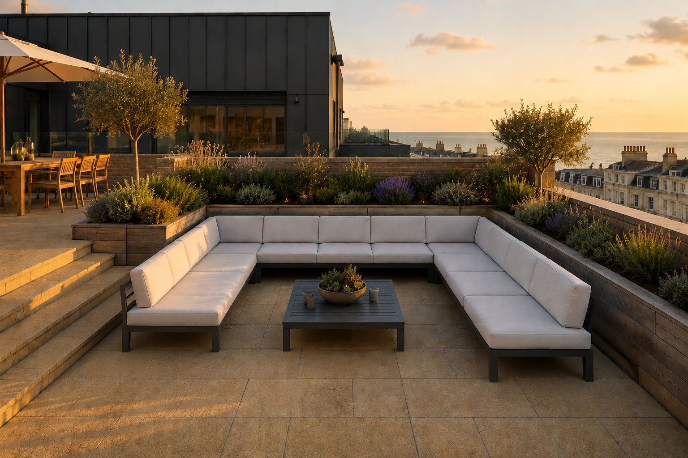

> ⚠ *Inaccurate AI impression — for look & feel only, not dimensionally accurate.*

Because Stoaked build to order, the U is **made to fit the exact stepped zone** — a continuous aluminium base **0.79 m deep** wrapping all three sides, with **no awkward leftover gaps** (the key contrast with the off-the-peg teak modules).

| Run | Length | Depth | Seats |
|---|---|---|---|
| East back run (backs to wall) | 3.30 m | 0.79 m | ~4 |
| North leg (longer) | 2.70 m | 0.79 m | ~3 |
| South leg (shorter) | 2.37 m | 0.79 m | ~2 |
| **Total continuous U** | — | — | **~8 seats** |

**Spare space:** none wasted at the edges (bespoke fills the U); the leftover is the usable **clear centre ≈ 1.72 m wide × ~1.7 m deep** for the coffee table + legroom. Seat height is low at **30 cm** (≈ 41 cm with a cushion).

> **Cost — a full U _does_ fit the budget here.** Bespoke aluminium frame ≈ **£2,200** (stock symmetric U is £2,310; ours is slightly smaller) **+ cushions ≈ £1,200–£1,600** (bespoke ~8-seat set, Sunbrella/Agora + quick-dry foam + zip covers) = **≈ £3,400–£3,800 all-in.** Compare the teak Maluku II full U at **£5,025** frame-only (+£525 ottoman) — the aluminium route delivers the *full* three-sided U, fitted exactly, ~£1,500–1,800 cheaper. **Cheaper still:** a **Quatropi** à-la-carte aluminium U ≈ **£2,450–£3,305 incl. cushions** (charcoal, not bespoke-fitted). *⚠ Frame figure is an estimate — get Stoaked's bespoke CAD quote + the marine coating spec; cushion price firms up once the frame size is set.*

[↑ Sofas](#sofas) · [↑ Contents](#contents)

---

### Quatropi "Zara" — à-la-carte aluminium U ⭐ (Chris's preferred option) · ~£2,300 + table(s)

*Quatropi Zara module — smoke grey, clean bare dark-aluminium box. Layout plan below.*

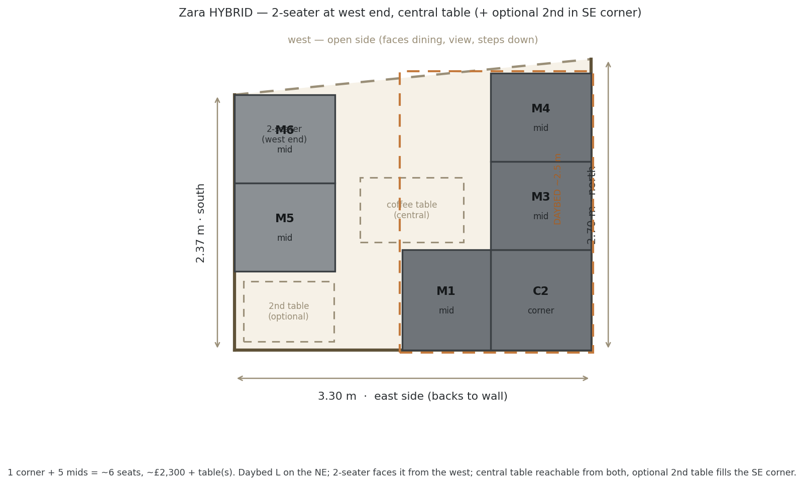

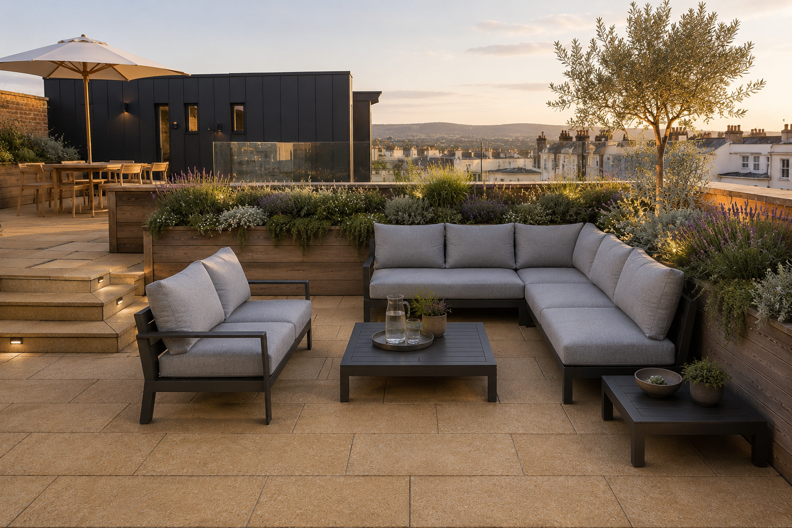

> ⚠ *Inaccurate AI impression — for look & feel only, not dimensionally accurate.*

The cleanest **bare dark-aluminium box** of the Quatropi ranges (no rope), smoke/mono grey, with **softer cushions that meet acceptably at the corner**. **Preferred layout (hybrid, above):** push the NE corner + back mid + two north-leg mids together into an **L-daybed (~2.5 m)**, a **2-seater at the west end** of the south leg facing it, and a **central coffee table** (with an optional 2nd table tucked in the SE corner).

| Module | Size | Role | Price |
|---|---|---|---|
| C2 | 1 × corner 93×93 | NE corner of the daybed | £450 |
| M1, M3, M4 | 3 × middle 82×93 | rest of the daybed L | £1,110 |
| M5, M6 | 2 × middle 82×93 | west-end 2-seater | £740 |
| **Total** | 1 corner + 5 middles = **~6 seats** | | **£2,300** (+ table(s)) |

- **Material:** powder-coated aluminium, bare box; smoke-grey / mono-grey cushions · ⚠ confirm C5 coating spec.
- **Cushions:** included, machine-washable covers, store indoors.
- **Fit:** north leg ~0.13 m spare, south leg ~0.73 m spare; **clear centre ≈ 1.44 m**. The daybed L *is* the flat lounging surface, so the missing footstool module doesn't matter.
- **Modules are 93 cm deep** (floor footprint) → squeezes the centre to ~1.44 m vs Stoaked's 1.72 m. **The seat itself is 60 cm** (normal — *not* a slouch trap; the 93 is frame-to-back), seat height 48 cm. ⚠ Cushions are **soft and "sink"** → add a **firm lumbar/scatter cushion per seat** for upright support (see Comfort table).
- **Back-frame (your specific worry) ✅:** **no horizontal metal top-rail across the back** — the back cushion is loose, held by the seat base + slim corner uprights, so you lean on cushion, not metal (the only aluminium above seat height is at the arm ends). The armless module proves it (the back cushion stands alone). Worth a sit-test to be sure, but the "metal bar in the spine" risk is low.
- *Alternative layout:* a symmetric 6-seat U (2 corners + 4 mids, £2,380) — see `drawings/zara-full-u-fa3-27-6-26.png`.

**Pros:** Clean modern bare-box look (your preference); true à-la-carte; soft cushions sit OK at the corner; the hybrid gives a proper daybed; cheap (~£2,300); strong reviews (Trustpilot ~4.8) · **Cons:** Mid/dark grey only (no true charcoal); deep modules shrink the centre; C5 coating to confirm

[quatropi.com — Zara corner](https://quatropi.com/products/zara-modular-corner-section-smoke-grey-93x93cm)

[↑ Sofas](#sofas) · [↑ Contents](#contents)

---

### Kettler "Elba Signature" low-lounge ⭐ (safe alternative) · corner set £2,149

- **Price:** standard low-lounge **corner set £2,149** (incl. teak coffee table); add-ons — **L/R sofa-with-side-tables pair £1,399**, single footstool £149, 110×110 high-low table £799. A U for our space ≈ **£3,000–3,500** (corner set + a sofa module + a corner — see plan). Sold more as sets + add-ons than fine à-la-carte modules (coarser than Quatropi).
- **Material:** powder-coated aluminium frame + **natural teak side-trays / coffee table**; **grey POLYESTER cushions** (⚠ *not* Sunbrella, despite earlier note); seat ~41cm. Clean modern low look (similar to Panama).
- **Modularity:** ◐ — corner set + extension sofas/footstools rearrange; **no true flat-daybed module**.
- **Cushions:** removable, store indoors (polyester — treat as a 3–5yr consumable).
- **Reviews / company:** Trustpilot ~4★ (~685) + **Reviews.io ~2,490**; **Kettler GB est. 1985**, solvent. **3-yr frame warranty** (manufacturing faults; extreme-weather / poor-storage excluded). Recurring gripe = delivery / missing parts (aftercare resolves, sometimes slowly).
- ⚠ **Coastal weak point = the teak side-trays** (grey/move; fixings can stain). A teak-free anthracite config is reportedly available via garden4less — confirm.

**Pros:** Established 40-yr brand; 3-yr frame warranty; large review base; clean modern aluminium+teak look · **Cons:** Polyester cushions (no Sunbrella edge); teak trim is the C5 weak point; coarser set-based modularity; no flat-daybed; delivery/parts hassle

[kettler.co.uk — Elba Signature low lounge](https://www.kettler.co.uk/collections/elba)

#### Full-U layout in the FA3 lounge — measured plan

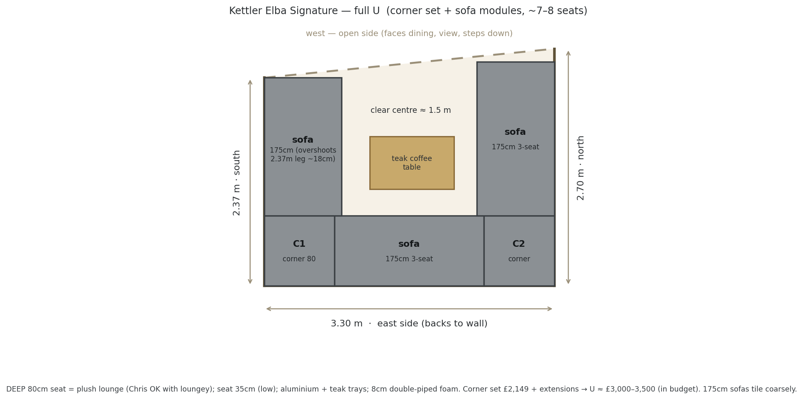

| Piece | Size | Role | Price |
|---|---|---|---|
| Corner module | 80×80×71.5 | the two east corners | £450 ea |
| 3-seat sofa module | 175×88 | back + each leg | ~£700 ea |
| **Corner set** (corner sofa + teak coffee table) | 252×252 footprint | back + one leg in one buy | **£2,149** |

**Build:** corner set (= back + one leg) + 1 sofa + 1 corner for the third side ≈ **£3,000–3,500** (in budget). Seat **80cm deep / 35cm high** = deep, plush lounge (you're happy with loungey); clear centre ~1.5m. ⚠ 175cm sofas tile coarsely — the south (2.37m) leg overshoots by ~18cm; teak trays are the C5 weak point.

[↑ Sofas](#sofas) · [↑ Contents](#contents)

---

### 4 Seasons Outdoor — "Meteoro" ⭐ (most comfortable upright) · U ~£5,800 *(over budget)*

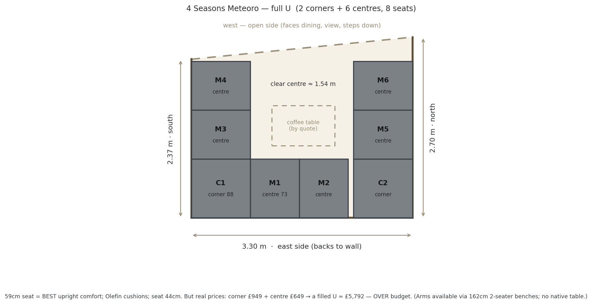

| Module | Size | Price |
|---|---|---|
| Corner | 88×88×80 | £949 |
| Centre (armless) | 73×88×80 | £649 |
| 2-seater bench (L/R arm) | 162×89×80 | £1,349 |
| Footstool / native table | — | none in the range |

- **Price:** a filled U = 2 corners + 6 centres = **£5,792** (or with arm-benches ≈ £5,894) — **over budget.** No footstool/table in the range (pair a Capitol 90×90 coffee table, by quote).
- **Material:** anthracite powder-coated aluminium + **Olefin** cushions (better UV/salt life than polyester); anti-mould foam.
- **Comfort:** ⭐ **best upright of all the options** — seat depth **59cm** (shallowest), seat 44cm (normal height) → sit-and-chat without slouching; thick cushions.
- **Modularity:** ◐ — modules rearrange; ⚠ 88/73/162cm widths tile coarsely (legs ~13–20cm off); no flat-daybed.
- **Reviews / company:** 4 Seasons Outdoor (Dutch) ~4★ small base + Shackletons ~4★/~600; UK distributor solvent. **5-yr frame / 3-yr cushion warranty** (extreme-weather excl.). Recurring gripe = **QC defects on arrival** (cracks / coating); after-sales (via the retailer) is responsive.

**Pros:** **Most comfortable upright** (59cm seat); Olefin = best coastal cushion fabric; anthracite; reputable · **Cons:** **~£5,800 = well over budget**; QC-on-arrival reports; coarse tiling; no flat-daybed; price by quote

[The Modern Furniture Company — Meteoro](https://themodernfurniturecompany.com/products/4-seasons-outdoor-meteoro-large-corner-with-nest)

[↑ Sofas](#sofas) · [↑ Contents](#contents)

---

### Harbour Lifestyle — Panama ⭐ NEW · sold by the module (3-seat £1,169 · corner £585)

- **Price:** **sold by the module** — 3-seat-with-lounger **£1,169**, corner/footstool **£585** (74×74×81, seat 43cm), Charcoal/Washed Grey/Latte; the fixed **sets are currently out of stock** (Large Corner Group £3,599, "notify me" — **not discontinued**). The pre-built Large U-Shape is £5,175 (over budget) — but a self-assembled U from modules comes in far cheaper.
- **Material:** "rust-proof aluminium" frame; UV/water-repellent polyester cushions; teak coffee/side tables.
- **Modularity:** ✅ — rearranges to an L, **sun loungers or a double sofa**; clips into a flat run.
- **Cushions:** removable → store indoors. ⚠ Panama's cushions are **NOT all-weather** (fine here — they're stored anyway).
- **Reviews:** Harbour Lifestyle — large Trustpilot base, generally positive (inspect on delivery).
- **Matching teak tables (fit our plan ✓):** Panama **coffee table 74×74×22.5cm £359** drops into the central ~1.5m zone; **side table 74×37×22.5cm £225** tucks at a leg end. Both teak-topped, 22.5cm high (low lounge height — they read as proper coffee tables against the 43cm seat).

 

*Panama teak coffee table (£359) + side table (£225).*

**Pros:** Genuinely à-la-carte; charcoal aluminium; armless/low/clean look; **converts to sun-loungers**; matching teak tables; reputable retailer · **Cons:** ⚠ only **two seat pieces (198cm 3-seat + 74cm corner)** and no mid-size module. Sofas are **armless** so you *can* drop the corner on the short leg and butt a sofa straight on (fixes the 2.37m leg) — **but the 3.30m back still can't be filled cleanly** (sofa+corner = 272 → 0.58m gap; sofa+2 corners = 346 → 0.16m over). So the U is achievable but the 198cm sofas are 16cm too wide to tile the 3.30m back. **Best full U = 3 armless sofas (9 seats) turning the SW corner, with a teak SIDE TABLE filling the bottom-right (NE) corner gap, and the north leg shuffled slightly left so the only leftover is a tidy ~0.21m strip against the north flowerbed (fine)** — see map below. Cost: 3 sofas £3,507 + teak coffee table £359 = **£3,866 (IN budget)**; **+ side tables £225 each** (corner + south open end) → ~£4,316 (marginally over). Sets currently out of stock (buy modules); cushions not all-weather.

[harbourlifestyle.co.uk — Panama](https://www.harbourlifestyle.co.uk/products/panama-luxury-outdoor-corner-group-set-charcoal)

**Best Panama U mapped (corner gap filled with a side table; north leg shuffled left):**

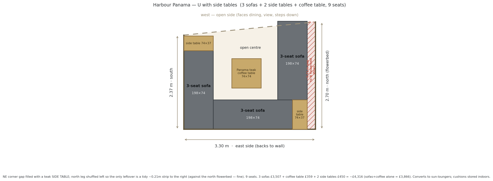

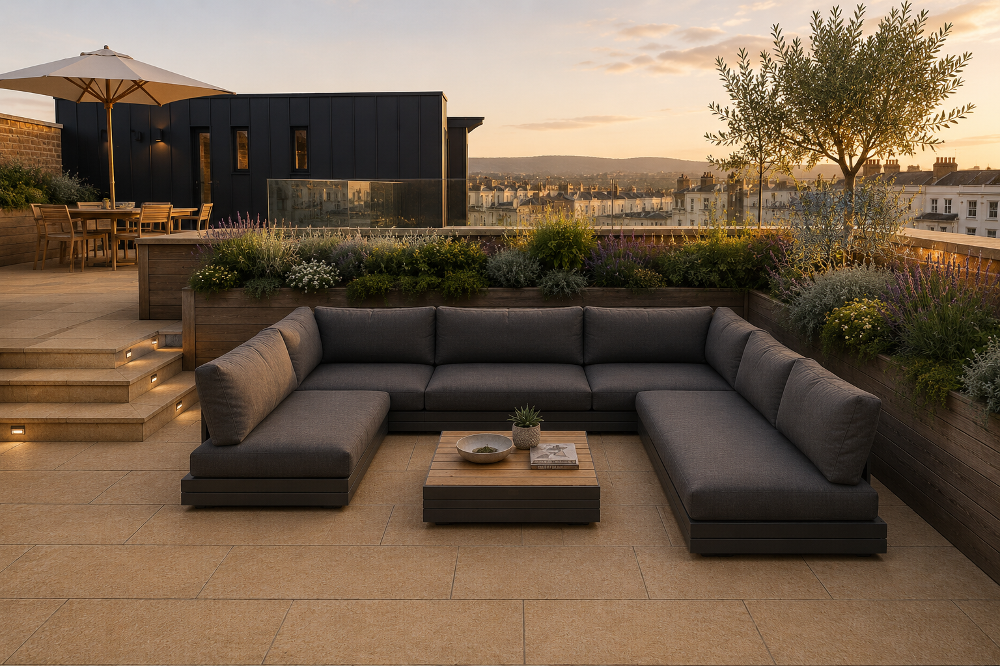

> ⚠ *Inaccurate AI impression — for look & feel only, not dimensionally accurate.*

3 armless 198×74cm sofas turn the SW corner; a **teak side table fills the bottom-right (NE) corner gap**, and the **north leg is shuffled left** so the only leftover is a **tidy ~0.21m strip against the north flowerbed** (fine — small gap behind). A second side table sits at the south leg's open end. **9 seats. 3 sofas £3,507 + coffee table £359 = £3,866** (in budget); **+ 2 side tables £450 → ~£4,316** (marginally over). Deep/chunky, lounge-first, cushions not all-weather, converts to sun-loungers. Quatropi Zara gives a cleaner wrap-around for ~£2,300.

**Alternative B — two 1-seaters east + 2 coffee tables + 2 side tables (buildable):**

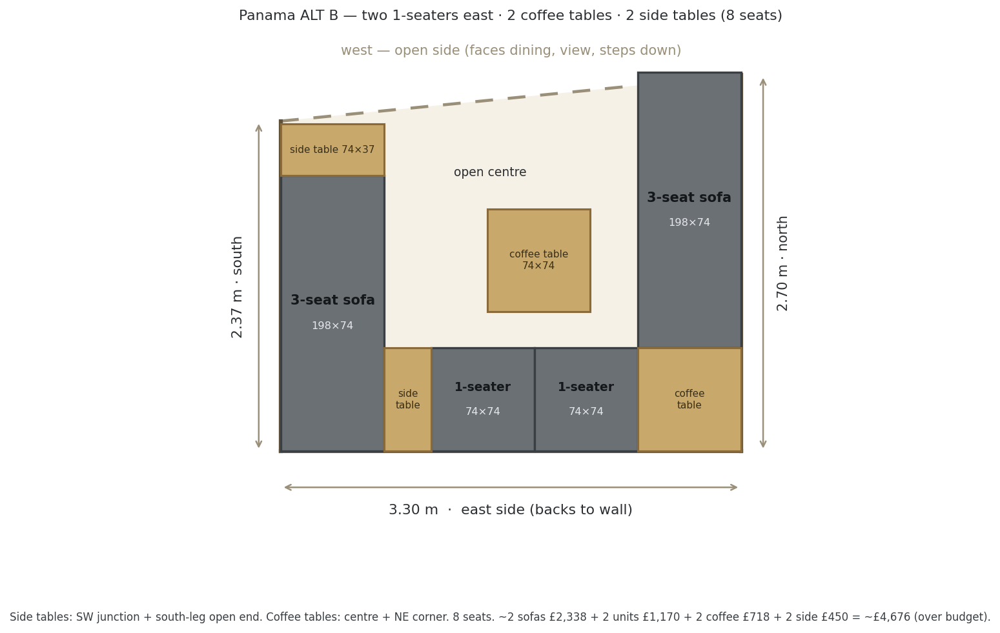

Buildable in Panama: the east/back run uses **two 74×74 corner/footstool units as 1-seaters**; **side tables at the SW junction and the south-leg open end**; **coffee tables in the centre and the NE (bottom-right) corner**. 8 seats; back tiles cleanly (74 + 34 + 74 + 74 + 74 = 330). ⚠ **Cost:** the corner/footstool units are **£585 each**, so ≈ 2 sofas £2,338 + 2 units £1,170 + 2 coffee £718 + 2 side £450 = **~£4,676 (over budget)** — poor value per seat. Also **confirm a single corner/footstool unit has a proper backrest** (it's designed as a corner/footstool).

**Alternative C — three 3-seaters (east back run is a 3-seater) + 1 coffee + 2 side tables:**

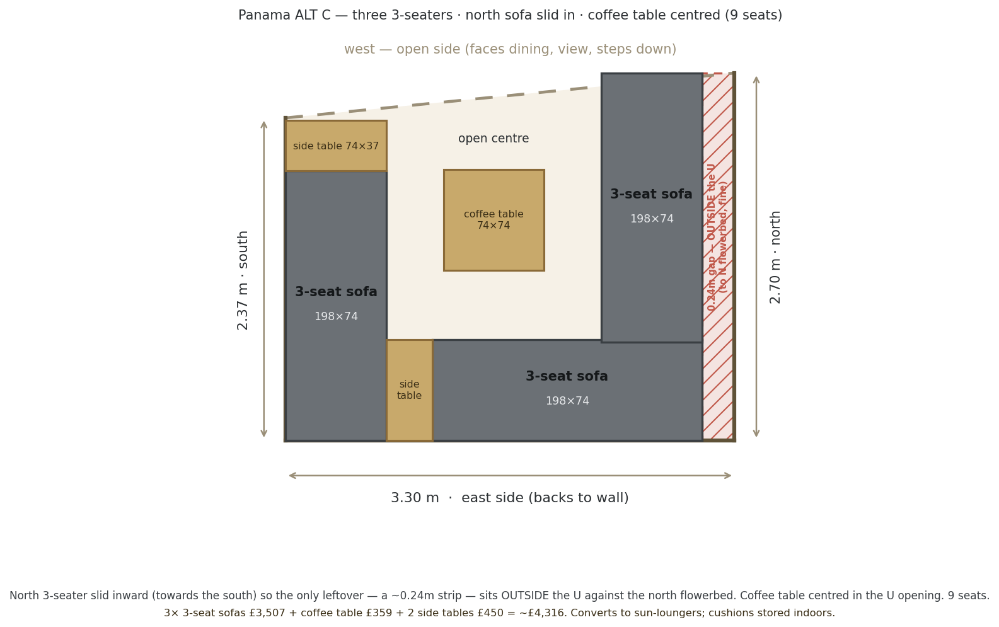

The neatest of the three: **three 3-seaters** — south leg, an **east/back 3-seater** (replacing the two 1-seaters + NE corner: 74 + 34 + 198 = 306, **it fits**), and the **north 3-seater slid inward (towards the south)** so the only leftover — a ~0.24m strip — sits **outside the U, against the north flowerbed** (fine). The **coffee table is centred in the U opening**; side tables at the SW junction + south-leg top. **9 seats.** Cost: 3 sofas £3,507 + coffee table £359 + 2 side tables £450 = **~£4,316** (~£300 over; drop a side table to come in nearer £4k). The cleanest seating of the Panama options, and avoids the pricey £585 single units.

**Alternative D — like B, but the NE coffee table is a corner unit (seat):**

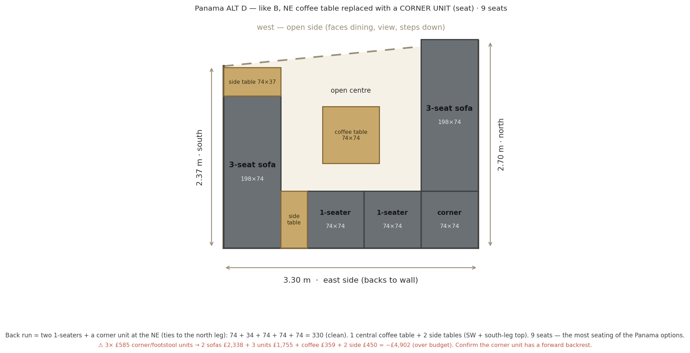

Same as B, but the **bottom-right (NE) coffee table is swapped for a corner unit (seat)** — so the back run is two 1-seaters + a corner seat tying it to the north leg (74 + 34 + 74 + 74 + 74 = 330, clean). **9 seats** (the most of any Panama layout), with one central coffee table + 2 side tables. ⚠ **Cost:** three £585 corner/footstool units → 2 sofas £2,338 + 3 units £1,755 + coffee £359 + 2 side £450 = **~£4,902 (well over budget)** — the priciest option, since single seats via corner units are poor value. Confirm the corner unit gives a proper forward backrest.

**If Panama stays out of stock** — near-identical in-stock alternatives: **daals "Albany"** (~£730, dark grey, reclines to a lounger) and **Bramblecrest** (premium, marine-grade). A bespoke-fitted U is still cleaner via Stoaked/Quatropi, but Panama-by-module is a viable route.

[↑ Sofas](#sofas) · [↑ Contents](#contents)

---

### Other à-la-carte aluminium ranges (buy by the module)

All sell individual modules; all need the C5 coating-spec check. Roughly by budget:

- **Kettler — Elba** — now has a [full entry above](#kettler-elba) (corner set £2,149; aluminium + teak trays + polyester cushions; 3-yr warranty; est. 1985).
- **4 Seasons Outdoor — Meteoro** — now has a [full entry above](#meteoro) (best upright comfort, but a U ≈ £5,800 — over budget).
- **In Garden — Contemporary Modular** (charcoal frame + charcoal Sunbrella ✓) — welded powder-coated aluminium, middle 70×90 / corner 90×90; per-module "from" prices by phone (01732 463409); likely **~£2–3.5k**; ⚠ no ottoman / no clean daybed. Small specialist (also does teak).
- **Sklum Yarilo (~£2,300) / Kave Home Sorells (~£2–3.5k)** — cheapest genuine à-la-carte aluminium, modern — but **neither does true anthracite** (Sklum cream only; Kave grey/green) and geometry is constrained, no flat daybed. Only if colour flexes.
- **LIFE Outdoor Living — Timber "Lava"** — dark-charcoal aluminium, near-budget (~£3.4–4.45k); ⚠ sprung arms likely won't lie flat as a daybed.

[↑ Sofas](#sofas) · [↑ Contents](#contents)

---

## Teak (the warm-wood alternative — accepts a near-U, not a full U in budget)

### Teakunique — Maluku II Modular ⭐ · the true-daybed contender (Sussex showroom — go and see it)

- **Price (per module):** corner 80×80×70 **£825** · mid 80×75×70 **£675** · ottoman 80×70×33 **£525**. **Seat height 45cm.** Building a full U for your space gets expensive fast: a tight L+chaise (2 corners + 1 mid + 1 ottoman) ≈ **£2,850**, but a deep U (2 corners + 2 mids + 1 ottoman) ≈ **£3,500 — over budget.**
- **Material:** Solid teak (wording is "high-grade timber" — vaguer than Cyan's stated Grade-A); 10-yr guarantee · **Modularity:** ✅✅ — corner/mid/ottoman push together; ottoman matches the 45cm seat height for a flush chaise/daybed. *(No documented locking/connector hardware — modules simply butt together; confirm true flat-daybed alignment with Teakunique.)*
- **Cushions:** ✅ detachable, **removable Sunproof Olefin covers**, store indoors.
- **Reviews:** thin online (no Trustpilot profile; an unverified "5.0/47 Google" badge on their own page) — **BUT Teakunique has a showroom in Sussex, so you can go and see/sit on the actual teak in person.** That in-the-flesh check beats any online review and neutralises the no-reviews worry. Real registered UK family firm. *(Confirm showroom address/opening before going.)*
- **Look:** mostly modern/low/clean, **but the backrests use closely-spaced vertical slats/spindles** that read slightly more "craftsman/transitional" than the crisp Sydney/Azura aesthetic — judge it for yourself at the showroom.

**Pros:** The genuine config-1 push-together daybed in budget; solid teak; conforms to the unequal U-shape; 10-yr guarantee; **viewable at a Sussex showroom** · **Cons:** A full deep U busts £3k (£525–825/module); backs slightly more traditional than your dining set; no documented daybed-locking mechanism — confirm flat-daybed alignment on the visit

[teakunique.co.uk — Maluku II range](https://teakunique.co.uk/collections/teak-sofas-and-loungers)

#### Full-U layout in the FA3 lounge — measured plan

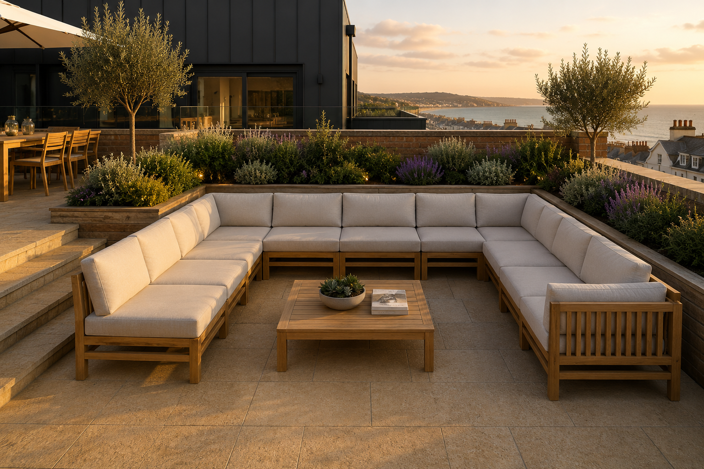

> ⚠ *Inaccurate AI impression — for look & feel only, not dimensionally accurate.*

The FA3 lounge is a U-shaped zone: **3.30 m** back run (east) with two return legs — **2.37 m** (south) and **2.70 m** (north), unequal because of the step down. A full three-sided U in Maluku II needs **2 corners + 5 mids + 1 ottoman** = **7 seats**, laid out as above.

| Code | Module | Footprint | Position | Price |
|---|---|---|---|---|
| C1 / C2 | 2 × corner | 80×80 | the two east corners (base↔arm) | £1,650 |
| M1 / M2 | 2 × mid | 80×75 | the 3.30 m east base | £1,350 |
| M3 | 1 × mid | 80×75 | south arm (shorter leg) | £675 |
| M4 / M5 | 2 × mid | 80×75 | north arm (longer leg) | £1,350 |
| OT | 1 × ottoman | 80×70 | centre — footrest / extra seat / **push to a sofa = daybed** | £525 |

**Spare space left over:** south arm **0.77 m** clear at the open end · north arm **0.30 m** · east base ~0.10 m tolerance · **open centre ≈ 1.80 m wide × ~1.55 m deep** for the coffee table + legroom. Furniture covers ≈ 4.8 m² of the ≈ 8.4 m² zone, so **~42% of the floor stays open**, plus the whole west side is the unobstructed entry/view side.

> ⚠ **Cost reality — a full U busts the budget.** 2 corners + 5 mids = **£5,025**; with the ottoman **£5,550** — about £2,000–£2,500 over a £3k cap. What ~£3k buys is an **L-plus-chaise** (≈4 modules, e.g. 1 corner + 2 mids + 1 ottoman = **£2,850**), not a full three-sided U. A genuine full U here means lifting the budget (~£5.5k) or choosing a cheaper modular range — which is why the **aluminium à-la-carte route (Quatropi / Stoaked)** wins.

[↑ Sofas](#sofas) · [↑ Contents](#contents)

---

### Indian Ocean — "Cove" (best modern teak look) · ~£5,205 for our U *(over budget)*

- **Price (à-la-carte):** modular corner **£2,100** (79×79) · centre **£1,775** (90×79) · coffee table/footstool £1,075. A U ≈ 2 corners + 4 centres + table ≈ **£5,205** (frame; cushions included) — **over budget.**
- **Material:** **solid teak** frame + decorative all-weather rope panel (quoted "Solid Teak"). UK brand (stocked at Harrods).
- **Modularity:** combines à-la-carte; ⚠ **no flat-daybed claim** (confirm); seat height unpublished.
- **Tiling:** the 79/90cm mix tiles awkwardly into our legs (8–100cm gaps).
- **Look:** the **most modern teak option found** — but over budget and gappy.

[indian-ocean.co.uk — Cove](https://www.indian-ocean.co.uk/collections/cove)

[↑ Sofas](#sofas) · [↑ Contents](#contents)

---

> **Teak by-the-module — the reality (27 Jun).** There is **no solid-teak, by-the-module, *modern* U under £4k.** The floor is ~£5k: **Maluku II** £5,025 (best tiling — square 80cm modules) or **Indian Ocean Cove** £5,205 (best look). **No UK solid-teak module system does a true push-together flat daybed** (only Tribu Pure, £15k+). One more à-la-carte teak source to phone if wanted: **In Garden** (ingarden.co.uk, 01732 463409). Chic Teak Buckingham is by-module but classic styling + a full U still ~£5–6.5k. **Net: teak = ~£5k and no real daybed; aluminium remains the only full-U-in-budget route.**

[↑ Top](#top) · [↑ Contents](#contents)

---

# 4 · Bistro Table

A small **round** table for the **narrow terrace (FA1)** — used with the **4 spare Luxus Sydney dining chairs** (when the Azura dining table is at its compact 240cm size, 4 of the 12 chairs are free). So we only need the *table*; no extra chairs. Wants: **~700–750mm round (800mm max), ~75cm dining height** to match the Sydney chairs (~45cm seat), and — critically — it has to cope with **seafront (C5) exposure**.

> **The base is the whole problem.** Lots of pretty beige sintered-stone bistro tables exist — but nearly all are **indoor** pieces on **powder-coated steel** bases that will rust at the seafront (or powder-coated aluminium, where the *coating* still blisters in salt even though the metal won't rust). After seeing the powder-coat on a local cafe's aluminium furniture badly chipped, the safe route here is a **through-colour resin** base (no coating to fail), **anodised aluminium**, **316 stainless** or **solid stone/concrete**. There is **no** UK round table that combines a *real* beige sintered-stone top **and** a non-coated base **and** the right size **and** the budget — that spec only exists square, or at £700–£2,000+. So it's a trade-off: bulletproof resin *stone-look*, or a real stone top with a coating you have to accept and maintain.

### Nardi Combo Ø70 — through-colour resin ⭐ (the bulletproof choice)

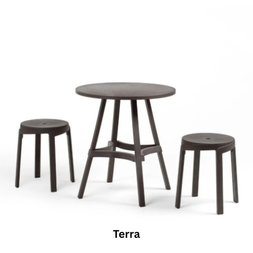

*Shown in "Terra" (warm earth-brown).*

- **From £145** · [juliajones.co.uk](https://www.juliajones.co.uk/nardi-combo-table/p3993) (also Timeout Space, Patio Leisure)
- **Ø70cm × H75cm** ✅ — bang on our bistro size + dining height
- **One moulded piece** of UV-stabilised fibreglass-reinforced polypropylene resin — top + base in a single through-colour piece. **No metal, no coating anywhere**; Nardi explicitly rate it for **weather and saline environments**. ~8.6kg.
- **Colours:** **Gesso** (chalk / off-white) and **Terra** (warm earth-brown) are the warm options; also Cactus, Basalto. ⚠ *Not* a travertine pattern and **no true beige** — Gesso reads light-stone, Terra reads timber. (Nardi's truest beige, "Tortora," is on the smaller Spritz/Step below, not the Combo.)
- **Outdoor-rated:** yes, residential + contract.

*Verdict: the only in-budget round table that hits the size, dining height **and** a genuinely coastal-proof base. The compromise is stone-**look** resin, not real travertine. Light at 8.6kg → weight it or bring in for a gale. ⭐ Lead candidate.*

[↑ Top](#top) · [↑ Contents](#contents)

---

### Nardi Spritz / Step Ø60.5 — truer beige, dual-height *(see [§5 coffee](#nardi-step))*

The **Nardi Spritz/Step** (full entry in the [Coffee Table section](#nardi-step)) is **height-adjustable 40cm ↔ 76.5cm**, so at its tall setting it's a bistro table too — and it comes in **Tortora (warm taupe/beige)**, a truer beige than the Combo. The catch is **Ø60.5cm** (smaller than our 700mm wish — a true 2-seat café size). Same bulletproof all-resin construction. A neat option if matching beige coffee + bistro tables as one family matters more than the extra 10cm of top.

---

### ~~Mason beige ceramic bistro table — Home Origins · £168~~ ✗ REJECTED

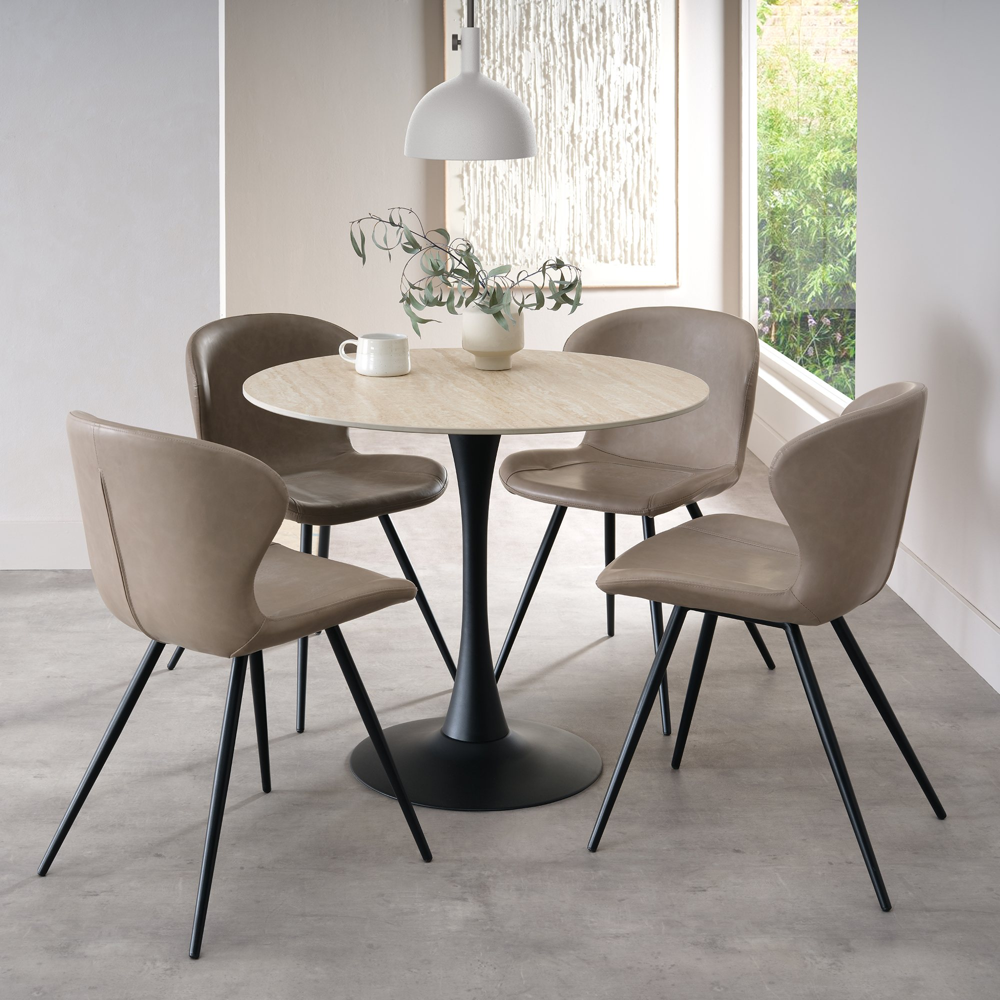

- **£168** · [homeorigins.com](https://www.homeorigins.com/mason-beige-ceramic-circular-bistro-table/p1404) · **Ø90cm × H75cm**, 12mm beige sintered-stone top (top itself is fine).
- ✗ **Rejected:** **Ø90cm is over our 800mm max**, it's sold as **indoor** furniture, and the **base is powder-coated steel** — it will rust at the seafront. Kept here only to record why it's out.

[↑ Top](#top) · [↑ Contents](#contents)

---

# 5 · Coffee Table

One or two **round, low** tables for the **lounge / comfy-chairs corner** on the narrow terrace. Same seafront rule as the bistro table: the **base** is the thing to get right (through-colour resin / anodised aluminium / 316 / solid stone — not powder-coated steel).

### Nardi Step / Spritz — through-colour resin, Tortora beige ⭐ (the value coastal winner)

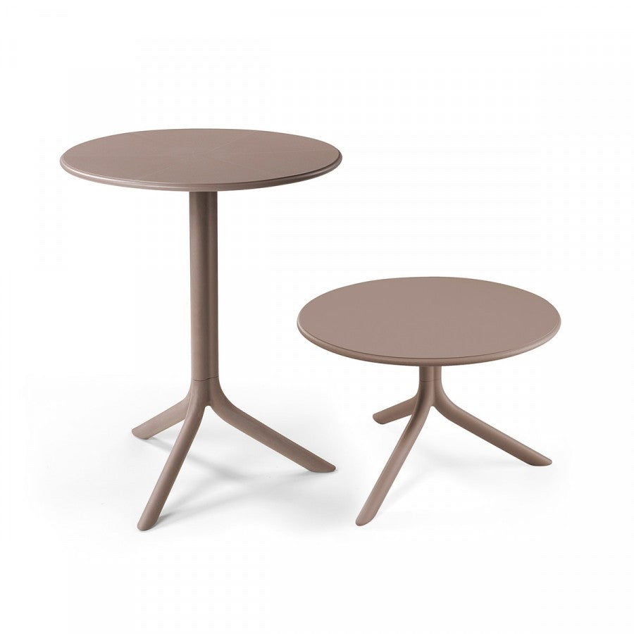

*Shown in "Tortora" (warm taupe/beige).*

- **£77–110 each** — buy two for the pair (~£150–220, well inside budget) · [Step at bfhome.co.uk](https://www.bfhome.co.uk/products/step-garden-table-by-nardi) · [Spritz (Tortora) at abroaderpicture.com](https://abroaderpicture.com/products/spritz-side-table-tortora)
- **Ø60.5cm**, **height-adjustable 40cm ↔ 76.5cm** ✅ — low coffee table, or raise to bistro/dining height (so it doubles as the bistro table — see [§4](#nardi-combo))
- **All resin, through-colour, no metal** — UV- + saline-resistant, wipe-clean
- **Colours:** **Tortora** = warm taupe/beige ✅ (Step also sold as "Turtle Dove" = same taupe); plus Bianco, Antracite
- **Outdoor-rated:** yes

*Verdict: coastal-proof, low, small, a true warm beige, and cheap — and it colour-matches a Nardi Combo bistro + Nardi Folio chairs for one coherent paint-free family. ⭐ Lead candidate. Light → weight/store in gales.*

[↑ Top](#top) · [↑ Contents](#contents)

---

### Maze Milan — pair of round ceramic coffee tables · ~£195/pair *(real stone top, accept the coated base)*

- **~£195 for the PAIR** · [betterbedcompany.co.uk](https://www.betterbedcompany.co.uk/products/maze-pair-round-ceramic-coffee-tables) (also mazeliving.co.uk)
- **Ø50 × H42cm + Ø64 × H47cm** — a nested pair
- **Top:** marble-effect **ceramic** — **"Cool Linen"** (pale warm stone) or Charcoal
- **Base:** **powder-coated aluminium** ("Dawn Grey") — ⚠ the aluminium core won't *rust*, but the **coating isn't stated as marine-grade** and can whiten/blister at C5. The flagged trade-off: a real stone top in exchange for a coating to watch.
- **Outdoor-rated:** yes.

*Verdict: the best-value way to get a **real ceramic/stone top** as a pair — but it reintroduces the powder-coat you're wary of. Worth it only if a genuine stone top beats absolute base integrity. ⚠ Re-confirm "Cool Linen" stock + exact base wording (page returned errors during research).*

[↑ Top](#top) · [↑ Contents](#contents)

---

### ~~Modus beige sintered-stone gas-lift table — Bentley Designs · £308~~ ✗ REJECTED

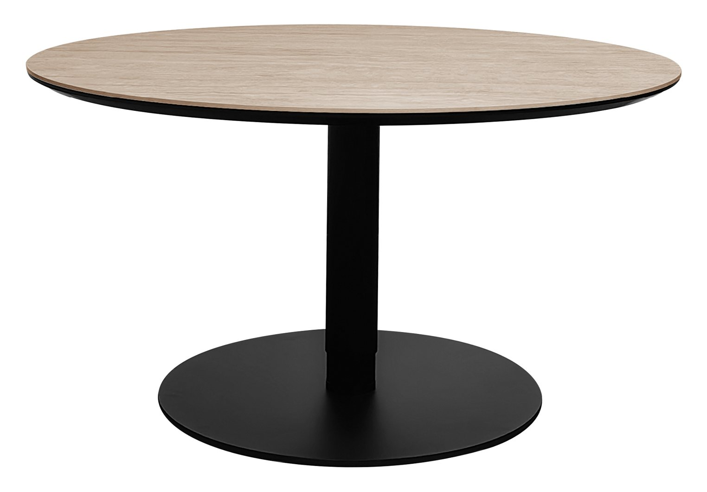

- **£308** · [bentleydesigns.com](https://www.bentleydesigns.com/modus-matt-beige-sintered-stone-gas-lift-adjustable-coffeebistro-table/p5694) · **Ø90cm**, gas-lift 49.5–75.5cm, 6mm beige sintered-stone top.
- ✗ **Rejected:** sold as **indoor**, **powder-coated steel** base (rusts at the coast) **and** a sealed **gas-lift strut** that will corrode/seize in salt air. Nice idea, wrong for a rooftop. Kept to record why it's out.

[↑ Top](#top) · [↑ Contents](#contents)

---

# 6 · Narrow-terrace lounge chairs

A relaxed corner of **~4 comfy chairs** on the narrow terrace (separate from the FA3 sofa lounge). The brief that shaped this: **no paint to fail** (after the chipped powder-coat seen on a local cafe's seafront furniture), **no open weave** (bird droppings), **heavy enough not to blow around**, comfy, and **value**. That points to **through-colour resin** — the colour is baked through the material, nothing sprayed on, wipes clean, saline-rated.

> **The honest tension = weight vs beige.** The comfy resin chairs are fairly light (4.7–8.2kg) — our own rule has been "nothing under ~7kg gets left out." Only the **Folio (8.2kg)** and the **Allibert (11kg)** clear that bar; the lighter Nardis are lovely and a truer beige but want bringing in for a gale. *(These three are seeds for further searching, not a final pick — captured here for review with Alex.)*

### Nardi Folio — reclining resin lounge armchair ⭐ (wind-first + beige)

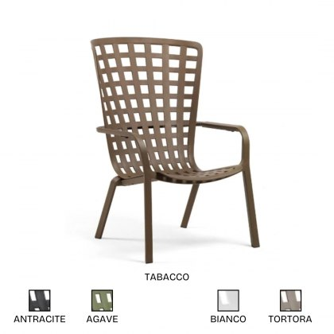

*Tortora (beige) **is** available — see the swatch row (Antracite / Agave / Bianco / Tortora). Shown in Tabacco.*

- **£153 each**, sold singly · [juliajones.co.uk](https://www.juliajones.co.uk/nardi-folio/r304)
- **W72 × D81cm (92.5cm reclined) × H113cm · seat H45cm** — **reclines** to two positions for genuine lounging
- **Through-colour** fibreglass-reinforced polypropylene resin, anti-UV — no paint. **8.2kg = the heaviest of the affordable resin chairs**, clears the 7kg leave-out line.
- **No cushion needed** (contoured shell); optional seat pad ~£123 in warm-flax/neutral. Lattice pattern — open squares let rain/debris fall through.
- **Colours incl. Tortora (beige)** ✅

*Verdict: best balance of the exact brief — reclines, paint-free, beige available, heaviest sleek option. ⭐*

[↑ Top](#top) · [↑ Contents](#contents)

---

### Nardi Net Relax — deepest-recline lounger, Tortora ⭐ (beige-first, but light)

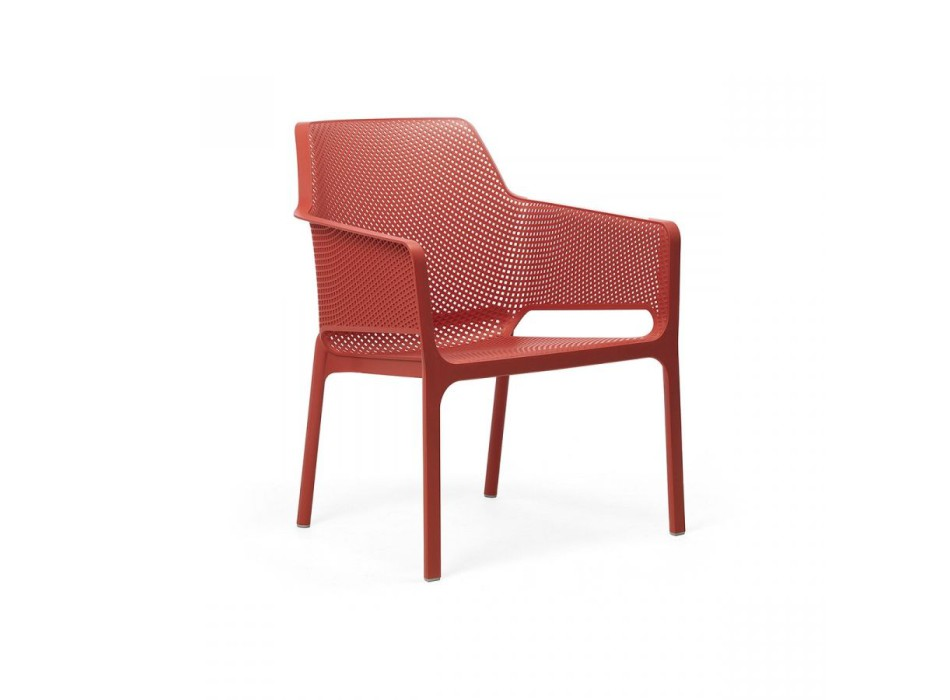

*Shown in coral; **Tortora (warm taupe/beige) is a stock colour**.*

- **£122.37 each** (was £149), sold singly · [tecnoarredo3.co.uk](https://www.tecnoarredo3.co.uk/net-relax-nardi-chair) (also BF Home, pair £216)
- **W67 × D71 × H86.5cm · seat H41.5cm** — "halfway between an armchair and a sun-lounger," the most genuinely reclined shape here
- **Batch-dyed** anti-UV fibreglass polypropylene, matt — through-colour, saline-rated. **Tortora confirmed** ✅
- **No cushion needed** (perforated mesh shell; optional pad £68). ⚠ The mesh holes can lodge a little bird mess — but a hose washes straight through.
- ⚠ **~4.9kg — wind risk when empty**; weight it or bring it in for a gale.

*Verdict: cheapest sleek option, deepest lounge, true beige confirmed — the trade-off is the low weight. ⭐ (Sibling: **[Nardi Net Lounge](https://www.juliajones.co.uk/nardi-net-lounge-armchair/p3487)** £136, Tortora/Bianco, 5.4kg, scoop shape — same family if you prefer that shape.)*

[↑ Top](#top) · [↑ Contents](#contents)

---

### Allibert by Keter "California" — value resin club chair (heaviest in budget)

- **~£150–190 each** (Keter UK sells a grey pair at £330) · [amazon.co.uk](https://www.amazon.co.uk/Allibert-Keter-California-Outdoor-Armchair/dp/B01N7G97NG) *(product photo to add)*
- **W~82 × D68 × H72cm · seat H~36cm** — a low, comfy club shape
- **UV-stabilised polypropylene resin, through-colour** ("colours will not fade"); comes with a **beige/cappuccino cushion**
- **~11kg — the heaviest sub-£190 resin chair**, genuinely won't blow around
- ⚠ Surface is a **moulded round-wicker texture** — wipes clean and sheds water, but the grooves collect more bird mess than the smooth Nardi shells, and it looks less refined than the Italian resin.

*Verdict: the heavy + value pick if wind-without-thinking beats looks — but it's a chunkier, textured, less elegant chair. ⚠ Confirm single-chair price (Amazon blocks automated checks) and pin the "Resin/Foil" wording on Keter's page.*

[↑ Top](#top) · [↑ Contents](#contents)

---

## Why colour and material both matter — the heat science

### The two factors

**1. Colour → surface temperature**
All surfaces in sunlight reach thermal equilibrium between solar energy absorbed and heat lost to convection and radiation. Dark surfaces absorb 80–98% of solar radiation; white surfaces absorb only 15–30%. Brighton peak summer irradiance is roughly 850 W/m².

Estimated surface temperatures in direct sun (22°C ambient, moderate coastal breeze reducing temperatures by ~15°C vs still air):

| Colour | Solar absorptivity | Est. surface temp |
|---|---|---|
| Black | 0.97 | 60–65°C |
| Dark anthracite / Bronzo | 0.80–0.85 | 53–60°C |
| Olive / Grey Mud | 0.65 | 46–52°C |
| Mid-grey (Ancient Grey) | 0.55 | 42–48°C |
| Ivory White / Beige | 0.30 | 32–38°C |
| Matt White | 0.20 | 28–33°C |

Note: all paints emit thermal radiation at similar rates in the infrared regardless of visible colour — so colour only affects how much solar energy is *absorbed*, not how quickly it is *lost*.

**2. Material → how hot it *feels* (thermal effusivity)**
Surface temperature alone doesn't predict pain. What matters is **thermal effusivity** — a material's ability to transfer heat into your skin on contact. It equals √(conductivity × density × heat capacity).

| Material | Thermal effusivity (J/m²·K·s½) | Max comfortable surface temp (prolonged contact) |
|---|---|---|
| Aluminium | ~24,000 | ~43°C |
| Steel (mild/duplex) | ~13,000 | ~45°C |
| Ceramic / sintered stone | ~1,500–2,500 | ~60–65°C |
| Teak (oiled) | ~400–500 | ~68–75°C |

Steel feels ~25× "hotter" than teak at the *same surface temperature*, and aluminium is worse still — because they transfer heat into your skin so rapidly. This is why a wooden-handled pan doesn't burn you while the metal rim does, even though both are the same temperature.

### Resulting colour rules by material

| Material | ✅ Safe | ⚠ Borderline | ❌ Avoid |
|---|---|---|---|
| **Steel (solid top/seat)** | White, Ivory, Beige | Light grey (with coastal breeze) | Everything darker |
| **Steel (slatted seat)** | White, Ivory, Beige | Light grey | Anthracite, darker |
| **Aluminium (solid top)** | White, Ivory, Taupe | — | Anthracite, darker |
| **Aluminium (slatted)** | White, Ivory, Taupe | Mid-grey, Olive | Anthracite, Black |
| **Ceramic / sintered stone** | All colours | — | — |
| **Teak** | All colours | — | — |

### Brighton's saving grace

The coastal breeze at 4 storeys above the seafront can reduce surface temperatures by 15–25°C compared with still-air conditions. On a windy day, borderline colours become comfortable; on a rare still hot day, they become genuinely unpleasant. The ⚠ ratings assume a typical Brighton breeze; the ❌ ratings will be uncomfortable regardless of wind.

### Chairs matter as much as tables

A dining table edge you rest your arm on matters — but a chair you sit on in shorts, with bare thighs on the seat and bare forearms on metal arms, matters even more. Apply the same colour rules to chairs. A seat cushion (stored indoors and brought out for dining) transforms the experience of a dark metal chair and costs very little.

[↑ Top](#top) · [↑ Contents](#contents)

---

## Timing & checklist

- **Buy in the Aug–Sept clearance** (fit-out completes late Sept 2026) — best discounts on aluminium/rope sets; teak specialists barely move seasonally.
- [ ] Confirm the table's **top is non-porous** (ceramic/HPL/aluminium) and its **largest size seats 10–12**.
- [ ] **⚠ Bramblecrest Sofia extending dimensions** — confirm exact cm before ordering (not published online).
- [ ] Confirm sofa cushions are **Olefin/Sunbrella + quick-dry foam**; frames have a slatted base so they look right with cushions off.
- [ ] **Ballast/anchor** big pieces + the aluminium table against wind (no roof penetration — coordinate with Ronan).
- [ ] Order **samples** before committing.
- [ ] **⚠ Vermobil Fox/Mogan: 6–10 week lead time** — order July 2026 to arrive for Sept fit-out.
- [ ] For SCAB Si-Si: confirm UK delivery lead time with arredinitaly.com.
- [ ] For Teakunique: order a teak sample before committing (no independent Trustpilot reviews).
- [ ] For Kave Home chairs (Zaltana/Culip/Joncols): confirm stock availability + delivery lead time upfront.

[↑ Top](#top) · [↑ Contents](#contents)
