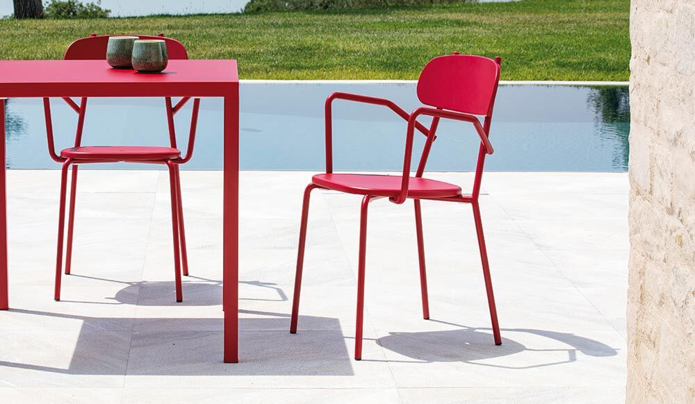
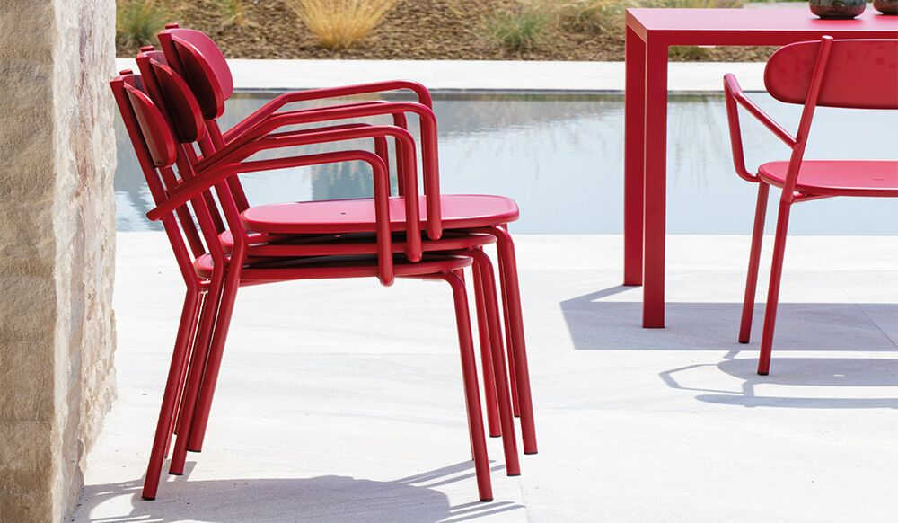
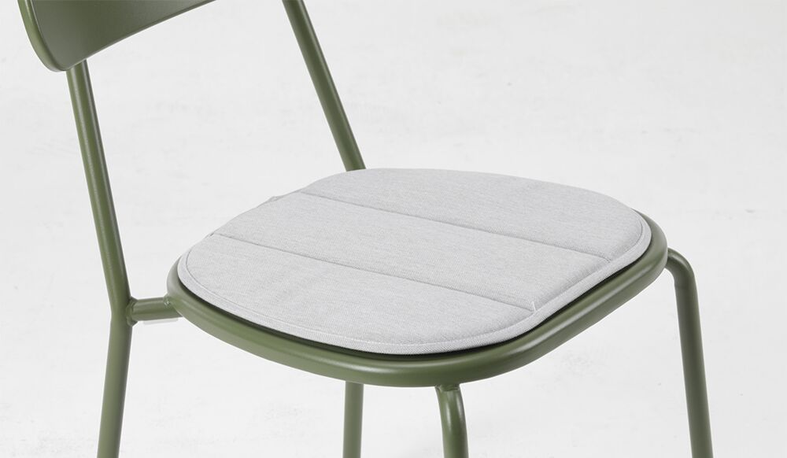

# Roof Terrace — Garden Furniture Options

*Shortlist for the 22 Sussex Square roof terrace (Brighton seafront). Three sections: **Dining tables**, **Dining chairs**, **Sofas & comfy chairs**. Prices captured June 2026 — confirm live before ordering.*

---

## Contents

**[What we're optimising for](#optimising)** · **[Recommended basket](#basket)** · **[How it looks](#looks)**

**[1 · Dining Tables](#tables)**
- Metal tops: [Nardi Rio £1,439](#nardi-rio) · [Mobellia Amalfi £599–799](#mobellia-amalfi)
- Stone tops: [Maze Maxim £1,999 ⭐](#maze-maxim) · [Bramblecrest Sofia £1,799 ⭐](#bramblecrest-sofia)

**[2 · Dining Chairs](#chairs)**
- [Chazey £114](#chazey) · [Bastille £126 ⭐](#bastille) · [Zaltana £145 ⭐](#zaltana) · [Summer £148 ⭐](#summer) · [Fox £167/177 ⭐](#fox) · [Culip £179](#culip) · [Si-Si £181 ⭐](#si-si) · [Mogan £185](#mogan) · [Joncols £199](#joncols) · [Lyona £200 ⭐](#lyona) · [Alua £233 ⭐](#alua)

**[3 · Sofas & comfy chairs](#sofas)**
- [Sherborne £1,499](#sherborne) · [Luxus Amalfi £1,941 ⭐](#luxus-amalfi) · [Maze Eve £1,985 ⭐](#maze-eve) · [4S Piacenza £2,499 ⭐](#piacenza) · [Teakunique Maluku £825/mod ⭐](#maluku) · [Tribu Mood £2,560](#tribu-mood) · [4S Alicante £2,699](#alicante) · [Cane-line Space (ref)](#cane-line-space)

**[Timing & checklist](#checklist)**

---

## What we're optimising for
- **Severe coastal exposure** — salt air + high wind. Heavy / corrosion-proof; **teak**, **cast aluminium** or **316 stainless** only — no steel, no thin tube aluminium.
- **Contemporary look** — clean, low, modern lines.
- **Seagull-proof table top** — gulls will foul the dining table, so the **top must be non-porous and wipe-clean**: **ceramic / sintered stone / HPL / glass / powder-coated (or wood-effect) aluminium.** Real **teak/wood tops are porous and stain** from droppings — avoid for the table.
- **Frames out, cushions stored** — only hard frames live outside; all cushions come indoors (storage being built in).
- **Budget** ~£3,000–£6,000 combined.

[↑ Contents](#contents)

---

## Recommended basket (contemporary, dark top, seagull-proof, wind-stable)
| | Item | Price |
|---|---|---|
| **Table** | Maze Maxim — **dark charcoal sintered-stone** top, heavy & wind-stable, table-only | **£1,999** |
| **Chairs** | 10× Teakunique Poppy teak (~8 kg, passes wind) | **£2,050** |
| **Lounge** | Luxus Amalfi Corner teak — or Maluku modular daybed (~£3,000) | **£1,941** |
| | **Total** | **~£5,990** |

Cheaper table alt: **Nardi Rio anthracite** (dark aluminium slat, 54 kg, £1,439) → drops the total to ~£5,430. Both tables are dark, seagull-proof and heavy enough for wind.

[↑ Contents](#contents)

---

## How it looks — front-runner pairings

*In our palette: dark table top · anthracite standing-seam wall behind · buff/yellow granite floor · teak Poppy chairs. The teak reads as a warm/cool contrast against the dark top — no clash — and ties to the granite.*

### Maze charcoal stone-top table + Poppy teak chairs

### Nardi Rio anthracite aluminium table + Poppy teak chairs (cleaner, more minimal)

[↑ Contents](#contents)

---

# 1 · Dining Tables

**Extending is a hard rule** — every table here extends. **Contemporary = slim aluminium A-frame/legs. Seagull-proof = a non-porous, wipe-clean top.** Grouped by top material — all stain-proof against droppings. (Real teak/wood tops are dropped: porous, they stain.)

---

## Metal (aluminium) tops — no rust, drains, wipe clean

### Nardi — Rio ⭐ (aluminium slat top)

- **Price:** £1,439 table-only
- **Size:** 210×100cm → **280×100cm** (extends, ~10 seats) · H76cm
- **Material:** Powder-coated aluminium frame + slatted aluminium top
- **Colour:** Anthracite (dark)
- **Weight:** ~54 kg (unusually heavy for aluminium)
- **Reviews:** juliajones.co.uk — not independently checked on Trustpilot; established UK specialist outdoor furniture retailer. Nardi is Italian contract/commercial-grade, award-winning — well-regarded by the trade.

**Pros:**
- Slatted top drains rain/hose instantly; wipe-clean; seagull-proof
- 54 kg = very heavy for aluminium; won't blow in normal weather
- Italian contract grade

**Cons:**
- One buyer report: top scratches easily; transit-damage claim refused — inspect carefully on delivery
- Order the "Rio Alu" version (not the resin Rio); request Nardi's optional saltwater anti-corrosion treatment

[juliajones.co.uk — Nardi Rio](https://www.juliajones.co.uk/nardi-rio-aluminium-outdoor-extending-dining-table-210-280cm/p2120)

[↑ Tables](#tables) · [↑ Contents](#contents)

---

### Mobellia — Amalfi (aluminium A-frame)

- **Price:** 10-seat £599 · 12-seat £799
- **Size:** **⭐ Preferred: 10-seat 200→260×96cm** (fits ≤220cm compact constraint) · 12-seat 240→300×96cm · H75cm
- **Material:** Aluminium A-frame; **cemented composite top** (non-porous, wipe-clean — confirmed from Mobellia's site)
- **Colour:** White or anthracite frame
- **Reviews:** mobellia.com — not independently verified on Trustpilot; online-only retailer; check returns policy before ordering.

**Pros:**
- Lowest price by far; tool-free extension; modern A-frame look
- Composite top is seagull-proof (non-porous)
- **Starts at 200cm** — fits when you need it compact

**Cons:**
- Light build — ballast against wind
- No independent review base found

[mobellia.com — Amalfi 10-seat (200→260cm)](https://www.mobellia.com/en-gb/products/automatic-extendable-garden-table-10-seats-aluminium-amalfi-200-260x96?variant=56303906750812)

[↑ Tables](#tables) · [↑ Contents](#contents)

---

## Stone tops — sintered stone / ceramic — ultra stain & scratch-proof

### Maze — Maxim ⭐ (sintered-stone top)

- **Price:** £1,999 table-only
- **Size:** 280×100cm → **340×100cm** → **400×100cm** (three-step extension, 8→10→12 seats) · H77.5cm · **⚠ Smallest setting is 280cm** — if you need ≤220cm when compact, the Maxim is too big. The Nardi Rio (210→280) and Mobellia (200→260) both start smaller.
- **Colour:** Charcoal or Latte (sintered-stone top)
- **Material:** Aluminium frame + sintered-stone top
- **Reviews:** mazeliving.co.uk — **~9,600 Trustpilot reviews, mixed.** Headline positive but a real tail of complaints: delivery delays, rattan/coating issues on older ranges. Known delivery-damage risk on stone edges. Confirm stone top is covered in warranty; inspect carefully on arrival.

**Pros:**
- Sintered stone = toughest, most stain-proof surface going; seagull-proof
- Heavy stone top = the most wind-stable table on this list
- Three-step extension: 280, 340, or 400cm — genuinely seats 12
- Sold **table-only** — pick any chairs you like

**Cons:**
- Known delivery-damage risk on stone edges — inspect on arrival
- Narrow warranty (structural + rust only; 48-hr defect window) — confirm stone top is covered in writing
- 400cm is a very long run — check it fits the dining zone (FA2 = 5.75m)

[mazeliving.co.uk — Maze Maxim](https://www.mazeliving.co.uk/product/maze-maxim-extending-aluminium-dining-table)

[↑ Tables](#tables) · [↑ Contents](#contents)

---

### Bramblecrest — Sofia ⭐ (dark ceramic X-leg, best value)

- **Price:** £1,799 for table + 10 chairs
- **Size:** Extending X-leg table; standard Sofia tables run 165–200×95cm (6–8 seats); 10-seat extending version — ⚠ **exact extended dimensions not published online; confirm with Crownhill or Bramblecrest before ordering**
- **Material:** Aluminium X-leg frame + dark anthracite ceramic top
- **Colour:** Anthracite
- **Reviews:** Bramblecrest brand — **4.5/5 Trustpilot (4,600+ reviews), 5-year structural guarantee.** One of the better-reviewed brands here. Strong customer service.

**Pros:**
- ⭐ Excellent value — dark ceramic top + sculptural X-base + 10 chairs for £1,799
- Dark anthracite ties directly to the palette
- Take the table and pair with better chairs of your choice

**Cons:**
- Sold as a set only (not table-only)
- ⚠ Exact extended dimensions not published — **confirm before ordering**

[crownhillgarden.com — Bramblecrest Sofia](https://crownhillgarden.com/product/bramblecrest-sofia-aluminium-10-seat-patio-set-with-x-leg-extending-table-and-10-chairs-in-anthracite/)

*Other dark-ceramic alternatives:* **Alexander Rose Rimini** ~£1,293 (table-only, ceramic-glass, mid-grey not charcoal, extends to 300cm) · **Cane-line Drop (Fossil Black)** £5,100 (the deepest dark ceramic — premium reference only).

[↑ Tables](#tables) · [↑ Contents](#contents)

---

# 2 · Dining Chairs

Metal, not wood. All entries sorted by price, cheapest first. Aluminium won't rust. Steel needs to be **duplex galvanised** (galv then powder-coat — zinc under the colour, survives chips) or **316 stainless**. Managed by the **wind plan**: chairs tuck under the heavy stone table + come in for storms. All seats are bare metal — wipe-clean, drain, no fixed cushions.

---

### Cafe Reality — Chazey · £114

*Photo shows multiple Chazey colourways stacked — grey/anthracite is the rightmost dark chair in the stack. Cafe Reality site is Cloudflare-blocked so a standalone grey shot couldn't be retrieved; contact them to confirm grey availability.*

- **Price:** £114/chair
- **Material:** Powder-coated marine aluminium
- **Colour:** Black / charcoal / grey (confirm availability with Cafe Reality) · **Weight:** ~4–6 kg (unpublished) · **Arms:** No · **Stackable:** Yes · **Seat:** Slatted (drains)
- **Reviews:** cafereality.co.uk — **no independent Trustpilot listing found**; reviews self-hosted. Established UK contract/hospitality supplier serving cafés and restaurants. No red flags.

**Pros:** Cheapest coastal-safe chair here; clean dark slat look; stackable · **Cons:** No independent review verification; light (wind plan applies)

[cafereality.co.uk — Chazey](https://www.cafereality.co.uk/prod/chazey-outdoor-aluminium-side-chairs)

[↑ Chairs](#chairs) · [↑ Contents](#contents)

---

### Cafe Reality — Bastille ⭐ · £126

- **Price:** £126/chair
- **Material:** Powder-coated marine aluminium
- **Colour:** Charcoal · **Weight:** ~4–6 kg (unpublished) · **Arms:** No · **Stackable:** Yes · **Seat:** Vertical slat (drains)
- **Reviews:** cafereality.co.uk — same as Chazey above; established UK contract supplier, no independent Trustpilot listing.

**Pros:** Contemporary vertical-slat look — clean and modern; contract-grade; coastal-safe · **Cons:** No independent review base; light (wind plan applies)

[cafereality.co.uk — Bastille](https://www.cafereality.co.uk/prod/bastille-outdoor-aluminium-side-chair)

[↑ Chairs](#chairs) · [↑ Contents](#contents)

---

### Kave Home — Zaltana ⭐ · £145

- **Price:** £145/chair
- **Material:** Powder-coated marine aluminium
- **Colour:** Anthracite (dark) · **Weight:** Unpublished · **Arms:** Yes · **Stackable:** Yes · **Seat:** Textilene mesh sling (drains; no cushion)
- **Reviews:** kavehome.com — **Trustpilot: ~41,000 reviews, polarized.** Many 5-star but recurring delivery complaints. Confirm stock and lead time before ordering.

**Pros:** Best value with arms + contemporary look; textilene sling drains; stackable · **Cons:** Weight unpublished; delivery complaints; light (wind plan applies)

[kavehome.com — Zaltana](https://kavehome.com/gb/en/p/zaltana-stackable-outdoor-chair-in-aluminium-with-a-matt-dark-grey-painted-finish)

[↑ Chairs](#chairs) · [↑ Contents](#contents)

---

### SCAB Design — Summer ⭐ · £148

*Photo in anthracite — the correct colour. Optional seat cushions available as an accessory (stored indoors when not in use — no cushion product shots available online).*

- **Price:** ~£148/chair
- **Material:** **Duplex galvanised + powder-coated steel** — zinc under the colour → dark AND rustproof at the coast
- **Colour:** Dark anthracite confirmed; multiple finishes available — ask tecnoarredo3 for current colour chart · **Weight:** Unpublished · **Arms:** No · **Stackable:** Yes · **Seat:** Horizontal wire-rod grid (drains perfectly, nothing pools)
- **Reviews:** tecnoarredo3.co.uk — **4.7/5 Trustpilot (224 reviews). Excellent.** 88% 5-star; legitimate Italian retailer; responsive customer service.

**Pros:** Duplex galv = dark AND coastal-safe (zinc survives chips); horizontal wire-rod drains perfectly; affordable at £148; best-reviewed steel-chair retailer on this list · **Cons:** More open/industrial look than the pressed-steel options; weight unpublished

[tecnoarredo3.co.uk — SCAB Summer](https://www.tecnoarredo3.co.uk/summer-chair-scab)

[↑ Chairs](#chairs) · [↑ Contents](#contents)

---

### Vermobil — Fox · £167 (side chair) / £177 (armchair)

**Side chair — no arms:**

*⚠ No colour-specific photography exists online — deluxdeco shows the same photos regardless of which colour you select. Photos show **Grey Mud FA** (olive/sage). **Ancient Grey (AG)** is a cool mid-grey — same design, different tone. Order samples/swatches before committing.*

**Armchair — with arms (£10 more):**

*Armchair photos in red — Ancient Grey (AG) unavailable online; same pressed-steel design in any colour*

**With optional seat cushion (stored indoors when not in use):**

- **Price:** Side chair £167 (RRP £222) · Armchair £177 (RRP £236) · **Lead time: 6–10 weeks** (made to order)
- **Size:** Side chair W45 × D53 × H81cm (armchair wider — confirm with deluxdeco)
- **Material:** **Duplex galvanised steel** (galvanised then qualicoat powder-coated) — confirmed coastal-safe
- **Colour:** 7 options: **Black NE** · **Grey Mud FA** (olive/sage — side chair photo) · **Ancient Grey AG** · Ivory White · Matt White · Bronzo · Beige · **Weight:** Unpublished · **Arms:** Armchair version available · **Stackable:** Yes · **Seat:** Smooth pressed steel shell (wipe-clean); 8 cushion fabrics available separately (UV/water/mould resistant, 5-yr warranty)
- **Reviews:** deluxdeco.co.uk — **5.0/5 Trustpilot (235 reviews). Excellent.** Professional service, highly praised delivery teams.

**Pros:** Confirmed duplex galv = properly coastal-safe; smooth pressed-steel seat — clean and wipe-clean; armchair option for comfort; good discount off RRP; excellent retailer · **Cons:** ⚠ 6–10 week lead time — order July for Sept fit-out; weight unpublished

[deluxdeco.co.uk — Fox side chair](https://www.deluxdeco.co.uk/fox-chair.html) · [Fox armchair](https://www.deluxdeco.co.uk/fox-armchair.html)

[↑ Chairs](#chairs) · [↑ Contents](#contents)

---

### Kave Home — Culip · £179

- **Price:** £179/chair
- **Material:** Powder-coated marine aluminium frame + outdoor cord weave seat
- **Colour:** Black frame + dark grey cord · **Weight:** Unpublished · **Arms:** Yes · **Stackable:** Yes · **Seat:** Woven cord (drains; stays out)
- **Reviews:** kavehome.com — same as Zaltana above; mixed Trustpilot, delivery concerns.

**Pros:** The Cane-line Lean look at far less; arms included; stackable · **Cons:** Woven cord seat stays out permanently (not bare metal); weight unpublished; delivery complaints

[kavehome.com — Culip](https://kavehome.com/gb/en/p/culip-aluminium-and-cord-stackable-outdoor-chair-in-grey)

[↑ Chairs](#chairs) · [↑ Contents](#contents)

---

### SCAB Design — Si-Si 2503 ⭐ · £181

*⚠ No Anthracite/Dove Grey product photography online — SCAB only publish lifestyle shots in sage/green. Photo shows the actual Si-Si 2503 design (pressed-steel oval back + seat) in sage colourway. **Anthracite (ZA)** = dark charcoal; **Dove Grey (ZT)** = warm mid-grey — request swatches from arredinitaly before ordering.*

- **Price:** £181/chair (sold in pairs)
- **Size:** W50 × D55 × H81cm (CATAS-certified)
- **Material:** **Duplex galvanised + powder-coated steel** — zinc under the paint → dark AND rustproof
- **Colour:** **Anthracite (ZA)** and **Dove Grey (ZT)** both available · **Weight:** 8.7 kg (heaviest chair on this list) · **Arms:** No · **Stackable:** Yes · **Seat:** Pressed/curved steel sheet (wipe-clean)
- **Reviews:** arredinitaly.com — positive Trustpilot (47 reviews — small sample; Chamber of Commerce registered; legitimate Italian retailer).

**Pros:** **Heaviest chair at 8.7 kg** — best wind resistance of any non-teak option; duplex galv = dark AND coastal-safe; **dove grey is a genuine grey option**; Italian CATAS-certified · **Cons:** Small retailer (47 reviews); sold in pairs only; confirm UK delivery lead time

[arredinitaly.com — SCAB Si-Si 2503](https://www.arredinitaly.com/gb/metal-chairs/13893-si-si-2503-chairs-scab-design.html)

[↑ Chairs](#chairs) · [↑ Contents](#contents)

---

### Vermobil — Mogan · £185

*The right-hand chair in the photo has an optional seat cushion pad — the chair itself has a bare slatted metal seat*

- **Price:** £185/chair (RRP £247) · **Lead time: 6–10 weeks** (made to order)
- **Material:** **Duplex galvanised steel** (same spec as Fox — galvanised + qualicoat powder coat)
- **Colour:** Anthracite + other options (confirm with deluxdeco) · **Weight:** Unpublished · **Arms:** No · **Stackable:** Yes · **Seat:** Square-back horizontal slatted steel (drains)
- **Reviews:** deluxdeco.co.uk — **5.0/5 Trustpilot (235 reviews). Excellent.**

**Pros:** Clean square-back geometric design; good saving on RRP; confirmed duplex galv = coastal-safe; excellent retailer · **Cons:** ⚠ 6–10 week lead time — order July for Sept fit-out; weight unpublished

[deluxdeco.co.uk — Vermobil Mogan](https://www.deluxdeco.co.uk/mogan-chair.html)

[↑ Chairs](#chairs) · [↑ Contents](#contents)

---

### Kave Home — Joncols · £199

- **Price:** £199/chair
- **Material:** Powder-coated marine aluminium
- **Colour:** Black · **Weight:** Unpublished · **Arms:** Yes · **Stackable:** Yes · **Seat:** Horizontal flat-slat back + slatted seat (drains)
- **Reviews:** kavehome.com — same as above; mixed Trustpilot, delivery concerns.

**Pros:** Clean architectural horizontal slat look; arms; stackable · **Cons:** Top of under-£200 range; weight unpublished; delivery complaints

[kavehome.com — Joncols](https://kavehome.com/gb/en/p/joncols-stackable-outdoor-chair-in-aluminium-with-grey-painted-finish)

[↑ Chairs](#chairs) · [↑ Contents](#contents)

---

### La Redoute — Lyona ⭐ · £200

- **Price:** £200/chair (set of 2 = £399.99; ~£130 spotted at Made/Next — worth checking)
- **Material:** Powder-coated marine aluminium
- **Colour:** Matte black · **Weight:** 3.9 kg (published) · **Arms:** No · **Stackable:** Yes · **Seat:** Perforated mesh back + slatted seat (drains)
- **Reviews:** laredoute.co.uk — mixed Trustpilot; delivery/returns concerns. Buy in a set of 2; pay by card.

**Pros:** The most design-shop clean look here; slim tapered legs; published weight; stackable · **Cons:** 3.9 kg = lightest aluminium chair on the list (wind plan critical); delivery concerns; sold in pairs

[laredoute.co.uk — Lyona](https://www.laredoute.co.uk/ppdp/prod-350903799.aspx)

[↑ Chairs](#chairs) · [↑ Contents](#contents)

---

### HOUE — Alua ⭐ · ~£233 *(stretch)*

- **Price:** ~£233/chair (stretch)
- **Material:** Powder-coated marine aluminium
- **Colour:** Black (+ muted white, olive green, beige, cayenne red, ice blue) — **no grey available** · **Weight:** 4.8 kg (published) · **Arms:** No · **Stackable:** Yes (up to 10) · **Seat:** Curved slatted seat + back (drains)
- **Reviews:** Holloways of Ludlow — **4.9/5 Trustpilot (500+ reviews). Excellent.**

**Pros:** Most refined / architectural aluminium chair here; published weight; stacks 10 high; Danish design; 5-year warranty · **Cons:** Over budget at ~£233 (stretch); no grey colourway available

[hollowaysofludlow.com — HOUE Alua](https://www.hollowaysofludlow.com/products/houe-alua-dining-chair)

[↑ Chairs](#chairs) · [↑ Contents](#contents)

---

**Steer:** **Cafe Reality Bastille (£126)** or **Chazey (£114)** for lowest-cost coastal-safe aluminium. **SCAB Summer (£148)** is the duplex steel standout at the price. **SCAB Si-Si (£181, 8.7 kg)** is the heaviest and has a dove grey option. **Vermobil Fox (£167/177)** and **Mogan (£185)** both confirmed duplex galv via deluxdeco 5.0/5 — note the 6–10 week lead time. **HOUE Alua (£233)** via Holloways for the most architectural aluminium option.

*Swyft Garden Dining Chair 01 (£140) — same aluminium-slat look, but olive/taupe only (no dark), sold out, and Swyft's table is fixed ~6–8 seats. Doesn't fit the brief.*

[↑ Top](#top) · [↑ Contents](#contents)

---

# 3 · Sofas & Comfy Chairs

Sorted by price (cheapest first). **Daybed key:** ✅✅ push modules into a bed · ✅ pieces combine into a daybed · ◐ reconfigures (L/R, splits) but not flat.

---

### Sherborne — Teak Corner · £1,499 (value classic)

- **Price:** £1,499 (5-seat corner + coffee table)
- **Material:** Grade A teak; made in England · **Modularity:** ◐ — chaise clamps L/R
- **Reviews:** gardenbenches.com (Sloane & Sons) — **4.4/5 Trustpilot (77 reviews).** 84% 5-star; good communication; responds to 100% of negative reviews. Solid UK teak specialist.

**Pros:** Excellent value for solid teak; UK-made; good customer service · **Cons:** High-back classic style — not the low modern look; not a true daybed

[gardenbenches.com — Sherborne Teak Corner](https://www.gardenbenches.com/wooden-garden-corner-sofa-sets)

[↑ Sofas](#sofas) · [↑ Contents](#contents)

---

### Luxus — Amalfi Corner Teak ⭐ · £1,941

- **Price:** £1,941 (was £2,999)
- **Material:** Solid teak · **Modularity:** ◐ — customisable L-shape
- **Reviews:** luxushomeandgarden.com — **4.6/5 Trustpilot (675 reviews).** 69% 5-star; company responds to 83% of negative reviews within a week. One report of furniture rotting after one year (company did replace). Generally positive.

**Pros:** Sleek low modern profile; great value at sale price; solid teak = coastal-proof · **Cons:** Not a true daybed (L-shape only)

[luxushomeandgarden.com — Amalfi Corner](https://www.luxushomeandgarden.com/products/amalfi-corner-teak-sofa-and-table-set)

[↑ Sofas](#sofas) · [↑ Contents](#contents)

---

### Maze — Eve Corner ⭐ · £1,985 (value, dark frame)

- **Price:** £1,985
- **Material:** Slim charcoal aluminium frame; fabric cushions (store indoors) · **Modularity:** ◐ — arms convert to side tables
- **Reviews:** mazeliving.co.uk — **~9,600 Trustpilot reviews, mixed.** Same caveat as the Maxim table: delivery delays reported, coating issues on some lines. Confirm the Eve sofa specifically before ordering; inspect on delivery.

**Pros:** Dark charcoal aluminium ties to the palette; modern low profile; arms convert to side tables · **Cons:** Not a flat daybed; mixed reviews

[outdoorluxeonline.com — Maze Eve](https://outdoorluxeonline.com/products/maze-outdoor-fabric-eve-corner-group-charcoa)

[↑ Sofas](#sofas) · [↑ Contents](#contents)

---

### 4 Seasons Outdoor — Piacenza ⭐ · £2,499

- **Price:** £2,499
- **Material:** Dark aluminium frame + rope detailing; light cushions (store indoors) · **Modularity:** ✅ — rounded chaise end
- **Reviews:** 4 Seasons Outdoor brand — **Trustpilot: 121 reviews, positive with caveats.** One long-term customer reports furniture in top condition after 8 years. Some quality concerns at purchase. themodernfurniturecompany.com as retailer: limited independent data.

**Pros:** Dark aluminium ties to palette; rounded chaise; reputable brand; cushions storable · **Cons:** Limited retailer review data; not a flat daybed

[themodernfurniturecompany.com — 4 Seasons Piacenza](https://themodernfurniturecompany.com/collections/outdoor-sofas)

[↑ Sofas](#sofas) · [↑ Contents](#contents)

---

### Teakunique — Maluku II Modular ⭐ · from £825/module (~£2,500–£3,500 full set)

- **Price:** £825/corner module; full corner set ≈ £2,500–£3,500
- **Material:** Solid teak · **Modularity:** ✅✅ — ottomans push together into a true flat daybed
- **Reviews:** teakunique.co.uk — ⚠ **no Trustpilot listing found.** Reviews are self-hosted only; no independent verification. Small UK family firm; self-stated 10-year warranty. Order a sample before committing.

**Pros:** Best daybed option on the list; solid teak = coastal-proof; modular — scale to budget · **Cons:** ⚠ No independent review base — verify teak quality with a sample first

[teakunique.co.uk — Maluku II](https://teakunique.co.uk/products/maluku-modular-sofa-corner-section)

[↑ Sofas](#sofas) · [↑ Contents](#contents)

---

### Tribu — Mood · £2,560 (premium teak)

- **Price:** £2,560
- **Material:** A-grade teak frame + woven Tricord · **Modularity:** ◐
- **Reviews:** gomodern.co.uk — **43 Trustpilot reviews, generally positive.** Small boutique retailer; praised for knowledgeable service. Tribu is Belgian premium brand, well-regarded in the trade.

**Pros:** Premium Belgian design; low minimalist profile; teak + Tricord is elegant and coastal-durable · **Cons:** Premium price; boutique retailer (small review sample)

[gomodern.co.uk — Tribu Mood](https://www.gomodern.co.uk/tribu-mood-garden-sofa.html)

[↑ Sofas](#sofas) · [↑ Contents](#contents)

---

### 4 Seasons Outdoor — Alicante · £2,699

- **Price:** £2,699 (sofa + 2 armchairs + footstools + coffee table)
- **Material:** Dark aluminium frame + rope; light cushions · **Modularity:** ◐ — footstools nudge together for a lounger
- **Reviews:** same as Piacenza above (4 Seasons Outdoor brand + The Modern Furniture Company as retailer).

**Pros:** Complete set including armchairs and footstools; great sociable layout; dark frame · **Cons:** Not a flat daybed; same retailer caveats as Piacenza

[themodernfurniturecompany.com — 4 Seasons Alicante](https://themodernfurniturecompany.com/collections/outdoor-sofas)

[↑ Sofas](#sofas) · [↑ Contents](#contents)

---

### Cane-line — Space · ~£4,470/module *(reference — the aspiration look)*

- **Price:** ~£4,470/module (a full set is well over budget)
- **Material:** Slim dark aluminium base + integrated teak table + light cushions
- **Reviews:** worm.co.uk — reputable UK design retailer. Cane-line is a well-established Danish premium brand.

**Pros:** Very low modern modular daybed; dark/teak palette match is perfect; the look to aim for · **Cons:** Well over budget — reference only; Piacenza and Maluku achieve a similar look for far less

[worm.co.uk — Cane-line Space](https://www.worm.co.uk/products/space-daybed-module-with-teak-table-left)

*More options (not pictured):* Fast Aikana aluminium daybed (£3,330) · Heal's Eos modular (£1,808) · Skagerak Tradition teak modular (~£1,865/module) · Emu Tami matt-black aluminium (£3,170).

[↑ Sofas](#sofas) · [↑ Contents](#contents)

---

[↑ Top](#top) · [↑ Contents](#contents)

---

## Timing & checklist

- **Buy in the Aug–Sept clearance** (fit-out completes late Sept 2026) — best discounts on aluminium/rope sets; teak specialists barely move seasonally.
- [ ] Confirm the table's **top is non-porous** (ceramic/HPL/aluminium) and its **largest size seats 10–12**.
- [ ] **⚠ Bramblecrest Sofia extending dimensions** — confirm exact cm before ordering (not published online).
- [ ] Confirm sofa cushions are **Olefin/Sunbrella + quick-dry foam**; frames have a slatted base so they look right with cushions off.
- [ ] **Ballast/anchor** big pieces + the aluminium table against wind (no roof penetration — coordinate with Ronan).
- [ ] Order **samples** before committing.
- [ ] **⚠ Vermobil Fox/Mogan: 6–10 week lead time** — order July 2026 to arrive for Sept fit-out.
- [ ] For SCAB Si-Si: confirm UK delivery lead time with arredinitaly.com.
- [ ] For Teakunique: order a teak sample before committing (no independent Trustpilot reviews).
- [ ] For Kave Home chairs (Zaltana/Culip/Joncols): confirm stock availability + delivery lead time upfront.

[↑ Top](#top) · [↑ Contents](#contents)
