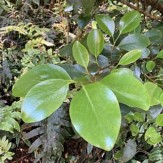
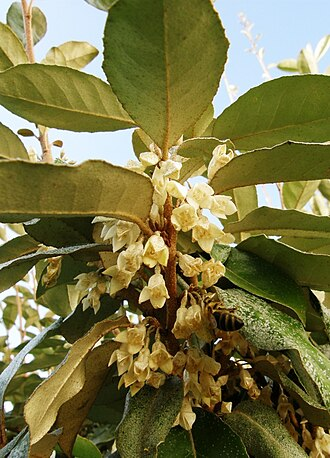

# Roof Terrace — Planting Plan

**Flat 6, 22 Sussex Square, Brighton BN2 5AA** · Issued for nursery review — 30 August 2026

> **What we're asking for.** This is the planting plan for a new roof terrace on a Grade I listed
> building on the Brighton seafront. We would like you to **review it, tell us where we've got it wrong,
> suggest substitutions, confirm supply sizes and availability, and price it.**
>
> The client is not a plantsman. **Please push back** — if a species won't do what we think it will in
> this exposure, if a supply size is wrong, or if you'd do something better, we want to hear it.
> §11 sets out the specific questions we'd most value your view on.
>
> Planter positions and dimensions are fixed and are shown on the drawings in §3.

---

## Contents

1. [The site](#1-the-site)
2. [Design intent](#2-design-intent)
3. [Layout drawings](#3-layout-drawings)
4. [Planting plan — planter by planter](#4-planting-plan--planter-by-planter)
5. [Planting plan — the pots](#5-planting-plan--the-pots)
6. [The plant list](#6-the-plant-list)
7. [Bulbs and corms](#7-bulbs-and-corms)
8. [Two decisions we'd like your view on: snowdrops, and mulch](#8-two-decisions-wed-like-your-view-on)
9. [Schedule of quantities](#9-schedule-of-quantities)
10. [Planting, irrigation and aftercare](#10-planting-irrigation-and-aftercare)
11. [Where we'd value your expert view](#11-where-wed-value-your-expert-view)

---

## 1. The site

A new roof terrace of about 120 m², three storeys up, on the seafront at Kemp Town. Roughly **26.4 m²
of it is planted**, in timber planters built on top of the finished granite paving.

| Condition | What it means for the planting |
|---|---|
| **Exposure** | Salt-laden wind off the Channel, unobstructed on all four sides. The prevailing and strongest wind is **south-westerly**; the cold desiccating one is **north-easterly** in spring |
| **Aspect** | **Full sun across almost the whole terrace.** The one exception is the **south end of the narrow terrace** (planter N4 and the pot clusters), where the flat rises about 3m immediately to the south — that area gets good light but much less direct sun, especially in winter when the sun is low |
| **Soil** | Peat-free lightweight roof-garden mix — loam, perlite/vermiculite and compost over a drainage layer. Deliberately lean and sharply drained |
| **Planter depth** | Mostly **600mm**; the SE L-shape (M2) is **1,000mm**; the lift-over-run bed (N4) is **400mm** |
| **Water** | **Automatic drip irrigation on a timer** is being installed as part of the works |
| **Winter** | Mild and coastal — rarely below −3°C. **Wind desiccation and salt, not frost, are what kill here** |
| **Heritage** | The terrace sits within the Kemp Town Enclosures. The palette deliberately echoes the Mediterranean / silver-grey / coastal sub-shrub character of Sussex Square's communal gardens, and the scheme is part of a Listed Building Application with a biodiversity requirement |

---

## 2. Design intent

**Cool palette.** Silver and grey-green foliage; blue, purple and white flowers. Yellow is confined to
*Euphorbia*, *Phlomis*, *Coronilla* and the earliest bulbs.

**Structured but relaxed.** Repeated clipped evergreens give the bones and hold the scheme together in
February; loose Mediterranean planting spills between and over them. Two clips a year plus a spring
cut-back is the intended level of upkeep.

**Shelter from all four directions.** This is a functional requirement, not just an amenity one — the
terrace is unusable in a strong wind without it.

> **The windbreak principle we've designed to:** a barrier of roughly **50% porosity** shelters the
> ground for **10–15 times its own height** downwind, whereas a solid barrier shelters less and throws a
> turbulent eddy behind it. So the back rows are **dense-but-twiggy evergreens** — *Pittosporum*,
> *Escallonia*, *Griselinia*, *Elaeagnus* — planted at 0.8–1.0m centres to knit into a continuous
> **filtering** screen, rather than anything monolithic. **If you disagree with this reading, please say so.**

**Two layers, not three, in a 600mm planter.** A 1.5m evergreen at the back of a 600mm box will occupy
the full width at maturity and shade out anything in front of it. So the 600mm runs are planned as a back
row plus a front ribbon, with mid-height flowering shrubs substituted into the back row wherever we want
to see over. Only M2, at 1,000mm deep, carries a genuine third layer.

**The part-shaded south end is treated as a second micro-climate.** Rather than fight it, N4 and the pot
clusters carry a different palette — winter scent (*Sarcococca*, *Daphne odora*), snowdrops, cyclamen and
hellebore, alongside the culinary herbs that prefer not to bake. It is the area you walk through every
time you step out of the study door, so it is planned for scent and for picking.

**Year-round interest is an explicit requirement.** The scheme is built to have something happening in
every month:

| Month | What's flowering |
|---|---|
| **Dec–Jan** | *Sarcococca* (scent), *Coronilla* 'Citrina', *Iris unguicularis*, 'Rijnveld's Early Sensation' daffodils, *Cyclamen coum* |
| **Feb–Mar** | Snowdrops, crocus, *Iris reticulata*, *Daphne odora*, rosemary, *Euphorbia wulfenii*, 'Tête-à-tête' |
| **Apr–May** | Tulips, *Muscari*, 'Thalia', alliums, *Gladiolus byzantinus*, *Cistus*, *Teucrium*, *Armeria*, *Dianthus* |
| **Jun–Jul** | Lavender, *Nepeta*, *Phlomis*, *Eryngium*, *Hebe*, *Escallonia*, *Origanum*, *Allium sphaerocephalon* |
| **Aug–Sep** | *Escallonia* 'Iveyi', *Abelia*, *Hylotelephium*, *Aster*, *Salvia yangii*, *Verbena*, *Limonium* |
| **Oct–Nov** | *Arbutus* (flower and fruit together), *Elaeagnus* (scent), *Nerine*, *Cyclamen hederifolium*, allium and *Eryngium* seed heads |

---

## 3. Layout drawings

**🚨 Orientation: these drawings are rotated 90° clockwise. RIGHT = NORTH · LEFT = SOUTH · TOP = WEST · BOTTOM = EAST.**

**Whole terrace** — the narrow terrace runs south to north from the flat, opening into the main terrace
at the north end. Planters labelled N1–N4 and M1 / M2 / M4 / M7.

**Main section** — dining deck (raised 300mm), sauna and wet room, hot tub, and the lounge.

---

## 4. Planting plan — planter by planter

Quantities are what we'd like to order. **The gardener will set out on site and may adjust by ±10%**
against the actual run lengths — please price the totals in §9.

### N1(E) — Narrow terrace — **east** parapet

*7.2m long × 600mm deep · 500mm high*

> The principal screen against being overlooked from the east, and the east wind defence for the whole narrow terrace.

**Back row — windbreak, 0.8–1.0m centres**

| Qty | Plant | Supply size |
|---|---|---|
| **1** | *Pittosporum tenuifolium* 'Silver Sheen' — Kohuhu |  20–30L · 1.75–2.0m |
| **2** | *Escallonia* 'Iveyi' — Escallonia |  7.5–10L |
| **1** | *Griselinia littoralis* — New Zealand broadleaf |  7.5–10L |
| **1** | *Elaeagnus* × *submacrophylla* — Oleaster |  7.5–10L |
| **1** | *Atriplex halimus* — Tree purslane |  3L |
| **1** | *Euphorbia characias* subsp. *wulfenii* — Mediterranean spurge |  3–5L |
| **1** | *Brachyglottis* 'Sunshine' — Dunedin daisy bush |  3L |

**Front ribbon**

| Qty | Plant | Supply size |
|---|---|---|
| **3** | *Stachys byzantina* 'Big Ears' — Lamb's ears |  1L |
| **2** | *Erigeron karvinskianus* — Mexican fleabane |  1L |
| **2** | *Lavandula angustifolia* 'Hidcote' — English lavender |  2L |
| **2** | *Salvia rosmarinus* 'Severn Sea' — Semi-prostrate rosemary |  2L |
| **1** | *Nepeta* × *faassenii* 'Walker's Low' — Catmint |  1–2L |
| **1** | *Hebe* (*Veronica*) 'Rakaiensis' — Shrubby veronica |  2L |
| **1** | *Salvia nemorosa* 'Caradonna' — Balkan clary |  1–2L |
| **1** | *Salvia microphylla* 'Amethyst Lips' — Shrubby sage |  2L |
| **1** | *Armeria maritima* — Sea thrift |  9cm–1L |
| **1** | *Festuca glauca* 'Elijah Blue' — Blue fescue |  1L |
| **1** | *Dianthus gratianopolitanus* — Cheddar pink |  1L |
| **1** | *Verbena bonariensis* 'Lollipop' — Purpletop vervain |  1–2L |
| **1** | *Crithmum maritimum* — Rock samphire |  1L |

**Bulbs — planted Oct–Nov, threaded between the plants**

| Qty | Bulb | Flowers |
|---|---|---|
| **25** | *Allium hollandicum* 'Purple Sensation' — Ornamental onion | **May**, purple drumsticks |
| **25** | *Allium sphaerocephalon* — Drumstick allium | **Jul**, wine-purple |
| **25** | *Narcissus* 'Tête-à-tête' — Dwarf daffodil | Feb–Mar, 15cm |
| **15** | *Narcissus* 'Thalia' — Daffodil | Apr, **pure white**, 35cm |
| **10** | *Narcissus* 'Rijnveld's Early Sensation' — Daffodil | **January** |
| **15** | *Tulipa clusiana* 'Lady Jane' — Lady tulip | Apr, white / rose |
| **15** | *Tulipa saxatilis* (Bakeri Gp) 'Lilac Wonder' — Cretan tulip | Apr, lilac-pink, yellow eye |
| **40** | *Crocus tommasinianus* — Early crocus | **Feb**, lilac |
| **25** | *Iris reticulata* 'Harmony' + 'Katharine Hodgkin' — Dwarf iris | **Feb**, deep and pale blue |
| **25** | *Muscari armeniacum* 'Valerie Finnis' — Grape hyacinth | Apr, pale powder blue |
| **15** | *Gladiolus communis* subsp. *byzantinus* — Byzantine gladiolus | **May–Jun**, magenta |
| **5** | *Nectaroscordum siculum* — Sicilian honey garlic | Jun, cream / green / maroon bells |

*N1(E) total: **26 plants** + **240 bulbs***

### N1(N) — Narrow terrace — **north** leg of the L

*1.8m long × 800mm deep · 500mm high*

> The deepest planter on the narrow terrace, so it takes a full specimen. Marks the head of the L where the steps rise to the main terrace.

**Back row**

| Qty | Plant | Supply size |
|---|---|---|
| **1** | *Olea europaea* — multi-stem, gnarled — Olive |  45–60L · 1.75–2.0m |
| **1** | *Escallonia* 'Apple Blossom' — Escallonia |  7.5L |

**Front ribbon**

| Qty | Plant | Supply size |
|---|---|---|
| **1** | *Stachys byzantina* 'Big Ears' — Lamb's ears |  1L |
| **1** | *Erigeron karvinskianus* — Mexican fleabane |  1L |
| **1** | *Armeria maritima* — Sea thrift |  9cm–1L |
| **1** | *Festuca glauca* 'Elijah Blue' — Blue fescue |  1L |

**Bulbs — planted Oct–Nov, threaded between the plants**

| Qty | Bulb | Flowers |
|---|---|---|
| **10** | *Allium hollandicum* 'Purple Sensation' — Ornamental onion | **May**, purple drumsticks |
| **20** | *Crocus tommasinianus* — Early crocus | **Feb**, lilac |
| **10** | *Narcissus* 'Tête-à-tête' — Dwarf daffodil | Feb–Mar, 15cm |
| **10** | *Muscari armeniacum* 'Valerie Finnis' — Grape hyacinth | Apr, pale powder blue |
| **10** | *Tulipa saxatilis* (Bakeri Gp) 'Lilac Wonder' — Cretan tulip | Apr, lilac-pink, yellow eye |

*N1(N) total: **6 plants** + **60 bulbs***

### N2 — Narrow terrace — mid-east square

*1.2 × 1.2m · 500mm high · built integral with N1*

> A punctuation point in the east run — one piece of architecture with lavender around its feet.

**Whole square**

| Qty | Plant | Supply size |
|---|---|---|
| **1** | *Phormium tenax* 'Purpureum' — Bronze New Zealand flax |  10L |
| **4** | *Lavandula angustifolia* 'Hidcote' — English lavender |  2L |
| **3** | *Festuca glauca* 'Elijah Blue' — Blue fescue |  1L |

**Bulbs — planted Oct–Nov, threaded between the plants**

| Qty | Bulb | Flowers |
|---|---|---|
| **5** | *Allium cristophii* — Star of Persia | May–Jun |
| **20** | *Crocus chrysanthus* 'Blue Pearl' — Crocus | Feb, pale blue |
| **15** | *Iris reticulata* 'Harmony' + 'Katharine Hodgkin' — Dwarf iris | **Feb**, deep and pale blue |
| **10** | *Tulipa* 'Little Beauty' — Species tulip | Apr, 15cm, magenta with a blue eye |
| **10** | *Narcissus* 'W.P. Milner' — Dwarf daffodil | Mar, soft cream, 20cm |

*N2 total: **8 plants** + **60 bulbs***

### N3 — Narrow terrace — mid-west square, beside the outdoor kitchen

*1.2 × 1.2m · 500mm high*

> **The cook's square** — everything in it is culinary, and it is one step from the outdoor kitchen worktop.

**Whole square**

| Qty | Plant | Supply size |
|---|---|---|
| **2** | *Salvia rosmarinus* 'Miss Jessopp's Upright' — Upright rosemary |  2L |
| **4** | *Thymus vulgaris* · *T.* 'Silver Posie' · *T. serpyllum* — Thyme — 3 forms |  9cm |
| **2** | *Origanum* 'Herrenhausen' — Ornamental marjoram |  1L |
| **2** | *Salvia officinalis* 'Purpurascens' — Purple sage — culinary |  2L |

**Bulbs — planted Oct–Nov, threaded between the plants**

| Qty | Bulb | Flowers |
|---|---|---|
| **20** | *Crocus* 'Snow Bunting' — Crocus | Feb, **white**, scented |
| **15** | *Iris reticulata* 'Harmony' + 'Katharine Hodgkin' — Dwarf iris | **Feb**, deep and pale blue |
| **10** | *Tulipa* 'Little Beauty' — Species tulip | Apr, 15cm, magenta with a blue eye |
| **15** | *Allium sphaerocephalon* — Drumstick allium | **Jul**, wine-purple |

*N3 total: **10 plants** + **60 bulbs***

### N4 — Lift over-run — **the aromatic picking bed**

*2.1 × 2.1m · **400mm deep box** · planting kept under 700mm*

> You brush past this every time you go out of the study door, so it is built for scent and for picking. **Part-shaded** — the flat rises ~3m immediately to its south — so it is zoned: sun-loving Mediterranean herbs on the north and east sides, and the shade-tolerant plants along the south edge in the lee of the wall.

**South edge — in the lee of the flat wall (part shade)**

| Qty | Plant | Supply size |
|---|---|---|
| **1** | *Sarcococca hookeriana* var. *humilis* — Sweet box / Christmas box |  3L |
| **1** | *Helleborus argutifolius* — Corsican hellebore |  2L |
| **2** | *Allium schoenoprasum* — Chives |  1L |
| **2** | *Origanum vulgare* — Wild marjoram / oregano — culinary |  1L |
| **1** | *Rumex acetosa* — Common sorrel |  1L |

**North + east edges and body — most direct sun**

| Qty | Plant | Supply size |
|---|---|---|
| **5** | *Salvia rosmarinus* 'Prostratus' — Trailing rosemary |  2L |
| **2** | *Salvia rosmarinus* 'Miss Jessopp's Upright' — Upright rosemary |  2L |
| **3** | *Lavandula angustifolia* 'Hidcote' — English lavender |  2L |
| **2** | *Santolina chamaecyparissus* — Cotton lavender |  2L |
| **2** | *Salvia microphylla* 'Amethyst Lips' — Shrubby sage |  2L |
| **6** | *Thymus vulgaris* · *T.* 'Silver Posie' · *T. serpyllum* — Thyme — 3 forms |  9cm |
| **2** | *Origanum* 'Herrenhausen' — Ornamental marjoram |  1L |
| **2** | *Salvia officinalis* — Common sage — culinary |  2L |
| **2** | *Satureja montana* — Winter savory |  1L |
| **2** | *Artemisia dracunculus* — **French** tarragon |  1L |

**Bulbs — planted Oct–Nov, threaded between the plants**

| Qty | Bulb | Flowers |
|---|---|---|
| **40** | *Crocus tommasinianus* — Early crocus | **Feb**, lilac |
| **20** | *Crocus chrysanthus* 'Blue Pearl' — Crocus | Feb, pale blue |
| **20** | *Crocus* 'Snow Bunting' — Crocus | Feb, **white**, scented |
| **30** | *Iris reticulata* 'Harmony' + 'Katharine Hodgkin' — Dwarf iris | **Feb**, deep and pale blue |
| **15** | *Tulipa clusiana* 'Lady Jane' — Lady tulip | Apr, white / rose |
| **15** | *Tulipa saxatilis* (Bakeri Gp) 'Lilac Wonder' — Cretan tulip | Apr, lilac-pink, yellow eye |
| **10** | *Tulipa* 'Little Beauty' — Species tulip | Apr, 15cm, magenta with a blue eye |
| **30** | *Allium sphaerocephalon* — Drumstick allium | **Jul**, wine-purple |
| **25** | *Narcissus* 'Tête-à-tête' — Dwarf daffodil | Feb–Mar, 15cm |
| **25** | *Muscari armeniacum* 'Valerie Finnis' — Grape hyacinth | Apr, pale powder blue |
| **40** | *Galanthus nivalis* — Snowdrop — **buy in the green** | **Jan–Feb**, white |
| **15** | *Cyclamen coum* — Eastern cyclamen | **Jan–Mar**, pink / white |
| **10** | *Cyclamen hederifolium* — Ivy-leaved cyclamen | **Sept–Nov**, pink / white |

*N4 total: **35 plants** + **295 bulbs***

### M1(W) — Main terrace — **west** edge of the raised dining deck (FA2)

*≈4.5m long × 600mm deep · 500mm high, on the +300mm raised deck*

> The south-westerly gale flank and the neighbour side — the hardest-working windbreak on the main terrace, and what you look at from the dining table.

**Back row**

| Qty | Plant | Supply size |
|---|---|---|
| **1** | *Pittosporum tenuifolium* 'Silver Sheen' — Kohuhu |  20–30L · 1.75–2.0m |
| **1** | *Escallonia* 'Iveyi' — Escallonia |  7.5–10L |
| **1** | *Griselinia littoralis* — New Zealand broadleaf |  7.5–10L |
| **1** | *Euphorbia characias* subsp. *wulfenii* — Mediterranean spurge |  3–5L |
| **1** | *Brachyglottis* 'Sunshine' — Dunedin daisy bush |  3L |

**Front ribbon**

| Qty | Plant | Supply size |
|---|---|---|
| **1** | *Lavandula angustifolia* 'Hidcote' — English lavender |  2L |
| **1** | *Lavandula angustifolia* 'Munstead' — English lavender |  2L |
| **2** | *Nepeta* × *faassenii* 'Walker's Low' — Catmint |  1–2L |
| **1** | *Salvia nemorosa* 'Caradonna' — Balkan clary |  1–2L |
| **2** | *Stachys byzantina* 'Big Ears' — Lamb's ears |  1L |
| **1** | *Erigeron karvinskianus* — Mexican fleabane |  1L |
| **1** | *Hebe* (*Veronica*) 'Rakaiensis' — Shrubby veronica |  2L |
| **1** | *Hylotelephium* 'Matrona' — Stonecrop / iceplant |  2L |
| **1** | *Convolvulus cneorum* — Silverbush |  2L |

**Bulbs — planted Oct–Nov, threaded between the plants**

| Qty | Bulb | Flowers |
|---|---|---|
| **20** | *Allium hollandicum* 'Purple Sensation' — Ornamental onion | **May**, purple drumsticks |
| **10** | *Allium cristophii* — Star of Persia | May–Jun |
| **20** | *Narcissus* 'Thalia' — Daffodil | Apr, **pure white**, 35cm |
| **15** | *Narcissus poeticus* var. *recurvus* — Pheasant's eye | **May**, white with a red-rimmed eye |
| **15** | *Tulipa clusiana* 'Lady Jane' — Lady tulip | Apr, white / rose |
| **30** | *Crocus tommasinianus* — Early crocus | **Feb**, lilac |
| **20** | *Muscari armeniacum* 'Valerie Finnis' — Grape hyacinth | Apr, pale powder blue |
| **8** | *Nectaroscordum siculum* — Sicilian honey garlic | Jun, cream / green / maroon bells |

*M1(W) total: **16 plants** + **138 bulbs***

### M1(N) — Main terrace — **north** edge of the raised dining deck

*≈1.1m long × 600mm deep · 500mm high*

> Deliberately kept low — this sits beside the three steps down to the lounge, and you want to see across it.

**Back**

| Qty | Plant | Supply size |
|---|---|---|
| **1** | *Pittosporum tenuifolium* 'Golf Ball' — Dwarf kohuhu |  5L |

**Front**

| Qty | Plant | Supply size |
|---|---|---|
| **1** | *Erigeron karvinskianus* — Mexican fleabane |  1L |
| **1** | *Stachys byzantina* 'Big Ears' — Lamb's ears |  1L |
| **1** | *Nepeta* × *faassenii* 'Walker's Low' — Catmint |  1–2L |

**Bulbs — planted Oct–Nov, threaded between the plants**

| Qty | Bulb | Flowers |
|---|---|---|
| **15** | *Crocus tommasinianus* — Early crocus | **Feb**, lilac |
| **10** | *Narcissus* 'Tête-à-tête' — Dwarf daffodil | Feb–Mar, 15cm |
| **10** | *Muscari armeniacum* 'Valerie Finnis' — Grape hyacinth | Apr, pale powder blue |

*M1(N) total: **4 plants** + **35 bulbs***

### M2(E) — Main terrace — **east** parapet

*5.1m long × **1,000mm deep** · 700mm high*

> The deepest planter on the terrace and the only one that genuinely takes three layers. It carries the year-round specimen and the widest range of season.

**Back row**

| Qty | Plant | Supply size |
|---|---|---|
| **1** | *Arbutus unedo* — multi-stem — Strawberry tree |  25–35L · 1.5–1.75m |
| **1** | *Escallonia* 'Apple Blossom' — Escallonia |  7.5L |
| **1** | *Griselinia littoralis* — New Zealand broadleaf |  7.5–10L |
| **1** | *Atriplex halimus* — Tree purslane |  3L |
| **1** | *Euphorbia characias* subsp. *wulfenii* — Mediterranean spurge |  3–5L |

**Mid row**

| Qty | Plant | Supply size |
|---|---|---|
| **1** | *Pittosporum tenuifolium* 'Golf Ball' — Dwarf kohuhu |  5L |
| **1** | *Cistus* × *purpureus* 'Alan Fradd' — Rock rose |  3L |
| **1** | *Teucrium fruticans* 'Azureum' — Tree germander |  3L |
| **1** | *Coronilla valentina* subsp. *glauca* 'Citrina' — Yellow coronilla |  3L |
| **1** | *Phlomis fruticosa* — Jerusalem sage |  3L |
| **1** | *Abelia* × *grandiflora* — Glossy abelia |  5L |

**Front ribbon**

| Qty | Plant | Supply size |
|---|---|---|
| **2** | *Stachys byzantina* 'Big Ears' — Lamb's ears |  1L |
| **1** | *Erigeron karvinskianus* — Mexican fleabane |  1L |
| **1** | *Lavandula angustifolia* 'Hidcote' — English lavender |  2L |
| **1** | *Salvia microphylla* 'Amethyst Lips' — Shrubby sage |  2L |
| **1** | *Eryngium bourgatii* 'Picos Blue' — Sea holly |  1–2L |
| **1** | *Hylotelephium* 'Matrona' — Stonecrop / iceplant |  2L |
| **1** | *Aster* × *frikartii* 'Mönch' — Michaelmas daisy |  2L |
| **1** | *Limonium platyphyllum* — Sea lavender |  1–2L |
| **1** | *Festuca glauca* 'Elijah Blue' — Blue fescue |  1L |
| **1** | *Dianthus gratianopolitanus* — Cheddar pink |  1L |
| **1** | *Santolina chamaecyparissus* — Cotton lavender |  2L |
| **3** | *Iris unguicularis* — Algerian iris |  1–2L |

**Bulbs — planted Oct–Nov, threaded between the plants**

| Qty | Bulb | Flowers |
|---|---|---|
| **25** | *Allium hollandicum* 'Purple Sensation' — Ornamental onion | **May**, purple drumsticks |
| **10** | *Allium cristophii* — Star of Persia | May–Jun |
| **30** | *Allium sphaerocephalon* — Drumstick allium | **Jul**, wine-purple |
| **20** | *Narcissus poeticus* var. *recurvus* — Pheasant's eye | **May**, white with a red-rimmed eye |
| **15** | *Narcissus* 'Thalia' — Daffodil | Apr, **pure white**, 35cm |
| **15** | *Narcissus* 'Rijnveld's Early Sensation' — Daffodil | **January** |
| **20** | *Tulipa saxatilis* (Bakeri Gp) 'Lilac Wonder' — Cretan tulip | Apr, lilac-pink, yellow eye |
| **20** | *Gladiolus communis* subsp. *byzantinus* — Byzantine gladiolus | **May–Jun**, magenta |
| **30** | *Crocus tommasinianus* — Early crocus | **Feb**, lilac |
| **20** | *Iris reticulata* 'Harmony' + 'Katharine Hodgkin' — Dwarf iris | **Feb**, deep and pale blue |
| **10** | *Muscari armeniacum* 'Valerie Finnis' — Grape hyacinth | Apr, pale powder blue |
| **8** | *Nerine bowdenii* — Guernsey lily | **October**, pink |

*M2(E) total: **26 plants** + **223 bulbs***

### M2(S) — Main terrace — **south** return of the SE L

*3.5m external / 2.5m internal × **1,000mm deep** · 700mm high*

> The heritage focal point, seen head-on from the dining table and the lounge. The 1m depth also gives the setback that removes the need for fall-protection glass along this edge.

**Back row**

| Qty | Plant | Supply size |
|---|---|---|
| **1** | *Olea europaea* — multi-stem, gnarled — Olive |  45–60L · 1.75–2.0m |
| **1** | *Atriplex halimus* — Tree purslane |  3L |
| **1** | *Euphorbia characias* subsp. *wulfenii* — Mediterranean spurge |  3–5L |

**Mid row**

| Qty | Plant | Supply size |
|---|---|---|
| **1** | *Cistus* × *purpureus* 'Alan Fradd' — Rock rose |  3L |
| **1** | *Teucrium fruticans* 'Azureum' — Tree germander |  3L |
| **1** | *Coronilla valentina* subsp. *glauca* 'Citrina' — Yellow coronilla |  3L |
| **1** | *Brachyglottis* 'Sunshine' — Dunedin daisy bush |  3L |

**Front ribbon**

| Qty | Plant | Supply size |
|---|---|---|
| **1** | *Stachys byzantina* 'Big Ears' — Lamb's ears |  1L |
| **1** | *Erigeron karvinskianus* — Mexican fleabane |  1L |
| **1** | *Salvia nemorosa* 'Caradonna' — Balkan clary |  1–2L |
| **1** | *Salvia yangii* 'Little Spire' — Russian sage |  2L |
| **1** | *Verbena bonariensis* 'Lollipop' — Purpletop vervain |  1–2L |
| **1** | *Eryngium bourgatii* 'Picos Blue' — Sea holly |  1–2L |
| **1** | *Erysimum* 'Bowles's Mauve' — Perennial wallflower |  2L |
| **1** | *Crithmum maritimum* — Rock samphire |  1L |
| **2** | *Iris unguicularis* — Algerian iris |  1–2L |

**Bulbs — planted Oct–Nov, threaded between the plants**

| Qty | Bulb | Flowers |
|---|---|---|
| **20** | *Allium hollandicum* 'Purple Sensation' — Ornamental onion | **May**, purple drumsticks |
| **5** | *Allium cristophii* — Star of Persia | May–Jun |
| **20** | *Allium sphaerocephalon* — Drumstick allium | **Jul**, wine-purple |
| **15** | *Narcissus poeticus* var. *recurvus* — Pheasant's eye | **May**, white with a red-rimmed eye |
| **15** | *Narcissus* 'Rijnveld's Early Sensation' — Daffodil | **January** |
| **15** | *Tulipa clusiana* 'Lady Jane' — Lady tulip | Apr, white / rose |
| **15** | *Gladiolus communis* subsp. *byzantinus* — Byzantine gladiolus | **May–Jun**, magenta |
| **25** | *Crocus tommasinianus* — Early crocus | **Feb**, lilac |
| **15** | *Iris reticulata* 'Harmony' + 'Katharine Hodgkin' — Dwarf iris | **Feb**, deep and pale blue |
| **7** | *Nerine bowdenii* — Guernsey lily | **October**, pink |
| **7** | *Nectaroscordum siculum* — Sicilian honey garlic | Jun, cream / green / maroon bells |

*M2(S) total: **17 plants** + **159 bulbs***

### M4 — Main terrace — **north** of the lounge seating

*2.70m long × 600mm deep · 700mm high*

> The exposed north / north-east flank. Until the Phase-2 hot-tub glass goes in, this planter is the only shelter the lounge has from that direction — so it is loaded with the toughest evergreens in the palette.

**Back row**

| Qty | Plant | Supply size |
|---|---|---|
| **1** | *Escallonia* 'Iveyi' — Escallonia |  7.5–10L |
| **1** | *Elaeagnus* × *submacrophylla* — Oleaster |  7.5–10L |
| **1** | *Abelia* × *grandiflora* — Glossy abelia |  5L |

**Front ribbon**

| Qty | Plant | Supply size |
|---|---|---|
| **1** | *Stachys byzantina* 'Big Ears' — Lamb's ears |  1L |
| **1** | *Lavandula angustifolia* 'Hidcote' — English lavender |  2L |
| **1** | *Armeria maritima* — Sea thrift |  9cm–1L |
| **1** | *Salvia yangii* 'Little Spire' — Russian sage |  2L |
| **1** | *Aster* × *frikartii* 'Mönch' — Michaelmas daisy |  2L |
| **1** | *Hylotelephium* 'Matrona' — Stonecrop / iceplant |  2L |
| **1** | *Erysimum* 'Bowles's Mauve' — Perennial wallflower |  2L |

**Bulbs — planted Oct–Nov, threaded between the plants**

| Qty | Bulb | Flowers |
|---|---|---|
| **20** | *Allium sphaerocephalon* — Drumstick allium | **Jul**, wine-purple |
| **20** | *Narcissus* 'Tête-à-tête' — Dwarf daffodil | Feb–Mar, 15cm |
| **20** | *Crocus tommasinianus* — Early crocus | **Feb**, lilac |
| **10** | *Muscari armeniacum* 'Valerie Finnis' — Grape hyacinth | Apr, pale powder blue |
| **10** | *Tulipa saxatilis* (Bakeri Gp) 'Lilac Wonder' — Cretan tulip | Apr, lilac-pink, yellow eye |

*M4 total: **10 plants** + **80 bulbs***

### M7 — Main terrace — **west** of the hot tub, between tub and building

*2.0m long × 600mm deep · finishes 150mm above the tub rim*

> Wind defence on the building side of the tub, and everything in it is aromatic — you brush past getting in and out.

**Back row**

| Qty | Plant | Supply size |
|---|---|---|
| **1** | *Olea europaea* — Olive |  15–25L · 1.2–1.5m |
| **1** | *Phlomis fruticosa* — Jerusalem sage |  3L |

**Front ribbon**

| Qty | Plant | Supply size |
|---|---|---|
| **1** | *Stachys byzantina* 'Big Ears' — Lamb's ears |  1L |
| **1** | *Lavandula angustifolia* 'Hidcote' — English lavender |  2L |
| **1** | *Salvia rosmarinus* 'Severn Sea' — Semi-prostrate rosemary |  2L |
| **1** | *Convolvulus cneorum* — Silverbush |  2L |
| **1** | *Erigeron karvinskianus* — Mexican fleabane |  1L |

**Bulbs — planted Oct–Nov, threaded between the plants**

| Qty | Bulb | Flowers |
|---|---|---|
| **10** | *Narcissus* 'Thalia' — Daffodil | Apr, **pure white**, 35cm |
| **20** | *Crocus chrysanthus* 'Blue Pearl' — Crocus | Feb, pale blue |
| **10** | *Muscari armeniacum* 'Valerie Finnis' — Grape hyacinth | Apr, pale powder blue |
| **10** | *Tulipa* 'Little Beauty' — Species tulip | Apr, 15cm, magenta with a blue eye |

*M7 total: **7 plants** + **50 bulbs***

---

## 5. Planting plan — the pots

All four clusters sit at the **part-shaded south end** of the narrow terrace, near the study door and the
outdoor kitchen. Pots themselves are not part of this order.

### Pot cluster 1 — ornamental, south end of the narrow terrace

**5 pots.** Part-shaded by the flat wall, so this group gets bright light rather than all-day direct sun.

| Qty | Plant | Supply size |
|---|---|---|
| **1** | *Olea europaea* — multi-stem, gnarled — Olive | 45–60L · 1.75–2.0m |
| **1** | *Phormium tenax* 'Purpureum' — Bronze New Zealand flax | 10L |
| **1** | *Convolvulus cneorum* — Silverbush | 2L |
| **1** | *Lavandula angustifolia* 'Munstead' — English lavender | 2L |
| **1** | *Salvia rosmarinus* 'Miss Jessopp's Upright' — Upright rosemary | 2L |

| Qty | Bulb | Flowers |
|---|---|---|
| **10** | *Narcissus* 'Tête-à-tête' — Dwarf daffodil | Feb–Mar, 15cm |
| **10** | *Tulipa clusiana* 'Lady Jane' — Lady tulip | Apr, white / rose |
| **10** | *Crocus* 'Snow Bunting' — Crocus | Feb, **white**, scented |

### Pot cluster 2 — kitchen herbs, by the study door and the outdoor kitchen

**6 pots.** The soft, invasive and tender herbs that must not go into a shared bed. The part shade here suits them better than full sun would.

| Qty | Plant | Supply size |
|---|---|---|
| **3** | *Mentha spicata* · *M.* 'Moroccan' · *M. suaveolens* — Mint — 3 kinds, **each in its own pot** | 2L |
| **1** | *Laurus nobilis* — clipped — Bay | ~80cm, large pot |
| **3** | *Petroselinum crispum* — Flat-leaf parsley | 1L |
| **3** | *Ocimum basilicum* — Basil | 9cm |

### Pot cluster 3 — winter scent, the most sheltered corner

**3 pots**, placed where you pass on the way out of the study door in winter.

| Qty | Plant | Supply size |
|---|---|---|
| **1** | *Sarcococca hookeriana* var. *humilis* — Sweet box / Christmas box | 3L |
| **1** | *Daphne odora* 'Aureomarginata' — Winter daphne | 3–5L |

| Qty | Bulb | Flowers |
|---|---|---|
| **60** | *Galanthus nivalis* — Snowdrop — **buy in the green** | **Jan–Feb**, white |
| **15** | *Cyclamen coum* — Eastern cyclamen | **Jan–Mar**, pink / white |
| **10** | *Cyclamen hederifolium* — Ivy-leaved cyclamen | **Sept–Nov**, pink / white |

### Pot cluster 4 — west of N3, softening the kitchen edge

**2 pots.**

| Qty | Plant | Supply size |
|---|---|---|
| **2** | *Stachys byzantina* 'Big Ears' — Lamb's ears | 1L |
| **1** | *Allium schoenoprasum* — Chives | 1L |

---

## 6. The plant list

Images link through to the RHS entry for each plant.

### Layer 1 — Specimen trees

| | Plant | Total | Supply size | Season & interest | Goes in |
|---|---|---|---|---|---|
|  [RHS →](https://www.rhs.org.uk/plants/search-results?query=Olea%20europaea) | ***Olea europaea* — multi-stem, gnarled** Olive | **3** | 45–60L · 1.75–2.0m | Evergreen silver-grey. Slow, long-lived, and airy enough to screen without walling off a view | N1(N), M2(S), Pots 1 |
|  [RHS →](https://www.rhs.org.uk/plants/search-results?query=Pittosporum%20tenuifolium%20%27Silver%20Sheen%27) | ***Pittosporum tenuifolium* 'Silver Sheen'** Kohuhu | **2** | 20–30L · 1.75–2.0m | Evergreen; fine silver-green leaves on black twigs. Fast, dense, and it **filters** wind rather than blocking it | N1(E), M1(W) |
|  [RHS →](https://www.rhs.org.uk/plants/search-results?query=Olea%20europaea) | ***Olea europaea*** Olive | **1** | 15–25L · 1.2–1.5m | As above, at a smaller scale | M7 |
|  [RHS →](https://www.rhs.org.uk/plants/search-results?query=Arbutus%20unedo) | ***Arbutus unedo* — multi-stem** Strawberry tree | **1** | 25–35L · 1.5–1.75m | Evergreen; cinnamon shredding bark; white bell flowers **and** red fruit together Oct–Dec. RHS Plants for Pollinators; fruit feeds birds | M2(E) |

### Layer 2 — Evergreen backbone (the permeable windbreak)

| | Plant | Total | Supply size | Season & interest | Goes in |
|---|---|---|---|---|---|
|  [RHS →](https://www.rhs.org.uk/plants/search-results?query=Escallonia%20%27Iveyi%27) | ***Escallonia* 'Iveyi'** Escallonia | **4** | 7.5–10L | Glossy dark evergreen; **pure white scented panicles Aug–Sep**. Clip to ~1.6m | N1(E), M1(W), M4 |
|  [RHS →](https://www.rhs.org.uk/plants/search-results?query=Griselinia%20littoralis) | ***Griselinia littoralis*** New Zealand broadleaf | **3** | 7.5–10L | **Apple-green glossy** evergreen — the light foil against all the silver. Clip to 1.2–1.5m | N1(E), M1(W), M2(E) |
|  [RHS →](https://www.rhs.org.uk/plants/search-results?query=Atriplex%20halimus) | ***Atriplex halimus*** Tree purslane | **3** | 3L | The **brightest silver** of any hardy shrub. Grows on shingle beaches — fast and brutally salt-proof | N1(E), M2(E), M2(S) |
|  [RHS →](https://www.rhs.org.uk/plants/search-results?query=Escallonia%20%27Apple%20Blossom%27) | ***Escallonia* 'Apple Blossom'** Escallonia | **2** | 7.5L | Shell-pink Jun–Sep; the classic seafront hedge | N1(N), M2(E) |
|  [RHS →](https://www.rhs.org.uk/plants/search-results?query=Elaeagnus%20%C3%97%20submacrophylla) | ***Elaeagnus* × *submacrophylla*** Oleaster | **2** | 7.5–10L | Leathery **silver-backed** evergreen; tiny **intensely scented cream flowers Oct–Nov** — a rare late nectar source | N1(E), M4 |

### Layer 3 — Mediterranean mid-layer

| | Plant | Total | Supply size | Season & interest | Goes in |
|---|---|---|---|---|---|
|  [RHS →](https://www.rhs.org.uk/plants/search-results?query=Euphorbia%20characias%20subsp.%20wulfenii) | ***Euphorbia characias* subsp. *wulfenii*** Mediterranean spurge | **4** | 3–5L | **Feb–May** chartreuse bracts; evergreen architecture year-round. *Sap is an irritant — gloves* | N1(E), M1(W), M2(E), M2(S) |
|  [RHS →](https://www.rhs.org.uk/plants/search-results?query=Brachyglottis%20%27Sunshine%27) | ***Brachyglottis* 'Sunshine'** Dunedin daisy bush | **3** | 3L | Silver felted evergreen; yellow daisies Jun–Jul (shear the buds off if unwanted) | N1(E), M1(W), M2(S) |
|  [RHS →](https://www.rhs.org.uk/plants/search-results?query=Pittosporum%20tenuifolium%20%27Golf%20Ball%27) | ***Pittosporum tenuifolium* 'Golf Ball'** Dwarf kohuhu | **2** | 5L | Naturally spherical evergreen, clipped to 60–80cm. The **repeating rhythm** that holds the scheme together in winter | M1(N), M2(E) |
|  [RHS →](https://www.rhs.org.uk/plants/search-results?query=Phlomis%20fruticosa) | ***Phlomis fruticosa*** Jerusalem sage | **2** | 3L | Felted grey-green year-round; yellow whorls Jun–Jul, then sculptural seed heads | M2(E), M7 |
|  [RHS →](https://www.rhs.org.uk/plants/search-results?query=Cistus%20%C3%97%20purpureus%20%27Alan%20Fradd%27) | ***Cistus* × *purpureus* 'Alan Fradd'** Rock rose | **2** | 3L | **White with a maroon blotch**, Jun–Jul. Spectacular; short-lived (~10 yrs) | M2(E), M2(S) |
|  [RHS →](https://www.rhs.org.uk/plants/search-results?query=Teucrium%20fruticans%20%27Azureum%27) | ***Teucrium fruticans* 'Azureum'** Tree germander | **2** | 3L | **Silver-blue** evergreen foliage; deep blue flowers May–Sep | M2(E), M2(S) |
|  [RHS →](https://www.rhs.org.uk/plants/search-results?query=Abelia%20%C3%97%20grandiflora) | ***Abelia* × *grandiflora*** Glossy abelia | **2** | 5L | **Jul–Oct** white/blush scented flowers on arching stems. Serious pollinator plant | M2(E), M4 |
|  [RHS →](https://www.rhs.org.uk/plants/search-results?query=Coronilla%20valentina%20subsp.%20glauca%20%27Citrina%27) | ***Coronilla valentina* subsp. *glauca* 'Citrina'** Yellow coronilla | **2** | 3L | **Dec–Apr** pale lemon, scented at midday — the winter-flowering shrub | M2(E), M2(S) |

### Layer 4 — Front ribbon: silver mats, aromatics and long-flowering perennials

| | Plant | Total | Supply size | Season & interest | Goes in |
|---|---|---|---|---|---|
|  [RHS →](https://www.rhs.org.uk/plants/search-results?query=Stachys%20byzantina%20%27Big%20Ears%27) | ***Stachys byzantina* 'Big Ears'** Lamb's ears | **14** | 1L | Silver felted mats year-round. Wool carder bees strip the leaf hairs to line their nests | N1(E), N1(N), M1(W), M1(N), M2(E), M2(S), M4, M7, Pots 4 |
|  [RHS →](https://www.rhs.org.uk/plants/search-results?query=Lavandula%20angustifolia%20%27Hidcote%27) | ***Lavandula angustifolia* 'Hidcote'** English lavender | **13** | 2L | Deep purple, Jun–Aug | N1(E), N2, N4, M1(W), M2(E), M4, M7 |
|  [RHS →](https://www.rhs.org.uk/plants/search-results?query=Erigeron%20karvinskianus) | ***Erigeron karvinskianus*** Mexican fleabane | **8** | 1L | **Apr–Nov** — nine months of tiny white-to-pink daisies. Self-seeds into paving joints | N1(E), N1(N), M1(W), M1(N), M2(E), M2(S), M7 |
|  [RHS →](https://www.rhs.org.uk/plants/search-results?query=Festuca%20glauca%20%27Elijah%20Blue%27) | ***Festuca glauca* 'Elijah Blue'** Blue fescue | **6** | 1L | Blue-grey evergreen tussock — texture at the front all year | N1(E), N1(N), N2, M2(E) |
|  [RHS →](https://www.rhs.org.uk/plants/search-results?query=Iris%20unguicularis) | ***Iris unguicularis*** Algerian iris | **5** | 1–2L | **Nov–March** lilac-blue, scented. Demands exactly this: poor, sharply drained soil with a hot dry summer bake | M2(E), M2(S) |
|  [RHS →](https://www.rhs.org.uk/plants/search-results?query=Nepeta%20%C3%97%20faassenii%20%27Walker%27s%20Low%27) | ***Nepeta* × *faassenii* 'Walker's Low'** Catmint | **4** | 1–2L | Blue haze Jun–Sep if sheared after the first flush | N1(E), M1(W), M1(N) |
|  [RHS →](https://www.rhs.org.uk/plants/search-results?query=Salvia%20microphylla%20%27Amethyst%20Lips%27) | ***Salvia microphylla* 'Amethyst Lips'** Shrubby sage | **4** | 2L | **May–Nov** purple-and-white; blackcurrant-scented leaves when brushed | N1(E), N4, M2(E) |
|  [RHS →](https://www.rhs.org.uk/plants/search-results?query=Salvia%20rosmarinus%20%27Severn%20Sea%27) | ***Salvia rosmarinus* 'Severn Sea'** Semi-prostrate rosemary | **3** | 2L | **Feb–May** vivid blue — flowers when almost nothing else does. Arches over the rim | N1(E), M7 |
|  [RHS →](https://www.rhs.org.uk/plants/search-results?query=Salvia%20nemorosa%20%27Caradonna%27) | ***Salvia nemorosa* 'Caradonna'** Balkan clary | **3** | 1–2L | Violet spikes on **black stems**, May–Jul — the sharpest contrast against silver foliage | N1(E), M1(W), M2(S) |
|  [RHS →](https://www.rhs.org.uk/plants/search-results?query=Convolvulus%20cneorum) | ***Convolvulus cneorum*** Silverbush | **3** | 2L | The most metallic **silver** evergreen here; white trumpets May–Sep | M1(W), M7, Pots 1 |
|  [RHS →](https://www.rhs.org.uk/plants/search-results?query=Santolina%20chamaecyparissus) | ***Santolina chamaecyparissus*** Cotton lavender | **3** | 2L | Tight silver dome. Shear the buds in June if the yellow buttons jar | N4, M2(E) |
|  [RHS →](https://www.rhs.org.uk/plants/search-results?query=Hylotelephium%20%27Matrona%27) | ***Hylotelephium* 'Matrona'** Stonecrop / iceplant | **3** | 2L | **Aug–Oct** dusky pink on purple stems, then **seed heads standing all winter** | M1(W), M2(E), M4 |
|  [RHS →](https://www.rhs.org.uk/plants/search-results?query=Armeria%20maritima) | ***Armeria maritima*** Sea thrift | **3** | 9cm–1L | **UK coastal native.** Pink pompoms Apr–Jun over evergreen cushions | N1(E), N1(N), M4 |
|  [RHS →](https://www.rhs.org.uk/plants/search-results?query=Lavandula%20angustifolia%20%27Munstead%27) | ***Lavandula angustifolia* 'Munstead'** English lavender | **2** | 2L | Softer lavender-blue, slightly earlier than 'Hidcote' | M1(W), Pots 1 |
|  [RHS →](https://www.rhs.org.uk/plants/search-results?query=Hebe%20%28Veronica%29%20%27Rakaiensis%27) | ***Hebe* (*Veronica*) 'Rakaiensis'** Shrubby veronica | **2** | 2L | Tight **bright-green** evergreen domes; white spikes Jun–Jul | N1(E), M1(W) |
|  [RHS →](https://www.rhs.org.uk/plants/search-results?query=Eryngium%20bourgatii%20%27Picos%20Blue%27) | ***Eryngium bourgatii* 'Picos Blue'** Sea holly | **2** | 1–2L | Steel-blue thistle heads Jun–Aug over silver-veined leaves. **Wind-proof**; top-rated for pollinators | M2(E), M2(S) |
|  [RHS →](https://www.rhs.org.uk/plants/search-results?query=Aster%20%C3%97%20frikartii%20%27M%C3%B6nch%27) | ***Aster* × *frikartii* 'Mönch'** Michaelmas daisy | **2** | 2L | **Aug–Oct** lavender-blue — critical late nectar for butterflies before hibernation | M2(E), M4 |
|  [RHS →](https://www.rhs.org.uk/plants/search-results?query=Salvia%20yangii%20%27Little%20Spire%27) | ***Salvia yangii* 'Little Spire'** Russian sage | **2** | 2L | **Aug–Oct** blue haze on silver stems. The compact form — the species flops in wind | M2(S), M4 |
|  [RHS →](https://www.rhs.org.uk/plants/search-results?query=Verbena%20bonariensis%20%27Lollipop%27) | ***Verbena bonariensis* 'Lollipop'** Purpletop vervain | **2** | 1–2L | **Jul–Oct**. The **60cm form** — the 1.5m species snaps in a roof gale | N1(E), M2(S) |
|  [RHS →](https://www.rhs.org.uk/plants/search-results?query=Dianthus%20gratianopolitanus) | ***Dianthus gratianopolitanus*** Cheddar pink | **2** | 1L | **UK native.** Evergreen grey mats; **strongly clove-scented** May–Jul | N1(E), M2(E) |
|  [RHS →](https://www.rhs.org.uk/plants/search-results?query=Erysimum%20%27Bowles%27s%20Mauve%27) | ***Erysimum* 'Bowles's Mauve'** Perennial wallflower | **2** | 2L | **Mar–Nov, almost continuously.** Unbeatable first-year value; short-lived (~3 yrs) | M2(S), M4 |
|  [RHS →](https://www.rhs.org.uk/plants/search-results?query=Crithmum%20maritimum) | ***Crithmum maritimum*** Rock samphire | **2** | 1L | **UK shingle-shore native**, found on the Sussex coast. Succulent blue-green; edible | N1(E), M2(S) |
|  [RHS →](https://www.rhs.org.uk/plants/search-results?query=Limonium%20platyphyllum) | ***Limonium platyphyllum*** Sea lavender | **1** | 1–2L | Lilac haze Jul–Sep that dries on the plant and holds into winter | M2(E) |

### Layer 5 — Culinary herbs (N3, N4 and the pots)

| | Plant | Total | Supply size | Season & interest | Goes in |
|---|---|---|---|---|---|
|  [RHS →](https://www.rhs.org.uk/plants/search-results?query=Thymus%20vulgaris) | ***Thymus vulgaris* · *T.* 'Silver Posie' · *T. serpyllum*** Thyme — 3 forms | **10** | 9cm | Evergreen culinary mats; bees swarm the flowers | N3, N4 |
|  [RHS →](https://www.rhs.org.uk/plants/search-results?query=Salvia%20rosmarinus%20%27Miss%20Jessopp%27s%20Upright%27) | ***Salvia rosmarinus* 'Miss Jessopp's Upright'** Upright rosemary | **5** | 2L | Evergreen, culinary; blue flowers Feb–May | N3, N4, Pots 1 |
|  [RHS →](https://www.rhs.org.uk/plants/search-results?query=Salvia%20rosmarinus%20%27Prostratus%27) | ***Salvia rosmarinus* 'Prostratus'** Trailing rosemary | **5** | 2L | Evergreen, culinary; trails over the planter edges | N4 |
|  [RHS →](https://www.rhs.org.uk/plants/search-results?query=Origanum%20%27Herrenhausen%27) | ***Origanum* 'Herrenhausen'** Ornamental marjoram | **4** | 1L | Purple bracts Jul–Sep — one of the highest-rated butterfly plants there is | N3, N4 |
|  [RHS →](https://www.rhs.org.uk/plants/search-results?query=Allium%20schoenoprasum) | ***Allium schoenoprasum*** Chives | **3** | 1L | Culinary; mauve pompoms in June are a genuine bee magnet | N4, Pots 4 |
|  [RHS →](https://www.rhs.org.uk/plants/search-results?query=Mentha%20spicata) | ***Mentha spicata* · *M.* 'Moroccan' · *M. suaveolens*** Mint — 3 kinds, **each in its own pot** | **3** | 2L | Garden mint for cooking, Moroccan for tea, apple mint. **Never plant mint into a shared bed** — the runners take the whole thing in one season. Wants more water than everything else, so give its pots their own dripper | Pots 2 |
|  [RHS →](https://www.rhs.org.uk/plants/search-results?query=Petroselinum%20crispum) | ***Petroselinum crispum*** Flat-leaf parsley | **3** | 1L | Biennial — renew annually. Wants more water and less sun than the Mediterranean herbs, so keep it potted in the part-shaded south end | Pots 2 |
|  [RHS →](https://www.rhs.org.uk/plants/search-results?query=Ocimum%20basilicum) | ***Ocimum basilicum*** Basil | **3** | 9cm | **Tender annual — summer only.** Will not survive wind or winter; renew each May | Pots 2 |
|  [RHS →](https://www.rhs.org.uk/plants/search-results?query=Phormium%20tenax%20%27Purpureum%27) | ***Phormium tenax* 'Purpureum'** Bronze New Zealand flax | **2** | 10L | Bronze evergreen sword foliage — architecture, and bullet-proof in salt wind | N2, Pots 1 |
|  [RHS →](https://www.rhs.org.uk/plants/search-results?query=Origanum%20vulgare) | ***Origanum vulgare*** Wild marjoram / oregano — culinary | **2** | 1L | **UK native.** The cooking oregano | N4 |
|  [RHS →](https://www.rhs.org.uk/plants/search-results?query=Salvia%20officinalis) | ***Salvia officinalis*** Common sage — culinary | **2** | 2L | Evergreen grey-green; the cooking sage | N4 |
|  [RHS →](https://www.rhs.org.uk/plants/search-results?query=Salvia%20officinalis%20%27Purpurascens%27) | ***Salvia officinalis* 'Purpurascens'** Purple sage — culinary | **2** | 2L | Culinary, and the purple foliage sits on the cool palette | N3 |
|  [RHS →](https://www.rhs.org.uk/plants/search-results?query=Satureja%20montana) | ***Satureja montana*** Winter savory | **2** | 1L | Evergreen Mediterranean herb — pepperiness for beans and stews. Underused and very tough | N4 |
|  [RHS →](https://www.rhs.org.uk/plants/search-results?query=Artemisia%20dracunculus) | ***Artemisia dracunculus*** **French** tarragon | **2** | 1L | Culinary. *Must be French, not Russian* — Russian tarragon is near-flavourless | N4 |
|  [RHS →](https://www.rhs.org.uk/plants/search-results?query=Laurus%20nobilis) | ***Laurus nobilis* — clipped** Bay | **1** | ~80cm, large pot | Evergreen, dark, on-palette, and a kitchen staple | Pots 2 |
|  [RHS →](https://www.rhs.org.uk/plants/search-results?query=Rumex%20acetosa) | ***Rumex acetosa*** Common sorrel | **1** | 1L | Hardy perennial salad leaf, sharp and lemony. Happy in the part shade at the south end | N4 |

### Layer 6 — Winter scent for the part-shaded south end

| | Plant | Total | Supply size | Season & interest | Goes in |
|---|---|---|---|---|---|
|  [RHS →](https://www.rhs.org.uk/plants/search-results?query=Sarcococca%20hookeriana%20var.%20humilis) | ***Sarcococca hookeriana* var. *humilis*** Sweet box / Christmas box | **2** | 3L | **Dec–Feb: the most powerful winter scent of any hardy shrub**, from flowers you can barely see. Evergreen, low, suckering. Needs the part shade at the south end | N4, Pots 3 |
|  [RHS →](https://www.rhs.org.uk/plants/search-results?query=Daphne%20odora%20%27Aureomarginata%27) | ***Daphne odora* 'Aureomarginata'** Winter daphne | **1** | 3–5L | **Jan–Mar**, pink-flushed white, gloriously scented; cream-edged evergreen leaves. From your old garden — the part-shaded south end is the one place here it stands a chance. *Plant once and never move it* | Pots 3 |
|  [RHS →](https://www.rhs.org.uk/plants/search-results?query=Helleborus%20argutifolius) | ***Helleborus argutifolius*** Corsican hellebore | **1** | 2L | **Feb–Apr** apple-green cups over architectural spiny evergreen leaves. Early nectar for waking bumblebees; tolerates dry part shade | N4 |

---

## 7. Bulbs and corms

Planted **October–November**, threaded between the shrubs and through the front ribbon — except the
snowdrops, which we'd like **in the green**, delivered February–March.

| | Bulb / corm | Total | Flowers | Note | Goes in |
|---|---|---|---|---|---|
|  [RHS →](https://www.rhs.org.uk/plants/search-results?query=Crocus%20tommasinianus) | ***Crocus tommasinianus*** Early crocus | **220** | **Feb**, lilac | Naturalises freely in exactly these hot, sharply drained conditions | N1(E), N1(N), N4, M1(W), M1(N), M2(E), M2(S), M4 |
|  [RHS →](https://www.rhs.org.uk/plants/search-results?query=Allium%20sphaerocephalon) | ***Allium sphaerocephalon*** Drumstick allium | **140** | **Jul**, wine-purple | Flowers in the summer gap; wind-proof and inexpensive | N1(E), N3, N4, M2(E), M2(S), M4 |
|  [RHS →](https://www.rhs.org.uk/plants/search-results?query=Iris%20reticulata%20%27Harmony%27%20%2B%20%27Katharine%20Hodgkin%27) | ***Iris reticulata* 'Harmony' + 'Katharine Hodgkin'** Dwarf iris | **120** | **Feb**, deep and pale blue | Wants a hot dry summer bake. Plant where you'll see them close up | N1(E), N2, N3, N4, M2(E), M2(S) |
|  [RHS →](https://www.rhs.org.uk/plants/search-results?query=Muscari%20armeniacum%20%27Valerie%20Finnis%27) | ***Muscari armeniacum* 'Valerie Finnis'** Grape hyacinth | **120** | Apr, pale powder blue |  | N1(E), N1(N), N4, M1(W), M1(N), M2(E), M4, M7 |
|  [RHS →](https://www.rhs.org.uk/plants/search-results?query=Allium%20hollandicum%20%27Purple%20Sensation%27) | ***Allium hollandicum* 'Purple Sensation'** Ornamental onion | **100** | **May**, purple drumsticks | Plant in drifts of 10–15. Alliums are naturally wind-proof — leafless stems | N1(E), N1(N), M1(W), M2(E), M2(S) |
|  [RHS →](https://www.rhs.org.uk/plants/search-results?query=Narcissus%20%27T%C3%AAte-%C3%A0-t%C3%AAte%27) | ***Narcissus* 'Tête-à-tête'** Dwarf daffodil | **100** | Feb–Mar, 15cm | The wind-proof early daffodil | N1(E), N1(N), N4, M1(N), M4, Pots 1 |
|  [RHS →](https://www.rhs.org.uk/plants/search-results?query=Galanthus%20nivalis) | ***Galanthus nivalis*** Snowdrop — **buy in the green** | **100** | **Jan–Feb**, white | ⚠️ Confined to the part-shaded south end (N4's south band + pots) — see §7 | N4, Pots 3 |
|  [RHS →](https://www.rhs.org.uk/plants/search-results?query=Tulipa%20clusiana%20%27Lady%20Jane%27) | ***Tulipa clusiana* 'Lady Jane'** Lady tulip | **70** | Apr, white / rose | A **species tulip — it comes back year after year** in gritty dry soil, and is short enough not to snap | N1(E), N4, M1(W), M2(S), Pots 1 |
|  [RHS →](https://www.rhs.org.uk/plants/search-results?query=Tulipa%20saxatilis%20%28Bakeri%20Gp%29%20%27Lilac%20Wonder%27) | ***Tulipa saxatilis* (Bakeri Gp) 'Lilac Wonder'** Cretan tulip | **70** | Apr, lilac-pink, yellow eye | Also perennialises. One of the best tulips for containers | N1(E), N1(N), N4, M2(E), M4 |
|  [RHS →](https://www.rhs.org.uk/plants/search-results?query=Narcissus%20%27Thalia%27) | ***Narcissus* 'Thalia'** Daffodil | **60** | Apr, **pure white**, 35cm | The on-palette daffodil | N1(E), M1(W), M2(E), M7 |
|  [RHS →](https://www.rhs.org.uk/plants/search-results?query=Crocus%20chrysanthus%20%27Blue%20Pearl%27) | ***Crocus chrysanthus* 'Blue Pearl'** Crocus | **60** | Feb, pale blue |  | N2, N4, M7 |
|  [RHS →](https://www.rhs.org.uk/plants/search-results?query=Gladiolus%20communis%20subsp.%20byzantinus) | ***Gladiolus communis* subsp. *byzantinus*** Byzantine gladiolus | **50** | **May–Jun**, magenta | Thrives on dry sunny neglect and naturalises | N1(E), M2(E), M2(S) |
|  [RHS →](https://www.rhs.org.uk/plants/search-results?query=Crocus%20%27Snow%20Bunting%27) | ***Crocus* 'Snow Bunting'** Crocus | **50** | Feb, **white**, scented | The white February flower — doing the job snowdrops can't do in the sunny beds | N3, N4, Pots 1 |
|  [RHS →](https://www.rhs.org.uk/plants/search-results?query=Narcissus%20poeticus%20var.%20recurvus) | ***Narcissus poeticus* var. *recurvus*** Pheasant's eye | **50** | **May**, white with a red-rimmed eye | **Scented**, and the last daffodil of the season | M1(W), M2(E), M2(S) |
|  [RHS →](https://www.rhs.org.uk/plants/search-results?query=Narcissus%20%27Rijnveld%27s%20Early%20Sensation%27) | ***Narcissus* 'Rijnveld's Early Sensation'** Daffodil | **40** | **January** | A genuine January trumpet daffodil, widely available and inexpensive | N1(E), M2(E), M2(S) |
|  [RHS →](https://www.rhs.org.uk/plants/search-results?query=Tulipa%20%27Little%20Beauty%27) | ***Tulipa* 'Little Beauty'** Species tulip | **40** | Apr, 15cm, magenta with a blue eye | Tiny, tough, and a jewel close up | N2, N3, N4, M7 |
|  [RHS →](https://www.rhs.org.uk/plants/search-results?query=Allium%20cristophii) | ***Allium cristophii*** Star of Persia | **30** | May–Jun | The **best seed head of any allium** — stands until Christmas | N2, M1(W), M2(E), M2(S) |
|  [RHS →](https://www.rhs.org.uk/plants/search-results?query=Cyclamen%20coum) | ***Cyclamen coum*** Eastern cyclamen | **30** | **Jan–Mar**, pink / white | A dry-shade specialist with **summer dormancy** — far better suited to the part-shaded south end than snowdrops | N4, Pots 3 |
|  [RHS →](https://www.rhs.org.uk/plants/search-results?query=Nectaroscordum%20siculum) | ***Nectaroscordum siculum*** Sicilian honey garlic | **20** | Jun, cream / green / maroon bells | Subtle, and superb seed heads | N1(E), M1(W), M2(S) |
|  [RHS →](https://www.rhs.org.uk/plants/search-results?query=Cyclamen%20hederifolium) | ***Cyclamen hederifolium*** Ivy-leaved cyclamen | **20** | **Sept–Nov**, pink / white | Flowers before the leaves, then marbled foliage all winter | N4, Pots 3 |
|  [RHS →](https://www.rhs.org.uk/plants/search-results?query=Nerine%20bowdenii) | ***Nerine bowdenii*** Guernsey lily | **15** | **October**, pink | Plant shallow at the sunniest planter foot. The only October flower in the scheme | M2(E), M2(S) |
|  [RHS →](https://www.rhs.org.uk/plants/search-results?query=Narcissus%20%27W.P.%20Milner%27) | ***Narcissus* 'W.P. Milner'** Dwarf daffodil | **10** | Mar, soft cream, 20cm | Short and sturdy | N2 |
---

## 8. Two decisions we'd like your view on

### 8.1 Snowdrops

The client would like snowdrops. Our reading is that they would **slowly fail in the sunny beds** but
should be **fine at the part-shaded south end**, so we have confined all 100 bulbs to N4's south band and
the winter-scent pots, and we're specifying them **in the green** rather than as dry bulbs.

The reasoning: snowdrops are dormant from roughly May to September, so what threatens them here isn't
drought in the growing season — it's the summer bake and a lean, gritty, low-humus soil. Irrigation
doesn't rescue that; watering a dormant bulb through a hot summer mostly raises the risk of rotting it.
Cool soil, part shade and a little more organic matter is what they need, and that is what the south end
offers.

Meanwhile the early display deliberately does **not** depend on them — 380 crocus, 120 *Iris reticulata*,
40 January daffodils, 5 *Iris unguicularis* and 30 *Cyclamen coum* all genuinely want the conditions we
have. **Do you agree, and would you plant them differently?**

### 8.2 Mulch — grit rather than bark

We propose to mulch with **10mm washed gravel or grit**, not bark. Bark blows off a roof, and we're told
it holds moisture against the crowns of silver-leaved Mediterranean plants over a wet winter, which is
the commonest way of losing them.

Options being considered — the client will choose from physical samples:

| Option | Character |
|---|---|
| **10mm Cotswold Buff chippings** | Warm cream / honey. Closest to the terrace's buff granite paving; brightest, and it lifts silver foliage |
| **10mm flint / local beach shingle** | Grey-brown, rounded. The coastal-authentic option |
| **10mm silver-grey granite chippings** | Cool grey, angular, crisp. Closest to the anthracite cladding on the sauna |
| **6mm horticultural grit** | Finest grade — does the horticultural work without reading as a decorative finish |

Three ways of applying it, in descending cost:

1. **Full grit finish** across all planters — the Mediterranean gravel-garden look.
2. **Grit collars only** — a ~300mm circle of grit around each silver / Mediterranean sub-shrub, bare
   soil elsewhere. All of the horticultural benefit for roughly a quarter of the material, and none of
   the "gravelled" appearance.
3. **No mulch at all** — once the front ribbon knits in year two the plants are their own ground cover.
   More weeding and watering in years one and two, and we'd expect higher winter losses among the silvers.

**Which would you specify, and does the crown-rot reasoning match your experience?**

*(Weight note for the structural engineer: 25mm of gravel over 26.4 m² is roughly 1.1 tonnes, about
42 kg/m² on the planter footprints. Setting the soil level 25mm lower and topping out with grit makes it
weight-neutral.)*

---

## 9. Schedule of quantities

**185 plants and 1,515 bulbs / corms.** Supply sizes are what we think is right — please tell us if
you'd supply differently.

| Plant | Total | Supply size |
|---|---|---|
| ***Layer 1 — Specimen trees*** | | |
| *Olea europaea* — multi-stem, gnarled — Olive | **3** | 45–60L · 1.75–2.0m |
| *Pittosporum tenuifolium* 'Silver Sheen' — Kohuhu | **2** | 20–30L · 1.75–2.0m |
| *Olea europaea* — Olive | **1** | 15–25L · 1.2–1.5m |
| *Arbutus unedo* — multi-stem — Strawberry tree | **1** | 25–35L · 1.5–1.75m |
| ***Layer 2 — Evergreen backbone (the permeable windbreak)*** | | |
| *Escallonia* 'Iveyi' — Escallonia | **4** | 7.5–10L |
| *Griselinia littoralis* — New Zealand broadleaf | **3** | 7.5–10L |
| *Atriplex halimus* — Tree purslane | **3** | 3L |
| *Escallonia* 'Apple Blossom' — Escallonia | **2** | 7.5L |
| *Elaeagnus* × *submacrophylla* — Oleaster | **2** | 7.5–10L |
| ***Layer 3 — Mediterranean mid-layer*** | | |
| *Euphorbia characias* subsp. *wulfenii* — Mediterranean spurge | **4** | 3–5L |
| *Brachyglottis* 'Sunshine' — Dunedin daisy bush | **3** | 3L |
| *Pittosporum tenuifolium* 'Golf Ball' — Dwarf kohuhu | **2** | 5L |
| *Phlomis fruticosa* — Jerusalem sage | **2** | 3L |
| *Cistus* × *purpureus* 'Alan Fradd' — Rock rose | **2** | 3L |
| *Teucrium fruticans* 'Azureum' — Tree germander | **2** | 3L |
| *Abelia* × *grandiflora* — Glossy abelia | **2** | 5L |
| *Coronilla valentina* subsp. *glauca* 'Citrina' — Yellow coronilla | **2** | 3L |
| ***Layer 4 — Front ribbon: silver mats, aromatics and long-flowering perennials*** | | |
| *Stachys byzantina* 'Big Ears' — Lamb's ears | **14** | 1L |
| *Lavandula angustifolia* 'Hidcote' — English lavender | **13** | 2L |
| *Erigeron karvinskianus* — Mexican fleabane | **8** | 1L |
| *Festuca glauca* 'Elijah Blue' — Blue fescue | **6** | 1L |
| *Iris unguicularis* — Algerian iris | **5** | 1–2L |
| *Nepeta* × *faassenii* 'Walker's Low' — Catmint | **4** | 1–2L |
| *Salvia microphylla* 'Amethyst Lips' — Shrubby sage | **4** | 2L |
| *Salvia rosmarinus* 'Severn Sea' — Semi-prostrate rosemary | **3** | 2L |
| *Salvia nemorosa* 'Caradonna' — Balkan clary | **3** | 1–2L |
| *Convolvulus cneorum* — Silverbush | **3** | 2L |
| *Santolina chamaecyparissus* — Cotton lavender | **3** | 2L |
| *Hylotelephium* 'Matrona' — Stonecrop / iceplant | **3** | 2L |
| *Armeria maritima* — Sea thrift | **3** | 9cm–1L |
| *Lavandula angustifolia* 'Munstead' — English lavender | **2** | 2L |
| *Hebe* (*Veronica*) 'Rakaiensis' — Shrubby veronica | **2** | 2L |
| *Eryngium bourgatii* 'Picos Blue' — Sea holly | **2** | 1–2L |
| *Aster* × *frikartii* 'Mönch' — Michaelmas daisy | **2** | 2L |
| *Salvia yangii* 'Little Spire' — Russian sage | **2** | 2L |
| *Verbena bonariensis* 'Lollipop' — Purpletop vervain | **2** | 1–2L |
| *Dianthus gratianopolitanus* — Cheddar pink | **2** | 1L |
| *Erysimum* 'Bowles's Mauve' — Perennial wallflower | **2** | 2L |
| *Crithmum maritimum* — Rock samphire | **2** | 1L |
| *Limonium platyphyllum* — Sea lavender | **1** | 1–2L |
| ***Layer 5 — Culinary herbs (N3, N4 and the pots)*** | | |
| *Thymus vulgaris* · *T.* 'Silver Posie' · *T. serpyllum* — Thyme — 3 forms | **10** | 9cm |
| *Salvia rosmarinus* 'Miss Jessopp's Upright' — Upright rosemary | **5** | 2L |
| *Salvia rosmarinus* 'Prostratus' — Trailing rosemary | **5** | 2L |
| *Origanum* 'Herrenhausen' — Ornamental marjoram | **4** | 1L |
| *Allium schoenoprasum* — Chives | **3** | 1L |
| *Mentha spicata* · *M.* 'Moroccan' · *M. suaveolens* — Mint — 3 kinds, **each in its own pot** | **3** | 2L |
| *Petroselinum crispum* — Flat-leaf parsley | **3** | 1L |
| *Ocimum basilicum* — Basil | **3** | 9cm |
| *Phormium tenax* 'Purpureum' — Bronze New Zealand flax | **2** | 10L |
| *Origanum vulgare* — Wild marjoram / oregano — culinary | **2** | 1L |
| *Salvia officinalis* — Common sage — culinary | **2** | 2L |
| *Salvia officinalis* 'Purpurascens' — Purple sage — culinary | **2** | 2L |
| *Satureja montana* — Winter savory | **2** | 1L |
| *Artemisia dracunculus* — **French** tarragon | **2** | 1L |
| *Laurus nobilis* — clipped — Bay | **1** | ~80cm, large pot |
| *Rumex acetosa* — Common sorrel | **1** | 1L |
| ***Layer 6 — Winter scent for the part-shaded south end*** | | |
| *Sarcococca hookeriana* var. *humilis* — Sweet box / Christmas box | **2** | 3L |
| *Daphne odora* 'Aureomarginata' — Winter daphne | **1** | 3–5L |
| *Helleborus argutifolius* — Corsican hellebore | **1** | 2L |
| ***Bulbs and corms — supplied dry for Oct–Nov planting, except the snowdrops (in the green, Feb–Mar)*** | | |
| *Crocus tommasinianus* — Early crocus | **220** | top size |
| *Allium sphaerocephalon* — Drumstick allium | **140** | top size |
| *Iris reticulata* 'Harmony' + 'Katharine Hodgkin' — Dwarf iris | **120** | top size |
| *Muscari armeniacum* 'Valerie Finnis' — Grape hyacinth | **120** | top size |
| *Allium hollandicum* 'Purple Sensation' — Ornamental onion | **100** | top size |
| *Narcissus* 'Tête-à-tête' — Dwarf daffodil | **100** | top size |
| *Galanthus nivalis* — Snowdrop — **buy in the green** | **100** | top size |
| *Tulipa clusiana* 'Lady Jane' — Lady tulip | **70** | top size |
| *Tulipa saxatilis* (Bakeri Gp) 'Lilac Wonder' — Cretan tulip | **70** | top size |
| *Narcissus* 'Thalia' — Daffodil | **60** | top size |
| *Crocus chrysanthus* 'Blue Pearl' — Crocus | **60** | top size |
| *Gladiolus communis* subsp. *byzantinus* — Byzantine gladiolus | **50** | top size |
| *Crocus* 'Snow Bunting' — Crocus | **50** | top size |
| *Narcissus poeticus* var. *recurvus* — Pheasant's eye | **50** | top size |
| *Narcissus* 'Rijnveld's Early Sensation' — Daffodil | **40** | top size |
| *Tulipa* 'Little Beauty' — Species tulip | **40** | top size |
| *Allium cristophii* — Star of Persia | **30** | top size |
| *Cyclamen coum* — Eastern cyclamen | **30** | top size |
| *Nectaroscordum siculum* — Sicilian honey garlic | **20** | top size |
| *Cyclamen hederifolium* — Ivy-leaved cyclamen | **20** | top size |
| *Nerine bowdenii* — Guernsey lily | **15** | top size |
| *Narcissus* 'W.P. Milner' — Dwarf daffodil | **10** | top size |

**Supply notes**

- **Peat-free** throughout, please.
- The **olives** should be **multi-stem and gnarled**, not tall single-trunk standards — the gnarled
  trunk is the visual signature of the Sussex Square plantings and it's what the heritage argument in the
  planning application leans on.
- The ***Pittosporum tobira*** substitution should **not** be made for *P. tenuifolium* — we specifically
  want the fine-leaved, twiggy species for wind filtration.
- **Species tulips must not be substituted for garden hybrids.** *T. clusiana*, *T. saxatilis* and
  'Little Beauty' are specified because they are short enough to survive a roof gale and because they
  perennialise. A 55cm Darwin or Triumph tulip would be an annual here, and would snap.
- **French tarragon, not Russian.**
- A **10–15% contingency** on the perennial counts is assumed separately for replacements and year-two
  gap-filling — no need to include it in the quote unless you'd advise otherwise.

---

## 10. Planting, irrigation and aftercare

### Planting season

**October–November is strongly preferred.** Autumn planting roughly halves establishment losses here
because roots grow into warm soil through winter with no water stress. Please tell us your lead times so
we can plan to that window.

### Anchoring the specimens

The five specimen trees will be planted with **underground rootball anchoring** (Platipus RootBall Fixing
or equivalent — three ground anchors and a webbing frame over the rootball, all buried). A 2m evergreen
in a 600mm planter at this exposure will rock itself loose in the first winter gale otherwise. No visible
stakes.

### Irrigation

Drip line through every planter off the terrace tap, with pressure reducer, filter and timer; individual
drippers at each specimen. **Zoned in at least two circuits**, because over-watering will kill the
lavender and santolina as reliably as drought would kill the mint:

- **Zone 1 — Mediterranean beds:** infrequent and deep.
- **Zone 2 — herb pots, N4's picking band, and all newly planted specimens for the first two years:**
  more frequent. The mint pots need the most water of anything on the terrace.

**Is two zones enough, and would you split them differently?**

### First-winter protection

We intend to cable-tie **50% shade netting** to the parapet railings for the **first winter only**, as a
temporary windbreak while everything establishes, and remove it the following spring. **Worth doing?**

### Ongoing

- Slow-release feed (6-month) at planting and each April. **Feed lean** — lush growth is exactly what
  wind and salt destroy.
- Rinse foliage with fresh water after a big salt storm.
- Leave *Hylotelephium*, *Eryngium* and allium seed heads standing until February — winter structure and
  bird food — then cut back with *Salvia yangii*, *Verbena* and *Aster*.
- Clip the *Pittosporum* domes and the *Griselinia* / *Escallonia* screen in June and again in September.
- Shear lavender and *Nepeta* after the first flush for a second flowering.
- Never cut lavender into old wood.

---

## 11. Where we'd value your expert view

1. **Species choices.** Would you change anything for a fully exposed, salt-blasted roof terrace on the
   Brighton seafront? In particular: *Griselinia*, *Elaeagnus* and *Atriplex* are doing a lot of the wind
   work — are they the right three?
2. **Supply sizes.** Are we over- or under-buying? We've deliberately put the money into the specimens
   and bought the backbone at 7.5–10L on the assumption it becomes a functioning windbreak in two seasons
   rather than four. Is that the right trade?
3. **Specimens — container or rootballed / field-grown?** And what are the **lead times** on multi-stem
   *Olea europaea* and multi-stem *Arbutus unedo* at the sizes specified?
4. **Quantities against run lengths.** The counts assume a back row at 0.8–1.0m centres and a front
   ribbon at ~2.5 plants per linear metre. Does that match how you'd plant it?
5. **N4 is only 400mm deep.** Is that enough for the herb planting specified, and would you reduce the
   drainage layer to gain root run?
6. **Snowdrops** — see §8.1.
7. **Mulch** — see §8.2.
8. ***Daphne odora* 'Aureomarginata'** is in the plan on sentimental grounds (it was a favourite in the
   client's previous garden). We think the sheltered, part-shaded south end gives it a fair chance in a
   pot. **Is that realistic, or should we drop it?**
9. **Winter interest.** Have we missed anything obvious that would earn its place between November and
   February in these conditions?
10. **Substitutions.** If anything is hard to source, what would you put in its place? We're relaxed
    about cultivar swaps within a species, less so about changing the structural species.
11. **Anything else you'd tell us that we haven't thought to ask.**

---

## 12. Image credits

Plant photographs are from Wikimedia Commons, reproduced under the licences below. Public-domain and CC0
images require no attribution but are credited for completeness. Terrace drawings are the client's own.

| Image | Photographer / source | Licence |
|---|---|---|
| [Abelia_flowers.jpg](https://commons.wikimedia.org/wiki/File:Abelia_flowers.jpg) | Mariko GODA | Public domain |
| [R10_kamera033be.jpg](https://commons.wikimedia.org/wiki/File:R10_kamera033be.jpg) | Vulkano Uwe Horst Friese , Bremerhaven | [CC BY-SA 3.0](https://creativecommons.org/licenses/by-sa/3.0) |
| [Allium_hollandicum.jpg](https://commons.wikimedia.org/wiki/File:Allium_hollandicum.jpg) | Нацку | [CC BY-SA 3.0](https://creativecommons.org/licenses/by-sa/3.0) |
| [Alcalá_de_Henares_(RPS_01-06-2024)_Allium_sphaerocephalon.png](https://commons.wikimedia.org/wiki/File:Alcal%C3%A1_de_Henares_(RPS_01-06-2024)_Allium_sphaerocephalon.png) | Raimundo Pastor | [CC BY-SA 4.0](https://creativecommons.org/licenses/by-sa/4.0) |
| [Arbutus_unedo_off_Bayshore_Drive_at_Coal_Harbour.jpg](https://commons.wikimedia.org/wiki/File:Arbutus_unedo_off_Bayshore_Drive_at_Coal_Harbour.jpg) | Wendy Cutler from Vancouver, Canada | [CC BY 2.0](https://creativecommons.org/licenses/by/2.0) |
| [Armeria_maritima_Dunnet_Head.jpg](https://commons.wikimedia.org/wiki/File:Armeria_maritima_Dunnet_Head.jpg) | Wilson44691 | [CC0](http://creativecommons.org/publicdomain/zero/1.0/deed.en) |
| [Aster_Frikartii-DSC_0386.jpg](https://commons.wikimedia.org/wiki/File:Aster_Frikartii-DSC_0386.jpg) | MarcoC80 | [CC BY-SA 4.0](https://creativecommons.org/licenses/by-sa/4.0) |
| [Atriplex_halimus_kz2.JPG](https://commons.wikimedia.org/wiki/File:Atriplex_halimus_kz2.JPG) | Krzysztof Ziarnek, Kenraiz | [CC BY-SA 3.0](https://creativecommons.org/licenses/by-sa/3.0) |
| [Ocimum_basilicum_8zz.jpg](https://commons.wikimedia.org/wiki/File:Ocimum_basilicum_8zz.jpg) | Photo by David J. Stang | [CC BY-SA 4.0](https://creativecommons.org/licenses/by-sa/4.0) |
| [Starr-071024-0195-Laurus_nobilis-leaves-Enchanting_Floral_Gardens_of_Kula-Maui_(24867859296).jpg](https://commons.wikimedia.org/wiki/File:Starr-071024-0195-Laurus_nobilis-leaves-Enchanting_Floral_Gardens_of_Kula-Maui_(24867859296).jpg) | Forest and Kim Starr | [CC BY 3.0 us](https://creativecommons.org/licenses/by/3.0/us/deed.en) |
| [Brachyglottis_Sunshine_A.jpg](https://commons.wikimedia.org/wiki/File:Brachyglottis_Sunshine_A.jpg) | Wouter Hagens | Public domain |
| [Allium_schoenoprasum_-_Bombus_lapidarius_-_Tootsi.jpg](https://commons.wikimedia.org/wiki/File:Allium_schoenoprasum_-_Bombus_lapidarius_-_Tootsi.jpg) | Ivar Leidus | [CC BY-SA 4.0](https://creativecommons.org/licenses/by-sa/4.0) |
| [Cistus_purpureus_-_geograph.org.uk_-_5720300.jpg](https://commons.wikimedia.org/wiki/File:Cistus_purpureus_-_geograph.org.uk_-_5720300.jpg) | Jonathan Billinger | [CC BY-SA 2.0](https://creativecommons.org/licenses/by-sa/2.0) |
| [Convolvulus-cneorum-20080320-2.JPG](https://commons.wikimedia.org/wiki/File:Convolvulus-cneorum-20080320-2.JPG) | Miwasatoshi | [CC BY-SA 4.0](https://creativecommons.org/licenses/by-sa/4.0) |
| [Coronilla_valentina_170208.jpg](https://commons.wikimedia.org/wiki/File:Coronilla_valentina_170208.jpg) | Vassil | Public domain |
| [Perce-pierre.jpg](https://commons.wikimedia.org/wiki/File:Perce-pierre.jpg) | User:Jymm | Public domain |
| [CrocusEABowles.jpg](https://commons.wikimedia.org/wiki/File:CrocusEABowles.jpg) | The original uploader was Ramin Nakisa at English Wikipedia. | [CC BY-SA 3.0](http://creativecommons.org/licenses/by-sa/3.0/) |
| [Crocus_tommasinianus_(Xytram).jpg](https://commons.wikimedia.org/wiki/File:Crocus_tommasinianus_(Xytram).jpg) | Martyn M aka Martyx | [CC BY-SA 3.0](https://creativecommons.org/licenses/by-sa/3.0) |
| [Cyclamen_(8457919409).jpg](https://commons.wikimedia.org/wiki/File:Cyclamen_(8457919409).jpg) | Ian Kirk from Broadstone, Dorset, UK | [CC BY 2.0](https://creativecommons.org/licenses/by/2.0) |
| [Cyclamen_hederifolium_05-08-2020_(d.j.b.)_01.jpg](https://commons.wikimedia.org/wiki/File:Cyclamen_hederifolium_05-08-2020_(d.j.b.)_01.jpg) | Dominicus Johannes Bergsma | [CC BY-SA 4.0](https://creativecommons.org/licenses/by-sa/4.0) |
| [Daphne_odora-ja01.jpg](https://commons.wikimedia.org/wiki/File:Daphne_odora-ja01.jpg) | Miya | [CC BY-SA 3.0](http://creativecommons.org/licenses/by-sa/3.0/) |
| [Dianthus_gratianopolitanus0.jpg](https://commons.wikimedia.org/wiki/File:Dianthus_gratianopolitanus0.jpg) | Kurt Stüber [1] | [CC BY-SA 3.0](http://creativecommons.org/licenses/by-sa/3.0/) |
| [Elaeagnus_ebbingei_Blüte.jpg](https://commons.wikimedia.org/wiki/File:Elaeagnus_ebbingei_Bl%C3%BCte.jpg) | VoDeTan2Dericks-Tan | [CC BY-SA 3.0](https://creativecommons.org/licenses/by-sa/3.0) |
| [Erigeron_karvinskianus_-_blossom_top_(aka).jpg](https://commons.wikimedia.org/wiki/File:Erigeron_karvinskianus_-_blossom_top_(aka).jpg) | André Karwath aka Aka | [CC BY-SA 2.5](https://creativecommons.org/licenses/by-sa/2.5) |
| [Eryngium_bourgatii_1.jpg](https://commons.wikimedia.org/wiki/File:Eryngium_bourgatii_1.jpg) | Myrabella | [CC BY-SA 3.0](https://creativecommons.org/licenses/by-sa/3.0) |
| [Erysimum_'Bowles_Mauve'_01.JPG](https://commons.wikimedia.org/wiki/File:Erysimum_%27Bowles_Mauve%27_01.JPG) | Dominicus Johannes Bergsma | [CC BY-SA 3.0](https://creativecommons.org/licenses/by-sa/3.0) |
| [Starr_080716-9454_Escallonia_rubra_var._macrantha.jpg](https://commons.wikimedia.org/wiki/File:Starr_080716-9454_Escallonia_rubra_var._macrantha.jpg) | Forest & Kim Starr | [CC BY 3.0](https://creativecommons.org/licenses/by/3.0) |
| [Euphorbia_characias_RJB.jpg](https://commons.wikimedia.org/wiki/File:Euphorbia_characias_RJB.jpg) | A. Barra | [CC BY 3.0](https://creativecommons.org/licenses/by/3.0) |
| [Festuca_glauca_001_Tehran_Botanical_garden_2016.jpg](https://commons.wikimedia.org/wiki/File:Festuca_glauca_001_Tehran_Botanical_garden_2016.jpg) | Averater | [CC BY 4.0](https://creativecommons.org/licenses/by/4.0) |
| [Galanthus_nivalis.jpg](https://commons.wikimedia.org/wiki/File:Galanthus_nivalis.jpg) | Wikimedia Commons contributor | [CC BY-SA 3.0](http://creativecommons.org/licenses/by-sa/3.0/) |
| [Gladiolus_communis.jpg](https://commons.wikimedia.org/wiki/File:Gladiolus_communis.jpg) | A. Barra | [CC BY-SA 4.0](https://creativecommons.org/licenses/by-sa/4.0) |
| [Griselinia_littoralis_258334503.jpg](https://commons.wikimedia.org/wiki/File:Griselinia_littoralis_258334503.jpg) | Mike Dickison | [CC BY 4.0](https://creativecommons.org/licenses/by/4.0) |
| [Hebe_rakaiensis.jpg](https://commons.wikimedia.org/wiki/File:Hebe_rakaiensis.jpg) | Alan Pascoe | [CC BY-SA 3.0](http://creativecommons.org/licenses/by-sa/3.0/) |
| [Helleborus_argutifolius.jpg](https://commons.wikimedia.org/wiki/File:Helleborus_argutifolius.jpg) | Picture taken by User:Tigerente | [CC BY-SA 3.0](http://creativecommons.org/licenses/by-sa/3.0/) |
| [Sedum_spectabile_-_blossom_top_(aka).jpg](https://commons.wikimedia.org/wiki/File:Sedum_spectabile_-_blossom_top_(aka).jpg) | André Karwath aka Aka | [CC BY-SA 2.5](https://creativecommons.org/licenses/by-sa/2.5) |
| [Iris_reticulata.jpg](https://commons.wikimedia.org/wiki/File:Iris_reticulata.jpg) | Wikimedia Commons contributor | [CC BY-SA 3.0](http://creativecommons.org/licenses/by-sa/3.0/) |
| [P1130476_Iris_unguicularis_(Iridaceae).JPG](https://commons.wikimedia.org/wiki/File:P1130476_Iris_unguicularis_(Iridaceae).JPG) | Magnus Manske | [CC BY-SA 3.0](https://creativecommons.org/licenses/by-sa/3.0) |
| [Lavandula_angustifolia_Hidcote_2020-07-30_1484.jpg](https://commons.wikimedia.org/wiki/File:Lavandula_angustifolia_Hidcote_2020-07-30_1484.jpg) | Salicyna | [CC BY-SA 4.0](https://creativecommons.org/licenses/by-sa/4.0) |
| [Limonium_platyphyllum_2015-08-29_5707.jpg](https://commons.wikimedia.org/wiki/File:Limonium_platyphyllum_2015-08-29_5707.jpg) | Salicyna | [CC BY-SA 4.0](https://creativecommons.org/licenses/by-sa/4.0) |
| [Minze.jpg](https://commons.wikimedia.org/wiki/File:Minze.jpg) | Simon Eugster --Simon 13:07, 2 July 2006 (UTC) | [CC BY-SA 3.0](http://creativecommons.org/licenses/by-sa/3.0/) |
| [Muscari_armeniacum_4.jpg](https://commons.wikimedia.org/wiki/File:Muscari_armeniacum_4.jpg) | Opioła Jerzy (Poland) | [CC BY 2.5](https://creativecommons.org/licenses/by/2.5) |
| [Narcissus_poeticus_'Recurvus'06.jpg](https://commons.wikimedia.org/wiki/File:Narcissus_poeticus_%27Recurvus%2706.jpg) | Meneerke bloem | [CC BY-SA 3.0](https://creativecommons.org/licenses/by-sa/3.0) |
| [Narcissus_poeticus_subsp._radiiflorus.1658.jpg](https://commons.wikimedia.org/wiki/File:Narcissus_poeticus_subsp._radiiflorus.1658.jpg) | Wikimedia Commons contributor | [CC BY-SA 3.0](http://creativecommons.org/licenses/by-sa/3.0/) |
| [Allium_siculum_in_bloom.jpg](https://commons.wikimedia.org/wiki/File:Allium_siculum_in_bloom.jpg) | Dolly442 | [CC BY-SA 3.0](https://creativecommons.org/licenses/by-sa/3.0) |
| [Nepeta_faassenii6.jpg](https://commons.wikimedia.org/wiki/File:Nepeta_faassenii6.jpg) | KENPEI | [CC BY-SA 3.0](http://creativecommons.org/licenses/by-sa/3.0/) |
| [Nerine_bowdenii_HRM2.JPG](https://commons.wikimedia.org/wiki/File:Nerine_bowdenii_HRM2.JPG) | Cillas | [CC BY-SA 4.0](https://creativecommons.org/licenses/by-sa/4.0) |
| [Korfu_(GR),_Agii_Douli,_Olivenhain_--_2018_--_1284-8.jpg](https://commons.wikimedia.org/wiki/File:Korfu_(GR),_Agii_Douli,_Olivenhain_--_2018_--_1284-8.jpg) | Dietmar Rabich | [CC BY-SA 4.0](https://creativecommons.org/licenses/by-sa/4.0) |
| [Origanum_vulgare_-_harilik_pune.jpg](https://commons.wikimedia.org/wiki/File:Origanum_vulgare_-_harilik_pune.jpg) | Ivar Leidus | [CC BY-SA 3.0](https://creativecommons.org/licenses/by-sa/3.0) |
| [Petroselinum.jpg](https://commons.wikimedia.org/wiki/File:Petroselinum.jpg) | Jonathunder | [GFDL 1.2](http://www.gnu.org/licenses/old-licenses/fdl-1.2.html) |
| [0_Phlomis_fruticosa_-_Samoëns_(2).JPG](https://commons.wikimedia.org/wiki/File:0_Phlomis_fruticosa_-_Samo%C3%ABns_(2).JPG) | Jean-Pol GRANDMONT | [CC BY-SA 3.0](https://creativecommons.org/licenses/by-sa/3.0) |
| [Phormium_tenax_Piha02.jpg](https://commons.wikimedia.org/wiki/File:Phormium_tenax_Piha02.jpg) | Kahuroa | Public domain |
| [Pittosporum_tenuifolium_in_Aoraki_Mount_Cook_NP_03.jpg](https://commons.wikimedia.org/wiki/File:Pittosporum_tenuifolium_in_Aoraki_Mount_Cook_NP_03.jpg) | Krzysztof Golik | [CC BY-SA 4.0](https://creativecommons.org/licenses/by-sa/4.0) |
| [Rosemary_in_bloom.JPG](https://commons.wikimedia.org/wiki/File:Rosemary_in_bloom.JPG) | Margalob | [CC BY-SA 4.0](https://creativecommons.org/licenses/by-sa/4.0) |
| [Salvia_officinalis0.jpg](https://commons.wikimedia.org/wiki/File:Salvia_officinalis0.jpg) | Kurt Stüber [1] | [CC BY-SA 3.0](http://creativecommons.org/licenses/by-sa/3.0/) |
| [Salvia_microphylla1.jpg](https://commons.wikimedia.org/wiki/File:Salvia_microphylla1.jpg) | KENPEI | [CC BY-SA 3.0](http://creativecommons.org/licenses/by-sa/3.0/) |
| [Salvia_nemorosa-IMG_3624.jpg](https://commons.wikimedia.org/wiki/File:Salvia_nemorosa-IMG_3624.jpg) | C T Johansson | [CC BY-SA 3.0](https://creativecommons.org/licenses/by-sa/3.0) |
| [Santolina_chamaecyparissus_flowers.jpg](https://commons.wikimedia.org/wiki/File:Santolina_chamaecyparissus_flowers.jpg) | User:Stan Shebs | [CC BY-SA 3.0](https://creativecommons.org/licenses/by-sa/3.0) |
| [SarcococcaHookeriana.jpg](https://commons.wikimedia.org/wiki/File:SarcococcaHookeriana.jpg) | Chhe (talk) | Public domain |
| [Satureja_montana2.jpg](https://commons.wikimedia.org/wiki/File:Satureja_montana2.jpg) | Kurt Stüber [1] | [CC BY-SA 3.0](http://creativecommons.org/licenses/by-sa/3.0/) |
| [(MHNT)_Rumex_acetosa_-_Habit.jpg](https://commons.wikimedia.org/wiki/File:(MHNT)_Rumex_acetosa_-_Habit.jpg) | Didier Descouens | [CC BY-SA 4.0](https://creativecommons.org/licenses/by-sa/4.0) |
| [0_Stachys_byzantina_-_Yvoire_(2).JPG](https://commons.wikimedia.org/wiki/File:0_Stachys_byzantina_-_Yvoire_(2).JPG) | Jean-Pol GRANDMONT | [CC BY-SA 3.0](https://creativecommons.org/licenses/by-sa/3.0) |
| [Estragon_1511.jpg](https://commons.wikimedia.org/wiki/File:Estragon_1511.jpg) | No machine-readable author provided. Ies assumed (based on copyright claims). | Public domain |
| [(MHNT)_Teucrium_fruticans_-_Flowers.jpg](https://commons.wikimedia.org/wiki/File:(MHNT)_Teucrium_fruticans_-_Flowers.jpg) | Didier Descouens | [CC BY-SA 4.0](https://creativecommons.org/licenses/by-sa/4.0) |
| [Thymus_vulgaris1.JPG](https://commons.wikimedia.org/wiki/File:Thymus_vulgaris1.JPG) | Henry Brisse (upload by user:Abalg) | [CC BY-SA 3.0](http://creativecommons.org/licenses/by-sa/3.0/) |
| [Tulip_Tulipa_clusiana_'Lady_Jane'_Rock_Ledge_Flower_2000px.jpg](https://commons.wikimedia.org/wiki/File:Tulip_Tulipa_clusiana_%27Lady_Jane%27_Rock_Ledge_Flower_2000px.jpg) | Photo by and (c)2007 Derek Ramsey (Ram-Man).  Location credit to the Chanticleer | [CC BY-SA 3.0](http://creativecommons.org/licenses/by-sa/3.0/) |
| [Tulipa_bakeri_'Lilac_Wonder'2.jpg](https://commons.wikimedia.org/wiki/File:Tulipa_bakeri_%27Lilac_Wonder%272.jpg) | KENPEI | [CC BY-SA 3.0](http://creativecommons.org/licenses/by-sa/3.0/) |
| [Verbena_lila_(Verbena_bonariensis),_Jardín_Botánico,_Múnich,_Alemania,_2013-09-08,_DD_01.JPG](https://commons.wikimedia.org/wiki/File:Verbena_lila_(Verbena_bonariensis),_Jard%C3%ADn_Bot%C3%A1nico,_M%C3%BAnich,_Alemania,_2013-09-08,_DD_01.JPG) | Diego Delso | [CC BY-SA 3.0](https://creativecommons.org/licenses/by-sa/3.0) |
| [Russian_sage_by_RO_IV.jpg](https://commons.wikimedia.org/wiki/File:Russian_sage_by_RO_IV.jpg) | Rationalobserver | [CC BY-SA 4.0](https://creativecommons.org/licenses/by-sa/4.0) |

---

*Prepared for Chris Newson. Planter layout and dimensions per the terrace specification; drawings by
Bond McCart.*
