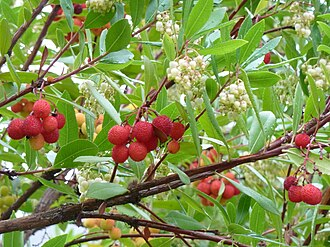
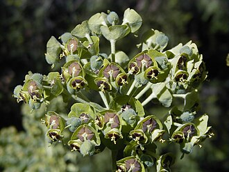
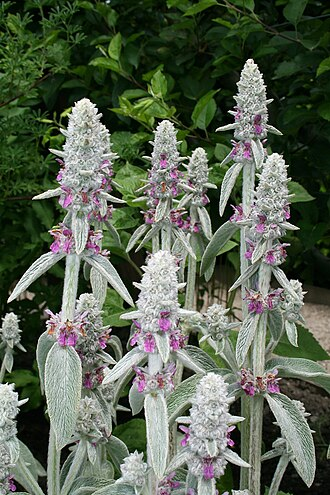
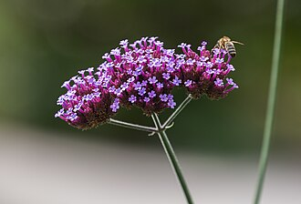
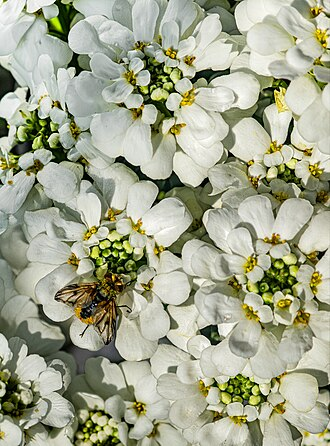
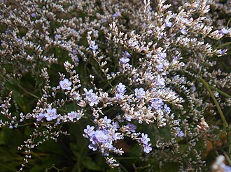
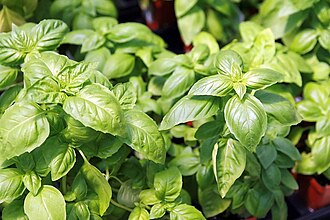
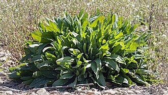
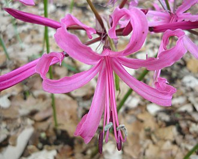

# Roof Terrace — Planting Plan

**Flat 6, 22 Sussex Square, Brighton BN2 5AA** · Issued for nursery review — 30 August 2026

> **What we're asking for.** This is the planting plan for a new roof terrace on a Grade I listed
> building on the Brighton seafront. We would like you to **review it, tell us where we've got it wrong,
> suggest substitutions, confirm supply sizes and availability, and price it.**
>
> The client is not a plantsman and will be **planting this himself**. **Please push back** — if a
> species won't do what we think it will in this exposure, if a supply size is wrong, or if you'd do
> something better, we want to hear it. §15 sets out the questions we'd most value your view on.
>
> Planter positions and dimensions are fixed and are shown on the drawings in §4.

---

## Contents

1. [The site](#1-the-site)
2. [Design intent](#2-design-intent)
3. [View corridors — what must stay open](#3-view-corridors--what-must-stay-open)
4. [Layout drawings](#4-layout-drawings)
5. [Planting plan — planter by planter](#5-planting-plan--planter-by-planter)
6. [Planting plan — the pots](#6-planting-plan--the-pots)
7. [Pots — specification](#7-pots--specification)
8. [The plant list](#8-the-plant-list)
9. [Bulbs and corms](#9-bulbs-and-corms)
10. [Two decisions we'd like your view on](#10-two-decisions-wed-like-your-view-on)
11. [Schedule of quantities](#11-schedule-of-quantities)
12. [Planting and establishment](#12-planting-and-establishment)
13. [Getting the plants onto the roof](#13-getting-the-plants-onto-the-roof)
14. [Maintenance: pruning, clippings and green waste](#14-maintenance-pruning-clippings-and-green-waste)
15. [Where we'd value your expert view](#15-where-wed-value-your-expert-view)
16. [Image credits](#16-image-credits)

---

## 1. The site

A new roof terrace of about 120 m², three storeys up, on the seafront at Kemp Town. Roughly **26.4 m²
of it is planted**, in timber planters built on top of the finished granite paving, plus 21 pots.

| Condition | What it means for the planting |
|---|---|
| **Exposure** | Salt-laden wind off the Channel, unobstructed on all four sides. The prevailing and strongest wind is **south-westerly**; the cold desiccating one is **north-easterly** in spring |
| **Aspect** | **Full sun across almost the whole terrace.** The one exception is the **south end of the narrow terrace** (planter N4 and pot Groups A and B), where the flat rises about 3m immediately to the south — that area gets good light but much less direct sun, especially in winter when the sun is low |
| **Access** | **No vehicle access and no lift.** Everything arrives by rope haul up the scaffold or on a crane lift — see §13 |
| **Soil** | Peat-free lightweight roof-garden mix — loam, perlite/vermiculite and compost over a drainage layer. Deliberately lean and sharply drained |
| **Planter depth** | Mostly **600mm**; the SE L-shape (M2) is **1,000mm**; the lift-over-run bed (N4) is **400mm** |
| **Edges** | Two floor levels and two edge types — **open steel railings** on the narrow terrace, **solid parapet** on the main terrace. Both drive the planting heights; see §2 |
| **Water** | **Automatic drip irrigation on two zones**, installed as part of the works |
| **Winter** | Mild and coastal — rarely below −3°C. **Wind desiccation and salt, not frost, are what kill here** |
| **Heritage** | The terrace sits within the Kemp Town Enclosures. The palette deliberately echoes the Mediterranean / silver-grey / coastal sub-shrub character of Sussex Square's communal gardens, and the scheme forms part of a Listed Building Application with a biodiversity requirement |

---

## 2. Design intent

**Cool palette.** Silver and grey-green foliage; blue, purple and white flowers. Yellow is confined to
*Euphorbia*, *Phlomis* and *Coronilla* and the earliest bulbs.

**Structured but relaxed.** Repeated evergreen domes give the bones and hold the scheme together in
February; loose Mediterranean planting spills between and over them.

**Shelter from all four directions** — a functional requirement, not an amenity one. The terrace is
unusable in a strong wind without it. But see §3: **where shelter and a view corridor conflict, the view wins.**

> **The windbreak principle we've designed to:** a barrier of roughly **50% porosity** shelters the
> ground for **10–15 times its own height** downwind, whereas a solid barrier shelters less and throws a
> turbulent eddy behind it. So the back rows are **dense-but-twiggy evergreens** planted at 0.8–1.0m
> centres to knit into a **filtering** screen. **If you disagree with this reading, please say so.**

**Two layers, not three, in a 600mm planter.** A 1.5m evergreen at the back of a 600mm box will occupy
the full width at maturity and shade out anything in front of it. So the 600mm runs are planned as a back
row plus a front ribbon, with mid-height shrubs substituted into the back row wherever we want to see
over. Only M2, at 1,000mm deep, carries a genuine third layer.

**The part-shaded south end is treated as a second micro-climate.** Rather than fight it, N4 and pot
Groups A and B carry a different palette — winter scent (*Sarcococca*, *Daphne odora*), snowdrops,
cyclamen and hellebore, alongside the culinary herbs that prefer not to bake. It is the area you walk
through every time you step out of the study door, so it is planned for scent and for picking.

### Levels, parapets and railings — the numbers that set every height

The terrace is not one level and not one edge condition, and both facts drive the heights in §5.

| Where | Edge | Height above that area's FFL |
|---|---|---|
| **Narrow terrace — east and west** | **Open steel railings, no parapet.** Wind passes straight through | **1,100mm** |
| **Narrow terrace — north end** | Solid parapet | **1,300mm** |
| **Main terrace — south of the sauna's south wall** (dining deck, raised 300mm) | Solid parapet | **1,000mm** |
| **Main terrace — north of the sauna's south wall** (lounge and hot tub, low level) | Solid parapet | **1,300mm** |

*The parapet is a single continuous height in absolute terms — the 1,000 / 1,300mm difference is the
300mm step up to the dining deck.*

**Three consequences run through the whole scheme.**

**1. Containment.** Parapet top minus planter height is how much of a shrub is held inboard before it
starts leaning out over the drop:

| Planter | Planter height | Edge | Held inboard |
|---|---|---|---|
| N1(E) | 500mm | open railings, 1,100mm | **500mm only** — above its own back panel, growth pushes *through* the bars |
| N1(N) | 500mm | parapet 1,300mm | 800mm |
| M2(E) / M2(S) — raised zone | 700mm | parapet 1,000mm | **300mm** |
| M4 / M7 — low zone | 700 / 600mm | parapet 1,300mm | 600–700mm |

**2. A spread rule, not just a height rule.** Because so little is contained, mature *width* matters as
much as height: **no shrub wider than the planter depth plus about 300mm each side** — roughly 1.2m in
the 600mm runs, 1.6m in the 1,000mm-deep M2. This is why *Escallonia* 'Apple Blossom' (1.5–2m wide) now
appears **only in M2**, and why the 600mm runs carry *Myrtus* and the dwarf *Pittosporum* domes instead.

**3. The narrow terrace has no low-level shelter at all.** Wind whistles straight through the railings
below 1,100mm. On the main terrace a solid parapet gives you a metre of still air before the planting
even begins; on the narrow terrace it does not. So N1(E)'s planting is not *supplementing* a windbreak —
from ground level up, it **is** the windbreak. Growth pushing through the railing bars between 500mm and
1,100mm is expected and welcome: it softens the railings and reads as green from outside.

> **⚠️ Worth checking separately — not a planting matter.** The narrow-terrace railings measure
> **1,100mm above the current FFL**, which is exactly the Approved Document K guarding height. The new
> warm-roof build-up will raise that FFL slightly, and even 30mm takes the railings below 1,100mm.
> Worth re-measuring once the build-up is set and confirming with Ronan and Building Control, since the
> specification currently assumes no guarding top-up is needed.

### The constraint that shaped the shrub palette

**No planter's back face can be reached.** On the main terrace it is against a solid parapet; on the
narrow terrace it is against open railings with a drop beyond. Anything clipped there would fall into the
street or onto a neighbour below. Growth escaping over the parapet would also
foul the bird-deterrent wires and show in the Bristol Gardens view the planning officers flagged.

So the shrub palette is built around **plants that hold their own shape**, not plants that are clipped
into shape. Nothing in the scheme is a hedging plant. As a working rule, a shrub's natural mature width
should be no more than the planter depth plus a modest overhang.

| Maintenance demand | Plants |
|---|---|
| **None — naturally self-limiting domes** | *Myrtus communis* subsp. *tarentina*, *Pittosporum* 'Golf Ball' and 'Tom Thumb', *Hebe* 'Rakaiensis', *Convolvulus cneorum*, *Cistus*, *Coronilla*, *Iberis*, *Euphorbia myrsinites*, *Armeria*, *Dianthus*, *Festuca*, thymes |
| **Light, from the front only** | *Euphorbia wulfenii* (cut spent stems at the base each June), *Phlomis* and *Santolina* (one shear after flowering), lavenders and *Nepeta* (shear, never into old wood), all perennials (cut at the base in February) |
| **Occasional reduction, from the front** | *Escallonia* 'Apple Blossom' and *Abelia* — informal shrubs, reduced every second or third year, never sheared |
| **⚠️ Annual work** | ***Atriplex halimus*** — the one fast, lax plant; **cut hard back every spring**. Confined to the 1,000mm-deep M2 where there is room. And the two ***Pittosporum* 'Silver Sheen'** specimens — supplied **crown-lifted**, then tipped back annually from the front, always cutting *inward* |

**When you do cut near a parapet:** work in still weather, and clip into a bag or over a groundsheet laid
inside the planter. Never lean over the parapet. Anything that has escaped beyond the parapet line gets
cut back to it each spring.

**Year-round interest is an explicit requirement.** The scheme is built to have something happening in
every month:

| Month | What's flowering |
|---|---|
| **Dec–Jan** | *Sarcococca* (scent), *Coronilla* 'Citrina', *Iris unguicularis*, 'Rijnveld's Early Sensation' daffodils, *Cyclamen coum* |
| **Feb–Mar** | Snowdrops, crocus, *Iris reticulata*, *Daphne odora*, rosemary, *Euphorbia wulfenii*, 'Tête-à-tête' |
| **Apr–May** | Tulips, *Muscari*, 'Thalia', alliums, *Gladiolus byzantinus*, *Cistus*, *Teucrium*, *Iberis*, *Armeria*, *Dianthus* |
| **Jun–Jul** | Lavender, *Nepeta*, *Phlomis*, *Eryngium*, *Hebe*, *Escallonia*, *Origanum*, *Allium sphaerocephalon* |
| **Aug–Sep** | *Myrtus*, *Abelia*, *Hylotelephium*, *Aster*, *Salvia yangii*, *Verbena*, *Limonium* |
| **Oct–Nov** | *Arbutus* (flower and fruit together), *Nerine*, *Cyclamen hederifolium*, allium and *Eryngium* seed heads |

---

## 3. View corridors — what must stay open

The Downs are the reason this terrace faces the way it does, and the planting must not eat the view.
Four sightlines govern the heights in §5. **Where a corridor and a windbreak conflict, the corridor wins** —
that is a deliberate client decision.

| # | From | Looking | Rule applied |
|---|---|---|---|
| **1** | **Dining table** (raised deck, FA2) | **North-east, to the Downs** | Nothing above **~1m total height** in M1(N), M4, the north half of M2(E), or pot Groups C and D. The tall planting on this terrace sits *behind* the diner — M1(W) and M2(S) — where it shelters without obstructing |
| **2** | **Sauna** door and window | **East and north-east, to the Downs** | **M4 capped at 1m maximum above finished floor level**, tapering lower at its east end |
| **3** | **Hot tub** | **East, to the Downs** | Kept completely open. The old M5 and M6 planters were removed for exactly this reason, and the four pots east of the tub (Group C) are all low aromatics |
| **4** | *(reverse)* **Neighbours' upper windows**, east / north-east | **Down into the hot tub** | **Blocked at high level only** — two crown-lifted *Arbutus unedo* in the north half of M2(E), canopy clear from ~1.6m above the planter rim. You see *under* them; they intercept the downward diagonal |

> **The trick in corridor 4** is a raised canopy over a low understorey. A clear stem with the foliage
> starting well above head height screens an overlooking window without touching the horizontal view.
> A conventional shrub screen would do the opposite — block the view you want and leave the tub visible
> from above anyway.

**Two consequences worth being explicit about:**

1. **M4 still works as a windbreak.** Its cap is 1m **above the planter rim** — 1.7m above finished floor
   level — so the west end carries real evergreen domes and gives the lounge meaningful shelter from the
   north-east, while the east end drops to mats where the sauna's sightline is tightest.
2. **M2(E) north — the exact shrub cap depends on which side of the sauna line it falls.** The rule is
   *top out level with the parapet coping*: that is ~300mm above the planter rim in the raised zone
   (1,000mm parapet) or ~600mm in the low zone (1,300mm parapet). The understorey is specified at
   **≤500mm above the rim**, which suits the low zone and needs the back row dropping slightly if it
   turns out to be the raised one. **Please confirm.**

---

## 4. Layout drawings

**🚨 Orientation: these drawings are rotated 90° clockwise. RIGHT = NORTH · LEFT = SOUTH · TOP = WEST · BOTTOM = EAST.**

**Whole terrace** — the narrow terrace runs south to north from the flat, opening into the main terrace
at the north end. Planters labelled N1–N4 and M1 / M2 / M4 / M7.

**Main section** — dining deck (raised 300mm), sauna and wet room, hot tub, and the lounge.

---

## 5. Planting plan — planter by planter

Quantities are what we'd like to order. They may be adjusted by ±10% on site against the actual run
lengths — please price the totals in §11.

### N1(E) — Narrow terrace — **east** side

*7.2m long × 600mm deep · 500mm high · **open steel railings, 1,100mm above FFL — no parapet***

> The principal screen against being overlooked from the east, and — because the east side has **open railings, not a parapet** — the *only* wind defence the narrow terrace has from that direction. Wind passes straight through the railings at low level, so this planting is the windbreak. Every shrub is a naturally self-limiting dome of no more than ~1.2m spread: nothing that needs clipping, and nothing that will cantilever far past the railing line.

**Back row — windbreak, 0.8–1.0m centres**

| Qty | Plant | Supply size |
|---|---|---|
| **1** | *Pittosporum tenuifolium* 'Silver Sheen' — Kohuhu |  20–30L · 1.75–2.0m · **crown-lifted** |
| **2** | *Myrtus communis* subsp. *tarentina* — Compact myrtle |  5L |
| **2** | *Pittosporum tenuifolium* 'Tom Thumb' — Purple dwarf kohuhu |  5L |
| **1** | *Pittosporum tenuifolium* 'Golf Ball' — Dwarf kohuhu |  5L |
| **1** | *Euphorbia characias* subsp. *wulfenii* — Mediterranean spurge |  3–5L |
| **1** | *Brachyglottis* 'Sunshine' — Dunedin daisy bush |  3L |

**Front ribbon**

| Qty | Plant | Supply size |
|---|---|---|
| **3** | *Stachys byzantina* 'Big Ears' — Lamb's ears |  1L |
| **2** | *Erigeron karvinskianus* — Mexican fleabane |  1L |
| **2** | *Lavandula angustifolia* 'Hidcote' — English lavender |  2L |
| **2** | *Salvia rosmarinus* 'Severn Sea' — Semi-prostrate rosemary |  2L |
| **1** | *Nepeta* × *faassenii* 'Walker's Low' — Catmint |  1–2L |
| **1** | *Hebe* (*Veronica*) 'Rakaiensis' — Shrubby veronica |  2L |
| **1** | *Salvia nemorosa* 'Caradonna' — Balkan clary |  1–2L |
| **1** | *Salvia microphylla* 'Amethyst Lips' — Shrubby sage |  2L |
| **1** | *Armeria maritima* — Sea thrift |  9cm–1L |
| **1** | *Festuca glauca* 'Elijah Blue' — Blue fescue |  1L |
| **1** | *Dianthus gratianopolitanus* — Cheddar pink |  1L |
| **1** | *Verbena bonariensis* 'Lollipop' — Purpletop vervain |  1–2L |
| **1** | *Crithmum maritimum* — Rock samphire |  1L |

**Bulbs — planted Oct–Nov, threaded between the plants**

| Qty | Bulb | Flowers |
|---|---|---|
| **25** | *Allium hollandicum* 'Purple Sensation' — Ornamental onion | **May**, purple drumsticks |
| **25** | *Allium sphaerocephalon* — Drumstick allium | **Jul**, wine-purple |
| **25** | *Narcissus* 'Tête-à-tête' — Dwarf daffodil | Feb–Mar, 15cm |
| **15** | *Narcissus* 'Thalia' — Daffodil | Apr, **pure white**, 35cm |
| **10** | *Narcissus* 'Rijnveld's Early Sensation' — Daffodil | **January** |
| **15** | *Tulipa clusiana* 'Lady Jane' — Lady tulip | Apr, white / rose |
| **15** | *Tulipa saxatilis* (Bakeri Gp) 'Lilac Wonder' — Cretan tulip | Apr, lilac-pink, yellow eye |
| **40** | *Crocus tommasinianus* — Early crocus | **Feb**, lilac |
| **25** | *Iris reticulata* 'Harmony' + 'Katharine Hodgkin' — Dwarf iris | **Feb**, deep and pale blue |
| **25** | *Muscari armeniacum* 'Valerie Finnis' — Grape hyacinth | Apr, pale powder blue |
| **15** | *Gladiolus communis* subsp. *byzantinus* — Byzantine gladiolus | **May–Jun**, magenta |
| **5** | *Nectaroscordum siculum* — Sicilian honey garlic | Jun, cream / green / maroon bells |

*N1(E) total: **26 plants** + **240 bulbs***

### N1(N) — Narrow terrace — **north** leg of the L

*1.8m long × 800mm deep · 500mm high · solid parapet 1,300mm above FFL*

> The deepest planter on the narrow terrace, so it takes a full specimen — and the solid 1,300mm parapet here gives 800mm of containment above the planter rim, more than anywhere else on the narrow terrace. Marks the head of the L where the steps rise to the main terrace.

**Back row**

| Qty | Plant | Supply size |
|---|---|---|
| **1** | *Olea europaea* — multi-stem, gnarled — Olive |  45–60L · 1.75–2.0m |
| **1** | *Myrtus communis* subsp. *tarentina* — Compact myrtle |  5L |

**Front ribbon**

| Qty | Plant | Supply size |
|---|---|---|
| **1** | *Stachys byzantina* 'Big Ears' — Lamb's ears |  1L |
| **1** | *Erigeron karvinskianus* — Mexican fleabane |  1L |
| **1** | *Armeria maritima* — Sea thrift |  9cm–1L |
| **1** | *Festuca glauca* 'Elijah Blue' — Blue fescue |  1L |

**Bulbs — planted Oct–Nov, threaded between the plants**

| Qty | Bulb | Flowers |
|---|---|---|
| **10** | *Allium hollandicum* 'Purple Sensation' — Ornamental onion | **May**, purple drumsticks |
| **20** | *Crocus tommasinianus* — Early crocus | **Feb**, lilac |
| **10** | *Narcissus* 'Tête-à-tête' — Dwarf daffodil | Feb–Mar, 15cm |
| **10** | *Muscari armeniacum* 'Valerie Finnis' — Grape hyacinth | Apr, pale powder blue |
| **10** | *Tulipa saxatilis* (Bakeri Gp) 'Lilac Wonder' — Cretan tulip | Apr, lilac-pink, yellow eye |

*N1(N) total: **6 plants** + **60 bulbs***

### N2 — Narrow terrace — mid-east square

*1.2 × 1.2m · 500mm high · built integral with N1*

> A punctuation point in the east run — one piece of architecture with lavender around its feet.

**Whole square**

| Qty | Plant | Supply size |
|---|---|---|
| **1** | *Phormium tenax* 'Purpureum' — Bronze New Zealand flax |  10L |
| **4** | *Lavandula angustifolia* 'Hidcote' — English lavender |  2L |
| **3** | *Festuca glauca* 'Elijah Blue' — Blue fescue |  1L |

**Bulbs — planted Oct–Nov, threaded between the plants**

| Qty | Bulb | Flowers |
|---|---|---|
| **5** | *Allium cristophii* — Star of Persia | May–Jun |
| **20** | *Crocus chrysanthus* 'Blue Pearl' — Crocus | Feb, pale blue |
| **15** | *Iris reticulata* 'Harmony' + 'Katharine Hodgkin' — Dwarf iris | **Feb**, deep and pale blue |
| **10** | *Tulipa* 'Little Beauty' — Species tulip | Apr, 15cm, magenta with a blue eye |
| **10** | *Narcissus* 'W.P. Milner' — Dwarf daffodil | Mar, soft cream, 20cm |

*N2 total: **8 plants** + **60 bulbs***

### N3 — Narrow terrace — mid-west square, beside the outdoor kitchen

*1.2 × 1.2m · 500mm high*

> **The cook's square** — everything in it is culinary, and it is one step from the outdoor kitchen worktop.

**Whole square**

| Qty | Plant | Supply size |
|---|---|---|
| **2** | *Salvia rosmarinus* 'Miss Jessopp's Upright' — Upright rosemary |  2L |
| **4** | *Thymus vulgaris* · *T.* 'Silver Posie' · *T. serpyllum* — Thyme — 3 forms |  9cm |
| **2** | *Origanum* 'Herrenhausen' — Ornamental marjoram |  1L |
| **2** | *Salvia officinalis* 'Purpurascens' — Purple sage — culinary |  2L |

**Bulbs — planted Oct–Nov, threaded between the plants**

| Qty | Bulb | Flowers |
|---|---|---|
| **20** | *Crocus* 'Snow Bunting' — Crocus | Feb, **white**, scented |
| **15** | *Iris reticulata* 'Harmony' + 'Katharine Hodgkin' — Dwarf iris | **Feb**, deep and pale blue |
| **10** | *Tulipa* 'Little Beauty' — Species tulip | Apr, 15cm, magenta with a blue eye |
| **15** | *Allium sphaerocephalon* — Drumstick allium | **Jul**, wine-purple |

*N3 total: **10 plants** + **60 bulbs***

### N4 — Lift over-run — **the aromatic picking bed**

*2.1 × 2.1m · **400mm deep box** · planting kept under 700mm*

> You brush past this every time you go out of the study door, so it is built for scent and for picking. **Part-shaded** — the flat rises ~3m immediately to its south — so it is zoned: sun-loving Mediterranean herbs on the north and east sides, and the shade-tolerant plants along the south edge in the lee of the wall.

**South edge — in the lee of the flat wall (part shade)**

| Qty | Plant | Supply size |
|---|---|---|
| **1** | *Sarcococca hookeriana* var. *humilis* — Sweet box / Christmas box |  3L |
| **1** | *Helleborus argutifolius* — Corsican hellebore |  2L |
| **2** | *Allium schoenoprasum* — Chives |  1L |
| **2** | *Origanum vulgare* — Wild marjoram / oregano — culinary |  1L |
| **1** | *Rumex acetosa* — Common sorrel |  1L |

**North + east edges and body — most direct sun**

| Qty | Plant | Supply size |
|---|---|---|
| **5** | *Salvia rosmarinus* 'Prostratus' — Trailing rosemary |  2L |
| **2** | *Salvia rosmarinus* 'Miss Jessopp's Upright' — Upright rosemary |  2L |
| **3** | *Lavandula angustifolia* 'Hidcote' — English lavender |  2L |
| **2** | *Santolina chamaecyparissus* — Cotton lavender |  2L |
| **2** | *Salvia microphylla* 'Amethyst Lips' — Shrubby sage |  2L |
| **6** | *Thymus vulgaris* · *T.* 'Silver Posie' · *T. serpyllum* — Thyme — 3 forms |  9cm |
| **2** | *Origanum* 'Herrenhausen' — Ornamental marjoram |  1L |
| **2** | *Salvia officinalis* — Common sage — culinary |  2L |
| **2** | *Satureja montana* — Winter savory |  1L |
| **2** | *Artemisia dracunculus* — **French** tarragon |  1L |

**Bulbs — planted Oct–Nov, threaded between the plants**

| Qty | Bulb | Flowers |
|---|---|---|
| **40** | *Crocus tommasinianus* — Early crocus | **Feb**, lilac |
| **20** | *Crocus chrysanthus* 'Blue Pearl' — Crocus | Feb, pale blue |
| **20** | *Crocus* 'Snow Bunting' — Crocus | Feb, **white**, scented |
| **30** | *Iris reticulata* 'Harmony' + 'Katharine Hodgkin' — Dwarf iris | **Feb**, deep and pale blue |
| **15** | *Tulipa clusiana* 'Lady Jane' — Lady tulip | Apr, white / rose |
| **15** | *Tulipa saxatilis* (Bakeri Gp) 'Lilac Wonder' — Cretan tulip | Apr, lilac-pink, yellow eye |
| **10** | *Tulipa* 'Little Beauty' — Species tulip | Apr, 15cm, magenta with a blue eye |
| **30** | *Allium sphaerocephalon* — Drumstick allium | **Jul**, wine-purple |
| **25** | *Narcissus* 'Tête-à-tête' — Dwarf daffodil | Feb–Mar, 15cm |
| **25** | *Muscari armeniacum* 'Valerie Finnis' — Grape hyacinth | Apr, pale powder blue |
| **40** | *Galanthus nivalis* — Snowdrop — **buy in the green** | **Jan–Feb**, white |
| **15** | *Cyclamen coum* — Eastern cyclamen | **Jan–Mar**, pink / white |
| **10** | *Cyclamen hederifolium* — Ivy-leaved cyclamen | **Sept–Nov**, pink / white |

*N4 total: **35 plants** + **295 bulbs***

### M1(W) — Main terrace — **west** edge of the raised dining deck (FA2)

*≈4.5m long × 600mm deep · 500mm high, on the +300mm raised deck*

> The south-westerly gale flank and the neighbour side — the hardest-working windbreak on the main terrace, and what you look at from the dining table. It sits **behind** you when you look north-east, so height here does not compete with the Downs view.

**Back row**

| Qty | Plant | Supply size |
|---|---|---|
| **1** | *Pittosporum tenuifolium* 'Silver Sheen' — Kohuhu |  20–30L · 1.75–2.0m · **crown-lifted** |
| **1** | *Myrtus communis* subsp. *tarentina* — Compact myrtle |  5L |
| **1** | *Pittosporum tenuifolium* 'Tom Thumb' — Purple dwarf kohuhu |  5L |
| **1** | *Euphorbia characias* subsp. *wulfenii* — Mediterranean spurge |  3–5L |
| **1** | *Brachyglottis* 'Sunshine' — Dunedin daisy bush |  3L |

**Front ribbon**

| Qty | Plant | Supply size |
|---|---|---|
| **1** | *Lavandula angustifolia* 'Hidcote' — English lavender |  2L |
| **1** | *Lavandula angustifolia* 'Munstead' — English lavender |  2L |
| **2** | *Nepeta* × *faassenii* 'Walker's Low' — Catmint |  1–2L |
| **1** | *Salvia nemorosa* 'Caradonna' — Balkan clary |  1–2L |
| **2** | *Stachys byzantina* 'Big Ears' — Lamb's ears |  1L |
| **1** | *Erigeron karvinskianus* — Mexican fleabane |  1L |
| **1** | *Hebe* (*Veronica*) 'Rakaiensis' — Shrubby veronica |  2L |
| **1** | *Hylotelephium* 'Matrona' — Stonecrop / iceplant |  2L |
| **1** | *Convolvulus cneorum* — Silverbush |  2L |

**Bulbs — planted Oct–Nov, threaded between the plants**

| Qty | Bulb | Flowers |
|---|---|---|
| **20** | *Allium hollandicum* 'Purple Sensation' — Ornamental onion | **May**, purple drumsticks |
| **10** | *Allium cristophii* — Star of Persia | May–Jun |
| **20** | *Narcissus* 'Thalia' — Daffodil | Apr, **pure white**, 35cm |
| **15** | *Narcissus poeticus* var. *recurvus* — Pheasant's eye | **May**, white with a red-rimmed eye |
| **15** | *Tulipa clusiana* 'Lady Jane' — Lady tulip | Apr, white / rose |
| **30** | *Crocus tommasinianus* — Early crocus | **Feb**, lilac |
| **20** | *Muscari armeniacum* 'Valerie Finnis' — Grape hyacinth | Apr, pale powder blue |
| **8** | *Nectaroscordum siculum* — Sicilian honey garlic | Jun, cream / green / maroon bells |

*M1(W) total: **16 plants** + **138 bulbs***

### M1(N) — Main terrace — **north** edge of the raised dining deck

*≈1.1m long × 600mm deep · 500mm high*

> Deliberately kept low — this sits beside the three steps down to the lounge, and it is directly in the north-east view corridor from the dining table. **Nothing here above ~1m total.**

**Back**

| Qty | Plant | Supply size |
|---|---|---|
| **1** | *Pittosporum tenuifolium* 'Golf Ball' — Dwarf kohuhu |  5L |

**Front**

| Qty | Plant | Supply size |
|---|---|---|
| **1** | *Erigeron karvinskianus* — Mexican fleabane |  1L |
| **1** | *Stachys byzantina* 'Big Ears' — Lamb's ears |  1L |
| **1** | *Nepeta* × *faassenii* 'Walker's Low' — Catmint |  1–2L |

**Bulbs — planted Oct–Nov, threaded between the plants**

| Qty | Bulb | Flowers |
|---|---|---|
| **15** | *Crocus tommasinianus* — Early crocus | **Feb**, lilac |
| **10** | *Narcissus* 'Tête-à-tête' — Dwarf daffodil | Feb–Mar, 15cm |
| **10** | *Muscari armeniacum* 'Valerie Finnis' — Grape hyacinth | Apr, pale powder blue |

*M1(N) total: **4 plants** + **35 bulbs***

### M2(E) — north half — Main terrace, east parapet — **north half (≈2.5m)**

*1,000mm deep · 700mm high planter · parapet 1,000–1,300mm above FFL — confirm which side of the sauna line this falls*

> **The one place in the scheme that screens at high level and stays open at low level.** A pair of crown-lifted strawberry trees blocks the diagonal sightline from the neighbours' upper windows down into the hot tub, while everything beneath them is kept at or below parapet height so the view east and north-east to the Downs is untouched.

**Canopy — crown-lifted, clear stem to ~1.6m above the planter rim**

| Qty | Plant | Supply size |
|---|---|---|
| **2** | *Arbutus unedo* — multi-stem, **crown-lifted** — Strawberry tree |  25–35L · 1.5–1.75m |

**Low layer — nothing above parapet top (≤500mm above the rim)**

| Qty | Plant | Supply size |
|---|---|---|
| **2** | *Hebe* (*Veronica*) 'Rakaiensis' — Shrubby veronica |  2L |
| **1** | *Santolina chamaecyparissus* — Cotton lavender |  2L |
| **1** | *Convolvulus cneorum* — Silverbush |  2L |
| **1** | *Lavandula angustifolia* 'Hidcote' — English lavender |  2L |
| **2** | *Armeria maritima* — Sea thrift |  9cm–1L |
| **1** | *Festuca glauca* 'Elijah Blue' — Blue fescue |  1L |
| **1** | *Dianthus gratianopolitanus* — Cheddar pink |  1L |
| **1** | *Iberis sempervirens* — Perennial candytuft |  1L |
| **1** | *Euphorbia myrsinites* — Myrtle spurge |  1L |

**Bulbs — planted Oct–Nov, threaded between the plants**

| Qty | Bulb | Flowers |
|---|---|---|
| **20** | *Crocus tommasinianus* — Early crocus | **Feb**, lilac |
| **15** | *Iris reticulata* 'Harmony' + 'Katharine Hodgkin' — Dwarf iris | **Feb**, deep and pale blue |
| **10** | *Muscari armeniacum* 'Valerie Finnis' — Grape hyacinth | Apr, pale powder blue |
| **15** | *Narcissus* 'Tête-à-tête' — Dwarf daffodil | Feb–Mar, 15cm |
| **10** | *Tulipa* 'Little Beauty' — Species tulip | Apr, 15cm, magenta with a blue eye |

*M2(E) — north half total: **13 plants** + **70 bulbs***

### M2(E) — south half — Main terrace, east parapet — **south half (≈2.6m)**

*1,000mm deep · 700mm high planter*

> All the taller shrub mass on this run is concentrated here, away from the view corridor — a 1.5–2m informal evergreen block giving east wind shelter to the lounge and the dining deck.

**Back row**

| Qty | Plant | Supply size |
|---|---|---|
| **2** | *Escallonia* 'Apple Blossom' — Escallonia |  7.5L |
| **1** | *Atriplex halimus* — Tree purslane |  3L |

**Mid row**

| Qty | Plant | Supply size |
|---|---|---|
| **1** | *Myrtus communis* subsp. *tarentina* — Compact myrtle |  5L |
| **1** | *Euphorbia characias* subsp. *wulfenii* — Mediterranean spurge |  3–5L |
| **1** | *Cistus* × *purpureus* 'Alan Fradd' — Rock rose |  3L |
| **1** | *Teucrium fruticans* 'Azureum' — Tree germander |  3L |
| **1** | *Coronilla valentina* subsp. *glauca* 'Citrina' — Yellow coronilla |  3L |
| **1** | *Abelia* × *grandiflora* — Glossy abelia |  5L |

**Front ribbon**

| Qty | Plant | Supply size |
|---|---|---|
| **2** | *Stachys byzantina* 'Big Ears' — Lamb's ears |  1L |
| **1** | *Erigeron karvinskianus* — Mexican fleabane |  1L |
| **1** | *Lavandula angustifolia* 'Hidcote' — English lavender |  2L |
| **1** | *Salvia microphylla* 'Amethyst Lips' — Shrubby sage |  2L |
| **1** | *Eryngium bourgatii* 'Picos Blue' — Sea holly |  1–2L |
| **1** | *Hylotelephium* 'Matrona' — Stonecrop / iceplant |  2L |
| **1** | *Aster* × *frikartii* 'Mönch' — Michaelmas daisy |  2L |
| **1** | *Limonium platyphyllum* — Sea lavender |  1–2L |
| **3** | *Iris unguicularis* — Algerian iris |  1–2L |

**Bulbs — planted Oct–Nov, threaded between the plants**

| Qty | Bulb | Flowers |
|---|---|---|
| **25** | *Allium hollandicum* 'Purple Sensation' — Ornamental onion | **May**, purple drumsticks |
| **10** | *Allium cristophii* — Star of Persia | May–Jun |
| **30** | *Allium sphaerocephalon* — Drumstick allium | **Jul**, wine-purple |
| **20** | *Narcissus poeticus* var. *recurvus* — Pheasant's eye | **May**, white with a red-rimmed eye |
| **15** | *Narcissus* 'Thalia' — Daffodil | Apr, **pure white**, 35cm |
| **15** | *Narcissus* 'Rijnveld's Early Sensation' — Daffodil | **January** |
| **20** | *Tulipa saxatilis* (Bakeri Gp) 'Lilac Wonder' — Cretan tulip | Apr, lilac-pink, yellow eye |
| **20** | *Gladiolus communis* subsp. *byzantinus* — Byzantine gladiolus | **May–Jun**, magenta |
| **20** | *Crocus tommasinianus* — Early crocus | **Feb**, lilac |
| **8** | *Nerine bowdenii* — Guernsey lily | **October**, pink |

*M2(E) — south half total: **21 plants** + **183 bulbs***

### M2(S) — Main terrace — **south** return of the SE L

*3.5m external / 2.5m internal × **1,000mm deep** · 700mm high*

> The heritage focal point, seen head-on from the dining table and the lounge, and outside every protected view corridor — so this is where the scheme is allowed real height. The 1m depth also gives the setback that removes the need for fall-protection glass along this edge.

**Back row**

| Qty | Plant | Supply size |
|---|---|---|
| **1** | *Olea europaea* — multi-stem, gnarled — Olive |  45–60L · 1.75–2.0m |
| **1** | *Atriplex halimus* — Tree purslane |  3L |
| **1** | *Euphorbia characias* subsp. *wulfenii* — Mediterranean spurge |  3–5L |

**Mid row**

| Qty | Plant | Supply size |
|---|---|---|
| **1** | *Cistus* × *purpureus* 'Alan Fradd' — Rock rose |  3L |
| **1** | *Teucrium fruticans* 'Azureum' — Tree germander |  3L |
| **1** | *Coronilla valentina* subsp. *glauca* 'Citrina' — Yellow coronilla |  3L |
| **1** | *Brachyglottis* 'Sunshine' — Dunedin daisy bush |  3L |

**Front ribbon**

| Qty | Plant | Supply size |
|---|---|---|
| **1** | *Stachys byzantina* 'Big Ears' — Lamb's ears |  1L |
| **1** | *Erigeron karvinskianus* — Mexican fleabane |  1L |
| **1** | *Salvia nemorosa* 'Caradonna' — Balkan clary |  1–2L |
| **1** | *Salvia yangii* 'Little Spire' — Russian sage |  2L |
| **1** | *Verbena bonariensis* 'Lollipop' — Purpletop vervain |  1–2L |
| **1** | *Eryngium bourgatii* 'Picos Blue' — Sea holly |  1–2L |
| **1** | *Erysimum* 'Bowles's Mauve' — Perennial wallflower |  2L |
| **1** | *Crithmum maritimum* — Rock samphire |  1L |
| **2** | *Iris unguicularis* — Algerian iris |  1–2L |

**Bulbs — planted Oct–Nov, threaded between the plants**

| Qty | Bulb | Flowers |
|---|---|---|
| **20** | *Allium hollandicum* 'Purple Sensation' — Ornamental onion | **May**, purple drumsticks |
| **5** | *Allium cristophii* — Star of Persia | May–Jun |
| **20** | *Allium sphaerocephalon* — Drumstick allium | **Jul**, wine-purple |
| **15** | *Narcissus poeticus* var. *recurvus* — Pheasant's eye | **May**, white with a red-rimmed eye |
| **15** | *Narcissus* 'Rijnveld's Early Sensation' — Daffodil | **January** |
| **15** | *Tulipa clusiana* 'Lady Jane' — Lady tulip | Apr, white / rose |
| **15** | *Gladiolus communis* subsp. *byzantinus* — Byzantine gladiolus | **May–Jun**, magenta |
| **25** | *Crocus tommasinianus* — Early crocus | **Feb**, lilac |
| **15** | *Iris reticulata* 'Harmony' + 'Katharine Hodgkin' — Dwarf iris | **Feb**, deep and pale blue |
| **7** | *Nerine bowdenii* — Guernsey lily | **October**, pink |
| **7** | *Nectaroscordum siculum* — Sicilian honey garlic | Jun, cream / green / maroon bells |

*M2(S) total: **17 plants** + **159 bulbs***

### M4 — Main terrace — **north** of the lounge seating

*2.70m long × 600mm deep · 700mm high planter · parapet here is 1,300mm above FFL*

> **Height cap: 1m above the planter rim — 1.7m above finished floor level — and lower at the east end.** M4 sits in the view of the Downs from the sauna, so it is graded: domes to the full 1m at the west end, dropping to mats at the east end where the sightline is tightest. At 1.7m it still does useful work as a north / north-east windbreak for the lounge. Nothing in it is ever pruned.

**West end — domes to ~1m above the rim**

| Qty | Plant | Supply size |
|---|---|---|
| **1** | *Pittosporum tenuifolium* 'Tom Thumb' — Purple dwarf kohuhu |  5L |
| **2** | *Hebe* (*Veronica*) 'Rakaiensis' — Shrubby veronica |  2L |
| **1** | *Santolina chamaecyparissus* — Cotton lavender |  2L |

**East end — tapering to mats, ~150–300mm**

| Qty | Plant | Supply size |
|---|---|---|
| **2** | *Salvia rosmarinus* 'Prostratus' — Trailing rosemary |  2L |
| **2** | *Armeria maritima* — Sea thrift |  9cm–1L |
| **2** | *Dianthus gratianopolitanus* — Cheddar pink |  1L |
| **2** | *Euphorbia myrsinites* — Myrtle spurge |  1L |

**Bulbs — planted Oct–Nov, threaded between the plants**

| Qty | Bulb | Flowers |
|---|---|---|
| **30** | *Crocus tommasinianus* — Early crocus | **Feb**, lilac |
| **20** | *Muscari armeniacum* 'Valerie Finnis' — Grape hyacinth | Apr, pale powder blue |
| **20** | *Iris reticulata* 'Harmony' + 'Katharine Hodgkin' — Dwarf iris | **Feb**, deep and pale blue |
| **20** | *Narcissus* 'Tête-à-tête' — Dwarf daffodil | Feb–Mar, 15cm |
| **15** | *Tulipa* 'Little Beauty' — Species tulip | Apr, 15cm, magenta with a blue eye |

*M4 total: **12 plants** + **105 bulbs***

### M7 — Main terrace — **west** of the hot tub, between tub and building

*2.0m long × 600mm deep · finishes 150mm above the tub rim*

> Wind defence on the building side of the tub, and everything in it is aromatic — you brush past getting in and out.

**Back row**

| Qty | Plant | Supply size |
|---|---|---|
| **1** | *Olea europaea* — Olive |  15–25L · 1.2–1.5m |
| **1** | *Phlomis fruticosa* — Jerusalem sage |  3L |

**Front ribbon**

| Qty | Plant | Supply size |
|---|---|---|
| **1** | *Stachys byzantina* 'Big Ears' — Lamb's ears |  1L |
| **1** | *Lavandula angustifolia* 'Hidcote' — English lavender |  2L |
| **1** | *Salvia rosmarinus* 'Severn Sea' — Semi-prostrate rosemary |  2L |
| **1** | *Convolvulus cneorum* — Silverbush |  2L |
| **1** | *Erigeron karvinskianus* — Mexican fleabane |  1L |

**Bulbs — planted Oct–Nov, threaded between the plants**

| Qty | Bulb | Flowers |
|---|---|---|
| **10** | *Narcissus* 'Thalia' — Daffodil | Apr, **pure white**, 35cm |
| **20** | *Crocus chrysanthus* 'Blue Pearl' — Crocus | Feb, pale blue |
| **10** | *Muscari armeniacum* 'Valerie Finnis' — Grape hyacinth | Apr, pale powder blue |
| **10** | *Tulipa* 'Little Beauty' — Species tulip | Apr, 15cm, magenta with a blue eye |

*M7 total: **7 plants** + **50 bulbs***

---

## 6. Planting plan — the pots

### Group A — narrow terrace, south end

**5 pots.** The part-shaded corner by the study door, so this is where the winter-scent plants live. Two large pots, three medium.

| Qty | Plant | Supply size |
|---|---|---|
| **1** | *Olea europaea* — multi-stem, gnarled — Olive | 45–60L · 1.75–2.0m |
| **1** | *Phormium tenax* 'Purpureum' — Bronze New Zealand flax | 10L |
| **1** | *Sarcococca hookeriana* var. *humilis* — Sweet box / Christmas box | 3L |
| **1** | *Daphne odora* 'Aureomarginata' — Winter daphne | 3–5L |
| **1** | *Convolvulus cneorum* — Silverbush | 2L |
| **1** | *Lavandula angustifolia* 'Munstead' — English lavender | 2L |

| Qty | Bulb | Flowers |
|---|---|---|
| **60** | *Galanthus nivalis* — Snowdrop — **buy in the green** | **Jan–Feb**, white |
| **15** | *Cyclamen coum* — Eastern cyclamen | **Jan–Mar**, pink / white |
| **10** | *Cyclamen hederifolium* — Ivy-leaved cyclamen | **Sept–Nov**, pink / white |
| **10** | *Narcissus* 'Tête-à-tête' — Dwarf daffodil | Feb–Mar, 15cm |
| **10** | *Tulipa clusiana* 'Lady Jane' — Lady tulip | Apr, white / rose |
| **10** | *Crocus* 'Snow Bunting' — Crocus | Feb, **white**, scented |

### Group B — narrow terrace, alongside the outdoor kitchen

**6 pots**, kept toward the southern (shadier) end of the kitchen run, which suits every plant in the group. These are the herbs that must not go into a shared bed.

| Qty | Plant | Supply size |
|---|---|---|
| **3** | *Mentha spicata* · *M.* 'Moroccan' · *M. suaveolens* — Mint — 3 kinds, **each in its own pot** | 2L |
| **1** | *Laurus nobilis* — clipped — Bay | ~80cm, large pot |
| **3** | *Petroselinum crispum* — Flat-leaf parsley | 1L |
| **3** | *Ocimum basilicum* — Basil | 9cm |

### Group C — main terrace, **east of the hot tub**

**4 pots, deliberately low** so the east view to the Downs from the tub stays completely open. All aromatic — you brush past them getting in and out. Movable, so they can be lifted clear for the Phase-2 crane lift.

| Qty | Plant | Supply size |
|---|---|---|
| **1** | *Lavandula angustifolia* 'Hidcote' — English lavender | 2L |
| **1** | *Salvia rosmarinus* 'Prostratus' — Trailing rosemary | 2L |
| **1** | *Santolina chamaecyparissus* — Cotton lavender | 2L |
| **2** | *Thymus vulgaris* · *T.* 'Silver Posie' · *T. serpyllum* — Thyme — 3 forms | 9cm |
| **1** | *Dianthus gratianopolitanus* — Cheddar pink | 1L |

| Qty | Bulb | Flowers |
|---|---|---|
| **20** | *Crocus chrysanthus* 'Blue Pearl' — Crocus | Feb, pale blue |
| **15** | *Iris reticulata* 'Harmony' + 'Katharine Hodgkin' — Dwarf iris | **Feb**, deep and pale blue |
| **10** | *Tulipa* 'Little Beauty' — Species tulip | Apr, 15cm, magenta with a blue eye |

### Group D — main terrace, **south and west of the lounge sofas**

**6 pots** framing the lounge. Kept low-to-medium because this group sits between the dining deck and the lounge, near the north-east view corridor. **Set these out and check the sightline from the dining table before settling them** — that is exactly what movable pots are for.

| Qty | Plant | Supply size |
|---|---|---|
| **2** | *Pittosporum tenuifolium* 'Tom Thumb' — Purple dwarf kohuhu | 5L |
| **2** | *Hebe* (*Veronica*) 'Rakaiensis' — Shrubby veronica | 2L |
| **1** | *Convolvulus cneorum* — Silverbush | 2L |
| **1** | *Salvia microphylla* 'Amethyst Lips' — Shrubby sage | 2L |
| **1** | *Erigeron karvinskianus* — Mexican fleabane | 1L |

| Qty | Bulb | Flowers |
|---|---|---|
| **30** | *Crocus tommasinianus* — Early crocus | **Feb**, lilac |
| **20** | *Muscari armeniacum* 'Valerie Finnis' — Grape hyacinth | Apr, pale powder blue |
| **15** | *Narcissus* 'Tête-à-tête' — Dwarf daffodil | Feb–Mar, 15cm |
| **20** | *Allium sphaerocephalon* — Drumstick allium | **Jul**, wine-purple |

---

## 7. Pots — specification

**21 pots in four groups.** They are bought as part of this order.

The design intention is simple: **one material, one colour, three sizes, repeated.** Twenty-one
mismatched pots read as a garden centre; twenty-one identical ones read as deliberate — and repetition is
free, which is what makes it the right move on a budget.

| Size | Qty | Holds |
|---|---|---|
| **Large — Ø50–60cm** | 3 | The pot olive, the *Phormium*, the bay |
| **Medium — Ø40cm** | 8 | *Sarcococca*, *Daphne*, the two 'Tom Thumb' domes, the two *Hebe*, lavender, rosemary |
| **Small — Ø30–35cm** | 10 | Mint ×3, parsley, basil, santolina, thyme, *Convolvulus*, *Salvia*, *Dianthus* |

**Material — matt fibreclay (fibrestone) in a single dark grey / anthracite.** It is light, which matters
three storeys up; frost-proof; and the matt charcoal picks up the anthracite standing-seam cladding on
the sauna without fighting the buff granite paving or the silver-grey salvaged-timber planters.

*Alternative if the budget is tight:* matt recycled-polyethylene planters (Elho and similar) in the same
charcoal, at roughly half the price. Lighter still, but they read as plastic close up and need more
ballast.

**Deliberately not used:**

| Ruled out | Why |
|---|---|
| **Powder-coated metal** | This project has already had a confirmed C5 powder-coat failure on outdoor furniture at this location. Not worth repeating |
| **Corten steel** | Handsome, but it rust-streaks pale stone and the paving here is a buff granite |
| **Glazed colour** | Fights a palette that is deliberately silver, blue, purple and white |
| **Terracotta** | Would look lovely, but it needs to be genuinely frost-proof, it is heavy, and it dries out fast in this wind. Possible if you prefer it — flag it and we will re-check the sizes |

**Every pot also needs:**

- **Ballast — 50–75mm of gravel in the base.** A tall plant in a light pot goes over in the first gale.
  The olive, the *Phormium* and the bay must be in the largest, widest-based pots for this reason.
- **Pot feet**, so they drain freely and do not stain or pond on the granite.
- **A dripper** — all 21 are on the irrigation (§12), because pots dry out far faster than the planters.

---

## 8. The plant list

Images link through to the RHS entry for each plant.

### Layer 1 — Specimen trees

| | Plant | Total | Supply size | Season & interest | Goes in |
|---|---|---|---|---|---|
|  [RHS →](https://www.rhs.org.uk/plants/search-results?query=Olea%20europaea) | ***Olea europaea* — multi-stem, gnarled** Olive | **3** | 45–60L · 1.75–2.0m | Evergreen silver-grey. Slow, long-lived, and airy enough to screen without walling off a view | N1(N), M2(S), Group A |
|  [RHS →](https://www.rhs.org.uk/plants/search-results?query=Pittosporum%20tenuifolium%20%27Silver%20Sheen%27) | ***Pittosporum tenuifolium* 'Silver Sheen'** Kohuhu | **2** | 20–30L · 1.75–2.0m · **crown-lifted** | Evergreen; fine silver-green leaves on black twigs. Fast, dense, and it **filters** wind rather than blocking it. Supply **crown-lifted** so the mass sits above parapet level and the trunk is what stands at planter height — see §2 on back-face access | N1(E), M1(W) |
|  [RHS →](https://www.rhs.org.uk/plants/search-results?query=Arbutus%20unedo) | ***Arbutus unedo* — multi-stem, **crown-lifted**** Strawberry tree | **2** | 25–35L · 1.5–1.75m | Evergreen; cinnamon shredding bark; white bell flowers **and** red fruit together Oct–Dec. RHS Plants for Pollinators; fruit feeds birds. **Supply crown-lifted, canopy clear from ~1.6m above the planter rim** — see §3, view corridors | M2(E) — north half |
|  [RHS →](https://www.rhs.org.uk/plants/search-results?query=Olea%20europaea) | ***Olea europaea*** Olive | **1** | 15–25L · 1.2–1.5m | As above, at a smaller scale | M7 |

### Layer 2 — Evergreen backbone (the permeable windbreak)

| | Plant | Total | Supply size | Season & interest | Goes in |
|---|---|---|---|---|---|
|  [RHS →](https://www.rhs.org.uk/plants/search-results?query=Myrtus%20communis%20subsp.%20tarentina) | ***Myrtus communis* subsp. *tarentina*** Compact myrtle | **5** | 5L | A naturally dense 1.2–1.5m dome that **needs no clipping at all**. Small glossy aromatic leaves, white scented flowers Jul–Sep, black berries for the birds. One of the best self-managing coastal evergreens there is | N1(E), N1(N), M1(W), M2(E) — south half |
|  [RHS →](https://www.rhs.org.uk/plants/search-results?query=Escallonia%20%27Apple%20Blossom%27) | ***Escallonia* 'Apple Blossom'** Escallonia | **2** | 7.5L | Shell-pink Jun–Sep. Grown here as an **informal 1.5–2m shrub, not a clipped hedge** — the most compact Escallonia, and it needs only an occasional reduction from the front | M2(E) — south half |
|  [RHS →](https://www.rhs.org.uk/plants/search-results?query=Atriplex%20halimus) | ***Atriplex halimus*** Tree purslane | **2** | 3L | The **brightest silver** of any hardy shrub; grows on shingle beaches. ⚠️ The one fast, lax plant in the scheme — **cut hard back every spring from the front**. Used only in the 1,000mm-deep M2 where there is room for it | M2(E) — south half, M2(S) |

### Layer 3 — Mediterranean mid-layer

| | Plant | Total | Supply size | Season & interest | Goes in |
|---|---|---|---|---|---|
|  [RHS →](https://www.rhs.org.uk/plants/search-results?query=Pittosporum%20tenuifolium%20%27Tom%20Thumb%27) | ***Pittosporum tenuifolium* 'Tom Thumb'** Purple dwarf kohuhu | **6** | 5L | Naturally rounded 1m dome of **deep purple-bronze** foliage, no pruning ever. The foliage-colour contrast the scheme was missing, and it stays on the cool palette | N1(E), M1(W), M4, Group D |
|  [RHS →](https://www.rhs.org.uk/plants/search-results?query=Euphorbia%20characias%20subsp.%20wulfenii) | ***Euphorbia characias* subsp. *wulfenii*** Mediterranean spurge | **4** | 3–5L | **Feb–May** chartreuse bracts; evergreen architecture year-round. *Sap is an irritant — gloves* | N1(E), M1(W), M2(E) — south half, M2(S) |
|  [RHS →](https://www.rhs.org.uk/plants/search-results?query=Brachyglottis%20%27Sunshine%27) | ***Brachyglottis* 'Sunshine'** Dunedin daisy bush | **3** | 3L | Silver felted evergreen; yellow daisies Jun–Jul (shear the buds off if unwanted) | N1(E), M1(W), M2(S) |
|  [RHS →](https://www.rhs.org.uk/plants/search-results?query=Pittosporum%20tenuifolium%20%27Golf%20Ball%27) | ***Pittosporum tenuifolium* 'Golf Ball'** Dwarf kohuhu | **2** | 5L | Naturally spherical evergreen, clipped to 60–80cm. The **repeating rhythm** that holds the scheme together in winter | N1(E), M1(N) |
|  [RHS →](https://www.rhs.org.uk/plants/search-results?query=Cistus%20%C3%97%20purpureus%20%27Alan%20Fradd%27) | ***Cistus* × *purpureus* 'Alan Fradd'** Rock rose | **2** | 3L | **White with a maroon blotch**, Jun–Jul. Spectacular; short-lived (~10 yrs) | M2(E) — south half, M2(S) |
|  [RHS →](https://www.rhs.org.uk/plants/search-results?query=Teucrium%20fruticans%20%27Azureum%27) | ***Teucrium fruticans* 'Azureum'** Tree germander | **2** | 3L | **Silver-blue** evergreen foliage; deep blue flowers May–Sep | M2(E) — south half, M2(S) |
|  [RHS →](https://www.rhs.org.uk/plants/search-results?query=Coronilla%20valentina%20subsp.%20glauca%20%27Citrina%27) | ***Coronilla valentina* subsp. *glauca* 'Citrina'** Yellow coronilla | **2** | 3L | **Dec–Apr** pale lemon, scented at midday — the winter-flowering shrub | M2(E) — south half, M2(S) |
|  [RHS →](https://www.rhs.org.uk/plants/search-results?query=Phlomis%20fruticosa) | ***Phlomis fruticosa*** Jerusalem sage | **1** | 3L | Felted grey-green year-round; yellow whorls Jun–Jul, then sculptural seed heads | M7 |
|  [RHS →](https://www.rhs.org.uk/plants/search-results?query=Abelia%20%C3%97%20grandiflora) | ***Abelia* × *grandiflora*** Glossy abelia | **1** | 5L | **Jul–Oct** white/blush scented flowers on arching stems. Serious pollinator plant | M2(E) — south half |

### Layer 4 — Front ribbon: silver mats, aromatics and long-flowering perennials

| | Plant | Total | Supply size | Season & interest | Goes in |
|---|---|---|---|---|---|
|  [RHS →](https://www.rhs.org.uk/plants/search-results?query=Lavandula%20angustifolia%20%27Hidcote%27) | ***Lavandula angustifolia* 'Hidcote'** English lavender | **14** | 2L | Deep purple, Jun–Aug | N1(E), N2, N4, M1(W), M2(E) — north half, M2(E) — south half, M7, Group C |
|  [RHS →](https://www.rhs.org.uk/plants/search-results?query=Stachys%20byzantina%20%27Big%20Ears%27) | ***Stachys byzantina* 'Big Ears'** Lamb's ears | **11** | 1L | Silver felted mats year-round. Wool carder bees strip the leaf hairs to line their nests | N1(E), N1(N), M1(W), M1(N), M2(E) — south half, M2(S), M7 |
|  [RHS →](https://www.rhs.org.uk/plants/search-results?query=Erigeron%20karvinskianus) | ***Erigeron karvinskianus*** Mexican fleabane | **9** | 1L | **Apr–Nov** — nine months of tiny white-to-pink daisies. Self-seeds into paving joints | N1(E), N1(N), M1(W), M1(N), M2(E) — south half, M2(S), M7, Group D |
|  [RHS →](https://www.rhs.org.uk/plants/search-results?query=Hebe%20%28Veronica%29%20%27Rakaiensis%27) | ***Hebe* (*Veronica*) 'Rakaiensis'** Shrubby veronica | **8** | 2L | Tight **bright-green** evergreen domes; white spikes Jun–Jul | N1(E), M1(W), M2(E) — north half, M4, Group D |
|  [RHS →](https://www.rhs.org.uk/plants/search-results?query=Armeria%20maritima) | ***Armeria maritima*** Sea thrift | **6** | 9cm–1L | **UK coastal native.** Pink pompoms Apr–Jun over evergreen cushions | N1(E), N1(N), M2(E) — north half, M4 |
|  [RHS →](https://www.rhs.org.uk/plants/search-results?query=Festuca%20glauca%20%27Elijah%20Blue%27) | ***Festuca glauca* 'Elijah Blue'** Blue fescue | **6** | 1L | Blue-grey evergreen tussock — texture at the front all year | N1(E), N1(N), N2, M2(E) — north half |
|  [RHS →](https://www.rhs.org.uk/plants/search-results?query=Salvia%20microphylla%20%27Amethyst%20Lips%27) | ***Salvia microphylla* 'Amethyst Lips'** Shrubby sage | **5** | 2L | **May–Nov** purple-and-white; blackcurrant-scented leaves when brushed | N1(E), N4, M2(E) — south half, Group D |
|  [RHS →](https://www.rhs.org.uk/plants/search-results?query=Convolvulus%20cneorum) | ***Convolvulus cneorum*** Silverbush | **5** | 2L | The most metallic **silver** evergreen here; white trumpets May–Sep | M1(W), M2(E) — north half, M7, Group A, Group D |
|  [RHS →](https://www.rhs.org.uk/plants/search-results?query=Santolina%20chamaecyparissus) | ***Santolina chamaecyparissus*** Cotton lavender | **5** | 2L | Tight silver dome. Shear the buds in June if the yellow buttons jar | N4, M2(E) — north half, M4, Group C |
|  [RHS →](https://www.rhs.org.uk/plants/search-results?query=Dianthus%20gratianopolitanus) | ***Dianthus gratianopolitanus*** Cheddar pink | **5** | 1L | **UK native.** Evergreen grey mats; **strongly clove-scented** May–Jul | N1(E), M2(E) — north half, M4, Group C |
|  [RHS →](https://www.rhs.org.uk/plants/search-results?query=Iris%20unguicularis) | ***Iris unguicularis*** Algerian iris | **5** | 1–2L | **Nov–March** lilac-blue, scented. Demands exactly this: poor, sharply drained soil with a hot dry summer bake | M2(E) — south half, M2(S) |
|  [RHS →](https://www.rhs.org.uk/plants/search-results?query=Nepeta%20%C3%97%20faassenii%20%27Walker%27s%20Low%27) | ***Nepeta* × *faassenii* 'Walker's Low'** Catmint | **4** | 1–2L | Blue haze Jun–Sep if sheared after the first flush | N1(E), M1(W), M1(N) |
|  [RHS →](https://www.rhs.org.uk/plants/search-results?query=Euphorbia%20myrsinites) | ***Euphorbia myrsinites*** Myrtle spurge | **3** | 1L | Trailing blue-grey succulent whorls, only 15cm high, with chartreuse bracts Mar–May. Drapes over a rim and never needs cutting. *Sap is an irritant* | M2(E) — north half, M4 |
|  [RHS →](https://www.rhs.org.uk/plants/search-results?query=Salvia%20rosmarinus%20%27Severn%20Sea%27) | ***Salvia rosmarinus* 'Severn Sea'** Semi-prostrate rosemary | **3** | 2L | **Feb–May** vivid blue — flowers when almost nothing else does. Arches over the rim | N1(E), M7 |
|  [RHS →](https://www.rhs.org.uk/plants/search-results?query=Salvia%20nemorosa%20%27Caradonna%27) | ***Salvia nemorosa* 'Caradonna'** Balkan clary | **3** | 1–2L | Violet spikes on **black stems**, May–Jul — the sharpest contrast against silver foliage | N1(E), M1(W), M2(S) |
|  [RHS →](https://www.rhs.org.uk/plants/search-results?query=Lavandula%20angustifolia%20%27Munstead%27) | ***Lavandula angustifolia* 'Munstead'** English lavender | **2** | 2L | Softer lavender-blue, slightly earlier than 'Hidcote' | M1(W), Group A |
|  [RHS →](https://www.rhs.org.uk/plants/search-results?query=Eryngium%20bourgatii%20%27Picos%20Blue%27) | ***Eryngium bourgatii* 'Picos Blue'** Sea holly | **2** | 1–2L | Steel-blue thistle heads Jun–Aug over silver-veined leaves. **Wind-proof**; top-rated for pollinators | M2(E) — south half, M2(S) |
|  [RHS →](https://www.rhs.org.uk/plants/search-results?query=Hylotelephium%20%27Matrona%27) | ***Hylotelephium* 'Matrona'** Stonecrop / iceplant | **2** | 2L | **Aug–Oct** dusky pink on purple stems, then **seed heads standing all winter** | M1(W), M2(E) — south half |
|  [RHS →](https://www.rhs.org.uk/plants/search-results?query=Verbena%20bonariensis%20%27Lollipop%27) | ***Verbena bonariensis* 'Lollipop'** Purpletop vervain | **2** | 1–2L | **Jul–Oct**. The **60cm form** — the 1.5m species snaps in a roof gale | N1(E), M2(S) |
|  [RHS →](https://www.rhs.org.uk/plants/search-results?query=Crithmum%20maritimum) | ***Crithmum maritimum*** Rock samphire | **2** | 1L | **UK shingle-shore native**, found on the Sussex coast. Succulent blue-green; edible | N1(E), M2(S) |
|  [RHS →](https://www.rhs.org.uk/plants/search-results?query=Iberis%20sempervirens) | ***Iberis sempervirens*** Perennial candytuft | **1** | 1L | Evergreen 25cm mat smothered in white Apr–Jun. Entirely self-contained | M2(E) — north half |
|  [RHS →](https://www.rhs.org.uk/plants/search-results?query=Aster%20%C3%97%20frikartii%20%27M%C3%B6nch%27) | ***Aster* × *frikartii* 'Mönch'** Michaelmas daisy | **1** | 2L | **Aug–Oct** lavender-blue — critical late nectar for butterflies before hibernation | M2(E) — south half |
|  [RHS →](https://www.rhs.org.uk/plants/search-results?query=Salvia%20yangii%20%27Little%20Spire%27) | ***Salvia yangii* 'Little Spire'** Russian sage | **1** | 2L | **Aug–Oct** blue haze on silver stems. The compact form — the species flops in wind | M2(S) |
|  [RHS →](https://www.rhs.org.uk/plants/search-results?query=Limonium%20platyphyllum) | ***Limonium platyphyllum*** Sea lavender | **1** | 1–2L | Lilac haze Jul–Sep that dries on the plant and holds into winter | M2(E) — south half |
|  [RHS →](https://www.rhs.org.uk/plants/search-results?query=Erysimum%20%27Bowles%27s%20Mauve%27) | ***Erysimum* 'Bowles's Mauve'** Perennial wallflower | **1** | 2L | **Mar–Nov, almost continuously.** Unbeatable first-year value; short-lived (~3 yrs) | M2(S) |

### Layer 5 — Culinary herbs (N3, N4 and the pots)

| | Plant | Total | Supply size | Season & interest | Goes in |
|---|---|---|---|---|---|
|  [RHS →](https://www.rhs.org.uk/plants/search-results?query=Thymus%20vulgaris) | ***Thymus vulgaris* · *T.* 'Silver Posie' · *T. serpyllum*** Thyme — 3 forms | **12** | 9cm | Evergreen culinary mats; bees swarm the flowers | N3, N4, Group C |
|  [RHS →](https://www.rhs.org.uk/plants/search-results?query=Salvia%20rosmarinus%20%27Prostratus%27) | ***Salvia rosmarinus* 'Prostratus'** Trailing rosemary | **8** | 2L | Evergreen, culinary; trails over the planter edges | N4, M4, Group C |
|  [RHS →](https://www.rhs.org.uk/plants/search-results?query=Salvia%20rosmarinus%20%27Miss%20Jessopp%27s%20Upright%27) | ***Salvia rosmarinus* 'Miss Jessopp's Upright'** Upright rosemary | **4** | 2L | Evergreen, culinary; blue flowers Feb–May | N3, N4 |
|  [RHS →](https://www.rhs.org.uk/plants/search-results?query=Origanum%20%27Herrenhausen%27) | ***Origanum* 'Herrenhausen'** Ornamental marjoram | **4** | 1L | Purple bracts Jul–Sep — one of the highest-rated butterfly plants there is | N3, N4 |
|  [RHS →](https://www.rhs.org.uk/plants/search-results?query=Mentha%20spicata) | ***Mentha spicata* · *M.* 'Moroccan' · *M. suaveolens*** Mint — 3 kinds, **each in its own pot** | **3** | 2L | Garden mint for cooking, Moroccan for tea, apple mint. **Never plant mint into a shared bed** — the runners take the whole thing in one season. Wants more water than everything else, so give its pots their own dripper | Group B |
|  [RHS →](https://www.rhs.org.uk/plants/search-results?query=Petroselinum%20crispum) | ***Petroselinum crispum*** Flat-leaf parsley | **3** | 1L | Biennial — renew annually. Wants more water and less sun than the Mediterranean herbs, so keep it potted in the part-shaded south end | Group B |
|  [RHS →](https://www.rhs.org.uk/plants/search-results?query=Ocimum%20basilicum) | ***Ocimum basilicum*** Basil | **3** | 9cm | **Tender annual — summer only.** Will not survive wind or winter; renew each May | Group B |
|  [RHS →](https://www.rhs.org.uk/plants/search-results?query=Phormium%20tenax%20%27Purpureum%27) | ***Phormium tenax* 'Purpureum'** Bronze New Zealand flax | **2** | 10L | Bronze evergreen sword foliage — architecture, and bullet-proof in salt wind | N2, Group A |
|  [RHS →](https://www.rhs.org.uk/plants/search-results?query=Origanum%20vulgare) | ***Origanum vulgare*** Wild marjoram / oregano — culinary | **2** | 1L | **UK native.** The cooking oregano | N4 |
|  [RHS →](https://www.rhs.org.uk/plants/search-results?query=Salvia%20officinalis) | ***Salvia officinalis*** Common sage — culinary | **2** | 2L | Evergreen grey-green; the cooking sage | N4 |
|  [RHS →](https://www.rhs.org.uk/plants/search-results?query=Salvia%20officinalis%20%27Purpurascens%27) | ***Salvia officinalis* 'Purpurascens'** Purple sage — culinary | **2** | 2L | Culinary, and the purple foliage sits on the cool palette | N3 |
|  [RHS →](https://www.rhs.org.uk/plants/search-results?query=Allium%20schoenoprasum) | ***Allium schoenoprasum*** Chives | **2** | 1L | Culinary; mauve pompoms in June are a genuine bee magnet | N4 |
|  [RHS →](https://www.rhs.org.uk/plants/search-results?query=Satureja%20montana) | ***Satureja montana*** Winter savory | **2** | 1L | Evergreen Mediterranean herb — pepperiness for beans and stews. Underused and very tough | N4 |
|  [RHS →](https://www.rhs.org.uk/plants/search-results?query=Artemisia%20dracunculus) | ***Artemisia dracunculus*** **French** tarragon | **2** | 1L | Culinary. *Must be French, not Russian* — Russian tarragon is near-flavourless | N4 |
|  [RHS →](https://www.rhs.org.uk/plants/search-results?query=Laurus%20nobilis) | ***Laurus nobilis* — clipped** Bay | **1** | ~80cm, large pot | Evergreen, dark, on-palette, and a kitchen staple | Group B |
|  [RHS →](https://www.rhs.org.uk/plants/search-results?query=Rumex%20acetosa) | ***Rumex acetosa*** Common sorrel | **1** | 1L | Hardy perennial salad leaf, sharp and lemony. Happy in the part shade at the south end | N4 |

### Layer 6 — Winter scent for the part-shaded south end

| | Plant | Total | Supply size | Season & interest | Goes in |
|---|---|---|---|---|---|
|  [RHS →](https://www.rhs.org.uk/plants/search-results?query=Sarcococca%20hookeriana%20var.%20humilis) | ***Sarcococca hookeriana* var. *humilis*** Sweet box / Christmas box | **2** | 3L | **Dec–Feb: the most powerful winter scent of any hardy shrub**, from flowers you can barely see. Evergreen, low, suckering. Needs the part shade at the south end | N4, Group A |
|  [RHS →](https://www.rhs.org.uk/plants/search-results?query=Daphne%20odora%20%27Aureomarginata%27) | ***Daphne odora* 'Aureomarginata'** Winter daphne | **1** | 3–5L | **Jan–Mar**, pink-flushed white, gloriously scented; cream-edged evergreen leaves. From your old garden — the part-shaded south end is the one place here it stands a chance. *Plant once and never move it* | Group A |
|  [RHS →](https://www.rhs.org.uk/plants/search-results?query=Helleborus%20argutifolius) | ***Helleborus argutifolius*** Corsican hellebore | **1** | 2L | **Feb–Apr** apple-green cups over architectural spiny evergreen leaves. Early nectar for waking bumblebees; tolerates dry part shade | N4 |

---

## 9. Bulbs and corms

Planted **October–November**, threaded between the shrubs and through the front ribbon — except the
snowdrops, which we'd like **in the green**, delivered February–March.

| | Bulb / corm | Total | Flowers | Note | Goes in |
|---|---|---|---|---|---|
|  [RHS →](https://www.rhs.org.uk/plants/search-results?query=Crocus%20tommasinianus) | ***Crocus tommasinianus*** Early crocus | **270** | **Feb**, lilac | Naturalises freely in exactly these hot, sharply drained conditions | N1(E), N1(N), N4, M1(W), M1(N), M2(E) — north half, M2(E) — south half, M2(S), M4, Group D |
|  [RHS →](https://www.rhs.org.uk/plants/search-results?query=Iris%20reticulata%20%27Harmony%27%20%2B%20%27Katharine%20Hodgkin%27) | ***Iris reticulata* 'Harmony' + 'Katharine Hodgkin'** Dwarf iris | **150** | **Feb**, deep and pale blue | Wants a hot dry summer bake. Plant where you'll see them close up | N1(E), N2, N3, N4, M2(E) — north half, M2(S), M4, Group C |
|  [RHS →](https://www.rhs.org.uk/plants/search-results?query=Muscari%20armeniacum%20%27Valerie%20Finnis%27) | ***Muscari armeniacum* 'Valerie Finnis'** Grape hyacinth | **150** | Apr, pale powder blue |  | N1(E), N1(N), N4, M1(W), M1(N), M2(E) — north half, M4, M7, Group D |
|  [RHS →](https://www.rhs.org.uk/plants/search-results?query=Allium%20sphaerocephalon) | ***Allium sphaerocephalon*** Drumstick allium | **140** | **Jul**, wine-purple | Flowers in the summer gap; wind-proof and inexpensive | N1(E), N3, N4, M2(E) — south half, M2(S), Group D |
|  [RHS →](https://www.rhs.org.uk/plants/search-results?query=Narcissus%20%27T%C3%AAte-%C3%A0-t%C3%AAte%27) | ***Narcissus* 'Tête-à-tête'** Dwarf daffodil | **130** | Feb–Mar, 15cm | The wind-proof early daffodil | N1(E), N1(N), N4, M1(N), M2(E) — north half, M4, Group A, Group D |
|  [RHS →](https://www.rhs.org.uk/plants/search-results?query=Allium%20hollandicum%20%27Purple%20Sensation%27) | ***Allium hollandicum* 'Purple Sensation'** Ornamental onion | **100** | **May**, purple drumsticks | Plant in drifts of 10–15. Alliums are naturally wind-proof — leafless stems | N1(E), N1(N), M1(W), M2(E) — south half, M2(S) |
|  [RHS →](https://www.rhs.org.uk/plants/search-results?query=Galanthus%20nivalis) | ***Galanthus nivalis*** Snowdrop — **buy in the green** | **100** | **Jan–Feb**, white | ⚠️ Confined to the part-shaded south end (N4's south band + pots) — see §7 | N4, Group A |
|  [RHS →](https://www.rhs.org.uk/plants/search-results?query=Crocus%20chrysanthus%20%27Blue%20Pearl%27) | ***Crocus chrysanthus* 'Blue Pearl'** Crocus | **80** | Feb, pale blue |  | N2, N4, M7, Group C |
|  [RHS →](https://www.rhs.org.uk/plants/search-results?query=Tulipa%20%27Little%20Beauty%27) | ***Tulipa* 'Little Beauty'** Species tulip | **75** | Apr, 15cm, magenta with a blue eye | Tiny, tough, and a jewel close up | N2, N3, N4, M2(E) — north half, M4, M7, Group C |
|  [RHS →](https://www.rhs.org.uk/plants/search-results?query=Tulipa%20clusiana%20%27Lady%20Jane%27) | ***Tulipa clusiana* 'Lady Jane'** Lady tulip | **70** | Apr, white / rose | A **species tulip — it comes back year after year** in gritty dry soil, and is short enough not to snap | N1(E), N4, M1(W), M2(S), Group A |
|  [RHS →](https://www.rhs.org.uk/plants/search-results?query=Narcissus%20%27Thalia%27) | ***Narcissus* 'Thalia'** Daffodil | **60** | Apr, **pure white**, 35cm | The on-palette daffodil | N1(E), M1(W), M2(E) — south half, M7 |
|  [RHS →](https://www.rhs.org.uk/plants/search-results?query=Tulipa%20saxatilis%20%28Bakeri%20Gp%29%20%27Lilac%20Wonder%27) | ***Tulipa saxatilis* (Bakeri Gp) 'Lilac Wonder'** Cretan tulip | **60** | Apr, lilac-pink, yellow eye | Also perennialises. One of the best tulips for containers | N1(E), N1(N), N4, M2(E) — south half |
|  [RHS →](https://www.rhs.org.uk/plants/search-results?query=Gladiolus%20communis%20subsp.%20byzantinus) | ***Gladiolus communis* subsp. *byzantinus*** Byzantine gladiolus | **50** | **May–Jun**, magenta | Thrives on dry sunny neglect and naturalises | N1(E), M2(E) — south half, M2(S) |
|  [RHS →](https://www.rhs.org.uk/plants/search-results?query=Crocus%20%27Snow%20Bunting%27) | ***Crocus* 'Snow Bunting'** Crocus | **50** | Feb, **white**, scented | The white February flower — doing the job snowdrops can't do in the sunny beds | N3, N4, Group A |
|  [RHS →](https://www.rhs.org.uk/plants/search-results?query=Narcissus%20poeticus%20var.%20recurvus) | ***Narcissus poeticus* var. *recurvus*** Pheasant's eye | **50** | **May**, white with a red-rimmed eye | **Scented**, and the last daffodil of the season | M1(W), M2(E) — south half, M2(S) |
|  [RHS →](https://www.rhs.org.uk/plants/search-results?query=Narcissus%20%27Rijnveld%27s%20Early%20Sensation%27) | ***Narcissus* 'Rijnveld's Early Sensation'** Daffodil | **40** | **January** | A genuine January trumpet daffodil, widely available and inexpensive | N1(E), M2(E) — south half, M2(S) |
|  [RHS →](https://www.rhs.org.uk/plants/search-results?query=Allium%20cristophii) | ***Allium cristophii*** Star of Persia | **30** | May–Jun | The **best seed head of any allium** — stands until Christmas | N2, M1(W), M2(E) — south half, M2(S) |
|  [RHS →](https://www.rhs.org.uk/plants/search-results?query=Cyclamen%20coum) | ***Cyclamen coum*** Eastern cyclamen | **30** | **Jan–Mar**, pink / white | A dry-shade specialist with **summer dormancy** — far better suited to the part-shaded south end than snowdrops | N4, Group A |
|  [RHS →](https://www.rhs.org.uk/plants/search-results?query=Nectaroscordum%20siculum) | ***Nectaroscordum siculum*** Sicilian honey garlic | **20** | Jun, cream / green / maroon bells | Subtle, and superb seed heads | N1(E), M1(W), M2(S) |
|  [RHS →](https://www.rhs.org.uk/plants/search-results?query=Cyclamen%20hederifolium) | ***Cyclamen hederifolium*** Ivy-leaved cyclamen | **20** | **Sept–Nov**, pink / white | Flowers before the leaves, then marbled foliage all winter | N4, Group A |
|  [RHS →](https://www.rhs.org.uk/plants/search-results?query=Nerine%20bowdenii) | ***Nerine bowdenii*** Guernsey lily | **15** | **October**, pink | Plant shallow at the sunniest planter foot. The only October flower in the scheme | M2(E) — south half, M2(S) |
|  [RHS →](https://www.rhs.org.uk/plants/search-results?query=Narcissus%20%27W.P.%20Milner%27) | ***Narcissus* 'W.P. Milner'** Dwarf daffodil | **10** | Mar, soft cream, 20cm | Short and sturdy | N2 |
---

## 10. Two decisions we'd like your view on

### 10.1 Snowdrops

The client would like snowdrops. Our reading is that they would **slowly fail in the sunny beds** but
should be **fine at the part-shaded south end**, so all 100 bulbs are confined to N4's south band and pot
Group A, and we're specifying them **in the green** rather than as dry bulbs.

The reasoning: snowdrops are dormant from roughly May to September, so what threatens them here isn't
drought in the growing season — it's the summer bake and a lean, gritty, low-humus soil. Irrigation
doesn't rescue that; watering a dormant bulb through a hot summer mostly raises the risk of rotting it.
Cool soil, part shade and a little more organic matter is what they need, and that is what the south end
offers.

Meanwhile the early display deliberately does **not** depend on them — 380 crocus, 165 *Iris reticulata*,
40 January daffodils, 5 *Iris unguicularis* and 30 *Cyclamen coum* all genuinely want the conditions we
have. **Do you agree, and would you plant them differently?**

### 10.2 Mulch — grit rather than bark

We propose to mulch with **10mm washed gravel or grit**, not bark. Bark blows off a roof, and we're told
it holds moisture against the crowns of silver-leaved Mediterranean plants over a wet winter, which is
the commonest way of losing them.

Options being considered — the client will choose from physical samples:

| Option | Character |
|---|---|
| **10mm Cotswold Buff chippings** | Warm cream / honey. Closest to the terrace's buff granite paving; brightest, and it lifts silver foliage |
| **10mm flint / local beach shingle** | Grey-brown, rounded. The coastal-authentic option |
| **10mm silver-grey granite chippings** | Cool grey, angular, crisp. Closest to the anthracite cladding on the sauna |
| **6mm horticultural grit** | Finest grade — does the horticultural work without reading as a decorative finish |

Three ways of applying it, in descending cost:

1. **Full grit finish** across all planters — the Mediterranean gravel-garden look.
2. **Grit collars only** — a ~300mm circle of grit around each silver / Mediterranean sub-shrub, bare
   soil elsewhere. All of the horticultural benefit for roughly a quarter of the material, and none of
   the "gravelled" appearance.
3. **No mulch at all** — once the front ribbon knits in year two the plants are their own ground cover.
   More weeding and watering in years one and two, and we'd expect higher winter losses among the silvers.

**Which would you specify, and does the crown-rot reasoning match your experience?**

*(Weight note for the structural engineer: 25mm of gravel over 26.4 m² is roughly 1.1 tonnes, about
42 kg/m² on the planter footprints. Setting the soil level 25mm lower and topping out with grit makes it
weight-neutral.)*

---

## 11. Schedule of quantities

**204 plants and 1,700 bulbs / corms.** Supply sizes are what we think is right — please tell us if
you'd supply differently.

| Plant | Total | Supply size |
|---|---|---|
| ***Layer 1 — Specimen trees*** | | |
| *Olea europaea* — multi-stem, gnarled — Olive | **3** | 45–60L · 1.75–2.0m |
| *Pittosporum tenuifolium* 'Silver Sheen' — Kohuhu | **2** | 20–30L · 1.75–2.0m · **crown-lifted** |
| *Arbutus unedo* — multi-stem, **crown-lifted** — Strawberry tree | **2** | 25–35L · 1.5–1.75m |
| *Olea europaea* — Olive | **1** | 15–25L · 1.2–1.5m |
| ***Layer 2 — Evergreen backbone (the permeable windbreak)*** | | |
| *Myrtus communis* subsp. *tarentina* — Compact myrtle | **5** | 5L |
| *Escallonia* 'Apple Blossom' — Escallonia | **2** | 7.5L |
| *Atriplex halimus* — Tree purslane | **2** | 3L |
| ***Layer 3 — Mediterranean mid-layer*** | | |
| *Pittosporum tenuifolium* 'Tom Thumb' — Purple dwarf kohuhu | **6** | 5L |
| *Euphorbia characias* subsp. *wulfenii* — Mediterranean spurge | **4** | 3–5L |
| *Brachyglottis* 'Sunshine' — Dunedin daisy bush | **3** | 3L |
| *Pittosporum tenuifolium* 'Golf Ball' — Dwarf kohuhu | **2** | 5L |
| *Cistus* × *purpureus* 'Alan Fradd' — Rock rose | **2** | 3L |
| *Teucrium fruticans* 'Azureum' — Tree germander | **2** | 3L |
| *Coronilla valentina* subsp. *glauca* 'Citrina' — Yellow coronilla | **2** | 3L |
| *Phlomis fruticosa* — Jerusalem sage | **1** | 3L |
| *Abelia* × *grandiflora* — Glossy abelia | **1** | 5L |
| ***Layer 4 — Front ribbon: silver mats, aromatics and long-flowering perennials*** | | |
| *Lavandula angustifolia* 'Hidcote' — English lavender | **14** | 2L |
| *Stachys byzantina* 'Big Ears' — Lamb's ears | **11** | 1L |
| *Erigeron karvinskianus* — Mexican fleabane | **9** | 1L |
| *Hebe* (*Veronica*) 'Rakaiensis' — Shrubby veronica | **8** | 2L |
| *Armeria maritima* — Sea thrift | **6** | 9cm–1L |
| *Festuca glauca* 'Elijah Blue' — Blue fescue | **6** | 1L |
| *Salvia microphylla* 'Amethyst Lips' — Shrubby sage | **5** | 2L |
| *Convolvulus cneorum* — Silverbush | **5** | 2L |
| *Santolina chamaecyparissus* — Cotton lavender | **5** | 2L |
| *Dianthus gratianopolitanus* — Cheddar pink | **5** | 1L |
| *Iris unguicularis* — Algerian iris | **5** | 1–2L |
| *Nepeta* × *faassenii* 'Walker's Low' — Catmint | **4** | 1–2L |
| *Euphorbia myrsinites* — Myrtle spurge | **3** | 1L |
| *Salvia rosmarinus* 'Severn Sea' — Semi-prostrate rosemary | **3** | 2L |
| *Salvia nemorosa* 'Caradonna' — Balkan clary | **3** | 1–2L |
| *Lavandula angustifolia* 'Munstead' — English lavender | **2** | 2L |
| *Eryngium bourgatii* 'Picos Blue' — Sea holly | **2** | 1–2L |
| *Hylotelephium* 'Matrona' — Stonecrop / iceplant | **2** | 2L |
| *Verbena bonariensis* 'Lollipop' — Purpletop vervain | **2** | 1–2L |
| *Crithmum maritimum* — Rock samphire | **2** | 1L |
| *Iberis sempervirens* — Perennial candytuft | **1** | 1L |
| *Aster* × *frikartii* 'Mönch' — Michaelmas daisy | **1** | 2L |
| *Salvia yangii* 'Little Spire' — Russian sage | **1** | 2L |
| *Limonium platyphyllum* — Sea lavender | **1** | 1–2L |
| *Erysimum* 'Bowles's Mauve' — Perennial wallflower | **1** | 2L |
| ***Layer 5 — Culinary herbs (N3, N4 and the pots)*** | | |
| *Thymus vulgaris* · *T.* 'Silver Posie' · *T. serpyllum* — Thyme — 3 forms | **12** | 9cm |
| *Salvia rosmarinus* 'Prostratus' — Trailing rosemary | **8** | 2L |
| *Salvia rosmarinus* 'Miss Jessopp's Upright' — Upright rosemary | **4** | 2L |
| *Origanum* 'Herrenhausen' — Ornamental marjoram | **4** | 1L |
| *Mentha spicata* · *M.* 'Moroccan' · *M. suaveolens* — Mint — 3 kinds, **each in its own pot** | **3** | 2L |
| *Petroselinum crispum* — Flat-leaf parsley | **3** | 1L |
| *Ocimum basilicum* — Basil | **3** | 9cm |
| *Phormium tenax* 'Purpureum' — Bronze New Zealand flax | **2** | 10L |
| *Origanum vulgare* — Wild marjoram / oregano — culinary | **2** | 1L |
| *Salvia officinalis* — Common sage — culinary | **2** | 2L |
| *Salvia officinalis* 'Purpurascens' — Purple sage — culinary | **2** | 2L |
| *Allium schoenoprasum* — Chives | **2** | 1L |
| *Satureja montana* — Winter savory | **2** | 1L |
| *Artemisia dracunculus* — **French** tarragon | **2** | 1L |
| *Laurus nobilis* — clipped — Bay | **1** | ~80cm, large pot |
| *Rumex acetosa* — Common sorrel | **1** | 1L |
| ***Layer 6 — Winter scent for the part-shaded south end*** | | |
| *Sarcococca hookeriana* var. *humilis* — Sweet box / Christmas box | **2** | 3L |
| *Daphne odora* 'Aureomarginata' — Winter daphne | **1** | 3–5L |
| *Helleborus argutifolius* — Corsican hellebore | **1** | 2L |
| ***Bulbs and corms — supplied dry for Oct–Nov planting, except the snowdrops (in the green, Feb–Mar)*** | | |
| *Crocus tommasinianus* — Early crocus | **270** | top size |
| *Iris reticulata* 'Harmony' + 'Katharine Hodgkin' — Dwarf iris | **150** | top size |
| *Muscari armeniacum* 'Valerie Finnis' — Grape hyacinth | **150** | top size |
| *Allium sphaerocephalon* — Drumstick allium | **140** | top size |
| *Narcissus* 'Tête-à-tête' — Dwarf daffodil | **130** | top size |
| *Allium hollandicum* 'Purple Sensation' — Ornamental onion | **100** | top size |
| *Galanthus nivalis* — Snowdrop — **buy in the green** | **100** | top size |
| *Crocus chrysanthus* 'Blue Pearl' — Crocus | **80** | top size |
| *Tulipa* 'Little Beauty' — Species tulip | **75** | top size |
| *Tulipa clusiana* 'Lady Jane' — Lady tulip | **70** | top size |
| *Narcissus* 'Thalia' — Daffodil | **60** | top size |
| *Tulipa saxatilis* (Bakeri Gp) 'Lilac Wonder' — Cretan tulip | **60** | top size |
| *Gladiolus communis* subsp. *byzantinus* — Byzantine gladiolus | **50** | top size |
| *Crocus* 'Snow Bunting' — Crocus | **50** | top size |
| *Narcissus poeticus* var. *recurvus* — Pheasant's eye | **50** | top size |
| *Narcissus* 'Rijnveld's Early Sensation' — Daffodil | **40** | top size |
| *Allium cristophii* — Star of Persia | **30** | top size |
| *Cyclamen coum* — Eastern cyclamen | **30** | top size |
| *Nectaroscordum siculum* — Sicilian honey garlic | **20** | top size |
| *Cyclamen hederifolium* — Ivy-leaved cyclamen | **20** | top size |
| *Nerine bowdenii* — Guernsey lily | **15** | top size |
| *Narcissus* 'W.P. Milner' — Dwarf daffodil | **10** | top size |

**Supply notes**

- **Peat-free** throughout, please.
- The **olives** should be **multi-stem and gnarled**, not tall single-trunk standards — the gnarled
  trunk is the visual signature of the Sussex Square plantings and it's what the heritage argument in the
  planning application leans on.
- The two ***Arbutus unedo*** and the two ***Pittosporum* 'Silver Sheen'** must be supplied
  **crown-lifted** — canopy clear from roughly 1.6m above the planter rim. This is not cosmetic; it is
  what makes the screening in §3 work.
- **No hedging plants and no clipped forms.** Everything must hold its own shape — see §2.
- **Species tulips must not be substituted for garden hybrids.** *T. clusiana*, *T. saxatilis* and
  'Little Beauty' are specified because they are short enough to survive a roof gale and because they
  perennialise. A 55cm Darwin or Triumph tulip would be an annual here, and would snap.
- **French tarragon, not Russian.**
- A **10–15% contingency** on the perennial counts is assumed separately for replacements and year-two
  gap-filling — no need to include it in the quote unless you'd advise otherwise.

---

## 12. Planting and establishment

### Planting season

**October–November is strongly preferred.** Autumn planting roughly halves establishment losses here
because roots grow into warm soil through winter with no water stress. Please tell us your lead times so
we can plan to that window.

### Anchoring the specimens

The seven specimen trees will be planted with **underground rootball anchoring** (Platipus RootBall
Fixing or equivalent — three ground anchors and a webbing frame over the rootball, all buried). A 2m
evergreen in a 600mm planter at this exposure will rock itself loose in the first winter gale otherwise.
No visible stakes.

### Irrigation

Automatic drip irrigation is being installed and ordered by the client (HydroSure components, on two
zones — pressure-compensating dripline through the planters, adjustable spike drippers in the pots,
360° shrubblers at the specimens). Zone 1 is the Mediterranean beds, watered infrequently and deeply.
Zone 2 is the pots, the N4 picking band, the mint, and all newly planted specimens for their first two
years.

**Does that zoning look right to you?** Our concern is that over-watering will kill the lavender and
santolina as reliably as under-watering would kill the mint.

### First-winter protection

We intend to cable-tie **50% shade netting** to the parapet railings for the **first winter only**, as a
temporary windbreak while everything establishes, and remove it the following spring. **Worth doing?**

---

## 13. Getting the plants onto the roof

**There is no vehicle access and no lift to the terrace.** Everything arrives by one of two routes, and
this affects how you should supply the order:

| Route | Suits | Notes |
|---|---|---|
| **Rope haul up the scaffold** | Everything up to about 10L / 12kg — the backbone shrubs, all perennials, herbs, bulbs, and the pots | Hauled in batches. Please supply in **trays or crates rather than loose**, so they can be lifted safely |
| **Crane lift, alongside the paving delivery** | The seven specimens (20–60L, roughly 25–70kg each with rootball), the three large pots, and any bulk media | Must be **palletised or caged**. Secure the **rootball**, not the stem — a tree strapped by its trunk in a crane cage arrives broken |

**What we need from you on delivery:**

1. **A firm delivery date**, so it can be coordinated with the builder's lift. A missed crane slot means
   the specimens have to wait for another one.
2. **Deliver as close to planting as possible** — ideally the day before. Plants must not stand on a
   scaffold lift for days in summer.
3. **Everything well watered on arrival**, and please flag anything that will need watering in transit.
4. If you can **split the delivery** — specimens and backbone first, perennials and herbs second, bulbs
   in the autumn — that suits the planting programme better than 200 plants landing on one day.

**The client is planting this himself**, single-handed, so the phasing above matters more than it
normally would. The five specimens will need a second pair of hands and the hoist.

---
## 14. Maintenance: pruning, clippings and green waste

### Why this shaped the plant list

Green waste is a genuine problem here, not a footnote. Every bag of prunings has to come down through the
flat — there is no ground-level access, no bonfire, no compost heap behind a shed. So the scheme was
designed to **produce as little of it as possible**:

- **No hedging plants.** Nothing in the scheme is clipped to a shape; see §2.
- **Naturally small species.** Most of the shrub layer tops out between 60cm and 1.5m of its own accord.
- **Seed heads left standing until February.** *Hylotelephium*, *Eryngium* and the alliums are cut in
  late winter, not autumn — better for winter structure and for the birds, and by February the material
  is dry and light rather than green and heavy.
- **Perennials cut at the base**, which produces soft material that composts down to almost nothing.

**Rough annual volume, once established:** perhaps **300–400 litres loose** of soft prunings and
cut-back, plus **100–150 litres** of thin woody material every second or third year when the informal
shrubs are reduced. That is an estimate, not a measurement — but it is a manageable quantity, and it is
perhaps a third of what a conventionally planted terrace of this size would generate.

### A composter — worth adding

**Yes, and specifically a sealed hot composter** (HOTBIN Mini, Green Johanna or similar, around 100
litres) rather than an open bin:

- It is **sealed and rodent-resistant**, which matters on a roof beside a dining area and a hot tub, with
  neighbours below.
- It **doesn't smell** if run properly, unlike an open heap.
- It reduces soft green waste by roughly 90% **in weeks rather than a year**, so it can absorb
  essentially all the soft material the terrace produces.
- The output goes **straight back as planter top-dressing** — genuinely useful, because container soil
  loses organic matter steadily and this scheme has 26 m² of it to feed.

**Where:** the north-east utility corner beside Store 4, screened by the store itself. It is out of the
sightlines, next to the tap, and away from the dining and lounge areas.

**What it won't take:** woody prunings. Those need bagging and taking down two or three times a year —
two collapsible garden bags will cover it. Brighton & Hove run a paid garden-waste collection which is
worth checking for that residue.

*Not recommended:* a shredder. Noisy for the neighbours, another thing to store, and the volumes here
don't justify it.

### Year-round rhythm

| When | Job |
|---|---|
| **February** | Cut *Salvia yangii*, *Verbena*, *Aster* and all perennials back hard. Now remove the *Hylotelephium*, *Eryngium* and allium seed heads. Cut *Atriplex* hard back. Cut anything that has escaped past the parapet back to the parapet line |
| **April** | Slow-release feed (6-month). Light trim of the lavenders — never into old wood. Top up the mulch |
| **June** | Cut the spent *Euphorbia wulfenii* stems out at the base *(gloves — the sap is an irritant)*. Shear *Santolina* and *Phlomis* after flowering. Tip-prune the two 'Silver Sheen' specimens, cutting inward |
| **August** | Shear lavender and *Nepeta* after the first flush for a second flowering |
| **October–November** | Plant bulbs. Check pot ballast before the winter gales |
| **Never** | Prune *Cistus* into old wood; deadhead *Erigeron* (let it seed into the paving joints) |

**Feed lean.** Lush growth is exactly what wind and salt destroy, and it is also what fills the compost
bin. Hard, well-ripened growth survives and needs less cutting.

---

## 15. Where we'd value your expert view

1. **Species choices.** Would you change anything for a fully exposed, salt-blasted roof terrace on the
   Brighton seafront?
2. **The no-clipping rule (§2).** We've deliberately removed the hedging plants — *Griselinia* and
   *Elaeagnus* went for exactly this reason — and replaced them with *Myrtus tarentina* and the dwarf
   *Pittosporum* forms. **Is that the right call, or are we being over-cautious?** *Atriplex halimus* is
   the one plant left that needs an annual cut; would you keep it or swap it for something calmer?
3. **The crown-lifted screening in M2(E) north (§3).** Two *Arbutus unedo* with clear stems to ~1.6m,
   over a low understorey, to block an overlooking sightline without touching the view out. **Will that
   actually work, and is *Arbutus* the right tree for it?**
4. **M4 at 1m maximum.** That is a hard client constraint for the Downs view. Is the low mat planting
   specified for it going to look like something, or does it need rethinking?
5. **Supply sizes.** Are we over- or under-buying? We've put the money into the specimens and bought the
   backbone at 5–10L on the assumption it becomes a functioning windbreak in two seasons rather than four.
6. **Specimens — container or rootballed / field-grown?** And what are the **lead times** on multi-stem
   *Olea europaea* and multi-stem, crown-lifted *Arbutus unedo* at the sizes specified?
7. **N4 is only 400mm deep.** Enough for the herb planting specified? Would you reduce the drainage layer
   to gain root run?
8. **Snowdrops** — see §10.1. **Mulch** — see §10.2. **Irrigation zoning** — see §12.
9. ***Daphne odora* 'Aureomarginata'** is in the plan on sentimental grounds. We think the sheltered,
   part-shaded south end gives it a fair chance in a pot. **Realistic, or should we drop it?**
10. **Green waste (§14).** Does our estimate look right, and would you specify the plants differently
    knowing that every bag of prunings has to be carried down through the flat?
11. **Winter interest.** Have we missed anything obvious that would earn its place between November and
    February in these conditions?
12. **Anything else you'd tell us that we haven't thought to ask.**

---

## 16. Image credits

Plant photographs are from Wikimedia Commons, reproduced under the licences below. Public-domain and CC0
images require no attribution but are credited for completeness. Terrace drawings are the client's own.

| Image | Photographer / source | Licence |
|---|---|---|
| [Abelia_flowers.jpg](https://commons.wikimedia.org/wiki/File:Abelia_flowers.jpg) | Mariko GODA | Public domain |
| [R10_kamera033be.jpg](https://commons.wikimedia.org/wiki/File:R10_kamera033be.jpg) | Vulkano Uwe Horst Friese , Bremerhaven | [CC BY-SA 3.0](https://creativecommons.org/licenses/by-sa/3.0) |
| [Allium_hollandicum.jpg](https://commons.wikimedia.org/wiki/File:Allium_hollandicum.jpg) | Нацку | [CC BY-SA 3.0](https://creativecommons.org/licenses/by-sa/3.0) |
| [Alcalá_de_Henares_(RPS_01-06-2024)_Allium_sphaerocephalon.png](https://commons.wikimedia.org/wiki/File:Alcal%C3%A1_de_Henares_(RPS_01-06-2024)_Allium_sphaerocephalon.png) | Raimundo Pastor | [CC BY-SA 4.0](https://creativecommons.org/licenses/by-sa/4.0) |
| [Arbutus_unedo_off_Bayshore_Drive_at_Coal_Harbour.jpg](https://commons.wikimedia.org/wiki/File:Arbutus_unedo_off_Bayshore_Drive_at_Coal_Harbour.jpg) | Wendy Cutler from Vancouver, Canada | [CC BY 2.0](https://creativecommons.org/licenses/by/2.0) |
| [Armeria_maritima_Dunnet_Head.jpg](https://commons.wikimedia.org/wiki/File:Armeria_maritima_Dunnet_Head.jpg) | Wilson44691 | [CC0](http://creativecommons.org/publicdomain/zero/1.0/deed.en) |
| [Aster_Frikartii-DSC_0386.jpg](https://commons.wikimedia.org/wiki/File:Aster_Frikartii-DSC_0386.jpg) | MarcoC80 | [CC BY-SA 4.0](https://creativecommons.org/licenses/by-sa/4.0) |
| [Atriplex_halimus_kz2.JPG](https://commons.wikimedia.org/wiki/File:Atriplex_halimus_kz2.JPG) | Krzysztof Ziarnek, Kenraiz | [CC BY-SA 3.0](https://creativecommons.org/licenses/by-sa/3.0) |
| [Ocimum_basilicum_8zz.jpg](https://commons.wikimedia.org/wiki/File:Ocimum_basilicum_8zz.jpg) | Photo by David J. Stang | [CC BY-SA 4.0](https://creativecommons.org/licenses/by-sa/4.0) |
| [Starr-071024-0195-Laurus_nobilis-leaves-Enchanting_Floral_Gardens_of_Kula-Maui_(24867859296).jpg](https://commons.wikimedia.org/wiki/File:Starr-071024-0195-Laurus_nobilis-leaves-Enchanting_Floral_Gardens_of_Kula-Maui_(24867859296).jpg) | Forest and Kim Starr | [CC BY 3.0 us](https://creativecommons.org/licenses/by/3.0/us/deed.en) |
| [Brachyglottis_Sunshine_A.jpg](https://commons.wikimedia.org/wiki/File:Brachyglottis_Sunshine_A.jpg) | Wouter Hagens | Public domain |
| [Allium_schoenoprasum_-_Bombus_lapidarius_-_Tootsi.jpg](https://commons.wikimedia.org/wiki/File:Allium_schoenoprasum_-_Bombus_lapidarius_-_Tootsi.jpg) | Ivar Leidus | [CC BY-SA 4.0](https://creativecommons.org/licenses/by-sa/4.0) |
| [Cistus_purpureus_-_geograph.org.uk_-_5720300.jpg](https://commons.wikimedia.org/wiki/File:Cistus_purpureus_-_geograph.org.uk_-_5720300.jpg) | Jonathan Billinger | [CC BY-SA 2.0](https://creativecommons.org/licenses/by-sa/2.0) |
| [Convolvulus-cneorum-20080320-2.JPG](https://commons.wikimedia.org/wiki/File:Convolvulus-cneorum-20080320-2.JPG) | Miwasatoshi | [CC BY-SA 4.0](https://creativecommons.org/licenses/by-sa/4.0) |
| [Coronilla_valentina_170208.jpg](https://commons.wikimedia.org/wiki/File:Coronilla_valentina_170208.jpg) | Vassil | Public domain |
| [Perce-pierre.jpg](https://commons.wikimedia.org/wiki/File:Perce-pierre.jpg) | User:Jymm | Public domain |
| [CrocusEABowles.jpg](https://commons.wikimedia.org/wiki/File:CrocusEABowles.jpg) | The original uploader was Ramin Nakisa at English Wikipedia. | [CC BY-SA 3.0](http://creativecommons.org/licenses/by-sa/3.0/) |
| [Crocus_tommasinianus_(Xytram).jpg](https://commons.wikimedia.org/wiki/File:Crocus_tommasinianus_(Xytram).jpg) | Martyn M aka Martyx | [CC BY-SA 3.0](https://creativecommons.org/licenses/by-sa/3.0) |
| [Cyclamen_(8457919409).jpg](https://commons.wikimedia.org/wiki/File:Cyclamen_(8457919409).jpg) | Ian Kirk from Broadstone, Dorset, UK | [CC BY 2.0](https://creativecommons.org/licenses/by/2.0) |
| [Cyclamen_hederifolium_05-08-2020_(d.j.b.)_01.jpg](https://commons.wikimedia.org/wiki/File:Cyclamen_hederifolium_05-08-2020_(d.j.b.)_01.jpg) | Dominicus Johannes Bergsma | [CC BY-SA 4.0](https://creativecommons.org/licenses/by-sa/4.0) |
| [Daphne_odora-ja01.jpg](https://commons.wikimedia.org/wiki/File:Daphne_odora-ja01.jpg) | Miya | [CC BY-SA 3.0](http://creativecommons.org/licenses/by-sa/3.0/) |
| [Dianthus_gratianopolitanus0.jpg](https://commons.wikimedia.org/wiki/File:Dianthus_gratianopolitanus0.jpg) | Kurt Stüber [1] | [CC BY-SA 3.0](http://creativecommons.org/licenses/by-sa/3.0/) |
| [Erigeron_karvinskianus_-_blossom_top_(aka).jpg](https://commons.wikimedia.org/wiki/File:Erigeron_karvinskianus_-_blossom_top_(aka).jpg) | André Karwath aka Aka | [CC BY-SA 2.5](https://creativecommons.org/licenses/by-sa/2.5) |
| [Eryngium_bourgatii_1.jpg](https://commons.wikimedia.org/wiki/File:Eryngium_bourgatii_1.jpg) | Myrabella | [CC BY-SA 3.0](https://creativecommons.org/licenses/by-sa/3.0) |
| [Erysimum_'Bowles_Mauve'_01.JPG](https://commons.wikimedia.org/wiki/File:Erysimum_%27Bowles_Mauve%27_01.JPG) | Dominicus Johannes Bergsma | [CC BY-SA 3.0](https://creativecommons.org/licenses/by-sa/3.0) |
| [Starr_080716-9454_Escallonia_rubra_var._macrantha.jpg](https://commons.wikimedia.org/wiki/File:Starr_080716-9454_Escallonia_rubra_var._macrantha.jpg) | Forest & Kim Starr | [CC BY 3.0](https://creativecommons.org/licenses/by/3.0) |
| [Euphorbia_myrsinites_sl6.jpg](https://commons.wikimedia.org/wiki/File:Euphorbia_myrsinites_sl6.jpg) | Stefan.lefnaer | [CC BY-SA 4.0](https://creativecommons.org/licenses/by-sa/4.0) |
| [Euphorbia_characias_RJB.jpg](https://commons.wikimedia.org/wiki/File:Euphorbia_characias_RJB.jpg) | A. Barra | [CC BY 3.0](https://creativecommons.org/licenses/by/3.0) |
| [Festuca_glauca_001_Tehran_Botanical_garden_2016.jpg](https://commons.wikimedia.org/wiki/File:Festuca_glauca_001_Tehran_Botanical_garden_2016.jpg) | Averater | [CC BY 4.0](https://creativecommons.org/licenses/by/4.0) |
| [Galanthus_nivalis.jpg](https://commons.wikimedia.org/wiki/File:Galanthus_nivalis.jpg) | Wikimedia Commons contributor | [CC BY-SA 3.0](http://creativecommons.org/licenses/by-sa/3.0/) |
| [Gladiolus_communis.jpg](https://commons.wikimedia.org/wiki/File:Gladiolus_communis.jpg) | A. Barra | [CC BY-SA 4.0](https://creativecommons.org/licenses/by-sa/4.0) |
| [Hebe_rakaiensis.jpg](https://commons.wikimedia.org/wiki/File:Hebe_rakaiensis.jpg) | Alan Pascoe | [CC BY-SA 3.0](http://creativecommons.org/licenses/by-sa/3.0/) |
| [Helleborus_argutifolius.jpg](https://commons.wikimedia.org/wiki/File:Helleborus_argutifolius.jpg) | Picture taken by User:Tigerente | [CC BY-SA 3.0](http://creativecommons.org/licenses/by-sa/3.0/) |
| [Sedum_spectabile_-_blossom_top_(aka).jpg](https://commons.wikimedia.org/wiki/File:Sedum_spectabile_-_blossom_top_(aka).jpg) | André Karwath aka Aka | [CC BY-SA 2.5](https://creativecommons.org/licenses/by-sa/2.5) |
| [(MHNT)_Iberis_sempervirens_with_Ectophasia_crassipennis_male.jpg](https://commons.wikimedia.org/wiki/File:(MHNT)_Iberis_sempervirens_with_Ectophasia_crassipennis_male.jpg) | Didier Descouens | [CC BY-SA 4.0](https://creativecommons.org/licenses/by-sa/4.0) |
| [Iris_reticulata.jpg](https://commons.wikimedia.org/wiki/File:Iris_reticulata.jpg) | Wikimedia Commons contributor | [CC BY-SA 3.0](http://creativecommons.org/licenses/by-sa/3.0/) |
| [P1130476_Iris_unguicularis_(Iridaceae).JPG](https://commons.wikimedia.org/wiki/File:P1130476_Iris_unguicularis_(Iridaceae).JPG) | Magnus Manske | [CC BY-SA 3.0](https://creativecommons.org/licenses/by-sa/3.0) |
| [Lavandula_angustifolia_Hidcote_2020-07-30_1484.jpg](https://commons.wikimedia.org/wiki/File:Lavandula_angustifolia_Hidcote_2020-07-30_1484.jpg) | Salicyna | [CC BY-SA 4.0](https://creativecommons.org/licenses/by-sa/4.0) |
| [Limonium_platyphyllum_2015-08-29_5707.jpg](https://commons.wikimedia.org/wiki/File:Limonium_platyphyllum_2015-08-29_5707.jpg) | Salicyna | [CC BY-SA 4.0](https://creativecommons.org/licenses/by-sa/4.0) |
| [Minze.jpg](https://commons.wikimedia.org/wiki/File:Minze.jpg) | Simon Eugster --Simon 13:07, 2 July 2006 (UTC) | [CC BY-SA 3.0](http://creativecommons.org/licenses/by-sa/3.0/) |
| [Muscari_armeniacum_4.jpg](https://commons.wikimedia.org/wiki/File:Muscari_armeniacum_4.jpg) | Opioła Jerzy (Poland) | [CC BY 2.5](https://creativecommons.org/licenses/by/2.5) |
| [Myrtus_communis_L._subsp._communis_-_52505075873.png](https://commons.wikimedia.org/wiki/File:Myrtus_communis_L._subsp._communis_-_52505075873.png) | LIGURIAN VASCULAR FLORA | [CC BY 2.0](https://creativecommons.org/licenses/by/2.0) |
| [Narcissus_poeticus_'Recurvus'06.jpg](https://commons.wikimedia.org/wiki/File:Narcissus_poeticus_%27Recurvus%2706.jpg) | Meneerke bloem | [CC BY-SA 3.0](https://creativecommons.org/licenses/by-sa/3.0) |
| [Narcissus_poeticus_subsp._radiiflorus.1658.jpg](https://commons.wikimedia.org/wiki/File:Narcissus_poeticus_subsp._radiiflorus.1658.jpg) | Wikimedia Commons contributor | [CC BY-SA 3.0](http://creativecommons.org/licenses/by-sa/3.0/) |
| [Allium_siculum_in_bloom.jpg](https://commons.wikimedia.org/wiki/File:Allium_siculum_in_bloom.jpg) | Dolly442 | [CC BY-SA 3.0](https://creativecommons.org/licenses/by-sa/3.0) |
| [Nepeta_faassenii6.jpg](https://commons.wikimedia.org/wiki/File:Nepeta_faassenii6.jpg) | KENPEI | [CC BY-SA 3.0](http://creativecommons.org/licenses/by-sa/3.0/) |
| [Nerine_bowdenii_HRM2.JPG](https://commons.wikimedia.org/wiki/File:Nerine_bowdenii_HRM2.JPG) | Cillas | [CC BY-SA 4.0](https://creativecommons.org/licenses/by-sa/4.0) |
| [Korfu_(GR),_Agii_Douli,_Olivenhain_--_2018_--_1284-8.jpg](https://commons.wikimedia.org/wiki/File:Korfu_(GR),_Agii_Douli,_Olivenhain_--_2018_--_1284-8.jpg) | Dietmar Rabich | [CC BY-SA 4.0](https://creativecommons.org/licenses/by-sa/4.0) |
| [Origanum_vulgare_-_harilik_pune.jpg](https://commons.wikimedia.org/wiki/File:Origanum_vulgare_-_harilik_pune.jpg) | Ivar Leidus | [CC BY-SA 3.0](https://creativecommons.org/licenses/by-sa/3.0) |
| [Petroselinum.jpg](https://commons.wikimedia.org/wiki/File:Petroselinum.jpg) | Jonathunder | [GFDL 1.2](http://www.gnu.org/licenses/old-licenses/fdl-1.2.html) |
| [0_Phlomis_fruticosa_-_Samoëns_(2).JPG](https://commons.wikimedia.org/wiki/File:0_Phlomis_fruticosa_-_Samo%C3%ABns_(2).JPG) | Jean-Pol GRANDMONT | [CC BY-SA 3.0](https://creativecommons.org/licenses/by-sa/3.0) |
| [Phormium_tenax_Piha02.jpg](https://commons.wikimedia.org/wiki/File:Phormium_tenax_Piha02.jpg) | Kahuroa | Public domain |
| [Pittosporum_tenuifolium_in_Aoraki_Mount_Cook_NP_03.jpg](https://commons.wikimedia.org/wiki/File:Pittosporum_tenuifolium_in_Aoraki_Mount_Cook_NP_03.jpg) | Krzysztof Golik | [CC BY-SA 4.0](https://creativecommons.org/licenses/by-sa/4.0) |
| [Rosemary_in_bloom.JPG](https://commons.wikimedia.org/wiki/File:Rosemary_in_bloom.JPG) | Margalob | [CC BY-SA 4.0](https://creativecommons.org/licenses/by-sa/4.0) |
| [Salvia_officinalis0.jpg](https://commons.wikimedia.org/wiki/File:Salvia_officinalis0.jpg) | Kurt Stüber [1] | [CC BY-SA 3.0](http://creativecommons.org/licenses/by-sa/3.0/) |
| [Salvia_microphylla1.jpg](https://commons.wikimedia.org/wiki/File:Salvia_microphylla1.jpg) | KENPEI | [CC BY-SA 3.0](http://creativecommons.org/licenses/by-sa/3.0/) |
| [Salvia_nemorosa-IMG_3624.jpg](https://commons.wikimedia.org/wiki/File:Salvia_nemorosa-IMG_3624.jpg) | C T Johansson | [CC BY-SA 3.0](https://creativecommons.org/licenses/by-sa/3.0) |
| [Santolina_chamaecyparissus_flowers.jpg](https://commons.wikimedia.org/wiki/File:Santolina_chamaecyparissus_flowers.jpg) | User:Stan Shebs | [CC BY-SA 3.0](https://creativecommons.org/licenses/by-sa/3.0) |
| [SarcococcaHookeriana.jpg](https://commons.wikimedia.org/wiki/File:SarcococcaHookeriana.jpg) | Chhe (talk) | Public domain |
| [Satureja_montana2.jpg](https://commons.wikimedia.org/wiki/File:Satureja_montana2.jpg) | Kurt Stüber [1] | [CC BY-SA 3.0](http://creativecommons.org/licenses/by-sa/3.0/) |
| [(MHNT)_Rumex_acetosa_-_Habit.jpg](https://commons.wikimedia.org/wiki/File:(MHNT)_Rumex_acetosa_-_Habit.jpg) | Didier Descouens | [CC BY-SA 4.0](https://creativecommons.org/licenses/by-sa/4.0) |
| [0_Stachys_byzantina_-_Yvoire_(2).JPG](https://commons.wikimedia.org/wiki/File:0_Stachys_byzantina_-_Yvoire_(2).JPG) | Jean-Pol GRANDMONT | [CC BY-SA 3.0](https://creativecommons.org/licenses/by-sa/3.0) |
| [Estragon_1511.jpg](https://commons.wikimedia.org/wiki/File:Estragon_1511.jpg) | No machine-readable author provided. Ies assumed (based on copyright claims). | Public domain |
| [(MHNT)_Teucrium_fruticans_-_Flowers.jpg](https://commons.wikimedia.org/wiki/File:(MHNT)_Teucrium_fruticans_-_Flowers.jpg) | Didier Descouens | [CC BY-SA 4.0](https://creativecommons.org/licenses/by-sa/4.0) |
| [Thymus_vulgaris1.JPG](https://commons.wikimedia.org/wiki/File:Thymus_vulgaris1.JPG) | Henry Brisse (upload by user:Abalg) | [CC BY-SA 3.0](http://creativecommons.org/licenses/by-sa/3.0/) |
| [Pittosporum_tenuifolium_'Tom_Thumb'_at_RHS_Garden_Hyde_Hall,_Essex,_England.jpg](https://commons.wikimedia.org/wiki/File:Pittosporum_tenuifolium_%27Tom_Thumb%27_at_RHS_Garden_Hyde_Hall,_Essex,_England.jpg) | Acabashi | [CC BY-SA 4.0](https://creativecommons.org/licenses/by-sa/4.0) |
| [Tulip_Tulipa_clusiana_'Lady_Jane'_Rock_Ledge_Flower_2000px.jpg](https://commons.wikimedia.org/wiki/File:Tulip_Tulipa_clusiana_%27Lady_Jane%27_Rock_Ledge_Flower_2000px.jpg) | Photo by and (c)2007 Derek Ramsey (Ram-Man).  Location credit to the Chanticleer | [CC BY-SA 3.0](http://creativecommons.org/licenses/by-sa/3.0/) |
| [Tulipa_bakeri_'Lilac_Wonder'2.jpg](https://commons.wikimedia.org/wiki/File:Tulipa_bakeri_%27Lilac_Wonder%272.jpg) | KENPEI | [CC BY-SA 3.0](http://creativecommons.org/licenses/by-sa/3.0/) |
| [Verbena_lila_(Verbena_bonariensis),_Jardín_Botánico,_Múnich,_Alemania,_2013-09-08,_DD_01.JPG](https://commons.wikimedia.org/wiki/File:Verbena_lila_(Verbena_bonariensis),_Jard%C3%ADn_Bot%C3%A1nico,_M%C3%BAnich,_Alemania,_2013-09-08,_DD_01.JPG) | Diego Delso | [CC BY-SA 3.0](https://creativecommons.org/licenses/by-sa/3.0) |
| [Russian_sage_by_RO_IV.jpg](https://commons.wikimedia.org/wiki/File:Russian_sage_by_RO_IV.jpg) | Rationalobserver | [CC BY-SA 4.0](https://creativecommons.org/licenses/by-sa/4.0) |

---

*Prepared for Chris Newson. Planter layout and dimensions per the terrace specification; drawings by
Bond McCart.*
