# Roof Terrace — Planting Plan

**Flat 6, 22 Sussex Square, Brighton BN2 5AA** · Issued for nursery review — rev C1, 31 August 2026 — final client review folded in; growing-medium specification added (§12)

> 📄 **[Download as PDF](https://raw.githubusercontent.com/chrisnewson/skynet/main/roof-terrace/planting-plan.pdf)** · 🔍 **[Interactive HTML version](https://chrisnewson.github.io/skynet/roof-terrace/planting-plan.html)** — hover any photo to see it full size; links open in new tabs

> **What we're asking for.** This is the planting plan for a new roof terrace on a Grade I listed
> building on the Brighton seafront. We would like you to **review it, tell us where we've got it wrong,
> suggest substitutions, confirm supply sizes and availability, and price it** — plants, bulbs, pots and
> the composter.
>
> The client is not a plantsman and will be **planting this himself**. **Please push back** — if a
> species won't do what we think it will in this exposure, if a supply size is wrong, or if you'd do
> something better, we want to hear it. §18 collects the questions we'd most value your view on.
>
> **227 plants · 1,795 bulbs and corms · 25 pots · 26.4 m² of planter.**
> Every plant is tagged with where it came from: **Sussex Square** (found growing in the communal gardens
> here), **Springfield Road** (from the client's previous garden), or **New** (chosen for this site).

---

## Contents

| | | | |
|---|---|---|---|
| 1. [The idea](#1-the-idea) | 6. [The pots](#6-the-pots) | 11. [Schedule of quantities](#11-schedule-of-quantities) | 16. [Maintenance and green waste](#16-maintenance-pruning-and-green-waste) |
| 2. [The site, its levels and its edges](#2-the-site-its-levels-and-its-edges) | 7. [Pots and composter — specification](#7-pots-and-composter--specification) | 12. [Soil, mulch and feeding](#12-soil-mulch-and-feeding) | 17. [The cat](#17-the-cat) |
| 3. [Layout drawings](#3-layout-drawings) | 8. [The plant list](#8-the-plant-list) | 13. [Irrigation](#13-irrigation) | 18. [Where we'd value your view](#18-where-wed-value-your-expert-view) |
| 4. [View corridors and height caps](#4-view-corridors-and-height-caps) | 9. [Bulbs and corms](#9-bulbs-and-corms) | 14. [The hot tub](#14-the-hot-tub) | 19. [Image credits](#19-image-credits) |
| 5. [The planting, planter by planter](#5-the-planting-planter-by-planter) | 10. [Year-round interest — checked](#10-year-round-interest--checked) | 15. [Planting, establishment and access](#15-planting-establishment-and-access) | |

---
## 1. The idea

Three storeys above the seafront, on the roof of a Regency terrace, with the Channel on one side and the
Downs on the other. Whatever goes up here has to survive salt wind from every direction — and it has to
look as though it has always been there, on a Grade I listed building in the Kemp Town Enclosures.

**So the scheme takes its cue from two places.** The first is the communal gardens of Sussex Square
itself: a survey of them turns up the same plants over and over — rosemary, lavender, cotton lavender,
Mediterranean spurge, catmint, red valerian, silver-leaved sub-shrubs baking against warm brick. That is
the Kemp Town vernacular, and it is also, conveniently, exactly what thrives in a shallow gritty container
in a salt gale. The second is the client's own previous garden, which contributes the plants he already
knows and loves and which happen to translate: the fine-leaved pittosporum, the cheddar-pink lavenders,
*Cistus* 'Alan Fradd', *Abelia*, *Hebe rakaiensis*, the Byzantine gladiolus, the species tulips.
**Every plant in this document is tagged with where it came from** — Sussex Square, Springfield Road, or
newly chosen for the site.

**What it should feel like.** Not a roof garden of specimen pots. A silvered, low, wind-combed thing that
looks as if it grew out of the shingle — the planting equivalent of the weathered timber and buff granite
it sits in. Silver and grey-green foliage almost everywhere; flowers restricted to blue, purple and white,
with yellow allowed only where a plant earns it (*Phlomis*, *Coronilla*). Clipped evergreen
domes repeat through it to hold the composition together in February, and everything else spills loosely
between and over them.

**What it should smell like.** This matters as much as how it looks. Rosemary and thyme at every edge, so
walking anywhere releases something. Lavender through the middle of summer. Myrtle by the hot tub, which
smells of nothing until you crush a leaf. The dwarf *Pittosporum tobira* domes carry a honey scent in
early summer, and *Olearia*'s daisies take over through high summer. And, in the sheltered corner by
the study door where the sun barely reaches in winter, *Sarcococca* and *Daphne odora* in January — the
two most powerful winter scents there are, put deliberately where you brush past them on the way out in
the dark.

**A year on the terrace.**

| | |
|---|---|
| **December–January** | Bare and structural, and that is the test the scheme is built to pass. Clipped domes, silver mounds, standing seed heads. *Sarcococca* and *Daphne* scenting the study door. *Coronilla* already in pale lemon flower. *Iris unguicularis* opening lilac at the foot of the sunny east planter. The first snowdrops in the shaded pots |
| **February–March** | The month everything starts. Four hundred crocus opening through the gravel, dwarf irises in deep blue, rosemary flowering blue along every edge. Daffodils, short ones that don't snap |
| **April–May** | Species tulips — small, jewel-like, and they come back each year. *Muscari* in drifts. Then the alliums: purple drumsticks standing on leafless stems through the wind, and magenta Byzantine gladiolus among them. *Cistus* opens white with a maroon blotch |
| **June–July** | The full Mediterranean summer. Lavender and catmint everywhere, *Phlomis* in yellow whorls, sea holly in steel blue, *Hebe* spikes, thyme swarming with bees, blue oat grass moving in the wind. *Gaura* rides the wind on wiry stems, and opium poppies in deep purple self-sow through the gravel |
| **August–September** | Myrtle flowers white and scented; *Abelia* and *Olearia* take over the late nectar; *Salvia yangii* throws a blue haze over silver stems; *Hylotelephium* turns dusky pink. *Aster* carries the butterflies |
| **October–November** | Autumn crocus comes up violet-blue out of bare gravel, and ivy-leaved cyclamen flowers in the shade at N4's south edge. Allium and *Eryngium* seed heads go silver and stay standing until February |

**And what it is designed *not* to do.** Not to block the Downs. Not to need clipping on a face nobody can
reach. Not to drop its clippings on the neighbours. Not to generate more green waste than can be carried
down through the flat. Not to need feeding into softness. Those constraints did more to shape this scheme
than any aesthetic preference, and the sections that follow explain each one.

[↑ Contents](#contents)

---
## 2. The site, its levels and its edges

A new roof terrace of about 120 m², three storeys up on the Kemp Town seafront. Roughly **26.4 m²** is
planted, in timber planters built on top of the finished granite paving, plus 25 pots.

| Condition | What it means for the planting |
|---|---|
| **Exposure** | Salt-laden wind off the Channel, unobstructed on all four sides. The prevailing and strongest wind is **south-westerly**; the cold desiccating one is **north-easterly** in spring |
| **Aspect** | **Full sun across almost the whole terrace.** The exception is the **south end of the narrow terrace** — planter N4 and pot Groups A, B and E — where the flat rises about 3m immediately to the south. Good light, much less direct sun, especially in winter |
| **Access** | No vehicle access to the terrace. An internal lift reaches the floor below (one flight of stairs up); bulk and specimens go up the scaffold hoist or by crane — see §15 |
| **Soil** | Peat-free lightweight roof-garden mix over a drainage layer. Deliberately lean and sharply drained — **the full proposed make-up and medium specification is in §12, and we'd like your confirmation of it** |
| **Planter depth** | Mostly **600mm**; the SE L-shape (M2) is **1,000mm**; the lift-over-run bed (N4) is **400mm** |
| **Water** | **Automatic drip irrigation on three zones** — §13 |
| **Winter** | Mild and coastal, rarely below −3°C. **Wind desiccation and salt, not frost, are what kill here** |

### The windbreak principle

> A barrier of roughly **50% porosity** shelters the ground for **10–15 times its own height** downwind,
> whereas a solid barrier shelters less and throws a turbulent eddy behind it. So the back rows are
> **dense-but-twiggy evergreens** at 0.8–1.0m centres, knitting into a **filtering** screen rather than a
> wall. **If you disagree with this reading, please say so.**

**Two layers, not three, in a 600mm planter.** A 1.5m evergreen at the back of a 600mm box occupies the
full width at maturity and shades out anything in front. So the 600mm runs are a back row plus a front
ribbon, with mid-height shrubs substituted into the back row wherever we want to see over. Only M2, at
1,000mm deep, carries a genuine third layer.

### Levels, parapets and railings — the numbers that set every height

The terrace is not one level and not one edge condition, and both facts drive the heights in §5.

| Where | Edge | Height above that area's FFL |
|---|---|---|
| **Narrow terrace — east and west** | **Open steel railings, no parapet.** Wind passes straight through | **1,100mm** |
| **Narrow terrace — north end** | Solid parapet | **1,300mm** |
| **Main terrace — south of the sauna's south wall** (dining deck raised 300mm; **all of M2 sits here**) | Solid parapet | **1,000mm** |
| **Main terrace — north of the sauna's south wall** (lounge and hot tub, low level) | Solid parapet | **1,300mm** |

*The parapet is a single continuous height in absolute terms — the 1,000 / 1,300mm difference is the
300mm step up to the dining deck.*

**Three consequences run through the whole scheme.**

**1. Containment.** Parapet top minus planter height is how much of a shrub is held inboard before it
starts leaning out over the drop:

| Planter | Planter height | Edge | Held inboard |
|---|---|---|---|
| N1(E) | 500mm | open railings, 1,100mm | **500mm only** — above its own back panel, growth pushes *through* the bars |
| N1(N) | 500mm | parapet 1,300mm | 800mm |
| M2(E) / M2(S) — all on the raised level | 700mm | parapet 1,000mm | **300mm** |
| M4 / M7 — low zone | 700 / 600mm | parapet 1,300mm | 600–700mm |

**2. A spread rule, not just a height rule.** Because so little is contained, mature *width* matters as
much as height: **no shrub wider than the planter depth plus about 300mm each side** — roughly 1.2m in
the 600mm runs, 1.6m in the 1,000mm-deep M2. It is why *Escallonia* 'Apple Blossom' (1.5–2m
wide) appears **only in M2**, and why the 600mm runs carry *Myrtus* and the dwarf *Pittosporum* domes,
all of which sit comfortably within 1.2m.

**3. The narrow terrace has no low-level shelter at all.** Wind whistles straight through the railings
below 1,100mm. On the main terrace a solid parapet gives you a metre of still air before the planting
even begins; on the narrow terrace it does not. So N1(E)'s planting is not *supplementing* a windbreak —
from ground level up, it **is** the windbreak. Growth pushing through the railing bars between 500mm and
1,100mm is expected and welcome: it softens the railings and reads as green from outside.

> **⚠️ Worth checking separately — not a planting matter.** The narrow-terrace railings measure
> **1,100mm above the current FFL**, which is exactly the Approved Document K guarding height. The new
> warm-roof build-up will raise that FFL slightly, and even 30mm takes the railings below 1,100mm.
> Worth re-measuring once the build-up is set and confirming with Ronan and Building Control, since the
> specification currently assumes no guarding top-up is needed.

### The constraint that shaped the shrub palette

**No planter's back face can be reached.** On the main terrace it is against a solid parapet; on the
narrow terrace it is against open railings with a drop beyond. Anything clipped there would fall into the
street or onto a neighbour below. Growth escaping over the parapet would also
foul the bird-deterrent wires and show in the Bristol Gardens view the planning officers flagged.

So the shrub palette is built around **plants that hold their own shape**, not plants that are clipped
into shape. Nothing in the scheme is a hedging plant. As a working rule, a shrub's natural mature width
should be no more than the planter depth plus a modest overhang.

| Maintenance demand | Plants |
|---|---|
| **None — naturally self-limiting domes** | *Myrtus communis* subsp. *tarentina*, *Pittosporum* 'Golf Ball' and 'Tom Thumb', *Pittosporum tobira* 'Nanum', *Hebe* 'Rakaiensis', *Convolvulus cneorum*, *Cistus*, *Coronilla*, *Phillyrea angustifolia*, *Euphorbia myrsinites*, *Armeria*, *Dianthus*, *Festuca*, thymes |
| **Light, from the front only** | *Phlomis* and *Santolina* (one shear after flowering), lavenders and *Nepeta* (shear, never into old wood), *Helictotrichon* (comb out dead leaves in spring), all perennials (cut at the base in February) |
| **Occasional reduction, from the front** | *Escallonia* 'Apple Blossom', *Abelia* and *Olearia* × *haastii* — informal shrubs, reduced every second or third year, never sheared |
| **⚠️ Annual work** | ***Atriplex halimus*** — reduced hard back every spring, once a year, from the front. And the two ***Pittosporum* 'Silver Sheen'** specimens — supplied **crown-lifted**, then tipped back annually from the front, always cutting *inward* |

**When you do cut near a parapet:** work in still weather, and clip into a bag or over a groundsheet laid
inside the planter. Never lean over the parapet. Anything that has escaped beyond the parapet line gets
cut back to it each spring.

[↑ Contents](#contents)

---
## 3. Layout drawings

**🚨 Orientation: these drawings are rotated 90° clockwise. RIGHT = NORTH · LEFT = SOUTH · TOP = WEST · BOTTOM = EAST.**

**Whole terrace** — the narrow terrace runs south to north from the flat, opening into the main terrace at
the north end. Planters labelled N1–N4 and M1 / M2 / M4 / M7.

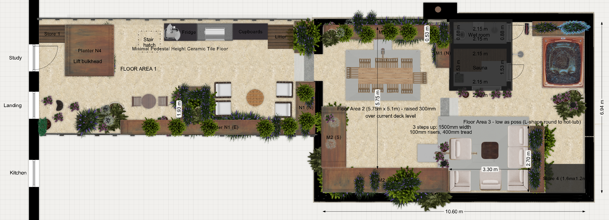

**Main section** — dining deck (raised 300mm), sauna and wet room, hot tub, and the lounge.

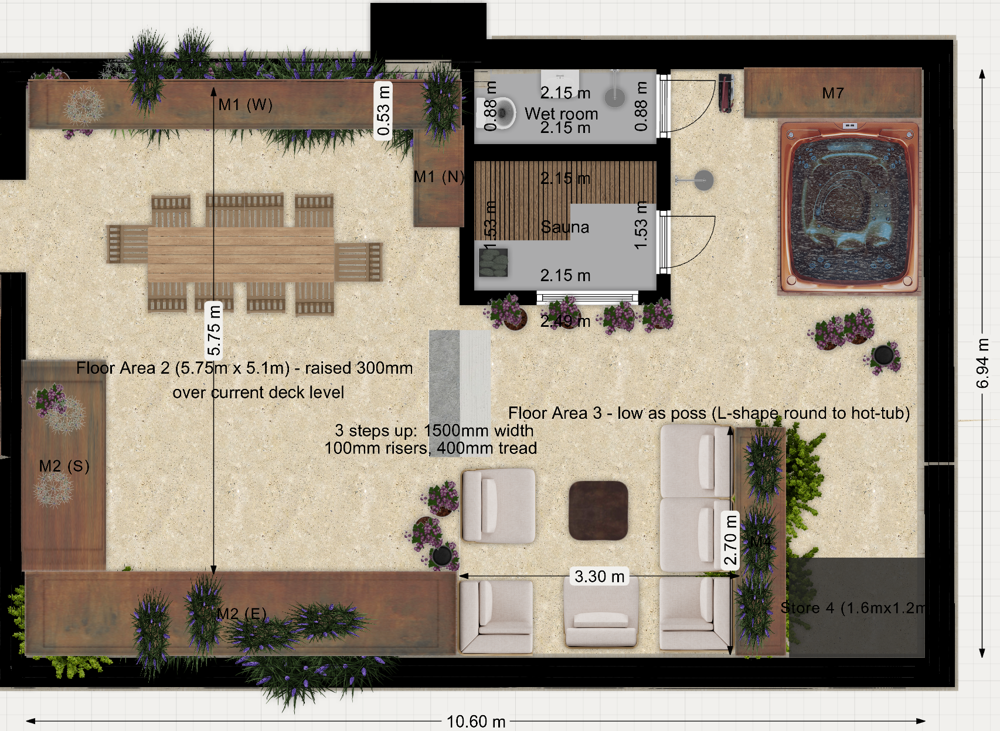

[↑ Contents](#contents)

---
## 4. View corridors and height caps

The Downs are the reason this terrace faces the way it does, and the planting must not eat the view.
Five sightlines govern the heights in §5. **Where a corridor and a windbreak conflict, the corridor wins** —
that is a deliberate client decision.

| # | From | Looking | Rule applied |
|---|---|---|---|
| **1** | **Dining table** (raised deck, FA2) | **North-east, to the Downs** | Nothing above **~1m total height** in M1(N), M4, the north half of M2(E), or pot Groups C and D. The tall planting on this terrace sits *behind* the diner — M1(W) and M2(S) — where it shelters without obstructing |
| **2** | **Sauna** door and window | **East and north-east, to the Downs** | **M4 capped at 1m maximum above finished floor level**, tapering lower at its east end |
| **3** | **Hot tub** | **East, to the Downs** | Kept completely open. There is deliberately **no planter on the tub's east or north side**, and the five pots east of the tub (Group C) are all low aromatics |
| **4** | *(reverse)* **Neighbours' upper windows**, east / north-east | **Down into the hot tub** | Blocked at high level by layers: the Phase-2 parasols when open; one airy multi-stem olive at the north end of M2(E), canopy ~2.0–2.7m above the rim, filtering the diagonal whenever they're not. You see under and through it; it takes the directness out of the sightline rather than walling it off |
| **5** | *(reverse)* **Both parasol masts** (Phase 2) | — | Nothing tall within the canopies' opening sweep or furled drop zones: M1(W)'s tall backbone sits at the SOUTH end of its run, away from the dining mast station; Group D sets out around the sofa mast after it is in. Canopy undersides run ~2.1–2.4m above their deck — everything under the sweep stays below ~1.8m |

> **Corridor 4 is layered, not solved once.** The parasols do the heavy lifting when they're open —
> but they won't always be open, so the olive stands there permanently as a filter. And note the
> parasols cover the dining table and the sofas, **not the tub itself** — which is why the olive
> earns its place.

**Two consequences worth being explicit about:**

1. **M4 doubles as a windbreak.** Its cap is 1m **above the planter rim** — 1.7m above finished floor
   level — so the west end carries evergreen domes that give the lounge real shelter from the north-east,
   while the east end drops to mats where the sauna's sightline is tightest.
2. **M2(E) is entirely on the raised level**, where the parapet stands 1,000mm above FFL — only 300mm
   above the planter rim. So the understorey in its north half is capped at **300mm from the rim**: mats
   and cushions only, nothing that would break the line of the coping.
[↑ Contents](#contents)

---
## 5. The planting, planter by planter

Each planter opens with what it is *for* and how it should feel through the year, then what actually goes
in it. Plant names link directly to their RHS entry. Quantities may be adjusted ±10% on site against
the actual run lengths — please price the totals in §11.

† RHS open-ground sizes; in these lean containers expect roughly two-thirds of that.

### N1(E) — Narrow terrace — **east** side

*7.2m long × 600mm deep · **500mm high · open steel railings, 1,100mm above FFL — no parapet***

The long east flank, and the first thing you see when you step out of the study. Seven metres of
silvered timber with a loose twiggy evergreen wall behind it: a single **Silver Sheen** pittosporum
standing above the rest, two myrtles and two purple-bronze domes knitting together into a screen the wind
can pass *through* rather than pile against. In February the rosemary is already blue and there are
crocus at your feet. By June it is lavender, catmint and blue oat grass moving in the wind, with
*Erigeron* daisies seeding themselves into the paving joints. July brings drumstick alliums up through it
all on leafless stems that don't mind the gale. Autumn is stonecrop going dusky pink then rust, and the
seed heads stay standing until you cut them in February.

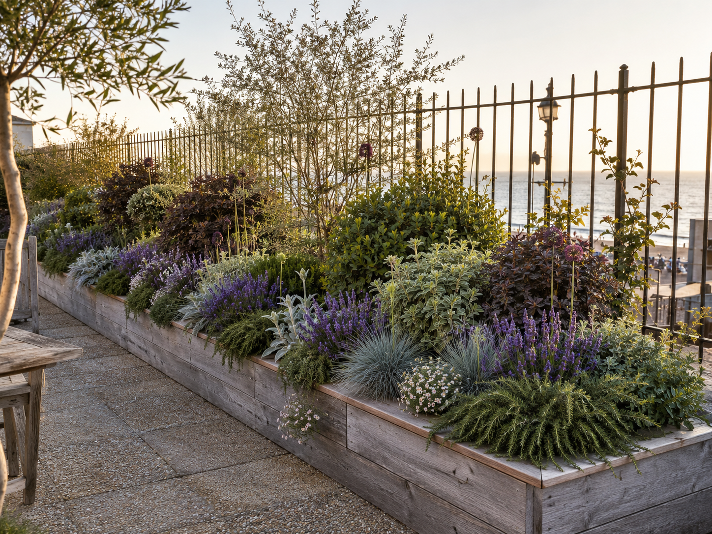

> **Why it is planted this way.** The principal screen against being overlooked from the east, and — because the east side has **open railings, not a parapet** — the *only* wind defence the narrow terrace has from that direction. Wind passes straight through the railings at low level, so this planting is the windbreak. Every shrub is a naturally self-limiting dome of no more than ~1.2m spread: nothing that needs clipping, and nothing that will cantilever far past the railing line. After the design review the ribbon here was consolidated into drifts of a few species rather than one-of-everything — it reads as designed planting, and it knits faster.

> **Mulch and feeding:** 10mm gravel collar, ~300mm ring. Slow-release granular feed each April; **no compost** — see §12.

**Back row — windbreak, 0.8–1.0m centres**

| Qty | Plant | Mature H × S | Flowers | Note | Supply |
|---|:---:|---|---|---|---|
| **1** | [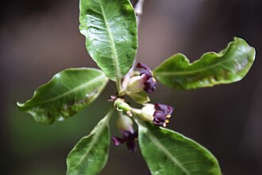](plant-images/pitto_silver.jpg) [*Pittosporum tenuifolium* 'Silver Sheen'](https://www.rhs.org.uk/plants/53823/pittosporum-tenuifolium-silver-sheen-m/details) — Kohuhu Springfield Rd | 4–8m × 2.5–4m† | May–Jun | Fine silver-green; filters wind — furnished to the base | 20–30L · 1.75–2.0m · furnished to the base |
| **1** | [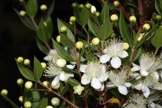](plant-images/myrtus.png) [*Myrtus communis* subsp. *tarentina*](https://www.rhs.org.uk/plants/59207/myrtus-communis-subsp-tarentina/details) — Compact myrtle New | 1–1.5m × 1–1.5m† | Jul–Sep | Naturally dense dome; needs no clipping at all | 5L |
| **1** | [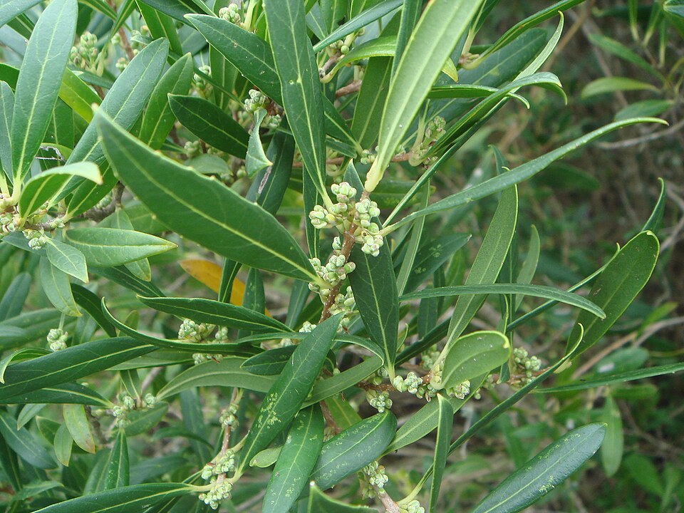](plant-images/phillyrea.jpg) [*Phillyrea angustifolia*](https://www.rhs.org.uk/plants/24488/phillyrea-angustifolia/details) — Phillyrea New | 2.5–4m × 1.5–2.5m† | May–Jun | Glossy, self-shaping evergreen — the palette was missing it | 5L |
| **2** | [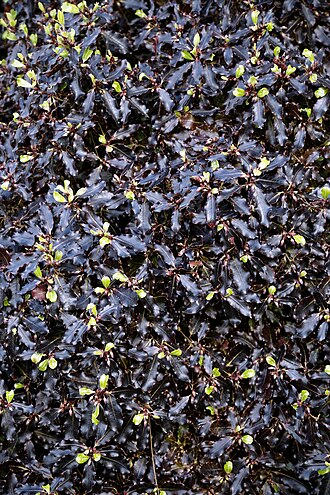](plant-images/tomthumb.jpg) [*Pittosporum tenuifolium* 'Tom Thumb'](https://www.rhs.org.uk/plants/77301/pittosporum-tenuifolium-tom-thumb/details) — Purple dwarf kohuhu Sussex Sq | 0.5–1m × 0.5–1m† | — | Naturally rounded purple-bronze dome, no pruning ever | 5L |
| **1** |  [*Pittosporum tenuifolium* 'Golf Ball'](https://www.rhs.org.uk/plants/246352/pittosporum-tenuifolium-golf-ball/details) — Dwarf kohuhu Sussex Sq | 0.5–1m × 0.5–1m† | — | Naturally spherical, clipped to 60–80cm; the repeating rhythm | 5L |
| **1** | [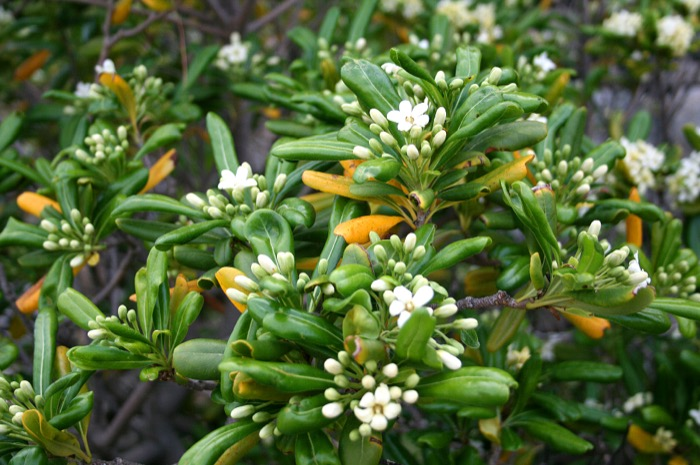](plant-images/tobira.jpg) [*Pittosporum tobira* 'Nanum'](https://www.rhs.org.uk/plants/61258/pittosporum-tobira-nanum/details) — Dwarf Japanese pittosporum Sussex Sq | 0.6–1m × 0.6–1m† | May–Jun | Self-shaping glossy dome; honey-scented cream flowers | 3L |
| **1** | [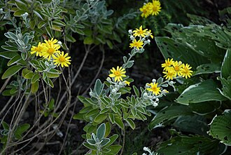](plant-images/brachy.jpg) [*Brachyglottis* 'Sunshine'](https://www.rhs.org.uk/plants/86133/brachyglottis-dunedin-group-sunshine/details) — Dunedin daisy bush Sussex Sq | 1–1.5m × 1–1.5m† | Jun–Jul | Silver felted evergreen daisy bush | 3L |

**Front ribbon**

| Qty | Plant | Mature H × S | Flowers | Note | Supply |
|---|:---:|---|---|---|---|
| **5** | [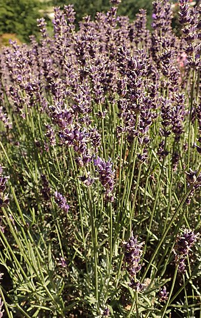](plant-images/lavandula.jpg) [*Lavandula angustifolia* 'Hidcote'](https://www.rhs.org.uk/plants/96353/lavandula-angustifolia-hidcote/details) — English lavender Springfield Rd | 0.1–0.5m × 0.5–1m† | Jun–Aug | — | 2L |
| **3** | [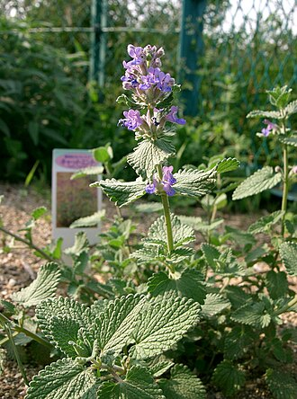](plant-images/nepeta.jpg) [*Nepeta* × *faassenii* 'Walker's Low'](https://www.rhs.org.uk/plants/210480/nepeta-faassenii-walker-s-low/details) — Catmint Sussex Sq | 0.1–0.5m × 0.1–0.5m† | Jun–Sep | Shear after the first flush | 1–2L |
| **3** | [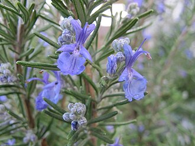](plant-images/rosemary.jpg) [*Salvia rosmarinus* 'Severn Sea'](https://www.rhs.org.uk/plants/386349/salvia-rosmarinus-severn-sea-ro/details) — Semi-prostrate rosemary Sussex Sq | 0.5–1m × 0.5–1m† | Feb–May | Flowers when almost nothing else does | 2L |
| **6** | [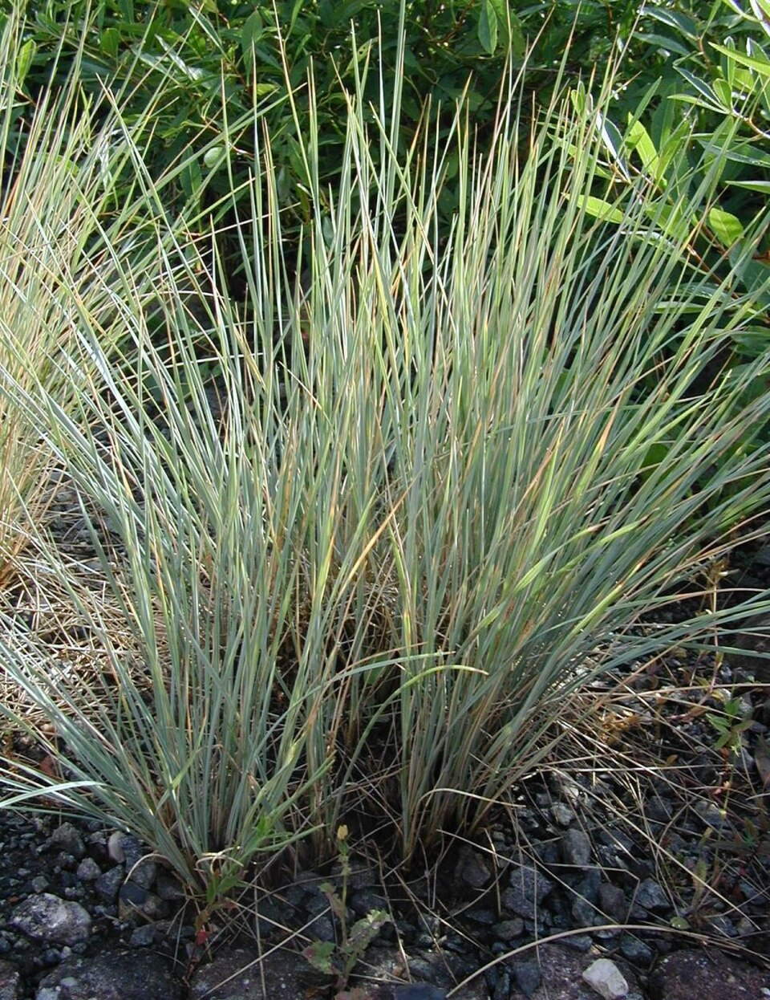](plant-images/helictotrichon.jpg) [*Helictotrichon sempervirens*](https://www.rhs.org.uk/plants/8555/helictotrichon-sempervirens/details) — Blue oat grass New | 1–1.5m × 0.5–1m† | Summer | The wind made visible; comb out dead leaves in spring | 2L |
| **2** | [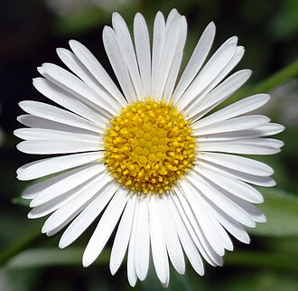](plant-images/erigeron.jpg) [*Erigeron karvinskianus*](https://www.rhs.org.uk/plants/32487/erigeron-karvinskianus/details) — Mexican fleabane Sussex Sq | 0.1–0.5m × 0.5–1m† | Apr–Nov | Self-seeds into paving joints | 1L |

**Bulbs — planted Oct–Nov, threaded between the plants**

| Qty | Bulb | Flowers |
|---|:---:|---|
| **25** | [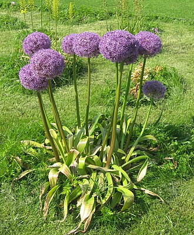](plant-images/allium_holl.jpg) [*Allium hollandicum* 'Purple Sensation'](https://www.rhs.org.uk/plants/57088/allium-hollandicum-purple-sensation/details) — Ornamental onion | May, purple drumsticks |
| **25** | [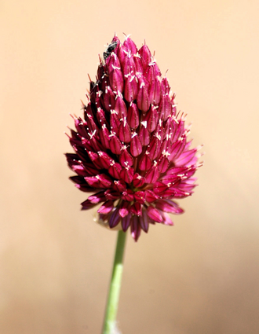](plant-images/allium_sphaero.png) [*Allium sphaerocephalon*](https://www.rhs.org.uk/plants/870/allium-sphaerocephalon-round-headed-leek-round-headed-garlic/details) — Drumstick allium | Jul, wine-purple |
| **25** | [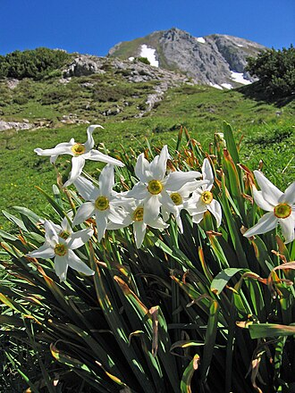](plant-images/narcissus.jpg) [*Narcissus* 'Tête-à-tête'](https://www.rhs.org.uk/plants/89723/narcissus-tete-a-tete-12/details) — Dwarf daffodil | Feb–Mar, 15cm |
| **15** | [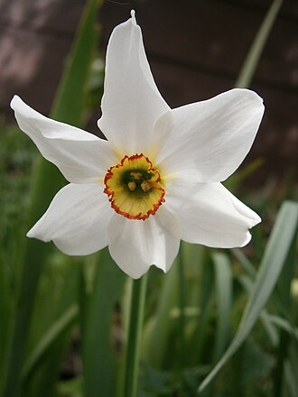](plant-images/narc_poet.jpg) [*Narcissus poeticus* var. *recurvus*](https://www.rhs.org.uk/plants/76534/i-narcissus-poeticus-i-var-i-recurvus-i-(13)/details) — Pheasant's eye | May, white with a red-rimmed eye |
| **10** |  [*Narcissus* 'Rijnveld's Early Sensation'](https://www.rhs.org.uk/plants/55821/narcissus-rijnvelds-early-sensation-1/details) — Daffodil | January |
| **15** | [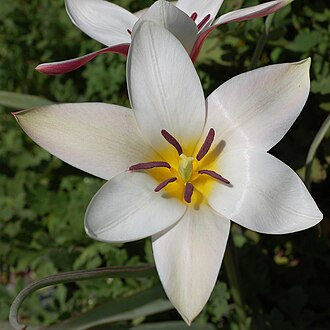](plant-images/tulipa_clus.jpg) [*Tulipa clusiana* 'Lady Jane'](https://www.rhs.org.uk/plants/194056/tulipa-lady-jane-15/details) — Lady tulip | Apr, white / rose |
| **15** | [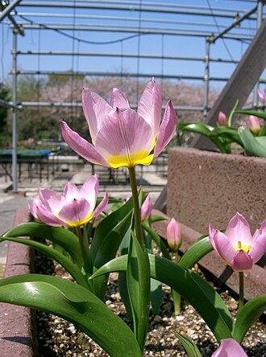](plant-images/tulipa_sax.jpg) [*Tulipa saxatilis* (Bakeri Gp) 'Lilac Wonder'](https://www.rhs.org.uk/plants/67509/tulipa-saxatilis-bakeri-group-lilac-wonder-15/details) — Cretan tulip | Apr, lilac-pink, yellow eye |
| **40** | [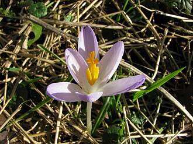](plant-images/crocus_tom.jpg) [*Crocus tommasinianus*](https://www.rhs.org.uk/plants/25699/crocus-tommasinianus/details) — Early crocus | Feb, lilac |
| **25** | [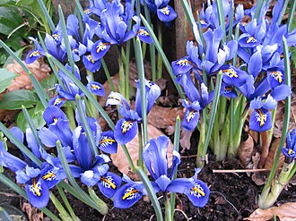](plant-images/iris_ret.jpg) [*Iris reticulata* 'Harmony' + 'Katharine Hodgkin'](https://www.rhs.org.uk/plants/9343/iris-reticulata-harmony/details) — Dwarf iris | Feb, deep and pale blue |
| **25** | [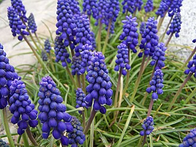](plant-images/muscari.jpg) [*Muscari armeniacum* 'Valerie Finnis'](https://www.rhs.org.uk/plants/131700/muscari-armeniacum-valerie-finnis/details) — Grape hyacinth | Apr, pale powder blue |
| **15** | [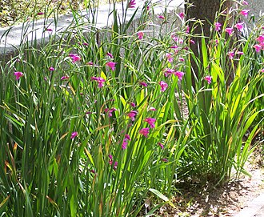](plant-images/gladiolus.jpg) [*Gladiolus communis* subsp. *byzantinus*](https://www.rhs.org.uk/plants/89297/gladiolus-communis-subsp-byzantinus/details) — Byzantine gladiolus | May–Jun, magenta |
| **5** | [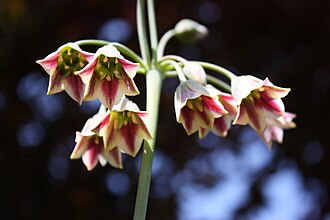](plant-images/nectaroscordum.jpg) [*Nectaroscordum siculum*](https://www.rhs.org.uk/plants/96507/nectaroscordum-siculum/details) — Sicilian honey garlic | Jun, cream / green / maroon bells |

*N1(E) total: **27 plants** + **240 bulbs***

### N1(N) — Narrow terrace — **north** leg of the L

*1.8m long × 800mm deep · 500mm high · solid parapet 1,300mm above FFL*

The turn of the L, and the head of the steps up to the main terrace — so it works as a full stop
rather than a run. One multi-stem **olive** does that job, with a myrtle beside it and sea thrift
at its feet. The solid parapet behind gives it more shelter than anywhere else on this
terrace, which is why the olive goes here rather than out on the exposed run.

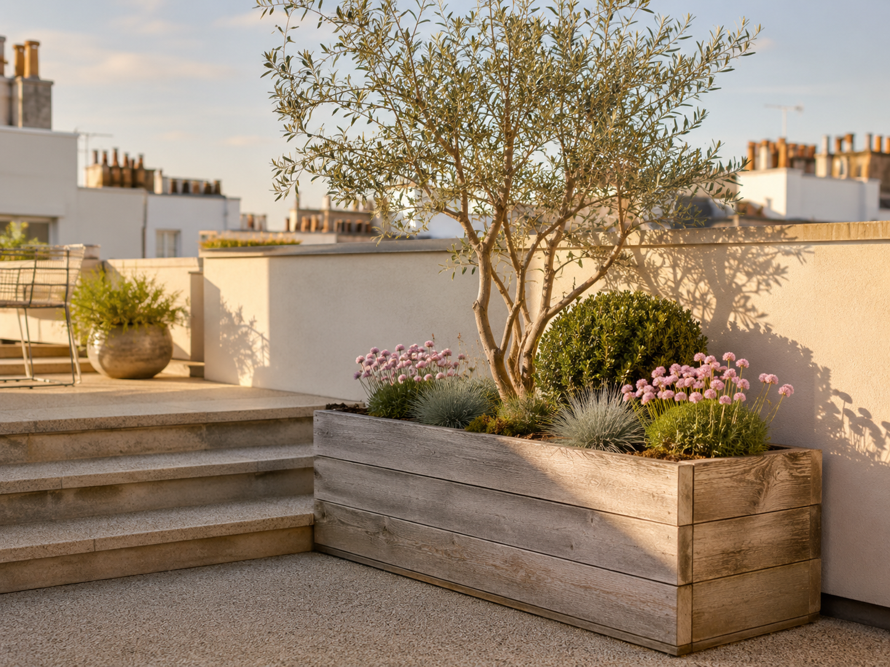

> **Why it is planted this way.** The deepest planter on the narrow terrace, so it takes a full specimen — and the solid 1,300mm parapet here gives 800mm of containment above the planter rim, more than anywhere else on the narrow terrace. Marks the head of the L where the steps rise to the main terrace. The olive here is deliberately the smaller 30–35L size — the review confirmed a 45–60L rootball doesn't fit a 500mm box, and in this exposure a smaller tree anchors faster and rocks less.

> **Mulch and feeding:** 10mm gravel collar, ~300mm ring. Slow-release granular feed each April; **no compost** — see §12.

**Back row**

| Qty | Plant | Mature H × S | Flowers | Note | Supply |
|---|:---:|---|---|---|---|
| **1** | [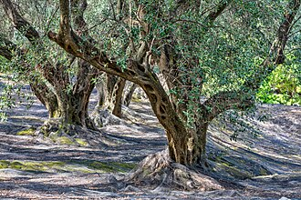](plant-images/olea.jpg) [*Olea europaea* — multi-stem](https://www.rhs.org.uk/plants/11735/olea-europaea-f-/details) — Olive Sussex Sq | 4–8m × 1.5–2.5m† | Jun–Jul | Downsized for a 500mm box; anchors faster, rocks less | 30–35L · ~1.5m |
| **1** |  [*Myrtus communis* subsp. *tarentina*](https://www.rhs.org.uk/plants/59207/myrtus-communis-subsp-tarentina/details) — Compact myrtle New | 1–1.5m × 1–1.5m† | Jul–Sep | Naturally dense dome; needs no clipping at all | 5L |

**Front ribbon**

| Qty | Plant | Mature H × S | Flowers | Note | Supply |
|---|:---:|---|---|---|---|
| **5** | [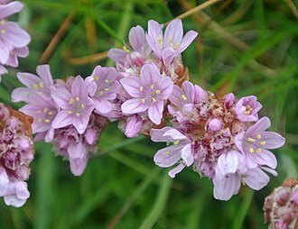](plant-images/armeria.jpg) [*Armeria maritima*](https://www.rhs.org.uk/plants/1597/armeria-maritima/details) — Sea thrift New | 0.1–0.5m × 0.1–0.5m† | Apr–Jun | UK coastal native; evergreen cushions | 9cm–1L |

**Bulbs — planted Oct–Nov, threaded between the plants**

| Qty | Bulb | Flowers |
|---|:---:|---|
| **10** |  [*Allium hollandicum* 'Purple Sensation'](https://www.rhs.org.uk/plants/57088/allium-hollandicum-purple-sensation/details) — Ornamental onion | May, purple drumsticks |
| **20** |  [*Crocus tommasinianus*](https://www.rhs.org.uk/plants/25699/crocus-tommasinianus/details) — Early crocus | Feb, lilac |
| **10** |  [*Narcissus* 'Tête-à-tête'](https://www.rhs.org.uk/plants/89723/narcissus-tete-a-tete-12/details) — Dwarf daffodil | Feb–Mar, 15cm |
| **10** |  [*Muscari armeniacum* 'Valerie Finnis'](https://www.rhs.org.uk/plants/131700/muscari-armeniacum-valerie-finnis/details) — Grape hyacinth | Apr, pale powder blue |
| **10** |  [*Tulipa saxatilis* (Bakeri Gp) 'Lilac Wonder'](https://www.rhs.org.uk/plants/67509/tulipa-saxatilis-bakeri-group-lilac-wonder-15/details) — Cretan tulip | Apr, lilac-pink, yellow eye |

*N1(N) total: **7 plants** + **60 bulbs***

### N2 — Narrow terrace — mid-east square

*1.2 × 1.2m · 500mm high · built integral with N1*

A punctuation mark in the middle of the east run: one bronze **Phormium** throwing hard vertical
sword-leaves out of a soft cushion of lavender and cheddar pinks. It exists to stop seven metres of planting
reading as a hedge. In autumn the stonecrop and a few autumn crocus keep it going after the lavender is over.

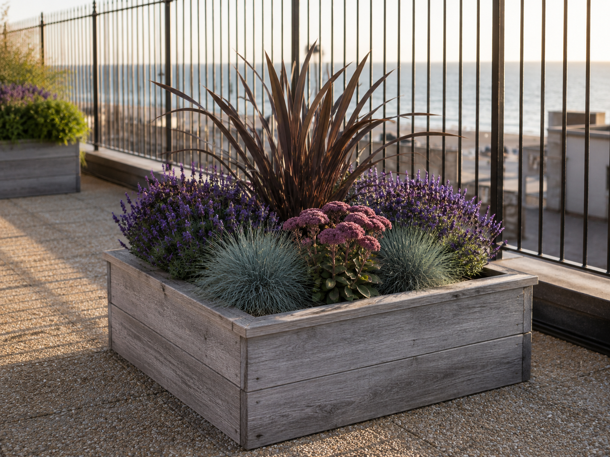

> **Why it is planted this way.** A punctuation point in the east run — one piece of architecture with lavender around its feet.

> **Mulch and feeding:** 10mm gravel collar, ~300mm ring. Slow-release granular feed each April; **no compost** — see §12.

**Whole square**

| Qty | Plant | Mature H × S | Flowers | Note | Supply |
|---|:---:|---|---|---|---|
| **1** | [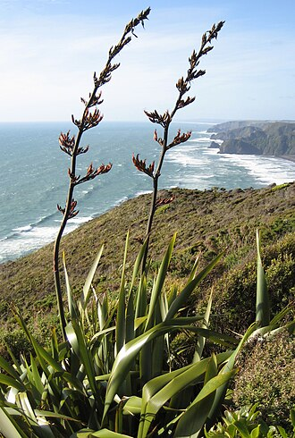](plant-images/phormium.jpg) [*Phormium* 'Bronze Baby'](https://www.rhs.org.uk/plants/92561/phormium-bronze-baby/details) — Bronze New Zealand flax Sussex Sq | 0.5–1m × 0.5–1m† | Summer (rare) | Compact bronze sword foliage — bullet-proof in salt wind | 5L |
| **4** |  [*Lavandula angustifolia* 'Hidcote'](https://www.rhs.org.uk/plants/96353/lavandula-angustifolia-hidcote/details) — English lavender Springfield Rd | 0.1–0.5m × 0.5–1m† | Jun–Aug | — | 2L |
| **2** | [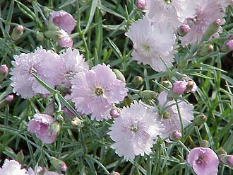](plant-images/dianthus.jpg) [*Dianthus gratianopolitanus*](https://www.rhs.org.uk/plants/5722/dianthus-gratianopolitanus/details) — Cheddar pink New | 0.1–0.5m × 0.1–0.5m† | May–Jul | UK native; strongly clove-scented evergreen mats | 1L |
| **1** | [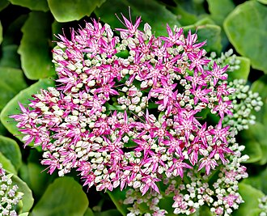](plant-images/hylo.jpg) [*Hylotelephium* 'Matrona'](https://www.rhs.org.uk/plants/356925/hylotelephium-matrona/details) — Stonecrop / iceplant Sussex Sq | 0.5–1m × 0.1–0.5m† | Aug–Oct | Seed heads stand all winter | 2L |

**Bulbs — planted Oct–Nov, threaded between the plants**

| Qty | Bulb | Flowers |
|---|:---:|---|
| **5** | [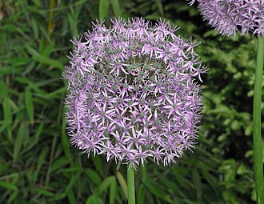](plant-images/allium_crist.jpg) [*Allium cristophii*](https://www.rhs.org.uk/plants/816/allium-cristophii/details) — Star of Persia | May–Jun |
| **20** |  [*Crocus tommasinianus*](https://www.rhs.org.uk/plants/25699/crocus-tommasinianus/details) — Early crocus | Feb, lilac |
| **15** |  [*Iris reticulata* 'Harmony' + 'Katharine Hodgkin'](https://www.rhs.org.uk/plants/9343/iris-reticulata-harmony/details) — Dwarf iris | Feb, deep and pale blue |
| **10** |  [*Tulipa* 'Little Beauty'](https://www.rhs.org.uk/plants/155507/tulipa-little-beauty-15/details) — Species tulip | Apr, 15cm, magenta with a blue eye |
| **10** |  [*Narcissus* 'Tête-à-tête'](https://www.rhs.org.uk/plants/89723/narcissus-tete-a-tete-12/details) — Dwarf daffodil | Feb–Mar, 15cm |
| **6** | [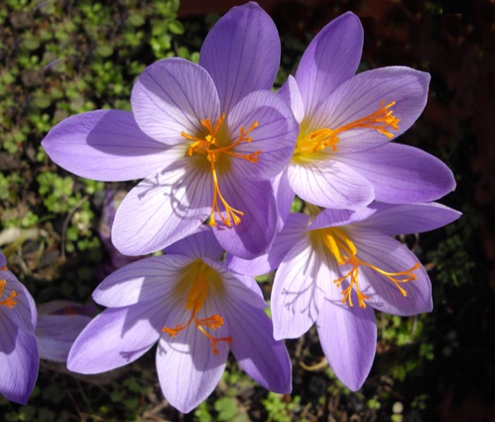](plant-images/crocus_speciosus.jpg) [*Crocus speciosus*](https://www.rhs.org.uk/plants/4941/crocus-speciosus/details) — Autumn crocus | Oct, violet-blue |

*N2 total: **8 plants** + **66 bulbs***

### N3 — Narrow terrace — mid-west square, beside the outdoor kitchen

*1.2 × 1.2m · 500mm high*

The cook's square, one step from the outdoor kitchen worktop and planted entirely with things you
would actually pick — upright rosemary, four kinds of thyme, purple sage, ornamental marjoram that the
butterflies mob in August. Evergreen and usable in every month, which is the point: you want to be able to
cut something for dinner in January.

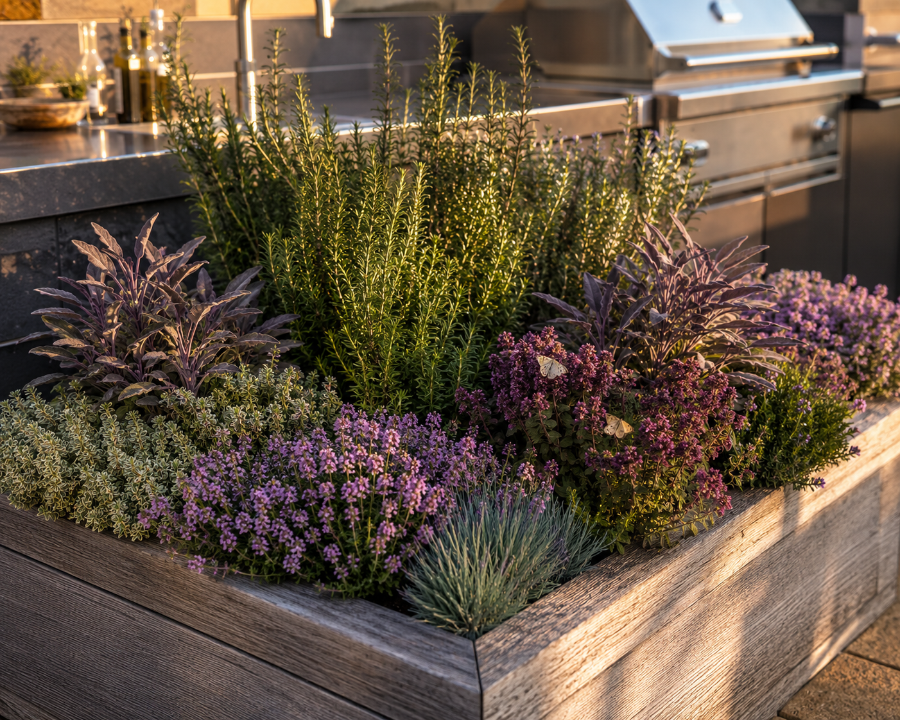

> **Why it is planted this way.** **The cook's square** — everything in it is culinary, and it is one step from the outdoor kitchen worktop.

> **Mulch and feeding:** 10mm gravel collar, ~300mm ring. Slow-release granular feed each April; **no compost** — see §12.

**Whole square**

| Qty | Plant | Mature H × S | Flowers | Note | Supply |
|---|:---:|---|---|---|---|
| **2** |  [*Salvia rosmarinus* 'Miss Jessopp's Upright'](https://www.rhs.org.uk/plants/384683/salvia-rosmarinus-miss-jessopps-upright-ro/details) — Upright rosemary Sussex Sq | 1.5–2.5m × 1–1.5m† | Feb–May | Evergreen, culinary | 2L |
| **4** | [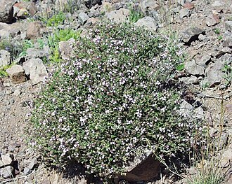](plant-images/thymus.jpg) [*Thymus vulgaris* · *T.* 'Purple Beauty' · *T. serpyllum*](https://www.rhs.org.uk/plants/18213/thymus-vulgaris/details) — Thyme — 3 forms New | 0.1–0.5m × 0.1–0.5m† | Early summer | Evergreen culinary mats; bees swarm the flowers | 9cm |
| **2** | [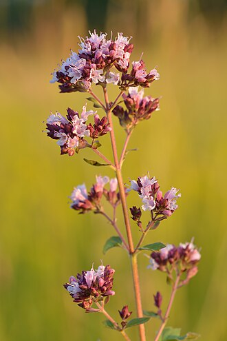](plant-images/origanum.jpg) [*Origanum* 'Herrenhausen'](https://www.rhs.org.uk/plants/41793/origanum-herrenhausen/details) — Ornamental marjoram New | 0.1–0.5m × 0.1–0.5m† | Jul–Sep | One of the highest-rated butterfly plants there is | 1L |
| **2** | [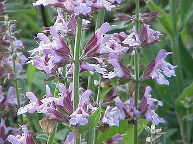](plant-images/sage.jpg) [*Salvia officinalis* 'Purpurascens'](https://www.rhs.org.uk/plants/153600/salvia-officinalis-purpurascens/details) — Purple sage New | 0.5–1m × 0.5–1m† | Summer | Culinary; purple foliage sits on the cool palette | 2L |

**Bulbs — planted Oct–Nov, threaded between the plants**

| Qty | Bulb | Flowers |
|---|:---:|---|
| **20** | [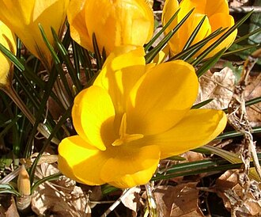](plant-images/crocus_chry.jpg) [*Crocus* 'Snow Bunting'](https://www.rhs.org.uk/plants/93896/crocus-chrysanthus-snow-bunting/details) — Crocus | Feb, white, scented |
| **15** |  [*Iris reticulata* 'Harmony' + 'Katharine Hodgkin'](https://www.rhs.org.uk/plants/9343/iris-reticulata-harmony/details) — Dwarf iris | Feb, deep and pale blue |
| **10** |  [*Tulipa* 'Little Beauty'](https://www.rhs.org.uk/plants/155507/tulipa-little-beauty-15/details) — Species tulip | Apr, 15cm, magenta with a blue eye |
| **15** |  [*Allium sphaerocephalon*](https://www.rhs.org.uk/plants/870/allium-sphaerocephalon-round-headed-leek-round-headed-garlic/details) — Drumstick allium | Jul, wine-purple |

*N3 total: **10 plants** + **60 bulbs***

### N4 — Lift over-run — **the aromatic picking bed**

*2.1 × 2.1m · **400mm deep box** · planting kept under 700mm*

You brush past this every single time you go out, so it is built for scent above everything. A low
aromatic mound on top of the lift over-run — prostrate rosemary trailing over all four edges, thyme,
lavender, savory, tarragon, sage, alpine strawberries for picking — with the sun-lovers on the north and
east where the light is, and the south edge, in the permanent lee of the flat wall, given over to a
different palette entirely: **Sarcococca** and a hellebore, with snowdrops and cyclamen threaded
underneath. In January that shaded band is the best-smelling square metre on the terrace. In July the
whole thing hums, and there are strawberries to pick.

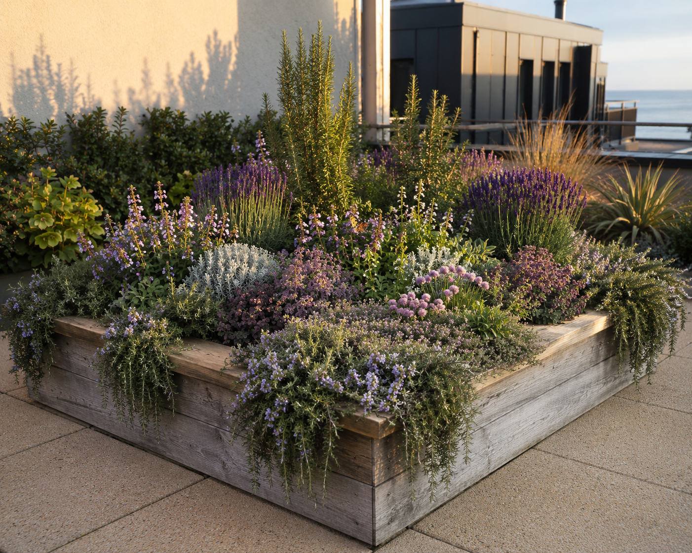

> **Why it is planted this way.** You brush past this every time you go out of the study door, so it is built for scent and for picking. **Part-shaded** — the flat rises ~3m immediately to its south — so it is zoned: sun-loving Mediterranean herbs on the north and east sides, and the shade-tolerant plants along the south edge in the lee of the wall.

> **Mulch and feeding:** gravel over the sunny two-thirds. The **shaded south band has no gravel** — it is top-dressed with home-made compost each spring, like the pots. See §12.

**South edge — in the lee of the flat wall (part shade)**

| Qty | Plant | Mature H × S | Flowers | Note | Supply |
|---|:---:|---|---|---|---|
| **1** | [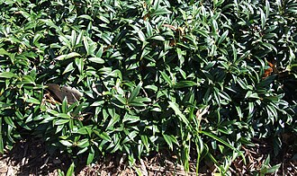](plant-images/sarcococca.jpg) [*Sarcococca hookeriana* var. *humilis*](https://www.rhs.org.uk/plants/96875/sarcococca-hookeriana-var-humilis/details) — Sweet box / Christmas box Sussex Sq · Springfield Rd | 0.5–1m × 0.5–1m† | Winter | The most powerful winter scent of any hardy shrub | 3L |
| **1** | [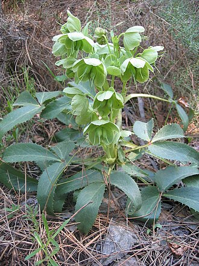](plant-images/hellebore.jpg) [*Helleborus argutifolius*](https://www.rhs.org.uk/plants/8565/helleborus-argutifolius/details) — Corsican hellebore Sussex Sq | 0.5–1m × 0.5–1m† | Feb–Apr | Early nectar for waking bumblebees | 2L |
| **3** | [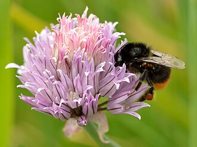](plant-images/chives.jpg) [*Allium schoenoprasum*](https://www.rhs.org.uk/plants/859/allium-schoenoprasum-chives-cive/details) — Chives New | 0.1–0.5m × 0–0.1m† | Jun | Culinary; a genuine bee magnet | 1L |
| **2** |  [*Origanum vulgare*](https://www.rhs.org.uk/plants/11923/origanum-vulgare/details) — Wild marjoram / oregano Sussex Sq | 0.5–1m × 0.5–1m† | Jul–Sep | UK native; the cooking oregano | 1L |

**North + east edges and body — most direct sun**

| Qty | Plant | Mature H × S | Flowers | Note | Supply |
|---|:---:|---|---|---|---|
| **5** |  [*Salvia rosmarinus* 'Prostratus'](https://www.rhs.org.uk/plants/386334/salvia-rosmarinus-prostrata-group-ro/details) — Trailing rosemary Springfield Rd | 0.1–0.5m × 1–1.5m† | Spring–summer | Evergreen, culinary; trails over the planter edges | 2L |
| **2** |  [*Salvia rosmarinus* 'Miss Jessopp's Upright'](https://www.rhs.org.uk/plants/384683/salvia-rosmarinus-miss-jessopps-upright-ro/details) — Upright rosemary Sussex Sq | 1.5–2.5m × 1–1.5m† | Feb–May | Evergreen, culinary | 2L |
| **3** |  [*Lavandula angustifolia* 'Hidcote'](https://www.rhs.org.uk/plants/96353/lavandula-angustifolia-hidcote/details) — English lavender Springfield Rd | 0.1–0.5m × 0.5–1m† | Jun–Aug | — | 2L |
| **2** | [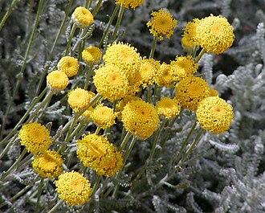](plant-images/santolina.jpg) [*Santolina chamaecyparissus*](https://www.rhs.org.uk/plants/19856/santolina-chamaecyparissus-lavender-cotton-cotton-lavender/details) — Cotton lavender Sussex Sq | 0.1–0.5m × 0.5–1m† | Summer | Shear the buds in June if they jar | 2L |
| **2** | [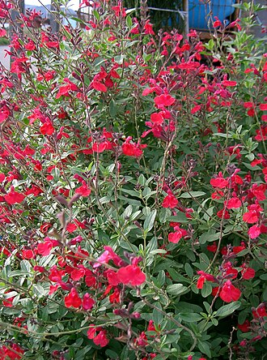](plant-images/salvia_micro.jpg) [*Salvia microphylla* 'Amethyst Lips'](https://www.rhs.org.uk/plants/374047/salvia-amethyst-lips-dyspurp/details) — Shrubby sage Sussex Sq | 0.5–1m × 0.5–1m† | Jun–Oct | Blackcurrant-scented leaves when brushed | 2L |
| **6** |  [*Thymus vulgaris* · *T.* 'Purple Beauty' · *T. serpyllum*](https://www.rhs.org.uk/plants/18213/thymus-vulgaris/details) — Thyme — 3 forms New | 0.1–0.5m × 0.1–0.5m† | Early summer | Evergreen culinary mats; bees swarm the flowers | 9cm |
| **2** |  [*Origanum* 'Herrenhausen'](https://www.rhs.org.uk/plants/41793/origanum-herrenhausen/details) — Ornamental marjoram New | 0.1–0.5m × 0.1–0.5m† | Jul–Sep | One of the highest-rated butterfly plants there is | 1L |
| **2** |  [*Salvia officinalis*](https://www.rhs.org.uk/plants/16356/salvia-officinalis/details) — Common sage New | 0.5–1m × 0.5–1m† | Early summer | Evergreen grey-green; the cooking sage | 2L |
| **2** | [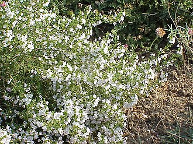](plant-images/savory.jpg) [*Satureja montana*](https://www.rhs.org.uk/plants/16484/satureja-montana/details) — Winter savory New | 0.1–0.5m × 0.1–0.5m† | Summer | Evergreen; pepperiness for beans and stews | 1L |
| **2** | [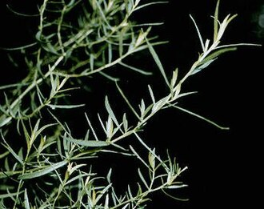](plant-images/tarragon.jpg) [*Artemisia dracunculus*](https://www.rhs.org.uk/plants/1632/artemisia-dracunculus/details) — French tarragon New | 0.5–1m × 0.1–0.5m† | Late summer | ⚠️ Must be French, not Russian — near-flavourless otherwise | 1L |
| **5** | [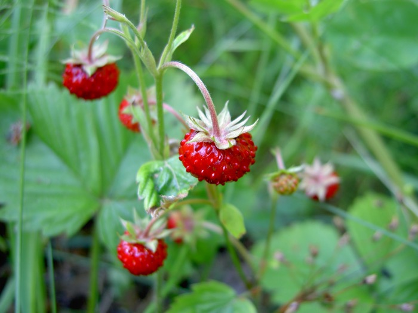](plant-images/fragaria.jpg) [*Fragaria vesca*](https://www.rhs.org.uk/plants/7280/fragaria-vesca-f/details) — Alpine strawberry New | 0.1–0.3m × 0.3m† | Apr–Jun (fruit Jun–Oct) | Picking fruit for the terrace; tolerates the lean mix | 9cm |

**Bulbs — planted Oct–Nov, threaded between the plants**

| Qty | Bulb | Flowers |
|---|:---:|---|
| **40** |  [*Crocus tommasinianus*](https://www.rhs.org.uk/plants/25699/crocus-tommasinianus/details) — Early crocus | Feb, lilac |
| **40** |  [*Crocus* 'Snow Bunting'](https://www.rhs.org.uk/plants/93896/crocus-chrysanthus-snow-bunting/details) — Crocus | Feb, white, scented |
| **30** |  [*Iris reticulata* 'Harmony' + 'Katharine Hodgkin'](https://www.rhs.org.uk/plants/9343/iris-reticulata-harmony/details) — Dwarf iris | Feb, deep and pale blue |
| **15** |  [*Tulipa clusiana* 'Lady Jane'](https://www.rhs.org.uk/plants/194056/tulipa-lady-jane-15/details) — Lady tulip | Apr, white / rose |
| **15** |  [*Tulipa saxatilis* (Bakeri Gp) 'Lilac Wonder'](https://www.rhs.org.uk/plants/67509/tulipa-saxatilis-bakeri-group-lilac-wonder-15/details) — Cretan tulip | Apr, lilac-pink, yellow eye |
| **10** |  [*Tulipa* 'Little Beauty'](https://www.rhs.org.uk/plants/155507/tulipa-little-beauty-15/details) — Species tulip | Apr, 15cm, magenta with a blue eye |
| **30** |  [*Allium sphaerocephalon*](https://www.rhs.org.uk/plants/870/allium-sphaerocephalon-round-headed-leek-round-headed-garlic/details) — Drumstick allium | Jul, wine-purple |
| **25** |  [*Narcissus* 'Tête-à-tête'](https://www.rhs.org.uk/plants/89723/narcissus-tete-a-tete-12/details) — Dwarf daffodil | Feb–Mar, 15cm |
| **25** |  [*Muscari armeniacum* 'Valerie Finnis'](https://www.rhs.org.uk/plants/131700/muscari-armeniacum-valerie-finnis/details) — Grape hyacinth | Apr, pale powder blue |
| **40** | [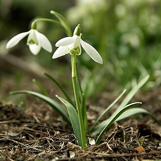](plant-images/galanthus.jpg) [*Galanthus nivalis*](https://www.rhs.org.uk/plants/7568/galanthus-nivalis/details) — Snowdrop — buy in the green | Jan–Feb, white |
| **15** | [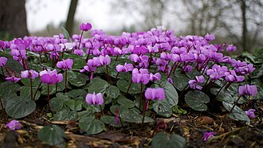](plant-images/cyclamen_coum.jpg) [*Cyclamen coum*](https://www.rhs.org.uk/plants/5135/cyclamen-coum/details) — Eastern cyclamen | Jan–Mar, pink / white |
| **10** | [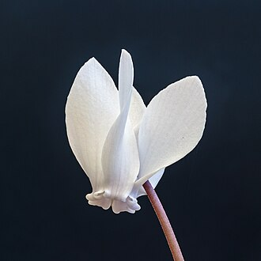](plant-images/cyclamen_hed.jpg) [*Cyclamen hederifolium*](https://www.rhs.org.uk/plants/5145/cyclamen-hederifolium/details) — Ivy-leaved cyclamen | Sept–Nov, pink / white |

*N4 total: **40 plants** + **295 bulbs***
### M1(W) — Main terrace — **west** edge of the raised dining deck (FA2)

*≈4.5m long × 600mm deep · 500mm high, on the +300mm raised deck*

The wall behind the dining table, and the south-westerly gale flank — the hardest-working
planting on the terrace. A **Silver Sheen** pittosporum furnished to the ground, a myrtle, a purple
'Tom Thumb' dome, a *Brachyglottis* and a *Cistus* opening white-with-a-maroon-blotch in June. In front,
at table height: lavender, catmint, dark-stemmed **'Caradonna'** salvia and gaura riding the wind on wiry
stems. Alliums and pheasant's-eye narcissus come through it in spring; *Hylotelephium*
holds the autumn.

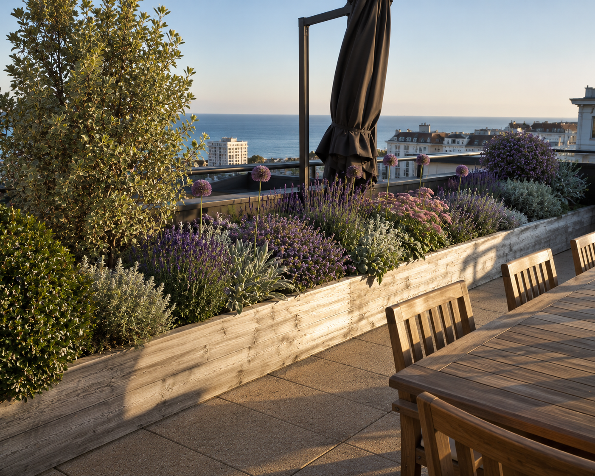

> **Why it is planted this way.** The south-westerly gale flank and the neighbour side — the hardest-working windbreak on the main terrace, and what you look at from the dining table. It sits **behind** you when you look north-east, so height here does not compete with the Downs view. The Phase-2 dining parasol's mast lands mid-run, just east of this planter. So the two tall backbone plants — the 'Silver Sheen' and the myrtle — go at the SOUTH end of the run, and nothing taller than the front ribbon is planted within about 1.5m either side of the mast station, keeping the canopy's opening sweep and its furled drop zone clear. The *Cistus* and the 'Tom Thumb' dome take the north end.

> **Mulch and feeding:** 10mm gravel collar, ~300mm ring. Slow-release granular feed each April; **no compost** — see §12.

**Back row**

| Qty | Plant | Mature H × S | Flowers | Note | Supply |
|---|:---:|---|---|---|---|
| **1** |  [*Pittosporum tenuifolium* 'Silver Sheen'](https://www.rhs.org.uk/plants/53823/pittosporum-tenuifolium-silver-sheen-m/details) — Kohuhu Springfield Rd | 4–8m × 2.5–4m† | May–Jun | Fine silver-green; filters wind — furnished to the base | 20–30L · 1.75–2.0m · furnished to the base |
| **1** |  [*Myrtus communis* subsp. *tarentina*](https://www.rhs.org.uk/plants/59207/myrtus-communis-subsp-tarentina/details) — Compact myrtle New | 1–1.5m × 1–1.5m† | Jul–Sep | Naturally dense dome; needs no clipping at all | 5L |
| **1** |  [*Pittosporum tenuifolium* 'Tom Thumb'](https://www.rhs.org.uk/plants/77301/pittosporum-tenuifolium-tom-thumb/details) — Purple dwarf kohuhu Sussex Sq | 0.5–1m × 0.5–1m† | — | Naturally rounded purple-bronze dome, no pruning ever | 5L |
| **1** | [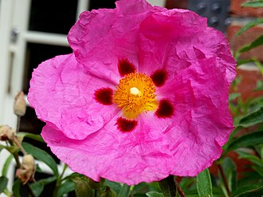](plant-images/cistus.jpg) [*Cistus* × *purpureus* 'Alan Fradd'](https://www.rhs.org.uk/plants/91672/cistus-purpureus-alan-fradd/details) — Rock rose Springfield Rd | 0.5–1m × 0.5–1m† | Jun–Jul | Spectacular; short-lived, around ten years | 3L |
| **1** |  [*Brachyglottis* 'Sunshine'](https://www.rhs.org.uk/plants/86133/brachyglottis-dunedin-group-sunshine/details) — Dunedin daisy bush Sussex Sq | 1–1.5m × 1–1.5m† | Jun–Jul | Silver felted evergreen daisy bush | 3L |

**Front ribbon**

| Qty | Plant | Mature H × S | Flowers | Note | Supply |
|---|:---:|---|---|---|---|
| **3** |  [*Lavandula angustifolia* 'Hidcote'](https://www.rhs.org.uk/plants/96353/lavandula-angustifolia-hidcote/details) — English lavender Springfield Rd | 0.1–0.5m × 0.5–1m† | Jun–Aug | — | 2L |
| **3** |  [*Nepeta* × *faassenii* 'Walker's Low'](https://www.rhs.org.uk/plants/210480/nepeta-faassenii-walker-s-low/details) — Catmint Sussex Sq | 0.1–0.5m × 0.1–0.5m† | Jun–Sep | Shear after the first flush | 1–2L |
| **3** | [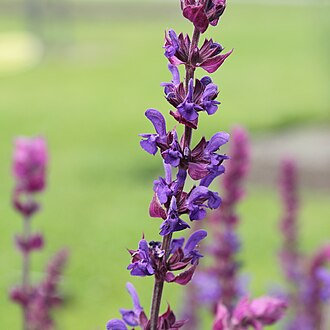](plant-images/salvia_nem.jpg) [*Salvia nemorosa* 'Caradonna'](https://www.rhs.org.uk/plants/194596/salvia-nemorosa-caradonna/details) — Balkan clary Sussex Sq | 0.1–0.5m × 0.1–0.5m† | May–Jul | The sharpest contrast against silver foliage | 1–2L |
| **3** | [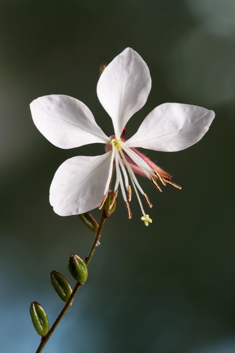](plant-images/gaura.jpg) [*Oenothera lindheimeri* 'Whirling Butterflies'](https://www.rhs.org.uk/plants/386447/oenothera-lindheimeri-whirling-butterflies-g/details) — Gaura New | 0.5–1m × 0.5–1m† | Jun–Oct | White butterflies on wiry stems that ride the wind; hates only winter wet | 2L |
| **2** |  [*Hylotelephium* 'Matrona'](https://www.rhs.org.uk/plants/356925/hylotelephium-matrona/details) — Stonecrop / iceplant Sussex Sq | 0.5–1m × 0.1–0.5m† | Aug–Oct | Seed heads stand all winter | 2L |

**Bulbs — planted Oct–Nov, threaded between the plants**

| Qty | Bulb | Flowers |
|---|:---:|---|
| **20** |  [*Allium hollandicum* 'Purple Sensation'](https://www.rhs.org.uk/plants/57088/allium-hollandicum-purple-sensation/details) — Ornamental onion | May, purple drumsticks |
| **10** |  [*Allium cristophii*](https://www.rhs.org.uk/plants/816/allium-cristophii/details) — Star of Persia | May–Jun |
| **35** |  [*Narcissus poeticus* var. *recurvus*](https://www.rhs.org.uk/plants/76534/i-narcissus-poeticus-i-var-i-recurvus-i-(13)/details) — Pheasant's eye | May, white with a red-rimmed eye |
| **15** |  [*Tulipa clusiana* 'Lady Jane'](https://www.rhs.org.uk/plants/194056/tulipa-lady-jane-15/details) — Lady tulip | Apr, white / rose |
| **30** |  [*Crocus tommasinianus*](https://www.rhs.org.uk/plants/25699/crocus-tommasinianus/details) — Early crocus | Feb, lilac |
| **20** |  [*Muscari armeniacum* 'Valerie Finnis'](https://www.rhs.org.uk/plants/131700/muscari-armeniacum-valerie-finnis/details) — Grape hyacinth | Apr, pale powder blue |
| **8** |  [*Nectaroscordum siculum*](https://www.rhs.org.uk/plants/96507/nectaroscordum-siculum/details) — Sicilian honey garlic | Jun, cream / green / maroon bells |

*M1(W) total: **19 plants** + **138 bulbs***

### M1(N) — Main terrace — **north** edge of the raised dining deck

*≈1.1m long × 600mm deep · 500mm high*

Deliberately the quietest planter on the terrace. It sits beside the three steps down to the
lounge and directly in the north-east view corridor, so it is one clipped **'Golf Ball'** dome and a low
skirt of catmint — enough to soften the step edge, not enough to interrupt anything. Crocus and dwarf
daffodils in spring, and then it gets out of the way.

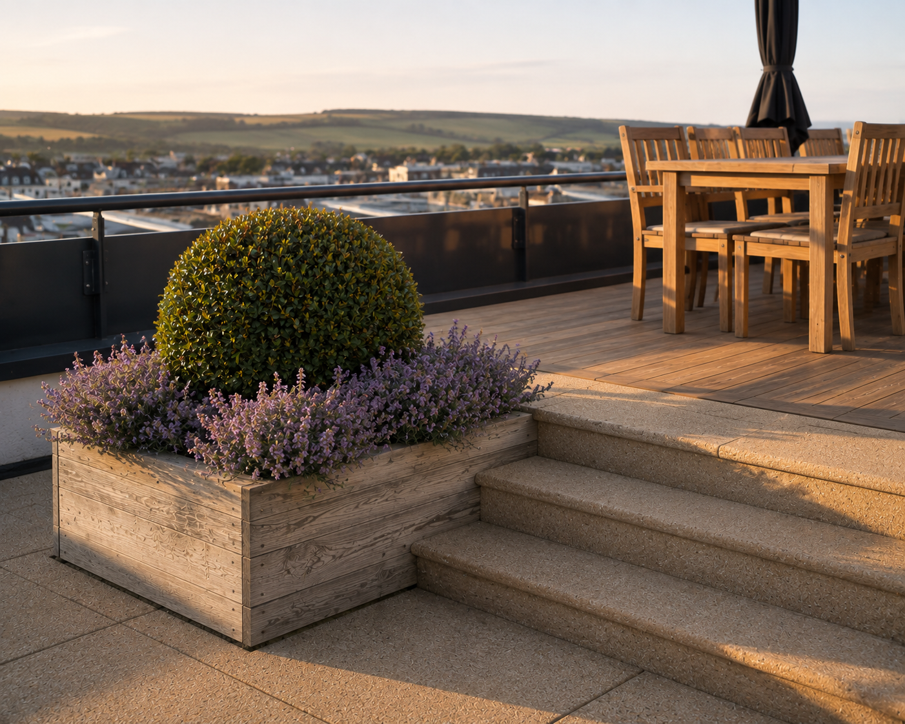

> **Why it is planted this way.** Deliberately kept low — this sits beside the three steps down to the lounge, and it is directly in the north-east view corridor from the dining table. **Nothing here above ~1m total.**

> **Mulch and feeding:** 10mm gravel collar, ~300mm ring. Slow-release granular feed each April; **no compost** — see §12.

**Back**

| Qty | Plant | Mature H × S | Flowers | Note | Supply |
|---|:---:|---|---|---|---|
| **1** |  [*Pittosporum tenuifolium* 'Golf Ball'](https://www.rhs.org.uk/plants/246352/pittosporum-tenuifolium-golf-ball/details) — Dwarf kohuhu Sussex Sq | 0.5–1m × 0.5–1m† | — | Naturally spherical, clipped to 60–80cm; the repeating rhythm | 5L |

**Front**

| Qty | Plant | Mature H × S | Flowers | Note | Supply |
|---|:---:|---|---|---|---|
| **3** |  [*Nepeta* × *faassenii* 'Walker's Low'](https://www.rhs.org.uk/plants/210480/nepeta-faassenii-walker-s-low/details) — Catmint Sussex Sq | 0.1–0.5m × 0.1–0.5m† | Jun–Sep | Shear after the first flush | 1–2L |

**Bulbs — planted Oct–Nov, threaded between the plants**

| Qty | Bulb | Flowers |
|---|:---:|---|
| **15** |  [*Crocus tommasinianus*](https://www.rhs.org.uk/plants/25699/crocus-tommasinianus/details) — Early crocus | Feb, lilac |
| **10** |  [*Narcissus* 'Tête-à-tête'](https://www.rhs.org.uk/plants/89723/narcissus-tete-a-tete-12/details) — Dwarf daffodil | Feb–Mar, 15cm |
| **10** |  [*Muscari armeniacum* 'Valerie Finnis'](https://www.rhs.org.uk/plants/131700/muscari-armeniacum-valerie-finnis/details) — Grape hyacinth | Apr, pale powder blue |

*M1(N) total: **4 plants** + **35 bulbs***

### M2(E) — north half — Main terrace, east parapet — **north half (≈2.5m)**

*1,000mm deep · **700mm high planter** · raised level, parapet 1,000mm above FFL*

The shingle bank — the most Sussex thing on the roof, on the seaward parapet where it belongs. A
single airy multi-stem olive stands at the north end, nearest the hot tub, with nothing but mats
beneath it: sea thrift, cheddar pinks, blue fescue, rock samphire and the blue-grey trailing whorls
of *Euphorbia myrsinites* — the community of a Sussex shingle beach, transplanted three storeys up.
You look straight over it to the Downs. The olive's job is discreet: its canopy, two metres and more
above the planter rim, breaks up the diagonal sightline from the neighbours' upper windows down into
the tub for the times the parasols are furled. An olive filters rather than blocks — you can see
through it, particularly low down, which is exactly the brief.

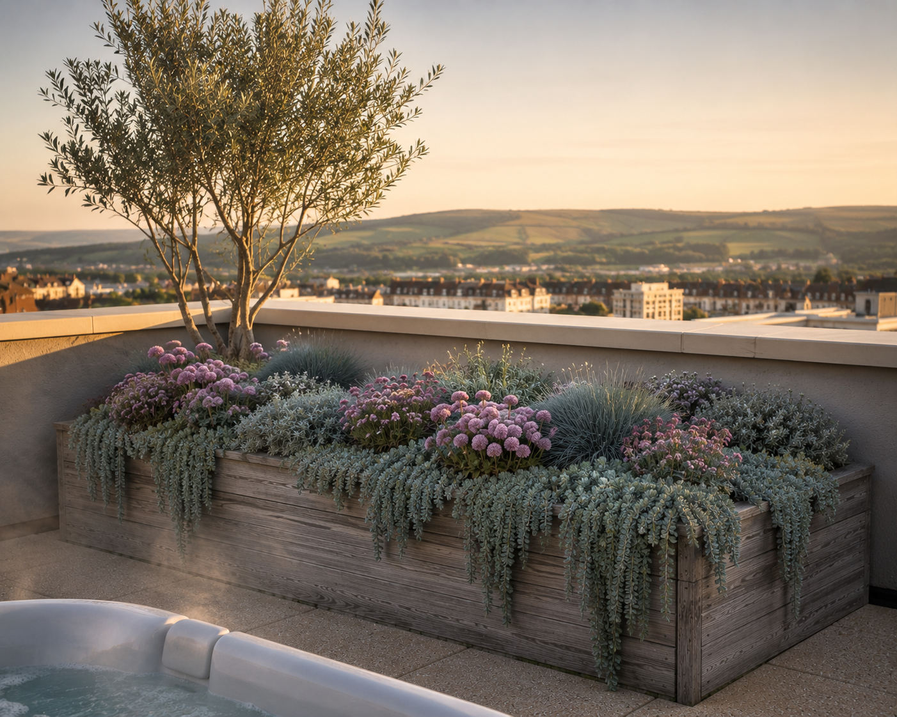

> **Why it is planted this way.** The review killed the crown-lifted strawberry trees here — the size
> that screens in year one doesn't exist to buy at sane money, and *Arbutus* sheds fruit and leathery
> leaves upwind of the tub. But the client still wants standing cover at high level, because the
> parasols won't always be open. One ordinary multi-stem olive is the answer: bought at 1.75–2.0m it
> gives real presence around 2.0–2.7m above the rim immediately, its canopy is naturally open (a
> filter, not a wall), its leaf drop is small-leaved and modest, and it extends the olive language the
> heritage argument already leans on. The understorey stays capped at 300mm — nothing breaks the line
> of the coping, and the view east to the Downs is untouched.

> **Mulch and feeding:** 10mm gravel collar, ~300mm ring. Slow-release granular feed each April; **no compost** — see §12.

**Canopy — an airy filter, not a wall**

| Qty | Plant | Mature H × S | Flowers | Note | Supply |
|---|:---:|---|---|---|---|
| **1** |  [*Olea europaea* — multi-stem](https://www.rhs.org.uk/plants/11735/olea-europaea-f-/details) — Olive Sussex Sq | 4–8m × 1.5–2.5m† | Jun–Jul | Ordinary multi-stem — an airy filter, not a wall | 45–60L · 1.75–2.0m |

**Low layer — mats only, nothing above ~300mm from the rim**

| Qty | Plant | Mature H × S | Flowers | Note | Supply |
|---|:---:|---|---|---|---|
| **5** |  [*Armeria maritima*](https://www.rhs.org.uk/plants/1597/armeria-maritima/details) — Sea thrift New | 0.1–0.5m × 0.1–0.5m† | Apr–Jun | UK coastal native; evergreen cushions | 9cm–1L |
| **3** |  [*Dianthus gratianopolitanus*](https://www.rhs.org.uk/plants/5722/dianthus-gratianopolitanus/details) — Cheddar pink New | 0.1–0.5m × 0.1–0.5m† | May–Jul | UK native; strongly clove-scented evergreen mats | 1L |
| **3** | [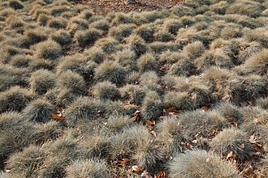](plant-images/festuca.jpg) [*Festuca glauca* 'Elijah Blue'](https://www.rhs.org.uk/plants/104179/festuca-glauca-elijah-blue/details) — Blue fescue Sussex Sq | 0.1–0.5m × 0.1–0.5m† | Late spring–summer | Blue-grey evergreen tussock; texture all year | 1L |
| **3** | [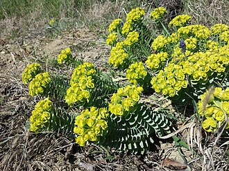](plant-images/euph_myrs.jpg) [*Euphorbia myrsinites*](https://www.rhs.org.uk/plants/7073/euphorbia-myrsinites/details) — Myrtle spurge Sussex Sq | up to 10cm × 0.1–0.5m† | Mar–May | ⚠️ Trailing succulent; drapes and never needs cutting | 1L |
| **2** | [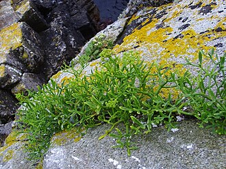](plant-images/crithmum.jpg) [*Crithmum maritimum*](https://www.rhs.org.uk/plants/24479/crithmum-maritimum/details) — Rock samphire New | 0.1–0.5m × 0.1–0.5m† | Apr–Sep | UK shingle-shore native; succulent and edible | 1L |

**Bulbs — planted Oct–Nov, threaded between the plants**

| Qty | Bulb | Flowers |
|---|:---:|---|
| **20** |  [*Crocus tommasinianus*](https://www.rhs.org.uk/plants/25699/crocus-tommasinianus/details) — Early crocus | Feb, lilac |
| **15** |  [*Iris reticulata* 'Harmony' + 'Katharine Hodgkin'](https://www.rhs.org.uk/plants/9343/iris-reticulata-harmony/details) — Dwarf iris | Feb, deep and pale blue |
| **10** |  [*Muscari armeniacum* 'Valerie Finnis'](https://www.rhs.org.uk/plants/131700/muscari-armeniacum-valerie-finnis/details) — Grape hyacinth | Apr, pale powder blue |
| **15** |  [*Narcissus* 'Tête-à-tête'](https://www.rhs.org.uk/plants/89723/narcissus-tete-a-tete-12/details) — Dwarf daffodil | Feb–Mar, 15cm |
| **10** |  [*Tulipa* 'Little Beauty'](https://www.rhs.org.uk/plants/155507/tulipa-little-beauty-15/details) — Species tulip | Apr, 15cm, magenta with a blue eye |

*M2(E) — north half total: **17 plants** + **70 bulbs***

### M2(E) — south half — Main terrace, east parapet — **south half (≈2.6m)**

*1,000mm deep · 700mm high planter · raised level, parapet 1,000mm above FFL*

All the height on the east run is gathered here, away from the view corridor: a
1.5–2m informal evergreen block that shelters both the lounge and the dining deck from the east. Escallonia
for pink flower from June to September, the *Phillyrea* — the glossy self-shaping Mediterranean evergreen
the palette was missing — for structure, a second dwarf *Pittosporum tobira* dome for honey scent in early
summer, *Abelia* to carry it into October, *Coronilla* for the depths of winter. At the back, *Olearia* ×
*haastii* — the classic seaside daisy bush — carries white flowers through high summer and is the best
salt windbreak there is, reduced once a year from the front like the *Atriplex*. The front
ribbon is where the autumn lives — *Hylotelephium*, *Aster* 'Mönch' in lavender-blue — and three
*Iris unguicularis* tucked at the sunny foot of it, flowering lilac in November when nothing else is.

> **Why it is planted this way.** All the taller shrub mass on this run is concentrated here, away from the view corridor — a 1.5–2m informal evergreen block giving east wind shelter to the lounge and the dining deck. The parapet holds only the lowest 300mm, so every shrub here is chosen for a mature spread of no more than about 1.6m: enough to sit within the 1,000mm planter without cantilevering far past the coping.

> **Mulch and feeding:** 10mm gravel collar, ~300mm ring. Slow-release granular feed each April; **no compost** — see §12.

**Back row**

| Qty | Plant | Mature H × S | Flowers | Note | Supply |
|---|:---:|---|---|---|---|
| **1** | [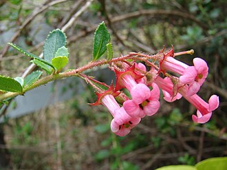](plant-images/escallonia.jpg) [*Escallonia* 'Apple Blossom'](https://www.rhs.org.uk/plants/96211/escallonia-apple-blossom/details) — Escallonia New | 1.5–2.5m × 1.5–2.5m† | Jun–Sep | Informal shrub; occasional reduction from the front only | 7.5L |
| **1** | [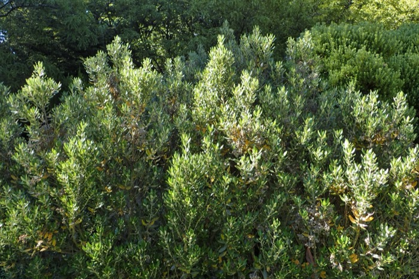](plant-images/olearia.jpg) [*Olearia* × *haastii*](https://www.rhs.org.uk/plants/94555/olearia-x-haastii/details) — Daisy bush New | 1.5–2m × 2m† | Jul–Aug | The classic seaside daisy bush — white daisies in high summer; occasional reduction from the front | 5L |
| **1** | [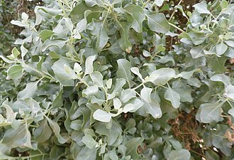](plant-images/atriplex.jpg) [*Atriplex halimus*](https://www.rhs.org.uk/plants/1903/atriplex-halimus/details) — Tree purslane New | 1.5–2.5m × 1–1.5m† | Summer | ⚠️ Brightest silver shrub there is — cut hard back every spring | 3L |

**Mid row**

| Qty | Plant | Mature H × S | Flowers | Note | Supply |
|---|:---:|---|---|---|---|
| **1** |  [*Phillyrea angustifolia*](https://www.rhs.org.uk/plants/24488/phillyrea-angustifolia/details) — Phillyrea New | 2.5–4m × 1.5–2.5m† | May–Jun | Glossy, self-shaping evergreen — the palette was missing it | 5L |
| **1** |  [*Pittosporum tobira* 'Nanum'](https://www.rhs.org.uk/plants/61258/pittosporum-tobira-nanum/details) — Dwarf Japanese pittosporum Sussex Sq | 0.6–1m × 0.6–1m† | May–Jun | Self-shaping glossy dome; honey-scented cream flowers | 3L |
| **1** |  [*Cistus* × *purpureus* 'Alan Fradd'](https://www.rhs.org.uk/plants/91672/cistus-purpureus-alan-fradd/details) — Rock rose Springfield Rd | 0.5–1m × 0.5–1m† | Jun–Jul | Spectacular; short-lived, around ten years | 3L |
| **1** | [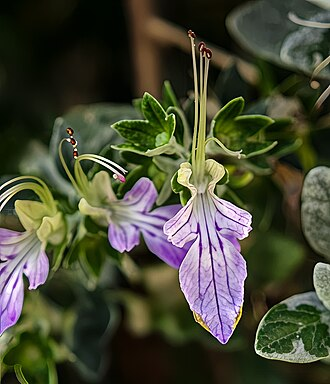](plant-images/teucrium.jpg) [*Teucrium fruticans* 'Azureum'](https://www.rhs.org.uk/plants/74406/teucrium-fruticans-azureum/details) — Tree germander New | 1–1.5m × 1–1.5m† | May–Sep | Silver-blue evergreen foliage | 3L |
| **1** | [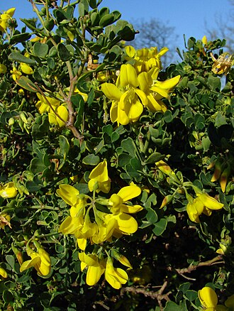](plant-images/coronilla.jpg) [*Coronilla valentina* subsp. *glauca* 'Citrina'](https://www.rhs.org.uk/plants/53148/coronilla-valentina-subsp-glauca-citrina/details) — Yellow coronilla Sussex Sq | 0.5–1m × 0.5–1m† | Dec–Apr | The winter-flowering shrub, scented at midday | 3L |
| **1** | [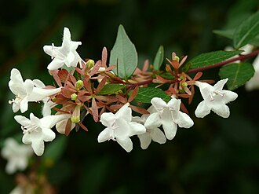](plant-images/abelia.jpg) [*Abelia* × *grandiflora*](https://www.rhs.org.uk/plants/100036/abelia-x-grandiflora/details) — Glossy abelia Springfield Rd | 2.5–4m × 2.5–4m† | Jul–Oct | Arching stems; serious pollinator plant | 5L |

**Front ribbon**

| Qty | Plant | Mature H × S | Flowers | Note | Supply |
|---|:---:|---|---|---|---|
| **3** | [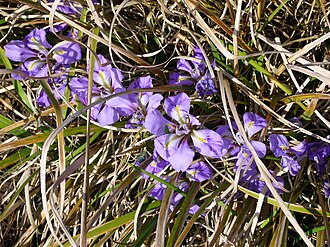](plant-images/iris_ung.jpg) [*Iris unguicularis*](https://www.rhs.org.uk/plants/24998/iris-unguicularis/details) — Algerian iris New | 0.1–0.5m × 0.1–0.5m† | Nov–Mar | Wants poor soil and a hot dry summer bake | 1–2L |
| **3** | [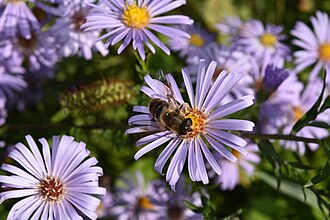](plant-images/aster.jpg) [*Aster* × *frikartii* 'Mönch'](https://www.rhs.org.uk/plants/93410/aster-x-frikartii-monch/details) — Michaelmas daisy Sussex Sq | 0.5–1m × 0.1–0.5m† | Aug–Oct | Critical late nectar for butterflies before hibernation | 2L |
| **3** | [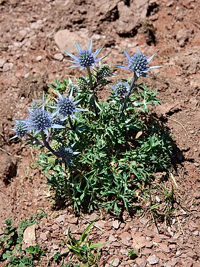](plant-images/eryngium.jpg) [*Eryngium bourgatii* 'Picos Blue'](https://www.rhs.org.uk/plants/129742/eryngium-bourgatii-picos-blue/details) — Sea holly Sussex Sq | 0.5–1m × 0.1–0.5m† | Jun–Aug | Wind-proof; top-rated for pollinators | 1–2L |
| **3** |  [*Santolina chamaecyparissus*](https://www.rhs.org.uk/plants/19856/santolina-chamaecyparissus-lavender-cotton-cotton-lavender/details) — Cotton lavender Sussex Sq | 0.1–0.5m × 0.5–1m† | Summer | Shear the buds in June if they jar | 2L |
| **2** |  [*Hylotelephium* 'Matrona'](https://www.rhs.org.uk/plants/356925/hylotelephium-matrona/details) — Stonecrop / iceplant Sussex Sq | 0.5–1m × 0.1–0.5m† | Aug–Oct | Seed heads stand all winter | 2L |

**Bulbs — planted Oct–Nov, threaded between the plants**

| Qty | Bulb | Flowers |
|---|:---:|---|
| **25** |  [*Allium hollandicum* 'Purple Sensation'](https://www.rhs.org.uk/plants/57088/allium-hollandicum-purple-sensation/details) — Ornamental onion | May, purple drumsticks |
| **10** |  [*Allium cristophii*](https://www.rhs.org.uk/plants/816/allium-cristophii/details) — Star of Persia | May–Jun |
| **30** |  [*Allium sphaerocephalon*](https://www.rhs.org.uk/plants/870/allium-sphaerocephalon-round-headed-leek-round-headed-garlic/details) — Drumstick allium | Jul, wine-purple |
| **35** |  [*Narcissus poeticus* var. *recurvus*](https://www.rhs.org.uk/plants/76534/i-narcissus-poeticus-i-var-i-recurvus-i-(13)/details) — Pheasant's eye | May, white with a red-rimmed eye |
| **15** |  [*Narcissus* 'Rijnveld's Early Sensation'](https://www.rhs.org.uk/plants/55821/narcissus-rijnvelds-early-sensation-1/details) — Daffodil | January |
| **20** |  [*Tulipa saxatilis* (Bakeri Gp) 'Lilac Wonder'](https://www.rhs.org.uk/plants/67509/tulipa-saxatilis-bakeri-group-lilac-wonder-15/details) — Cretan tulip | Apr, lilac-pink, yellow eye |
| **20** |  [*Gladiolus communis* subsp. *byzantinus*](https://www.rhs.org.uk/plants/89297/gladiolus-communis-subsp-byzantinus/details) — Byzantine gladiolus | May–Jun, magenta |
| **20** |  [*Crocus tommasinianus*](https://www.rhs.org.uk/plants/25699/crocus-tommasinianus/details) — Early crocus | Feb, lilac |
| **8** |  [*Crocus speciosus*](https://www.rhs.org.uk/plants/4941/crocus-speciosus/details) — Autumn crocus | Oct, violet-blue |

*M2(E) — south half total: **23 plants** + **183 bulbs***

### M2(S) — Main terrace — **south** return of the SE L

*3.5m external / 2.5m internal × **1,000mm deep** · 700mm high · raised level, parapet 1,000mm above FFL*

The heritage picture, and the one you look straight at from the dining table: the hero of the
five olives — genuinely gnarled, aged-trunk character — rising out of a silver thicket, in the deepest
planter on the terrace and outside every protected sightline, so it is allowed real height. Around it,
tree purslane at its brightest silver, *Escallonia* for pink summer flower, a *Cistus* opening
white-with-a-maroon-blotch in June, silver-blue *Teucrium*, and *Coronilla* flowering pale lemon through
the middle of winter. At the front, a fuller drift of Russian sage, a perennial wallflower and blue oat
grass carry it from midsummer into autumn, and two *Iris unguicularis* flower at the sunny foot of it in
November when nothing else is.

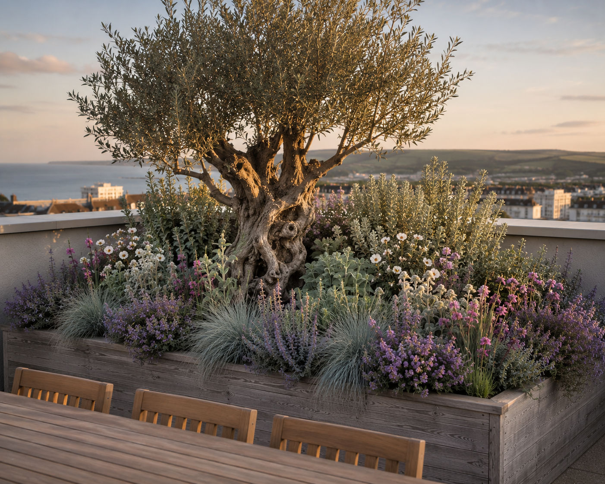

> **Why it is planted this way.** The heritage focal point, seen head-on from the dining table and the lounge, and outside every protected view corridor — so this is where the scheme is allowed real height. The 1m depth also gives the setback that removes the need for fall-protection glass along this edge. This is the one place the character budget is spent: one genuinely gnarled olive, seen head-on from the dining table, rather than four half-gnarled ones nobody looks at closely. The other four olives are ordinary multi-stems — olives gnarl in place; that is what they do.

> **Mulch and feeding:** 10mm gravel collar, ~300mm ring. Slow-release granular feed each April; **no compost** — see §12.

**Back row**

| Qty | Plant | Mature H × S | Flowers | Note | Supply |
|---|:---:|---|---|---|---|
| **1** |  [*Olea europaea* — multi-stem, gnarled](https://www.rhs.org.uk/plants/11735/olea-europaea-f-/details) — Olive Sussex Sq | 4–8m × 1.5–2.5m† | Jun–Jul | The hero — genuinely gnarled, aged-trunk character | 45–60L · 1.75–2.0m |
| **1** |  [*Atriplex halimus*](https://www.rhs.org.uk/plants/1903/atriplex-halimus/details) — Tree purslane New | 1.5–2.5m × 1–1.5m† | Summer | ⚠️ Brightest silver shrub there is — cut hard back every spring | 3L |
| **1** |  [*Escallonia* 'Apple Blossom'](https://www.rhs.org.uk/plants/96211/escallonia-apple-blossom/details) — Escallonia New | 1.5–2.5m × 1.5–2.5m† | Jun–Sep | Informal shrub; occasional reduction from the front only | 7.5L |

**Mid row**

| Qty | Plant | Mature H × S | Flowers | Note | Supply |
|---|:---:|---|---|---|---|
| **1** |  [*Cistus* × *purpureus* 'Alan Fradd'](https://www.rhs.org.uk/plants/91672/cistus-purpureus-alan-fradd/details) — Rock rose Springfield Rd | 0.5–1m × 0.5–1m† | Jun–Jul | Spectacular; short-lived, around ten years | 3L |
| **1** |  [*Teucrium fruticans* 'Azureum'](https://www.rhs.org.uk/plants/74406/teucrium-fruticans-azureum/details) — Tree germander New | 1–1.5m × 1–1.5m† | May–Sep | Silver-blue evergreen foliage | 3L |
| **1** |  [*Coronilla valentina* subsp. *glauca* 'Citrina'](https://www.rhs.org.uk/plants/53148/coronilla-valentina-subsp-glauca-citrina/details) — Yellow coronilla Sussex Sq | 0.5–1m × 0.5–1m† | Dec–Apr | The winter-flowering shrub, scented at midday | 3L |
| **1** |  [*Brachyglottis* 'Sunshine'](https://www.rhs.org.uk/plants/86133/brachyglottis-dunedin-group-sunshine/details) — Dunedin daisy bush Sussex Sq | 1–1.5m × 1–1.5m† | Jun–Jul | Silver felted evergreen daisy bush | 3L |
| **1** | [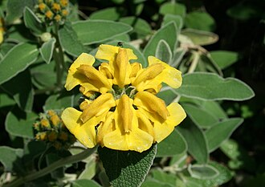](plant-images/phlomis.jpg) [*Phlomis fruticosa*](https://rhs.org.uk/plants/details?plantid=1426) — Jerusalem sage Sussex Sq | 0.5–1m × 1–1.5m† | Jun–Jul | Felted grey-green year-round, then sculptural seed heads | 3L |

**Front ribbon**

| Qty | Plant | Mature H × S | Flowers | Note | Supply |
|---|:---:|---|---|---|---|
| **5** | [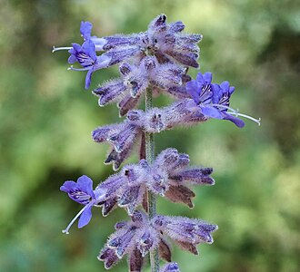](plant-images/yangii.jpg) [*Salvia yangii* 'Little Spire'](https://www.rhs.org.uk/plants/135978/perovskia-atriplicifolia-little-spire/details) — Russian sage New | 0.5–1m × 0.5–1m† | Aug–Oct | Compact form, kept over the taller 'Blue Spires', which flops in wind | 2L |
| **3** | [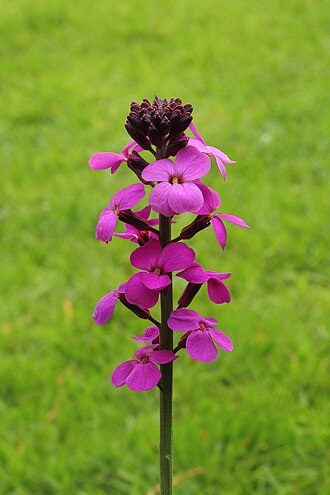](plant-images/erysimum.jpg) [*Erysimum* 'Bowles's Mauve'](https://www.rhs.org.uk/plants/91464/erysimum-bowless-mauve/details) — Perennial wallflower New | 0.5–1m × 0.5–1m† | Mar–Nov | Unbeatable first-year value; short-lived (~3 yrs) | 2L |
| **3** |  [*Helictotrichon sempervirens*](https://www.rhs.org.uk/plants/8555/helictotrichon-sempervirens/details) — Blue oat grass New | 1–1.5m × 0.5–1m† | Summer | The wind made visible; comb out dead leaves in spring | 2L |
| **2** |  [*Iris unguicularis*](https://www.rhs.org.uk/plants/24998/iris-unguicularis/details) — Algerian iris New | 0.1–0.5m × 0.1–0.5m† | Nov–Mar | Wants poor soil and a hot dry summer bake | 1–2L |

**Bulbs — planted Oct–Nov, threaded between the plants**

| Qty | Bulb | Flowers |
|---|:---:|---|
| **20** |  [*Allium hollandicum* 'Purple Sensation'](https://www.rhs.org.uk/plants/57088/allium-hollandicum-purple-sensation/details) — Ornamental onion | May, purple drumsticks |
| **5** |  [*Allium cristophii*](https://www.rhs.org.uk/plants/816/allium-cristophii/details) — Star of Persia | May–Jun |
| **20** |  [*Allium sphaerocephalon*](https://www.rhs.org.uk/plants/870/allium-sphaerocephalon-round-headed-leek-round-headed-garlic/details) — Drumstick allium | Jul, wine-purple |
| **15** |  [*Narcissus poeticus* var. *recurvus*](https://www.rhs.org.uk/plants/76534/i-narcissus-poeticus-i-var-i-recurvus-i-(13)/details) — Pheasant's eye | May, white with a red-rimmed eye |
| **15** |  [*Narcissus* 'Rijnveld's Early Sensation'](https://www.rhs.org.uk/plants/55821/narcissus-rijnvelds-early-sensation-1/details) — Daffodil | January |
| **15** |  [*Tulipa clusiana* 'Lady Jane'](https://www.rhs.org.uk/plants/194056/tulipa-lady-jane-15/details) — Lady tulip | Apr, white / rose |
| **15** |  [*Gladiolus communis* subsp. *byzantinus*](https://www.rhs.org.uk/plants/89297/gladiolus-communis-subsp-byzantinus/details) — Byzantine gladiolus | May–Jun, magenta |
| **25** |  [*Crocus tommasinianus*](https://www.rhs.org.uk/plants/25699/crocus-tommasinianus/details) — Early crocus | Feb, lilac |
| **15** |  [*Iris reticulata* 'Harmony' + 'Katharine Hodgkin'](https://www.rhs.org.uk/plants/9343/iris-reticulata-harmony/details) — Dwarf iris | Feb, deep and pale blue |
| **7** |  [*Crocus speciosus*](https://www.rhs.org.uk/plants/4941/crocus-speciosus/details) — Autumn crocus | Oct, violet-blue |
| **7** |  [*Nectaroscordum siculum*](https://www.rhs.org.uk/plants/96507/nectaroscordum-siculum/details) — Sicilian honey garlic | Jun, cream / green / maroon bells |

*M2(S) total: **21 plants** + **159 bulbs***

### M4 — Main terrace — **north** of the lounge seating

*2.70m long × 600mm deep · 700mm high planter · parapet here is 1,300mm above FFL*

A low green fringe on the north side of the lounge, capped at a metre so the Downs stay visible
from the sauna. It grades along its length: a purple 'Tom Thumb' dome, two bright green *Hebe* and a
drift of blue oat grass — the wind made visible from the lounge — at the west end where there is room,
dropping to prostrate rosemary, sea thrift, cheddar pinks and trailing *Euphorbia myrsinites* at the east
end where the sightline is tightest. Two *Hylotelephium* give it an autumn, and autumn crocus comes up
violet-blue out of it in October.

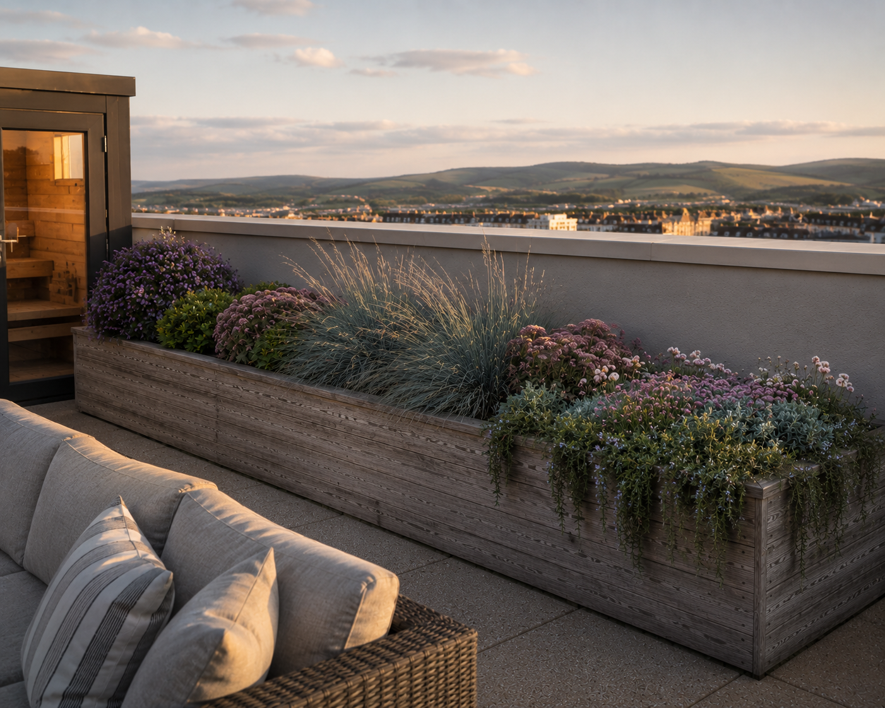

> **Why it is planted this way.** **Height cap: 1m above the planter rim — 1.7m above finished floor level — and lower at the east end.** M4 sits in the view of the Downs from the sauna, so it is graded: domes and grasses to the full 1m at the west end, dropping to mats at the east end where the sightline is tightest. At 1.7m it still does useful work as a north / north-east windbreak for the lounge. Nothing in it is ever pruned beyond the grass comb-out.

> **Mulch and feeding:** 10mm gravel collar, ~300mm ring. Slow-release granular feed each April; **no compost** — see §12.

**West end — domes to ~1m above the rim**

| Qty | Plant | Mature H × S | Flowers | Note | Supply |
|---|:---:|---|---|---|---|
| **1** |  [*Pittosporum tenuifolium* 'Tom Thumb'](https://www.rhs.org.uk/plants/77301/pittosporum-tenuifolium-tom-thumb/details) — Purple dwarf kohuhu Sussex Sq | 0.5–1m × 0.5–1m† | — | Naturally rounded purple-bronze dome, no pruning ever | 5L |
| **2** | [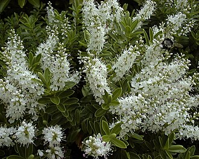](plant-images/hebe.jpg) [*Hebe* (*Veronica*) 'Rakaiensis'](https://www.rhs.org.uk/plants/8357/rakai-hebe/details) — Shrubby veronica Springfield Rd | 0.5–1m × 1–1.5m† | Jun–Jul | Tight bright-green evergreen domes | 2L |
| **2** |  [*Hylotelephium* 'Matrona'](https://www.rhs.org.uk/plants/356925/hylotelephium-matrona/details) — Stonecrop / iceplant Sussex Sq | 0.5–1m × 0.1–0.5m† | Aug–Oct | Seed heads stand all winter | 2L |
| **3** |  [*Helictotrichon sempervirens*](https://www.rhs.org.uk/plants/8555/helictotrichon-sempervirens/details) — Blue oat grass New | 1–1.5m × 0.5–1m† | Summer | The wind made visible; comb out dead leaves in spring | 2L |

**East end — tapering to mats, ~150–300mm**

| Qty | Plant | Mature H × S | Flowers | Note | Supply |
|---|:---:|---|---|---|---|
| **2** |  [*Salvia rosmarinus* 'Prostratus'](https://www.rhs.org.uk/plants/386334/salvia-rosmarinus-prostrata-group-ro/details) — Trailing rosemary Springfield Rd | 0.1–0.5m × 1–1.5m† | Spring–summer | Evergreen, culinary; trails over the planter edges | 2L |
| **2** |  [*Armeria maritima*](https://www.rhs.org.uk/plants/1597/armeria-maritima/details) — Sea thrift New | 0.1–0.5m × 0.1–0.5m† | Apr–Jun | UK coastal native; evergreen cushions | 9cm–1L |
| **2** |  [*Dianthus gratianopolitanus*](https://www.rhs.org.uk/plants/5722/dianthus-gratianopolitanus/details) — Cheddar pink New | 0.1–0.5m × 0.1–0.5m† | May–Jul | UK native; strongly clove-scented evergreen mats | 1L |
| **2** |  [*Euphorbia myrsinites*](https://www.rhs.org.uk/plants/7073/euphorbia-myrsinites/details) — Myrtle spurge Sussex Sq | up to 10cm × 0.1–0.5m† | Mar–May | ⚠️ Trailing succulent; drapes and never needs cutting | 1L |

**Bulbs — planted Oct–Nov, threaded between the plants**

| Qty | Bulb | Flowers |
|---|:---:|---|
| **30** |  [*Crocus tommasinianus*](https://www.rhs.org.uk/plants/25699/crocus-tommasinianus/details) — Early crocus | Feb, lilac |
| **20** |  [*Muscari armeniacum* 'Valerie Finnis'](https://www.rhs.org.uk/plants/131700/muscari-armeniacum-valerie-finnis/details) — Grape hyacinth | Apr, pale powder blue |
| **20** |  [*Iris reticulata* 'Harmony' + 'Katharine Hodgkin'](https://www.rhs.org.uk/plants/9343/iris-reticulata-harmony/details) — Dwarf iris | Feb, deep and pale blue |
| **20** |  [*Narcissus* 'Tête-à-tête'](https://www.rhs.org.uk/plants/89723/narcissus-tete-a-tete-12/details) — Dwarf daffodil | Feb–Mar, 15cm |
| **15** |  [*Tulipa* 'Little Beauty'](https://www.rhs.org.uk/plants/155507/tulipa-little-beauty-15/details) — Species tulip | Apr, 15cm, magenta with a blue eye |
| **8** |  [*Crocus speciosus*](https://www.rhs.org.uk/plants/4941/crocus-speciosus/details) — Autumn crocus | Oct, violet-blue |

*M4 total: **16 plants** + **113 bulbs***

### M7 — Main terrace — **west** of the hot tub, between tub and building

*2.0m long × 600mm deep · finishes 150mm above the tub rim*

Between the tub and the sauna wall, so everything in it gets brushed, steamed and looked at from
inside the water. A small **olive** and a **myrtle** for the Mediterranean picture, two bright-green *Hebe*
domes, rosemary arching over the edge, and a silver *Convolvulus*. Every one of them is glossy or tight
and holds its leaves — chosen specifically so nothing sheds into the water.

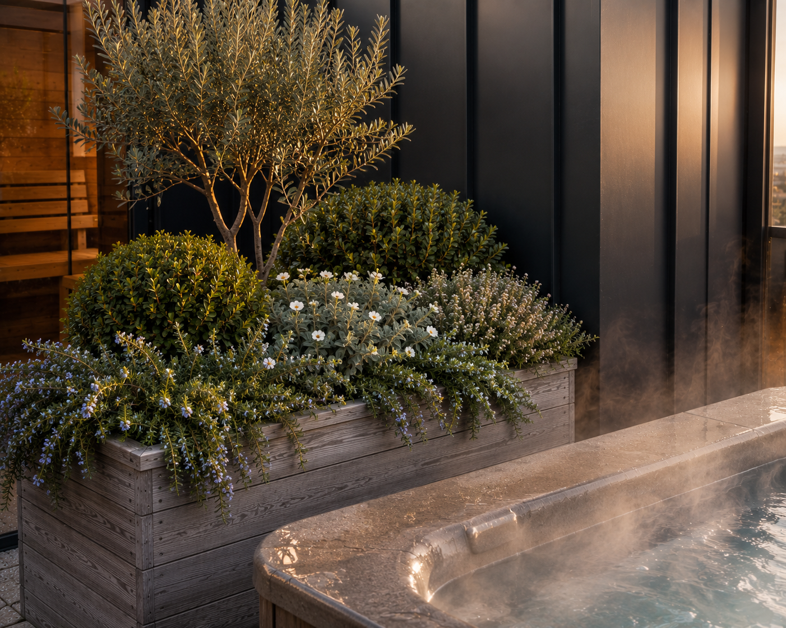

> **Why it is planted this way.** Wind defence on the building side of the tub, and everything you brush past getting in and out is aromatic. **Chosen for low leaf and petal drop** — glossy evergreens that hold their leaves, nothing that sheds spent flowers into the water. **The olive here (and the one in M2(E)) stands upwind of the tub and will shed some small leaf** — the accepted price of standing privacy cover; see §14. See §16 on the hot tub.

> **Mulch and feeding:** 10mm gravel collar, ~300mm ring. Slow-release granular feed each April; **no compost** — see §12.

**Back row**

| Qty | Plant | Mature H × S | Flowers | Note | Supply |
|---|:---:|---|---|---|---|
| **1** |  [*Olea europaea*](https://www.rhs.org.uk/plants/11735/olea-europaea-f-/details) — Olive Sussex Sq | 4–8m × 1.5–2.5m† | Jun–Jul | As above, at a smaller scale | 15–25L · 1.2–1.5m |
| **1** |  [*Myrtus communis* subsp. *tarentina*](https://www.rhs.org.uk/plants/59207/myrtus-communis-subsp-tarentina/details) — Compact myrtle New | 1–1.5m × 1–1.5m† | Jul–Sep | Naturally dense dome; needs no clipping at all | 5L |

**Front ribbon**

| Qty | Plant | Mature H × S | Flowers | Note | Supply |
|---|:---:|---|---|---|---|
| **2** |  [*Hebe* (*Veronica*) 'Rakaiensis'](https://www.rhs.org.uk/plants/8357/rakai-hebe/details) — Shrubby veronica Springfield Rd | 0.5–1m × 1–1.5m† | Jun–Jul | Tight bright-green evergreen domes | 2L |
| **1** |  [*Salvia rosmarinus* 'Severn Sea'](https://www.rhs.org.uk/plants/386349/salvia-rosmarinus-severn-sea-ro/details) — Semi-prostrate rosemary Sussex Sq | 0.5–1m × 0.5–1m† | Feb–May | Flowers when almost nothing else does | 2L |
| **1** | [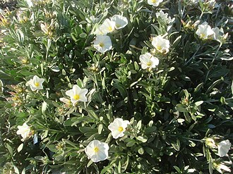](plant-images/convolvulus.jpg) [*Convolvulus cneorum*](https://www.rhs.org.uk/plants/4333/convolvulus-cneorum/details) — Silverbush New | 0.5–1m × 0.5–1m† | May–Sep | The most metallic silver evergreen here | 2L |
| **1** |  [*Thymus vulgaris* · *T.* 'Purple Beauty' · *T. serpyllum*](https://www.rhs.org.uk/plants/18213/thymus-vulgaris/details) — Thyme — 3 forms New | 0.1–0.5m × 0.1–0.5m† | Early summer | Evergreen culinary mats; bees swarm the flowers | 9cm |

**Bulbs — planted Oct–Nov, threaded between the plants**

| Qty | Bulb | Flowers |
|---|:---:|---|
| **30** |  [*Crocus* 'Snow Bunting'](https://www.rhs.org.uk/plants/93896/crocus-chrysanthus-snow-bunting/details) — Crocus | Feb, white, scented |
| **10** |  [*Muscari armeniacum* 'Valerie Finnis'](https://www.rhs.org.uk/plants/131700/muscari-armeniacum-valerie-finnis/details) — Grape hyacinth | Apr, pale powder blue |
| **10** |  [*Tulipa* 'Little Beauty'](https://www.rhs.org.uk/plants/155507/tulipa-little-beauty-15/details) — Species tulip | Apr, 15cm, magenta with a blue eye |

*M7 total: **7 plants** + **50 bulbs***

[↑ Contents](#contents)

---
## 6. The pots

Five groups, all with an odd number of pots except where sharing makes it even. Specification and
material in §7.

### Group A — narrow terrace, south end

The five pots by the study door do the winter work. A clipped bay and a *Phormium tenax* — both the
client's own plants, repotted into new terracotta — for structure, then **Sarcococca** and **Daphne odora** — the two best winter scents in cultivation — placed
exactly where you pass them in the dark in January, with sixty snowdrops and thirty cyclamen underneath.
This is the shadiest, most sheltered corner on the terrace, which is the only reason any of it works.

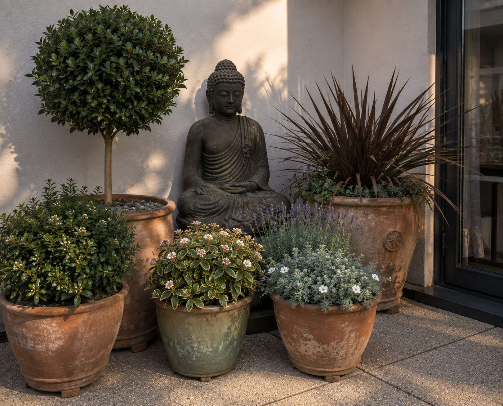

> **5 pots.** The part-shaded corner by the study door, where the winter-scent plants live. Two large, three medium.

> **Mulch and feeding:** no gravel needed — pots are top-dressed with home-made compost each spring. A thin gravel dressing is optional, purely for looks.

| Qty | Plant | Mature H × S | Flowers | Note | Supply | Pot |
|---|---|:---:|---|---|---|---|
| **1** | [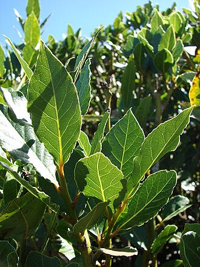](plant-images/bay.jpg) [*Laurus nobilis* — clipped](https://www.rhs.org.uk/plants/9876/laurus-nobilis-bay-tree-bay/details) — Bay Springfield Rd | 8–12m × wider than 8m† | — | Client's own, already clipped — treat RHS size as a ceiling, not reality | Client's own — 60cm · plant not for supply; new pot is | Ø50–60 |
| **1** |  [*Phormium tenax*](https://www.rhs.org.uk/plants/12791/phormium-tenax/details) — New Zealand flax Springfield Rd | 2.5–4m × 1.5–2.5m† | Summer | Client's own — the full species, much larger than 'Bronze Baby' | Client's own — 80cm · plant not for supply; new pot is | Ø50–60 |
| **1** |  [*Sarcococca hookeriana* var. *humilis*](https://www.rhs.org.uk/plants/96875/sarcococca-hookeriana-var-humilis/details) — Sweet box / Christmas box Sussex Sq · Springfield Rd | 0.5–1m × 0.5–1m† | Winter | The most powerful winter scent of any hardy shrub | 3L | Ø40 |
| **1** | [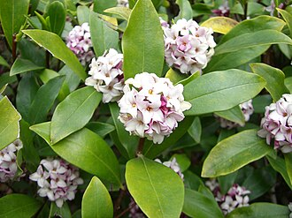](plant-images/daphne.jpg) [*Daphne odora* 'Aureomarginata'](https://www.rhs.org.uk/plants/56422/daphne-odora-aureomarginata-v/details) — Winter daphne Springfield Rd | 1–1.5m × 1–1.5m† | Jan–Mar | ⚠️ Plant once and never move it | 3–5L | Ø40 |
| **1** |  [*Convolvulus cneorum*](https://www.rhs.org.uk/plants/4333/convolvulus-cneorum/details) — Silverbush New | 0.5–1m × 0.5–1m† | May–Sep | The most metallic silver evergreen here | 2L | Ø40 (shared) |
| **1** |  [*Lavandula angustifolia* 'Hidcote'](https://www.rhs.org.uk/plants/96353/lavandula-angustifolia-hidcote/details) — English lavender Springfield Rd | 0.1–0.5m × 0.5–1m† | Jun–Aug | — | 2L | Ø40 (shared) |

| Qty | Bulb | Flowers |
|---|:---:|---|
| **60** |  [*Galanthus nivalis*](https://www.rhs.org.uk/plants/7568/galanthus-nivalis/details) — Snowdrop — buy in the green | Jan–Feb, white |
| **15** |  [*Cyclamen coum*](https://www.rhs.org.uk/plants/5135/cyclamen-coum/details) — Eastern cyclamen | Jan–Mar, pink / white |
| **10** |  [*Cyclamen hederifolium*](https://www.rhs.org.uk/plants/5145/cyclamen-hederifolium/details) — Ivy-leaved cyclamen | Sept–Nov, pink / white |
| **10** |  [*Narcissus* 'Tête-à-tête'](https://www.rhs.org.uk/plants/89723/narcissus-tete-a-tete-12/details) — Dwarf daffodil | Feb–Mar, 15cm |
| **10** |  [*Tulipa clusiana* 'Lady Jane'](https://www.rhs.org.uk/plants/194056/tulipa-lady-jane-15/details) — Lady tulip | Apr, white / rose |
| **10** |  [*Crocus* 'Snow Bunting'](https://www.rhs.org.uk/plants/93896/crocus-chrysanthus-snow-bunting/details) — Crocus | Feb, white, scented |

### Group B — narrow terrace, alongside the outdoor kitchen

Six working pots along the kitchen run: three mints in separate pots because they would
eat any bed they were put in, parsley, coriander, and a pot of chives. Crocus and dwarf
daffodils come up through them before the herbs get going, and autumn cyclamen follow when they die back.

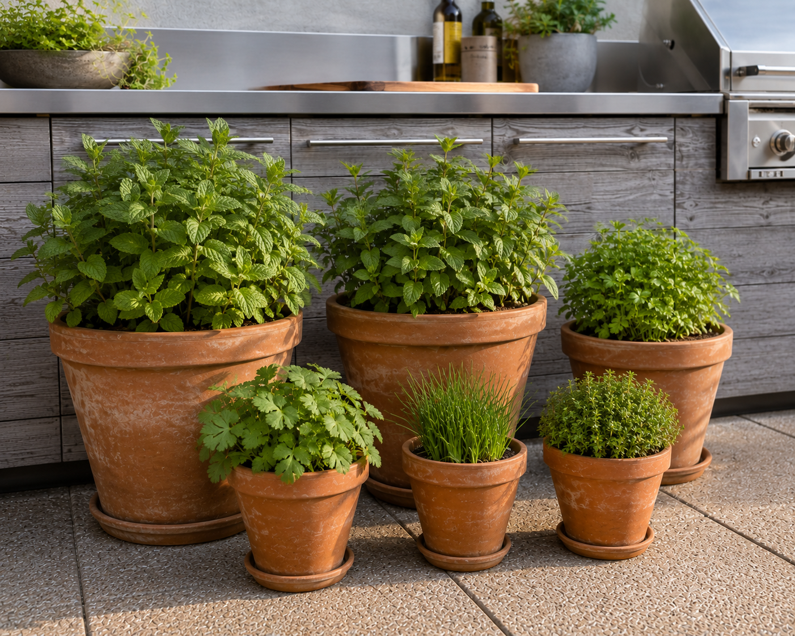

> **6 pots**, at the shadier southern end of the kitchen run, which suits every plant in the group. These are the herbs that must not go into a shared bed. Basil is deleted on review advice: salt wind shreds it even in the lee. It lives on the kitchen windowsill instead, and its pot slot goes to coriander.

> **Mulch and feeding:** no gravel needed — pots are top-dressed with home-made compost each spring. A thin gravel dressing is optional, purely for looks. The cyclamen pots come OFF the drip June–August — summer-dormant corms rot under summer water.

| Qty | Plant | Mature H × S | Flowers | Note | Supply | Pot |
|---|---|:---:|---|---|---|---|
| **3** | [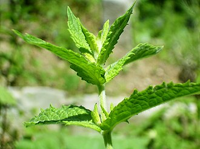](plant-images/mint.jpg) [*Mentha spicata* · *M.* 'Moroccan' · *M. suaveolens*](https://www.rhs.org.uk/plants/11055/mentha-spicata/details) — Mint — 3 kinds New | 0.5–1m × 1–1.5m† | Summer | ⚠️ Never plant into a shared bed — runners take over | 2L | Ø40 (each own pot) |
| **3** | [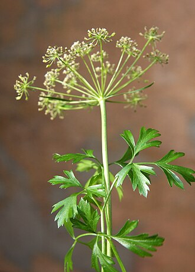](plant-images/parsley.jpg) [*Petroselinum crispum*](https://www.rhs.org.uk/plants/41248/petroselinum-crispum/details) — Flat-leaf parsley New | 0.1–0.5m × 0.1–0.5m† | Summer (2nd yr) | Biennial — renew annually; wants less sun | 1L | Ø30–35 (shared) |
| **3** | [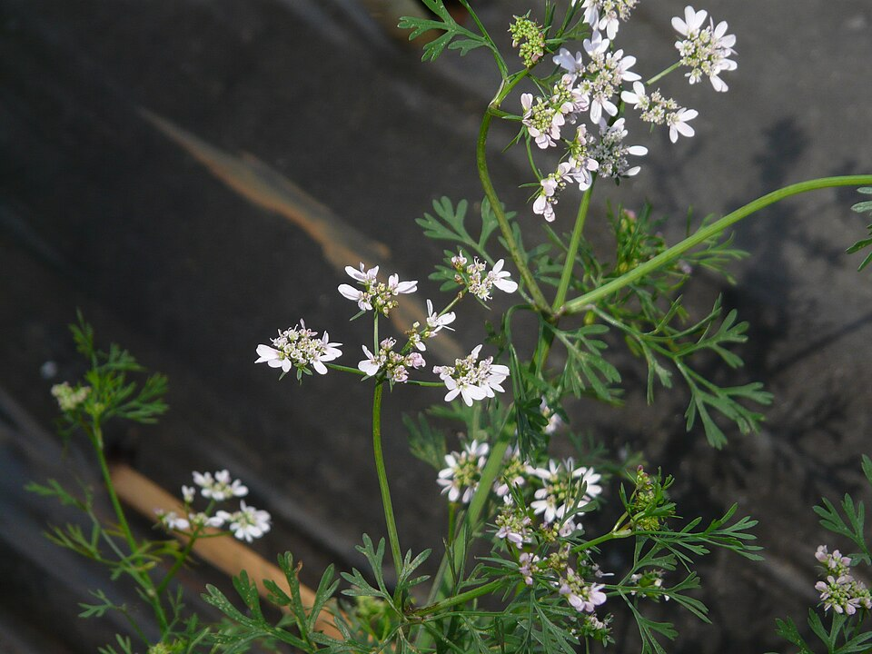](plant-images/coriander.jpg) [*Coriandrum sativum*](https://www.rhs.org.uk/plants/4371/coriandrum-sativum/details) — Coriander New | 0.1–0.5m × 0.1–0.5m† | Summer–early autumn | ⚠️ Salt wind shreds it even in the lee — pot only | 9cm | Ø30–35 (shared) |
| **2** |  [*Allium schoenoprasum*](https://www.rhs.org.uk/plants/859/allium-schoenoprasum-chives-cive/details) — Chives New | 0.1–0.5m × 0–0.1m† | Jun | Culinary; a genuine bee magnet | 1L | Ø30–35 (shared) |

| Qty | Bulb | Flowers |
|---|:---:|---|
| **20** |  [*Crocus tommasinianus*](https://www.rhs.org.uk/plants/25699/crocus-tommasinianus/details) — Early crocus | Feb, lilac |
| **10** |  [*Narcissus* 'Tête-à-tête'](https://www.rhs.org.uk/plants/89723/narcissus-tete-a-tete-12/details) — Dwarf daffodil | Feb–Mar, 15cm |
| **10** |  [*Cyclamen hederifolium*](https://www.rhs.org.uk/plants/5145/cyclamen-hederifolium/details) — Ivy-leaved cyclamen | Sept–Nov, pink / white |

### Group C — main terrace, east of the hot tub — see-through, look-under

Four low pots and one small tree east of the tub. From inside the water you see over and *through*
the tops of the aromatics — a fringe of foliage at the rim of the view, never a screen — and you look
*under* the olive: it is supplied on a clear stem to about 1.2m, so from tub height its canopy floats
above the sightline to the Downs and gives a little dappled cover from above. Set the pots out and
check all of it from inside the tub before settling them — that is what movable pots are for.

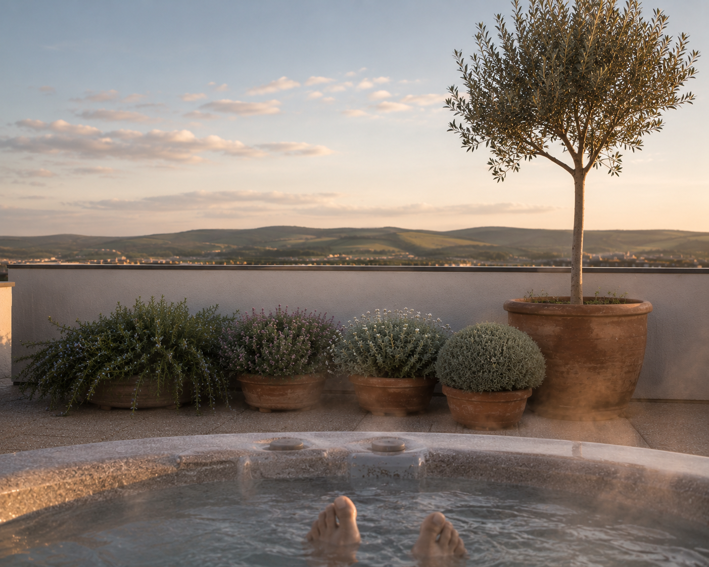

> **5 pots, deliberately low** so the east view to the Downs from the tub stays open, and deliberately **low-shedding** so nothing drops into the water. All evergreen and all aromatic or tactile when brushed. Movable, so they lift clear for the Phase-2 crane lift.

> **Mulch and feeding:** no gravel needed — pots are top-dressed with home-made compost each spring. A thin gravel dressing is optional, purely for looks.

| Qty | Plant | Mature H × S | Flowers | Note | Supply | Pot |
|---|---|:---:|---|---|---|---|
| **1** |  [*Olea europaea* — clear stem](https://www.rhs.org.uk/plants/11735/olea-europaea-f-/details) — Olive Sussex Sq | 4–8m × 1.5–2.5m† | Jun–Jul | Clear stem — looked under, not through, from the tub | 20–30L · clear stem to ~1.2m | Ø50–60 |
| **1** |  [*Salvia rosmarinus* 'Prostratus'](https://www.rhs.org.uk/plants/386334/salvia-rosmarinus-prostrata-group-ro/details) — Trailing rosemary Springfield Rd | 0.1–0.5m × 1–1.5m† | Spring–summer | Evergreen, culinary; trails over the planter edges | 2L | Ø30–35 |
| **1** |  [*Thymus vulgaris* · *T.* 'Purple Beauty' · *T. serpyllum*](https://www.rhs.org.uk/plants/18213/thymus-vulgaris/details) — Thyme — 3 forms New | 0.1–0.5m × 0.1–0.5m† | Early summer | Evergreen culinary mats; bees swarm the flowers | 9cm | Ø30–35 |
| **1** |  [*Dianthus gratianopolitanus*](https://www.rhs.org.uk/plants/5722/dianthus-gratianopolitanus/details) — Cheddar pink New | 0.1–0.5m × 0.1–0.5m† | May–Jul | UK native; strongly clove-scented evergreen mats | 1L | Ø30–35 |
| **1** |  [*Santolina chamaecyparissus*](https://www.rhs.org.uk/plants/19856/santolina-chamaecyparissus-lavender-cotton-cotton-lavender/details) — Cotton lavender Sussex Sq | 0.1–0.5m × 0.5–1m† | Summer | Shear the buds in June if they jar | 2L | Ø40 |

| Qty | Bulb | Flowers |
|---|:---:|---|
| **20** |  [*Crocus tommasinianus*](https://www.rhs.org.uk/plants/25699/crocus-tommasinianus/details) — Early crocus | Feb, lilac |
| **15** |  [*Iris reticulata* 'Harmony' + 'Katharine Hodgkin'](https://www.rhs.org.uk/plants/9343/iris-reticulata-harmony/details) — Dwarf iris | Feb, deep and pale blue |
| **10** |  [*Tulipa* 'Little Beauty'](https://www.rhs.org.uk/plants/155507/tulipa-little-beauty-15/details) — Species tulip | Apr, 15cm, magenta with a blue eye |
| **8** |  [*Crocus speciosus*](https://www.rhs.org.uk/plants/4941/crocus-speciosus/details) — Autumn crocus | Oct, violet-blue |

### Group D — main terrace, **south and west of the lounge sofas**

Four pots framing the lounge, low enough not to catch the north-east view: two purple
'Tom Thumb' domes, a silver *Convolvulus* and an 'Amethyst Lips' salvia that flowers from May to
November. Being movable is the point — set them out and look from the dining table before you commit.

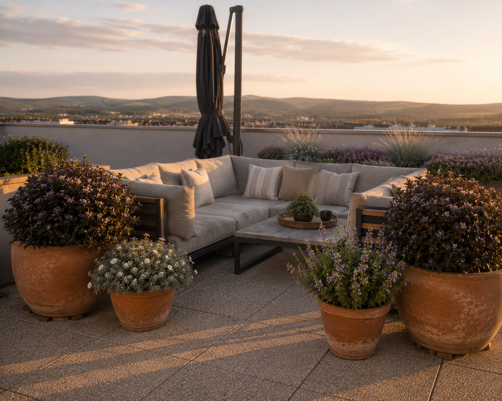

> **4 pots** framing the lounge. Kept low-to-medium because this group sits between the dining deck and the lounge, near the north-east view corridor. The Phase-2 sofa parasol's mast lands just south of the sofas, among this group — set the pots out only after the mast is in, and keep the two 'Tom Thumb' larges clear of the canopy's furled drop zone. **Set them out and check the sightline from the dining table before settling them** — that is what movable pots are for.

> **Mulch and feeding:** no gravel needed — pots are top-dressed with home-made compost each spring. A thin gravel dressing is optional, purely for looks.

| Qty | Plant | Mature H × S | Flowers | Note | Supply | Pot |
|---|---|:---:|---|---|---|---|
| **2** |  [*Pittosporum tenuifolium* 'Tom Thumb'](https://www.rhs.org.uk/plants/77301/pittosporum-tenuifolium-tom-thumb/details) — Purple dwarf kohuhu Sussex Sq | 0.5–1m × 0.5–1m† | — | Naturally rounded purple-bronze dome, no pruning ever | 5L | Ø50–60 |
| **1** |  [*Convolvulus cneorum*](https://www.rhs.org.uk/plants/4333/convolvulus-cneorum/details) — Silverbush New | 0.5–1m × 0.5–1m† | May–Sep | The most metallic silver evergreen here | 2L | Ø40 |
| **1** |  [*Salvia microphylla* 'Amethyst Lips'](https://www.rhs.org.uk/plants/374047/salvia-amethyst-lips-dyspurp/details) — Shrubby sage Sussex Sq | 0.5–1m × 0.5–1m† | Jun–Oct | Blackcurrant-scented leaves when brushed | 2L | Ø40 |

| Qty | Bulb | Flowers |
|---|:---:|---|
| **30** |  [*Crocus tommasinianus*](https://www.rhs.org.uk/plants/25699/crocus-tommasinianus/details) — Early crocus | Feb, lilac |
| **20** |  [*Muscari armeniacum* 'Valerie Finnis'](https://www.rhs.org.uk/plants/131700/muscari-armeniacum-valerie-finnis/details) — Grape hyacinth | Apr, pale powder blue |
| **15** |  [*Narcissus* 'Tête-à-tête'](https://www.rhs.org.uk/plants/89723/narcissus-tete-a-tete-12/details) — Dwarf daffodil | Feb–Mar, 15cm |
| **15** |  [*Tulipa* 'Little Beauty'](https://www.rhs.org.uk/plants/155507/tulipa-little-beauty-15/details) — Species tulip | Apr, 15cm, magenta with a blue eye |

### Group E — the cat's corner, by the study door

Two low pans for the cat, beside the litter store where she already goes. Real catnip in its
own pan because she will flatten it, and a tray of cat grass so the ornamental grasses survive. A cat
can't reach into a full-height pot; pans sit at her level, and she will lie in them, which is the point.
Crocus and cyclamen for us, threaded in the pans and around them.

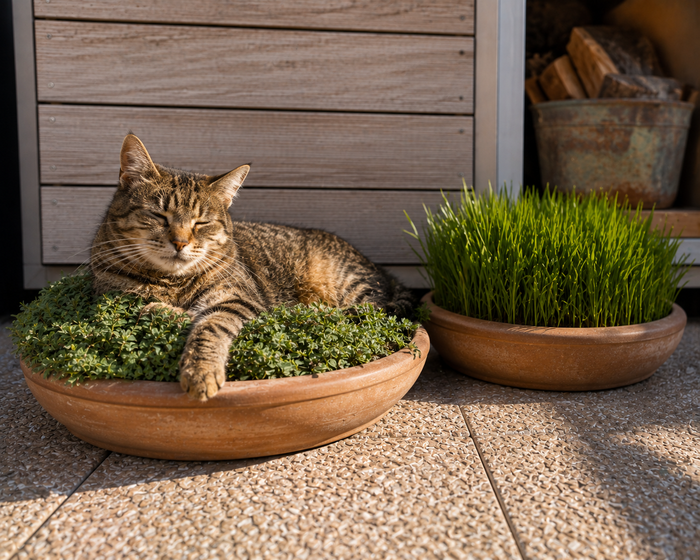

> **2 pots**, tucked beside the litter store where she already goes, each a low terracotta pan no more than ~15cm high. Nothing here is for us. The thyme she lies on is the N4 mat, an easy jump up — this group no longer needs its own thyme pot.

> **Mulch and feeding:** no gravel needed — pots are top-dressed with home-made compost each spring. A thin gravel dressing is optional, purely for looks.

| Qty | Plant | Mature H × S | Flowers | Note | Supply | Pot |
|---|---|:---:|---|---|---|---|
| **1** |  [*Nepeta cataria*](https://www.rhs.org.uk/plants/81198/nepeta-cataria/details) — True catnip New | 0.5–1m × 0.5–1m† | Summer–autumn | For the cat — she will roll on it and flatten it | 1L | low pan, Ø35–40cm, ~15cm high |
| **1** |  [*Dactylis glomerata* or oat / barley grass](https://www.rhs.org.uk/plants/search-results?query=Dactylis%20glomerata%20or%20oat%20/%20barley%20grass) — Cat grass New | — | — | Safe to chew; re-sow twice a year | 1L or seed | low pan, Ø35–40cm, ~15cm high |

| Qty | Bulb | Flowers |
|---|:---:|---|
| **20** |  [*Crocus tommasinianus*](https://www.rhs.org.uk/plants/25699/crocus-tommasinianus/details) — Early crocus | Feb, lilac |
| **10** |  [*Narcissus* 'Tête-à-tête'](https://www.rhs.org.uk/plants/89723/narcissus-tete-a-tete-12/details) — Dwarf daffodil | Feb–Mar, 15cm |
| **8** |  [*Cyclamen hederifolium*](https://www.rhs.org.uk/plants/5145/cyclamen-hederifolium/details) — Ivy-leaved cyclamen | Sept–Nov, pink / white |

### The client's existing pot plants

Following the client's final review, a handful of his own established pot plants are joining the scheme
rather than being bought new. **Only the plants come up — his existing containers are not reusable**, so
every kept plant is repotted into the new terracotta, and the three that stand outside the five groups add
three pots to the order, making 25 in all (§7). The bay and one *Phormium tenax* take the Group A slots
above. The second *Phormium tenax* goes into a new large pot with the kitchen pots at the north end of the
outdoor kitchen run. *Picea glauca* 'Monica' (70cm) goes into a new Ø40 pot at the south end of the narrow
terrace, where the client likes it — the most sheltered spot on the roof, though worth watching for salt
scorch. Four of the sixteen *Lavandula* 'Hidcote' go into the beds, so only twelve need supplying (§11).
*Trachelospermum jasminoides* is trained on stainless wires up the flat's wall beside the study door, from
a new large pot at the foot of the wall — the part shade there suits it; fixings to be confirmed. The
ivy-leaved pelargoniums are kept as seasonal summer fillers by the kitchen, not part of the permanent
scheme.

Not joining the scheme: the forsythia, cordyline, cherry laurel and the collapsed clematis are off-palette
or wrong for this exposure and are being rehomed; the camellia is also being rehomed — salt wind and
alkaline irrigation water would wreck it; and the carex has been composted.

[↑ Contents](#contents)

---
## 7. Pots and composter — specification

**25 pots**, bought as part of this order — 22 across the five groups above, plus three for the client's
own plants standing outside them (§6). His existing containers are not reusable; only the plants come up,
and each is repotted into the new terracotta.

| Size | Qty | Holds |
|---|---|---|
| **Large — Ø50–60cm** | 7 | The bay, both *Phormium tenax*, the *Trachelospermum*, the Group C olive, two 'Tom Thumb' domes |
| **Medium — Ø40cm** | 10 | *Sarcococca*, *Daphne*, *Convolvulus* + lavender (shared), the three mints, santolina, the Group D *Convolvulus*, 'Amethyst Lips', the *Picea* |
| **Small — Ø30–35cm** | 6 | Parsley, coriander, chives (shared pot of two), prostrate rosemary, thyme, *Dianthus* |
| **Low pans — Ø35–40cm, ~15cm high** | 2 | Catnip, cat grass — at cat height |

Total **25**.

### Material — real frost-proof terracotta

Terracotta is the right answer here, and on reflection a better one than the charcoal composite it
replaces. It is what has stood on Regency terraces in this town for two hundred years; it warms up beside
the buff granite paving instead of fighting it; and silver foliage looks better coming out of warm clay
than out of grey. It also ages — which is precisely what stops a group of pots looking styled.

**It solves the wind problem rather than creating one.** A 50cm terracotta pot weighs 15–25kg empty, so
the ballast is built in. Plastic pots blow over on this terrace; terracotta will not.

Benchmark makers (Impruneta, Whichford) run £150–£350+ at the large sizes. Brighton rarely passes −3°C,
so good mid-range frost-resistant terracotta (Woodlodge, Villaggio Verde or equivalent, with a stated
frost guarantee) is the honest specification for most of the group — with the benchmark tier worth
paying for only if a particular pot earns it.

**One further idea, which reads as less contrived, not more:** buy a proportion reclaimed. Architectural
salvage yards carry old terracotta by the pallet. It is often cheaper than new at the larger sizes, and
nothing on earth looks less styled than a pot that is genuinely forty years old. Worth doing for two or
three of the seven large pots.

**Shapes may vary within the group.** This reverses the usual advice: with a composite pot, repetition is
what stops it looking cheap, but with terracotta a mix of classic forms — pots, long toms, bowls — reads
as collected over time, which is the effect we are after. One material, three sizes plus the two low pans,
shapes as they come.

**Deliberately not used:**

| Ruled out | Why |
|---|---|
| **Plastic and light composites** | They blow over here. That is settled by experience, not theory |
| **Powder-coated metal** | This project has already had a confirmed C5 powder-coat failure on outdoor furniture at this location |
| **Corten steel** | Handsome, but it rust-streaks pale stone and the paving here is a buff granite |

**Glazed colour, used sparingly, is welcome** — muted heritage glazes (soft celadon and sage greens,
off-whites) sit happily inside the silver/blue/white palette; it is bright modern glazes that would fight
it. The client's existing light-green heritage glazed pot joins the group. One or two glazed pieces among
the terracotta reads as collected, which is the effect we're after.

**Every pot also needs:**

- **Pot feet**, so they drain freely and don't stain or pond on the granite.
- **A dripper.** All 25 are on the irrigation — pots dry out far faster than the planters.
- **Positioning over a pedestal.** The seven large pots, filled, are **68–95kg** each — position them over
  pedestal positions BEFORE filling, rather than mid-tile, exactly as the planters are; they will not move
  again without two people and a sack truck.

### And one composter

A **sealed hot composter, around 100 litres** — [HOTBIN Mini 100](https://hotbincomposting.com/products/hotbin-mini-100)
(£190 at the time of writing) or equivalent. **Please include it in the quote.** The reasoning is in §16;
in short, green waste has to leave this roof through the flat, so reducing it on site matters, and the
output feeds N4's shaded band and the pots. It sits in the north-east corner beside Store 4, screened by
the store.

[↑ Contents](#contents)

---
## 8. The plant list

Photographs link through to the RHS entry. **Where it came from** is the provenance of each choice:
**Sussex Square** (27 taxa, found growing in the communal gardens), **Springfield Road**
(10, from the previous garden), **New** (28, chosen for this site).

### Layer 1 — Specimen trees

| Plant | Total | Supply | Mature H × S | Flowers | Note | Goes in |
|:---:|---|---|---|---|---|---|
| [***Olea europaea* — multi-stem, gnarled**](https://www.rhs.org.uk/plants/11735/olea-europaea-f-/details) Olive Sussex Sq| **1** | 45–60L · 1.75–2.0m | 4–8m × 1.5–2.5m† | Jun–Jul | Evergreen silver-grey. Slow, long-lived, and airy enough to screen without walling off a view. This is the one place the character budget is spent: genuinely gnarled, seen head-on from the dining table. | M2(S) |
| [***Olea europaea* — multi-stem**](https://www.rhs.org.uk/plants/11735/olea-europaea-f-/details) Olive Sussex Sq| **1** | 45–60L · 1.75–2.0m | 4–8m × 1.5–2.5m† | Jun–Jul | Evergreen silver-grey. An ordinary (not gnarled) multi-stem, bought for canopy presence at high level — a filter for the diagonal sightline into the hot tub, not a wall. Olives gnarl in place; that is what they do. | M2(E) — north half |
| [***Olea europaea* — multi-stem**](https://www.rhs.org.uk/plants/11735/olea-europaea-f-/details) Olive Sussex Sq| **1** | 30–35L · ~1.5m | 4–8m × 1.5–2.5m† | Jun–Jul | Evergreen silver-grey. Deliberately the smaller 30–35L size — a 45–60L rootball doesn't fit a 500mm box, and in this exposure a smaller tree anchors faster and rocks less. | N1(N) |
| [***Pittosporum tenuifolium* 'Silver Sheen'**](https://www.rhs.org.uk/plants/53823/pittosporum-tenuifolium-silver-sheen-m/details) Kohuhu Springfield Rd| **2** | 20–30L · 1.75–2.0m · furnished to the base | 4–8m × 2.5–4m† | May–Jun | Evergreen; fine silver-green leaves on black twigs. Fast, dense, and it filters wind rather than blocking it. Supply furnished to the base — this one is a windbreak as well as a screen, and lifting its crown would open a gap at exactly the height the wind comes through. | N1(E), M1(W) |
| [***Olea europaea***](https://www.rhs.org.uk/plants/11735/olea-europaea-f-/details) Olive Sussex Sq| **1** | 15–25L · 1.2–1.5m | 4–8m × 1.5–2.5m† | Jun–Jul | As above, at a smaller scale. | M7 |
| [***Olea europaea* — clear stem**](https://www.rhs.org.uk/plants/11735/olea-europaea-f-/details) Olive Sussex Sq| **1** | 20–30L · clear stem to ~1.2m | 4–8m × 1.5–2.5m† | Jun–Jul | Evergreen silver-grey. Supplied on a clear stem to about 1.2m so, from a seated hot tub, its canopy floats above the sightline to the Downs and gives a little dappled cover from above. | Group C |

### Layer 2 — Evergreen backbone — the permeable windbreak

| Plant | Total | Supply | Mature H × S | Flowers | Note | Goes in |
|:---:|---|---|---|---|---|---|
| [***Myrtus communis* subsp. *tarentina***](https://www.rhs.org.uk/plants/59207/myrtus-communis-subsp-tarentina/details) Compact myrtle New| **4** | 5L | 1–1.5m × 1–1.5m† | Jul–Sep | A naturally dense 1.2–1.5m dome that needs no clipping at all. Small glossy aromatic leaves, white scented flowers Jul–Sep, black berries for the birds. One of the best self-managing coastal evergreens there is. | N1(E), N1(N), M1(W), M7 |
| [***Atriplex halimus***](https://www.rhs.org.uk/plants/1903/atriplex-halimus/details) Tree purslane New| **2** | 3L | 1.5–2.5m × 1–1.5m† | Summer | The brightest silver of any hardy shrub; grows on shingle beaches. ⚠️ The one fast, lax plant in the scheme — cut hard back every spring from the front. Used only in the 1,000mm-deep planters where there is room for it. | M2(E) — south half, M2(S) |
| [***Phillyrea angustifolia***](https://www.rhs.org.uk/plants/24488/phillyrea-angustifolia/details) Phillyrea New| **2** | 5L | 2.5–4m × 1.5–2.5m† | May–Jun | Glossy, self-shaping Mediterranean evergreen — narrow willow-like leaves, small white scented flowers in late spring. The naturally shapely structure plant the palette was missing. | N1(E), M2(E) — south half |
| [***Escallonia* 'Apple Blossom'**](https://www.rhs.org.uk/plants/96211/escallonia-apple-blossom/details) Escallonia New| **2** | 7.5L | 1.5–2.5m × 1.5–2.5m† | Jun–Sep | Shell-pink Jun–Sep. Grown here as an informal 1.5–2m shrub, not a clipped hedge — the most compact Escallonia, and it needs only an occasional reduction from the front. | M2(E) — south half, M2(S) |
| [***Olearia* × *haastii***](https://www.rhs.org.uk/plants/94555/olearia-x-haastii/details) Daisy bush New| **1** | 5L | 1.5–2m × 2m† | Jul–Aug | The classic seaside daisy bush — white daisies in high summer, replacing the oleaster the review took out. The best salt windbreak on this run; occasional reduction from the front, like the Atriplex. | M2(E) — south half |

### Layer 3 — Mediterranean mid-layer

| Plant | Total | Supply | Mature H × S | Flowers | Note | Goes in |
|:---:|---|---|---|---|---|---|
| [***Pittosporum tenuifolium* 'Tom Thumb'**](https://www.rhs.org.uk/plants/77301/pittosporum-tenuifolium-tom-thumb/details) Purple dwarf kohuhu Sussex Sq| **6** | 5L | 0.5–1m × 0.5–1m† | — | Naturally rounded 1m dome of deep purple-bronze foliage, no pruning ever. The foliage-colour contrast the scheme was missing, and it stays on the cool palette. | N1(E), M1(W), M4, Group D |
| [***Pittosporum tobira* 'Nanum'**](https://www.rhs.org.uk/plants/61258/pittosporum-tobira-nanum/details) Dwarf Japanese pittosporum Sussex Sq| **2** | 3L | 0.6–1m × 0.6–1m† | May–Jun | Self-shaping glossy dome; honey-scented cream flowers May–Jun. Replaces *Euphorbia wulfenii*, which the client asked out of the scheme. | N1(E), M2(E) — south half |
| [***Brachyglottis* 'Sunshine'**](https://www.rhs.org.uk/plants/86133/brachyglottis-dunedin-group-sunshine/details) Dunedin daisy bush Sussex Sq| **3** | 3L | 1–1.5m × 1–1.5m† | Jun–Jul | Silver felted evergreen; yellow daisies Jun–Jul (shear the buds off if unwanted). | N1(E), M1(W), M2(S) |
| [***Pittosporum tenuifolium* 'Golf Ball'**](https://www.rhs.org.uk/plants/246352/pittosporum-tenuifolium-golf-ball/details) Dwarf kohuhu Sussex Sq| **2** | 5L | 0.5–1m × 0.5–1m† | — | Naturally spherical evergreen, clipped to 60–80cm. The repeating rhythm that holds the scheme together in winter. | N1(E), M1(N) |
| [***Cistus* × *purpureus* 'Alan Fradd'**](https://www.rhs.org.uk/plants/91672/cistus-purpureus-alan-fradd/details) Rock rose Springfield Rd| **3** | 3L | 0.5–1m × 0.5–1m† | Jun–Jul | White with a maroon blotch, Jun–Jul. Spectacular; short-lived (~10 yrs). | M1(W), M2(E) — south half, M2(S) |
| [***Teucrium fruticans* 'Azureum'**](https://www.rhs.org.uk/plants/74406/teucrium-fruticans-azureum/details) Tree germander New| **2** | 3L | 1–1.5m × 1–1.5m† | May–Sep | Silver-blue evergreen foliage; deep blue flowers May–Sep. | M2(E) — south half, M2(S) |
| [***Coronilla valentina* subsp. *glauca* 'Citrina'**](https://www.rhs.org.uk/plants/53148/coronilla-valentina-subsp-glauca-citrina/details) Yellow coronilla Sussex Sq| **2** | 3L | 0.5–1m × 0.5–1m† | Dec–Apr | Dec–Apr pale lemon, scented at midday — the winter-flowering shrub. | M2(E) — south half, M2(S) |
| [***Phlomis fruticosa***](https://rhs.org.uk/plants/details?plantid=1426) Jerusalem sage Sussex Sq| **1** | 3L | 0.5–1m × 1–1.5m† | Jun–Jul | Felted grey-green year-round; yellow whorls Jun–Jul, then sculptural seed heads. | M2(S) |
| [***Abelia* × *grandiflora***](https://www.rhs.org.uk/plants/100036/abelia-x-grandiflora/details) Glossy abelia Springfield Rd| **1** | 5L | 2.5–4m × 2.5–4m† | Jul–Oct | Jul–Oct white/blush scented flowers on arching stems. Serious pollinator plant. | M2(E) — south half |

### Layer 4 — Front ribbon — silver mats, aromatics and long-flowering perennials

| Plant | Total | Supply | Mature H × S | Flowers | Note | Goes in |
|:---:|---|---|---|---|---|---|
| [***Lavandula angustifolia* 'Hidcote'**](https://www.rhs.org.uk/plants/96353/lavandula-angustifolia-hidcote/details) English lavender Springfield Rd| **16** | 2L | 0.1–0.5m × 0.5–1m† | Jun–Aug | Deep purple, Jun–Aug. | N1(E), N2, N4, M1(W), Group A |
| [***Erigeron karvinskianus***](https://www.rhs.org.uk/plants/32487/erigeron-karvinskianus/details) Mexican fleabane Sussex Sq| **2** | 1L | 0.1–0.5m × 0.5–1m† | Apr–Nov | Apr–Nov — nine months of tiny white-to-pink daisies. Self-seeds into paving joints. | N1(E) |
| [***Hebe* (*Veronica*) 'Rakaiensis'**](https://www.rhs.org.uk/plants/8357/rakai-hebe/details) Shrubby veronica Springfield Rd| **4** | 2L | 0.5–1m × 1–1.5m† | Jun–Jul | Tight bright-green evergreen domes; white spikes Jun–Jul. | M4, M7 |
| [***Armeria maritima***](https://www.rhs.org.uk/plants/1597/armeria-maritima/details) Sea thrift New| **12** | 9cm–1L | 0.1–0.5m × 0.1–0.5m† | Apr–Jun | UK coastal native. Pink pompoms Apr–Jun over evergreen cushions. | N1(N), M2(E) — north half, M4 |
| [***Festuca glauca* 'Elijah Blue'**](https://www.rhs.org.uk/plants/104179/festuca-glauca-elijah-blue/details) Blue fescue Sussex Sq| **3** | 1L | 0.1–0.5m × 0.1–0.5m† | Late spring–summer | Blue-grey evergreen tussock — texture at the front all year. Kept only in the M2(E) shingle bank now; N1(N) and N2 swapped it for sea thrift and cheddar pinks. | M2(E) — north half |
| [***Dianthus gratianopolitanus***](https://www.rhs.org.uk/plants/5722/dianthus-gratianopolitanus/details) Cheddar pink New| **8** | 1L | 0.1–0.5m × 0.1–0.5m† | May–Jul | UK native. Evergreen grey mats; strongly clove-scented May–Jul. | N2, M2(E) — north half, M4, Group C |
| [***Salvia microphylla* 'Amethyst Lips'**](https://www.rhs.org.uk/plants/374047/salvia-amethyst-lips-dyspurp/details) Shrubby sage Sussex Sq| **3** | 2L | 0.5–1m × 0.5–1m† | Jun–Oct | May–Nov purple-and-white; blackcurrant-scented leaves when brushed. | N4, Group D |
| [***Hylotelephium* 'Matrona'**](https://www.rhs.org.uk/plants/356925/hylotelephium-matrona/details) Stonecrop / iceplant Sussex Sq| **7** | 2L | 0.5–1m × 0.1–0.5m† | Aug–Oct | Aug–Oct dusky pink on purple stems, then seed heads standing all winter. | N2, M1(W), M2(E) — south half, M4 |
| [***Iris unguicularis***](https://www.rhs.org.uk/plants/24998/iris-unguicularis/details) Algerian iris New| **5** | 1–2L | 0.1–0.5m × 0.1–0.5m† | Nov–Mar | Nov–March lilac-blue, scented. Demands exactly this: poor, sharply drained soil with a hot dry summer bake. | M2(E) — south half, M2(S) |
| [***Euphorbia myrsinites***](https://www.rhs.org.uk/plants/7073/euphorbia-myrsinites/details) Myrtle spurge Sussex Sq| **5** | 1L | up to 10cm × 0.1–0.5m† | Mar–May | Trailing blue-grey succulent whorls, only 15cm high, with chartreuse bracts Mar–May. Drapes over a rim and never needs cutting. Sap is an irritant. | M2(E) — north half, M4 |
| [***Nepeta* × *faassenii* 'Walker's Low'**](https://www.rhs.org.uk/plants/210480/nepeta-faassenii-walker-s-low/details) Catmint Sussex Sq| **9** | 1–2L | 0.1–0.5m × 0.1–0.5m† | Jun–Sep | Blue haze Jun–Sep if sheared after the first flush. | N1(E), M1(W), M1(N) |
| [***Convolvulus cneorum***](https://www.rhs.org.uk/plants/4333/convolvulus-cneorum/details) Silverbush New| **3** | 2L | 0.5–1m × 0.5–1m† | May–Sep | The most metallic silver evergreen here; white trumpets May–Sep. | M7, Group A, Group D |
| [***Santolina chamaecyparissus***](https://www.rhs.org.uk/plants/19856/santolina-chamaecyparissus-lavender-cotton-cotton-lavender/details) Cotton lavender Sussex Sq| **6** | 2L | 0.1–0.5m × 0.5–1m† | Summer | Tight silver dome. Shear the buds in June if the yellow buttons jar; sheared, it drops nothing into the tub. Replaces *Stachys byzantina* in the M2(E) south ribbon (the N1(E) share was swapped back out for more *Helictotrichon*). | N4, M2(E) — south half, Group C |
| [***Salvia rosmarinus* 'Severn Sea'**](https://www.rhs.org.uk/plants/386349/salvia-rosmarinus-severn-sea-ro/details) Semi-prostrate rosemary Sussex Sq| **4** | 2L | 0.5–1m × 0.5–1m† | Feb–May | Feb–May vivid blue — flowers when almost nothing else does. Arches over the rim. | N1(E), M7 |
| [***Salvia nemorosa* 'Caradonna'**](https://www.rhs.org.uk/plants/194596/salvia-nemorosa-caradonna/details) Balkan clary Sussex Sq| **3** | 1–2L | 0.1–0.5m × 0.1–0.5m† | May–Jul | Violet spikes on black stems, May–Jul — the sharpest contrast against silver foliage. | M1(W) |
| [***Eryngium bourgatii* 'Picos Blue'**](https://www.rhs.org.uk/plants/129742/eryngium-bourgatii-picos-blue/details) Sea holly Sussex Sq| **3** | 1–2L | 0.5–1m × 0.1–0.5m† | Jun–Aug | Steel-blue thistle heads Jun–Aug over silver-veined leaves. Wind-proof; top-rated for pollinators. | M2(E) — south half |
| [***Crithmum maritimum***](https://www.rhs.org.uk/plants/24479/crithmum-maritimum/details) Rock samphire New| **2** | 1L | 0.1–0.5m × 0.1–0.5m† | Apr–Sep | UK shingle-shore native, found on the Sussex coast. Succulent blue-green; edible. Sited at the driest edge — a shingle plant that flops in fed compost; an experiment worth two plants. | M2(E) — north half |
| [***Aster* × *frikartii* 'Mönch'**](https://www.rhs.org.uk/plants/93410/aster-x-frikartii-monch/details) Michaelmas daisy Sussex Sq| **3** | 2L | 0.5–1m × 0.1–0.5m† | Aug–Oct | Aug–Oct lavender-blue — critical late nectar for butterflies before hibernation. | M2(E) — south half |
| [***Salvia yangii* 'Little Spire'**](https://www.rhs.org.uk/plants/135978/perovskia-atriplicifolia-little-spire/details) Russian sage New| **5** | 2L | 0.5–1m × 0.5–1m† | Aug–Oct | Aug–Oct blue haze on silver stems. The compact form, kept over the taller 'Blue Spires', which flops in wind. | M2(S) |
| [***Oenothera lindheimeri* 'Whirling Butterflies'**](https://www.rhs.org.uk/plants/386447/oenothera-lindheimeri-whirling-butterflies-g/details) Gaura New| **3** | 2L | 0.5–1m × 0.5–1m† | Jun–Oct | White butterflies on wiry stems that ride the wind all summer; hates only winter wet. Replaces *Stachys byzantina* in the M1(W) ribbon. | M1(W) |
| [***Erysimum* 'Bowles's Mauve'**](https://www.rhs.org.uk/plants/91464/erysimum-bowless-mauve/details) Perennial wallflower New| **3** | 2L | 0.5–1m × 0.5–1m† | Mar–Nov | Mar–Nov, almost continuously. Unbeatable first-year value; short-lived (~3 yrs). | M2(S) |
| [***Helictotrichon sempervirens***](https://www.rhs.org.uk/plants/8555/helictotrichon-sempervirens/details) Blue oat grass New| **12** | 2L | 1–1.5m × 0.5–1m† | Summer | Blue-grey evergreen tussock grass, taller and more architectural than the fescues — oat-like flower plumes catch the wind all summer. “The wind made visible”, from the lounge and the dining table alike. Comb out dead leaves in spring. | N1(E), M2(S), M4 |

### Layer 5 — Culinary herbs, and the cat's pots

| Plant | Total | Supply | Mature H × S | Flowers | Note | Goes in |
|:---:|---|---|---|---|---|---|
| [***Thymus vulgaris* · *T.* 'Purple Beauty' · *T. serpyllum***](https://www.rhs.org.uk/plants/18213/thymus-vulgaris/details) Thyme — 3 forms New| **12** | 9cm | 0.1–0.5m × 0.1–0.5m† | Early summer | Evergreen culinary mats; bees swarm the flowers. | N3, N4, M7, Group C |
| [***Salvia rosmarinus* 'Prostratus'**](https://www.rhs.org.uk/plants/386334/salvia-rosmarinus-prostrata-group-ro/details) Trailing rosemary Springfield Rd| **8** | 2L | 0.1–0.5m × 1–1.5m† | Spring–summer | Evergreen, culinary; trails over the planter edges. | N4, M4, Group C |
| [***Salvia rosmarinus* 'Miss Jessopp's Upright'**](https://www.rhs.org.uk/plants/384683/salvia-rosmarinus-miss-jessopps-upright-ro/details) Upright rosemary Sussex Sq| **4** | 2L | 1.5–2.5m × 1–1.5m† | Feb–May | Evergreen, culinary; blue flowers Feb–May. | N3, N4 |
| [***Origanum* 'Herrenhausen'**](https://www.rhs.org.uk/plants/41793/origanum-herrenhausen/details) Ornamental marjoram New| **4** | 1L | 0.1–0.5m × 0.1–0.5m† | Jul–Sep | Purple bracts Jul–Sep — one of the highest-rated butterfly plants there is. | N3, N4 |
| [***Allium schoenoprasum***](https://www.rhs.org.uk/plants/859/allium-schoenoprasum-chives-cive/details) Chives New| **5** | 1L | 0.1–0.5m × 0–0.1m† | Jun | Culinary; mauve pompoms in June are a genuine bee magnet. | N4, Group B |
| [***Mentha spicata* · *M.* 'Moroccan' · *M. suaveolens***](https://www.rhs.org.uk/plants/11055/mentha-spicata/details) Mint — 3 kinds New| **3** | 2L | 0.5–1m × 1–1.5m† | Summer | Garden mint for cooking, Moroccan for tea, apple mint. Never plant mint into a shared bed — the runners take the whole thing in one season. Wants more water than everything else, so give its pots their own dripper. | Group B |
| [***Petroselinum crispum***](https://www.rhs.org.uk/plants/41248/petroselinum-crispum/details) Flat-leaf parsley New| **3** | 1L | 0.1–0.5m × 0.1–0.5m† | Summer (2nd yr) | Biennial — renew annually. Wants more water and less sun than the Mediterranean herbs, so keep it potted in the part-shaded south end. | Group B |
| [***Coriandrum sativum***](https://www.rhs.org.uk/plants/4371/coriandrum-sativum/details) Coriander New| **3** | 9cm | 0.1–0.5m × 0.1–0.5m† | Summer–early autumn | Culinary. Basil's replacement in the pot run — salt wind shreds it even in the lee, so coriander (tougher, and just as useful in the kitchen) takes the slot instead. | Group B |
| [***Phormium* 'Bronze Baby'**](https://www.rhs.org.uk/plants/92561/phormium-bronze-baby/details) Bronze New Zealand flax Sussex Sq| **1** | 5L | 0.5–1m × 0.5–1m† | Summer (rare) | Bronze evergreen sword foliage — architecture, and bullet-proof in salt wind. The compact bronze form; the full *P. tenax* would swallow this square in four years. | N2 |
| [***Phormium tenax***](https://www.rhs.org.uk/plants/12791/phormium-tenax/details) New Zealand flax — client's own Springfield Rd| **1** | Client's own · plant not for supply (new pot in §7) | 2.5–4m × 1.5–2.5m† | Summer | The client's own established specimen, folded into the scheme (§6) rather than bought, taking the Group A pot slot. A second, matching specimen also stands with the kitchen pots (§6) but is not counted in this schedule — its new pot is in §7, and nothing else is bought for it | Group A |
| [***Origanum vulgare***](https://www.rhs.org.uk/plants/11923/origanum-vulgare/details) Wild marjoram / oregano Sussex Sq| **2** | 1L | 0.5–1m × 0.5–1m† | Jul–Sep | UK native. The cooking oregano. | N4 |
| [***Salvia officinalis***](https://www.rhs.org.uk/plants/16356/salvia-officinalis/details) Common sage New| **2** | 2L | 0.5–1m × 0.5–1m† | Early summer | Evergreen grey-green; the cooking sage. | N4 |
| [***Salvia officinalis* 'Purpurascens'**](https://www.rhs.org.uk/plants/153600/salvia-officinalis-purpurascens/details) Purple sage New| **2** | 2L | 0.5–1m × 0.5–1m† | Summer | Culinary, and the purple foliage sits on the cool palette. | N3 |
| [***Satureja montana***](https://www.rhs.org.uk/plants/16484/satureja-montana/details) Winter savory New| **2** | 1L | 0.1–0.5m × 0.1–0.5m† | Summer | Evergreen Mediterranean herb — pepperiness for beans and stews. Underused and very tough. | N4 |
| [***Artemisia dracunculus***](https://www.rhs.org.uk/plants/1632/artemisia-dracunculus/details) French tarragon New| **2** | 1L | 0.5–1m × 0.1–0.5m† | Late summer | Culinary. Must be French, not Russian — Russian tarragon is near-flavourless. | N4 |
| [***Fragaria vesca***](https://www.rhs.org.uk/plants/7280/fragaria-vesca-f/details) Alpine strawberry New| **5** | 9cm | 0.1–0.3m × 0.3m† | Apr–Jun (fruit Jun–Oct) | Picking fruit for the terrace; tolerates the lean mix. | N4 |
| [***Laurus nobilis* — clipped**](https://www.rhs.org.uk/plants/9876/laurus-nobilis-bay-tree-bay/details) Bay — client's own Springfield Rd| **1** | Client's own · plant not for supply (new pot in §7) | 8–12m × wider than 8m† | — | Evergreen, dark, on-palette, and a kitchen staple — shade-tolerant, so it holds the part-shaded Group A slot. Now the client's own tree rather than bought | Group A |
| [***Nepeta cataria***](https://www.rhs.org.uk/plants/81198/nepeta-cataria/details) True catnip New| **1** | 1L | 0.5–1m × 0.5–1m† | Summer–autumn | For the cat. The real thing, far stronger than the ornamental catmints. Give it its own pot — she will roll on it and flatten it, and it recovers. | Group E |
| [***Dactylis glomerata* or oat / barley grass**](https://www.rhs.org.uk/plants/search-results?query=Dactylis%20glomerata%20or%20oat%20/%20barley%20grass) Cat grass New| **1** | 1L or seed | — | — | For the cat. Safe to chew, and it saves the ornamental grasses from being nibbled. Re-sow twice a year. | Group E |

### Layer 6 — Winter scent for the part-shaded south end

| Plant | Total | Supply | Mature H × S | Flowers | Note | Goes in |
|:---:|---|---|---|---|---|---|
| [***Sarcococca hookeriana* var. *humilis***](https://www.rhs.org.uk/plants/96875/sarcococca-hookeriana-var-humilis/details) Sweet box / Christmas box Sussex Sq · Springfield Rd| **2** | 3L | 0.5–1m × 0.5–1m† | Winter | Dec–Feb: the most powerful winter scent of any hardy shrub, from flowers you can barely see. Evergreen, low, suckering. Needs the part shade at the south end. | N4, Group A |
| [***Daphne odora* 'Aureomarginata'**](https://www.rhs.org.uk/plants/56422/daphne-odora-aureomarginata-v/details) Winter daphne Springfield Rd| **1** | 3–5L | 1–1.5m × 1–1.5m† | Jan–Mar | Jan–Mar, pink-flushed white, gloriously scented; cream-edged evergreen leaves. From your old garden — the part-shaded south end is the one place here it stands a chance. Plant once and never move it. | Group A |
| [***Helleborus argutifolius***](https://www.rhs.org.uk/plants/8565/helleborus-argutifolius/details) Corsican hellebore Sussex Sq| **1** | 2L | 0.5–1m × 0.5–1m† | Feb–Apr | Feb–Apr apple-green cups over architectural spiny evergreen leaves. Early nectar for waking bumblebees; tolerates dry part shade. | N4 |

[↑ Contents](#contents)

---
## 9. Bulbs and corms

Planted **October–November**, threaded between the shrubs and through the front ribbon — except the
snowdrops, which we'd like **in the green**, delivered February–March.

| Bulb / corm | Total | Flowers | Note | Goes in |
|:---:|---|---|---|---|
| [***Crocus tommasinianus***](https://www.rhs.org.uk/plants/25699/crocus-tommasinianus/details) Early crocus New| **350** | Feb, lilac | Naturalises freely in hot, sharply drained conditions | N1(E), N1(N), N2, N4, M1(W), M1(N), M2(E) — north half, M2(E) — south half, M2(S), M4, Group B, Group C, Group D, Group E |
| [***Narcissus* 'Tête-à-tête'**](https://www.rhs.org.uk/plants/89723/narcissus-tete-a-tete-12/details) Dwarf daffodil New| **160** | Feb–Mar, 15cm | The wind-proof early daffodil | N1(E), N1(N), N2, N4, M1(N), M2(E) — north half, M4, Group A, Group B, Group D, Group E |
| [***Iris reticulata* 'Harmony' + 'Katharine Hodgkin'**](https://www.rhs.org.uk/plants/9343/iris-reticulata-harmony/details) Dwarf iris New| **150** | Feb, deep and pale blue | Wants a hot dry summer bake | N1(E), N2, N3, N4, M2(E) — north half, M2(S), M4, Group C |
| [***Muscari armeniacum* 'Valerie Finnis'**](https://www.rhs.org.uk/plants/131700/muscari-armeniacum-valerie-finnis/details) Grape hyacinth New| **150** | Apr, pale powder blue |  | N1(E), N1(N), N4, M1(W), M1(N), M2(E) — north half, M4, M7, Group D |
| [***Allium sphaerocephalon***](https://www.rhs.org.uk/plants/870/allium-sphaerocephalon-round-headed-leek-round-headed-garlic/details) Drumstick allium New| **120** | Jul, wine-purple | Flowers in the summer gap; wind-proof and inexpensive | N1(E), N3, N4, M2(E) — south half, M2(S) |
| [***Allium hollandicum* 'Purple Sensation'**](https://www.rhs.org.uk/plants/57088/allium-hollandicum-purple-sensation/details) Ornamental onion Springfield Rd| **100** | May, purple drumsticks | Plant in drifts of 10–15 | N1(E), N1(N), M1(W), M2(E) — south half, M2(S) |
| [***Galanthus nivalis***](https://www.rhs.org.uk/plants/7568/galanthus-nivalis/details) Snowdrop — buy in the green Springfield Rd| **100** | Jan–Feb, white | ⚠️ Confined to the part-shaded south end — buy in the green | N4, Group A |
| [***Tulipa* 'Little Beauty'**](https://www.rhs.org.uk/plants/155507/tulipa-little-beauty-15/details) Species tulip New| **90** | Apr, 15cm, magenta with a blue eye | Tiny, tough, and a jewel close up | N2, N3, N4, M2(E) — north half, M4, M7, Group C, Group D |
| [***Crocus* 'Snow Bunting'**](https://www.rhs.org.uk/plants/93896/crocus-chrysanthus-snow-bunting/details) Crocus New| **100** | Feb, white, scented | The white February flower snowdrops can't do in sunny beds | N3, N4, M7, Group A |
| [***Tulipa clusiana* 'Lady Jane'**](https://www.rhs.org.uk/plants/194056/tulipa-lady-jane-15/details) Lady tulip Springfield Rd| **70** | Apr, white / rose | A species tulip — comes back every year, short enough not to snap | N1(E), N4, M1(W), M2(S), Group A |
| [***Tulipa saxatilis* (Bakeri Gp) 'Lilac Wonder'**](https://www.rhs.org.uk/plants/67509/tulipa-saxatilis-bakeri-group-lilac-wonder-15/details) Cretan tulip New| **60** | Apr, lilac-pink, yellow eye | Also perennialises; one of the best tulips for containers | N1(E), N1(N), N4, M2(E) — south half |
| [***Gladiolus communis* subsp. *byzantinus***](https://www.rhs.org.uk/plants/89297/gladiolus-communis-subsp-byzantinus/details) Byzantine gladiolus Springfield Rd| **50** | May–Jun, magenta | Thrives on dry sunny neglect and naturalises | N1(E), M2(E) — south half, M2(S) |
| [***Narcissus poeticus* var. *recurvus***](https://www.rhs.org.uk/plants/76534/i-narcissus-poeticus-i-var-i-recurvus-i-(13)/details) Pheasant's eye Springfield Rd| **100** | May, white with a red-rimmed eye | Scented, and the last daffodil of the season — now also standing in for 'Thalia', which the client asked out of the scheme | N1(E), M1(W), M2(E) — south half, M2(S) |
| [***Narcissus* 'Rijnveld's Early Sensation'**](https://www.rhs.org.uk/plants/55821/narcissus-rijnvelds-early-sensation-1/details) Daffodil New| **40** | January | A genuine January trumpet daffodil, widely available and inexpensive | N1(E), M2(E) — south half, M2(S) |
| [***Cyclamen hederifolium***](https://www.rhs.org.uk/plants/5145/cyclamen-hederifolium/details) Ivy-leaved cyclamen New| **38** | Sept–Nov, pink / white | Flowers before the leaves, then marbled foliage all winter | N4, Group A, Group B, Group E |
| [***Crocus speciosus***](https://www.rhs.org.uk/plants/4941/crocus-speciosus/details) Autumn crocus New| **37** | October, violet-blue | The client's preferred autumn flower, replacing *Nerine bowdenii* | N2, M2(E) — south half, M2(S), M4, Group C |
| [***Allium cristophii***](https://www.rhs.org.uk/plants/816/allium-cristophii/details) Star of Persia Springfield Rd| **30** | May–Jun | The best seed head of any allium — stands until Christmas | N2, M1(W), M2(E) — south half, M2(S) |
| [***Cyclamen coum***](https://www.rhs.org.uk/plants/5135/cyclamen-coum/details) Eastern cyclamen New| **30** | Jan–Mar, pink / white | A dry-shade specialist with summer dormancy | N4, Group A |
| [***Nectaroscordum siculum***](https://www.rhs.org.uk/plants/96507/nectaroscordum-siculum/details) Sicilian honey garlic New| **20** | Jun, cream / green / maroon bells | Subtle, and superb seed heads | N1(E), M1(W), M2(S) |
[↑ Contents](#contents)

---
## 10. Year-round interest — checked

Every planter and pot group was audited against five tests: something happening in each of the four
seasons, plus evergreen structure to hold it together when nothing is flowering. **All seventeen pass.**

| Planter / pot group | Winter | Spring | Summer | Autumn | Evergreen structure | Carries the winter |
|---|---|---|---|---|---|---|
| **N1(E)** | ● | ● | ● | ● | ● | rosemary, crocus, seed heads |
| **N1(N)** | ● | ● | ● | ● | ● | olive, myrtle, crocus |
| **N2** | ● | ● | ● | ● | ● | Phormium, cheddar pinks, stonecrop heads |
| **N3** | ● | ● | ● | ● | ● | rosemary, sage, thyme — all evergreen |
| **N4** | ● | ● | ● | ● | ● | *Sarcococca*, hellebore, snowdrops, cyclamen |
| **M1(W)** | ● | ● | ● | ● | ● | *Euphorbia*, myrtle, 'Tom Thumb' |
| **M1(N)** | ● | ● | ● | ● | ● | 'Golf Ball' dome, crocus |
| **M2(E) — north half** | ● | ● | ● | ● | ● | olive, shingle-bank mats, dwarf iris |
| **M2(E) — south half** | ● | ● | ● | ● | ● | *Coronilla*, *Iris unguicularis*, seed heads |
| **M2(S)** | ● | ● | ● | ● | ● | olive, *Coronilla*, tree purslane |
| **M4** | ● | ● | ● | ● | ● | 'Tom Thumb', *Hebe*, stonecrop heads |
| **M7** | ● | ● | ● | ● | ● | myrtle, *Hebe*, olive |
| **Group A** | ● | ● | ● | ● | ● | bay, *Sarcococca*, *Daphne*, snowdrops |
| **Group B** | ● | ● | ● | ● | ● | parsley overwinters, crocus, cyclamen foliage |
| **Group C** | ● | ● | ● | ● | ● | santolina, olive, dwarf iris |
| **Group D** | ● | ● | ● | ● | ● | 'Tom Thumb' domes, crocus |
| **Group E** | ● | ● | ● | ● | ● | cyclamen foliage, crocus |

The winter column is the one that matters, because that is where roof planting usually fails. Nothing here
relies on a single plant for it: there is evergreen structure in every bed, and the December-to-February
interest is spread across scented *Sarcococca* and *Daphne*, *Coronilla* in pale lemon, *Iris
unguicularis*, rosemary already in blue flower, standing seed heads, and roughly
four hundred crocus.

[↑ Contents](#contents)

---
## 11. Schedule of quantities

**227 plants and 1,795 bulbs / corms.** Supply sizes are what we think is right — please tell us if
you'd supply differently.

| Plant | Where from | Total | Supply size |
|---|---|---|---|
| ***Layer 1 — Specimen trees*** | | | |
| *Olea europaea* — multi-stem, gnarled — Olive | Sussex Sq | **1** | 45–60L · 1.75–2.0m |
| *Olea europaea* — multi-stem — Olive | Sussex Sq | **1** | 45–60L · 1.75–2.0m |
| *Olea europaea* — multi-stem — Olive | Sussex Sq | **1** | 30–35L · ~1.5m |
| *Pittosporum tenuifolium* 'Silver Sheen' — Kohuhu | Springfield Rd | **2** | 20–30L · 1.75–2.0m · furnished to the base |
| *Olea europaea* — Olive | Sussex Sq | **1** | 15–25L · 1.2–1.5m |
| *Olea europaea* — clear stem — Olive | Sussex Sq | **1** | 20–30L · clear stem to ~1.2m |
| ***Layer 2 — Evergreen backbone — the permeable windbreak*** | | | |
| *Myrtus communis* subsp. *tarentina* — Compact myrtle | New | **4** | 5L |
| *Escallonia* 'Apple Blossom' — Escallonia | New | **2** | 7.5L |
| *Atriplex halimus* — Tree purslane | New | **2** | 3L |
| *Phillyrea angustifolia* — Phillyrea | New | **2** | 5L |
| *Olearia* × *haastii* — Daisy bush | New | **1** | 5L |
| ***Layer 3 — Mediterranean mid-layer*** | | | |
| *Pittosporum tenuifolium* 'Tom Thumb' — Purple dwarf kohuhu | Sussex Sq | **6** | 5L |
| *Pittosporum tobira* 'Nanum' — Dwarf Japanese pittosporum | Sussex Sq | **2** | 3L |
| *Brachyglottis* 'Sunshine' — Dunedin daisy bush | Sussex Sq | **3** | 3L |
| *Pittosporum tenuifolium* 'Golf Ball' — Dwarf kohuhu | Sussex Sq | **2** | 5L |
| *Cistus* × *purpureus* 'Alan Fradd' — Rock rose | Springfield Rd | **3** | 3L |
| *Teucrium fruticans* 'Azureum' — Tree germander | New | **2** | 3L |
| *Coronilla valentina* subsp. *glauca* 'Citrina' — Yellow coronilla | Sussex Sq | **2** | 3L |
| *Phlomis fruticosa* — Jerusalem sage | Sussex Sq | **1** | 3L |
| *Abelia* × *grandiflora* — Glossy abelia | Springfield Rd | **1** | 5L |
| ***Layer 4 — Front ribbon — silver mats, aromatics and long-flowering perennials*** | | | |
| *Lavandula angustifolia* 'Hidcote' — English lavender | Springfield Rd | **16** | 2L — supply 12 (4 from client's stock) |
| *Erigeron karvinskianus* — Mexican fleabane | Sussex Sq | **2** | 1L |
| *Hebe* (*Veronica*) 'Rakaiensis' — Shrubby veronica | Springfield Rd | **4** | 2L |
| *Armeria maritima* — Sea thrift | New | **12** | 9cm–1L |
| *Festuca glauca* 'Elijah Blue' — Blue fescue | Sussex Sq | **3** | 1L |
| *Dianthus gratianopolitanus* — Cheddar pink | New | **8** | 1L |
| *Salvia microphylla* 'Amethyst Lips' — Shrubby sage | Sussex Sq | **3** | 2L |
| *Hylotelephium* 'Matrona' — Stonecrop / iceplant | Sussex Sq | **7** | 2L |
| *Iris unguicularis* — Algerian iris | New | **5** | 1–2L |
| *Euphorbia myrsinites* — Myrtle spurge | Sussex Sq | **5** | 1L |
| *Nepeta* × *faassenii* 'Walker's Low' — Catmint | Sussex Sq | **9** | 1–2L |
| *Convolvulus cneorum* — Silverbush | New | **3** | 2L |
| *Santolina chamaecyparissus* — Cotton lavender | Sussex Sq | **6** | 2L |
| *Salvia rosmarinus* 'Severn Sea' — Semi-prostrate rosemary | Sussex Sq | **4** | 2L |
| *Salvia nemorosa* 'Caradonna' — Balkan clary | Sussex Sq | **3** | 1–2L |
| *Eryngium bourgatii* 'Picos Blue' — Sea holly | Sussex Sq | **3** | 1–2L |
| *Crithmum maritimum* — Rock samphire | New | **2** | 1L |
| *Aster* × *frikartii* 'Mönch' — Michaelmas daisy | Sussex Sq | **3** | 2L |
| *Salvia yangii* 'Little Spire' — Russian sage | New | **5** | 2L |
| *Oenothera lindheimeri* 'Whirling Butterflies' — Gaura | New | **3** | 2L |
| *Erysimum* 'Bowles's Mauve' — Perennial wallflower | New | **3** | 2L |
| *Helictotrichon sempervirens* — Blue oat grass | New | **12** | 2L |
| ***Layer 5 — Culinary herbs, and the cat's pots*** | | | |
| *Thymus vulgaris* · *T.* 'Purple Beauty' · *T. serpyllum* — Thyme — 3 forms | New | **12** | 9cm |
| *Salvia rosmarinus* 'Prostratus' — Trailing rosemary | Springfield Rd | **8** | 2L |
| *Salvia rosmarinus* 'Miss Jessopp's Upright' — Upright rosemary | Sussex Sq | **4** | 2L |
| *Origanum* 'Herrenhausen' — Ornamental marjoram | New | **4** | 1L |
| *Allium schoenoprasum* — Chives | New | **5** | 1L |
| *Mentha spicata* · *M.* 'Moroccan' · *M. suaveolens* — Mint — 3 kinds | New | **3** | 2L |
| *Petroselinum crispum* — Flat-leaf parsley | New | **3** | 1L |
| *Coriandrum sativum* — Coriander | New | **3** | 9cm |
| *Phormium* 'Bronze Baby' — Bronze New Zealand flax | Sussex Sq | **1** | 5L |
| *Phormium tenax* — New Zealand flax | Springfield Rd | **1** | Client's own · plant not for supply (new pot in §7) |
| *Origanum vulgare* — Wild marjoram / oregano | Sussex Sq | **2** | 1L |
| *Salvia officinalis* — Common sage | New | **2** | 2L |
| *Salvia officinalis* 'Purpurascens' — Purple sage | New | **2** | 2L |
| *Satureja montana* — Winter savory | New | **2** | 1L |
| *Artemisia dracunculus* — French tarragon | New | **2** | 1L |
| *Fragaria vesca* — Alpine strawberry | New | **5** | 9cm |
| *Laurus nobilis* — clipped — Bay | Springfield Rd | **1** | Client's own · plant not for supply (new pot in §7) |
| *Nepeta cataria* — True catnip | New | **1** | 1L |
| *Dactylis glomerata* or oat / barley grass — Cat grass | New | **1** | 1L or seed |
| ***Layer 6 — Winter scent for the part-shaded south end*** | | | |
| *Sarcococca hookeriana* var. *humilis* — Sweet box / Christmas box | Sussex Sq · Springfield Rd | **2** | 3L |
| *Daphne odora* 'Aureomarginata' — Winter daphne | Springfield Rd | **1** | 3–5L |
| *Helleborus argutifolius* — Corsican hellebore | Sussex Sq | **1** | 2L |
| ***Bulbs and corms — dry for Oct–Nov planting, except snowdrops (in the green, Feb–Mar)*** | | | |
| *Crocus tommasinianus* — Early crocus | New | **350** | top size |
| *Narcissus* 'Tête-à-tête' — Dwarf daffodil | New | **160** | top size |
| *Iris reticulata* 'Harmony' + 'Katharine Hodgkin' — Dwarf iris | New | **150** | top size |
| *Muscari armeniacum* 'Valerie Finnis' — Grape hyacinth | New | **150** | top size |
| *Allium sphaerocephalon* — Drumstick allium | New | **120** | top size |
| *Allium hollandicum* 'Purple Sensation' — Ornamental onion | Springfield Rd | **100** | top size |
| *Galanthus nivalis* — Snowdrop — buy in the green | Springfield Rd | **100** | top size |
| *Narcissus poeticus* var. *recurvus* — Pheasant's eye | Springfield Rd | **100** | top size |
| *Crocus* 'Snow Bunting' — Crocus | New | **100** | top size |
| *Tulipa* 'Little Beauty' — Species tulip | New | **90** | top size |
| *Tulipa clusiana* 'Lady Jane' — Lady tulip | Springfield Rd | **70** | top size |
| *Tulipa saxatilis* (Bakeri Gp) 'Lilac Wonder' — Cretan tulip | New | **60** | top size |
| *Gladiolus communis* subsp. *byzantinus* — Byzantine gladiolus | Springfield Rd | **50** | top size |
| *Crocus speciosus* — Autumn crocus | New | **37** | top size |
| *Narcissus* 'Rijnveld's Early Sensation' — Daffodil | New | **40** | top size |
| *Cyclamen hederifolium* — Ivy-leaved cyclamen | New | **38** | top size |
| *Allium cristophii* — Star of Persia | Springfield Rd | **30** | top size |
| *Cyclamen coum* — Eastern cyclamen | New | **30** | top size |
| *Nectaroscordum siculum* — Sicilian honey garlic | New | **20** | top size |

**Hard goods — please price these alongside the plants**

| Item | Qty | Specification |
|---|---|---|
| Pot — large, Ø50–60cm | 7 | Frost-proof terracotta (§7) — includes new pots for the client's own bay, both *Phormium tenax* and the *Trachelospermum* (his existing containers are not reusable) |
| Pot — medium, Ø40cm | 10 | As above — includes a new pot for the client's *Picea* |
| Pot — small, Ø30–35cm | 6 | As above |
| Pot — low pan, Ø35–40cm, ~15cm high | 2 | As above |
| Pot feet | 25 sets | So the pots drain freely and don't stain the granite |
| Gravel mulch, 10mm | ~0.18 m³ / ~0.3 t (1 bulk bag) | Collars-only finish — see §12 |
| Shade netting, 50%, + fixings | ~20m | First winter and first spring — see §15 |
| Hot composter, ~100 litres | 1 | HOTBIN Mini 100 or equivalent sealed hot bin |
| Slow-release fertiliser, 6-month | ~5 kg | Scattered each April |
| Rootball anchor kits | 7 | Platipus RootBall Fixing or equivalent, for the specimens (§15) |
| Poppy seed — *Papaver somniferum* 'Lauren's Grape' | 1 packet | Scattered into the gravel collars of the sunny beds each March; deep purple, self-sows |
| Vine eyes + 316 stainless wire for the *Trachelospermum* | 1 set | ~3m rise on the flat wall by the study door |

**Supply notes**

- **Peat-free** throughout, please.
- The **olives** should be **multi-stem**, not tall single-trunk standards — that trunk is the
  visual signature of the Sussex Square plantings and what the heritage argument in the planning
  application leans on. **Only the M2(S) olive** should be the gnarled/aged-character tier — please price
  that one tree accordingly. The other four olives are ordinary multi-stems at the sizes given; they will
  gnarl in place. **The Group C pot olive** needs a clear stem to about 1.2m — it is looked under, from a
  seated hot tub.
- The two ***Pittosporum* 'Silver Sheen'** must be **furnished to the base — not crown-lifted.** They are
  windbreaks as well as screens, and lifting their crowns would open a gap at exactly the height the wind
  comes through.
- **No hedging plants and no clipped forms**, other than the two clipped domes ('Golf Ball' and the bay)
  which are supplied pre-shaped. Everything else must hold its own shape — see §2.
- **Species tulips must not be substituted for garden hybrids.** *T. clusiana*, *T. saxatilis* and
  'Little Beauty' are specified because they are short enough to survive a roof gale and because they
  perennialise. A 55cm Darwin or Triumph tulip would be an annual here, and would snap.
- **French tarragon, not Russian.** **No lilies anywhere** — see §17.
- A **10–15% contingency** on the perennial counts is assumed separately for replacements and year-two
  gap-filling.

[↑ Contents](#contents)

---
## 12. Soil, mulch and feeding

### The planter make-up and growing medium — proposed specification. Please confirm

The builder installs the full planter make-up (drainage, geotextile and growing medium) before
planting day, so **this is the one part of the growing conditions that is fixed before you see the
site — please check it against the plant list and tell us if you would change anything.** The profile
below is what the planting design assumes, bottom to top:

| Layer (bottom → top) | Proposed specification |
|---|---|
| **Weep holes** | 25–30mm holes through the base at ~600mm centres, each capped inside with geotextile |
| **Drainage / void-forming layer** | Clean recycled **EPS (polystyrene) chunks blended 50/50 with 10mm gravel** (LECA acceptable). **Sized per planter so the medium above is a constant depth** — deeper void in the taller boxes, and slimmed to **~50mm in the 400mm-deep N4 bed** to give the herbs more root run |
| **Separator** | Non-woven, root-permeable geotextile |
| **Growing medium** | **Peat-free, lean, free-draining intensive-green-roof-type substrate, ~300–350mm settled depth in every planter run** (~250–275mm in N4). Preference: a **pre-blended bagged intensive substrate with a declared saturated density of ≤ ~1,100 kg/m³** (e.g. Bourne Amenity or Boughton intensive roof-garden mix). Acceptable site blend: **60% sterilised loam-based topsoil (BS 3882, general purpose — NOT enriched or manured) + 25% perlite or 4–10mm pumice + 15% peat-free green compost.** **No vermiculite in any form** — it holds water and collapses within a couple of seasons, the opposite of what this palette needs. pH anywhere from 6.5 to low-8s is fine — the whole palette is chalk-tolerant, and the irrigation water is alkaline |
| **Finished level** | Soil finishes **25mm below the design level** in every planter; the 10mm gravel collars (below) then top out at the design level |

**Four notes on why it is specified this way:**

1. **Lean and mineral is deliberate.** The feeding regime below only works if the medium starts lean —
   a rich mix would give one soft, floppy season and then salt-wind damage. If you think any plant on
   the list needs a richer pocket at planting, say so and we will do it locally, not across the bed.
2. **The saturated-density figure is structural, not fussiness.** The engineer's allowance is
   350 kg/m² over the planter footprints, which is also why the medium is a **constant ~300–350mm**
   rather than filling the taller boxes — deeper soil there would exceed the allowance, and nothing
   in this palette wants more than 350mm anyway. Please flag anything on the list you believe
   genuinely needs deeper soil than that.
3. **Specimen root patches.** The four in-planter olives each get a **full-depth patch with no void
   former** (10mm gravel base, then medium to the planter floor) so the big rootballs sit on solid
   ground. The two 'Silver Sheen' pittosporums (20–30L) should fit within the standard 300–350mm
   profile — **confirm their rootball depth at supply**, and if it exceeds ~300mm we will form patches
   for them too.
4. **Anchoring over a void former.** Driven ground anchors (the standard Platipus arrangement) have
   nothing to bite into above an EPS void layer. For the anchored specimens we therefore propose
   **deadman anchoring — webbing over the rootball fixed to timber battens screwed across the planter
   base** — rather than driven anchors. If you would anchor differently in a raised planter, please
   say.

### Mulch — gravel, not bark

We propose **10mm washed gravel** rather than bark. Bark blows off a roof, and it holds moisture
against the crowns of silver-leaved Mediterranean plants over a wet winter, which is the commonest way of
losing them.

### The rule, in one table

Every planter section repeats its own line, but this is the whole policy:

| Where | Mulch | Fed with |
|---|---|---|
| **All twelve planter runs** — N1(E), N1(N), N2, N3, M1(W), M1(N), both halves of M2(E), M2(S), M4, M7, **and the sunny two-thirds of N4** | **10mm gravel collar, ~300mm ring round each silver sub-shrub** | **Slow-release granular fertiliser, April only. No compost, ever** |
| **N4's shaded south band** — the *Sarcococca*, hellebore, snowdrops and cyclamen | **No gravel.** A leafy, open finish | **Home-made compost, top-dressed each spring** |
| **All 25 pots** | **No gravel needed.** A thin gravel dressing is optional, purely for looks | **Home-made compost each spring**, plus a liquid feed through summer for the herbs |

So: **gravel everywhere the planting is Mediterranean and never gets compost; no gravel in the four places
that do get compost.** That is the entire rule.

### Why that isn't a fudge

The obvious objection is that if you top-dress with compost every year, the gravel just gets buried. It
would — which is why the gravel beds are never top-dressed. Resolving it means separating two jobs that
usually get lumped together as "feeding":

| Job | How it's done here | Effect on the gravel |
|---|---|---|
| **Replacing nutrients** | Slow-release granular feed, scattered each April | **None.** It falls straight through the gravel and works down |
| **Replacing organic matter and bulk** | Compost top-dressing | Would bury it — so it isn't done on gravel beds |

**And bulk compost is the wrong thing for this planting anyway.** Mediterranean sub-shrubs grown lean and
sharply drained are longer-lived, tougher and more wind-firm; rich compost makes them soft, sappy and
floppy, which is exactly what salt wind destroys. Beth Chatto's gravel garden is famously neither fed nor
watered.

**The compost therefore goes where it is genuinely wanted** — N4's shaded band and the 25 pots, both of
which are cropped or watered hard and neither of which has a gravel finish. On rough numbers the demand
there is around 140 litres a year against 40–70 from a 100-litre hot bin, so there is no surplus looking
for somewhere to go.

*If a gravel collar ever does need topping up — container soil slumps over the years — rake it aside
with a hand fork, add, and rake it back. It doesn't vanish. Expect to top the gravel up with a bag or two
every three to five years.*

### Coverage — decided: gravel collars, not a full finish

A ~300mm gravel ring around each silver sub-shrub delivers essentially all of the crown-protection benefit
for about a quarter of the weight (~0.3t against 1.1t — one bulk bag instead of two, and no 44-bag haul
if it misses a crane).

**And collars change the colour logic.** Under a full finish the gravel was a visible field, chosen
to flatter the paving and the silver foliage. As collars it is a functional detail that should
*disappear*: mostly hidden once the plants knit, seen only as rings against dark soil until then. So
the recessive colours are now the right ones — **10mm Golden Flint** (the local, coastal choice,
grey-brown like the soil) or **Dove Grey**, and NOT the cream Cotswold or black basalt, which would
read as polka-dots on the bare soil. Samples still worth £8 each, but the stakes are lower now.

**The collars in the sunny beds double as the seed bed** for the opium poppies (*Papaver somniferum*
'Lauren's Grape') scattered each March — see §11.

| Option | Character | See it |
|---|---|---|
| **10mm Golden Flint — recommended for collars** | Rounded grey-brown flint — the local, coastal option | [Long Rake Spar — Golden Flint](https://longrakespar.co.uk/product/golden-flint/) |
| **10mm Dove Grey — recommended for collars** | Softer mid-grey limestone — quieter than the granite | [Mainland Aggregates — 10mm Dove Grey](https://www.mainlandaggregates.co.uk/10mm-dove-grey-chippings.html) |
| **10–20mm Cotswold — full-finish colour, no longer applicable** | Warm cream / honey | [Long Rake Spar — Cotswold](https://longrakespar.co.uk/product/cotswold/) |
| **10mm Silver Granite** | Cool grey, angular, crisp | [Mainland Aggregates — 10mm Silver Granite](https://www.mainlandaggregates.co.uk/10mm-silver-granite-chippings.html) |
| **10mm Black Basalt — full-finish colour, no longer applicable** | Dark charcoal | [Long Rake Spar — Black Basalt](https://longrakespar.co.uk/product/black-basalt/) |

*(Weight note for the structural engineer: collars add only ~11 kg/m² averaged over the planter
footprints; the builder is still instructed to set finished soil 25mm low so the finish tops out
weight-neutral (see the Phase-1 variations).)*

[↑ Contents](#contents)

---
## 13. Irrigation

Automatic drip irrigation is being installed and ordered by the client (HydroSure components), now on
**three zones** from a four-outlet timer at the tap:

**Zone 1 — the Mediterranean beds:** pressure-compensating dripline, infrequent and deep.

**Zone 2 — the ornamental pots and all newly planted specimens** for their first two years: moderate.

**Zone 3 — the thirsty herbs:** the mints, parsley and coriander pots and N4's picking band —
frequent. Splitting these off Zone 2 is what stops the terracotta ornamentals being watered like mint.

Two exceptions ride on top: the **cyclamen** pots and patches come off the drip June–August
(summer-dormant corms rot under summer water), and the *Crithmum* corner gets the driest end of its
line. A tap splitter keeps one free hose outlet beside the timer for hand-watering and rinsing salt
off foliage. Because the tub and dining deck sit 300mm above the low level, all emitters are
pressure-compensating. **Does that zoning look right to you?**

[↑ Contents](#contents)

---
## 14. The hot tub

Two questions came up about the planting immediately around the tub, and both changed the plant
list.

### Leaf and petal drop into the water

**Everything within reach of the tub is now chosen for what it doesn't shed.** M7 and the pots east
of the tub are mostly evergreen, tight-habited and glossy or needle-leaved: myrtle, *Hebe*, rosemary,
*Convolvulus*, thyme, *Dianthus*, santolina.

Three plants that appear elsewhere in the scheme are **deliberately kept away from the tub**:

| Kept away | Why |
|---|---|
| ***Erigeron karvinskianus*** | Flowers for nine months and sheds thousands of tiny spent daisies. The single worst thing you could plant beside a hot tub |
| **Lavender** | Lovely, but it drops flower debris all through August |
| ***Phlomis fruticosa*** | Sheds large spent flower whorls |

**Three residual points, honestly:**

1. **The olive in M7 will shed some leaf.** Olives are evergreen but drop a proportion of old leaves
   continuously, heaviest in spring, and they are small and narrow and blow easily. If that would annoy
   you more than the olive pleases you, **swap it for a second myrtle**. Say the word and we'll re-issue.
2. **Santolina drops yellow buttons** if it is allowed to flower. Shearing the buds off in June — already
   in the maintenance rhythm — means it drops nothing at all.
3. **The M2(E) olive stands upwind of the tub** on the cold NE spring wind and will shed some small leaf,
   like the M7 olive. That is the accepted price of standing privacy cover — olive leaves are small,
   leathery and easy to net off the water, which is why an olive and not (as first drafted) a strawberry
   tree, which drops soft fruit. Tell us if you'd still do differently.

### Bromine, splash and drain-down

Humidity is not the problem; **splash-out and drain-down** are.

- **Never drain or backwash the tub into a planter.** A drain-down is well over a thousand litres of
  brominated water. It would kill the planting outright and it has no business going anywhere but the
  terrace drain. Let the bromine dissipate first if you can.
- **Occasional splash is survivable, and the palette is the right one for it.** Bromine is a salt as well
  as a biocide, and everything specified around the tub is a coastal plant already adapted to salt spray —
  rosemary, santolina, thyme, *Hebe*, myrtle, *Convolvulus*. That is not a coincidence; it is why they
  were chosen.
- **M7 finishes 150mm above the tub rim and sits hard against it**, so it will take both splash and the
  drips off people climbing out. Set the plants back about 150mm from the face nearest the tub and let the
  prostrate rosemary take the front edge, where it can cope.
- **Rinse the foliage with fresh water after heavy use** — the same advice as after a salt storm, and it
  costs nothing.

**We'd value the nursery's view on this**, particularly on whether the olive in M7 should stay.

[↑ Contents](#contents)

---
## 15. Planting, establishment and access

### Planting season and the scaffold window

**Target: late September – early October.** The roof-job scaffold is due down around late September
and may be extended to early October (being confirmed) — so the heavy items ride the scaffold hoist
or the crane while they still can, and planting follows immediately, with irrigation already live.
Brighton's autumn is mild; late-September planting here loses little against October. **Bulbs follow
by hand in October–November** — bulb bags carry through the flat easily. Please plan lead times to a
firm late-September delivery.

### Anchoring the specimens

The seven specimen trees will be planted with **underground rootball anchoring** (Platipus RootBall
Fixing or equivalent — three ground anchors and a webbing frame over the rootball, all buried). A 2m
evergreen in a 600mm planter at this exposure will rock itself loose in the first winter gale otherwise.
No visible stakes.

### First-winter and first-spring protection — decided

50% shade netting goes on the N1(E) railings and on temporary posts behind M1(W)'s back row for the
**first winter and the first spring** — the establishment insurance on ~£1,900 of specimens, against
the winter gales and the desiccating NE winds of March–April. Budget ~£120 in netting and fixings;
it comes down as year two opens.

### Getting it onto the roof

Three routes, in order of preference:

| Route | Suits | Notes |
|---|---|---|
| **Scaffold hoist (until the scaffold strikes, ~late Sept–early Oct)** | The seven specimens, the two bulk bags (gravel, drainage media), the large pots | Builder labour retained under the Phase-1 variation to help set the specimens — a wet 45–60L container is **70–90kg** and is a two-person lift full stop |
| **The internal lift + one flight of stairs** | Almost everything else — backbone shrubs in trays, all perennials and herbs, bulbs, the small and medium pots | The lift reaches the floor below the terrace; supply in **trays or crates** so batches carry safely up the last flight |
| **Crane lift (Phase-2 contract lift, date TBC)** | Fallback for anything heavy that misses the scaffold window | Must be palletised or caged; secure the **rootball**, not the stem |

**What we need from you on delivery:**

1. **A firm delivery date**, so it can be coordinated with the builder's lift. A missed crane slot means
   the specimens have to wait for another one.
2. **Deliver as close to planting as possible** — ideally the day before. Plants must not stand on a
   scaffold lift for days in summer.
3. **Everything well watered on arrival**, and please flag anything that will need watering in transit.
4. If you can **split the delivery** — specimens and backbone first, perennials and herbs second, bulbs
   in the autumn — that suits the planting programme better than 200 plants landing on one day.

The client is planting this himself, single-handed, so the phasing above matters more than it
normally would. The seven specimens need a second pair of hands — that is retained builder labour, not
optimism.

[↑ Contents](#contents)

---
## 16. Maintenance, pruning and green waste

### Why this shaped the plant list

Green waste is a genuine problem here, not a footnote. Every bag of prunings has to come down through the
flat — there is no ground-level access, no bonfire, no compost heap behind a shed. So the scheme was
designed to **produce as little of it as possible**:

- **No hedging plants.** Nothing in the scheme is clipped to a shape, other than the two clipped domes; see §2.
- **Naturally small species.** Most of the shrub layer tops out between 60cm and 1.5m of its own accord.
- **Seed heads left standing until February.** *Hylotelephium*, *Eryngium* and the alliums are cut in
  late winter, not autumn — better for winter structure and for the birds, and by February the material
  is dry and light rather than green and heavy.
- **Perennials cut at the base**, which produces soft material that composts down to almost nothing.

**Rough annual volume, once established:** perhaps **300–400 litres loose** of soft prunings and
cut-back, plus **100–150 litres** of thin woody material every second or third year when the informal
shrubs are reduced. That is an estimate, not a measurement — but it is a manageable quantity, and it is
perhaps a third of what a conventionally planted terrace of this size would generate.

### A composter — worth adding

**Yes, and specifically a sealed hot composter** (HOTBIN Mini, Green Johanna or similar, around 100
litres) rather than an open bin:

- It is **sealed and rodent-resistant**, which matters on a roof beside a dining area and a hot tub, with
  neighbours below.
- It **doesn't smell** if run properly, unlike an open heap.
- It reduces soft green waste by roughly 90% **in weeks rather than a year**, so it can absorb
  essentially all the soft material the terrace produces.
- The output goes **straight back as planter top-dressing** — genuinely useful, because container soil
  loses organic matter steadily and this scheme has 26 m² of it to feed.

Run honestly, two caveats from review: a 100L bin on a cold roof fed only garden waste will stall in
winter — **feed it kitchen waste too**; and the February cut-down (~200L in a week) exceeds it —
**stage the cut over three or four weeks**. Even so, expect four to six bags a year down the stairs.

**Where:** the north-east utility corner beside Store 4, screened by the store itself. It is out of the
sightlines, next to the tap, and away from the dining and lounge areas.

**What it won't take:** woody prunings. Those need bagging and taking down two or three times a year —
two collapsible garden bags will cover it. Brighton & Hove run a paid garden-waste collection which is
worth checking for that residue.

*Not recommended:* a shredder. Noisy for the neighbours, another thing to store, and the volumes here
don't justify it.

### Year-round rhythm

| When | Job |
|---|---|
| **February** | Cut *Salvia yangii*, *Erysimum* and all perennials back hard. Now remove the *Hylotelephium*, *Eryngium* and allium seed heads. Comb dead leaves out of the *Helictotrichon*. Cut *Atriplex* hard back. Cut anything that has escaped past the parapet back to the parapet line |
| **March** | Scatter the opium poppy seed into the gravel collars of the sunny beds |
| **April** | Slow-release feed (6-month). Light trim of the lavenders — never into old wood. Top up the mulch |
| **June** | Shear *Santolina* after flowering. Tip-prune the two 'Silver Sheen' specimens, cutting inward |
| **August** | Shear lavender and *Nepeta* after the first flush for a second flowering |
| **October–November** | Plant bulbs. Check pot ballast before the winter gales |
| **Never** | Prune *Cistus* into old wood; deadhead *Erigeron* (let it seed into the paving joints) |

**Feed lean.** Lush growth is exactly what wind and salt destroy, and it is also what fills the compost
bin. Hard, well-ripened growth survives and needs less cutting.
[↑ Contents](#contents)

---
## 17. The cat

There is a cat, and she has the run of the terrace.

**Pot Group E is hers** — two low terracotta pans by the study door, beside the litter store she already uses:

- ***Nepeta cataria*** — **real catnip**, which is far stronger than the ornamental catmints in the beds.
  It gets its own pan because she will roll on it and flatten it, and it recovers.
- **Cat grass** (*Dactylis glomerata*, or oat or barley grass) — safe to chew, re-sown twice a year, and
  it is what saves the ornamental grasses from being nibbled.

A cat can't reach into a full-height pot; pans sit at her level, and she will lie in them, which is the
point. The thyme she lies on is the N4 mat, an easy jump up.

*(The catmint in the beds — *Nepeta* × *faassenii* — is much less interesting to cats than true catnip,
which is why the beds should survive.)*

**On safety.** The single most dangerous group of garden plants for cats is the lilies, and **there are no
lilies anywhere in this scheme** — none was ever specified, and none should be substituted in. Beyond
that:

| Watch | Note |
|---|---|
| **All the bulbs** — tulip, narcissus, allium, autumn crocus, cyclamen, snowdrop | Toxic if eaten in quantity. Cats rarely dig bulbs, and the cat grass is there to redirect chewing, but worth knowing |
| ***Euphorbia*** sap | An irritant to cats as to people. One species here — *E. myrsinites* |
| **Everything else** | Nothing else in the scheme is a significant hazard. No yew, no oleander, no foxglove |

[↑ Contents](#contents)

---
## 18. Where we'd value your expert view

1. **Species choices.** Would you change anything for a fully exposed, salt-blasted roof terrace on the
   Brighton seafront?
2. **The no-clipping rule (§2).** The shrub palette is restricted to plants that hold their own shape,
   because no back face can be reached and clippings would fall on neighbours. **Right call, or
   over-cautious?** *Atriplex halimus* is the one plant that needs an annual cut; keep it or swap it?
3. **M4 at 1m above the rim, and M2(E) north capped at 300mm.** Both are hard client constraints for the
   Downs view. Does the low planting specified for them read as something, or does it need rethinking?
4. **Supply sizes.** Over- or under-buying? The money is in the specimens; the backbone is bought at 5–10L
   on the assumption it becomes a functioning windbreak in two seasons rather than four.
5. **Specimens — container or rootballed?** And **lead times** on multi-stem *Olea europaea* at the sizes
   specified?
6. **N4 is only 400mm deep.** Enough for the herb planting? We now propose slimming its drainage layer
   to ~50mm to gain root run (§12) — far enough, or would you go further?
7. **Snowdrops.** All 100 are confined to the part-shaded south end, in the green rather than dry, because
   we think they'd slowly fail in the sunny beds — dormant May to September, and it's the summer bake in
   lean gritty soil that gets them, which irrigation can't fix. **Do you agree?**
8. **Mulch is gravel collars only** — does the crown-protection reasoning match your experience?
   **Irrigation is proposed on three zones (§13)** — right split?
9. **The hot tub (§14)** — should the olives (M7 and M2(E)) stay, given they shed leaf?
10. ***Daphne odora* 'Aureomarginata'** is in on sentimental grounds. The sheltered, part-shaded south end
    gives it a fair chance in a pot. **Realistic, or drop it?**
11. **Green waste (§16).** Does our estimate look right, and would you specify differently knowing every
    bag of prunings is carried down through the flat?
12. **Winter interest.** Anything obvious missing between November and February in these conditions?
13. **The M2(E) north olive (§5)** — an airy 45–60L multi-stem as a high-level sightline filter ~2m+
    above the rim. Will it do that job in year one, and is there a tree you'd rather see there?
14. **The Group C pot olive** wants a clear stem to ~1.2m in a 20–30L — is that a stock item or a
    special?
15. **Availability check on the review additions**: *Phillyrea angustifolia* (5L),
    *Helictotrichon sempervirens* (2L ×12), *Olearia* × *haastii* (5L), *Pittosporum tobira* 'Nanum'
    (3L ×2), *Oenothera lindheimeri* 'Whirling Butterflies' (2L ×3), *Crocus speciosus*, *Fragaria vesca*.
16. **Anything else you'd tell us that we haven't thought to ask.**
17. **The client's existing bay, *Phormium tenax*, *Picea* 'Monica' and *Trachelospermum* are being
    folded in (§6) — anything there you'd veto for this exposure?**
18. **The growing medium and planter make-up (§12) — please confirm it.** A lean, peat-free
    intensive-green-roof-type substrate at a constant ~300–350mm settled depth over a void-forming
    drainage layer, no vermiculite, finished 25mm low for the gravel; full-depth patches under the
    four in-planter olives; deadman (not driven) anchoring for the specimens. Is that the right
    medium and profile for this plant list — and would you amend the blend, the depth, or the
    anchoring detail? The builder installs it before planting day, so we need this settled with your
    order.

[↑ Contents](#contents)

---
## 19. Image credits

Plant photographs are from Wikimedia Commons, reproduced under the licences below. Public-domain and CC0
images require no attribution but are credited for completeness. Terrace drawings are the client's own.

| Image | Photographer / source | Licence |
|---|---|---|
| [Abelia_flowers.jpg](https://commons.wikimedia.org/wiki/File:Abelia_flowers.jpg) | Mariko GODA | Public domain |
| [R10_kamera033be.jpg](https://commons.wikimedia.org/wiki/File:R10_kamera033be.jpg) | Vulkano Uwe Horst Friese , Bremerhaven | [CC BY-SA 3.0](https://creativecommons.org/licenses/by-sa/3.0) |
| [Allium_hollandicum.jpg](https://commons.wikimedia.org/wiki/File:Allium_hollandicum.jpg) | Нацку | [CC BY-SA 3.0](https://creativecommons.org/licenses/by-sa/3.0) |
| [Alcalá_de_Henares_(RPS_01-06-2024)_Allium_sphaerocephalon.png](https://commons.wikimedia.org/wiki/File:Alcal%C3%A1_de_Henares_(RPS_01-06-2024)_Allium_sphaerocephalon.png) | Raimundo Pastor | [CC BY-SA 4.0](https://creativecommons.org/licenses/by-sa/4.0) |
| [Armeria_maritima_Dunnet_Head.jpg](https://commons.wikimedia.org/wiki/File:Armeria_maritima_Dunnet_Head.jpg) | Wilson44691 | [CC0](http://creativecommons.org/publicdomain/zero/1.0/deed.en) |
| [Aster_Frikartii-DSC_0386.jpg](https://commons.wikimedia.org/wiki/File:Aster_Frikartii-DSC_0386.jpg) | MarcoC80 | [CC BY-SA 4.0](https://creativecommons.org/licenses/by-sa/4.0) |
| [Atriplex_halimus_kz2.JPG](https://commons.wikimedia.org/wiki/File:Atriplex_halimus_kz2.JPG) | Krzysztof Ziarnek, Kenraiz | [CC BY-SA 3.0](https://creativecommons.org/licenses/by-sa/3.0) |
| [Starr-071024-0195-Laurus_nobilis-leaves-Enchanting_Floral_Gardens_of_Kula-Maui_(24867859296).jpg](https://commons.wikimedia.org/wiki/File:Starr-071024-0195-Laurus_nobilis-leaves-Enchanting_Floral_Gardens_of_Kula-Maui_(24867859296).jpg) | Forest and Kim Starr | [CC BY 3.0 us](https://creativecommons.org/licenses/by/3.0/us/deed.en) |
| [Brachyglottis_Sunshine_A.jpg](https://commons.wikimedia.org/wiki/File:Brachyglottis_Sunshine_A.jpg) | Wouter Hagens | Public domain |
| [Allium_schoenoprasum_-_Bombus_lapidarius_-_Tootsi.jpg](https://commons.wikimedia.org/wiki/File:Allium_schoenoprasum_-_Bombus_lapidarius_-_Tootsi.jpg) | Ivar Leidus | [CC BY-SA 4.0](https://creativecommons.org/licenses/by-sa/4.0) |
| [Cistus_purpureus_-_geograph.org.uk_-_5720300.jpg](https://commons.wikimedia.org/wiki/File:Cistus_purpureus_-_geograph.org.uk_-_5720300.jpg) | Jonathan Billinger | [CC BY-SA 2.0](https://creativecommons.org/licenses/by-sa/2.0) |
| [Convolvulus-cneorum-20080320-2.JPG](https://commons.wikimedia.org/wiki/File:Convolvulus-cneorum-20080320-2.JPG) | Miwasatoshi | [CC BY-SA 4.0](https://creativecommons.org/licenses/by-sa/4.0) |
| [Coronilla_valentina_170208.jpg](https://commons.wikimedia.org/wiki/File:Coronilla_valentina_170208.jpg) | Vassil | Public domain |
| [Perce-pierre.jpg](https://commons.wikimedia.org/wiki/File:Perce-pierre.jpg) | User:Jymm | Public domain |
| [CrocusEABowles.jpg](https://commons.wikimedia.org/wiki/File:CrocusEABowles.jpg) | The original uploader was Ramin Nakisa at English Wikipedia. | [CC BY-SA 3.0](http://creativecommons.org/licenses/by-sa/3.0/) |
| [Crocus_tommasinianus_(Xytram).jpg](https://commons.wikimedia.org/wiki/File:Crocus_tommasinianus_(Xytram).jpg) | Martyn M aka Martyx | [CC BY-SA 3.0](https://creativecommons.org/licenses/by-sa/3.0) |
| [Cyclamen_(8457919409).jpg](https://commons.wikimedia.org/wiki/File:Cyclamen_(8457919409).jpg) | Ian Kirk from Broadstone, Dorset, UK | [CC BY 2.0](https://creativecommons.org/licenses/by/2.0) |
| [Cyclamen_hederifolium_05-08-2020_(d.j.b.)_01.jpg](https://commons.wikimedia.org/wiki/File:Cyclamen_hederifolium_05-08-2020_(d.j.b.)_01.jpg) | Dominicus Johannes Bergsma | [CC BY-SA 4.0](https://creativecommons.org/licenses/by-sa/4.0) |
| [Daphne_odora-ja01.jpg](https://commons.wikimedia.org/wiki/File:Daphne_odora-ja01.jpg) | Miya | [CC BY-SA 3.0](http://creativecommons.org/licenses/by-sa/3.0/) |
| [Dianthus_gratianopolitanus0.jpg](https://commons.wikimedia.org/wiki/File:Dianthus_gratianopolitanus0.jpg) | Kurt Stüber [1] | [CC BY-SA 3.0](http://creativecommons.org/licenses/by-sa/3.0/) |
| [Erigeron_karvinskianus_-_blossom_top_(aka).jpg](https://commons.wikimedia.org/wiki/File:Erigeron_karvinskianus_-_blossom_top_(aka).jpg) | André Karwath aka Aka | [CC BY-SA 2.5](https://creativecommons.org/licenses/by-sa/2.5) |
| [Eryngium_bourgatii_1.jpg](https://commons.wikimedia.org/wiki/File:Eryngium_bourgatii_1.jpg) | Myrabella | [CC BY-SA 3.0](https://creativecommons.org/licenses/by-sa/3.0) |
| [Erysimum_'Bowles_Mauve'_01.JPG](https://commons.wikimedia.org/wiki/File:Erysimum_%27Bowles_Mauve%27_01.JPG) | Dominicus Johannes Bergsma | [CC BY-SA 3.0](https://creativecommons.org/licenses/by-sa/3.0) |
| [Starr_080716-9454_Escallonia_rubra_var._macrantha.jpg](https://commons.wikimedia.org/wiki/File:Starr_080716-9454_Escallonia_rubra_var._macrantha.jpg) | Forest & Kim Starr | [CC BY 3.0](https://creativecommons.org/licenses/by/3.0) |
| [Euphorbia_myrsinites_sl6.jpg](https://commons.wikimedia.org/wiki/File:Euphorbia_myrsinites_sl6.jpg) | Stefan.lefnaer | [CC BY-SA 4.0](https://creativecommons.org/licenses/by-sa/4.0) |
| [Festuca_glauca_001_Tehran_Botanical_garden_2016.jpg](https://commons.wikimedia.org/wiki/File:Festuca_glauca_001_Tehran_Botanical_garden_2016.jpg) | Averater | [CC BY 4.0](https://creativecommons.org/licenses/by/4.0) |
| [Galanthus_nivalis.jpg](https://commons.wikimedia.org/wiki/File:Galanthus_nivalis.jpg) | Wikimedia Commons contributor | [CC BY-SA 3.0](http://creativecommons.org/licenses/by-sa/3.0/) |
| [Gladiolus_communis.jpg](https://commons.wikimedia.org/wiki/File:Gladiolus_communis.jpg) | A. Barra | [CC BY-SA 4.0](https://creativecommons.org/licenses/by-sa/4.0) |
| [Hebe_rakaiensis.jpg](https://commons.wikimedia.org/wiki/File:Hebe_rakaiensis.jpg) | Alan Pascoe | [CC BY-SA 3.0](http://creativecommons.org/licenses/by-sa/3.0/) |
| [Helleborus_argutifolius.jpg](https://commons.wikimedia.org/wiki/File:Helleborus_argutifolius.jpg) | Picture taken by User:Tigerente | [CC BY-SA 3.0](http://creativecommons.org/licenses/by-sa/3.0/) |
| [Sedum_spectabile_-_blossom_top_(aka).jpg](https://commons.wikimedia.org/wiki/File:Sedum_spectabile_-_blossom_top_(aka).jpg) | André Karwath aka Aka | [CC BY-SA 2.5](https://creativecommons.org/licenses/by-sa/2.5) |
| [Iris_reticulata.jpg](https://commons.wikimedia.org/wiki/File:Iris_reticulata.jpg) | Wikimedia Commons contributor | [CC BY-SA 3.0](http://creativecommons.org/licenses/by-sa/3.0/) |
| [P1130476_Iris_unguicularis_(Iridaceae).JPG](https://commons.wikimedia.org/wiki/File:P1130476_Iris_unguicularis_(Iridaceae).JPG) | Magnus Manske | [CC BY-SA 3.0](https://creativecommons.org/licenses/by-sa/3.0) |
| [Lavandula_angustifolia_Hidcote_2020-07-30_1484.jpg](https://commons.wikimedia.org/wiki/File:Lavandula_angustifolia_Hidcote_2020-07-30_1484.jpg) | Salicyna | [CC BY-SA 4.0](https://creativecommons.org/licenses/by-sa/4.0) |
| [Minze.jpg](https://commons.wikimedia.org/wiki/File:Minze.jpg) | Simon Eugster --Simon 13:07, 2 July 2006 (UTC) | [CC BY-SA 3.0](http://creativecommons.org/licenses/by-sa/3.0/) |
| [Muscari_armeniacum_4.jpg](https://commons.wikimedia.org/wiki/File:Muscari_armeniacum_4.jpg) | Opioła Jerzy (Poland) | [CC BY 2.5](https://creativecommons.org/licenses/by/2.5) |
| [Myrtus_communis_L._subsp._communis_-_52505075873.png](https://commons.wikimedia.org/wiki/File:Myrtus_communis_L._subsp._communis_-_52505075873.png) | LIGURIAN VASCULAR FLORA | [CC BY 2.0](https://creativecommons.org/licenses/by/2.0) |
| [Narcissus_poeticus_'Recurvus'06.jpg](https://commons.wikimedia.org/wiki/File:Narcissus_poeticus_%27Recurvus%2706.jpg) | Meneerke bloem | [CC BY-SA 3.0](https://creativecommons.org/licenses/by-sa/3.0) |
| [Narcissus_poeticus_subsp._radiiflorus.1658.jpg](https://commons.wikimedia.org/wiki/File:Narcissus_poeticus_subsp._radiiflorus.1658.jpg) | Wikimedia Commons contributor | [CC BY-SA 3.0](http://creativecommons.org/licenses/by-sa/3.0/) |
| [Allium_siculum_in_bloom.jpg](https://commons.wikimedia.org/wiki/File:Allium_siculum_in_bloom.jpg) | Dolly442 | [CC BY-SA 3.0](https://creativecommons.org/licenses/by-sa/3.0) |
| [Nepeta_faassenii6.jpg](https://commons.wikimedia.org/wiki/File:Nepeta_faassenii6.jpg) | KENPEI | [CC BY-SA 3.0](http://creativecommons.org/licenses/by-sa/3.0/) |
| [Crocus_speciosus_'Conqueror'_2.JPG](https://commons.wikimedia.org/wiki/File:Crocus_speciosus_'Conqueror'_2.JPG) | Ghislain118 | [CC BY-SA 3.0](https://creativecommons.org/licenses/by-sa/3.0) |
| [Korfu_(GR),_Agii_Douli,_Olivenhain_--_2018_--_1284-8.jpg](https://commons.wikimedia.org/wiki/File:Korfu_(GR),_Agii_Douli,_Olivenhain_--_2018_--_1284-8.jpg) | Dietmar Rabich | [CC BY-SA 4.0](https://creativecommons.org/licenses/by-sa/4.0) |
| [Origanum_vulgare_-_harilik_pune.jpg](https://commons.wikimedia.org/wiki/File:Origanum_vulgare_-_harilik_pune.jpg) | Ivar Leidus | [CC BY-SA 3.0](https://creativecommons.org/licenses/by-sa/3.0) |
| [Petroselinum.jpg](https://commons.wikimedia.org/wiki/File:Petroselinum.jpg) | Jonathunder | [GFDL 1.2](http://www.gnu.org/licenses/old-licenses/fdl-1.2.html) |
| [0_Phlomis_fruticosa_-_Samoëns_(2).JPG](https://commons.wikimedia.org/wiki/File:0_Phlomis_fruticosa_-_Samo%C3%ABns_(2).JPG) | Jean-Pol GRANDMONT | [CC BY-SA 3.0](https://creativecommons.org/licenses/by-sa/3.0) |
| [Phormium_tenax_Piha02.jpg](https://commons.wikimedia.org/wiki/File:Phormium_tenax_Piha02.jpg) | Kahuroa | Public domain |
| [Pittosporum_tenuifolium_in_Aoraki_Mount_Cook_NP_03.jpg](https://commons.wikimedia.org/wiki/File:Pittosporum_tenuifolium_in_Aoraki_Mount_Cook_NP_03.jpg) | Krzysztof Golik | [CC BY-SA 4.0](https://creativecommons.org/licenses/by-sa/4.0) |
| [Pittosporum_Tobira_JPG0.jpg](https://commons.wikimedia.org/wiki/File:Pittosporum_Tobira_JPG0.jpg) | Jean-Pol GRANDMONT | [CC BY 3.0](https://creativecommons.org/licenses/by/3.0) |
| [Olearia_haastii_kz01.jpg](https://commons.wikimedia.org/wiki/File:Olearia_haastii_kz01.jpg) | Krzysztof Ziarnek, Kenraiz | [CC BY-SA 4.0](https://creativecommons.org/licenses/by-sa/4.0) |
| [Gaura_lindheimeri_Whirling_Butterflies.jpg](https://commons.wikimedia.org/wiki/File:Gaura_lindheimeri_Whirling_Butterflies.jpg) | JJ Harrison | [CC BY-SA 3.0](https://creativecommons.org/licenses/by-sa/3.0) |
| [Fragaria_vesca_close-up_4.jpg](https://commons.wikimedia.org/wiki/File:Fragaria_vesca_close-up_4.jpg) | No machine-readable author provided (self-published) | Public domain |
| [Rosemary_in_bloom.JPG](https://commons.wikimedia.org/wiki/File:Rosemary_in_bloom.JPG) | Margalob | [CC BY-SA 4.0](https://creativecommons.org/licenses/by-sa/4.0) |
| [Salvia_officinalis0.jpg](https://commons.wikimedia.org/wiki/File:Salvia_officinalis0.jpg) | Kurt Stüber [1] | [CC BY-SA 3.0](http://creativecommons.org/licenses/by-sa/3.0/) |
| [Salvia_microphylla1.jpg](https://commons.wikimedia.org/wiki/File:Salvia_microphylla1.jpg) | KENPEI | [CC BY-SA 3.0](http://creativecommons.org/licenses/by-sa/3.0/) |
| [Salvia_nemorosa-IMG_3624.jpg](https://commons.wikimedia.org/wiki/File:Salvia_nemorosa-IMG_3624.jpg) | C T Johansson | [CC BY-SA 3.0](https://creativecommons.org/licenses/by-sa/3.0) |
| [Santolina_chamaecyparissus_flowers.jpg](https://commons.wikimedia.org/wiki/File:Santolina_chamaecyparissus_flowers.jpg) | User:Stan Shebs | [CC BY-SA 3.0](https://creativecommons.org/licenses/by-sa/3.0) |
| [SarcococcaHookeriana.jpg](https://commons.wikimedia.org/wiki/File:SarcococcaHookeriana.jpg) | Chhe (talk) | Public domain |
| [Satureja_montana2.jpg](https://commons.wikimedia.org/wiki/File:Satureja_montana2.jpg) | Kurt Stüber [1] | [CC BY-SA 3.0](http://creativecommons.org/licenses/by-sa/3.0/) |
| [Estragon_1511.jpg](https://commons.wikimedia.org/wiki/File:Estragon_1511.jpg) | No machine-readable author provided. Ies assumed (based on copyright claims). | Public domain |
| [(MHNT)_Teucrium_fruticans_-_Flowers.jpg](https://commons.wikimedia.org/wiki/File:(MHNT)_Teucrium_fruticans_-_Flowers.jpg) | Didier Descouens | [CC BY-SA 4.0](https://creativecommons.org/licenses/by-sa/4.0) |
| [Thymus_vulgaris1.JPG](https://commons.wikimedia.org/wiki/File:Thymus_vulgaris1.JPG) | Henry Brisse (upload by user:Abalg) | [CC BY-SA 3.0](http://creativecommons.org/licenses/by-sa/3.0/) |
| [Pittosporum_tenuifolium_'Tom_Thumb'_at_RHS_Garden_Hyde_Hall,_Essex,_England.jpg](https://commons.wikimedia.org/wiki/File:Pittosporum_tenuifolium_%27Tom_Thumb%27_at_RHS_Garden_Hyde_Hall,_Essex,_England.jpg) | Acabashi | [CC BY-SA 4.0](https://creativecommons.org/licenses/by-sa/4.0) |
| [Tulip_Tulipa_clusiana_'Lady_Jane'_Rock_Ledge_Flower_2000px.jpg](https://commons.wikimedia.org/wiki/File:Tulip_Tulipa_clusiana_%27Lady_Jane%27_Rock_Ledge_Flower_2000px.jpg) | Photo by and (c)2007 Derek Ramsey (Ram-Man).  Location credit to the Chanticleer | [CC BY-SA 3.0](http://creativecommons.org/licenses/by-sa/3.0/) |
| [Tulipa_bakeri_'Lilac_Wonder'2.jpg](https://commons.wikimedia.org/wiki/File:Tulipa_bakeri_%27Lilac_Wonder%272.jpg) | KENPEI | [CC BY-SA 3.0](https://creativecommons.org/licenses/by-sa/3.0) |
| [Russian_sage_by_RO_IV.jpg](https://commons.wikimedia.org/wiki/File:Russian_sage_by_RO_IV.jpg) | Rationalobserver | [CC BY-SA 4.0](https://creativecommons.org/licenses/by-sa/4.0) |
| [Phillyrea_angustifolia_3.JPG](https://commons.wikimedia.org/wiki/File:Phillyrea_angustifolia_3.JPG) | Xemenendura | [CC BY-SA 4.0](https://creativecommons.org/licenses/by-sa/4.0/) |
| [Helictotrichon-sempervirens-habit.JPG](https://commons.wikimedia.org/wiki/File:Helictotrichon-sempervirens-habit.JPG) | Sten Porse | [CC BY-SA 3.0](https://creativecommons.org/licenses/by-sa/3.0/) |
| [Kothimbir (Marathi- कोथिंबीर) (2276632094).jpg](https://commons.wikimedia.org/wiki/File:Kothimbir_(Marathi-_%E0%A4%95%E0%A5%8B%E0%A4%A5%E0%A4%BF%E0%A4%82%E0%A4%AC%E0%A5%80%E0%A4%B0)_(2276632094).jpg) | Dinesh Valke (Thane, India), via Flickr | [CC BY-SA 2.0](https://creativecommons.org/licenses/by-sa/2.0/) |

[↑ Contents](#contents)

---

*Prepared for Chris Newson. Planter layout and dimensions per the terrace specification; drawings by
Bond McCart.*
