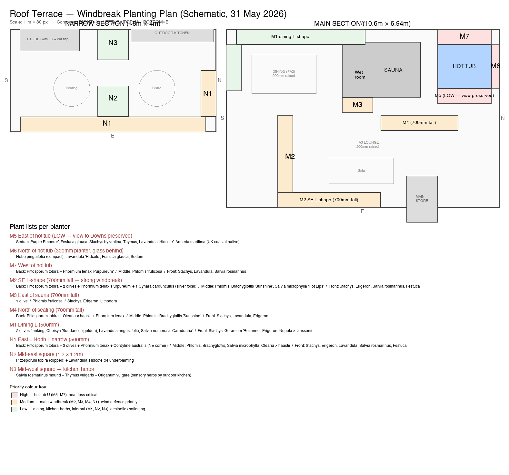

# Roof Terrace — Planting Palette

> Working document — combined plant list for the Listed Building Application's biodiversity section. Combines (a) the existing planting palette discussed with Ronan/Chris and (b) plants identified in 76 photos of Sussex Square's communal gardens. Plants are grouped by use-layer (architectural, sub-shrubs, perennials, etc.) so the structure mirrors how the planting will be assembled in the planters.

**Columns:**
- **Sussex Square presence** — number of distinct photos a plant appears in (×N). High-count plants make the strongest heritage-continuity case to planning. Plants in our palette but not seen in the photo set are marked "—" (still legitimate — the photo set isn't exhaustive).
- **Mature size** — H × W at maturity (in containers, expect ~70-80% of these figures).
- **Growth rate** — Slow / Medium / Fast.
- **Biodiversity benefit** — RHS Plants for Pollinators status, native/naturalised status, seed/winter value.
- **Roof terrace fit** — ✅ good fit for our containers + exposure / ⚠️ works with caveats / ❌ not realistic for our conditions but listed for palette continuity.

*Images: thumbnails are pulled live from Wikimedia Commons. If a thumbnail fails to load, click the "Wikipedia →" link in the same cell to find the article and its images directly.*

---

# 🌬️ Windbreak Planting Plan (locked in 31 May 2026)

The terrace planting scheme has been organised to provide **wind defence on the north and east parapets** (the principal wind directions to defend against), while preserving the **east view to the Downs from the hot tub**. The plan deliberately leans on species already in the Sussex Square palette — no new species added.

**Companion drawing:** scale schematic showing each planter's position and proposed plants.

## Design principles

- **Layered planting** in each planter — tall windbreak species at the back (against parapet), mid-tall in the middle, low/trailing at the front
- **Olearia × haastii** is the primary back-row windbreak (1-1.5m natural compact dome, ×3 in Sussex Square photos — the most-evidenced tall coastal shrub in our palette)
- **Pittosporum tobira full species** reserved for the SE L-shape (M2, 700mm planter); **'Wheeler's Dwarf'** (1m compact cultivar) used in N2/N3 squares
- **Hot tub east leg (M5):** low planting only (under 300mm) — east view to Downs preserved
- **Hot tub north leg (M6):** compact uprights only — glass balustrade on parapet
- **8 olives** distributed: 3 in N1 + 2 in M1 + 2 in M2 + 1 in M3

## Plant lists per planter

| # | Planter | Plants |
|---|---|---|
| **M5** | East of hot tub (view preserved) | LOW only: *Sedum* 'Purple Emperor', *Festuca glauca*, *Stachys byzantina*, *Thymus*, *Lavandula* 'Hidcote', *Armeria maritima* |
| **M6** | North of hot tub (300mm, glass behind) | *Hebe pinguifolia* (compact), *Lavandula* 'Hidcote', *Festuca glauca*, *Sedum* |
| **M7** | West of hot tub | **Back:** *Olearia × haastii* + *Phormium tenax* 'Purpureum' / **Mid:** *Phlomis fruticosa* / **Front:** *Stachys*, *Lavandula*, *Salvia rosmarinus* |
| **M2** | SE L-shape (700mm tall) | **Back:** *Pittosporum tobira* (or 'Wheeler's Dwarf', clipped to 1.5m) + 2 olives + *Phormium* 'Purpureum' + 1 *Cynara cardunculus* / **Mid:** *Phlomis*, *Brachyglottis* 'Sunshine', *Salvia microphylla* 'Hot Lips' / **Front:** *Stachys*, *Erigeron*, *Salvia rosmarinus*, *Festuca* |
| **M3** | East of sauna (700mm tall) | 1 olive / *Phlomis fruticosa* / *Stachys*, *Erigeron*, *Lithodora* |
| **M4** | North of seating (vertical, 700mm tall) | **Back:** *Olearia × haastii* + *Phormium tenax* / **Mid:** *Phlomis*, *Brachyglottis* 'Sunshine' / **Front:** *Stachys*, *Lavandula*, *Erigeron* |
| **M1** | Dining L (500mm) | **Back:** *Olearia × haastii* (or *Pittosporum tobira* 'Wheeler's Dwarf') + 2 olives / **Mid:** *Choisya* 'Sundance', *Lavandula angustifolia*, *Salvia nemorosa* 'Caradonna' / **Front:** *Stachys*, *Geranium* 'Rozanne', *Erigeron*, *Nepeta × faassenii* |
| **N1** | East + North L narrow (500mm) | **Back:** *Olearia × haastii* (spaced along run) + 3 olives + *Phormium tenax* + *Cordyline australis* (NE corner) / **Mid:** *Phlomis*, *Brachyglottis*, *Salvia microphylla* / **Front:** *Stachys*, *Erigeron*, *Lavandula*, *Salvia rosmarinus*, *Festuca* |
| **N2** | Mid-east square (1.2 × 1.2m) | *Pittosporum tobira* 'Wheeler's Dwarf' (1m dome) + *Phormium tenax* / *Lavandula* 'Hidcote' underplanting |
| **N3** | Mid-west square (kitchen-adjacent) | *Pittosporum tobira* 'Wheeler's Dwarf' + *Salvia rosmarinus* + *Thymus vulgaris* + *Origanum vulgare* |

### Movable pots

**South-end cluster (5 pots at SE corner of narrow):** 1 large olive (focal) + 4 mixed (*Phormium tenax*, *Lavandula*, *Salvia rosmarinus*, *Cordyline australis* compact). All moveable.

**West of N3:** mixed soft pots — *Lavandula*, *Stachys*, herbs. Softens the kitchen-to-N3 transition.

---

The detailed palette below is the source of plant data (mature size, growth rate, biodiversity benefit, Sussex Square frequency, terrace fit). Species used in the windbreak plan are flagged in the **🌬️ Windbreak Plan species summary** section near the end of this document.

---

## A. Specimen trees

| Image | Plant | Sussex Sq. | Mature H × W | Growth | Biodiversity | Roof terrace fit |
|---|---|---|---|---|---|---|
|  [Wikipedia →](https://en.wikipedia.org/wiki/Olive) | ***Olea europaea*** Olive tree | — (not in this photo set, but established in Sussex Square per Chris's knowledge) 📷 [1](https://github.com/chrisnewson/skynet/blob/main/roof-terrace/sussex-square-plants/0C8853AF-16C4-4EBC-85E0-34EE6288C33E.JPG) | Container: 2-3m × 1.5-2m | Slow | Pollen source spring; evergreen cover; long-lived. Not native but historically naturalised in S Britain. | ✅ 8× planned along east-edge run — needs large pot (min 60cm depth) and free-draining grit-loam. |
|  [Wikipedia →](https://en.wikipedia.org/wiki/Cordyline_australis) | ***Cordyline australis*** Cabbage palm / Torbay palm | **×2** 📷 [1](https://github.com/chrisnewson/skynet/blob/main/roof-terrace/sussex-square-plants/870DDB09-1368-4B80-9C9B-4D69F30275AA.JPG) [2](https://github.com/chrisnewson/skynet/blob/main/roof-terrace/sussex-square-plants/E06E0FE5-4206-44C3-BB30-FAC5312FCC1D.JPG) | 3-5m × 1.5-2m (dwarf forms 1-2m) | Medium | Cream flower panicles in summer attract bees; berries for birds. | ⚠️ Salt-tolerant but big — pick a dwarf cultivar or accept it'll outgrow a small pot. |

---

## B. Architectural / structural evergreens — the planting "bones"

| Image | Plant | Sussex Sq. | Mature H × W | Growth | Biodiversity | Roof terrace fit |
|---|---|---|---|---|---|---|
|  [Wikipedia →](https://en.wikipedia.org/wiki/Phormium_tenax) | ***Phormium tenax*** 'Purpureum' Bronze New Zealand flax | **×2** 📷 [1](https://github.com/chrisnewson/skynet/blob/main/roof-terrace/sussex-square-plants/039DB6A4-8713-4842-B89F-C2454ACFA809.JPG) [2](https://github.com/chrisnewson/skynet/blob/main/roof-terrace/sussex-square-plants/63BEEC7A-0048-4841-A006-697BE17C6FA2.JPG) | 1.5-2m × 1-1.5m | Medium | Tubular red flowers attract bees and nectar-feeding birds; evergreen cover. | ✅ Bullet-proof salt and wind tolerance; very Sussex Square. |
|  [Wikipedia →](https://en.wikipedia.org/wiki/Yucca_gloriosa) | ***Yucca gloriosa*** / *Y. recurvifolia* Adam's needle / Spanish dagger | **×2** 📷 [1](https://github.com/chrisnewson/skynet/blob/main/roof-terrace/sussex-square-plants/277C890F-9FBE-4831-8EB5-7949117884B2.JPG) [2](https://github.com/chrisnewson/skynet/blob/main/roof-terrace/sussex-square-plants/E06E0FE5-4206-44C3-BB30-FAC5312FCC1D.JPG) | 1.5-2m × 1.5m | Slow | Towering white flower panicles attract moths (night-flowering); strong nectar source. | ✅ Drought, salt, wind tolerant. *Recurvifolia* has softer leaves for paths. |
|  [Wikipedia →](https://en.wikipedia.org/wiki/Cynara_cardunculus) | ***Cynara cardunculus*** Cardoon | **×3** 📷 [1](https://github.com/chrisnewson/skynet/blob/main/roof-terrace/sussex-square-plants/1FB18DB4-807F-4531-858F-2201035E721C.JPG) [2](https://github.com/chrisnewson/skynet/blob/main/roof-terrace/sussex-square-plants/3D0A0149-56D2-4E77-B0B4-7EAC2016595E.JPG) [3](https://github.com/chrisnewson/skynet/blob/main/roof-terrace/sussex-square-plants/4065A0EC-66C7-45BF-AEDA-DE864462602D.JPG) [4](https://github.com/chrisnewson/skynet/blob/main/roof-terrace/sussex-square-plants/8D9CDC3D-1442-4DF6-83B9-2FBB0CD6B5FA.JPG) [5](https://github.com/chrisnewson/skynet/blob/main/roof-terrace/sussex-square-plants/B056E23B-EDC4-4CDF-A43B-2DD2869D56F3.JPG) | 1.5-2m × 1.2m (flowering stems) | Fast (perennial dieback) | RHS Plants for Pollinators; huge purple thistle heads = bumblebee magnet; seed heads for finches. | ✅ Spectacular silver focal-point. Needs the biggest pot you have — deep tap root. |
|  [Wikipedia →](https://en.wikipedia.org/wiki/Acanthus_mollis) | ***Acanthus mollis*** Bear's breeches | **×1** 📷 [1](https://github.com/chrisnewson/skynet/blob/main/roof-terrace/sussex-square-plants/D37837BB-91CD-442C-ADEA-F64F38E65CBA.JPG) | 1.2m × 1m | Medium | Tall white/purple flower spikes attract bumblebees and carpenter bees. | ✅ Glossy architectural foliage — pairs well with the building's clean aluminium cladding. |
|  [Wikipedia →](https://en.wikipedia.org/wiki/Euphorbia_characias) | ***Euphorbia characias*** subsp. *wulfenii* Mediterranean spurge | **×4 (most-repeated)** 📷 [1](https://github.com/chrisnewson/skynet/blob/main/roof-terrace/sussex-square-plants/19442A5C-E350-428E-84F8-B5746862F996.JPG) [2](https://github.com/chrisnewson/skynet/blob/main/roof-terrace/sussex-square-plants/1C5BCD8E-C258-4BCD-8DE6-C0B95DFF8910.JPG) [3](https://github.com/chrisnewson/skynet/blob/main/roof-terrace/sussex-square-plants/7D7DA600-54CB-48BD-B190-FCF6569C442F.JPG) [4](https://github.com/chrisnewson/skynet/blob/main/roof-terrace/sussex-square-plants/9EB7AD0D-D43D-44AC-BCFC-668346EB0934.JPG) | 1-1.2m × 1-1.2m | Fast | RHS Plants for Pollinators; chartreuse bracts produce abundant nectar Feb-May (early-season pollinator support). | ✅ Sussex Square's #1 plant. Sap is irritant — handle with gloves. |
|  [Wikipedia →](https://en.wikipedia.org/wiki/Euphorbia_myrsinites) | ***Euphorbia myrsinites*** Myrtle spurge / donkey-tail spurge | **×1** 📷 [1](https://github.com/chrisnewson/skynet/blob/main/roof-terrace/sussex-square-plants/9F5B54C4-1E32-46B2-A74B-B88196086B6C.JPG) | 15cm × 60cm (trailing) | Medium | RHS Plants for Pollinators; early-spring nectar. | ✅ Drapes beautifully over planter rims. Drought-loving. |

---

## C. Mediterranean / coastal sub-shrubs — the workhorse mid-layer

| Image | Plant | Sussex Sq. | Mature H × W | Growth | Biodiversity | Roof terrace fit |
|---|---|---|---|---|---|---|
|  [Wikipedia →](https://en.wikipedia.org/wiki/Rosemary) | ***Salvia rosmarinus*** (formerly *Rosmarinus officinalis*) Rosemary (incl. 'Prostratus' / 'Severn Sea') | **×4** 📷 [1](https://github.com/chrisnewson/skynet/blob/main/roof-terrace/sussex-square-plants/1C5BCD8E-C258-4BCD-8DE6-C0B95DFF8910.JPG) [2](https://github.com/chrisnewson/skynet/blob/main/roof-terrace/sussex-square-plants/27FCC76F-2998-4337-AA16-25D81F43A846.JPG) [3](https://github.com/chrisnewson/skynet/blob/main/roof-terrace/sussex-square-plants/60A82FA9-DBE1-438B-946A-D773EF721134.JPG) [4](https://github.com/chrisnewson/skynet/blob/main/roof-terrace/sussex-square-plants/79BF6069-9AB3-4C14-9EE8-7DAFEF901488.JPG) [5](https://github.com/chrisnewson/skynet/blob/main/roof-terrace/sussex-square-plants/E2040355-94D5-4EDA-9A35-3E0027C1E402.JPG) | 1-1.5m × 1-1.5m (upright); 30cm × 1.5m (prostrate) | Medium | RHS Plants for Pollinators; pale-blue flowers Feb-May — vital very-early bumblebee forage. | ✅ Sussex Square signature; salt-tolerant; herb for the kitchen too. |
|  [Wikipedia →](https://en.wikipedia.org/wiki/Lavandula_angustifolia) | ***Lavandula angustifolia*** / *L.* × *intermedia* English / French lavender | **×2** 📷 [1](https://github.com/chrisnewson/skynet/blob/main/roof-terrace/sussex-square-plants/79BF6069-9AB3-4C14-9EE8-7DAFEF901488.JPG) | 60cm × 80cm | Medium | RHS Plants for Pollinators; iconic bee magnet; long flowering June-August. | ✅ Already in the palette; deserves multiple drifts. |
|  [Wikipedia →](https://en.wikipedia.org/wiki/Santolina_chamaecyparissus) | ***Santolina chamaecyparissus*** Cotton lavender | **×4** 📷 [1](https://github.com/chrisnewson/skynet/blob/main/roof-terrace/sussex-square-plants/0045CC66-B681-4FEF-9A40-3A9D54785F61.JPG) [2](https://github.com/chrisnewson/skynet/blob/main/roof-terrace/sussex-square-plants/04653DB9-44FF-437F-96C9-C827BE5DF806.JPG) [3](https://github.com/chrisnewson/skynet/blob/main/roof-terrace/sussex-square-plants/623E16AA-8800-4035-91BD-47C0985DC644.JPG) [4](https://github.com/chrisnewson/skynet/blob/main/roof-terrace/sussex-square-plants/A6F28C41-3079-4F02-9D30-085AE0FCE6C3.JPG) [5](https://github.com/chrisnewson/skynet/blob/main/roof-terrace/sussex-square-plants/AB427A92-33D7-456A-82D3-02770DA0D5BF.JPG) | 50cm × 80cm | Medium | Yellow button flowers attract hoverflies and small bees. | ✅ Tight silver dome; clip after flowering to keep neat. |
|  [Wikipedia →](https://en.wikipedia.org/wiki/Helichrysum_italicum) | ***Helichrysum italicum*** Curry plant | ×1 📷 [1](https://github.com/chrisnewson/skynet/blob/main/roof-terrace/sussex-square-plants/3354DBE7-A400-463D-8162-9162B4D18A12.JPG) [2](https://github.com/chrisnewson/skynet/blob/main/roof-terrace/sussex-square-plants/623E16AA-8800-4035-91BD-47C0985DC644.JPG) [3](https://github.com/chrisnewson/skynet/blob/main/roof-terrace/sussex-square-plants/8751A187-D7DA-4688-9268-BB5E5EDB6644.JPG) [4](https://github.com/chrisnewson/skynet/blob/main/roof-terrace/sussex-square-plants/AB427A92-33D7-456A-82D3-02770DA0D5BF.JPG) | 40cm × 60cm | Medium | Small yellow flowers attract hoverflies; aromatic foliage deters pests. | ✅ Curry-scented in heat — sensory addition near the sauna. |
|  [Wikipedia →](https://en.wikipedia.org/wiki/Cistus) | ***Cistus* × *purpureus*** Orchid rockrose |  ×1 📷 [1](https://github.com/chrisnewson/skynet/blob/main/roof-terrace/sussex-square-plants/53EBC54E-3F1F-46C8-A400-30A49D40CC00.JPG) | 1m × 1m | Fast | Pollen-rich single flowers attract solitary bees. | ✅ Short-lived (~10yr) but spectacular bloomer June-July. |
|  [Wikipedia →](https://en.wikipedia.org/wiki/Brachyglottis) | ***Brachyglottis*** 'Sunshine' (Dunedin Group) / *Olearia* × *haastii* Daisy bush | **×3** 📷 [1](https://github.com/chrisnewson/skynet/blob/main/roof-terrace/sussex-square-plants/3122BAA6-DC91-41D1-B6AC-23F318EBEC88.JPG) [2](https://github.com/chrisnewson/skynet/blob/main/roof-terrace/sussex-square-plants/53EBC54E-3F1F-46C8-A400-30A49D40CC00.JPG) [3](https://github.com/chrisnewson/skynet/blob/main/roof-terrace/sussex-square-plants/63BEEC7A-0048-4841-A006-697BE17C6FA2.JPG) [4](https://github.com/chrisnewson/skynet/blob/main/roof-terrace/sussex-square-plants/D37837BB-91CD-442C-ADEA-F64F38E65CBA.JPG) | 1m × 1.5m | Medium | Yellow daisy flowers — *Brachyglottis* loved by hoverflies; *Olearia* by bees. | ✅ Bombproof seafront silver shrub. |
|  [Wikipedia →](https://en.wikipedia.org/wiki/Genista_lydia) | ***Genista lydia*** Lydian broom | **×2** 📷 [1](https://github.com/chrisnewson/skynet/blob/main/roof-terrace/sussex-square-plants/583C2DA0-D026-49FA-B371-3FED46C88692.JPG) [2](https://github.com/chrisnewson/skynet/blob/main/roof-terrace/sussex-square-plants/9171B71F-2EA2-4482-93E5-A43F1BAABCCF.JPG) | 60cm × 1m | Medium | RHS Plants for Pollinators; cascade of yellow pea-flowers — major early bee forage. | ✅ Spectacular tight mound, May-June. |
|  [Wikipedia →](https://en.wikipedia.org/wiki/Coronilla_valentina) | ***Coronilla valentina*** subsp. *glauca* 'Citrina' Yellow coronilla | **×2** 📷 [1](https://github.com/chrisnewson/skynet/blob/main/roof-terrace/sussex-square-plants/00132959-B53B-486C-B65C-A85DBAF71478.JPG) [2](https://github.com/chrisnewson/skynet/blob/main/roof-terrace/sussex-square-plants/1FB18DB4-807F-4531-858F-2201035E721C.JPG) | 80cm × 80cm | Fast | Winter-spring flowers (Dec-Apr) — vital out-of-season nectar. | ✅ Winter flower colour, scented at midday. |
|  [Wikipedia →](https://en.wikipedia.org/wiki/Phlomis_fruticosa) | ***Phlomis fruticosa*** Jerusalem sage | ×1 📷 [1](https://github.com/chrisnewson/skynet/blob/main/roof-terrace/sussex-square-plants/1A82F98F-59B5-4A4A-A67E-C7058BB441DF.JPG) | 1m × 1m | Medium | RHS Plants for Pollinators; whorled yellow flowers — bumblebee favourite. | ✅ Felted grey-green leaves, year-round structure. |
|  [Wikipedia →](https://en.wikipedia.org/wiki/Veronica_pinguifolia) | ***Hebe pinguifolia*** / *H. rakaiensis* / *H.* 'Pewter Dome' Whipcord / shrubby veronica | **×3** 📷 [1](https://github.com/chrisnewson/skynet/blob/main/roof-terrace/sussex-square-plants/9831CCA5-389F-48B0-B0BE-9A3EF3283663.JPG) [2](https://github.com/chrisnewson/skynet/blob/main/roof-terrace/sussex-square-plants/C7B92DAC-510E-400D-B1F0-A5F40E5C82EE.JPG) | 50cm × 1m | Slow | White flower spikes attract bees and butterflies. | ✅ Tight evergreen dome; effortless low maintenance. |
|  [Wikipedia →](https://en.wikipedia.org/wiki/Choisya_ternata) | ***Choisya ternata*** 'Sundance' / *C.* × *dewitteana* 'Aztec Pearl' Mexican orange blossom | **×2** 📷 [1](https://github.com/chrisnewson/skynet/blob/main/roof-terrace/sussex-square-plants/E9E56237-6769-4D46-822B-61604CD13370.JPG) | 1.5m × 1.5m | Medium | Scented white flowers attract bees, hoverflies, early butterflies; rebloom in autumn. | ✅ 'Sundance' = lime-yellow leaves for light. Scented. |
|  [Wikipedia →](https://en.wikipedia.org/wiki/Pittosporum_tenuifolium) | ***Pittosporum tenuifolium*** 'Golf Ball' / 'Limelight' / 'Tom Thumb' Kohuhu | **×2** 📷 [1](https://github.com/chrisnewson/skynet/blob/main/roof-terrace/sussex-square-plants/C4B51291-C190-42AD-BC9F-6B0ADD9CE2C7.JPG) [2](https://github.com/chrisnewson/skynet/blob/main/roof-terrace/sussex-square-plants/D8E98FB5-A2F6-40C6-82BB-80C38C3F1D2C.JPG) [3](https://github.com/chrisnewson/skynet/blob/main/roof-terrace/sussex-square-plants/E9E56237-6769-4D46-822B-61604CD13370.JPG) | 'Golf Ball' 80cm × 80cm; full sp. 4m | Medium | Dark purple scented flowers May-June for moths and bees. | ✅ Compact clipped balls — perfect for repeating rhythm down planters. |
|  [Wikipedia →](https://en.wikipedia.org/wiki/Pittosporum_tobira) | ***Pittosporum tobira*** Japanese mock orange | ×2 📷 [1](https://github.com/chrisnewson/skynet/blob/main/roof-terrace/sussex-square-plants/00132959-B53B-486C-B65C-A85DBAF71478.JPG) [2](https://github.com/chrisnewson/skynet/blob/main/roof-terrace/sussex-square-plants/26192A33-3043-4E7C-A044-997491C0ACBB.JPG) [3](https://github.com/chrisnewson/skynet/blob/main/roof-terrace/sussex-square-plants/475DA20F-40F5-4FBA-9FC2-A693247C845D.JPG) [4](https://github.com/chrisnewson/skynet/blob/main/roof-terrace/sussex-square-plants/4AA5C294-6D15-45E5-8C22-BC3A129B9629.JPG) | 2-3m × 2m (compact 'Nanum' 80cm) | Medium | Scented cream flowers attract bees and butterflies in summer. | ✅ Glossy evergreen, scented; use 'Nanum' for pots. |
|  [Wikipedia →](https://en.wikipedia.org/wiki/Euonymus_fortunei) | ***Euonymus fortunei*** 'Emerald Gaiety' / 'Silver Queen' Variegated wintercreeper | ×1 📷 [1](https://github.com/chrisnewson/skynet/blob/main/roof-terrace/sussex-square-plants/B2057552-D4B0-4ECA-8A42-053277EC3075.JPG) | 80cm × 1.2m | Slow | Tiny green flowers attract hoverflies; berries for birds in autumn. | ✅ Reliable variegated evergreen, very seafront-hardy. |
|  [Wikipedia →](https://en.wikipedia.org/wiki/Lonicera_nitida) | ***Lonicera nitida*** / *L. pileata* Wilson's honeysuckle | ×2 📷 [1](https://github.com/chrisnewson/skynet/blob/main/roof-terrace/sussex-square-plants/277C890F-9FBE-4831-8EB5-7949117884B2.JPG) [2](https://github.com/chrisnewson/skynet/blob/main/roof-terrace/sussex-square-plants/4A551FC0-ABCD-414B-8480-0CB5D1F6CE7B.JPG) [3](https://github.com/chrisnewson/skynet/blob/main/roof-terrace/sussex-square-plants/756F7B0A-45C6-44B7-AD1E-9CEFFBE51BFB.JPG) [4](https://github.com/chrisnewson/skynet/blob/main/roof-terrace/sussex-square-plants/E06E0FE5-4206-44C3-BB30-FAC5312FCC1D.JPG) | 1-1.5m × 1.5m (clipped tighter) | Fast | Small white flowers for bees; purple berries for birds (poisonous to humans). | ✅ Reliable clipped low hedge plant. |

---

## D. Silver / grey foliage perennials — the coastal-meadow ground layer

| Image | Plant | Sussex Sq. | Mature H × W | Growth | Biodiversity | Roof terrace fit |
|---|---|---|---|---|---|---|
|  [Wikipedia →](https://en.wikipedia.org/wiki/Stachys_byzantina) | ***Stachys byzantina*** Lamb's ears | **×4** 📷 [1](https://github.com/chrisnewson/skynet/blob/main/roof-terrace/sussex-square-plants/00710DC3-4661-481D-98E3-7761072EA61D.JPG) [2](https://github.com/chrisnewson/skynet/blob/main/roof-terrace/sussex-square-plants/26192A33-3043-4E7C-A044-997491C0ACBB.JPG) [3](https://github.com/chrisnewson/skynet/blob/main/roof-terrace/sussex-square-plants/27FCC76F-2998-4337-AA16-25D81F43A846.JPG) [4](https://github.com/chrisnewson/skynet/blob/main/roof-terrace/sussex-square-plants/649F1791-FCC1-4D2F-AB12-1356BC97A85E.JPG) [5](https://github.com/chrisnewson/skynet/blob/main/roof-terrace/sussex-square-plants/B056E23B-EDC4-4CDF-A43B-2DD2869D56F3.JPG) [6](https://github.com/chrisnewson/skynet/blob/main/roof-terrace/sussex-square-plants/E2040355-94D5-4EDA-9A35-3E0027C1E402.JPG) | 30cm × 60cm (flowers 60cm) | Medium | Wool carder bees (*Anthidium manicatum*) collect leaf hairs to line nests — a UK biodiversity rarity. | ✅ Silver tactile foliage; clear edging plant. |
|  [Wikipedia →](https://en.wikipedia.org/wiki/Jacobaea_maritima) | ***Senecio cineraria*** (now *Jacobaea maritima*) Dusty miller / silver ragwort | ×2 📷 [1](https://github.com/chrisnewson/skynet/blob/main/roof-terrace/sussex-square-plants/00710DC3-4661-481D-98E3-7761072EA61D.JPG) [2](https://github.com/chrisnewson/skynet/blob/main/roof-terrace/sussex-square-plants/D37837BB-91CD-442C-ADEA-F64F38E65CBA.JPG) | 60cm × 60cm | Fast | Coastal native (Med); yellow flowers attract hoverflies. | ✅ Short-lived (2-3yr) but cheap and replaces easily. |
|  [Wikipedia →](https://en.wikipedia.org/wiki/Artemisia_\(plant\)) | ***Artemisia*** 'Powis Castle' Wormwood | ×1 📷 [1](https://github.com/chrisnewson/skynet/blob/main/roof-terrace/sussex-square-plants/0045CC66-B681-4FEF-9A40-3A9D54785F61.JPG) | 60cm × 80cm | Fast | Aromatic foliage host plant for several moth species. | ✅ Soft silver cloud; needs cutting back hard each spring. |
|  [Wikipedia →](https://en.wikipedia.org/wiki/Convolvulus_cneorum) | ***Convolvulus cneorum*** Silverbush / bush morning glory | — | 60cm × 80cm | Medium | White trumpets with pink reverse — bee-friendly all summer. | ✅ Compact silver evergreen; underused in Brighton. |
|  [Wikipedia →](https://en.wikipedia.org/wiki/Glaucium_flavum) | ***Glaucium flavum*** Yellow horned poppy | P×1 📷 [1](https://github.com/chrisnewson/skynet/blob/main/roof-terrace/sussex-square-plants/007D1018-9E18-43AF-858C-7F2C38FA7A41.JPG) | 40cm × 50cm | Fast (short-lived) | **UK coastal native**; yellow saucers attract pollinators. | ✅ Strong native-coastal credentials for BNG case. |

---

## E. Long-flowering perennials — the pollinator layer (June-October)

| Image | Plant | Sussex Sq. | Mature H × W | Growth | Biodiversity | Roof terrace fit |
|---|---|---|---|---|---|---|
|  [Wikipedia →](https://en.wikipedia.org/wiki/Nepeta_%C3%97_faassenii) | ***Nepeta* × *faassenii*** 'Six Hills Giant' Catmint |  **×6 (most-frequent perennial)** 📷 [1](https://github.com/chrisnewson/skynet/blob/main/roof-terrace/sussex-square-plants/475C9CD9-025E-4975-9092-BAF87A55C8C3.JPG) [2](https://github.com/chrisnewson/skynet/blob/main/roof-terrace/sussex-square-plants/5939FFAF-74C9-48A8-8134-0EBECBEFBE05.JPG) [3](https://github.com/chrisnewson/skynet/blob/main/roof-terrace/sussex-square-plants/691F971B-F280-4F2D-A7B8-67E9AC365D8C.JPG) [4](https://github.com/chrisnewson/skynet/blob/main/roof-terrace/sussex-square-plants/B056E23B-EDC4-4CDF-A43B-2DD2869D56F3.JPG) [5](https://github.com/chrisnewson/skynet/blob/main/roof-terrace/sussex-square-plants/DFFA4372-B835-4121-B392-8447F19918B5.JPG) | 75cm × 75cm | Fast | RHS Plants for Pollinators top performer; bees and butterflies all summer if deadheaded. | ✅ Sussex Square's dominant edging plant. Mandatory. |
|  [Wikipedia →](https://en.wikipedia.org/wiki/Centranthus_ruber) | ***Centranthus ruber*** Red valerian | **×5** 📷 [1](https://github.com/chrisnewson/skynet/blob/main/roof-terrace/sussex-square-plants/4488BC5F-785B-4732-B79C-24B16CC7ED09.JPG) [2](https://github.com/chrisnewson/skynet/blob/main/roof-terrace/sussex-square-plants/475C9CD9-025E-4975-9092-BAF87A55C8C3.JPG) [3](https://github.com/chrisnewson/skynet/blob/main/roof-terrace/sussex-square-plants/475DA20F-40F5-4FBA-9FC2-A693247C845D.JPG) [4](https://github.com/chrisnewson/skynet/blob/main/roof-terrace/sussex-square-plants/599168BC-07CA-48F0-B9F7-F12BA8AD90B3.JPG) [5](https://github.com/chrisnewson/skynet/blob/main/roof-terrace/sussex-square-plants/79BF6069-9AB3-4C14-9EE8-7DAFEF901488.JPG) | 80cm × 60cm | Fast | RHS Plants for Pollinators; especially loved by butterflies (Painted Lady, Red Admiral) and hummingbird hawkmoth. | ✅ Brighton's signature seafront self-seeder. |
|  [Wikipedia →](https://en.wikipedia.org/wiki/Geranium_%27Rozanne%27) | ***Geranium*** 'Rozanne' / *G. sanguineum* / *G.* × *magnificum* Hardy cranesbill | **×4** 📷 [1](https://github.com/chrisnewson/skynet/blob/main/roof-terrace/sussex-square-plants/00710DC3-4661-481D-98E3-7761072EA61D.JPG) [2](https://github.com/chrisnewson/skynet/blob/main/roof-terrace/sussex-square-plants/007D1018-9E18-43AF-858C-7F2C38FA7A41.JPG) [3](https://github.com/chrisnewson/skynet/blob/main/roof-terrace/sussex-square-plants/3354DBE7-A400-463D-8162-9162B4D18A12.JPG) [4](https://github.com/chrisnewson/skynet/blob/main/roof-terrace/sussex-square-plants/B6C5F4FC-37D1-48BA-AD4D-075A0C8DA0FE.JPG) [5](https://github.com/chrisnewson/skynet/blob/main/roof-terrace/sussex-square-plants/BC6AD9C1-8744-447B-A548-D7C40943421E.JPG) | 50cm × 1m | Fast | RHS Plants for Pollinators; 'Rozanne' flowers May-Nov non-stop — UK's longest-flowering hardy perennial. | ✅ Effortless workhorse perennial. |
|  [Wikipedia →](https://en.wikipedia.org/wiki/Salvia_nemorosa) | ***Salvia nemorosa*** 'Caradonna' Balkan clary / woodland sage | ×1 📷 [1](https://github.com/chrisnewson/skynet/blob/main/roof-terrace/sussex-square-plants/0045CC66-B681-4FEF-9A40-3A9D54785F61.JPG) [2](https://github.com/chrisnewson/skynet/blob/main/roof-terrace/sussex-square-plants/4AA5C294-6D15-45E5-8C22-BC3A129B9629.JPG) | 60cm × 40cm | Medium | RHS Plants for Pollinators; deep-purple spikes — bumblebee favourite. | ✅ Black-stemmed cultivar = excellent contrast with silvers. |
|  [Wikipedia →](https://en.wikipedia.org/wiki/Salvia_microphylla) | ***Salvia microphylla*** 'Hot Lips' Hot Lips sage / blackcurrant sage | **×3** 📷 [1](https://github.com/chrisnewson/skynet/blob/main/roof-terrace/sussex-square-plants/039DB6A4-8713-4842-B89F-C2454ACFA809.JPG) [2](https://github.com/chrisnewson/skynet/blob/main/roof-terrace/sussex-square-plants/4065A0EC-66C7-45BF-AEDA-DE864462602D.JPG) [3](https://github.com/chrisnewson/skynet/blob/main/roof-terrace/sussex-square-plants/4AA5C294-6D15-45E5-8C22-BC3A129B9629.JPG) [4](https://github.com/chrisnewson/skynet/blob/main/roof-terrace/sussex-square-plants/D8E98FB5-A2F6-40C6-82BB-80C38C3F1D2C.JPG) [5](https://github.com/chrisnewson/skynet/blob/main/roof-terrace/sussex-square-plants/E9E56237-6769-4D46-822B-61604CD13370.JPG) | 1m × 1m | Fast | RHS Plants for Pollinators; red/white bicolour flowers May-Nov — bumblebee magnet. | ✅ Late-season colour when most perennials are over. |
|  [Wikipedia →](https://en.wikipedia.org/wiki/Bistorta_amplexicaulis) | ***Persicaria amplexicaulis*** Red bistort / mountain fleece | ×2 📷 [1](https://github.com/chrisnewson/skynet/blob/main/roof-terrace/sussex-square-plants/26192A33-3043-4E7C-A044-997491C0ACBB.JPG) [2](https://github.com/chrisnewson/skynet/blob/main/roof-terrace/sussex-square-plants/4AA5C294-6D15-45E5-8C22-BC3A129B9629.JPG) | 1.2m × 1.2m | Fast | RHS Plants for Pollinators; pink bottlebrushes Jul-Oct attract bees and butterflies. | ⚠️ Wants moisture — only put where pot is large enough. |
|  [Wikipedia →](https://en.wikipedia.org/wiki/Erigeron_karvinskianus) | ***Erigeron karvinskianus*** Mexican fleabane / Spanish daisy | **×4** 📷 [1](https://github.com/chrisnewson/skynet/blob/main/roof-terrace/sussex-square-plants/63BEEC7A-0048-4841-A006-697BE17C6FA2.JPG) [2](https://github.com/chrisnewson/skynet/blob/main/roof-terrace/sussex-square-plants/C715649F-33A3-4B20-B527-389C6D1CD5CD.JPG) [3](https://github.com/chrisnewson/skynet/blob/main/roof-terrace/sussex-square-plants/DF581490-D4B3-437C-A0FC-985971D9C519.JPG) | 30cm × 60cm | Fast (self-seeds prolifically) | RHS Plants for Pollinators; tiny daisies attract hoverflies and small bees Apr-Nov. | ✅ Soft-edge / planter-rim spill. Sussex Square's signature crack-filler. |
|  [Wikipedia →](https://en.wikipedia.org/wiki/Geum) | ***Geum*** 'Totally Tangerine' / 'Mrs Bradshaw' Avens | ×1 📷 [1](https://github.com/chrisnewson/skynet/blob/main/roof-terrace/sussex-square-plants/5D2B55AC-87B1-4EB2-808E-2A5EB3E8B02A.JPG) | 60cm × 60cm | Fast | Long-flowering for bees and hoverflies (May-Sep). | ✅ Vivid orange — useful warm accent. |
|  [Wikipedia →](https://en.wikipedia.org/wiki/Aster_%C3%97_frikartii) | ***Aster* × *frikartii*** 'Mönch' / *Symphyotrichum* sp. Michaelmas daisy |  ×1 📷 [1](https://github.com/chrisnewson/skynet/blob/main/roof-terrace/sussex-square-plants/3122BAA6-DC91-41D1-B6AC-23F318EBEC88.JPG) | 80cm × 50cm | Medium | RHS Plants for Pollinators; key late-season nectar (Aug-Oct) for butterflies preparing to migrate/hibernate. | ✅ Critical autumn pollinator support. |
|  [Wikipedia →](https://en.wikipedia.org/wiki/Aquilegia_vulgaris) | ***Aquilegia vulgaris*** Granny's bonnets / columbine | ×1 📷 [1](https://github.com/chrisnewson/skynet/blob/main/roof-terrace/sussex-square-plants/D92A330C-3998-4AD5-9372-235F7EE467BB.JPG) | 60cm × 40cm | Medium | **UK native**; long-tongued bumblebees pollinate (only species that can reach the spurs). | ✅ Cottage-garden / heritage feel; early flowering. |
|  [Wikipedia →](https://en.wikipedia.org/wiki/Verbena_bonariensis) | ***Verbena bonariensis*** Purpletop / Argentinian vervain | — | 1.5m × 60cm | Fast | RHS Plants for Pollinators top performer; especially butterflies and hummingbird hawkmoth Jul-Oct. | ✅ Tall airy purple haze; key pollinator pick. |
|  [Wikipedia →](https://en.wikipedia.org/wiki/Echinacea_purpurea) | ***Echinacea purpurea*** Purple coneflower | — | 1m × 50cm | Medium | RHS Plants for Pollinators; butterfly favourite; seed heads for finches in winter. | ✅ Strong vertical, good winter seed heads. |
|  [Wikipedia →](https://en.wikipedia.org/wiki/Tradescantia) | ***Tradescantia* × *andersoniana*** Spiderwort |  ×1 📷 [1](https://github.com/chrisnewson/skynet/blob/main/roof-terrace/sussex-square-plants/9F5B54C4-1E32-46B2-A74B-B88196086B6C.JPG) | 50cm × 50cm | Medium | Long-flowering for bees Jun-Sep. | ⚠️ Wants damper soil than typical for our pots. |

---

## F. Bulbs and accents

| Image | Plant | Sussex Sq. | Mature H × W | Growth | Biodiversity | Roof terrace fit |
|---|---|---|---|---|---|---|
|  [Wikipedia →](https://en.wikipedia.org/wiki/Allium_giganteum) | ***Allium*** 'Globemaster' / 'Purple Sensation' / *A. giganteum* Ornamental onion | **×3** 📷 [1](https://github.com/chrisnewson/skynet/blob/main/roof-terrace/sussex-square-plants/5939FFAF-74C9-48A8-8134-0EBECBEFBE05.JPG) [2](https://github.com/chrisnewson/skynet/blob/main/roof-terrace/sussex-square-plants/B056E23B-EDC4-4CDF-A43B-2DD2869D56F3.JPG) | 80cm-1.2m × 15cm | Medium (bulbs perennialise) | RHS Plants for Pollinators; drumsticks loved by bees; seed heads for winter structure. | ✅ Drama for low cost. |
|  [Wikipedia →](https://en.wikipedia.org/wiki/Iris_germanica) | ***Iris germanica*** Bearded iris | ×1 📷 [1](https://github.com/chrisnewson/skynet/blob/main/roof-terrace/sussex-square-plants/4488BC5F-785B-4732-B79C-24B16CC7ED09.JPG) | 1m × 40cm | Medium | Bumblebees and solitary bees; sword-leaf structure year round. | ✅ Drought-tolerant once established; rhizomes need sun-baking. |

---

## G. Grasses

| Image | Plant | Sussex Sq. | Mature H × W | Growth | Biodiversity | Roof terrace fit |
|---|---|---|---|---|---|---|
|  [Wikipedia →](https://en.wikipedia.org/wiki/Nassella_tenuissima) | ***Stipa tenuissima*** (now *Nassella tenuissima*) Mexican feather grass | **×3** 📷 [1](https://github.com/chrisnewson/skynet/blob/main/roof-terrace/sussex-square-plants/5939FFAF-74C9-48A8-8134-0EBECBEFBE05.JPG) [2](https://github.com/chrisnewson/skynet/blob/main/roof-terrace/sussex-square-plants/5CB720C7-4D9B-4E5B-BAED-0C55E32CC5BF.JPG) [3](https://github.com/chrisnewson/skynet/blob/main/roof-terrace/sussex-square-plants/649F1791-FCC1-4D2F-AB12-1356BC97A85E.JPG) [4](https://github.com/chrisnewson/skynet/blob/main/roof-terrace/sussex-square-plants/D8E98FB5-A2F6-40C6-82BB-80C38C3F1D2C.JPG) | 60cm × 40cm | Fast | Seed heads for finches; cover for invertebrates. | ✅ Movement and texture; self-seeds gently. |
|  [Wikipedia →](https://en.wikipedia.org/wiki/Festuca_glauca) | ***Festuca glauca*** 'Elijah Blue' Blue fescue | ×1 📷 [1](https://github.com/chrisnewson/skynet/blob/main/roof-terrace/sussex-square-plants/783DCAEE-A1F8-4D35-A8CD-F4DE5EB467AA.JPG) [2](https://github.com/chrisnewson/skynet/blob/main/roof-terrace/sussex-square-plants/D8E98FB5-A2F6-40C6-82BB-80C38C3F1D2C.JPG) | 25cm × 25cm | Slow | Seed heads for small birds; ground-cover habitat for invertebrates. | ✅ Tight blue-grey tussock for edging. |

---

## H. Mat / trailing / wall-spill

| Image | Plant | Sussex Sq. | Mature H × W | Growth | Biodiversity | Roof terrace fit |
|---|---|---|---|---|---|---|
|  [Wikipedia →](https://en.wikipedia.org/wiki/Lithodora_diffusa) | ***Lithodora diffusa*** 'Heavenly Blue' Lithodora | ×1 📷 [1](https://github.com/chrisnewson/skynet/blob/main/roof-terrace/sussex-square-plants/5492AEAA-35EB-4899-AC9D-4FAA27D05F2D.JPG) | 15cm × 90cm (mat) | Medium | Vivid gentian-blue flowers attract bees. | ✅ Needs acid soil — ericaceous compost in its pot. |
|  [Wikipedia →](https://en.wikipedia.org/wiki/Lysimachia_nummularia) | ***Lysimachia nummularia*** 'Aurea' Golden creeping Jenny | ×1 📷 [1](https://github.com/chrisnewson/skynet/blob/main/roof-terrace/sussex-square-plants/00710DC3-4661-481D-98E3-7761072EA61D.JPG) [2](https://github.com/chrisnewson/skynet/blob/main/roof-terrace/sussex-square-plants/691F971B-F280-4F2D-A7B8-67E9AC365D8C.JPG) | 5cm × indefinite (trails) | Fast | Yellow flowers for bees and hoverflies. | ✅ Trails over planter rims with gold colour. |
|  [Wikipedia →](https://en.wikipedia.org/wiki/Hylotelephium) | ***Sedum*** / *Hylotelephium* 'Purple Emperor' / 'Matrona' / 'Autumn Joy' Stonecrop / iceplant | ×1 📷 [1](https://github.com/chrisnewson/skynet/blob/main/roof-terrace/sussex-square-plants/DF3C656E-1E5F-482B-9189-711ABA313837.JPG) | 50cm × 50cm | Medium | RHS Plants for Pollinators; key late-summer/autumn nectar for butterflies and bees; seed heads in winter. | ✅ Drought-specialist; sculptural flat flower heads. |
|  [Wikipedia →](https://en.wikipedia.org/wiki/Iberis_sempervirens) | ***Iberis sempervirens*** Perennial candytuft | ×1 📷 [1](https://github.com/chrisnewson/skynet/blob/main/roof-terrace/sussex-square-plants/B2057552-D4B0-4ECA-8A42-053277EC3075.JPG) [2](https://github.com/chrisnewson/skynet/blob/main/roof-terrace/sussex-square-plants/E9E56237-6769-4D46-822B-61604CD13370.JPG) | 25cm × 60cm | Medium | White flower mats attract bees and hoverflies Apr-Jun. | ✅ Evergreen mat for the front of any planter. |
|  [Wikipedia →](https://en.wikipedia.org/wiki/Cerastium_tomentosum) | ***Cerastium tomentosum*** Snow-in-summer | ×1 📷 [1](https://github.com/chrisnewson/skynet/blob/main/roof-terrace/sussex-square-plants/B2057552-D4B0-4ECA-8A42-053277EC3075.JPG) [2](https://github.com/chrisnewson/skynet/blob/main/roof-terrace/sussex-square-plants/E9E56237-6769-4D46-822B-61604CD13370.JPG) | 15cm × 60cm (vigorous) | Fast (can be invasive) | White flowers for bees in early summer. | ⚠️ Spreads aggressively — confine to a pot, not a continuous run. |

---

## I. Coastal specialists — strongest BNG / native-meadow credentials

| Image | Plant | Sussex Sq. | Mature H × W | Growth | Biodiversity | Roof terrace fit |
|---|---|---|---|---|---|---|
|  [Wikipedia →](https://en.wikipedia.org/wiki/Eryngium_giganteum) | ***Eryngium giganteum*** 'Miss Willmott's Ghost' / *E. bourgatii* Sea holly | ×1 📷 [1](https://github.com/chrisnewson/skynet/blob/main/roof-terrace/sussex-square-plants/F1AFACD5-2039-49A4-B4FE-8B834B1B0CDE.JPG) | 80cm × 50cm | Medium (monocarpic but self-seeds) | RHS Plants for Pollinators top performer; specialists' favourite — bumblebees, solitary bees, hoverflies, wasps, beetles all crowd it. | ✅ Iconic seaside plant; silvery-white bracts. |
|  [Wikipedia →](https://en.wikipedia.org/wiki/Crambe_maritima) | ***Crambe maritima*** Sea kale | — | 60cm × 80cm | Medium | **UK shingle-shore native** (Sussex coast); white cloud flowers for bees; edible spring shoots. | ✅ Strong native-coastal credentials; sea-edge authenticity. |
|  [Wikipedia →](https://en.wikipedia.org/wiki/Armeria_maritima) | ***Armeria maritima*** Sea thrift / sea pink | — | 20cm × 30cm | Slow | **UK coastal native**; pink pompoms for bees and butterflies; cushion habitat for invertebrates. | ✅ Compact native cushion — perfect for planter edges. |

---

## J. Herbs

| Image | Plant | Sussex Sq. | Mature H × W | Growth | Biodiversity | Roof terrace fit |
|---|---|---|---|---|---|---|
|  [Wikipedia →](https://en.wikipedia.org/wiki/Foeniculum_vulgare) | ***Foeniculum vulgare*** ('Purpureum' = bronze) Fennel | ×1 📷 [1](https://github.com/chrisnewson/skynet/blob/main/roof-terrace/sussex-square-plants/CBE92EC6-4981-4984-A956-7C032B1FF351.JPG) | 1.8m × 60cm | Fast | Larval food plant of swallowtail butterfly; umbel flowers attract many small pollinators. | ✅ Airy feathery foliage; aromatic. |
|  [Wikipedia →](https://en.wikipedia.org/wiki/Achillea_millefolium) | ***Achillea millefolium*** Yarrow | ×1 📷 [1](https://github.com/chrisnewson/skynet/blob/main/roof-terrace/sussex-square-plants/67B70374-8AC5-4E35-9CBB-0F51D9667D6A.JPG) | 60cm × 60cm | Fast | **UK native**; flat flowerheads attract hoverflies, wasps, small bees. | ✅ Native — strong BNG value. |
|  [Wikipedia →](https://en.wikipedia.org/wiki/Origanum_vulgare) | ***Origanum vulgare*** Wild marjoram / oregano | P×1 📷 [1](https://github.com/chrisnewson/skynet/blob/main/roof-terrace/sussex-square-plants/F1AFACD5-2039-49A4-B4FE-8B834B1B0CDE.JPG) | 40cm × 40cm | Fast | **UK native**; RHS Plants for Pollinators; one of the highest-rated nectar plants for butterflies. | ✅ Native, herb, pollinator — triple value. |
|  [Wikipedia →](https://en.wikipedia.org/wiki/Thymus_vulgaris) | ***Thymus vulgaris*** / *T. serpyllum* (creeping) Thyme | — | 30cm × 30cm | Slow | RHS Plants for Pollinators; tiny flowers swarm with bees. | ✅ Drought-loving; great in planter edges. |

---

## K. Variegated / golden accents (light contrast against the silvers and dark cardoons)

| Image | Plant | Sussex Sq. | Mature H × W | Growth | Biodiversity | Roof terrace fit |
|---|---|---|---|---|---|---|
|  [Wikipedia →](https://en.wikipedia.org/wiki/Cotinus_coggygria) | ***Cotinus coggygria*** 'Royal Purple' Smoke bush | ×1 📷 [1](https://github.com/chrisnewson/skynet/blob/main/roof-terrace/sussex-square-plants/9171B71F-2EA2-4482-93E5-A43F1BAABCCF.JPG) | 3-4m × 3m (kept smaller by pruning) | Medium | Fluffy flowerheads attract small pollinators; foliage host for several moth species. | ⚠️ Large; prune hard each spring to keep at 1.5m. |
|  [Wikipedia →](https://en.wikipedia.org/wiki/Cornus_alba) | ***Cornus alba*** 'Elegantissima' / 'Sibirica' Dogwood | ×2 📷 [1](https://github.com/chrisnewson/skynet/blob/main/roof-terrace/sussex-square-plants/3122BAA6-DC91-41D1-B6AC-23F318EBEC88.JPG) [2](https://github.com/chrisnewson/skynet/blob/main/roof-terrace/sussex-square-plants/C4B51291-C190-42AD-BC9F-6B0ADD9CE2C7.JPG) | 2m × 2m | Medium | Cream flowers for bees; berries for birds; winter red stems for invertebrate shelter. | ⚠️ Likes moisture — needs the deeper hot-tub-zone planters. |

---

## L. Shade / building-corner plants (only for shaded north-facing pots if used)

| Image | Plant | Sussex Sq. | Mature H × W | Growth | Biodiversity | Roof terrace fit |
|---|---|---|---|---|---|---|
|  [Wikipedia →](https://en.wikipedia.org/wiki/Helleborus_argutifolius) | ***Helleborus argutifolius*** Corsican hellebore | ×1 📷 [1](https://github.com/chrisnewson/skynet/blob/main/roof-terrace/sussex-square-plants/1A82F98F-59B5-4A4A-A67E-C7058BB441DF.JPG) | 1m × 1m | Medium | Early-spring nectar for waking bumblebees. | ⚠️ Tolerates sun but prefers part shade; useful for north pots. |
|  [Wikipedia →](https://en.wikipedia.org/wiki/Sarcococca) | ***Sarcococca confusa*** / *S. hookeriana* Sweet box / Christmas box | ×1 📷 [1](https://github.com/chrisnewson/skynet/blob/main/roof-terrace/sussex-square-plants/5DDC6D53-B2F6-4F48-9618-FE6580D062B6.JPG) | 1m × 1m | Slow | **Winter scent** Dec-Feb; small flowers feed very-early bees on warm days. | ⚠️ Shade-loving — pot it where it gets afternoon shade. |
|  [Wikipedia →](https://en.wikipedia.org/wiki/Buxus_sempervirens) | ***Buxus sempervirens*** (clipped balls) Common box | **×3** 📷 [1](https://github.com/chrisnewson/skynet/blob/main/roof-terrace/sussex-square-plants/2E3D37E3-24D3-481B-B2E6-3EBFB71C392B.JPG) [2](https://github.com/chrisnewson/skynet/blob/main/roof-terrace/sussex-square-plants/3C4BE96C-37F4-44C5-9DD6-4DC91D0FE095.JPG) [3](https://github.com/chrisnewson/skynet/blob/main/roof-terrace/sussex-square-plants/3D0A0149-56D2-4E77-B0B4-7EAC2016595E.JPG) [4](https://github.com/chrisnewson/skynet/blob/main/roof-terrace/sussex-square-plants/4A551FC0-ABCD-414B-8480-0CB5D1F6CE7B.JPG) | To 5m natural; kept 30-60cm as balls | Slow | Insignificant flowers; structural habitat for spiders/beetles. | ⚠️ Box blight risk — only if you can commit to spraying. *Pittosporum* 'Golf Ball' is a safer modern substitute. |
|  [Wikipedia →](https://en.wikipedia.org/wiki/Taxus_baccata) | ***Taxus baccata*** (dwarf cultivars) Yew | ×1 📷 [1](https://github.com/chrisnewson/skynet/blob/main/roof-terrace/sussex-square-plants/475C9CD9-025E-4975-9092-BAF87A55C8C3.JPG) [2](https://github.com/chrisnewson/skynet/blob/main/roof-terrace/sussex-square-plants/4A551FC0-ABCD-414B-8480-0CB5D1F6CE7B.JPG) | Clipped 50cm-1.5m as required | Slow | **UK native**; berries for thrushes/blackbirds (toxic to humans/dogs); year-round shelter. | ✅ Native, slow, low maintenance. |

---

## Summary tally

**~60 species / cultivars** across 12 layers.

| Photo frequency | Plants |
|---|---|
| **×6** | *Nepeta* × *faassenii* — Sussex Square's #1 plant in this photo set |
| **×5** | *Centranthus ruber* |
| **×4** | *Euphorbia characias wulfenii*, *Erigeron karvinskianus*, *Salvia rosmarinus*, *Stachys byzantina*, *Santolina chamaecyparissus*, *Geranium* sp. |
| **×3** | *Cynara cardunculus*, *Hebe* sp., *Salvia microphylla*, *Allium* sp., *Stipa tenuissima*, *Brachyglottis/Olearia*, *Buxus sempervirens* |

Plants in the palette but **not seen in this photo set** (still legitimate — palette is a deliberate broader pick): *Verbena bonariensis*, *Echinacea purpurea*, *Thymus* sp., *Crambe maritima*, *Armeria maritima*, *Convolvulus cneorum*.

---

# 🌬️ Windbreak Planting Plan (31 May 2026) — leaning on Sussex Square palette

The terrace planting scheme has been organised to provide **wind defence on the north and east parapets** (the principal wind directions to defend against), while preserving the **east view to the Downs from the hot tub**. The plan deliberately leans on species already in the Sussex Square palette to maximise heritage-continuity (and avoid adding species not seen in the area).

**Companion drawing:** see [`drawings/windbreak-planting-plan-31-5-26.png`](drawings/windbreak-planting-plan-31-5-26.png) for a scale schematic showing each planter's position and proposed plants.

## Species used in the windbreak plan

✅ All species below are **already in the Sussex Square palette** above — no new species added. Symbols indicate role in the windbreak plan:

| Symbol | Role |
|---|---|
| **🌳 BACK** | Tall back-row windbreak (1m+ above planter rim) |
| **🌿 MID** | Mid-layer (0.5-1m above rim) |
| **🌱 FRONT** | Front-row / trailing (under 0.3m) |
| **🫒 OLIVE** | Olive trees as architectural specimens |
| **🌶️ FOCAL** | Architectural focal plants (silver / structure) |
| **🌬️ FILTER** | Permeable wind-filter role (Cordyline-Phormium combo) |

## Plants used per role

### 🌳 BACK row (tall windbreak — 1m+ above rim)

> **Revised after Pittosporum-tobira-is-too-big concern:** Olearia × haastii is now the primary mid-tall windbreak (1-1.5m, well-evidenced in Sussex Square at ×3). Pittosporum tobira is reserved for M2 (where the 700mm planter + tall plant gives proper tall windbreak) and as the **'Wheeler's Dwarf'** cultivar (1m compact dome) in N2 and N3.

- ***Olearia × haastii*** (×3 Sussex Square photos via Olearia/Brachyglottis group) — **primary mid-tall windbreak**, naturally compact 1-1.5m dome, leathery dark green with white-felt underside; used in M1, M4, M7, N1 (spaced along run)
- ***Pittosporum tobira*** (full species, ×2 Sussex Square photos) — **only in M2** (back row, 700mm planter; clipped to 1.5m or use 'Wheeler's Dwarf' alternative)
- ***Pittosporum tobira* 'Wheeler's Dwarf'** — compact 1m dome cultivar; **N2, N3** (kitchen-adjacent windbreak balls)
- ***Cordyline australis*** (×2 Sussex Square) — vertical accent + filter; used at NE corner of N1
- ***Phormium tenax*** 'Purpureum' (×2 Sussex Square) — bronze sword leaves; M2, M4, M7, N1, **N2 (architectural punctuation)**

### 🌿 MID layer (0.5-1m)
- ***Phlomis fruticosa*** (×1 Sussex Square) — woolly grey; M2, M3, M4, M7
- ***Brachyglottis 'Sunshine'*** (×3 Sussex Square) — silver-yellow daisy; M2, M4, N1
- ***Olearia × haastii*** (×3 Sussex Square via Brachyglottis/Olearia group) — silver mid-shrub; M4, N1
- ***Salvia microphylla*** 'Hot Lips' (×3 Sussex Square) — red/white bicolor; M2, N1
- ***Salvia nemorosa*** 'Caradonna' (×1) — purple-black spikes; M1
- ***Choisya ternata*** 'Sundance' (×2 Sussex Square) — golden mid-shrub; M1 (warm dining accent)
- ***Hebe pinguifolia*** (×3 Sussex Square via Hebe group) — compact upright; M6 (300mm planter)

### 🌱 FRONT row / trailing
- ***Stachys byzantina*** (×4 Sussex Square) — silver lamb's ears; M2, M4, M5, M7, N1
- ***Erigeron karvinskianus*** (×4 Sussex Square) — pink-white daisies; M2, M3, M4, M1, N1
- ***Lavandula angustifolia*** / 'Hidcote' (×2 Sussex Square) — compact lavender; M1, M4, M6, M7, N1, N2
- ***Salvia rosmarinus*** (×4 Sussex Square) — rosemary; M2, M7, N1, N3 (kitchen)
- ***Festuca glauca*** (×1 Sussex Square) — blue tussocks; M2, M5, M6, N1
- ***Sedum*** / *Hylotelephium* 'Purple Emperor' (×1) — purple succulent rosettes; M5, M6
- ***Lithodora diffusa*** (×1) — azure-blue mat; M3
- ***Geranium*** 'Rozanne' (×4 Sussex Square — *Geranium* sp.) — long-flowering blue; M1
- ***Nepeta × faassenii*** (×6 Sussex Square — most-frequent perennial) — mauve haze; M1

### 🫒 OLIVE distribution (8 total)
- **N1 east leg:** 3 olives spaced along the 7.2m run
- **M1 dining L:** 2 olives flanking the dining table
- **M2 SE L-shape:** 2 olives in the 700mm tall planter
- **M3 east of sauna:** 1 olive as focal point

### 🌶️ FOCAL (architectural punctuation)
- ***Cynara cardunculus*** (×3 Sussex Square) — silver cardoon; placed in M2 as bold focal silver

### Kitchen herbs (N3, near outdoor kitchen)
- ***Salvia rosmarinus*** + ***Thymus vulgaris*** + ***Origanum vulgare*** (all ×1 Sussex Square or palette additions)

### Specifically for east-of-hot-tub planter (M5 — view to Downs preserved)
- ***Sedum*** 'Purple Emperor' + ***Festuca glauca*** + ***Stachys byzantina*** + ***Thymus*** + ***Lavandula*** 'Hidcote' + ***Armeria maritima*** (UK coastal native)
- All under 300mm at maturity — **no obstruction to the east view**

## Hot tub windbreak summary (M5–M7)

The hot tub U-shape planters sit at **+150mm above tub rim** — already a structural windbreak base. Planting strategy varies per leg:

| Leg | Direction | View priority | Plant strategy |
|---|---|---|---|
| **M5 East** | View to Downs (east) | **Preserve view** | Low planting only (under 300mm at maturity) |
| **M6 North** | Glass balustrade on parapet (no climber surface) | Wind defence | Compact uprights only (300mm planter depth limits choice) |
| **M7 West** | Sauna side (no view concern) | Full windbreak | Tall plants — Pittosporum tobira + Phormium + Phlomis |

---

*Working document for the roof terrace project at 22 Sussex Square, Brighton. Not for distribution outside Chris / Bond McCart / planning consultees. Image thumbnails sourced from Wikimedia Commons; click "Wikipedia →" in any row if the image fails to load.*