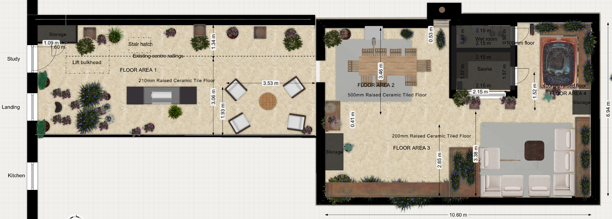
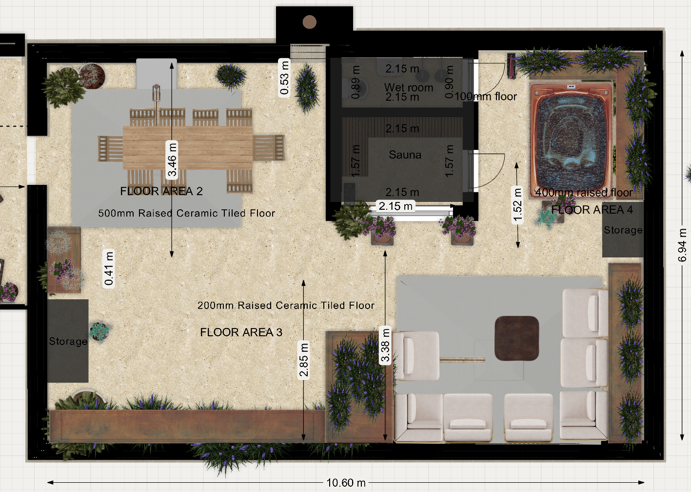

# Roof Terrace — Specification

> ⚠️ **IMPORTANT — please read first**
>
> This is **Chris's informal working document** for communicating his current best understanding of the project details with **Ronan Bond**. It is **not** a finished specification. It will contain inaccuracies, gaps, and assumptions that need to be checked. **Ronan's formal documents will be the authoritative source** — this document exists to feed into them.

## Brief for Surveyor

This is our draft of what we'd like to build on the roof terrace at 22 Sussex Square. It covers the sauna and wet room building, the hot tub, the surrounding terrace works (railings, parapets, parasols, fall protection, tiling, and planters). We've worked through it ourselves and there will be things we've got wrong, missed, or need your steer on. Where we're confident is the look and feel and the equipment we want; where we'd really value your input is on regs, structure, and any practical issues we haven't spotted.

The building shell (external walls, roof, weatherproofing) of the sauna/wet room structure is in your scope. This document covers the fit-out of those two rooms, the external openings (doors, windows), and all the terrace-wide works listed below.

**Orientation:** north is to the right of the floor plan drawing.

## Drawings

**Overall plan** (full terrace, including narrow section / FLOOR AREA 1 with lift bulkhead and stair hatch):



**Main section** (FLOOR AREAS 2, 3, 4 — dining, lounge, sauna / wet room building, hot tub):



## Contents

- [Part A — Sauna](#part-a--sauna)
- [Part B — Wet Room](#part-b--wet-room)
- [Part C — Smart Control (Home Assistant)](#part-c--smart-control-home-assistant)
- [Part D — Hot Tub](#part-d--hot-tub)
- [Part E — Railings](#part-e--railings)
- [Part F — Parapet Bird Deterrent (Post and Wire)](#part-f--parapet-bird-deterrent-post-and-wire)
- [Part G — Parasols](#part-g--parasols)
- [Part H — Fall Protection (Glass Balustrades & Planters)](#part-h--fall-protection-glass-balustrades--planters)
- [Part I — Terrace Tiling System](#part-i--terrace-tiling-system)
- [Part J — Planters](#part-j--planters)
- [Part K — Outdoor Tap](#part-k--outdoor-tap)
- [Part L — Existing Outdoor Sockets (Retain and Reposition)](#part-l--existing-outdoor-sockets-retain-and-reposition)
- [Part M — Roof Build-up & Structure (Asphalt, Insulation, Joists)](#part-m--roof-build-up--structure-asphalt-insulation-joists)

---

# PART A — SAUNA

**Internal dimensions:** 2.15m (east–west) × 1.57m (north–south)
**Minimum internal ceiling height:** 2.10m

## Floor

- Tanked (continuous with adjacent wet room), screeded to fall, R11 porcelain tile to match the rest of the terrace
- Removable softwood duckboards laid on top of the tile (flat-pack kit, e.g. Finnmark, ~£80–150)
- Stainless steel high-temperature drain connected to the terrace drainage

## Walls and Ceiling

- 100mm mineral wool insulation
- Foil vapour barrier on the interior face, fully taped
- Lined with untreated kiln-dried whitewood or spruce tongue-and-groove
- All fixings stainless steel

## Benches

L-shape wraparound, two-tier on both walls, all in the same untreated whitewood/spruce:

| Position | Height (FFL) | Depth | Length |
|---|---|---|---|
| Upper bench, west wall | 950mm | 550mm | 2.15m |
| Lower bench/step, west wall | 450mm | 350mm | 2.15m |
| Upper bench, south wall | 950mm | 550mm | 1.57m (less heater clearance) |
| Lower bench/step, south wall | 450mm | 350mm | 1.57m (less heater clearance) |

The upper bench wraps around the corner so two people can lie at right angles. The south-west end of the south wall benches needs to be cut back to maintain the heater manufacturer's required clearance (typically 100–200mm above and to the side — final dimensions to be confirmed against the chosen heater's spec sheet). A heat shield panel above the heater may also be needed.

## Door

- North wall, 600mm clear opening
- Pre-made outdoor sauna door, solid cedar, weatherproof frame and threshold (e.g. Finnmark, Auroom)
- Solid timber, no glazing
- Magnetic catch, 50N+ pull force (we want it wind-resistant); wooden handles
- Outward-opening, with restrictor chain to limit swing in wind
- Approximate cost: £250–450

## Window

- East wall, centred, sill at 1100mm from FFL
- **1800mm wide × 800mm tall**, single pane, top-hung (awning) opening — outward, hinged at top
- Aluminium frame, thermally broken
- Triple-glazed (e.g. 4-12-4-12-4), argon-filled, low-E coatings, warm edge spacers — chosen for thermal retention given rooftop exposure
- Compression seals: EPDM or silicone (heat/humidity tolerant)
- Restrictor stay to limit opening in wind
- External manual roller blackout blind on exterior above (sized to cover full 1800mm width)

## Heater

- 4kW electric sauna heater (e.g. Harvia Vega) in the south-east corner
- 10mm² silicon-rated cable to a fused spur in the corner
- Heater guard rail (usually supplied with unit)

## Ventilation

Passive only:
- 100mm inlet vent low on south or east wall, ~100mm from floor (near heater)
- 100mm outlet vent high on west or south wall, ~300mm from ceiling

## Lighting

- **2× sauna-rated LED ceiling fittings** (e.g. Cariitti, Tylö, Harvia) — purpose-made for sauna heat, ~£80–150 each
- Light switch outdoors on the terrace, beside the sauna door — IP55+ weatherproof

## Sockets (For Future Office / Bedroom Conversion)

We want this room to be convertible to an office or bedroom in future without retrofitting power, so:

- 2× IP54 double sockets at 300mm from FFL
- Socket 1: east wall, under the window (for a desk facing the view)
- Socket 2: north wall (general / bedside use)
- Dedicated 20A radial circuit
- Both sockets clear of the south-east heater corner
- Used only when the room is cold

## External Switches / Isolators (Sauna Side)

Grouped on the terrace wall beside the sauna door, IP55+ weatherproof:
- Sauna light switch (Shelly Plus 1 behind)
- 32A DP rotary isolator for the sauna heater (manual override / safety isolation)

---

# PART B — WET ROOM

**Internal dimensions:** 2.15m (north–south) × 0.9m (east–west)
**Minimum internal ceiling height:** 2.40m

## Layout

```
SOUTH                                            NORTH (door)

                  TOP/WEST WALL (2.15m)
        ┌──────────┬──────┬═════════╤═════════┐
        │          │      ║         │         │
        │  TOILET  │ SINK ║ ELECTRIC│ BUCKET  │
        │ on south │ on   ║ SHOWER  │ SHOWER  │
        │   wall   │ west ║ on west │ on west │ ← DOOR
        │          │ wall ║ wall    │ wall    │
        │          │      ║         │         │
        └──────────┴──────┴═════════╧═════════┘
                          ↑
                  ║ Linear drain runs east-west
                  ║ across the full 0.9m floor width,
                  ║ positioned 1050mm in from the
                  ║ north (door) wall

        BOTTOM/EAST WALL (clear standing space)

        ←─── DRY ZONE ───→  ←── WET ZONE ──→
              (~1.1m)             (~1.05m)
```

The whole floor is one tanked wet zone — no shower trays, no enclosures, no glass screens.

**Drain position (the key dimension):** linear drain across the full 0.9m room width, located **1050mm from the north (door) wall**. The floor falls 1:80 from both directions toward the drain — wet zone slopes south, dry zone slopes north.

## Floor

- Liquid tanking continuous with sauna, walls tanked to 1800mm minimum (full height in wet zone)
- Sand/cement screed to falls (1:80) toward the linear drain
- Stainless steel linear drain as above
- R11 porcelain floor tile, epoxy grout

## Walls

- Cement-board substrate (Hardiebacker, Aquapanel) on stud
- Porcelain wall tile to ceiling, epoxy grout
- Silicone to all internal corners and around fittings

## Toilet

- Standard wall-hung WC, ~520–560mm projection (e.g. Roca The Gap, Vitra S20, Geberit iCon)
- Centred on south wall
- Concealed cistern in stud framing behind

## Sink

- Wall-hung basin, approx 450mm wide × 350mm projection
- Single cold tap (no hot water in this room)
- Top/west wall, immediately north of the toilet

## Electric Shower

- 10.5kW unit (e.g. Mira Sport Max, Triton T90SR, Aqualisa Quartz Electric)
- Top/west wall, north end of wet zone (south of the bucket shower)
- Cold supply only
- Dedicated 10mm² circuit, 45A RCBO
- Ceiling pull-cord isolator within the room, away from the spray zone

## Cold Bucket Shower

This is a feature for us — traditional Finnish-style timber bucket on a pivoting wall arm, pull-cord operated, used as a cold plunge after the sauna.

- Wall-mounted kit (e.g. Finnmark, ~£80–150)
- Top/west wall, immediately south of the door (north end of wet zone)
- Mounted at 2100mm FFL — bucket sits above head height when not in use
- Cold supply with float valve so it auto-refills

## Plumbing Summary

- **Cold water only** — taken from existing terrace supply at south wall
- Cold runs to: toilet cistern (south wall), sink tap (south end of west wall), then along west wall to electric shower and bucket shower at north end
- Toilet waste: 110mm soil pipe south to existing soil stack
- Sink waste: bottle trap, connected to terrace drainage
- Linear drain: 50mm waste south to terrace drainage

## Door

- North wall, 762mm leaf
- Pre-made external cedar door — same supplier as the sauna door, so they match in appearance
- Weatherproof frame, threshold, compression seals
- Outward-opening (the current drawing shows inward — please amend)
- Restrictor chain
- Approximate cost: £350–600

## Ventilation

- Inline duct extractor fan in ceiling void, ducted out through nearest external wall
- 15 L/s minimum, IP44 minimum
- Humidity sensor + overrun timer
- E.g. Vent-Axia ACM Inline, Manrose CF200T (~£50–80)

## Lighting

- 3× IP65 LED downlights in ceiling, warm white (3000K)
- Light switch outdoors on the terrace, beside the wet room door — IP55+ weatherproof

## External Switches / Isolators (Wet Room Side)

Grouped on the terrace wall beside the wet room door, IP55+ weatherproof:
- Wet room light switch (Shelly Plus 1 behind)
- 3-pole fan isolator (for the extractor fan)
- 45A DP isolator for the electric shower (in addition to the internal pull-cord)

## External Socket (Terrace)

- 1× IP66 weatherproof double 13A socket on the building's external north wall, east end
- Mounted at ~450mm FFL
- Dedicated 20A radial circuit, RCD protected
- Integral switches; lockable cover optional

---

# PART C — SMART CONTROL (HOME ASSISTANT)

We run Home Assistant at home and want to control the switched circuits in the sauna and wet room via Shelly relays. This is the part most likely to be unfamiliar — flagging up front so you and the electrician can factor it in.

| Circuit | Shelly | Notes |
|---|---|---|
| Sauna heater (~17A) | Plus 1PM + 25A contactor | Shelly switches the contactor coil, contactor switches the heater. The 1PM gives us power monitoring in HA. |
| Sauna light | Plus 1 | Behind the switch outside the sauna |
| Wet room light | Plus 1 | Behind the switch outside the wet room |
| Wet room fan | Plus 1 | Behind the fan isolator |
| Electric shower | None | Standard pull-cord isolator only |

What this needs from the install:
- Shellys located in dry, cool, accessible places with 2.4GHz WiFi coverage (we'll confirm coverage)
- Live and neutral at the back of every switch position (worth flagging early to the electrician)
- A small DIN-rail enclosure for the heater contactor + Shelly somewhere outside the two rooms

---

# PART D — HOT TUB

We're planning to site a hot tub on the terrace alongside the sauna/wet room building. Including this here because the **structural loading on the terrace deck is the critical question for you**, and the model choice drives weight, footprint, and electrical supply. Final model TBC; shortlist below in our preferred order.

## Shortlist (ranked)

| # | Model | Origin | Shape | Dimensions | Filled (kg) | kg/m² | Price |
|---|---|---|---|---|---|---|---|
| 1 | [RotoSpa Orbis](https://www.rotospa.co.uk/product/the-orbis/) | UK (Sutton Coldfield) | Round | 183cm dia × 74cm | 950 | 361 | £3,995–4,895 |
| 2 | [RotoSpa QuatroSpa](https://www.rotospa.co.uk/) | UK (Sutton Coldfield) | Round | 200cm dia × 74cm | 1,160 | 369 | £3,415–4,750 |
| 3 | [Pre-owned Hot Spring Hot Spot](https://www.happyhottubs.co.uk/shop-hot-tubs/pre-owned-off-display-hot-tubs) | USA (California) | Rectangular | up to 213 × 213cm | 1,340 | 406 | £3,000–5,500 |
| 4 | [Pre-owned Jacuzzi J-200](https://www.hunsburyhottubs.co.uk/hot-tubs/pre-owned/) | Mexico (genuine Jacuzzi) | Round or rectangular | up to 213 × 213cm | 1,240 | 403 | £3,000–5,500 |
| 5 | [Fisher 3](https://fisherspas.com/) | NZ designed (Vortex) | Rectangular | 207 × 153 × 82cm | 1,121 | 354 | £3,500–5,500 |
| 6 | [Pre-owned Marquis Spirit](https://www.hunsburyhottubs.co.uk/hot-tubs/pre-owned/) | USA (Oregon) | Rectangular | 213 × 165 × 91cm | 1,280 | 365 | £3,500–5,500 |
| 7 | [H2O 2000 Series](https://www.h2ohottubs.co.uk/) | UK distributed; Chinese-built | Rectangular | 210 × 180 × 80cm | 1,200 | 317 | £3,000–4,500 |
| 8 | [Sunbeach SB355L](https://www.penguinspas.com/product-page/sunbeach-sb355l-5-person-plug-play-hot-tub) | UK designed; Chinese-built | Rectangular | 225 × 180 × 80cm | 1,280 | 316 | £4,200–5,700 |

Filled weight is shell + water, no occupants. Add ~10–15% for dynamic loading. Three adults add only ~25kg total (bodies displace nearly their own weight).

## Recommended suppliers

- **[RotoSpa](https://www.rotospa.co.uk/)** — direct from manufacturer for the Orbis / QuatroSpa
- **[Hunsbury Hot Tubs](https://www.hunsburyhottubs.co.uk/hot-tubs/pre-owned/)** (Northampton) — dedicated pre-owned premium specialist; Hot Spring, Jacuzzi, Marquis
- **[Happy Hot Tubs](https://www.happyhottubs.co.uk/shop-hot-tubs/pre-owned-off-display-hot-tubs)** (7 UK showrooms incl. Sussex) — wet-testing of pre-owned and ex-display
- **[My Hot Tub Mover](https://www.myhottubmover.co.uk/used-hot-tub-sales.html)** — UK-wide pre-owned, fully wet-tested
- **[H2O Hot Tubs](https://www.h2ohottubs.co.uk/)** (Nottingham) — for the H2O 2000 with strong UK warranty

## What we need from you on this

- Sign-off on **filled load** (with dynamic allowance) for the heaviest realistic option (~1,500kg) on the terrace deck
- Steer on whether to design for the lightest option (RotoSpa Orbis ~950kg) or build in headroom for any option on the list
- Crane access vs hand-carry: the RotoSpas can be carried up by two people; acrylic options likely need a crane
- Drainage: tub will need emptying 2–3× per year — best route to terrace drainage

---

# PART E — RAILINGS

The narrow section of the roof terrace currently has three sets of railings. We want to simplify and reclad them.

## Changes

- **Remove:** the centre railing, and the short railing joining the centre railing to the west railing
- **Keep:** the east railing and the west railing

## Cladding and height

Both remaining railings to be:
- Clad in timber on the inboard face up to **1100mm above FFL** (taller than the current railings — meets Approved Doc K guarding height for a roof terrace)
- Timber: external-grade, e.g. Western Red Cedar or thermally modified ash/pine, to weather greyly without staining
- Stainless steel fixings throughout
- Detailing to allow water runoff (slight bottom gap, drainage at base)

## Bird deterrent

- Post and wire system running along the top of both clad railings
- Stainless steel posts at ~1m centres, 2–3 tensioned wires
- Posts ~150–200mm above the cladded top, so total visual height ~1300mm

## What we'd value your steer on

- **Wind loading** — cladding turns an open railing into a solid wind catch, materially changing the load on the existing posts/fixings. Are the existing railings adequate for this, or do they need reinforcement?
- **Removal of the centre / short railings** — confirm no structural role
- **Cladding fixing method** — best approach to attach timber to the existing railing structure without compromising weatherproofing

---

# PART F — PARAPET BIRD DETERRENT (POST AND WIRE)

The main parapet walls currently have bird spikes. They work but look bad. We want to replace them with a low-visibility post-and-wire system on the 450mm-wide precast concrete coping.

## 1. Scope

Supply and install a low-visibility stainless-steel post-and-wire system on the top face of a 450mm-wide precast concrete coping to deter pigeons and gulls.

## 2. Design intent

Gulls and pigeons need a clear, flat landing strip. On a wide (450mm) coping, a single row of wire is insufficient — birds simply land beside it. We deny the landing area by running **three parallel wires across the width**, all at the same height, so there is no usable perch anywhere on the 450mm top.

## 3. Layout (plan and section)

- **Wires:** 3 longitudinal runs, all at 85–90mm above coping
- **Lateral positions:**
  - Wire A: 30mm in from outer edge
  - Wire B: centre line of coping
  - Wire C: 30mm in from inner edge
- **Post spacing:** 1000–1200mm (consistent within a run)
- **Springs / tensioners:** at ~10m intervals and at line ends
- **Corners:** terminate and restart each wire at corners with corner posts (no sharp bends)
- **Clearances:** keep all fixings ≥25mm from coping edges/drips

## 4. Heights — what works best

- Pigeons: 70–100mm effective
- Gulls: 80–110mm effective
- **Chosen spec: 85–90mm** suits both species and looks neat

## 5. Materials (marine / coastal)

- All metalwork: **A4 / 316 or 316L stainless steel** (posts, wire, terminals, springs, screws, washers, ferrules)
- Wire: 1.0–1.2mm Ø 7×7 or 7×19 stainless cable (1.2mm preferred for coastal robustness and visual straightness; 1.0mm acceptable)
- Posts: turned stainless, 70–110mm stem height with swivel / tilting saddles (±10–15°) to allow posts to be plumb despite coping fall
- Base gaskets: neoprene or EPDM under base washers to protect the coping
- Anchors: stainless screws into mortar joints with resin/chemical anchors where required. **Do not drill waterproofing / membranes.**
- Dissimilar metals: isolate if any non-SS substrate/fastener is unavoidable

## 6. Fixing method (preserve fabric)

- Drill only mortar joints (perp or bed joints) between coping stones; **never the stone arris or roof build-up**
- If mortar joints are unsuitable at a location, use inner-face side-mount stand-offs into brick perp joints instead of top-mounting that stone
- Maintain minimum edge distances per anchor manufacturer data

## 7. Tension and tolerances (quality)

- **Tension:** light spring tension — enough to remove visible sag, no "banjo-tight" runs
- **Parallelism:** three wires parallel within ±2mm over any 2m length
- **Level:** top wire height 85–90mm above coping, tolerance ±3mm; posts plumb
- **Sag:** < 5mm mid-span over 3m in summer conditions
- **Finish:** no sharp burrs; trimmed ferrules; caps neat and aligned

## 8. Quantities (25m guide)

- Posts: at 1.1m centres ≈ 23 posts per run × 3 runs = **~69 posts** (+10% spares)
- Wire: ~80m total (75m + waste)
- Springs / tensioners: ~9–12 (one per end + ~every 10m per run)
- Terminals / ferrules / eyelets: as required for each end and spring

## 9. Visual / architectural requirements

- Minimal, discreet look — this is a deterrent, not a balustrade
- Keep post heads below sightline clutter; avoid reflective / glossy finishes (satin / brushed is ideal)
- Keep bases in line and centred on joints; no skewed bases

## 10. Acceptable systems / brands

Not brand-specific. Any proprietary bird post-and-wire system meeting this spec (A4/316 components; 1.0–1.2mm SS cable; swivel bases; springs; marine-grade anchors) is acceptable. Examples include mainstream UK bird-control suppliers' post-and-wire kits — contractor to propose and submit datasheets for approval.

---

# PART G — PARASOLS

We've used Morton Parasols before and want to use them again, or an equivalent commercial-grade alternative. Reference: [Morton Malaga commercial parasol](https://www.mortonparasols.com/commercial/malaga/).

## What we need

- **2× parasols**, freestanding, commercial / storm-resistant grade
  - 1× **3m × 3m** (square)
  - 1× **3m × 4.5m** (rectangular)
- Frame: anodised aluminium or powder-coated aluminium (marine-tolerant)
- Fabric: solution-dyed acrylic (e.g. Sunbrella or equivalent), Brighton coastal exposure

## Bases — key point for the surveyor

The heavy bases need to sit **under the porcelain tile finish**, not on top of it. So the deck build-up needs to accommodate the base.

Commercial parasol bases for this size are typically:
- 80–150kg cast / granite slab type, or
- Cassette-style steel frame filled with paving slabs on site

We'd like the **base plate(s) recessed into the deck build-up** so the tile finish runs continuously over the top, with only the mast emerging through a sealed sleeve / cup detail. The mast is removable so the cup can be capped flush when the parasol is taken down for winter.

## What we'd value your steer on

- **Recessed base detail** — the best way to set the base into the deck build-up without compromising the tanking, falls, or insulation. Likely a custom steel cassette set at screed level
- **Wind uplift loads** — a 3 × 4.5m parasol at full Brighton seafront wind exposure is a serious load. We need confidence the deck and base anchorage can take it, even with the parasol furled
- **Sleeve / cup detail** — how the mast passes through the tile surface, weather-sealed, and capped when removed
- Equivalent suppliers if you have a preferred specifier for commercial parasols

---

# PART H — FALL PROTECTION (GLASS BALUSTRADES & PLANTERS)

Two locations need fall protection to comply with Approved Doc K (1100mm above the standing level):

1. **Dining area (Floor Area 2)** — 1100mm above FFL along the relevant edge(s)
2. **Around the hot tub** — 1100mm above the **hot tub rim**, since BC will treat the rim as the standing level. The tub can't be positioned away from the edge, so this applies.

We've chosen frameless structural glass throughout for both locations — keeps the view, and minimises bulk from public viewpoints (conservation area).

## Glass spec

- Frameless toughened laminated glass (typ. 17.5mm or 21.5mm — engineer to confirm)
- Heights:
  - Dining area: top of glass at **1100mm FFL**
  - Hot tub area: top of glass at **1100mm above tub rim** (≈1900mm FFL depending on final tub choice)
- Designed to BS 6180 line loads + Brighton coastal wind loads (significant — seafront exposure)

## Planters (inside the glass)

- **500mm deep planters** running along the inside (terrace side) of the glass
- Planter top **300mm above hot tub rim** along the hot tub run
- Functions:
  - Visual / planting feature
  - Creates a 500mm physical setback between the hot tub and the glass — may help BC accept the guarding line (worth confirming with building control)
  - Adds visual interest at parapet level

## Mounting — top of parapet vs face of parapet

The key question: **does the glass channel sit on top of the parapet wall, or is it bolted to the inner face of the parapet?** This is primarily a wind-loading and waterproofing question.

| | Top-mounted (U-channel on coping) | Side-mounted (face-fix to inner face) |
|---|---|---|
| Load path | Direct moment + shear into parapet mass — generally more efficient | Cantilever moment pulls on parapet face — higher leverage on fixings |
| Waterproofing | Requires breaking through coping; careful detail needed | Existing coping/tanking undisturbed |
| Look from outside | Cleaner — glass appears to grow from wall | Glass sits behind/above coping line |
| Replacement / maintenance | Whole channel job | Individual clamps replaceable |

## What we'd value your steer on

- **Top-mount vs side-mount** — your view, given Brighton seafront wind exposure and the existing parapet construction. Likely needs SE input for wind-load calculations.
- **Glass thickness / spec** — to be sized by the supplier's engineer once the loading approach is agreed
- **Whether the 500mm planter setback** is acceptable to building control as part of the guarding strategy around the hot tub (could allow the glass to be slightly lower than the strict 1100mm-above-rim rule, though we're not banking on this)
- **Coping replacement** if top-mounted — whether the existing 450mm precast coping can take a channel cut, or needs replacing with a new coping detailed to integrate the channel and tanking

---

# PART I — TERRACE TILING SYSTEM

**Note on area:** previously specified at 120m². Final tiled area to be **recalculated to exclude the planter footprints** (see PART J) — planters sit on the Protectoboard at asphalt level, with the tile field butting up to their outer faces, so the planter footprints are not tiled. Builder to remeasure once planter positions are finalised on the drawings.

## Surface material

20mm porcelain pavers, R11 slip-rated minimum, frost-resistant. Italian or Spanish manufacture preferred for quality assurance. Large format preferred (600 × 600mm or larger). Finish to be mid-tone honed or textured — not polished, not white or very pale (glare and bird soiling). Warm grey, stone, or buff tones to suit the building character.

**Hard rules:**
- 20mm thickness minimum
- R11 slip rating minimum
- No limestone or natural stone (bird uric acid etching risk)

**Supplier scope:** Porcelain Superstore, Paving Superstore, Tile Mountain, or equivalent trade supplier. Samples required before order confirmed. 10–15% overage to be ordered and surplus retained in the client's garage at Sussex Square for future repairs (not stored on the roof terrace).

## Pedestal system

Adjustable pedestal system with self-levelling head and integrated rubber acoustic / isolation pads. Must accommodate installation over Protectoboard on asphalt membrane without acoustic underlay mat (Protectoboard provides base decoupling; mat layer not appropriate on this substrate).

**Hard rules:**
- Padded head pedestals only — no unpadded basic systems
- Self-levelling head strongly preferred
- Pedestal base wide enough to distribute load over Protectoboard without point-loading damage

**Preferred systems:** Buzon DPH with rubber shims, or Eterno Ivica SE range. Either acceptable. Builder may source either subject to confirming spec compliance.

## Acoustic isolation — zoned by sensitivity of space below

We want acoustic isolation specced proportionally to what's underneath each part of the terrace, rather than uniform across the whole 120m². Three zones:

| Zone | What's below | Pedestal spec |
|---|---|---|
| **Main (large) section** | Habitable rooms (bedrooms / living) | **Double-isolated** — padded head + padded base (e.g. Buzon BC-PH range + base pad accessory, or Eterno Ivica AntiNoise / SE with PVC base pad) |
| **Narrow section** | Less acoustically sensitive | **Padded head only** (standard SE / DPH spec) |
| **Around the lift bulkhead** | Lift shaft (no occupants below) | **Basic pedestals** — no acoustic premium needed |

Both Buzon and Eterno Ivica offer base pads as a standard accessory; the cost premium for double-isolation is small (typically £1–3 per pedestal over head-only).

**Sanity check we'd value your steer on:** we've assumed the narrow section is over less sensitive space (utility, plant, or non-bedroom rooms). If it's actually over a habitable room, the acoustic spec for that section should be upgraded to match the main section.

## Drainage — open joints

Open joints throughout, as dictated by the pedestal head's spacer tabs (typically 3–5mm). Water drains freely through the joints into the void below and away across the asphalt falls to the existing drainage.

## Coordination — clearances and thresholds

The finished tile level needs to coordinate with:
- **Sauna and wet room door thresholds** — pedestal + tile build-up is typically 60–150mm above the asphalt depending on falls
- **Hot tub base** — recessed under-tile base detail (see PART D)
- **Parasol bases** — recessed under-tile cassettes (see PART G)
- **Linear drain in wet room** — continuity of tanking and falls
- **Lift bulkhead** — tiling must clear the bulkhead and not bridge or trap services
- **Emergency staircase access** — full unobstructed access to the stair head must be maintained at all times

## What builders have scope on

- Choice of Buzon vs Eterno Ivica (or equivalent quality tier), provided rubber pad and self-levelling spec is met
- Specific porcelain range and supplier, provided colour, tone, format, slip rating, and thickness rules are met
- Pedestal height selection based on actual survey levels
- Open joint width within the normal range for pedestal-laid 20mm pavers

## What is fixed

- 20mm porcelain only (not natural stone, not composite decking)
- R11 slip rating minimum
- Padded self-levelling pedestals
- No adhesive bed — pedestal / floating system only
- Open joints between tiles
- Overage tiles retained in the client's garage at Sussex Square (not on the roof terrace)

## What we'd value your steer on

- **Structural sign-off** for 120m² of 20mm porcelain + pedestals + furniture / occupancy load. Usually fine but worth on record before contractors price it
- **Total build-up height** at the highest and lowest points of the falls — needed to confirm sauna / wet room door threshold heights and the hot tub / parasol base recess depths
- **Edge detail** at the parapet / planter / glass balustrade interfaces — how the tile field terminates cleanly without a visible pedestal edge

---

# PART J — PLANTERS

We want planters built from the **salvaged hardwood decking** removed from the existing terrace. Locations and footprints per the drawings.

## Construction principle

- Planters sit **on top of the Protectoboard**, at asphalt level (i.e. below the tile finish)
- Tile field butts up to the outside face of each planter
- Planters are **freestanding boxes** — they do not rely on the parapet or any other wall for structural or weatherproofing function
- Built with stainless steel fixings throughout

## Sizes (outside measurements)

| Location | Total occupied depth (incl. air gap) | Height (above terrace tile FFL) |
|---|---|---|
| General planters | 600mm — sized to align exactly with one 600mm tile width | 600mm |
| Around the hot tub | 500mm | finishes **300mm above the hot tub rim** |

The general planters' total footprint (planter + air gap to wall behind) is **600mm**, so the planter occupies exactly the depth of one porcelain tile. With a ~25–50mm air gap, the planter box itself is therefore 550–575mm deep externally.

Because the planter base sits at Protectoboard level (below the tile FFL by the depth of the tile/pedestal build-up — typically 60–150mm), each planter is constructed taller than its visible height by that amount.

## Preventing leaching into walls behind

This is the key risk where planters sit against the parapet or building wall. Two-part approach:

1. **Freestanding back panel** — every planter has its own timber back wall (built integrally), so the planter contains itself. The parapet/building wall is never the back of the planter.
2. **Air gap** — minimum 25–50mm air gap between the planter's back panel and the wall behind, to allow ventilation and a clear visual inspection route. Where this isn't possible, install a stainless-steel flashing / DPC up the wall to ~100mm above planter rim, dressed behind the planter.

Result: any water that escapes the planter falls onto the Protectoboard / tile void and drains to the existing roof falls — never into a wall.

## Lining (plant health + planter longevity)

| Layer (inside-out) | Spec | Purpose |
|---|---|---|
| Topsoil / planting medium | Loam-based, free-draining (mixed with grit / perlite) | Avoid garden topsoil — compacts and waterlogs |
| Geotextile membrane | Non-woven, root-permeable | Stops fines washing into drainage layer |
| Drainage layer | 75–100mm expanded clay (LECA) or 10mm gravel | Free drainage, prevents waterlogged roots |
| Geotextile over drain holes | Non-woven offcuts | Stops drainage layer washing out |
| Liner | **EPDM rubber** (1.0–1.2mm), continuous, no PVC | Waterproof, root-resistant, food-safe, 30–50 year life |
| Liner support | Timber inner faces lined with breathable membrane between liner and timber | Allows any moisture between liner and timber to escape |
| Hardwood box | Reused decking, stainless fixings | Structural box |
| Bearers | Treated softwood or stainless feet, ~25mm | Lifts hardwood off Protectoboard so the base ventilates and doesn't sit in standing water |

## Drainage from planters

- Drainage holes through the **liner and timber base** at ~600mm centres, 25–30mm diameter
- Geotextile cap over each hole inside, to prevent media loss
- Water discharges onto Protectoboard, follows the asphalt falls to existing terrace drainage
- **No drainage discharged toward walls or into the tile pedestal void in a way that could pool**

## What we'd value your steer on

- **EPDM vs alternative liner** — happy to use HDPE or butyl if you have a preference for this exposure
- **Salvageable hardwood quantity** — assumes we have enough sound boards for the run shown on the drawings. Contingency strategy if short
- **Wall flashing** at the back of any planter that can't get a 25–50mm air gap — preferred detail
- **Bearer / foot detail** — best way to lift the hardwood off the Protectoboard without point-loading the membrane

---

# PART K — OUTDOOR TAP

## Remove

- Existing plastic pipe water supply run on the terrace
- Existing outdoor tap
- Plastic panel behind the existing tap

## New tap — relocated

- **Position:** between the sauna and the hot tub
- **Tap:** high-quality solid brass garden tap (e.g. Hozelock Pro, Crosswater, or equivalent), with hose connector
- **Pipe:** copper (or LSF / external-grade equivalent) — no plastic on exposed runs
- **Frost protection:** internal isolation valve and drain-down point so the external run can be drained for winter, OR an integrated frost-resistant garden tap with self-draining body
- **Mounting:** to a discreet, weather-tolerant backplate (powder-coated stainless or hardwood off-cut from the planter run, to match the timber finish — not plastic)
- Connected to the existing terrace cold supply

## What we'd value your steer on

- Best frost-protection approach (internal stop + drain vs frost-resistant tap)
- Pipe routing across the terrace given the new tile / pedestal build-up — preferred concealment

---

# PART L — EXISTING OUTDOOR SOCKETS (RETAIN AND REPOSITION)

The terrace currently has **3 or 4 existing outdoor electrical sockets** in IP-rated protective enclosures. We want to keep them.

## Scope

- **Retain** all existing outdoor sockets and their protective boxes
- **Reposition** each one upward so it sits at the correct height **above the new tile finish** (the new tile / pedestal build-up adds 60–150mm to the floor level)
- Maintain a sensible mounting height — typically 450mm above the new FFL — and consistent across all sockets
- All wiring routing made good; no exposed cable runs left from the previous mounting heights
- Re-test and certify after relocation

## Notes

- Existing protective enclosures to be reused unless damaged or no longer IP-compliant — replace like-for-like if so
- New IP66 socket specified separately in the **External Switches / Isolators (Wet Room Side)** section (Part B) — that one is in addition to these existing sockets
- Co-ordinate the sockets' new positions with the planters and parasol locations so they remain accessible

## What we'd value your steer on

- Whether the existing sockets and enclosures are worth retaining or if a uniform replacement (matching IP66 spec) would be cleaner
- Final mounting heights — happy with 450mm FFL across the board, or do you have a preferred standard?

---

# PART M — ROOF BUILD-UP & STRUCTURE (ASPHALT, INSULATION, JOISTS)

This section is foundational to most others — please read alongside PART D (hot tub), PART I (tiling), and PART J (planters), since loads from those land here.

## Roof build-up — two systems

| Zone | Build-up | Reason |
|---|---|---|
| **Bulk of the terrace** (both narrow and main sections, except the hot tub zone) | **Warm roof** — insulation above structural deck, asphalt waterproofing on top | Standard, well understood, suits the loads from tiles / pedestals / furniture |
| **Hot tub zone** (NW quadrant of the main section) | **Inverted roof** — asphalt waterproofing on the deck, then insulation, then ballast / build-up to finish | Inverted construction takes the hot tub's concentrated load **without invalidating the asphalt warranty** — the membrane sits below the load and is protected |

The hot tub zone is therefore **built up approximately 200mm higher than the rest of the terrace** to accommodate the inverted layers. (Note: the floor plan currently shows "400mm raised floor" in this area — discrepancy to be reconciled in the detailing.)

## Protectoboard over the entire terrace

We want **Protectoboard installed over the top of the asphalt across the whole terrace** — both the warm-roof and inverted-roof zones. This protects the membrane from:

- Pedestal point loads from the tile system (Part I)
- Planter bases and their drainage discharge (Part J)
- Hot tub base (Part D)
- Parasol bases and any other recessed cassettes (Part G)
- Foot traffic during installation and any future maintenance

No acoustic underlay mat above the Protectoboard (Protectoboard alone is the substrate for the pedestals — see Part I).

## Building footprint — no asphalt under the building

- **No asphalt under the sauna / wet room building** — the asphalt is dressed up to the building itself
- The building sits on its own structural slab / base
- We need to finalise the **detail just outside the building line** so the doors can open without fouling on the asphalt upstand or any threshold trim — this is one of the items needing Ronan's input

### Doors-vs-build-up — Chris is confused about this

The sauna and wet room doors open outward (Parts A and B). The hot tub zone immediately east of the building is on the higher **inverted roof build-up** (~200mm taller than the surrounding warm-roof terrace). Chris isn't clear how this resolves:

- If the area immediately outside the doors is at the **higher inverted-roof level**, the doors might not open cleanly — the threshold geometry needs designing
- If the area is at the **lower warm-roof level**, then there's a step between the doors and the hot tub zone — needs designing too
- Possibly a **third, intermediate build-up** in the strip between the building and the hot tub is the right answer

Flagging this as something Ronan should pick up alongside the asphalt-to-building junction detail.

## Action — detailing required from Ronan Bond

> **Note for Ronan Bond:** please provide the build-up details (warm roof, inverted roof, transition between the two, asphalt-to-building junction including the door-threshold detail) **as a matter of urgency** so they can be discussed with our surveyor, **Sussex Asphalt**, and **Seaview**.

## Structure — joists and steel

Our structural engineer is currently working up the calculations. Working assumptions to be confirmed:

- **Doubled joists** in the **NW quadrant of the main roof terrace** (the hot tub zone), running **east–west**, to take the hot tub load
- **Existing steel beam** runs **north–south**, approximately along the top edge of where the parasol sits in the **NE corner** — calcs to confirm whether this needs strengthening for the new loads in this zone

## What we'd value your steer on

- Warm-roof vs inverted-roof transition detail at the boundary of the hot tub zone — clean step, or a tapered transition?
- Asphalt-to-building junction and door threshold detail — needs to be both watertight and allow the outward-opening doors to clear
- Whether the ~200mm build-up in the hot tub zone is the right figure or should be larger (vs the "400mm" shown on the current drawing)
- Coordination with the SE on whether doubled E–W joists in the NW quadrant are sufficient, or whether the steel needs to take more
