# Roof Terrace — Specification

> ⚠️ **IMPORTANT — please read first**
>
> This is **Chris's informal working document** for communicating his current best understanding of the project details with **Ronan Bond**. It is **not** a finished specification. It will contain inaccuracies, gaps, and assumptions that need to be checked. **Ronan's formal documents will be the authoritative source** — this document exists to feed into them.

## Brief for Surveyor

This is our draft of what we'd like to build on the roof terrace at 22 Sussex Square. It covers the sauna and wet room building, the hot tub, the surrounding terrace works (railings, parapets, parasols, fall protection, tiling, and planters). We've worked through it ourselves and there will be things we've got wrong, missed, or need your steer on. Where we're confident is the look and feel and the equipment we want; where we'd really value your input is on regs, structure, and any practical issues we haven't spotted.

The building shell (external walls, roof, weatherproofing) of the sauna/wet room structure is in your scope. This document covers the fit-out of those two rooms, the external openings (doors, windows), and all the terrace-wide works listed below.

**Orientation:** north is to the right of the floor plan drawing.

## Drawings

> **These plans are indicative** — Chris's own layout sketches, not construction drawings. The **written dimensions in each PART are the accurate figures and take precedence** — please don't scale off the images. Ronan's drawings remain the authoritative set.

**Overall plan** (full terrace, updated 5 June 2026) — narrow section / **Floor Area 1** (minimal pedestal height) with stores, outdoor kitchen, lift bulkhead and stair hatch; **Floor Area 2** dining (4 × 5m, **500mm raised, steps up on the east side**); **Floor Area 3** lounge / hot tub (minimal pedestal height, **same low level as Floor Area 1**, L-shape round to the hot tub); sauna / wet room building and stores. *(Reflects the revised levels in Part A — FA1 and FA3 share one low level, FA2 dining is the single raised zone — and the deletion of the old Floor Area 4.)*

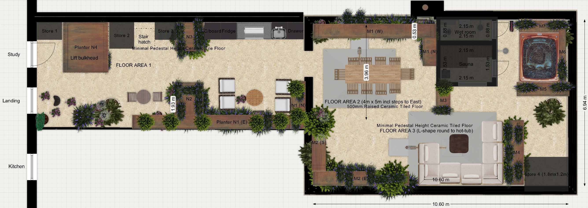

**Main section close-up** (updated 5 June 2026) — Floor Area 2 (raised dining), Floor Area 3 (lounge / hot tub), the sauna / wet room building with room dimensions, and the main-section store:

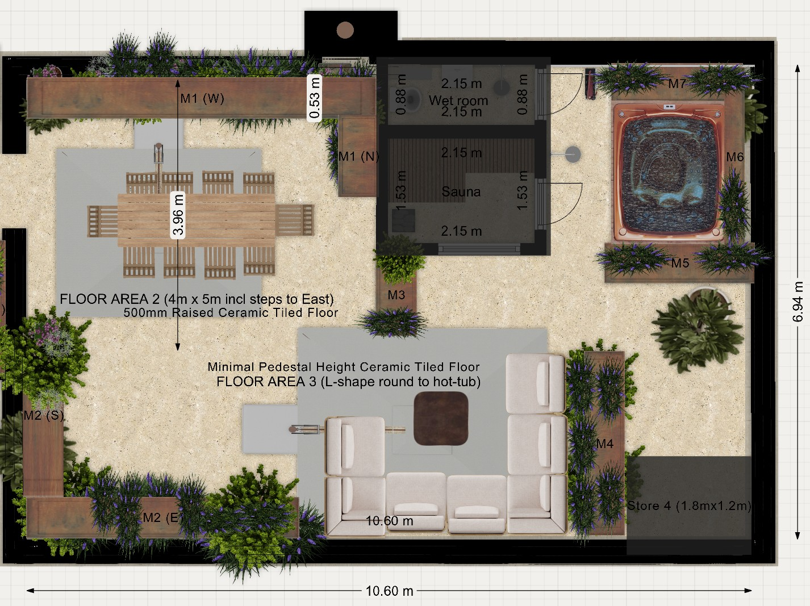

## Contents

- [Planning Case — Why the Refined Scheme Merits Support](#planning-case--why-the-refined-scheme-merits-support)
- [Programme & Phasing — Two-Phase Delivery](#programme--phasing--two-phase-delivery)
- [Project Team & Contacts](#project-team--contacts)
- [Part A — Roof Build-up & Structure (Asphalt, Insulation, Joists)](#part-a--roof-build-up--structure-asphalt-insulation-joists)
- [Part B — Terrace Tiling System](#part-b--terrace-tiling-system)
- [Part C — Planters](#part-c--planters)
- [Part D — Planting Palette & Biodiversity](#part-d--planting-palette--biodiversity)
- [Part E — Outdoor Tap](#part-e--outdoor-tap)
- [Part F — Outdoor Kitchen](#part-f--outdoor-kitchen)
- [Part G — Storage Units](#part-g--storage-units)
- [Part H — Railings](#part-h--railings)
- [Part I — Parapet Bird Deterrent (Post and Wire)](#part-i--parapet-bird-deterrent-post-and-wire)
- [Part J — Smart Control (Home Assistant)](#part-j--smart-control-home-assistant)
- [Part K — Electrical: Outdoor Sockets and Lighting](#part-k--electrical-outdoor-sockets-and-lighting)
- [Part L — Fall Protection (Glass Balustrades & Planters)](#part-l--fall-protection-glass-balustrades--planters)
- [Part M — Sauna](#part-m--sauna)
- [Part N — Wet Room](#part-n--wet-room)
- [Part O — Hot Tub](#part-o--hot-tub)
- [Part P — Parasols](#part-p--parasols)
- [Part Q — Terrace Access (Study Door / Window)](#part-q--terrace-access-study-door--window)
- [Paving Options to Review](#paving-options-to-review)

---

# Planning Case — Why the Refined Scheme Merits Support

*For Ronan: why the refined proposal answers the pre-application advice (PRE2025/00255, 30 April 2026) and sits more comfortably with the Grade I listed building and the Kemp Town Conservation Area than the scheme the officers already found acceptable.*

**The starting point was positive.** At pre-app the officers concluded the proposal was *"likely to be considered acceptable, in terms of its impact on the grade I listed building and neighbouring amenity,"* subject to adjustments to reduce the sauna/store's visibility from the Bristol Gardens streetscene. The refined scheme keeps everything they accepted — porcelain tiles, the level changes, inner-face glass guarding, the hot tub (not visible from the street), and retractable parasols — and reworks only the one element they flagged.

**Floor area — no extra bulk on the roof.** Measured from the scaled drawings, the pre-app sauna/store was a long, low box of roughly **4.5 m × 1.7 m ≈ 7.6 m²**, running some 4.5 m along the parapet. The refined sauna + wet room sits within a compact, near-square footprint of about **2.49 m × 2.90 m ≈ 7.2 m²** — *the same enclosed area the officers already accepted in principle, with no increase in built mass* — but reshaped so its longest face is cut by roughly a third (4.5 m down to about 2.9 m) and pulled well back from the edge.

> *Ronan — these footprint figures were scaled off the PDF drawings (A_GA_210 vs 26005 GA 100), not surveyed. Could you sanity-check them against your dimensioned plans before they go into the submission, so the comparison is robust?*

**One honest change — the wet room.** Pre-app the building was sauna + store; it is now sauna + wet room. This arose later in design for a practical reason: the nearest WC is the full length of the terrace away, down the internal stair and along the flat's corridor — impractical for a terrace built around a sauna and hot tub. With the store moved out to the low outdoor cabinets, the freed internal volume now holds a compact WC and shower. This is a change of *internal use only* — it adds nothing to the external footprint, height or massing the officers assessed, and from the street the building still reads simply as the sauna. The one new element is concealed foul drainage.

**A second honest change — the study door to the terrace.** Access from the flat onto the terrace is through an existing door/window off the study at the south end of the narrow section. To give a safe, **level threshold** onto the (now lower) narrow terrace, we propose to **lower its sill by ~170mm to internal floor level** — which means a **new door/window unit** in the existing opening (Part Q). We're flagging this openly: it **modestly enlarges the existing opening downward** rather than forming any new opening in historic fabric, and it sits at **roof-terrace level on a rear elevation, not visible from the principal Sussex Square frontage**. We'd welcome the conservation officer's steer on a sympathetic frame and threshold detail, which we'll develop with Bond McCart. Listed Building Consent will be sought for this alongside the rest of the works.

**Every change reduces impact, in line with what was asked:**

- **Set back 3 m from the Bristol Gardens parapet** (was 0.6 m). This directly meets Heritage Officer Lance Penman's explicit request to *"set further back by about 3–4 m from the parapet … to avoid it being prominently visible from that street."* The single biggest driver of streetscene visibility is fully addressed.
- **The store has left the roofline.** Planning Officer Charlie Partridge suggested splitting the combined sauna/store, using *"a separate store of a lower height."* We go further: storage moves into two low outdoor cabinets sitting below parapet height (Part G), removing the store from the elevated structure altogether.
- **Height kept low** — an essentially flat roof at **~1,293 mm above the parapet**. This is **~143 mm higher than the 1,150 mm shown at pre-app**; the increase comes from raising the finished floor level when the whole main roof section was inverted (a roofing-robustness improvement agreed with IKO and the contractors — see Part A), not from the building growing in itself. The structure stays low and flat, but we will **re-present the revised height to planning**. *(Ronan to confirm the final figure once the inverted build-up depth is fixed.)*
- **A more permanent, recessive finish.** Officers felt plain weathering timber was *"not ideal"* and asked for something more refined. The PVDF marine-aluminium standing seam in anthracite is durable, low-reflectance and reads quietly against the brick flank wall — aligned with their steer.
- **Less intervention in the historic structure.** The pre-app proposed a lattice of new steel members fixed into the existing parapet to carry the hot tub. On the structural engineer's advice we have adopted a lighter, less disruptive solution — doubling the timber joists beneath the hot tub — reducing the new steelwork introduced into the listed fabric.
- **Middle railing removed to cut roof clutter.** In discussion at the meeting the officers suggested removing the central (third) railing to reduce clutter on the roof; we have done so in response, retaining the east and west railings (kept in place). One less element breaking the rear skyline seen from Bristol Gardens.
- **Southern parasol rotated 180°** and both confirmed fully retractable, as requested.
- **Biodiversity improved, not just protected.** A bare asphalt roof becomes a densely planted terrace — pollinator-friendly planters, olive trees and a coastal palette, with bee bricks in the storage — delivering measurable biodiversity net gain and answering the BNG demonstration and Biodiversity Checklist the officers required (Part D).

**Net effect:** the same accepted footprint, pulled back and lowered in prominence; the store and the plain timber gone; less new steel in the historic structure; the middle railing cleared; and a bare roof turned green. This is not a departure from the pre-app design — it is that design improved along exactly the lines the officers set out, and remains comfortably *less than substantial harm*.

---

# Programme & Phasing — Two-Phase Delivery

*For Ronan, and for the contractors (Sussex Asphalte, Seaview, IKO): how the works are split into two phases, and — most importantly — what **Phase 1 must build in now** so **Phase 2 isn't trapped** later.*

## Why two phases

The **flat-roof replacement is going ahead as a separate job**. **Scaffolding goes up w/c 6 July 2026 for an anticipated 12 weeks** — so it comes down around **late September 2026** (≈ 28 Sept). That window — roughly **early July to late September 2026** — is our one cheap opportunity to get materials onto the roof. Re-scaffolding later is expensive and the downstairs neighbours won't accept the scaffold for months. So the terrace fit-out is split by **planning status**:

- **Phase 1 — works we believe need no planning consent**: drainage through the new roof, tiling, planters, the outdoor kitchen, planting — plus the other non-building terrace works (railings, parapet bird deterrent, outdoor tap, storage, electrical first-fix + lighting, and the **dining-area glass**). These proceed alongside / straight after the roof job.
- **Phase 2 — works that need planning permission / Listed Building Consent**: the **sauna/wet-room building**, the **parasols**, the **hot tub**, the **hot-tub glazing**, and the **study door/window** alteration (Part Q). These wait for consent.

> **⚠ The guiding principle — bury it now, or you can't do it later.** Once the roof is closed, the tiling is down, and the scaffold has gone, you cannot cheaply go back for roof penetrations, buried service runs, the pedestal clusters under future heavy loads, or the lifting of heavy materials onto the roof. **So Phase 1 must include every hidden provision Phase 2 will need.** The "Phase-1 provisions that unlock Phase 2" list below is the critical part of this whole section.

> **Planning-boundary caveat (please confirm).** We've *assumed* the Phase-1 items above fall outside planning / Listed Building Consent — but on a **Grade I** listed building that line isn't obvious, and we're not the experts. **Ronan / the conservation officer to confirm which items genuinely need consent** — in particular the **dining-area glass**, the **parapet bird deterrent** (fixing into the listed coping), and the **railings** top-up. If any of these need LBC, they move to Phase 2.

## Phase classification — every Part

> **Split** = the Part is delivered across both phases (e.g. first-fix now, final connection later).

| Part | Phase | Phasing note |
|---|---|---|
| **A — Roof Build-up & Structure** | **1** | The roof job itself + the tiling substrate. Carries the critical penetration and levels provisions. |
| **B — Tiling** | **1** | Tile the bulk in Phase 1, **but leave the sauna/wet-room and hot-tub footprints un-tiled / tile-ready**, and **set out all Phase-2 pedestal clusters now** (hot tub, parasols, building). |
| **C — Planters** | **1** | Most in Phase 1. The **hot-tub U-shape (M5–M7)** and the **building-interfacing planters (M3, and M2/M3 on the FA2/FA3 stair line)** wait until the Phase-2 building/tub zone is built. |
| **D — Planting** | **1** | Follows the planters; the hot-tub-zone planting waits for Phase 2. |
| **E — Outdoor Tap** | **1** | — |
| **F — Outdoor Kitchen** | **1** | Narrow section. Lay the sink-waste run to the foul stack under FA2 in Phase 1. |
| **G — Storage** | **1** | Stores 1–4. |
| **H — Railings** | **1** | Terrace works. Confirm the retained railings + wire top-up need no LBC. |
| **I — Parapet Bird Deterrent** | **1** | Confirm the LBC position for fixing into the listed coping. |
| **J — Smart Control** | **Split** | Terrace/lighting Shellys with Phase 1; the sauna-heater contactor with Phase 2. |
| **K — Electrical / Lighting** | **Split** | First-fix cabling, terrace lighting and terrace sockets in Phase 1; the building door downlights and the sauna/wet-room/hot-tub final connections in Phase 2. |
| **L — Fall Protection (Glass)** | **Split** | **Dining-area glass → Phase 1** (with the raised FA2 dining floor, so its 500mm fall edge is guarded from day one). **Hot-tub glass → Phase 2** (with the tub). Both fix into parapet masonry — **no roof lock-in**, so the hot-tub glass can wait. |
| **M — Sauna** | **2** | Building — needs consent. *Phase-1 provision:* floor-drain penetration through the roof + heater/light/socket cabling first-fix. |
| **N — Wet Room** | **2** | Building — needs consent. *Phase-1 provision:* WC soil + linear-drain + basin + electric-shower + external-shower penetrations, and electrical first-fix. |
| **O — Hot Tub** | **2** | Arrives by **crane** in Phase 2 (see below). *Phase-1 provision:* 32A radial first-fix, drain penetration, pedestal/continuous-base area set out, footprint left tile-ready. |
| **P — Parasols** | **2** | "Umbrellas" — with the building. *Phase-1 provision:* pedestal clusters / load-spread positions (or planter-ballast) for the two bases set out **before** the pedestal grid is fixed. |
| **Q — Study Door / Window** | **2** | Fenestration change → LBC. *Phase-1 provision:* set the narrow-section tile FFL so the future lowered, level threshold will work. |

## Phase-1 provisions that unlock Phase 2 (the "do it now or regret it" list)

These are Phase-2 items, but they **must be physically built / set out during Phase 1**, because the closed roof, the tiling and the removed scaffold make them impractical to add afterwards:

1. **All roof penetrations — including the Phase-2 ones — set out and capped before the roofer closes up.** The sauna floor drain, the wet-room linear drain + basin + electric-shower + external-shower, the **WC 110mm soil**, and the **hot-tub drain** all pierce the roof. The roofing contractor can insert and cap them for us to connect later — *but only if they have the exact positions in advance* (Part A). **This is the single highest-risk item: a missed penetration can't be added without opening the new roof.**
2. **Service first-fix under the tiles — capped and labelled.** Hot-tub **32A radial** (Part O), sauna **40A heater feed** (Part M), wet-room **electric-shower 45A + light + fan** (Part N), terrace sockets (Part K), and the **cold-water tees** for the tap, kitchen, external shower and wet room (Parts E, F, N). Routed in the pedestal void before the tile finish goes down.
3. **Pedestal clusters / load-spread positions set out under every future heavy load — before the pedestal grid is fixed.** The hot tub, the two parasol bases, and the building footprint (Part B). Adding pedestals under a finished tile field means lifting tiles.
4. **Leave the building + hot-tub footprints un-tiled (tile-ready), and protect the un-tiled inverted insulation.** The exposed inverted-roof insulation in those zones **needs ballast / weather protection through the consent wait** (Part A). The stored Phase-2 materials (below) can double as interim ballast.
5. **Set the narrow-section tile FFL to suit the Phase-2 lowered study threshold** (Part Q), so the level access works once the new door/window goes in.

## Materials on site during the scaffold window

> **Why staging matters: the scaffold likely comes down before consent arrives.** The scaffold is down around **late September 2026**, but Listed Building Consent on a Grade I building usually takes a couple of months from validation — so Phase 2 probably **cannot be built before the scaffold goes**. That makes staging the Phase-2 materials up now (and the hot tub by crane later) the expected path, not a contingency.

Hoist up **for both phases** while the scaffold is here, and stage in the **building / hot-tub zone** (which is left un-tiled anyway): tiles + pedestals, planter / storage / kitchen timber, PIR insulation, cladding, **glass panels (dining + hot-tub)**, parasols + weighted bases, the sauna kit, and the doors + window.

> **The hot tub is the exception.** At ~1,100–1,280kg and ~2.1 × 1.5m it can't be winched up a domestic scaffold — both the weight and the size rule it out. It needs a **lorry-mounted (HIAB) or mobile crane that lifts up and over**, which is **scheduled independently of the scaffold**. So the hot tub **comes later, in Phase 2, by crane, once consent is through** — it does not need to come up during the scaffold window. *(Confirm the crane access route / reach now, per Part O, so it isn't a late surprise.)*

---

# Project Team & Contacts

*The people and firms working on the project. Please flag any corrections.*

| Role | Name / firm | Contact |
|---|---|---|
| **Client** | Chris Newson | cn.affy.tsr@gmail.com |
| **Architect / Building Surveyor** | **Bond McCart** — Ronan Bond (day-to-day contact; authoritative drawings & details) and John McCart (signed pre-app drawings) | The Studio, 14 Northcliffe, Bexhill-on-Sea TN40 1RA |
| **Structural Engineer** | **Allan Wiseman** — Conscious Engineering Design Ltd | info@conscious-edesign.co.uk · 07896 250418 · Sky View, 5 Findon Avenue, Saltdean BN2 8RF |
| **Asphalt contractor** (roof waterproofing installer) | **Sussex Asphalte Ltd** — Jon Stanbridge (General Manager); Lewis Townsend | Jon: jon.stanbridge@sussexasphalte.co.uk · 07394 564313 · Lewis: lewis.townsend@sussexasphalte.co.uk · office: 01273 417315 · info@sussexasphalte.co.uk · Unit 3, Wayfield Farm, Pyecombe, BN45 7ED · www.sussexasphalte.co.uk |
| **Builder** | **Seaview Building Company** — Nigel | nigel@seaviewbuildingcompany.co.uk |
| **Roofing manufacturer** (Permaphalt spec & guarantee) | **IKO PLC (UK)** — James Eden, Area Business Manager (Mastic Asphalt) | James.Eden@IKO.com · office 01257 255771 · mob 07836 350392 · www.ikogroup.co.uk · Reg. office: Appley Lane North, Appley Bridge, Wigan WN6 9AB |
| **Building Surveyors** | **Coastal Surveyors & Consultants** — Alexander Gathern MCIOB BSc (Hons) DipFD AaPS, Managing Director & Senior Building Surveyor | contact@coastalsurveyorsandconsultants.com · 01273 805005 · Brighton City Airport, The Terminal Building, Cecil Pashley Way, Shoreham-by-Sea BN43 5FF · www.coastalsurveyorsandconsultants.com |
| **Managing Agent** (22 Sussex Square) | **Albert Cooper** — Ellie Loveden | ellie@albertcooper.com |
| **Planning Officer**, Brighton & Hove City Council | Charlie Partridge | charlie.partridge@brighton-hove.gov.uk · 01273 292205 |
| **Principal Planning Officer** (Heritage & Projects), BHCC | Lance Penman IHBC | lance.penman@brighton-hove.gov.uk |

---

# PART A — ROOF BUILD-UP & STRUCTURE (ASPHALT, INSULATION, JOISTS)

> **🗓 Phase 1** — the roof job itself + the tiling substrate. This Part carries the **critical Phase-1 provisions** (roof penetrations, levels, ballast of the un-tiled zones). See [Programme & Phasing](#programme--phasing--two-phase-delivery), and the "Programme / phasing" subsection below.

This section is foundational to most others — please read alongside PART O (hot tub), PART B (tiling), and PART C (planters), since loads from those land here.

> **Major change since the pre-application and the 31 May drawings — agreed at the 4 June 2026 meeting** (Chris, Ronan, IKO, Sussex Asphalte, Seaview, Coastal Surveyors). The build-up below **supersedes the earlier "warm roof everywhere, inverted only under the hot tub" approach.**
>
> **✅ Now confirmed in writing — IKO Specification SF0079612, issued 08 June 2026** (IKO Permaphalt polymer-modified mastic asphalt, for Sussex Asphalte Ltd). The layer make-ups below have been **updated to match that spec** (which supersedes our earlier provisional figures). Key confirmed points: **warm narrow section = 160mm IKO Enertherm PIR MG**; **inverted main section = 190mm IKO Enertherm XPS** (not the 220mm we'd assumed); **inverted has no separate vapour-control layer** (the deck-level Permaphalt is the vapour barrier); **20-year IKO guarantee** subject to an IKO-registered installer and IKO components only. **Project area on the IKO spec is "circa 140m²"** — reconcile with our ~120m² gross figure (likely a measurement/skirting difference — Ronan to check).

## Roof build-up — two systems (by section, not by zone)

The two roof sections now get different systems:

| Section | System | Reason |
|---|---|---|
| **Main (large) section** — the whole area | **Inverted roof** (whole section) — asphalt waterproofing on the deck, insulation above it, then membrane / Protectoboard / pedestals / tiles | Recommended by **IKO** and agreed by all parties. Inverting the whole main section is the most robust solution everyone was comfortable with, keeps the membrane protected below the insulation and load, and was said to make **the roof outlast the building**. It also lets the bulk of the works proceed without anything legally risky ahead of planning consent. |
| **Narrow section** | **Warm roof** — insulation above the deck, vapour control layer, asphalt waterproofing on top, then Protectoboard / pedestals / tiles | Standard warm-roof construction. Being warm, it needs **no ballast** while works pause, so the narrow section can be finished completely as soon as its roof is done. |

### Existing make-up (confirmed by opening the roof up — both sections)

| Layer (top to bottom) | Notes |
|---|---|
| 20mm asphalt | Existing waterproofing |
| 18mm board | **Decayed from moisture** |
| 120mm foil-backed insulation | |
| 18mm board | The two board layers surprised everyone — unusual to find two |
| Joists | Existing structure |

### Main (large) section — fully inverted *(per IKO spec SF0079612, 08 Jun 2026)*

| Layer (top to bottom) | Notes |
|---|---|
| Tiles | 20mm porcelain on pedestals (Part B) — this is our finish on top of the IKO inverted system |
| Pedestals | **Eterno Ivica** (chosen 7 Jun), **rubber acoustic pads top *and* bottom** in this section (most sound isolation — see Part B). Pedestals/paving supports sit on the WCL below |
| **IKO Enertherm WCL (Water Control Layer)** | Laid **over** the insulation, under the paving supports — reduces rainwater cooling of the insulation; IKO's standard inverted finish layer |
| **190mm IKO Enertherm XPS** | Inverted-roof insulation — **extruded polystyrene, HFC-free, ~300 kPa compressive (load-bearing grade)**, loose-laid, rebated, 300mm laps; achieves U ≈ 0.16. *(Was provisionally 220mm — IKO confirms 190mm.)* |
| Non-woven geotextile fleece | Below the XPS — stops the insulation bonding to the asphalt |
| **IKO Permaphalt 20mm** (2 × 10mm coats) | Waterproofing **on the deck**, over IKO Black Sheathing Felt separating layer. **This is also the vapour barrier — an inverted roof needs no separate VCL** (resolves the earlier "VCL position" query) |
| **New 18mm plywood / OSB3 deck** | IKO strip the existing waterproofing **and** old decking/insulation back to the joists and lay a **new** 18mm ply or OSB3 deck |
| Joists | Existing structure (SE to confirm it carries the new loads) |

### Narrow section — warm roof *(per IKO spec SF0079612, 08 Jun 2026)*

| Layer (top to bottom) | Notes |
|---|---|
| Tiles | 20mm porcelain on pedestals (Part B) |
| Pedestals | **Rubber acoustic pads on bottom only** in this section (less sound isolation needed — see Part B) |
| **IKO Protectoboard 3.2mm** | Over the Permaphalt, under the paving supports — point-load protection |
| **IKO Permaphalt 20mm** (2 × 10mm coats) | Waterproofing **on top** of the insulation, over IKO Black Sheathing Felt separating layer |
| **160mm IKO Enertherm PIR MG** | Warm-roof insulation (2-board), bonded to the AVCL in PU adhesive; achieves U ≈ 0.16 |
| **IKO Ultra S-A AVCL** | Air & vapour control layer **below** the insulation, over IKOpro Bonding Agent (warm-roof VCL) |
| **New 18mm plywood / OSB3 deck** | New deck on the joists (existing stripped back) |
| Joists | Existing structure |

> **Solar reflective paint:** IKO call for white solar-reflective coating to all **exposed** Permaphalt (e.g. perimeter margins and skirtings). Most of the field is hidden under tiles/insulation, so this only applies to any visible asphalt.

> **Protectoboard vs WCL — note for Ronan/IKO.** Our earlier "**Protectoboard over the entire terrace**" assumption is only half right against the IKO spec: IKO put **Protectoboard on the warm narrow section**, but on the **inverted main section the layer over the insulation is the WCL** (with paving supports on it), not Protectoboard. If we still want **Protectoboard locally under the concentrated loads** (hot tub, parasol bases) on the inverted section for extra point-load protection, that's a **variation to agree with IKO in writing** (see guarantee note below).

## Finished roof height — needs quantifying

Inverting the whole main section will **raise the finished floor level (FFL) above the current 31 May drawings.** **IKO have now confirmed the inverted insulation as 190mm XPS (not the 220mm we'd assumed)** — about **30mm thinner**, so the FFL rise (and therefore the sauna's above-parapet height) should be **a little less than the ~1,293mm figure** we'd been carrying. Ronan to recompute the exact rise from the confirmed 190mm build-up because it affects:

- The relationship of the FFL to the parapet, and therefore the **roof height above parapet** for the sauna/wet room building — provisionally ~1,293mm (based on the old 220mm assumption), up from the 1,150mm accepted at pre-app (heritage constraint — Part M); **recompute on 190mm — likely lower, which helps reduce the exceedance** over the pre-app figure. The increase still needs re-presenting to planning
- The **glass guarding heights** (Part L), measured from FFL / hot tub rim
- The **railing height top-up** (wires / timber + wires) on the narrow section (Part H)

## IKO spec — conditions that affect our design

Three conditions in the IKO spec (SF0079612) need flagging because they push back on things elsewhere in this document:

- **⚠ 150mm minimum upstand — conflicts with our level thresholds.** IKO require all waterproofing to upstands, sills, **door thresholds** and DPC/cavity trays to terminate **at least 150mm above the finished roof level**, and state they *"cannot take responsibility for water ingress over waterproofing details below the minimum height."* This is in direct tension with:
  - the **level / flush study threshold** (Part Q — dropping the sill to internal floor level), and
  - the **low sauna / wet-room door thresholds** opening onto FA3.
  
  Both need a **proper level-threshold detail from Ronan** (e.g. a threshold drainage channel / slot drain immediately outside the door, proprietary low-threshold section) — and Chris should accept that a sub-150mm threshold may sit **outside IKO's guarantee** at that specific detail. **Resolve with Ronan + IKO before the roof is closed.**
- **Falls are not being improved — some ponding may remain.** IKO state the spec makes **no allowance for changing the existing drainage falls**, so *"any standing water which currently occurs is likely to remain."* Minimum design fall is **1:80**. On the inverted main this is low-risk (the asphalt under the insulation is fully waterproof), but if we want to cure existing ponding it needs a **tapered insulation / screed scheme** as a priced extra — flag to Ronan / Sussex Asphalte.
- **Guarantee = 20 years, conditional.** The IKO guarantee (materials + workmanship) requires an **IKO-registered installer** (Sussex Asphalte) using **IKO components only**. **Any variation** — e.g. adding Protectoboard on the inverted section, substituting a component, or a sub-150mm threshold — **must be agreed with IKO in writing in advance**, or the guarantee can be reduced/withdrawn. Build any such variations into the spec of works issued to Sussex Asphalte.

## ⚠ Tiling support on the inverted roof — key question for IKO *(Ronan to lead, copying Coastal)*

How our tile finish bears on the **inverted main section** is not yet resolved and needs IKO's confirmation. IKO's spec does contemplate *"paving slabs on supports, laid over the WCL"* — so pedestals on the inverted finish are allowed in principle — but three things need pinning down:

1. **Tall pedestals under the raised dining (FA2, ~350–500mm).** Standard inverted paving sits on **low** supports. Pedestals up to **500mm** concentrate load on a small base on the **XPS** (firm at ~300 kPa but can creep under sustained load) and raise lateral-stability and wind concerns. Confirm with IKO whether tall pedestals are acceptable **bearing on the WCL/XPS**, whether a **load-distribution layer** (e.g. Protectoboard, a bearing pad or a wider base plate) is needed under each pedestal, or whether the raised zone needs a **different support solution** (e.g. a separate raised sub-structure). *(Also one for the SE — Allan Wiseman — on lateral stability and the raised-platform load path.)*

2. **⚠ Wind-uplift ballast — possible shortfall.** IKO require a **minimum loading coat of 80 kg/m²** over the XPS to resist wind uplift (their stated figure for sheltered / sub-10-storey buildings; our **exposed seafront** site may need more). **Our 20mm porcelain weighs only ~46 kg/m²** — *below* 80 — so the tile-on-pedestal finish may **not hold the insulation down on its own**. Confirm with IKO how uplift is satisfied on the inverted field: thicker pavers, supplementary ballast, the combined mass of pedestals + tiles + planters/furniture counted together, or a restrained/edge-fixed detail. This applies across the whole inverted main section.

3. **Low FA3 — thick slabs vs the 20mm grid.** For the low hot-tub/seating level (FA3), one option is **thicker paving slabs laid more directly** on the inverted finish (closer to IKO's standard ≥50mm loading coat — which also helps the 80 kg/m² uplift). But the rest of the terrace uses **20mm porcelain on the pedestal grid**, so a mixed approach means reconciling **(a) the finished floor level** and **(b) the appearance** between thick slabs and the 20mm tiles. The simplest route for a consistent look is 20mm porcelain on pedestals throughout — which loops straight back to questions 1 and 2.

> **Action:** **Ronan to contact IKO (James Eden) to confirm the inverted-section tiling-support build-up** — pedestals bearing on the Enertherm, the 80 kg/m² wind-uplift requirement vs our ~46 kg/m² 20mm porcelain, and the raised-500mm (FA2) solution — **copying Alexander Gathern (Coastal Surveyors)**, and looping in the SE (Allan Wiseman) on the tall-pedestal stability / any raised sub-structure. See [Project Team & Contacts](#project-team--contacts).

## Levels across the terrace — three zones, two levels

*Revised 8 June 2026 — **Floor Area 3 is now set to the same finished floor level as Floor Area 1**, so the two low zones (the narrow section and the hot-tub/seating/SE area) sit at **one matching low level**, with the **raised dining zone (FA2) between them** as the single high zone. Supersedes the earlier "three different levels" idea, and the still-earlier notions of raising the whole narrow section over the lift over-run or sitting the whole main section high.* The terrace reads as **two finished levels across three zones**, set by pedestal height. **Note the layout: the raised FA2 sits between the two low zones — FA1 → (up) FA2 → (down) FA3 — so FA1 and FA3 match in height but are not one continuous surface.**

| Zone | Level | How it's achieved |
|---|---|---|
| **Narrow section (Floor Area 1)** | **Low datum** | **Lowest practical pedestal height** on the warm-roof build-up. No longer raised up over the lift over-run. |
| **Hot tub + seating/lounge + SE end of the large terrace (Floor Area 3)** | **Low datum — same FFL as Floor Area 1** | Low pedestals (≈100mm) on the inverted build-up, **set to land at the same finished floor level as the narrow section (FA1)** so the two low zones match in height (the raised FA2 sits between them). |
| **Dining (Floor Area 2)** | **Raised — the one high zone, ≈500mm above the low datum** | **Tall adjustable pedestals** (our supplier covers the **350–500mm** range) on the inverted build-up. **3 steps up** on the east side. |

**Floor Area 4 is deleted** — its area is absorbed into Floor Area 3 (Chris updating the drawings).

- **Two levels, FA2 in the middle.** FA1 (narrow) and FA3 (main: hot tub / seating / SE) finish at the **same FFL** — the two low zones match in height. But **the raised dining zone (FA2) sits between them** (FA1 → up → FA2 → down → FA3), so the matching level is about a consistent datum, **not a single continuous walkable surface**. FA2 is the only raised zone.
- **Common datum across two different build-ups.** FA1 sits on the **warm-roof** narrow section and FA3 on the **inverted** main section, which have different build-up heights — so the **pedestal heights on each must be set to bring both to the one common low FFL** (Ronan / the tiler to set this against the surveyed deck levels of the two sections).
- **3 steps up** lead from the low level (FA1 side) up to the **raised dining zone (Floor Area 2)**. On the **FA2/FA3 side**, the drop down to the low FA3 is the line the Part C planters sit on — **M2 and M3 run along it and double as the fall-protection edge at the FA2 drop**. **Confirm on the drawings how the low FA3 (hot tub / seating) is reached** — steps down from FA2 and/or a low-level route past the dining platform.
- **Lift over-run:** no longer built up over. Its top is **tiled over (minimal extra area beyond the bulkhead)**, with the **N4 low-herb planter built on top, matching that footprint exactly** (Parts B and C).
- **Level access from the study:** keeping the narrow section (FA1) low, combined with **dropping the study door/window sill by 170mm** (see Part Q), gives a level / near-level threshold from the study straight onto the **narrow terrace (FA1)**. FA3 (hot tub / seating) is at the **same low level**, so it matches the study-threshold datum — but the raised FA2 dining sits between FA1 and FA3, so reaching FA3 is via the FA2 steps / route, not a flat walk through.

**For Ronan / Building Control:**

- **Common low FFL** — set the pedestal heights on the warm narrow section (FA1) and the inverted main section (FA3) so both finish at the **same low floor level**, against the surveyed deck levels of the two sections.
- **Step detail** — going, rise and nosings for the 3 steps up to Floor Area 2, and whether a **handrail / guarding** is required at the level change (Approved Document K).
- **Tall pedestals (350–500mm)** are under **Floor Area 2 only** and need lateral stability at that height (stabilisers / bracing / restraint rails), with the acoustic pads (Part B) still seating correctly at full extension — confirm with the pedestal supplier. Floor Areas 1 and 3 are on low pedestals at the common datum.
- **Sauna / wet room door thresholds** open onto the **low Floor Area 3** (now at the FA1 level) — confirm the threshold detail from the building floor (on the Protectoboard) to the low-pedestal tile level outside.
- **Narrow-section railing raising (Part H) reduces** — with the narrow floor now barely rising, the retained railings need little or no added height; revisit once the low FFL is fixed.
- **Drainage falls** on each zone, and at the step line, to be set out so water sheds correctly across both levels.

## Protecting the waterproofing — by section *(revised to match IKO spec)*

*We'd originally written "Protectoboard over the entire terrace." The IKO spec arranges this differently on each section, because the asphalt is in a different place:*

- **Warm narrow section** — the Permaphalt is on **top** (above the insulation), so **IKO Protectoboard 3.2mm goes over the Permaphalt**, with the paving supports on it. This is the membrane protection here.
- **Inverted main section** — the Permaphalt is at the **bottom** (on the deck), **buried and protected under the 190mm XPS insulation**, so there's no asphalt at the surface to "board over." The surface layer over the insulation is the **IKO Enertherm WCL**, with the paving supports on it. The membrane is protected by being below the insulation.

What this protects against (both sections): pedestal point loads from the tile system (Part B), planter bases and their drainage discharge (Part C), the hot tub base (Part O), parasol bases (Part P), and foot traffic during install/maintenance.

> **Extra protection under concentrated loads (inverted section):** if we want **local IKO Protectoboard** (or an APP slate felt) under the hot tub and parasol-base clusters on the inverted section for added point-load protection, that's an **addition to IKO's standard inverted finish — agree it with IKO in writing** so the guarantee stands (see "IKO spec — conditions that affect our design" above).

No acoustic underlay mat above the protection layer (it alone is the substrate for the pedestals — see Part B).

## Building footprint — built on top of the inverted build-up

**Change agreed at the 4 June meeting:** the sauna / wet room building will now be **built on top of the inverted main-section build-up** (over the XPS insulation / WCL, on the protected Permaphalt below) — *not* on its own lower slab with the asphalt dressed up to the building line (the earlier approach, now superseded). *(We'd previously written "on top of the Protectoboard"; on the inverted section the surface layer is the WCL over the XPS — see "Protecting the waterproofing" above. Ronan to confirm the exact bearing detail for the building base on the inverted system.)*

- This keeps the build-up continuous under the building and is simpler to detail.
- All drainage / service penetrations under the building footprint must be set out **before** the roof is closed up (see Plumbing note below).

### Doors-vs-build-up — likely resolved by the whole-section inverted approach

Previously the hot tub zone was to be built ~200mm higher than the surrounding warm roof, which raised a question about how the outward-opening sauna / wet room doors would clear the step. The **roof build-up under the whole main section is now one continuous inverted system**, so the earlier three-way confusion (lower / higher / intermediate build-up) and the old "400mm vs 200mm raised floor" discrepancy fall away at the *structural deck* level.

**The finished tile level, however, deliberately varies by pedestal height**: the **dining zone (Floor Area 2) is raised** on tall 350–500mm pedestals, while the **hot tub / seating / SE area (Floor Area 3) stays low** on ~100mm pedestals — **set to the same finished floor level as the narrow section (Floor Area 1)**, the two low zones matching in height with the raised FA2 dining between them (see "Levels across the terrace" above). The **sauna / wet room doors open onto the low Floor Area 3**, so **Ronan to confirm that door-threshold detail** (building floor on the Protectoboard ↔ the low-pedestal tile level outside). The **3 steps** connect the low level up to the raised Floor Area 2.

## Plumbing — set out drainage before the roof is closed

The roofing contractors can **insert and cap drainage penetrations** for us to connect to in the follow-up fit-out — *but only if they have the exact locations in advance*. The exact positions of all drainage / waste penetrations (sauna floor drain, wet room linear drain and wastes, **WC 110mm soil**, hot tub drain, external shower) must be issued to the roofing contractor **before the main roof is closed up**. See Parts M, N and O.

> **This is Phase-1 provision #1 — the single highest-risk item in the whole phasing plan** ([Programme & Phasing](#programme--phasing--two-phase-delivery)). The sauna, wet room and hot tub are all **Phase 2**, but their roof penetrations must go in **now**, during the Phase-1 roof works, because a penetration missed before the roof is closed cannot be added later without opening the new roof.

## Action — detailing required from Ronan Bond

> **Note for Ronan Bond:** please provide the build-up details (inverted main section, warm narrow section, the junction between the two, asphalt-to-building junction including the door-threshold detail) **as a matter of urgency** so they can be discussed with our surveyor, **IKO**, **Sussex Asphalte**, **Seaview** and **Coastal Surveyors**. **Seaview need a specification of works as soon as possible to get it costed** — scheduling is difficult at this time of year and getting the spec to them quickly is key.

> **Action — Ronan to IKO (copy Coastal):** confirm the **tiling-support build-up on the inverted main section** — can the Eterno Ivica pedestals bear on the IKO Enertherm WCL/XPS (low **and** the tall 350–500mm pedestals under the raised FA2 dining); how the **≥80 kg/m² wind-uplift** requirement is met given our 20mm porcelain is only ~46 kg/m²; and the raised-500mm support solution. See *"Tiling support on the inverted roof"* above. Copy **Alexander Gathern (Coastal Surveyors)** and loop in the **SE (Allan Wiseman)** on tall-pedestal stability.

**Building Control:** Sussex Asphalte are taking the plan to Building Control to check it.

## Structure — joists and steel

Our structural engineer (**Conscious Engineering Design Ltd**) has issued **calculations SET 1, Rev A (dated 8 June 2026)**, superseding the 3 June draft. This part of the building was **built in 2011**, so the members are modern and the engineer has **measured them on site** rather than assuming sizes. Rev A adds a check of a heavier hot tub at our request.

**Headline findings (Rev A).** The engineer bracketed the hot tub question with the two extreme base geometries, since the worst case for each member is a different tub:

- **Existing roof joists** — 50 × 225mm C24 at 400mm centres, running **east–west** — **PASS with no strengthening**. The **joists are the controlling element**, and they are governed by the **lighter, small-footprint round tub** (modelled on a RotoSpa Orbis II, ~970kg, ~369 kg/m²), whose compact base concentrates load onto fewer joists (1.447 kN/m on the worst joist). Worst check is bending at **~57% utilised (≈43% remaining)**; the other joist checks sit at ~46–67% remaining.
- **Existing steel beam** — UKB 305 × 165 × 46, grade S275, running **north–south** (along the top edge of where the parasol sits in the NE corner) — **has capacity with large headroom**. The beam is governed by the **heavier, wider tub** (modelled on a Marquis Spirit), at **~37% utilised (≈63% remaining)**; lateral-torsional (buckling-moment) resistance governs.

The engineer notes the ~50% remaining joist capacity is **a comfortable margin to absorb the sauna loading** once that is defined.

**Still to be confirmed:**

- **Hot tub weight basis.** Rev A confirms two *specific* models rather than issuing a single "maximum filled weight" limit. The heavier tub was modelled at **~1,000kg fully-occupied wet**, which is lighter than the figures on our own shortlist (Fisher 3 ~1,121kg; Marquis Spirit ~1,280kg — see Part O). On a **load-per-m² basis the joists are covered**, since every shortlist tub sits at or below the 369 kg/m² that governs them. We are asking the engineer to **confirm the weight basis** (whether occupants are carried separately in the 1.5 kN/m² imposed load) and, ideally, to express the result as a **single max filled weight + max kg/m²** so we can buy any tub under both limits.
- **Sauna / wet room building.** Not yet in the calculations. The sauna sits a metre or two from the hot tub, so it lands on **different joists** (a separate joist check still to come) but on the **same steel beam** — so the beam must be re-checked for the combined sauna + tub load once the building's construction is defined. The engineer has asked Ronan for the sauna structure specification to do this.
- **Decking / pedestal + inverted build-up load.** The calc used an assumed 0.4 kN/m² for the tile finish; the real figure from the inverted build-up (above / Part B) is to be confirmed to the engineer. He has asked Ronan for the raised-decking and pedestal details.

**Doubled joists** in the **NW quadrant** (the hot tub zone) were previously assumed as a fallback. Rev A shows **none are needed** for either tub checked. All parties confirmed at the 4 June meeting they are comfortable doubling joists where the calculations require it; they saw no problem with it.

## Programme / phasing (from the 4 June meeting)

> **The full two-phase framework is now in the [Programme & Phasing](#programme--phasing--two-phase-delivery) section near the top of this document — that is the single source of truth.** The notes below are the contractors' intended on-site *sequence* from the 4 June meeting, which feeds into it.

*For Ronan's awareness — the contractors' intended sequence:*

- **Scaffold up w/c 6 July 2026, anticipated ~12 weeks** (down ~late September 2026). The flat roof works — the largest part of the job — happen within that window; they want to start early on it. *(The 4 June meeting had pencilled w/c 24 July for the roof works; confirm the exact roof-works start against the 6 July scaffold date. Either way the scaffold window — early July to late Sept — is the binding constraint.)*
- The **main (large) section is done first**, then the narrow section. The large area must be **cleared of decking etc. beforehand**, with everything moved onto the narrow section. Once the main roof is ready, the narrow-section contents move across onto it.
- The freshly-laid inverted insulation on the main section **needs ballast holding it down** until the tiling system goes on. Plant pots / items on the roof can serve as interim ballast, but ideally the contractors lay the **Protectoboard and tiling straight after finishing the roof**.
- **~¾ of the main section can be tiled as soon as that part of the roof is finished**, holding off only on the **sauna and hot tub area until planning consent is through**.
- The **narrow section can be finished completely** as soon as its roof is done (warm roof, no ballast needed).
- **Scaffold:** the downstairs neighbours are OK with the scaffold staying up a little longer than the main job, but not for months. We may need to **get materials onto the roof early** and hold off on the **sauna build until planning comes through** — at which point builders could access through the building.

## What we'd value your steer on

- The **finished roof height** rise from inverting the whole main section — your figure, and its effect on the above-parapet height (now ~1,293mm vs the 1,150mm pre-app figure — Part M) and glass guarding heights (Part L)
- Inverted-to-warm junction detail where the main section meets the narrow section
- Asphalt-to-building junction and door threshold detail — watertight, and allowing the outward-opening doors to clear, now the building sits on the Protectoboard
- Coordination with the SE on whether doubled E–W joists in the NW quadrant are sufficient, or whether the steel needs to take more

---

# PART B — TERRACE TILING SYSTEM

> **🗓 Phase 1** — but with two Phase-2 carve-outs. **Leave the sauna/wet-room and hot-tub footprints un-tiled (tile-ready)** until those Phase-2 elements are built, and **set out all the Phase-2 pedestal clusters now** (hot tub, parasol bases, building footprint) before the pedestal grid is fixed. See [Programme & Phasing](#programme--phasing--two-phase-delivery).

**Estimated tiled area: ~103m²** (of the ~120m² gross terrace footprint, once the building, hot tub, kitchen and storage footprints are subtracted).

> **Change from the 4 June meeting:** the agreed approach is now to **tile the whole roof area and build the planters on top of the finished tile field**, rather than building the planters off the Protectoboard to reduce the tiling area. So **planters are no longer subtracted** from the tiled area — which raises the net figure from ~82m² to ~103m². (See Part C.)

| Subtraction | Approx m² |
|---|---|
| Sauna/wet room building external footprint (~2.90 × 2.49m) | ~7.2 |
| Hot tub (~2.07 × 1.53m) | ~3.2 |
| Outdoor kitchen run (~3.3 × 0.7m) | ~2.3 |
| Storage units — Store 1 (~0.8) + Store 2 (~1.2) + Store 3 (~0.6) + Store 4 (~2.2) | ~4.8 |
| **Total subtracted** | **~17.5** |
| **Net tiled area (gross 120m² − subtractions)** | **~102m²** |

**The lift bulkhead is tiled over** (concealing the structure), with the tiling adding **as little extra area as possible beyond the existing bulkhead footprint** — i.e. tile the bulkhead itself, don't spread a tiled apron around it. The **N4 planter (Part C) then matches that tiled bulkhead footprint exactly** and sits on top. So the bulkhead area is part of the tiled field and is **not** subtracted.

Planters are **not** subtracted — they are built on top of the finished tiles (4 June meeting). This includes the **N4 lift-over-run planter**, which sits on top of the tiled bulkhead. Movable pots also sit on the tile finish. Parasol bases — whether set in the pedestal void (mast through a sealed tile sleeve) or as a weighted base on top of the tiles — are not subtracted; the on-top-vs-below detail is to be agreed between the pedestal and parasol suppliers (see the load-bearing note above and Part P).

> **Note for the surveyor:** these figures are derived from the Part C planter inventory and Part O/G/F footprints in this spec. **Please remeasure precisely against the latest drawings before contractors price the tile order** — small footprint changes (e.g. final hot tub model, kitchen module widths, planter realignments) shift the figure by several m². A 10–15% overage is to be ordered on top of the verified net area and stored in the client's garage at Sussex Square for future repairs.

## Surface material

20mm porcelain pavers, R11 slip-rated minimum, frost-resistant. Italian or Spanish manufacture preferred for quality assurance. Large format preferred (600 × 600mm or larger). Finish to be mid-tone honed or textured — not polished, not white or very pale (glare and bird soiling). **Sandstone-coloured tones** (warm buff / honey / pale stone) to complement the anthracite cladding and Sussex Square's cream Regency stucco context, and to hide gull marks more forgivingly than grey.

**Hard rules:**
- 20mm thickness minimum
- R11 slip rating minimum
- No limestone or natural stone (bird uric acid etching risk)

**Supplier scope:** Porcelain Superstore, Paving Superstore, Tile Mountain, or equivalent trade supplier. Samples required before order confirmed. 10–15% overage to be ordered and surplus retained in the client's garage at Sussex Square for future repairs (not stored on the roof terrace).

## Pedestal system

Adjustable pedestal system with self-levelling head and integrated rubber acoustic / isolation pads. Must accommodate installation over Protectoboard on asphalt membrane without acoustic underlay mat (Protectoboard provides base decoupling; mat layer not appropriate on this substrate).

**Hard rules:**
- Padded head pedestals only — no unpadded basic systems
- Self-levelling head strongly preferred
- Pedestal base wide enough to distribute load over Protectoboard without point-loading damage
- **Extra pedestals under the planters:** the planters (Part C) are built **on top of the finished tiles** and are heavy (~250–350 kg/m² saturated). Add pedestals under the **planter bearer lines** so the planter load transfers tile → pedestal → protection layer (Protectoboard on the warm narrow / WCL on the inverted main) → insulation → deck, never onto the unsupported middle of a tile. Planter footprints (Part C inventory) to be issued to the tiler **before the pedestal grid is set out**.

**Chosen system: Eterno Ivica** (SE self-levelling range) — *confirmed 7 June 2026* (Buzon DPH was the alternative). The Eterno Ivica system is designed for ~100 kg/m² with pedestals at the slab corners; at our pedestal heights (350–500mm on the main section) **mid-edge and central pedestals are also required** per their guidance — and **more again under concentrated loads** (below).

> **⚠ Load-bearing — planters, hot tub and parasol bases: detail to the pedestal manufacturer's recommendations.** These concentrated loads sit on the pedestal-and-tile field and **must not point-load a tile mid-span**:
> - **Planters** (Part C) — heavy **sustained** loads, ~250–350 kg/m² saturated, in long runs on top of the tiles. **The pedestal grid must be designed around every planter** — extra pedestals on the planter bearer lines — and the **sustained weight checked for long-term creep** of the inverted XPS insulation. **Issue every planter footprint to Eterno Ivica + the SE.**
> - **Hot tub** (Part O) — ~1,160–1,280 kg over ~3.2 m² ≈ **~360–400 kg/m²**
> - **Parasol bases** (Part P) — heavy (~140–280kg), **weighted, sitting on the tiles** (the dining FA2 is raised ~500mm so it can't recess; no roof penetration). Need a **load-spreading plate over a cluster of extra pedestals** — designed with Eterno Ivica + IKO + SE.
>
> Their support is to be designed **per Eterno Ivica's published load tables and IKO's point-load guidance** — extra/closer-spaced pedestals on the load lines, the correct pedestal rating, and load spread so the path is base/bearer → tile-over-pedestals → pedestals → **(inverted main: WCL → 190mm XPS insulation → Permaphalt → deck; warm narrow: Protectoboard → Permaphalt → 160mm PIR → deck)**.
>
> **The inverted insulation is now confirmed as 190mm IKO Enertherm XPS** (per IKO spec SF0079612), a **load-bearing grade at ~300 kPa** (≈30 t/m²) — much stiffer than a soft PIR, so the earlier "compressible insulation" worry is reduced: a hot tub at ~360–400 kg/m² (~4 kPa) is well within its rating. The real checks are therefore (a) **point loading of the 20mm porcelain tile** (don't stand a heavy base on bare tile — spread over pedestals) and (b) **long-term creep under sustained loads**. Confirm both with Eterno Ivica + the SE; don't stand a heavy base on bare tiles.
>
> **Issue the planter footprints (Part C), the hot-tub footprint (Part O) and the parasol base positions (Part P) to Eterno Ivica, IKO and the SE before the pedestal grid is set out.** Ways to handle heavy bases: a **load-spreading plate** over several pedestals; a **continuous base** for the hot tub; or **ballasting/anchoring a parasol within a planter** (using the planter's mass and footprint — which could also let a parasol be properly anchored despite the no-fix inverted roof). Confirm the chosen approach with the suppliers and SE.

## Acoustic isolation — zoned by sensitivity of space below

We want acoustic isolation specced proportionally to what's underneath each part of the terrace, rather than uniform across the whole 120m². Three zones:

| Zone | What's below | Pedestal spec |
|---|---|---|
| **Main (large) section** | Habitable rooms (bedrooms / living) | **Double-isolated** — rubber pads **top *and* bottom** (e.g. Buzon BC-PH range + base pad accessory, or Eterno Ivica AntiNoise / SE with PVC base pad) |
| **Narrow section** | Less acoustically sensitive | **Single pad** — one rubber pad only (the 4 June meeting noted a base/bottom pad; a padded head is the more usual arrangement — either single-pad route is acceptable) |
| **Around the lift bulkhead** | Lift shaft (no occupants below) | **Basic pedestals** — no acoustic premium needed |

This matches the rubber-pad arrangement noted in the Part A build-up tables (top + bottom on the main section, single pad on the narrow). Both Buzon and Eterno Ivica offer base pads as a standard accessory; the cost premium for double-isolation is small (typically £1–3 per pedestal over head-only).

**Sanity check we'd value your steer on:** we've assumed the narrow section is over less sensitive space (utility, plant, or non-bedroom rooms). If it's actually over a habitable room, the acoustic spec for that section should be upgraded to match the main section.

## Drainage — open joints

Open joints throughout, as dictated by the pedestal head's spacer tabs (typically 3–5mm). Water drains freely through the joints into the void below and away across the asphalt falls to the existing drainage.

## Coordination — clearances and thresholds

The finished tile level needs to coordinate with:
- **Sauna and wet room door thresholds** — pedestal + tile build-up is typically 60–150mm above the asphalt depending on falls
- **Hot tub base** — recessed under-tile base detail (see PART O)
- **Parasol bases** — heavy weighted bases on the tiles, load-spread over a cluster of pedestals (see PART P)
- **Linear drain in wet room** — continuity of tanking and falls
- **Lift bulkhead** — tiling must clear the bulkhead and not bridge or trap services
- **Emergency staircase access** — full unobstructed access to the stair head must be maintained at all times

## What builders have scope on

- Choice of Buzon vs Eterno Ivica (or equivalent quality tier), provided rubber pad and self-levelling spec is met
- Specific porcelain range and supplier, provided colour, tone, format, slip rating, and thickness rules are met
- Pedestal height selection based on actual survey levels
- Open joint width within the normal range for pedestal-laid 20mm pavers

## What is fixed

- 20mm porcelain only (not natural stone, not composite decking)
- R11 slip rating minimum
- Padded self-levelling pedestals
- No adhesive bed — pedestal / floating system only
- Open joints between tiles
- Overage tiles retained in the client's garage at Sussex Square (not on the roof terrace)

## ⚠ Open: can the pedestals bear on the inverted (IKO Enertherm) insulation?

**This is unresolved and needs IKO's confirmation — the answer shapes the whole tile finish on the main section.** It is set out in full in Part A under *"[Tiling support on the inverted roof — key question for IKO](#-tiling-support-on-the-inverted-roof--key-question-for-iko-ronan-to-lead-copying-coastal)"*. In short, three things to pin down with IKO before pricing/ordering:

1. **Tall pedestals (350–500mm) under the raised dining (FA2)** bearing on the WCL/XPS — acceptable as-is, or do they need a load-distribution layer / a separate raised sub-structure? (Also an SE question for stability.)
2. **Wind-uplift ballast:** IKO want **≥80 kg/m²** over the XPS; our **20mm porcelain is only ~46 kg/m²**, so confirm how uplift is met on the inverted field (thicker pavers, extra ballast, combined pedestal+tile+planter mass, or a restrained detail).
3. **Low FA3:** thicker slabs laid more directly (helps uplift) **vs** the 20mm porcelain-on-pedestals grid used elsewhere — if mixed, reconcile the **finished level and the appearance** between the two.

**Action:** Ronan to take this to IKO (James Eden), copying Coastal (Alex Gathern) and the SE — see the Part A note.

> **Surface/material options** (30mm porcelain, smooth granite-aggregate concrete, larger tile sizes) are set out in **[Paving Options to Review](#paving-options-to-review)** at the end of this document — to be settled once IKO confirm the uplift requirement.

## What we'd value your steer on

- **Structural sign-off** for ~102m² of 20mm porcelain + pedestals + furniture / occupancy load. Usually fine but worth on record before contractors price it
- **Pedestals on the inverted insulation** — see the ⚠ open question immediately above (bearing on the IKO Enertherm WCL/XPS, the 80 kg/m² wind-uplift requirement, and the raised-500mm FA2 support). The single biggest tiling unknown
- **Total build-up height** at the highest and lowest points of the falls — needed to confirm sauna / wet room door threshold heights and the hot tub / parasol base recess depths
- **Edge detail** at the parapet / planter / glass balustrade interfaces — how the tile field terminates cleanly without a visible pedestal edge

---

# PART C — PLANTERS

> **🗓 Phase 1** — most planters. The **hot-tub U-shape (M5–M7)** and the **building-interfacing planters (M3, and M2/M3 on the FA2/FA3 stair line)** wait until the Phase-2 building/tub zone is built. See [Programme & Phasing](#programme--phasing--two-phase-delivery).

We want planters built from the **salvaged hardwood decking** removed from the existing terrace. Locations and footprints per the drawings.

**Planter layout** is per the floorplan, designed to **maximise wind defence** along the north and east parapets. Detailed inventory of each planter's dimensions and heights is in the "Sizes" subsection immediately below. The planting scheme — including the **5 olive trees** echoing the established Sussex Square / Kemp Town Enclosures planting — and the windbreak layering is set out in Part D.

> **For the planting palette, planted-area summary and biodiversity case, see [PART D — PLANTING PALETTE & BIODIVERSITY](#part-d--planting-palette--biodiversity) at the end of this document.**

## Construction principle

- **Change from the 4 June meeting:** planters now sit **on top of the finished tile field**, *not* built off the Protectoboard below the tiles. The whole roof is tiled first, then the planters are built on top (see Part B). This is simpler than working the planter bases into the tile build-up, and is the agreed approach.
- Tile runs continuously **underneath** each planter. The planter sits on **bearers/feet on protective pads**, raised ~25mm off the tile, so that: (a) its weight is spread and carried down to the **pedestals below** rather than point-loading the middle of a tile; (b) there's a continuous **drainage + air gap** under the box; and (c) the porcelain is protected. See **"Sitting on the tiles — drainage & load"** below.
- Planters are **freestanding boxes** — they do not rely on the parapet or any other wall for structural or weatherproofing function
- Built with stainless steel fixings throughout
- **Aim** — reference image:

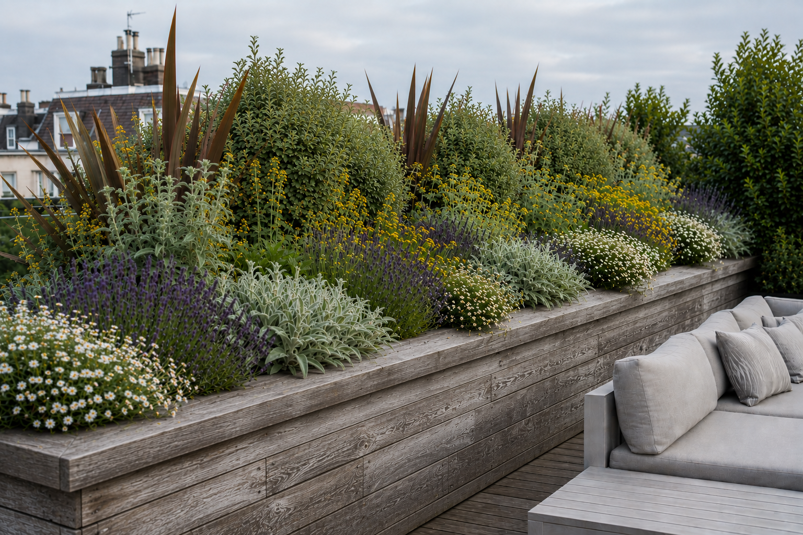

The reference shows the look we're aiming for: salvaged hardwood cladding with random staggered joints, weathered to silver-grey, with a substantial top capping board functioning as a casual sit-ledge. Plants in mixed Mediterranean / coastal palette spilling forward over the rim.

## Build-up

Treated softwood frame with hardwood cladding outside, EPDM lining inside, and salvaged Brighton pier decking as the top cap.

| Layer (outside → inside) | Spec | Cost / source |
|---|---|---|
| **Cap board (top sit-ledge)** | **Salvaged Brighton pier decking, 100×50mm — 1 board wide** running along the top of each planter, screwed to top frame rails with stainless A4/316 screws (plug-cut or face-fixed). Aligned with the planter's outer face; can overhang inward over the soil by 10-15mm to give a clean rim. | **Free** (Chris's salvage stock — iconic Brighton wood, adds heritage character) |
| **Cladding** | **Salvaged hardwood deck boards, cut to 700–900mm random staggered lengths**, joints between courses MUST NOT line up (running-bond / random stagger only). Boards screwed into frame uprights through stainless A4/316 fixings. | **Free** (salvage) — see "Salvaged hardwood — handling the existing bolt holes" subsection below |
| **Breathable membrane** | Inside face of cladding before EPDM | ~£5-10/planter |
| **EPDM liner** | 1.0–1.2mm continuous, dressed up all four sides + 50mm onto top edge (trapped under the cap board) | ~£20-40/planter depending on size |
| **Frame** | **50×50mm treated softwood (e.g. C16-graded UC4 treated)** — 4 corner posts (full height), top + bottom horizontal rails, intermediate vertical uprights at ~400mm centres. **Concealed structure** — never exposed to weather, treated to UC4 (in-ground) standard for belt-and-braces. | ~£15-25/planter materials |
| **Cross-bracing** | Diagonal softwood bracing within frame for L-shape and longer planters (>2m) to handle soil thrust | Included in frame |
| **Base** | Sloped ~1% to the drain holes; **25–30mm weep holes through the timber base + EPDM at ~600mm centres**, each with a geotextile cap inside. Water weeps onto the tile field and drains away through the **open (un-grouted) tile joints** (Part B) → Protectoboard → roof falls. | Standard |
| **Bearers** | **Treated softwood / stainless bearers on rubber pads**, raising the base **~25mm off the tiles** — gives the under-planter **drainage + air gap** (water escapes, tile dries, no ponding/staining) and protects the porcelain. **Bearer lines to align over the tile pedestals below** so the load transfers feet → tile → pedestal (coordinate the pedestal grid under planters with the tiler — Part B). | Standard |

**Why this works structurally:**
- Soil + saturated lightweight mix exerts hydrostatic-like load on planter walls
- 50×50mm treated softwood uprights at 400mm centres comfortably handle 600-700mm soil depth + perimeter water saturation
- Same construction as ground-level garden planters that hold soil for decades
- Marine ply was structurally over-spec'd; softwood frame is the conventional answer

**Why the cap is special:**
- Brighton pier wood is **iconic and salvageable** — same wood that's been carrying the seaside crowds for over a century
- 50mm thick × 100mm wide = a substantial single board capping the planter
- Visually anchors the planter — gives a clean architectural finish
- Caps the EPDM rim cleanly (no exposed liner edge)
- Width is OK for **casual perching / leaning** (not full seating depth, but enough to sit on while gardening or for a quick break)

## Salvaged hardwood — handling the existing bolt holes

The existing decking boards have decking bolts with large through-holes every 800mm. Approach:

1. **Cut and discard hole sections** — cut boards into clean **700–900mm sections** between bolt holes (loses ~10-15% of total board length as waste — acceptable)
2. **Staggered courses** — cladding installed in **running-bond / random stagger pattern** — joints between adjacent courses must NEVER line up vertically (read as patchwork). Random length variation within 700-900mm range looks intentional and crafted.
3. **Use holed scraps for hidden uses** — battens, internal frame fillers, sacrificial bearers — anywhere not visible
4. **Finish — none** (zero ongoing maintenance). Salvaged hardwood + Brighton pier decking are both naturally durable species that weather to silver-grey over 1-2 years bare. This is exactly the look shown in the reference image above, and matches the Brighton seafront / Sussex Square heritage aesthetic. **No oil, no varnish, no annual retreatment.**
   - Avoid oils / varnishes / paints — they need annual reapplication and look worse than bare wood if missed. The whole project is designed for low maintenance.

**Important: brief the builder that joint alignment between courses is a quality requirement** — if courses line up vertically, the result looks accidental, not intentional.

## Estimated total cost vs original spec

| | Original (marine ply box) | Revised (softwood frame) |
|---|---|---|
| Materials per planter (~3-5m run) | ~£140-200 | ~£40-70 |
| Across ~10 planters | ~£1,500-2,200 | ~£400-700 |
| **Saving** | | **~£1,000-1,500** |
| Plus: faster build (no marine ply box joinery), uses salvaged stock more fully (battens / hidden uses for holed scraps), Brighton pier wood as cap adds character at zero cost |

## Sizes — planter inventory

**Main-section planter layout** (planters labelled on the drawing — cross-reference with the table below; the full terrace incl. the narrow-section planters N1–N4 is in the [Drawings](#drawings) section):


> **Compass orientation:** RIGHT=N, LEFT=S, TOP=W, BOTTOM=E on the floorplan.

**General depth convention:** Most planters are **600mm total footprint** (570mm planter box + 30mm air gap to the wall behind), which aligns exactly with one 600mm porcelain tile width. Heights are stated as visible above the tile FFL — and since planters now sit **on top of the finished tiles** (4 June meeting), the visible height is essentially the full constructed height of the box.

### Narrow section

| # | Planter | Footprint | Height (above terrace tile FFL) | Notes |
|---|---|---|---|---|
| **N1** | **L-shaped planter** along east + north parapets of narrow | **7.2m long leg (along east parapet) + 1.8m short leg (along north parapet)** × 600mm deep | **500mm** | Wraps the NE corner of narrow. The corner is mitred / continuous. |
| **N2** | Square planter — east side, mid-narrow | **1.2m × 1.2m** × 600mm deep | 500mm | **Built as a single integrated construction with N1** — they share a wall where they meet on the east parapet side |
| **N3** | Square planter — west side, mid-narrow | **1.2m × 1.2m** × 600mm deep | 500mm | Adjoins the outdoor kitchen (Part F) on its north face — kitchen and planter meet but are independent constructions |
| **N4** | **Lift over-run planter** *(new 5 June)* — low aromatic herbs | **1.9m × 2.1m** — **matches the tiled lift-bulkhead footprint exactly** | **400mm box** (planting kept <700mm total) | The lift bulkhead is **tiled over with minimal extra area** beyond its existing footprint (Part B), and this planter is built **on top, matching that footprint exactly**. Built exactly like the other planters (salvaged hardwood, EPDM-lined, drainage layer) and **drains through onto the tiled surface like the others** — no special over-shaft drainage detail. Sits over the lift shaft — basic pedestals, no occupants below (Part A). **Planting:** low fragrant herbs — see plant list below. |

### Main section

| # | Planter | Footprint | Height | Notes |
|---|---|---|---|---|
| **M1** | **L-shaped planter** in the dining area (FA2) | **5m + 1.8m legs** × 600mm deep | **500mm** above terrace tile FFL | Frames the dining area |
| **M2** | **L-shaped planter** in SE of main | **4m + 3m legs** × 600mm deep | **700mm** above **FA3 FFL** | West end aligns with the end of the raised floor in FA2 (the planter cuts into the stair line between FA2 and FA3). The taller 700mm height gives more substantial windbreak for the lounge area. |
| **M3** | Rectangular planter east of sauna | **600mm × 1200mm** (600mm deep × 1.2m long) | **700mm** above **FA3 FFL** | South edge aligns with the north end of FA2's raised floor — **no step needed at the north end** (the planter face IS the rise). |
| **M4** | Planter north of the seating area | **3m long × 600mm deep** | **700mm** above terrace FFL | Substantial windbreak height for the lounge zone |
| **M5–M7** | **Hot tub U-shape** — east + north + west of hot tub | **East leg:** 2m long × 600mm deep<br>**North leg:** 2.1m long (= hot tub length) × **300mm** deep<br>**West leg:** 2m long × 600mm deep | All three finish **150mm above hot tub rim height** | **Built as a single continuous U-shape construction** wrapping three sides of the hot tub. The +150mm above tub rim gives substantial wind defence around the tub (where wind = heat loss). North side is narrower (300mm) reflecting the tighter space between tub and north parapet. |

### Heights summary

| Height | Where | Why |
|---|---|---|
| **500mm** above FFL | Narrow section L-shape (N1), narrow squares (N2, N3), dining L (M1) | Standard planter height — frames the use zones without dominating |
| **400mm** (box) | Lift over-run planter (N4) | Kept low as it sits on the raised, tiled bulkhead; planting kept <700mm total so the feature stays low |
| **700mm** above FA3 FFL or terrace FFL | SE L (M2), east-of-sauna (M3), north-of-seating (M4) | Substantial windbreak height for the lounge / FA3 zone; also doubles as a fall-protection edge where M2 sits next to the raised FA2 stair drop |
| **+150mm above hot tub rim** | Hot tub U (M5–M7) | Maximum sensible wind defence for the hot tub without dominating the view from the lounge |

## Preventing leaching into walls behind

This is the key risk where planters sit against the parapet or building wall. Two-part approach:

1. **Freestanding back panel** — every planter has its own timber back wall (built integrally), so the planter contains itself. The parapet/building wall is never the back of the planter.
2. **Air gap** — **30mm** between the planter's back panel and the wall behind, to allow ventilation and a clear visual inspection route.

Result: any water that escapes the planter falls onto the **finished tiles** and drains away through the open tile joints to the roof falls — never into a wall.


## Planter make-up — drainage, soil, mulch — **to be provided and installed by the builders**

The make-up below is included **within the planter construction scope** (not a separate landscaping job after the build). Builders to provide all materials and complete installation as part of the planter package. **Priority is light + inexpensive** — we're on a roof and want to minimise structural load and cost.

| Layer (bottom → top within the planter) | Spec | Purpose / why |
|---|---|---|
| **1. Geotextile over drain holes** | Non-woven membrane offcuts | Stops drainage media washing out through the drain holes in the planter base |
| **2. Drainage layer** (~100–150mm thick) | **50/50 mix of clean recycled polystyrene chunks + 10mm pea gravel** (lightweight + inexpensive). LECA acceptable as alternative if salvaged polystyrene unavailable — but polystyrene is **~80% lighter** than gravel/LECA and effectively free. | Free drainage, prevents waterlogged roots, dramatically reduces planter weight on the roof structure |
| **3. Geotextile membrane** (root-permeable) | Non-woven, root-permeable | Separates drainage from soil so fines don't migrate down and clog drainage |
| **4. Lightweight planting medium** (~300–400mm thick) | **Peat-free roof-garden / lightweight planter mix**: ~60% loam-based topsoil + 25% perlite or vermiculite + 15% well-rotted peat-free compost.<br>Pre-blended bagged options acceptable (e.g. Bourne Amenity Topsoil mix, Boughton Loam roof-garden mix, or builder's-merchant lightweight planter mix). | Provides nutrients + drainage + light weight. **Avoid heavy clay topsoil** — it compacts, waterlogs, and is heavy on the structure. |
| **5. Mulch layer** (~25–50mm) | Composted bark or fine ornamental bark chip on top, around all plants | Retains soil moisture (reduces watering), suppresses weeds, insulates roots in winter, gives a finished look |

### Special note for olive trees (5 in total)

Olives need adequate root volume. In the **600mm-deep planters** (most of them), the available rooting depth after the drainage layer is ~400-450mm — adequate for olives if managed. Where olives sit, **no polystyrene under that specific patch** — use clean 10mm gravel only for ~100mm depth, then the soil mix to ~500mm depth. This gives the olives a deeper root run and bit more weight at the base (stability for taller plants in wind).

### Total weight estimate per m² of planter footprint

- Lightweight make-up (polystyrene + gravel + lightweight soil): **~250–350 kg/m² saturated**
- Compared to heavy make-up (all gravel + heavy topsoil): ~600–800 kg/m² saturated
- **Saving:** ~300–400 kg/m² for the SE to take care of (significant on a ~25m² planted area)

### What the builders should include in their planter price

1. EPDM liner + breathable membrane (planter shell construction, above)
2. All drainage materials (polystyrene chunks, 10mm gravel, geotextile membrane offcuts)
3. All lightweight planting medium (delivery + installation)
4. Mulch layer (bark) — first application
5. Labour for layered installation
6. Disposal of any excess materials

## Sitting on the tiles — drainage & load

Now the planters sit **on top of the finished tile field** (not built into the roof build-up), two things need detailing well: how water gets *out*, and how the weight gets *down* without cracking a tile. The open-jointed tiling (Part B) actually makes the drainage easy.

**Drainage path (out of the box → off the roof):**
- **Weep holes** through the EPDM liner and timber base at **~600mm centres, 25–30mm dia**, each with a **geotextile cap** inside to stop drainage media washing out.
- Base **sloped ~1%** to the weep holes.
- Water **weeps onto the finished tiles**, runs to the nearest **open (un-grouted) tile joint**, drops to the **Protectoboard** below, and follows the asphalt/roof falls to the existing terrace drains (Part B / Part A).
- The box is **raised ~25mm on bearers/pads** (Build-up, above), so there's a **continuous gap under it** — water can't be trapped, and the tile dries between rains (no ponding, algae or staining under the planter).
- **Don't dam the falls:** where a long planter runs across the slope, make sure water can still get past — the under-planter gap and open joints handle this, but the builder/tiler should check no planter sits hard against a drainage channel or outlet.
- **No discharge toward walls** — the freestanding back panel + 30mm air gap (above) keep water off the parapet/building.

**Load transfer (down to structure, not into a tile):**
- A planted box is heavy (~250–350 kg/m² saturated). It must **not** bear on the unsupported middle of a tile.
- **Set the planter's bearers/feet over the pedestal positions below**, on rubber pads, so the load path is **bearer → tile (directly over a pedestal) → pedestal → Protectoboard → deck**.
- This needs **coordinating the pedestal grid under each planter with the tiler** (Part B) — extra pedestals added on the planter bearer lines where needed. Flag the planter footprints to the tiler before the pedestals are set out.

## What we'd value your steer on

- **EPDM vs alternative liner** — happy to use HDPE or butyl if you have a preference for this exposure
- **Salvageable hardwood quantity** — assumes we have enough sound boards for the run shown on the drawings. Contingency strategy if short
- **Bearer / foot detail on the tiles** — best way to carry the planter on the finished tiles: bearer/pad spacing and **aligning them over the pedestals below** so the load transfers without cracking a tile; to be confirmed against the tiling pedestal layout (Part B)

---

# PART D — PLANTING PALETTE & BIODIVERSITY

> **🗓 Phase 1** — follows the planters. The hot-tub-zone planting waits for Phase 2 (with M5–M7). The biodiversity enhancements on the building (sparrow/bat boxes) are Phase 2; the bee bricks on the store are Phase 1. See [Programme & Phasing](#programme--phasing--two-phase-delivery).

This section sets out the **approximate planted area**, the **planting palette**, and the **biodiversity case** for the full Listed Building Application — in particular for the **Biodiversity Net Gain (BNG)** demonstration and **Biodiversity Checklist** requirements that the planning officer raised at pre-application (PRE2025/00255).

**Companion working document:** the full plant list — with thumbnail images, mature dimensions (H × W), growth rate, biodiversity benefit and Sussex Square frequency for ~60 species — lives in **[`planting.md`](planting.md)** alongside this spec. (Open in a browser; thumbnails are pulled live from Wikimedia Commons.)

## Planted area

Calculated from the planter inventory in Part C (see Part C "Sizes" subsection for each planter's dimensions, height and position).

| # | Planter | Footprint | Area |
|---|---|---|---|
| **NARROW SECTION** | | | |
| N1 | L-shape east + north parapets (7.2m + 1.8m legs × 600mm; less corner overlap) | | **5.04 m²** |
| N2 | Square, east side mid-narrow (1.2 × 1.2m, built integral with N1) | | **1.44 m²** |
| N3 | Square, west side mid-narrow adjoining kitchen (1.2 × 1.2m) | | **1.44 m²** |
| N4 | Lift over-run planter (1.9 × 2.1m), low fragrant herbs | | **~4.0 m²** |
| | Narrow subtotal | | **~11.9 m²** |
| **MAIN SECTION** | | | |
| M1 | L-shape in dining (FA2) (5m + 1.8m × 600mm; less corner overlap) | | **3.72 m²** |
| M2 | L-shape SE main (4m + 3m × 600mm; less corner overlap) | | **3.84 m²** |
| M3 | East of sauna (1.2m × 600mm) | | **0.72 m²** |
| M4 | North of seating (3m × 600mm) | | **1.80 m²** |
| M5-M7 | Hot tub U-shape (east 2m × 600mm + north 2.1m × 300mm + west 2m × 600mm) | | **3.03 m²** |
| | Main subtotal | | **~13.11 m²** |
| **TOTAL planted area** | | | **~25.0 m²** |

That's **~21% of the total terrace footprint** given over to soft landscape (up from ~21.0 m² with the addition of the N4 lift-over-run herb planter), with the planter runs forming a near-continuous green perimeter around the usable hard-landscaped zones.

In addition: **5 olive trees** as point specimens within the east-edge run / L-shape planters (a substantial vertical planting layer, not captured in the area figure above).

## Planting palette — Sussex Square / Kemp Town vernacular

The palette has been selected to match the established planting character of **Sussex Square's communal gardens** (Grade II registered, Henry Phillips 1828, part of the Kemp Town Enclosures) and the wider **Kemp Town seafront vernacular**. A survey of 76 photos of Sussex Square planting confirms a strongly Mediterranean / silver-grey / coastal sub-shrub palette — rosemary, lavender, santolina, cardoon, salvias, Mediterranean spurge, catmint, red valerian — which suits both the heritage context and the terrace's exposed, salt-air, container conditions.

The full list with sizes, growth rate, biodiversity notes and images is in **[`planting.md`](planting.md)**. Headline structure:

- **Architectural / structural evergreens:** *Phormium tenax* 'Purpureum', *Cordyline australis* (limited / dwarf), *Yucca gloriosa*, *Cynara cardunculus* (cardoon), *Acanthus mollis*, *Euphorbia characias* subsp. *wulfenii*
- **Mediterranean / coastal sub-shrubs (the workhorse layer):** *Salvia rosmarinus*, *Lavandula angustifolia*, *Santolina chamaecyparissus*, *Helichrysum italicum*, *Cistus* × *purpureus*, *Brachyglottis* 'Sunshine', *Olearia* × *haastii*, *Genista lydia*, *Coronilla valentina* 'Citrina', *Phlomis fruticosa*, *Hebe pinguifolia*, *Choisya* ('Aztec Pearl' / 'Sundance'), *Pittosporum tenuifolium* ('Golf Ball' / 'Limelight'), *Pittosporum tobira*, *Lonicera nitida*
- **Silver / grey foliage perennials:** *Stachys byzantina*, *Senecio cineraria*, *Artemisia* 'Powis Castle', *Convolvulus cneorum*
- **Long-flowering perennials (pollinator layer):** *Nepeta* × *faassenii*, *Centranthus ruber*, *Geranium* 'Rozanne', *Salvia nemorosa* 'Caradonna', *Salvia microphylla* 'Hot Lips', *Erigeron karvinskianus*, *Geum* 'Totally Tangerine', *Aster* × *frikartii* 'Mönch', *Aquilegia vulgaris*, *Verbena bonariensis*, *Echinacea purpurea*
- **Bulbs and accents:** *Allium* 'Globemaster' / 'Purple Sensation', *Iris germanica*
- **Grasses:** *Stipa tenuissima*, *Festuca glauca* 'Elijah Blue'
- **Mat / trailing / wall-spill:** *Lithodora diffusa*, *Lysimachia nummularia* 'Aurea', *Sedum / Hylotelephium* 'Purple Emperor', *Iberis sempervirens*, *Cerastium tomentosum*
- **Coastal specialists:** *Eryngium giganteum* (Miss Willmott's Ghost), *Crambe maritima* (sea kale), *Armeria maritima* (sea thrift), *Glaucium flavum* (yellow horned poppy)
- **Herbs:** *Foeniculum vulgare*, *Achillea millefolium*, *Origanum vulgare*, *Thymus vulgaris*, *Mentha* sp.
- **Specimen trees:** **5 × *Olea europaea*** (olives) distributed across the L-shape planters

## Windbreak planting plan

The planting has been designed to provide **wind defence on the north and east parapets** (the principal wind directions to defend against) while **preserving the east view to the Downs from the hot tub**. The plan deliberately leans on species already in the Sussex Square palette — no new species added.

**Companion drawing:** the planters are now labelled (N1–N4, M1–M7) directly on the GA drawings — full terrace below, and the main-section close-up by the table in [Part C](#part-c--planters). Cross-reference the codes with the per-planter plant lists in this Part.


### Design principles

- **Layered planting (back / mid / front)** in each planter — tall windbreak species at the back (against parapet), mid-tall in the middle, low/trailing at the front
- **Olearia × haastii** is the primary back-row windbreak (1-1.5m natural compact dome, ×3 in Sussex Square photos — the most-evidenced tall coastal shrub in our palette)
- **Pittosporum tobira full species** reserved for the SE L-shape (M2) where the 700mm planter + tall plant gives a proper tall windbreak; **'Wheeler's Dwarf'** (1m compact cultivar) is the alternative
- **Hot tub east leg (M5):** low planting only (under 300mm at maturity) — east view to Downs preserved
- **Hot tub north leg (M6):** compact uprights only — glass balustrade on parapet (no climber surface available)
- **5 olives** distributed as architectural specimens: **2 in N1** (anchoring the 7.2m east leg) + **1 in M1** (dining centre) + **1 in M2** (SE L-shape) + **1 in M3** (east of sauna)

### Plant lists per planter

| # | Planter | Plants |
|---|---|---|
| **M5** | East of hot tub (view preserved) | LOW only: *Sedum* 'Purple Emperor', *Festuca glauca*, *Stachys byzantina*, *Thymus*, *Lavandula* 'Hidcote', *Armeria maritima* (UK coastal native) |
| **M6** | North of hot tub (300mm, behind glass) | *Hebe pinguifolia* (compact), *Lavandula* 'Hidcote', *Festuca glauca*, *Sedum* |
| **M7** | West of hot tub | **Back:** *Olearia × haastii* + *Phormium tenax* 'Purpureum' / **Mid:** *Phlomis fruticosa* / **Front:** *Stachys*, *Lavandula*, *Salvia rosmarinus* |
| **M2** | SE L-shape (700mm tall — strong windbreak) | **Back:** *Pittosporum tobira* (or 'Wheeler's Dwarf', clipped to 1.5m) + 1 olive + *Phormium* 'Purpureum' + 1 *Cynara cardunculus* (silver focal) / **Mid:** *Phlomis*, *Brachyglottis* 'Sunshine', *Salvia microphylla* 'Hot Lips' / **Front:** *Stachys*, *Erigeron*, *Salvia rosmarinus*, *Festuca* |
| **M3** | East of sauna (700mm tall, long edge W-E) | 1 olive / *Phlomis fruticosa* / *Stachys*, *Erigeron*, *Lithodora* |
| **M4** | North of seating (vertical W-E, 700mm tall) | **Back:** *Olearia × haastii* + *Phormium tenax* / **Mid:** *Phlomis*, *Brachyglottis* 'Sunshine' / **Front:** *Stachys*, *Lavandula*, *Erigeron* |
| **M1** | Dining L (500mm) | **Back:** *Olearia × haastii* (or *Pittosporum tobira* 'Wheeler's Dwarf') + 1 olive (central) / **Mid:** *Choisya* 'Sundance' (golden), *Lavandula angustifolia*, *Salvia nemorosa* 'Caradonna' / **Front:** *Stachys*, *Geranium* 'Rozanne', *Erigeron*, *Nepeta × faassenii* |
| **N1** | East + North L narrow (500mm) | **Back:** *Olearia × haastii* (spaced along run) + 2 olives (anchoring the east leg) + *Phormium tenax* + *Cordyline australis* (NE corner) / **Mid:** *Phlomis*, *Brachyglottis*, *Salvia microphylla*, *Olearia × haastii* / **Front:** *Stachys*, *Erigeron*, *Lavandula*, *Salvia rosmarinus*, *Festuca* |
| **N2** | Mid-east 1.2 × 1.2m square | *Pittosporum tobira* 'Wheeler's Dwarf' (1m compact dome) + *Phormium tenax* / *Lavandula* 'Hidcote' underplanting |
| **N3** | Mid-west 1.2 × 1.2m square (kitchen-adjacent) | *Pittosporum tobira* 'Wheeler's Dwarf' (1m dome) + *Salvia rosmarinus* + *Thymus vulgaris* + *Origanum vulgare* (sensory herbs by outdoor kitchen) |
| **N4** | Lift over-run planter (1.9 × 2.1m) — **fragrant herb bed, all <700mm** | **Trailing over the edges:** *Salvia rosmarinus* 'Prostratus' (prostrate rosemary) all round / **Body:** upright *Salvia rosmarinus*, *Lavandula angustifolia* 'Hidcote', *Thymus vulgaris* + creeping thyme, *Origanum vulgare*, *Santolina chamaecyparissus* (cotton lavender), *Salvia microphylla* 'Hot Lips' — a low Mediterranean herb mound, all kept under 700mm. A sensory, bee-friendly feature in the middle of the narrow terrace. |

*N4's body planting also draws on existing palette herbs — upright **Salvia rosmarinus**, **Lavandula** 'Hidcote', **Thymus**, **Origanum**, **Salvia microphylla** — so the per-species quantities/costs above will rise slightly once N4's mix is finalised against the planted area.*

### Movable pots (5 at south end of narrow + scatter west of N3)

**South-end cluster (SE corner of narrow):** 1 large olive (focal) + 4 mixed: *Phormium tenax* (architectural), *Lavandula*, *Salvia rosmarinus*, *Cordyline australis* (compact). All moveable for flexibility.

**West of N3:** Mixed soft pots — *Lavandula*, *Stachys*, herbs. Softens the kitchen-to-N3 transition.

For the full plant palette with mature sizes, growth rates, biodiversity benefits, and Sussex Square photo frequency, see [`planting.md`](planting.md), which opens with this windbreak plan.

### Shopping list — planting schedule

Quantities derived from the per-planter plant lists above + movable pots. Sizes are **supply pot size at delivery** — chosen for "instant impact, but not extreme" (presentable starting size, not maximum statement size). Costs are approximate UK retail / specialist-nursery indicative ranges; a single trade order would typically come in below the upper end.

**Tier 1 — Specimen trees**

| Species | Common name | Qty | Supply size | Where | Unit £ | Subtotal £ |
|---|---|---|---|---|---|---|
| *Olea europaea* | Olive (multi-stem) | 5 | 15L pot, ~2–2.5m tall, multi-stem | 2 N1 + 1 M1 + 1 M2 + 1 M3 | ~£100–150 | ~£500–750 |
| *Olea europaea* | Olive — feature specimen for south-end pot | 1 | 25L+ pot, ~2m+, gnarled multi-stem | South-end movable pot cluster | ~£200–300 | ~£200–300 |

**Tier 2 — Tall structural / windbreak shrubs (back row)**

| Species | Common name | Qty | Supply size | Where | Unit £ | Subtotal £ |
|---|---|---|---|---|---|---|
| *Olearia × haastii* | Daisy bush (primary windbreak) | 14 | 5–7L pot, ~60–80cm | 4 M1 + 3 M4 + 2 M7 + 5 N1 | ~£18–28 | ~£250–390 |
| *Phormium tenax* 'Purpureum' | Bronze New Zealand flax | 8 | 5–10L pot, ~60–80cm | 2 M2 + 2 M4 + 1 M7 + 2 N1 + 1 N2 | ~£25–40 | ~£200–320 |
| *Phormium tenax* (green) | New Zealand flax | 1 | 5–10L pot | South-end pot | ~£25–35 | ~£25–35 |
| *Pittosporum tobira* (full species) | Japanese pittosporum | 2 | 7–10L pot, 80–100cm — clipped to ~1.5m on site | M2 (back) | ~£25–40 | ~£50–80 |
| *Pittosporum tobira* 'Wheeler's Dwarf' | Compact 1m dome | 2 | 5L pot, ~40–50cm | N2 + N3 (1 each) | ~£20–30 | ~£40–60 |
| *Cordyline australis* | Cabbage palm (NE corner accent) | 1 | 5–10L pot, ~90–120cm | N1 (NE corner) | ~£25–40 | ~£25–40 |
| *Cordyline australis* (compact) | Cabbage palm | 1 | 5L pot, ~60–80cm | South-end pot | ~£20–30 | ~£20–30 |
| *Cynara cardunculus* | Cardoon (silver focal) | 1 | 5L pot | M2 | ~£15–25 | ~£15–25 |

**Tier 3 — Mid shrubs**

| Species | Common name | Qty | Supply size | Where | Unit £ | Subtotal £ |
|---|---|---|---|---|---|---|
| *Phlomis fruticosa* | Jerusalem sage | 9 | 3L pot | 2 M2 + 1 M3 + 2 M4 + 1 M7 + 3 N1 | ~£10–15 | ~£90–135 |
| *Brachyglottis* 'Sunshine' | Silver/yellow daisy shrub | 7 | 3L pot | 2 M2 + 2 M4 + 3 N1 | ~£10–15 | ~£70–105 |
| *Choisya ternata* 'Sundance' | Golden Mexican orange | 2 | 5L pot | M1 | ~£18–25 | ~£35–50 |
| *Salvia microphylla* 'Hot Lips' | Bicolour shrubby sage | 5 | 2–3L pot | 2 M2 + 3 N1 | ~£8–12 | ~£40–60 |
| *Salvia nemorosa* 'Caradonna' | Dark-stem purple-spike salvia | 3 | 2L pot | M1 | ~£7–10 | ~£20–30 |
| *Salvia rosmarinus* | Rosemary | 13 | 2–3L pot | 3 M2 + 2 M7 + 4 N1 + 3 N3 + 1 south-end pot | ~£8–12 | ~£100–155 |
| *Lavandula angustifolia* | English lavender | 17 | 2–3L pot | 5 M1 + 3 M4 + 2 M7 + 5 N1 + 1 south-end + 1 west-of-N3 pot | ~£8–12 | ~£135–205 |
| *Lavandula angustifolia* 'Hidcote' (compact) | Compact lavender | 8 | 2L pot | 2 M5 + 2 M6 + 4 N2 | ~£7–10 | ~£55–80 |
| *Hebe pinguifolia* | Compact silver-leaved hebe | 2 | 2L pot | M6 | ~£7–10 | ~£15–20 |

**Tier 4 — Perennials and front row**

| Species | Common name | Qty | Supply size | Where | Unit £ | Subtotal £ |
|---|---|---|---|---|---|---|
| *Nepeta × faassenii* | Catmint | 4 | 1–2L pot | M1 | ~£6–9 | ~£25–35 |
| *Geranium* 'Rozanne' | Hardy geranium | 4 | 1–2L pot | M1 | ~£7–10 | ~£30–40 |
| *Stachys byzantina* | Lamb's ears | 27 | 1L / 9cm pot | All planter front edges + 1 west-of-N3 pot | ~£4–6 | ~£110–160 |
| *Erigeron karvinskianus* | Mexican fleabane | 27 | 1L / 9cm pot | M1, M2, M3, M4, N1 fronts | ~£4–6 | ~£110–160 |
| *Festuca glauca* | Blue fescue grass | 12 | 1L / 9cm pot | M2, M5, M6, N1 | ~£4–6 | ~£50–70 |
| *Sedum / Hylotelephium* 'Purple Emperor' | Purple-leaved sedum | 5 | 1–2L pot | 3 M5 + 2 M6 | ~£5–8 | ~£25–40 |
| *Thymus vulgaris* | Common thyme | 10 | 9cm pot | 5 M5 + 4 N3 + 1 west-of-N3 pot | ~£3–5 | ~£30–50 |
| *Origanum vulgare* | Wild marjoram (UK native) | 4 | 9cm pot | 3 N3 + 1 west-of-N3 pot | ~£3–5 | ~£12–20 |
| *Salvia rosmarinus* 'Prostratus' | Prostrate / trailing rosemary | ~6 | 2–3L pot | N4 (trailing over all edges) | ~£8–12 | ~£50–70 |
| *Santolina chamaecyparissus* | Cotton lavender | ~4 | 2L pot | N4 | ~£6–10 | ~£25–40 |
| *Armeria maritima* | Sea thrift (UK coastal native) | 4 | 1L / 9cm pot | M5 | ~£4–6 | ~£15–25 |
| *Lithodora diffusa* | Azure-blue carpet | 2 | 1–2L pot | M3 | ~£5–8 | ~£10–15 |

**Totals**

| Tier | Plants | Estimated cost |
|---|---|---|
| 1 — Specimen trees | 6 | ~£700–1,050 |
| 2 — Tall shrubs | 30 | ~£625–990 |
| 3 — Mid shrubs | 66 | ~£560–840 |
| 4 — Perennials / front row | 99 | ~£415–615 |
| **Grand total — plants only** | **~201** | **~£2,300–3,500** |

**Notes for the nursery / supplier:**

- The 5 planted-out olives in particular benefit from **multi-stem, gnarled forms** rather than tall single-trunk standards — the gnarled trunk is the visual signature of Sussex Square's olive plantings and what the heritage continuity argument leans on
- *Pittosporum tobira* full species in M2 to be **clipped to ~1.5m max height** on site to stay within the 700mm planter's wind-defence zone without overtopping the parapet sightline from Bristol Gardens
- A **10–15% contingency** on top of these counts is sensible (replacements during establishment, fill-out gaps in year 2)
- All container plants ideally **peat-free supplied**
- **Trade-discount** of 20–30% off these retail figures is typical for a single specialist-nursery order

### Artist's impressions (mid-summer afternoon, ~3 years post-planting)

Photo-realistic visualisations of each planter at maturity. These are AI-generated artist's impressions intended to give a sense of the final mood and planting density — not exact botanical references.

**M1 — Dining L (single olive + lavender + Choisya 'Sundance' + perennial mix):**

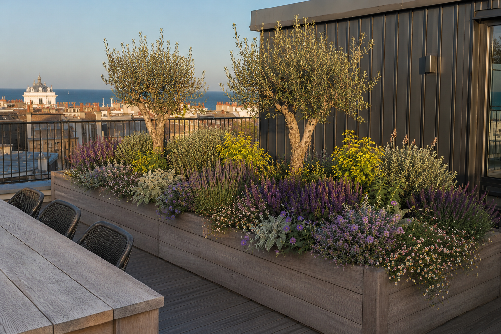

**M2 — SE L-shape (Pittosporum + 1 olive + Phormium + Cynara cardunculus + mixed mid/front):**

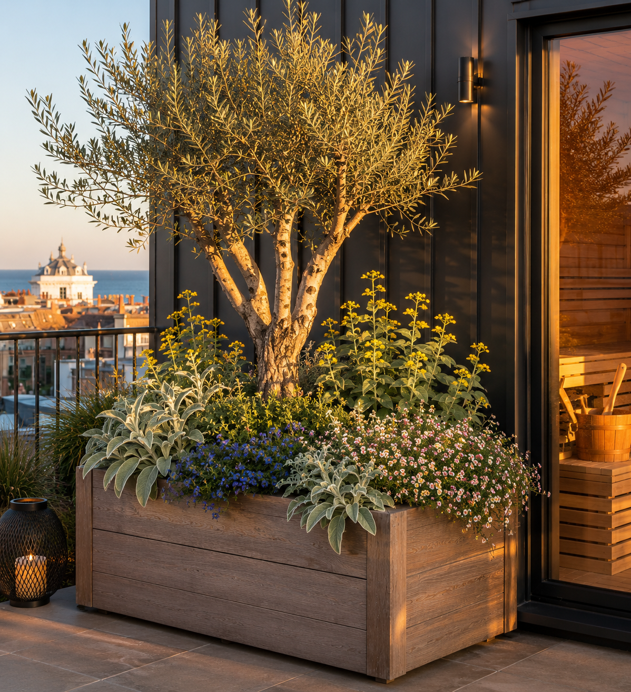

**M3 — East of sauna (single olive + Phlomis + Stachys + Erigeron + Lithodora):**

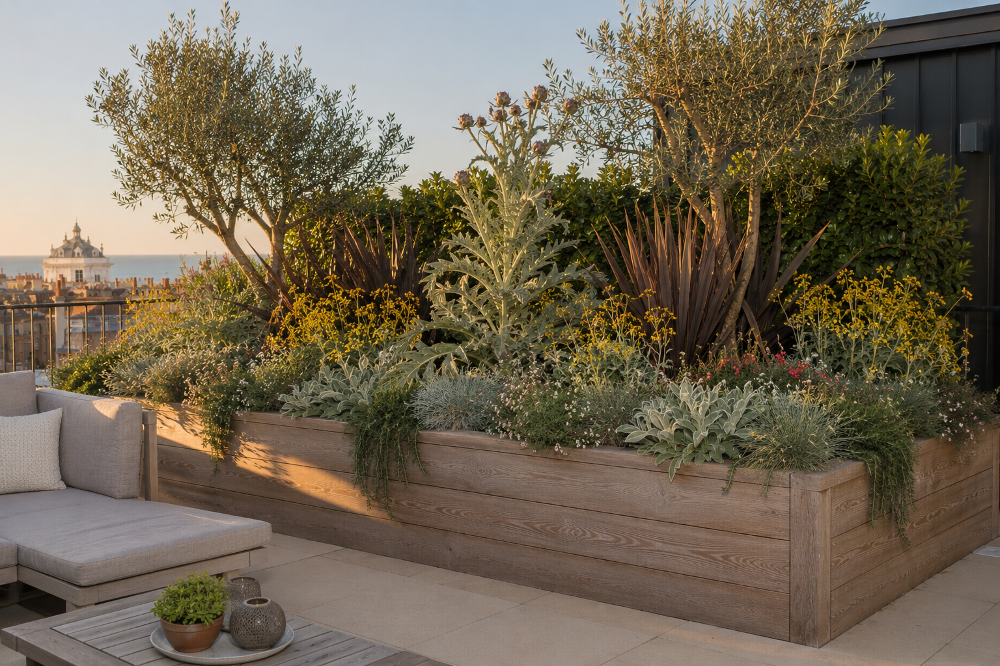

**M4 — North of seating (Olearia × haastii row + Phormium + Phlomis + Brachyglottis + front mix):**

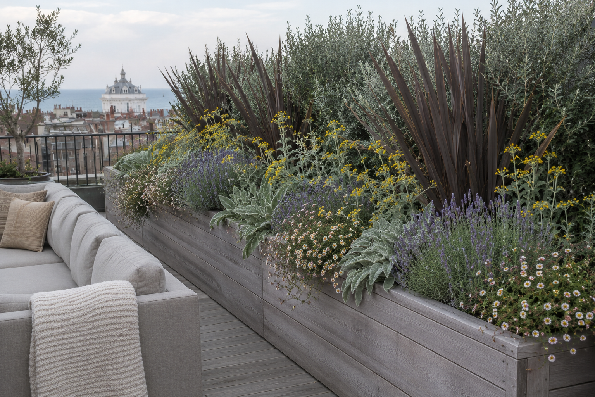

**M5 — East of hot tub (LOW only — view to Downs preserved):**

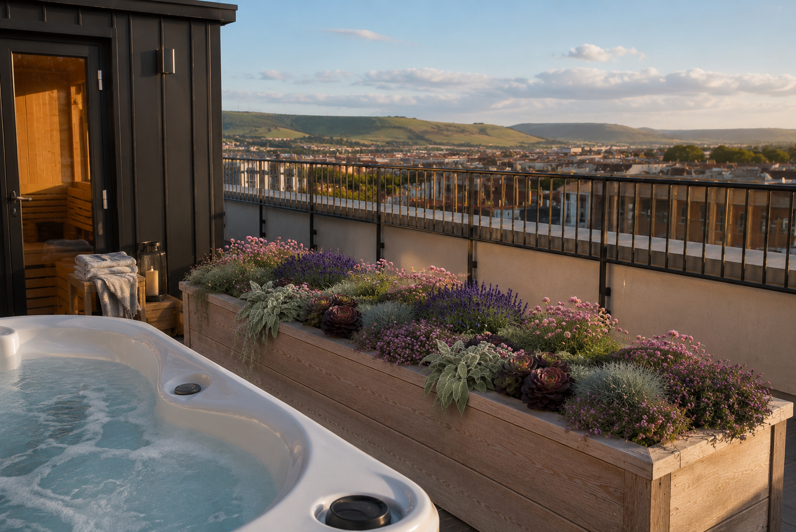

**M6 — North of hot tub (300mm planter, glass balustrade behind, compact uprights):**

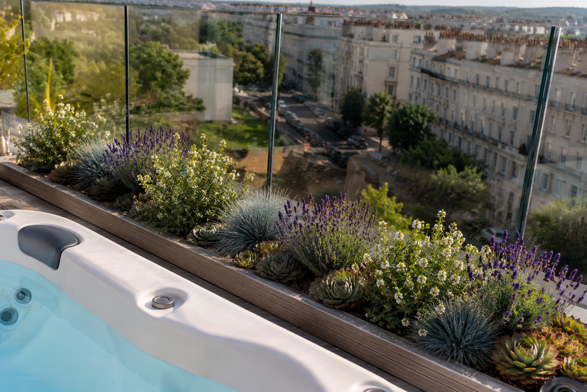

**M7 — West of hot tub (Olearia + Phormium + Phlomis + front mix):**

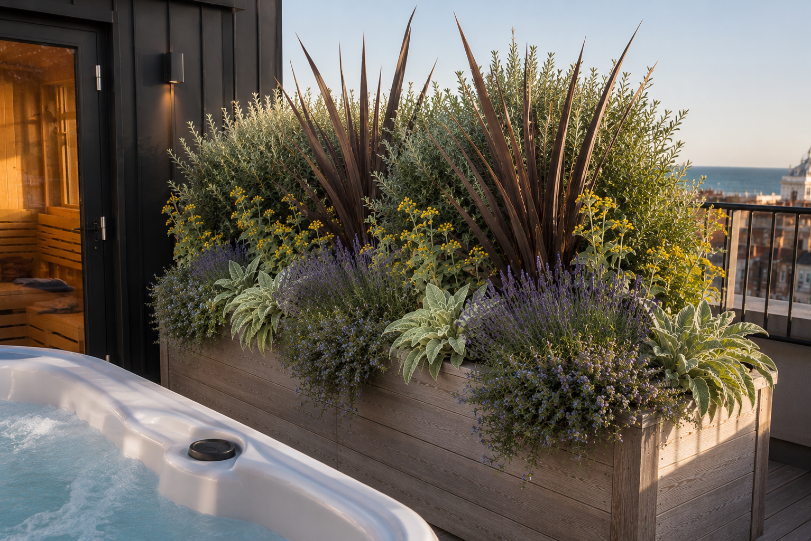

**N1 — East + North L narrow (2 olives spaced + Olearia + Phormium + Cordyline at NE corner):**

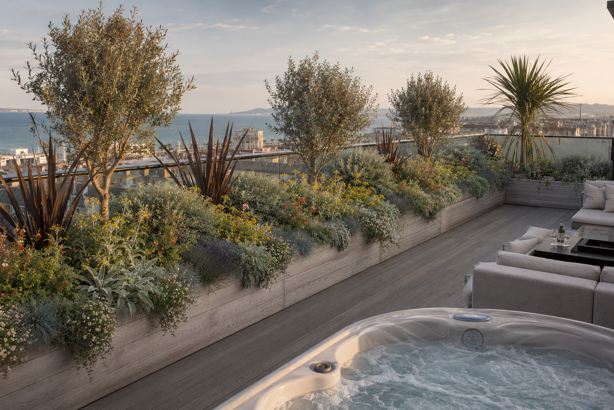

**N2 — Mid-east square (Pittosporum 'Wheeler's Dwarf' dome + Phormium + Lavandula 'Hidcote'):**

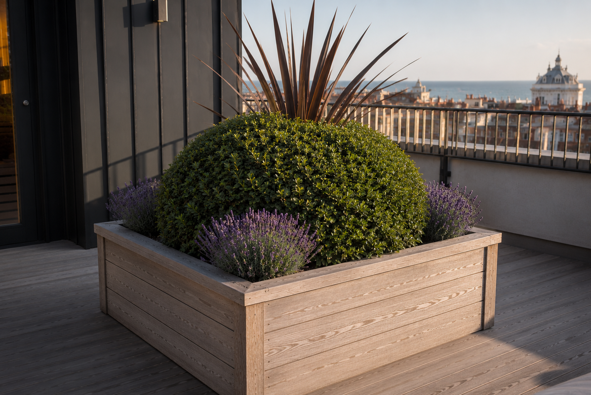

**N3 — Mid-west square (Pittosporum 'Wheeler's Dwarf' + sensory herbs: rosemary, thyme, oregano):**

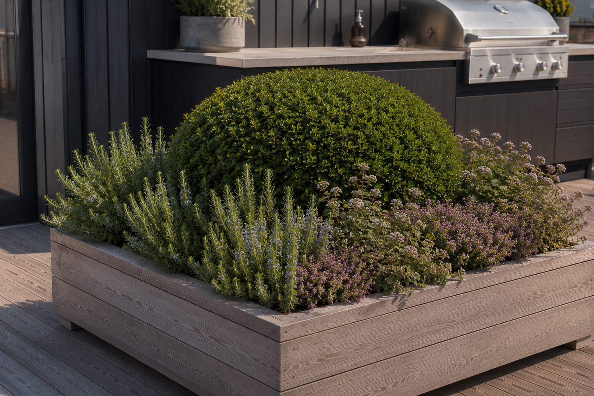

**N4 — Lift over-run herb bed (low fragrant herbs: prostrate rosemary trailing over the edges, lavender, thyme, oregano, santolina):**

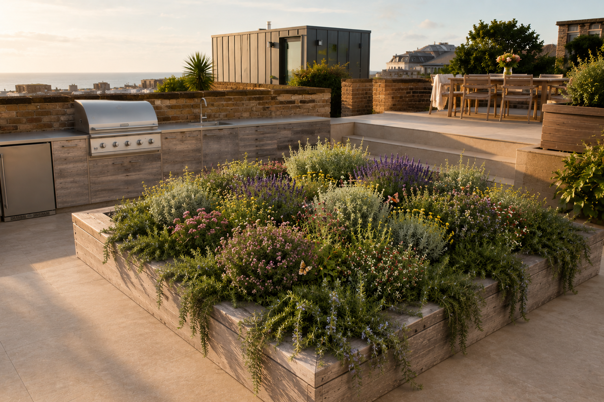

**South-end pots (cluster of 5: 1 olive + 4 mixed at SE corner of narrow):**

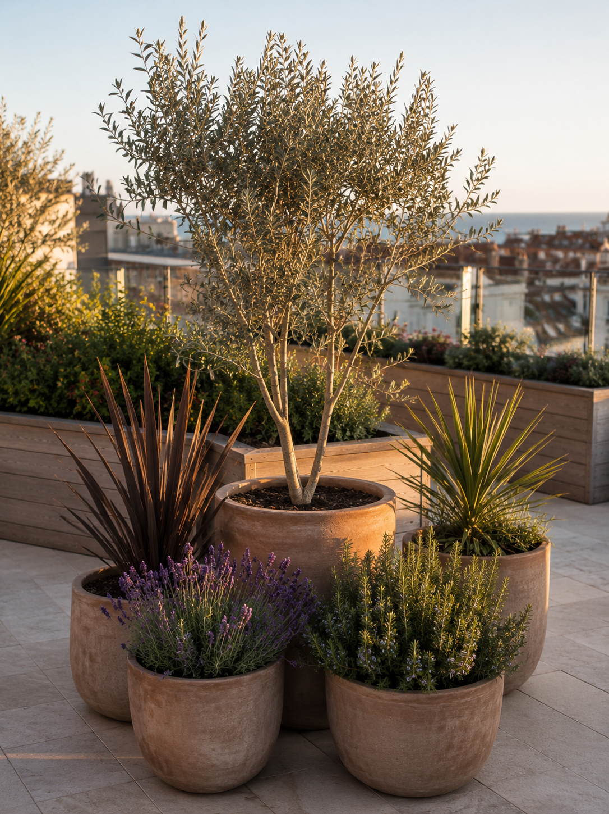

**Pots west of N3 (kitchen-adjacent softening):**

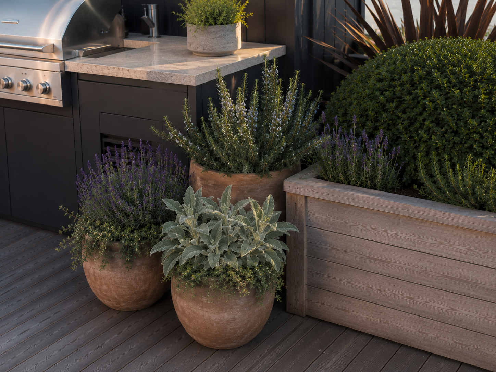

## Biodiversity case


- **Continuity with the protected Kemp Town Enclosures planting** — the palette is drawn from the same Mediterranean / coastal-meadow tradition that already characterises Sussex Square's communal gardens, so the terrace reads as an extension of the registered garden's biodiversity layer rather than an alien intrusion. **Olearia × haastii (×3 in Sussex Square photos)** is the primary mid-tall windbreak shrub in this plan — well-evidenced in the local heritage planting.
- **Strong pollinator support** — *Nepeta × faassenii*, *Lavandula*, *Salvia rosmarinus*, *Salvia microphylla* 'Hot Lips', *Salvia nemorosa* 'Caradonna', *Phlomis fruticosa*, *Brachyglottis* 'Sunshine', *Origanum vulgare*, *Geranium* 'Rozanne', *Erigeron karvinskianus*, *Lithodora diffusa* — all in the RHS "Plants for Pollinators" list, providing nectar from early spring (*Lithodora*, *Lavandula*) through to late autumn (*Salvia microphylla*, *Erigeron*). The new **N4 fragrant-herb bed** (rosemary incl. prostrate, lavender, thyme, oregano, *Santolina*, *Salvia microphylla*) adds a concentrated, long-flowering pollinator magnet and a sensory feature in the heart of the narrow terrace — all RHS "Plants for Pollinators".
- **Seed and overwintering value** — *Sedum* 'Purple Emperor', *Festuca glauca* tussocks, *Cynara cardunculus* seed heads, *Phormium tenax* flower spikes, *Phlomis fruticosa* whorls all left standing through winter provide seed and invertebrate cover for finches, sparrows and overwintering insects.
- **Coastal-meadow niche** — ***Armeria maritima*** (UK coastal native, in M5), ***Origanum vulgare*** (UK native, in N3), naturalised *Erigeron karvinskianus*, *Salvia rosmarinus*, *Stachys byzantina*, *Lavandula* — together provide the Mediterranean / coastal-meadow biotope characteristic of the Sussex seafront. The broader palette in `planting.md` also includes *Crambe maritima*, *Glaucium flavum* and *Eryngium giganteum* which can be added as native enhancements if BHCC asks.
- **Vertical layering** — **5 olive trees** distributed across 4 planters (2 in N1, 1 in M1, 1 in M2, 1 in M3) + sub-shrub mid-layer (*Olearia × haastii*, *Pittosporum tobira*, *Phormium tenax*, *Cordyline australis*) + perennial / mat understory + drought-tolerant low planting at hot tub — gives multi-tier habitat structure within the **~25.0 m² of planted area** (~21% of the terrace footprint, incl. the new N4 fragrant-herb bed). The parasols' fabric provides bird-safe cover when retracted.
- **Specific UK native species in this plan:** *Armeria maritima* (M5), *Origanum vulgare* (N3). **Long-naturalised in S England:** *Erigeron karvinskianus* (multiple planters), *Stachys byzantina* (multiple), *Salvia rosmarinus* (multiple), *Lavandula angustifolia* (multiple). Wider palette has additional UK natives available for substitution if planning officer asks for more native content (see `planting.md`).
- **No invasive species** — the list deliberately excludes anything on Schedule 9 of the WCA 1981 (e.g. no *Cotoneaster horizontalis*, no *Crocosmia* × *crocosmiiflora*, no *Buddleja davidii* as a primary feature).
- **EPDM-lined hardwood planters** with lightweight peat-free roof-garden soil mix + bark mulch (see Part C planter make-up) = healthy long-term planting at minimal structural load, not a one-season display.

## Biodiversity submission — package for Bond McCart

The pre-app response (PRE2025/00255, 30 April 2026) flagged two specific submission requirements: a **Biodiversity Checklist** (BHCC's local form) and a **Biodiversity Net Gain (BNG) demonstration** (statutory since 2 April 2024, triggered by the new sauna/wet room structure). A **Habitat Management & Monitoring Plan (HMMP)** also follows from any BNG submission.

This subsection sets out **what we've prepared for you**, **what physical features to incorporate in the drawings**, and **what we need you to produce** to satisfy the submission requirements.

### A. Material we've prepared — ready for direct use

| Item | Where | Use in submission |
|---|---|---|
| **Planting palette (~60 species)** with mature sizes, growth rate, biodiversity benefit, RHS Plants for Pollinators flags, Sussex Square in-situ photo references | `planting.md` in the project | Drop straight into the Biodiversity Statement / DAS planting appendix |
| **Pre-app baseline statement** | This document, below | Use in the BNG narrative |
| **Native species list and approximate proportion** | This document, below | Use in checklist + BNG narrative |
| **HMMP outline** | This document, below | Expand into the formal 30-year HMMP |
| **Heritage-continuity case** (palette matched to Sussex Square's Grade II registered planting character) | Part D intro + `planting.md` | Strengthens both heritage and biodiversity narratives |

**Pre-development baseline:** The existing roof terrace is an **asphalted flat roof with no vegetation**. Under the Statutory Biodiversity Metric this classifies as **"Developed land; sealed surface"** — the lowest distinctiveness band (zero biodiversity units). The proposed scheme therefore starts from zero, and any planting represents net biodiversity gain — the 10% BNG threshold is comfortably exceeded by definition.

**Post-development baseline:** Locked-in **~25.0 m² of planted area** (~21% of the terrace footprint, per Part C inventory and Part D "Planted area" subsection — including the N4 fragrant-herb bed over the lift over-run) plus **5 olive trees** distributed as point specimens (2 in N1, 1 in M1, 1 in M2, 1 in M3), plus the physical enhancement features below. Habitat types are a mix of "Ornamental non-native shrubs" (primarily *Olearia × haastii*, *Pittosporum tobira*, *Phormium tenax*), "Native species-rich elements" (*Armeria maritima*, *Origanum vulgare*), naturalised wildflowers (*Erigeron*, *Stachys*, *Lavandula*) and "Mixed scrub" texture within hardwood-clad container planters.

**Native species in this windbreak plan + wider palette available for substitution:**

| Species | Status | In this windbreak plan? |
|---|---|---|
| *Armeria maritima* — sea thrift | UK coastal native | **YES** — M5 (east of hot tub, low planting) |
| *Origanum vulgare* — wild marjoram | UK native | **YES** — N3 (kitchen-adjacent sensory herbs) |
| *Erigeron karvinskianus* — Mexican fleabane | Long-naturalised in S England | **YES** — multiple planters (M1, M2, M3, M4, N1) |
| *Stachys byzantina* — lamb's ears | Long-naturalised | **YES** — multiple planters (front-row spill) |
| *Lavandula angustifolia* / 'Hidcote' | Long-grown in UK, naturalised on coast | **YES** — multiple planters |
| *Salvia rosmarinus* — rosemary | Mediterranean, long-grown in UK | **YES** — multiple planters + N3 kitchen herbs |
| *Achillea millefolium* — yarrow | UK native | Available — wider palette in `planting.md`, not in current windbreak plan |
| *Aquilegia vulgaris* — granny's bonnets | UK native | Available — wider palette |
| *Buxus sempervirens* — common box | UK native (debated, native populations in S England) | Available — wider palette |
| *Crambe maritima* — sea kale | UK coastal native (Sussex shingle-shore native) | Available — wider palette |
| *Glaucium flavum* — yellow horned poppy | UK coastal native | Available — wider palette |
| *Taxus baccata* — yew | UK native | Available — wider palette |
| *Centranthus ruber* — red valerian | Long-naturalised (Brighton seafront signature) | Available — wider palette |
| *Eryngium giganteum* — Miss Willmott's Ghost | Naturalised; RHS Pollinators top performer | Available — wider palette |

**Locked-in plan: 6 species are UK native or long-naturalised** (Armeria, Origanum, Erigeron, Stachys, Lavandula, Salvia rosmarinus). That's roughly **20-25%** of the species count in the windbreak plan.

If BHCC asks for higher native proportion at validation, the **wider palette in `planting.md`** has 7 more UK natives available for substitution into the front/mid layers without compromising the windbreak structural function. For BNG purposes the *condition* and *structural diversity* of habitat matter more than nativeness alone in ornamental contexts — but the native proportion comfortably supports the local-distinctiveness case.

### B. Physical biodiversity enhancements — to incorporate in your drawings

The pre-app didn't ask for these, but they materially strengthen the BNG metric, support the Biodiversity Checklist "enhancement measures included" answer, and demonstrate good faith. All are modest, low-cost, and should integrate cleanly with the existing design:

| Enhancement | Detail | Where | Why |
|---|---|---|---|
| **Sparrow terrace box** | Triple-cavity timber box (e.g. Schwegler 1SP) | East-facing wall of sauna/wet room, ~2m above terrace level | House sparrow is RSPB Red List; group-nesting species. Discreet against anthracite cladding. |
| **Bat box** | External wedge box (e.g. Schwegler 1FF or 2F) | North wall of sauna/wet room (cooler, sheltered side), ~2.5m above terrace | Common pipistrelle and soprano pipistrelle both forage along Brighton seafront. |
| **Bee bricks / solitary bee hotels** | 2× brick-format units (e.g. Green&Blue 'Bee Brick') OR a dedicated bee hotel | **East-facing exterior of the main store** (NE corner of main, 1.8 × 1.2m unit) — well away from all seating / dining zones, faces morning sun (preferred by solitary bees), faces toward Bristol Gardens / public realm | Solitary bees: red mason, leafcutter, harebell carpenter. These are *non-aggressive* (females rarely sting; no hive to defend) — but positioned away from people for peace of mind. |
| **Insect / invertebrate habitat — log pile** | A small stack of untreated hardwood offcuts from the planter build (~30 × 30 × 30cm) | Tucked into one corner of the **N1 east-edge planter** (the 7.2m run on narrow terrace), below olive level, hidden by understory planting | Beetles, woodlice, ground-dwelling invertebrates. Costs nothing — uses leftover hardwood from the planter / storage build. |
| **Shallow water dish** | Ceramic / shallow bowl, ~30cm dia × 5cm deep, with stones inside as bee landing platforms | **M4 planter** (north of seating, 2.7m vertical strip on the main section's east side) — well away from dining (FA2) and the sofa zone | Drinking water for bees, butterflies, and small birds; positioned away from social areas because water dishes draw wasps as well as bees. |
| **Bird-safe parapet deterrent** | (Already in Part I — 3-wire stainless system replacing existing spikes) | All parapet tops | Excludes gulls/pigeons without injury; doesn't preclude smaller bird use of planters. |

Total likely cost across all features: **~£200-£500**. Total integration impact on the build: very low — most are surface-fixed after the building is complete.

### C. Habitat Management & Monitoring Plan (HMMP) — outline for Bond McCart to expand

The BNG regime requires a **30-year management commitment** to maintain biodiversity gains. The full HMMP is brief for a project this scale. Outline draft:

1. **Responsible party:** Chris Newson (owner), with successor flat-owners bound via Land Registry covenant if required by BHCC.
2. **Annual maintenance:**
   - Spring: replenish topsoil, check EPDM liners, replace any failed plants like-for-like from the approved palette
   - Summer: deadhead, water in dry spells, top up insect-habitat features
   - Autumn: leave seed heads (*Sedum*, *Eryngium*, grasses) standing for winter invertebrate cover and finch food
   - Winter: clean bird/bat boxes between Oct-Feb (outside nesting season)
3. **Plant replacement policy:** any plant that dies is replaced with the same species, or a substitute from the approved palette. No introductions outside the palette without notification.
4. **Invasive species control:** annual check for Schedule 9 species (none in palette by design); remove any windblown / bird-deposited invasive seedlings.
5. **Monitoring records:** annual photo-record of planters and enhancement features, retained by owner. Available to BHCC on request.
6. **Replacement of physical features:** bird boxes, bee bricks, log pile renewed as needed over the 30-year period.
7. **Transfer of obligation:** at sale of the flat, the HMMP is included in the conveyance pack so the obligation passes with title.

### D. Biodiversity Checklist — draft answers for the BHCC form

(Subject to BHCC's exact form wording, but covering the typical headings:)

- **Protected species on site?** No. Existing site is an asphalt flat roof with no vegetation; no historical records of protected species at this elevation.
- **Priority habitat on site?** No. Existing habitat: "Developed land; sealed surface" (lowest distinctiveness).
- **Ecological surveys undertaken?** No survey deemed proportionate — site has no pre-existing habitat to lose. A formal walkover by an ecologist can be commissioned if BHCC requires it.
- **Trees / hedgerows affected?** None on the terrace itself. No works to trees in the wider Sussex Square garden.
- **Lighting impact on biodiversity?** Lighting is minimal and downward-directed; no upward spill toward bat flight paths.
- **Mitigation / avoidance measures?** N/A — no biodiversity to mitigate losing.
- **Enhancement measures included?** **Yes** — see Section B above (planting palette, sparrow terrace, bat box, bee bricks, log pile, water dish).
- **HMMP in place?** Yes — see Section C.

### E. What we need from Bond McCart

To complete the biodiversity submission, please confirm or produce:

1. **Decision on BNG calculation route**: will you commission an ecologist for a formal Statutory Biodiversity Metric (SBI v4.0) report, or use the **Small Sites Metric (SSM)** route which can be self-completed? Given the project size and zero-baseline starting point, SSM is likely sufficient and a fraction of the cost. Please advise.
2. **Lead on the Biodiversity Checklist submission** — please confirm you'll fill BHCC's form using the draft answers in Section D, or flag if any answers should change.
3. **Formal HMMP document** — please expand Section C above into BHCC's preferred HMMP template and include with the application.
4. **Drawing updates to incorporate physical enhancements** — please add the items in Section B to the relevant elevations / plans so the planning officer can see them as part of the consented scheme. The sparrow terrace and bat box are the most important to show on the building elevations.
5. **Confirmation that the listed building consent application and planning permission application will be submitted together** (or whether the works fall under LBC only — which would simplify the BNG requirement).

## What we'd value your steer on

- Confirmation that the **planter footprints and locations** (Part C inventory + drawings) are structurally acceptable from a roof-load standpoint, particularly the long N1 east-edge run
- **5 olive trees** — root volume / soil-depth recommendation from a horticultural perspective (current planter depth 600mm; may need locally deeper detail at olive positions)
- Any plants on the palette you'd flag as **unsuitable for the exposed seafront location** that we should swap out
- Confirmation of **biodiversity submission route** (SBI vs SSM) and **division of work** per Section E above

---

# PART E — OUTDOOR TAP

> **🗓 Phase 1.** Lay the cold-water tee + pipe run in the first-fix before tiling. See [Programme & Phasing](#programme--phasing--two-phase-delivery).

## Remove

- Existing plastic pipe water supply run on the terrace
- Existing outdoor tap
- Plastic panel behind the existing tap

## New tap — relocated

- **Position:** between the sauna and the hot tub
- **Tap:** high-quality solid brass garden tap (e.g. Hozelock Pro, Crosswater, or equivalent), with hose connector
- **Pipe:** copper (or LSF / external-grade equivalent) — no plastic on exposed runs
- **Frost protection:** internal isolation valve and drain-down point so the external run can be drained for winter, OR an integrated frost-resistant garden tap with self-draining body
- **Mounting:** to a discreet, weather-tolerant backplate (powder-coated stainless or hardwood off-cut from the planter run, to match the timber finish — not plastic)
- Connected to the existing terrace cold supply

## What we'd value your steer on

- Best frost-protection approach (internal stop + drain vs frost-resistant tap)
- Pipe routing across the terrace given the new tile / pedestal build-up — preferred concealment

---

# PART F — OUTDOOR KITCHEN

> **🗓 Phase 1** (narrow section). Lay the sink-waste run to the foul stack under FA2, and the cold-water tee, in the first-fix before tiling. See [Programme & Phasing](#programme--phasing--two-phase-delivery).

An outdoor kitchen on the **narrow section** comprising **5 modules in a single straight run** under a continuous stainless worktop. *Order revised 5 June 2026* (left → right): **cupboard, fridge, BBQ, sink, drawer unit.** The **right-hand (north) unit is partially obscured by the steps up to Floor Area 2**, so it's a **top drawer only, sealed below**; the sink has moved next to the BBQ, and the fridge to the left of the BBQ with a cupboard beyond it.

> **Compass orientation:** RIGHT=N, LEFT=S, TOP=W, BOTTOM=E on the floorplan.

### Artist's impression

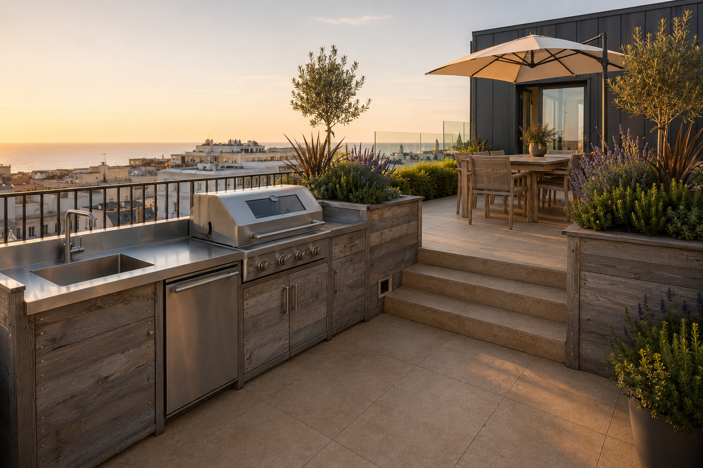

> **Indicative only — not the final layout.** The image is intended to convey the **look and feel** we're after: salvaged silver-grey hardwood-clad modules under a continuous brushed stainless worktop, against the yellow London stock brick parapet, on sandstone-toned porcelain tiles. The **exact module order, cabinet widths, BBQ hood profile, fridge model and adjacent planter position** follow the spec below — not the image. The image's role is mood and material, not arrangement.

## Layout

```
LEFT (south) →                                                ← RIGHT (north, by steps)
┌──────────┬──────────┬──────────────┬──────────┬──────────┐
│ CUPBOARD │  FRIDGE  │     BBQ      │   SINK   │  DRAWER  │
│          │   bay    │   (in-built  │   cab    │ top only │
│          │          │  + LPG below)│          │ sealed ▼ │
└──────────┴──────────┴──────────────┴──────────┴──────────┘
       ←—— continuous stainless worktop above all modules ——→
   (right unit partly under the FA2 steps → drawer at top, sealed below)
```

## Position and footprint

- **Narrow section, against the west parapet** (top edge of narrow in drawing) — exact position per 31 May drawing
- **Linear straight run**
- Approximate module widths (5 modules total):

| Module (L to R) | Function | Approx width | Notes |
|---|---|---|---|
| 1 | Cupboard | ~600mm | General BBQ storage (utensils, cleaning kit) |
| 2 | Fridge bay | ~600mm | Beefeater outdoor tropical fridge — front-vented; see Fridge section below |
| 3 | BBQ + vented LPG cabinet below | ~900mm | Beefeater Signature 3000E (820mm) + cabinet frame; LPG bottle vented below |
| 4 | Sink cabinet | ~600mm | Caple Zero sink + Caple Robo tap above; waste plumbing below |
| 5 | **Drawer unit (by the steps)** | ~600mm | **Top drawer only, sealed below** — this unit is partly under the FA2 steps, so no lower-cupboard access |
| **TOTAL** | | **~3.3m wide × ~0.7m deep × ~0.9m high (worktop height)** | |

Worktop runs continuously over all five modules — single fabricated stainless top with cut-outs for sink, BBQ and fridge ventilation grille at front.

## Components

### Cabinet structure (carcass)

Built to match the storage units and planters:
- **Outer:** salvaged hardwood deck boards
- **Frame / inner:** marine ply (sealed at joints with marine epoxy)
- **Doors / access panels:** hardwood-fronted, stainless hinges and handles

### BBQ — gas bottle

- **Model:** **Beefeater Signature 3000E 4-burner built-in** — ~£896 (sale; £995 RRP)
  - 304 stainless seam-welded body, porcelain enamel construction, cast iron grates
  - 4 cast iron burners, 72,000 BTU output, 3,840cm² cooking area
  - Roasting hood with viewing window
  - **10-year warranty** on enamel burner box, 3-year on grates and burners, 2-year on other parts
  - LPG-ready out of the box (factory-fitted regulator + hose included)
  - Dimensions (head only): 820W × 580D × 530H mm
- **Fuel:** LPG gas bottle (e.g. Calor 6kg or 13kg)
- **Bottle storage:** dedicated **vented cabinet** below the BBQ
  - **LOW-LEVEL ventilation grilles** at the base of the cabinet (≥200cm² total free area) — LPG is heavier than air and must drain out at floor level if leaked
  - **High-level vent** also recommended for through-flow
  - Vent grilles in stainless mesh (anti-corrosion + insect screen)
  - Cabinet vents to **outside only** — must not communicate with any sealed storage compartment
- **Hose and regulator:** included with the Beefeater (low-pressure, Calor-approved)
- **Safety isolation:** in-line stainless ball valve on the gas hose (for emergency shut-off without disturbing the bottle)
- **Spare bottle:** stored off-terrace (Chris's garage) — keeps the cabinet smaller and avoids two-bottle ventilation complexity

### Sink

- **Model:** **Caple Zero 1 Bowl 400 × 450mm in brushed stainless steel** — £346
  - Single bowl, brushed finish (hides water spotting/salt aerosol marks outdoors)
  - 1.0mm stainless, inset OR undermount capable
  - **Lifetime guarantee** (Caple)
  - Includes 90mm chrome basket strainer waste + overflow
  - Cut-out: 379 × 429mm; minimum base unit 400mm

### Tap

- **Model:** **Caple Robo brushed stainless monobloc** — ~£190 (sale; £254 RRP)
  - Brushed stainless finish (matches Caple Zero sink)
  - Single 35mm tap hole in worktop / sink rim
  - Twin levers, quarter-turn ceramic valves
  - **Plumbed COLD ONLY** — only the cold inlet is connected; the hot lever is left non-functional. (Outdoor BBQ kitchen, no hot supply.)
  - 5-year Caple guarantee
  - 352mm tall × 195mm spout reach

### Worktop

- **Material:** **304 stainless steel, brushed / satin finish** — fabricated to size with cut-outs for sink, BBQ head and (eventually) fridge ventilation grille. ~£500-£800 for the **3.3m × 0.7m** piece needed for the linear 5-module layout
  - **Brushed finish is essential outdoors** — polished stainless shows every water spot, raindrop and salt-aerosol mark within weeks at a coastal site. Brushed absorbs the marks into the grain direction and stays looking premium.
  - Grain direction to run parallel to the front edge of the worktop (matches the sink's brushed grain)
  - Heat-resistant (BBQ-adjacent), lightweight (good for roof load)
  - 304 grade is adequate here — the worktop is sheltered by the cabinet structure and the south parapet. 316 reserved for fully-exposed elements (cladding, parapet bird-wire).

### Fridge — under-counter

- **Model:** **Beefeater Single Door Outdoor Tropical Fridge, 118L** — £1,299
  - **IPX4 splash-protected**, tested to 43°C ambient — engineered for outdoor kitchens
  - **304 stainless** cabinet
  - Lockable, digital thermostat (0–10°C), fan-assisted frost-free with auto defrost
  - Dimensions: 555W × 495D × 850H mm — fits a standard 600mm cabinet bay with margin
  - Matches the BBQ brand (Beefeater) — visual continuity in stainless finish
- **Position:** module 2 — **to the left of the BBQ** (revised 5 June), with a cupboard beyond it; worktop running continuously over the top
- **Power:** plugs into a 13A socket inside the cabinet (junction off **Socket #5** in Part K — single feed, switched on at the wall when needed)
- **Ventilation:** front-vented unit — keep front grille clear and ensure cabinet bay has the recommended manufacturer airgap above and behind

## Plumbing — cold water supply

- **Source:** tee off the existing terrace cold-water supply (same supply that feeds the outdoor tap in Part E)
- **Pipe material:** copper (LSF / external-grade if exposed), no plastic on exposed runs — consistent with Part E
- **Routing:** under the worktop, hidden inside the cabinet, then within the pedestal void if running any distance
- **Isolation valve:** internal stop and drain-down valve so the external run can be drained for winter (consistent with Part E — frost protection)
- **Backflow prevention:** type AA airgap at the tap outlet (standard for outdoor taps / non-potable use)

## Plumbing — waste / foul drain

- **Sink waste:** 40mm solvent-weld PVC waste pipe with **p-trap** below the sink for smell trapping
- **Routing:**
  - From the sink under the worktop, into the cabinet base
  - Through the pedestal void along the narrow terrace, running south
  - **Down through the gap between the narrow and main sections** of the terrace
  - Tie into the **existing foul stack accessible under the dining area** (FLOOR AREA 2 of the main section)
  - This same foul connection also serves: the **hot tub drain-down**, the **wet room WC** (Part N)
- **Gradient:** ~1:80 (12.5mm per metre fall) for self-cleaning flow
- **Pipe fixings:** stainless to underside of the tile pedestals or to the joist heads — concealed in the void, no clips visible above tile level
- **Frost protection:** waste runs in unheated void — drain the trap for prolonged winter absences

## Power

- **Existing socket:** **Socket #5 (Part K)** — IP66 double 13A at the NW corner of the narrow section — is the same corner as the kitchen and serves this position. **No new socket required.**
- Use: BBQ ignition (most gas BBQs have piezo igniters but some use 240V), phone charging, accessory power
- If a second socket is wanted closer to the worktop, add a junction off socket #5

## Construction sequence (rough)

1. Cabinet carcass built off-site or on-terrace from salvaged hardwood + marine ply
2. Plumbing routed through pedestal void before tile finish goes down — coordinated with Part B
3. Sink installed in worktop, worktop sat on cabinet
4. BBQ placed / installed; gas bottle connected with isolation valve
5. Final test: cold water, sink drain trace, BBQ ignition

## Budget summary

| Component | Product | Cost |
|---|---|---|
| BBQ head | Beefeater Signature 3000E 4-burner built-in | £896 |
| Sink | Caple Zero 1 Bowl 400×450mm brushed stainless | £346 |
| Tap | Caple Robo brushed stainless monobloc (cold-only) | £190 |
| Worktop | **304 brushed stainless, 3.3m × 0.7m fabricated** | **~£500-£800** |
| Cabinet | **Salvaged hardwood + marine ply inner (5 modules, ~3.3m run)** | **~£500-£700** |
| Fridge | Beefeater Single Door Outdoor Tropical 118L | £1,299 |
| Plumbing / hardware | Pipe fittings, vents, hinges, drain trap, gas bottle, ball valve | ~£200 |
| **TOTAL** | | **~£3,931-£4,431** |

Total: ~£4,000-4,400 across the 5-module linear layout.

## What we'd value your steer on

- **Confirmation of waste pipe tie-in point** under the dining area — please indicate on the drawing
- **Gas Safe-compliant LPG cabinet venting** — preferred grille type / sizing for the bottle compartment
- **Whether to install a second socket** flush with the worktop area, or to keep using socket #5 only
- **Whether the kitchen unit's base needs to be on stainless feet** like the storage units, or sit directly on the Protectoboard (to be coordinated with the waste pipe routing)
- **Confirmation of 3.3m total kitchen length** — fits within the available west-parapet run on the narrow section
- **Cabinet layout** — confirmed 5 June as **Cupboard / Fridge / BBQ / Sink / Drawer unit** (L→R). The right (north) unit is a **top drawer only, sealed below**, as it's partly under the FA2 steps — confirm how far the steps overlap it so we fix the drawer width

---

# PART G — STORAGE UNITS

> **🗓 Phase 1** — Stores 1–4 (none depend on the building). See [Programme & Phasing](#programme--phasing--two-phase-delivery).

**Four** outdoor storage cabinets — **three on the narrow section (Stores 1–3), one on the main section (Store 4)** — all built from salvaged hardwood deck boards (matching the planters and outdoor kitchen aesthetic). **Cabinet-style:** front-opening doors with internal shelves.

> **Compass orientation:** RIGHT=N, LEFT=S, TOP=W, BOTTOM=E on the floorplan.

## Inventory

*(Revised 5 June 2026 to match the latest drawings.)*

| # | Position | Footprint (W × D) | Notes |
|---|---|---|---|
| **1 — Narrow, general** | Narrow section (per 5 June drawing) | **1.10 × 0.75m** × **~1.0m high** | Fills its space. **Existing plumbing + electrical conduits run at the base** — boxed in; **cupboard storage above and to the side** of the conduits. Bee bricks integrated into an external face (Part D). |
| **2 — Narrow, Litter Robot** | Narrow section (per 5 June drawing) | **1.10 × 1.10m** × **~1.0m high** | Houses the cat's **Litter Robot 4/5** — the 1.10m depth gives the room the LR needs (~686mm deep + cat-landing space); ~1.0m height leaves ~900mm+ internal, clear of the 749mm LR. **Cat flap** in the front face + **240V power** (Part K). |
| **3 — Narrow, conduit cover** | Narrow section (per 5 June drawing) | **0.85 × 0.75m** × **~1.0m high** | **Boxes in currently-exposed plumbing + electrical conduits** at the base; **cupboard storage above.** |
| **4 — Main (NE) store** | NE of the main section | **1.80 × 1.20m** × **~1.2m high** | General terrace storage — hot tub cover when off, BBQ accessories, garden tools, cushions. **Child-safe lock** if hot tub chemicals stored here. |

> **Heights:** the three narrow-section stores are **~1.0m high to line up with the narrow-section railings** (Part H) for a clean, consistent line; **Store 4 is ~1.2m high**. All sit below parapet height.

All dimensions and positions to be confirmed by Bond McCart on the drawings.

## Construction principle

Cabinet-style units, built from salvaged hardwood with a sealed marine ply inner box. No EPDM membrane — the units hold dry goods / cushions, not soil and water, so marine ply with sealed corners is sufficient.

### Walls (bottom → outside)

| Layer | Spec | Purpose |
|---|---|---|
| Hardwood deck-board outer skin | Salvaged decking, stainless A4 fixings | Visual finish, matches planters; drip-sheds rain |
| Air gap (~10mm) | Open void, drains downward | Ventilation; prevents damp build-up between outer and inner |
| **Marine ply box (sealed)** | 18mm, joints sealed with marine epoxy | Structural and watertight inner box — no separate membrane needed |

### Roof (sloped fixed top — not a lid)

Because access is via front doors, the roof is a **fixed sloped top** with no openings:

| Layer | Spec |
|---|---|
| Marine ply substrate | 18mm, edges sealed with marine epoxy |
| **EPDM membrane** | 1.0-1.2mm — single waterproof layer over the top, dressed over all four edges and down the sides by ~50mm as a drip edge |
| Hardwood deck-board top finish | Salvaged boards, fixed to the ply only — **screws stop short of the EPDM** so no membrane penetrations |

**Roof geometry:**
- **Slope ~5-10°** front-to-back (drains away from the doors)
- **Overhang ~30-50mm** on all four sides as drip edge above the doors and walls

### Doors

- **Front-opening, hinged on the vertical side** (one or two doors per unit depending on width)
- **Hardwood-faced**, matching the wall cladding so the unit reads as a continuous timber box when closed
- **Door rebate at the head + rubber gasket** to keep wind-driven rain out of the door line
- **Door head sits below the roof's drip-edge overhang** so water sheds clear of the doors
- **Bottom of door clears the unit's floor by ~5mm** to allow any ingress to drain off the sloped internal floor

### Internal shelves

- 18mm marine ply, ~250-300mm deep, full width of unit
- **Store 2 (Litter Robot):** **no shelf at LR level** — the LR takes most of the bay; any spare width can take a narrow shelf above.
- **Stores 1 and 3:** the existing conduits are boxed in at the **base**; **cupboard storage / shelves above** (and, for Store 1, to the side of the conduits).
- **Store 4 (main):** **2-3 vertical bays** of shelving (full-width single shelves, or divided depending on what's stored). Sized to fit the hot tub cover when folded as one option.
- Stainless ply support cleats screwed to the side walls

### Base

| Layer | Spec |
|---|---|
| Marine ply floor | 18mm, sealed edges, sloped ~1% to drain |
| Bearers / stainless feet | ~25mm air gap between floor and Protectoboard for ventilation + drainage |
| Small drainage holes through ply | Allows any ingress to escape onto the Protectoboard below |

## Hardware

- **Hinges:** A4 / 316 stainless butt hinges (external/exposed) — typically 2 pairs per door
- **Door handles:** A4 / 316 stainless drop or D-handles
- **Latches:** stainless magnetic catches inside; visible **stainless turn-knob latch** or recessed lock on the front face
- **Lock:** child-safe lock specifically on unit #4 if hot tub chemicals stored there
- **All exposed fixings:** A4 / 316 stainless. **Internal / hidden bracketry and shelf cleats can be A2 / 304** (cost saving — A2 is fine where it's not exposed to salt aerosol).

## Litter Robot + cat-flap detail (Store 2)

**Store 2** houses the cat's **Litter Robot 4 or 5** (self-cleaning litter box). The cat enters via a front-mounted cat flap to use the litter box; the front doors open for the owner to empty the waste drawer and lift the unit for cleaning.

**Litter Robot fit (LR4 — verified dims 559 × 686 × 749mm):**

| | Dimension | Fits in Store 2 (1.10 × 1.10m)? |
|---|---|---|
| LR width | 559mm | ✅ — ~540mm spare for the cat flap landing / a side shelf |
| LR depth + cat landing | 686mm + ~250mm in front of the raised entrance for the cat to come through the flap and step up ≈ 940mm | ✅ — 1.10m depth accommodates it (the waste drawer pulls out the front through the open doors) |
| LR height | 749mm | ✅ — needs ~820mm internal min; set Store 2 height accordingly |

**Power:** Litter Robot needs 240V mains — **socket #4 (Part K) is in Store 2**, fed from the existing electrical conduits at the base of the adjacent Stores 1/3.

**WiFi:** Litter Robot has an app — UniFi network already covers the terrace.

**Cat flap:**
- **Brand:** **SureFlap Microchip Cat Flap** (DualScan or standard, ~£80-120) — best balance of weatherproof construction, long-term reliability, and microchip locking to keep neighbourhood cats out. Well-reviewed on coastal sites.
- **Size:** standard ~165 × 175mm cutout
- **Position:** ~150mm above floor, on the vertical front face of **Store 2**, aligned with the LR entrance (so the cat enters and steps up into the LR)
- **Weatherproofing:** small rain hood / drip edge above the flap
- **Power:** battery-only (4× AA) — no wiring needed
- **Internal coordination:** flap position must leave the LR landing/step-up zone clear, and not conflict with socket #4 in Store 2. Confirm internal layout with Ronan.

**A separate cat flap from the flat → terrace** is planned (location TBC — probably in one of the existing flat-to-terrace doors). Bond McCart to detail.

## Ventilation

Cushion / fabric storage needs **passive airflow** to prevent damp:
- **Small ventilation slots** (~50mm × 10mm × 2) low-level on the front face, screened with stainless mesh insect grille
- The hardwood outer cladding's natural board gaps also breathe
- For Store 2 (Litter Robot), the cat flap doubles as a large air-exchange path

## What we'd value your steer on

- **Confirmation of the 4 positions** on the drawings and exact footprints (Stores 1–3 along the narrow section; Store 4 NE of main)
- **Heights confirmed (5 June):** narrow stores ~1.0m (to line up with the railings), Store 4 ~1.2m, all below parapet — confirm Store 2 internal height clears the 749mm LR with a bit of headroom
- **Hardware finish** — brushed stainless vs powder-coated black (to match the building cladding)
- **Cat-flap brand confirmation** — SureFlap Microchip recommended
- **Separate cat flap from flat → terrace** — location TBC, for Ronan to detail

---

# PART H — RAILINGS

> **🗓 Phase 1** (terrace works). Confirm with Ronan/conservation officer that the retained railings + wire top-up need no LBC. See [Programme & Phasing](#programme--phasing--two-phase-delivery).

The narrow section of the roof terrace currently has three sets of railings. Per the **4 June meeting**, we'll **keep the railings exactly where they are — same position, same height** — no re-siting, no cladding, no replacement. The only addition is **wires (or a low timber upstand + wires) on top**, which does two jobs in one: makes up the small extra guarding height and bird-proofs them. *(The narrow section now stays on the lowest pedestals — Part A — so the floor barely rises and the railings don't need moving.)*

## Changes

- **Keep the existing railings in place, at their current height.**
- **Add height + bird-proofing on top** — **tensioned stainless wires**, or a **low timber upstand with wires on top**, fixed to the railing tops. One element makes up the extra guarding height **and** acts as the gull/pigeon deterrent. Method (wires alone vs timber + wires) to be confirmed.
- **Remove:** the centre railing, and the short railing joining the centre railing to the west railing (redundant under the current layout).
- **Keep:** the east and west railings, both in place.

## Bird wire detail

- Stainless steel posts at ~1m centres along the top of each retained railing
- 2–3 tensioned 1.2mm 7×19 stainless wires (matching Part I parapet spec for visual continuity)
- Posts ~150–200mm above the railing top

## What we'd value your steer on

- **Top-up detail** — best way to add the extra height + wires to the railing tops (wires alone vs a low timber upstand + wires), and the fixing into the existing railing top profile
- **Removal of the centre / short railings** — confirm no structural role
- **Bird wire mount detail** at the railing tops (compatible with existing railing top profile)

---

# PART I — PARAPET BIRD DETERRENT (POST AND WIRE)

> **🗓 Phase 1** (terrace works). Confirm the LBC position for fixing into the listed coping. See [Programme & Phasing](#programme--phasing--two-phase-delivery).

The main parapet walls currently have bird spikes. They work but look bad. We want to replace them with a low-visibility post-and-wire system on the 450mm-wide precast concrete coping.

## 1. Scope

Supply and install a low-visibility stainless-steel post-and-wire system on the top face of a 450mm-wide precast concrete coping to deter pigeons and gulls.

## 2. Design intent

Gulls and pigeons need a clear, flat landing strip. On a wide (450mm) coping, a single row of wire is insufficient — birds simply land beside it. We deny the landing area by running **three parallel wires across the width**, all at the same height, so there is no usable perch anywhere on the 450mm top.

## 3. Layout (plan and section)

- **Wires:** 3 longitudinal runs, all at 85–90mm above coping
- **Lateral positions:**
  - Wire A: 30mm in from outer edge
  - Wire B: centre line of coping
  - Wire C: 30mm in from inner edge
- **Post spacing:** 1000–1200mm (consistent within a run)
- **Springs / tensioners:** at ~10m intervals and at line ends
- **Corners:** terminate and restart each wire at corners with corner posts (no sharp bends)
- **Clearances:** keep all fixings ≥25mm from coping edges/drips

## 4. Heights — what works best

- Pigeons: 70–100mm effective
- Gulls: 80–110mm effective
- **Chosen spec: 85–90mm** suits both species and looks neat

## 5. Materials (marine / coastal)

- All metalwork: **A4 / 316 or 316L stainless steel** (posts, wire, terminals, springs, screws, washers, ferrules)
- Wire: **1.2mm Ø 7×19 stainless cable** — chosen for coastal robustness, long-term fatigue resistance, and visual straightness; gives the best deterrent reliability over a 20+ year life
- Posts: turned stainless, 70–110mm stem height with swivel / tilting saddles (±10–15°) to allow posts to be plumb despite coping fall
- Base gaskets: neoprene or EPDM under base washers to protect the coping
- Anchors: stainless screws into mortar joints with resin/chemical anchors where required. **Do not drill waterproofing / membranes.**
- Dissimilar metals: isolate if any non-SS substrate/fastener is unavoidable

## 6. Fixing method (preserve fabric)

- Drill only mortar joints (perp or bed joints) between coping stones; **never the stone arris or roof build-up**
- If mortar joints are unsuitable at a location, use inner-face side-mount stand-offs into brick perp joints instead of top-mounting that stone
- Maintain minimum edge distances per anchor manufacturer data

## 7. Tension and tolerances (quality)

- **Tension:** light spring tension — enough to remove visible sag, no "banjo-tight" runs
- **Parallelism:** three wires parallel within ±2mm over any 2m length
- **Level:** top wire height 85–90mm above coping, tolerance ±3mm; posts plumb
- **Sag:** < 5mm mid-span over 3m in summer conditions
- **Finish:** no sharp burrs; trimmed ferrules; caps neat and aligned

## 8. Quantities (25m guide)

- Posts: at 1.1m centres ≈ 23 posts per run × 3 runs = **~69 posts** (+10% spares)
- Wire: ~80m total (75m + waste)
- Springs / tensioners: ~9–12 (one per end + ~every 10m per run)
- Terminals / ferrules / eyelets: as required for each end and spring

## 9. Visual / architectural requirements

- Minimal, discreet look — this is a deterrent, not a balustrade
- Keep post heads below sightline clutter; avoid reflective / glossy finishes (satin / brushed is ideal)
- Keep bases in line and centred on joints; no skewed bases

## 10. Acceptable systems / brands

Not brand-specific. Any proprietary bird post-and-wire system meeting this spec (A4/316 components; 1.0–1.2mm SS cable; swivel bases; springs; marine-grade anchors) is acceptable. Examples include mainstream UK bird-control suppliers' post-and-wire kits — contractor to propose and submit datasheets for approval.

---

# PART J — SMART CONTROL (HOME ASSISTANT)

> **🗓 Phase 1 + 2 (split).** Terrace/lighting Shellys with Phase 1; the sauna-heater contactor with Phase 2. See [Programme & Phasing](#programme--phasing--two-phase-delivery).

We run Home Assistant at home and want to control all switched and dimmed circuits on the terrace via Shelly devices. Shellys connect **directly to HA over WiFi** using the official Shelly HA integration — no MQTT broker required. WiFi coverage is provided by the relocated UniFi U6 Mesh AP under the south fascia of the sauna/wet room building (see Part K).

| Circuit | Shelly | Notes |
|---|---|---|
| Sauna heater (~37.5A continuous) | Plus 1PM + **40A contactor** | Shelly switches the contactor coil, contactor switches the heater. The 1PM gives us power monitoring in HA. 40A sized for the Harvia Cilindro PC90E 9 kW single-phase heater specified in Part M. |
| Sauna light | Plus 1 | Behind the switch outside the sauna |
| Wet room light | Plus 1 | Behind the switch outside the wet room |
| Wet room fan | Plus 1 | Behind the fan isolator |
| Electric shower | None | Standard pull-cord isolator only |
| Lighting zones 1–6 (terrace) | 6× Shelly Dimmer 2 (or equivalent dimmable Shelly) | One per lighting zone — see Part K for full lighting spec |
| Door downlights (sauna + wet room eaves) | Shared with Zone 5 or own Shelly Plus 1 | See Part K |

What this needs from the install:
- Shellys located in dry, cool, accessible places with 2.4GHz WiFi coverage
- Live and neutral at the back of every switch position (worth flagging early to the electrician)
- A small DIN-rail enclosure for the heater contactor + Shellys + lighting dimmers, somewhere outside the two rooms (a single enclosure for the lot keeps cabling tidy)

---

# PART K — ELECTRICAL: OUTDOOR SOCKETS AND LIGHTING

> **🗓 Phase 1 + 2 (split).** First-fix cabling (incl. the capped Phase-2 feeds), terrace lighting and terrace sockets go in with Phase 1; the building door downlights and the sauna/wet-room/hot-tub final connections are Phase 2. See [Programme & Phasing](#programme--phasing--two-phase-delivery).

This Part covers all 230V outdoor sockets (existing and new) and the full external lighting scheme for the terrace. Hot tub power is in Part O. Smart-control overview is in Part J.

# Section L1 — Outdoor sockets

The terrace currently has **3 existing outdoor electrical sockets** in the main section, in IP-rated protective enclosures. We want to keep all three (relocating two of them) and add **2 new double sockets in the narrow section**, plus an **internal cabinet socket** in the outdoor kitchen for charging battery lights.

## Main section — 3 existing sockets

| # | Existing position | What happens |
|---|---|---|
| **1** | West wall of main section (where the new sauna/wet room building will sit) | **Relocate** to the **south wall of the wet room**, near the dining table position. Becomes a convenient external socket for the dining area. |
| **2** | South wall of the main section | **Retain in place** but **lift** above the new floor build-up — final height **500mm above the new flat-roof finished tile level** (electrician to confirm exact dimension). |
| **3** | North-east corner of the main section | **Leave as is** — no relocation; height already suits the new FFL. Confirm IP rating and cable condition on site. |

## Narrow section — 2 new double sockets

| # | Position | Notes |
|---|---|---|
| **4** | Inside **Store 2** (the Litter Robot store, Part G) | Powers the **Litter Robot** (240V). Pick up the supply from the **existing electrical conduits/junction box at the base of the adjacent Stores 1/3**. IP rating to match the cabinet enclosure. |
| **5** | On the wall in the **NW corner** of the narrow section | IP66 weatherproof double 13A, mounted at the same height as the main-section sockets (≈500mm above FFL) for consistency. |

## Outdoor kitchen — internal cabinet socket

| # | Position | Notes |
|---|---|---|
| **6** | Inside one of the **kitchen base cabinets** (electrician to pick whichever cabinet offers the shortest run from the narrow-section feed) | Double 13A IP54-rated socket for **charging rechargeable battery lights** kept in the cabinet. No fixed task lighting on the outdoor kitchen run — battery lights are lifted out when needed for dining / cooking after dark. |

## General requirements (all sockets)

- All existing protective enclosures to be reused unless damaged or no longer IP-compliant — replace like-for-like (IP66) if so
- Cable runs made good — no exposed runs left over from previous mounting heights
- Re-test and certify after relocation
- Co-ordinate final socket positions with planters and parasol bases so they remain accessible
- Consistent mounting height across all sockets where practical

## Note on the additional IP66 socket in Part N

The **IP66 socket on the building's external north wall, east end** (specified in Part N — External Switches / Isolators) is **in addition to** the 6 sockets in this Section, not one of them.

---

# Section L2 — External lighting

## Overview

A single coordinated external lighting scheme — **warm-white 12V LV LED uplighters in planted areas**, plus **two recessed downlights** in the eave/soffit above the sauna and wet room doors. All zoned, dimmable, on Home Assistant via WiFi.

**Design principles:**

- **Warm white** (2700K) throughout — atmospheric, sympathetic to the Regency / heritage character of Sussex Square
- **Uplighters concealed in planted areas** — the fittings disappear, only the light shows, illuminating foliage and trees from below
- **Marine-grade fittings** — 316 stainless steel or brass — for a 15–20 year life in coastal salt air
- **Middle-of-road spec** (Collingwood / Lightpro / In-lite / Techmar). Not premium (Hunza, John Cullen) and not unbranded budget — middle is the durability-vs-cost sweet spot
- **12V low-voltage plug-and-play** preferred (Lightpro, In-lite, Techmar systems) so fittings can be added, moved or replaced without an electrician
- **No light visible above the parapet line from the street** — heritage / conservation area
- **No light pollution** to neighbours or to the registered communal garden of Sussex Square

## Lighting zones

Six dimmable zones, each on its own Shelly:

Restrained counts — picking out specimens, olives and corners rather than blanket flooding. Lightpro / In-lite buses make it trivial to add more later if any zone reads as too dim once planted.

| Zone | Area | Fittings | Count |
|---|---|---|---|
| **1** | South-end pot cluster (5 pots) + pots west of N3 | 1 on the central olive pot, 1 grazing the wider cluster, 1 on the W-of-N3 group | **3** |
| **2** | Narrow section planters **N1 + N2 + N3** | 3 along the long N1 east run (one per olive), 1 in N2, 1 in N3 | **5** |
| **3** | Dining area — planter **M1** (L-shape) | 1 per olive (2) + 1 corner accent | **3** |
| **4** | Lounge SE corner — planter **M2** (L-shape) | 1 per olive (2), 1 on the Cynara focal, 1 picking out the corner Phormium | **4** |
| **5** | Sauna east side — planter **M3** + door downlights | 1 uplighter on the M3 olive + 2× door downlights | **1 + 2** |
| **6** | Hot tub planters — **M5 (east) + M6 (north) + M7 (west)** | 1 per planter, **angled away from the tub seating** so they don't dazzle | **3** |

**Total:** ~19 uplighters + 2 downlights.

## Fittings — preferred suppliers and types

**Spike uplighters (planted areas — zones 1, 2, 3, 4, 5, 6):**

- **Lightpro Garden Lights** (NL, UK distribution) — 12V LV plug-and-play system. Brass and 316SS spike uplighters, marine-spec, ~£30–50 each. Whole installation runs off one bus with pre-made waterproof connectors.
- **In-lite** (NL, UK distribution) — similar 12V LV plug-and-play, very robust connectors, slightly premium pricing.
- **Techmar Garden Lights** — comparable 12V LV system, also widely stocked in UK.
- Any of the three are acceptable — electrician's choice based on stock and price at install.

**Eave/soffit downlights (zone 5 — sauna and wet room doors):**

- Small (~50–65mm diameter) **IP65 LED downlight** in 316 stainless or anthracite-matched finish, recessed into the underside of the eave/soffit above each door on the north (door) face of the sauna/wet room building.
- Examples: **Collingwood DL** range, **Astro Minima** in IP65 variant, or marine-spec equivalent.
- Warm white 2700K, ~3–5W LED, dimmable.
- **Coordinate with Part M** on the soffit detail — small recessed downlights need a flat soffit area at the door head where they can be set in cleanly.

## Control — Home Assistant via WiFi (no MQTT broker)

- **One Shelly Dimmer 2** (Gen 1, WiFi, 230V mains-side trailing-edge dimmer) **per zone** — connects directly to HA over WiFi via the official Shelly integration. **MQTT broker not required** — WiFi was specifically chosen because the terrace MQTT signal is weak.
- For each zone: Shelly Dimmer 2 → **mains-dimmable trailing-edge LED driver / 12V LV transformer** → fittings on that zone's plug-and-play bus.
- Verify the LV transformer is on the Shelly / Lightpro / In-lite **dimmer compatibility list** before ordering — Lightpro and In-lite both publish these.
- All Shellys live in the **DIN-rail enclosure** that also houses the sauna heater contactor and the Part J control Shellys, so cabling stays in one place.
- HA scenes will configure typical evening combinations (e.g. "dining only", "hot tub only", "all on low") and a default dusk-to-23:00 schedule for the planter zones.
- **Manual override:** a single weatherproof momentary push-button **beside the sauna door** (in the same IP55+ switch cluster as the Part M sauna controls) flips an "all terrace lights" master scene in HA, so the system can be used without a phone.

## Cable strategy

- **12V LV cable** routed under the tile build-up where possible (within the pedestal float zone), in conduit at any penetration through the planter walls.
- For surface-tracked runs (e.g. behind planters along walls), keep the cable concealed behind the planter back face — there's a 25–50mm air gap to the wall (Part C) that's ideal for cable routing.
- **All 230V mains** stays inside the building / DB enclosure — only **12V LV** runs out onto the terrace surface.

## Wifi access point on the sauna/wet room building

To give reliable wifi coverage across the full terrace (hot tub, dining area, smart controls inside the sauna/wet room), we plan to mount a **Ubiquiti UniFi outdoor access point under the high south fascia of the sauna/wet room building** (the south-high mono-pitch in Part M gives a natural sheltered overhang). The position:

- Invisible from Bristol Gardens, from the dining patio, and from the rest of the terrace
- Sheltered from rain by the fascia overhang
- Aimed downward / outward to cover the whole terrace
- Line-of-sight back along the south parapet to the existing **UniFi study AP at the south end of the narrow terrace**, for wireless mesh backhaul (or wired ethernet daisy-chain if preferred)

**Power and cable approach — matches the existing flat setup:**

- **UniFi PoE injector (mains adapter) stays inside** — typically plugged into a regular indoor socket. No outdoor 240V mains required.
- A single low-voltage **PoE cable (Cat6)** routes from the injector through the building shell and out under the south fascia to the AP. The cable carries both power and data.
- This mirrors how the existing UniFi APs in the flat (including the study AP) are already powered.

**AP unit:** the existing **UniFi U6 Mesh** is already in place on the terrace — it just needs **relocating** to the new mount point under the south fascia of the sauna/wet room building (no new hardware purchase).

## What we'd value your steer on

**Sockets:**

- Whether all 3 existing main-section enclosures are worth retaining or if a uniform replacement (matching IP66 spec across all 6 terrace sockets) would be cleaner
- Confirmation that 500mm above new FFL is a sensible standard height — or your preferred standard
- Whether the SW cupboard junction box is suitable to pick up from, or needs upgrading
- Best kitchen cabinet to host socket **6** (shortest run, best access for charging)

**WiFi AP:**

- Preferred Cat6 cable route from inside the flat (where the PoE injector lives) into the building shell and out under the south fascia — up the south face? through the door head? — and how to weatherproof the cable's exit point through the cladding
- Discreet mount point under the south fascia / eaves underside (coordinate with Part M's roof detail)

**Lighting:**

- Confirmation that the **door downlights** can be cleanly recessed into the eave/soffit at the north face of the sauna and wet room doors (depends on the soffit detail coming out of Part M — flat enough area to set in a ~60mm fitting)
- Whether to install **one zoned transformer with 6 dimmable outputs** vs **6 separate transformers** (one per zone) — practical preference of the electrician
- **Cable concealment** — confirmation that running 12V LV under the pedestal float zone (with conduit at planter penetrations) is acceptable from a maintenance perspective
- Whether **socket 6 in the kitchen cabinet** needs higher than IP54 given it's inside a cabinet but on an outdoor structure

---

# PART L — FALL PROTECTION (GLASS BALUSTRADES & PLANTERS)

> **🗓 Phase 1 + 2 (split).** The **dining-area glass goes in with Phase 1**, alongside the raised FA2 dining floor, so its 500mm fall edge is guarded from day one *(confirm with Ronan that this glass doesn't itself need LBC)*. The **hot-tub glass is Phase 2**, arriving with the tub. Both fix into the parapet masonry (no roof penetration), so the hot-tub run can wait without locking anything in. See [Programme & Phasing](#programme--phasing--two-phase-delivery).

Two locations need fall protection to comply with Approved Doc K (1100mm above the standing level):

1. **Dining area (Floor Area 2)** — 1100mm above FFL along the relevant edge(s)
2. **Around the hot tub** — 1100mm above the **hot tub rim**, since BC will treat the rim as the standing level. The tub can't be positioned away from the edge, so this applies.

We've chosen frameless structural glass throughout for both locations — keeps the view, and minimises bulk from public viewpoints (conservation area).

## Glass spec

- Frameless toughened laminated glass (typ. 17.5mm or 21.5mm — engineer to confirm)
- Heights:
  - Dining area: top of glass at **1100mm FFL**
  - Hot tub area: top of glass at **1100mm above tub rim** (≈1900mm FFL depending on final tub choice)
- Designed to BS 6180 line loads + Brighton coastal wind loads (significant — seafront exposure)

## Planters (inside the glass)

- **500mm deep planters** running along the inside (terrace side) of the glass
- Planter top **300mm above hot tub rim** along the hot tub run
- Functions:
  - Visual / planting feature
  - Creates a 500mm physical setback between the hot tub and the glass — may help BC accept the guarding line (worth confirming with building control)
  - Adds visual interest at parapet level

## Mounting — side-mounted (face-fix to inner face of parapet)

**Side-mounted, point-fixed to the inner face of the parapet wall.** The glass panels are clamped with individual stainless point-fixings (or a low-profile inner-face channel) into the inner masonry face of the parapet, projecting upward to the required 1100mm guarding height.

**Why this mounting:**

- **No metal at the top of the glass** — clean frameless top edge across the whole run. Top-mounted channel systems require a visible alu/stainless cap rail that we want to avoid for aesthetic reasons.
- **Coping and tanking undisturbed** — no penetrations through the top of the parapet, no risk to the existing waterproofing layer beneath the precast coping
- **Individually replaceable** clamps — easier long-term maintenance than a continuous top channel
- **Trade-off:** the cantilever load path puts higher leverage on the inner-face fixings, so the masonry condition behind the fixing line needs to be sound. Resin anchors into solid brickwork (with appropriate pull-out testing) are the standard approach for this exposure.

## What we'd value your steer on

- **Inner-face fixing detail** — point-fixed stainless clamps vs a low-profile inner-face channel; SE to confirm pull-out capacity against the existing masonry given Brighton seafront wind loading
- **Glass thickness / spec** — to be sized by the supplier's engineer once the inner-face fixing detail is agreed (likely 17.5–21.5mm toughened laminated to BS 6180)
- **Whether the 500mm planter setback** is acceptable to building control as part of the guarding strategy around the hot tub (could allow the glass to be slightly lower than the strict 1100mm-above-rim rule, though we're not banking on this)
- **Condition of the inner masonry face** behind the proposed fixing line — confirmation it's sound brickwork suitable for resin-anchored point fixings at this exposure

---

# PART M — SAUNA

> **🗓 Phase 2** (needs planning/LBC). *Phase-1 provisions to build in now:* the sauna floor-drain roof penetration, and the heater/light/socket cabling first-fix. See [Programme & Phasing](#programme--phasing--two-phase-delivery).

**Internal dimensions:** 1.5m (east–west) × 2.15m (north–south)
**Minimum internal ceiling height:** 2.1m (2100mm — same as wet room; single internal ceiling height across the whole building)

> **Binding constraints from pre-application (PRE2025/00255):**
> - **Setback ≥ 3m from north parapet edge** — conceded in revised submission to planning (was originally 600mm; revised to match heritage officer's 3-4m ask)
> - **External roof height ~1,293mm above parapet** — *increased from the 1,150mm in the revised heritage statement* because inverting the whole main roof section raised the finished floor level (see Part A). **This exceeds the pre-app figure by ~143mm and must be re-presented to planning.** Ronan to confirm the final figure once the inverted build-up depth is fixed.
> All Part M design assumptions must respect these limits.

## Internal plan

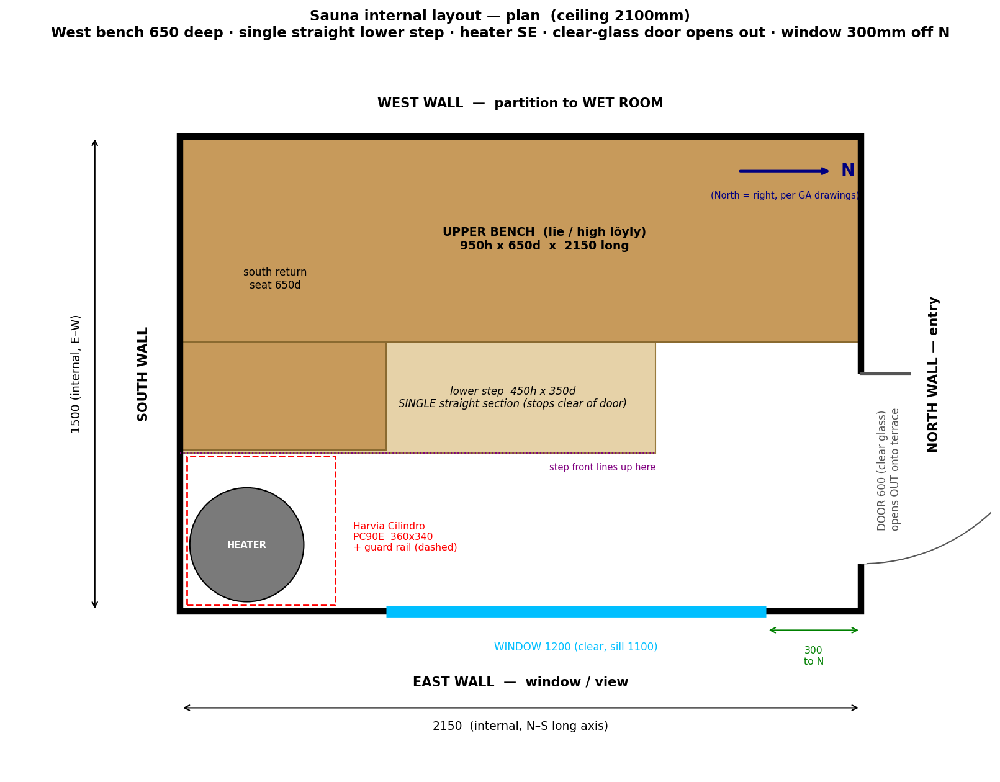

*Working layout sketch (indicative, not to construction standard).* Heater in the **SE** corner; two-tier **west bench** (650mm deep) with a **single straight lower step**; **south corner return seat**; **clear-glass door opening out** at the north; **window 300mm off the north wall**. **North = right**, matching the GA drawings.

## Floor

- Tanked (continuous with adjacent wet room), screeded to fall, R11 porcelain tile to match the rest of the terrace
- Removable softwood duckboards laid on top of the tile (flat-pack kit, e.g. Finnmark, ~£80–150)
- Stainless steel high-temperature drain connected to the terrace drainage

## Walls and Ceiling

This is a working assumption — final makeup to follow your steer (see "What we'd value your steer on" below).

- **Insulation — walls: 100mm PIR** (e.g. Celotex/Kingspan) in the stud cavity (fits a standard 100mm stud), preferred over mineral wool for better thermal performance per mm — kept thin to protect internal space and terrace footprint. Achieves U ≈ 0.24 W/m²K, within our ≤0.27 target. Going to 150mm would save only ~60W of wall loss (a few £/yr) at the cost of internal space, so 100mm is the deliberate choice.
- **Insulation — roof/ceiling: 150mm PIR** — thicker than the walls because heat rises and the ceiling is the hottest surface, and there is **no space penalty overhead** (it sits within the ~1,293mm-above-parapet build-up zone). See the Roof section.
- **Foil vapour barrier** on the interior face of the insulation, fully taped, continuous around all junctions — **especially the partition–external-wall corner *and* the wall-to-roof junction**. The hot ceiling sees the most heat and moisture, so any gap at the wall-to-roof corner drives damp into the PIR and the cold roof void (rot / corrosion of the standing-seam roof from below). **Ronan to detail both junctions.**
- **25mm ventilated batten cavity** between the foil VB and the internal lining, to let the timber breathe between sessions
- **Internal lining:** untreated kiln-dried softwood tongue-and-groove — cedar, aspen, thermo-aspen, or spruce; final choice to follow the kit supplier's recommendation if kit-route is taken (see below)
- All fixings stainless steel
- **Internal partition (sauna ↔ wet room)** to be substantially slimmer than the external walls — see footprint discussion below

## Benches

Upper bench is an **L wrapping the SW corner**; the lower step is a **single straight section** along the west wall. All in the same untreated whitewood/spruce:

| Position | Height (FFL) | Depth | Length |
|---|---|---|---|
| Upper bench, west wall (main lie / löyly) | 950mm | **650mm** | 2.15m |
| Upper bench, south wall (corner return seat) | 950mm | 650mm | ~0.95m (to the heater) |
| Lower step — **single straight section**, west wall | 450mm | 350mm | runs the southern length, stops clear of the door |

*Revised 5 June 2026:* the **west bench depth is increased to 650mm** so its step front lines up with the south bench / heater line — that lets the **lower step be one clean straight section** instead of jogging round the corner. Total west bench depth is now ~1000mm (650 + 350 step), leaving a ~500mm clear strip down the east side.

**One person lies full-length** on the 2.15m west bench; the south leg is a **corner return seat** for a second person (the 1.5m south wall is too short to lie along on its own), using the west step / floor for feet. The **lower step stops short of the north (door) end**, so you step onto clear floor as you enter — not onto the bench. The south return is **cut back at the SE end** for clearance to the Harvia Cilindro PC90E (360 × 340mm) and its guard rail in the SE corner — final clearances per the manufacturer's manual.

## Door

- North wall, 600mm clear opening, **clear of the bench** (you step onto open floor on entry — see benches above)
- **Glass sauna door** *(revised 5 June 2026 — was solid cedar).* Toughened safety glass leaf in a timber (cedar) or marine-grade aluminium frame.
- **Must be an outdoor / weatherproof-rated assembly — not a standard indoor sauna-cabin glass door.** It needs to be insulated (sealed double/triple glazing or a properly weather-sealed external sauna door), with full-perimeter weather seals and a weathered threshold, because this door is the external face of the building on an exposed coastal roof. Most catalogue glass sauna doors are for indoor cabins — confirm the external/coastal rating with the supplier.
- **Glass finish: CLEAR** *(decided 5 June — no privacy needed at this position).* Keeps it open and lets the sauna glow out across the terrace in the evening.
- **Coastal hardware:** A4/316 stainless or solid brass hinges, catch and handle only.
- Magnetic catch, 50N+ pull (wind-resistant); heat-tolerant (timber / cool-touch) handle.
- **Outward-opening** (swings out onto the terrace — keeps the swing out of the small sauna and is the right way for egress), with restrictor to limit swing in wind. Needs clear swing space on the terrace side.
- **Hold-open for venting between sessions** — marine A4 stainless / solid brass cabin-hook (or sprung friction arm) on the external wall, holding the door at ~30–45° for passive airing.
- **Heat-loss note:** a glazed door loses more heat than an insulated timber one — consistent with doors/windows being the main heat path (see Walls and Ceiling). Accepted for the look, and mitigated by the door being **diagonally opposite the heater** (SE) and well sealed.
- Suppliers: sauna specialists do glass doors — **Finnmark, Auroom, Tylö Helo, Harvia** — subject to the outdoor-rating check above.
- Approximate cost: £400–800 (outdoor-rated glazed unit)

## Window

- East wall, with a **300mm gap to the north wall** so it isn't jammed into the NE corner — the window's north edge sits 300mm off the north wall, and the 1200mm window runs south from there (north edge ≈1850mm, south edge ≈650mm along the 2150mm east wall). View to the NE/E.
- **1200mm wide × 800mm tall**, single pane, **FIXED** (non-opening) — ventilation is handled by the dedicated inlet/outlet vents, so an opening sauna window is not required
- Sill at 1100mm from FFL
- **Frame:** cedar or other heat-tolerant softwood on the interior face; external face can be aluminium-clad if needed for weatherproofing — **NOT aluminium internally** (would burn skin at sauna interior temperature)
- Triple-glazed (4-12-4-12-4), argon-filled, low-E coatings **rated for sauna interior temperatures**, warm edge spacers — chosen for thermal retention given rooftop exposure
- Compression seals: EPDM or silicone (heat/humidity tolerant)
- External manual roller blackout blind on exterior above (sized to cover full 1200mm width)
- **To be specified in coordination with the kit supplier if kit-route is taken** — sauna-rated window assemblies are typically supplied or specified by the sauna specialist, not a domestic window supplier

## Heater

- **Harvia Cilindro PC90E** — 9.0 kW, 240V single-phase electric sauna heater, ~90 kg stone capacity, cylindrical floor-standing column positioned in the south-east corner
- Large stone mass for sustained, authentic löyly. Stones loaded loosely around a central heating column.
- Physical: ~1150mm tall × 360mm wide × 340mm deep, plus guard rail clearance of ~100–150mm around it
- Approximate UK price £1,100–1,400 (heater only; stones usually included)
- 25–35 min heat-up time to 90°C; managed via Home Assistant scheduling (Part J — Shelly Plus 1PM + 40A contactor)
- **Heat shield panel** above the heater is recommended given the radiant output of the 9 kW column heater
- 10mm² silicon-rated cable to a fused spur in the corner (cable rated comfortably above the 37.5 A continuous draw)
- Heater guard rail (usually supplied with unit)
- **Note:** previous spec assumed a Harvia Vega 4 kW — undersized for this volume and small stone mass = poor löyly. Superseded.
- **Sourcing note:** The PC90E is the 240V single-phase factory variant of the Cilindro PC90 line. Most UK retailers stock the standard PC90 (400V 3-phase); UK sauna suppliers should be able to source the PC90E directly, or alternatively wire a standard PC90 for 230V single-phase per the Harvia installation manual.

### Electrical assumption (to be verified)

This section assumes:
- **Single-phase 240V supply** to the flat (the standard for UK residential — but to be confirmed by electrical survey of 22 Sussex Square)
- **40A circuit** can be accommodated in the consumer unit (37.5 A continuous heater draw sits comfortably within a 40 A breaker rating)
- Three-phase supply, if available, would open up the higher-output Cilindro PC110 (10.8 kW, 3-phase only) — but we are not relying on this

**To check with electrician at first opportunity:**
1. Confirm single-phase 240V supply (vs three-phase) at 22 Sussex Square
2. Confirm a dedicated 40A circuit can be added to the consumer unit, or whether the consumer unit needs upgrading first
3. Confirm the sauna supplier can source the PC90E specifically, or wire a standard PC90 for 230V single-phase per Harvia's installation manual

## Ventilation

Passive only:
- 100mm inlet vent low on south or east wall, ~100mm from floor (near heater)
- 100mm outlet vent high on west or south wall, ~300mm from ceiling

## Lighting

- **2× sauna-rated LED ceiling fittings** (e.g. Cariitti, Tylö, Harvia) — purpose-made for sauna heat, ~£80–150 each
- Light switch outdoors on the terrace, beside the sauna door — IP55+ weatherproof

## Sockets (For Future Office / Bedroom Conversion)

We want this room to be convertible to an office or bedroom in future without retrofitting power, so:

- 2× IP54 double sockets at 300mm from FFL
- Socket 1: east wall, under the window at the north end (for a desk facing the view)
- Socket 2: north wall (general / bedside use)
- Dedicated 20A radial circuit
- Both sockets clear of the south-east heater corner
- Used only when the room is cold

## External Switches / Isolators (Sauna Side)

Grouped on the terrace wall beside the sauna door, IP55+ weatherproof:
- Sauna light switch (Shelly Plus 1 behind)
- 40A DP rotary isolator for the sauna heater (manual override / safety isolation) — sized for up to ~9kW single-phase heater (see Heater section)

## What we'd value your steer on

### Kit-supplied sauna interior vs site-built

We haven't decided whether the sauna interior — internal cedar T&G lining, foil vapour barrier, vented batten cavity, benches, heater installation, glass door, controls, sauna lighting — should be **site-built** by your team, or supplied as a **cut-to-size indoor sauna kit** from a sauna specialist who would install the interior into the shell you've built.

**Argument for kit:**
- Sauna-specific details (vapour barrier continuity, vented gap behind cedar, heater clearances, drain penetrations) handled by people who do this for a living, warranty-backed
- Frees your scope to focus on the shell, which is standard outbuilding work
- Door comes from the same supplier, coordinated finish

**Argument for site-built:**
- Slightly lower total cost if it all goes well
- Total control over internal finish details (bench layout, timber choice, reclaimed materials, etc.)

**Suppliers worth contacting against our internal dimensions:**

- **Finnmark Sauna** — UK (Leeds); cut-to-size indoor kits, outdoor doors, components, heaters
- **Auroom** — Estonia with UK distribution; premium modern aesthetic, custom indoor kits
- **Tylö Helo** — Sweden; established broad-range supplier, kits and components
- **Harvia** — Finland; large industry presence, full kits and heaters

We'd value your view on which route makes sense, and which supplier(s) you've worked with before or would recommend approaching. If kit-route is taken, the chosen supplier feeds back wall makeup, vapour barrier, electrical, drainage and ventilation requirements for the shell.

### External building footprint

**External dimensions (current design): 2902mm (east–west) × 2488mm (north–south)** — a bounding footprint of **~7.22 m²** (a little less once the dogleg notch around the terrace wall is taken out), which sits **within the ~7.6 m² accepted at pre-application**. These reconcile with the internal rooms (sauna 1.5m + wet room 940mm E–W) at external walls of ~170mm and a ~110mm partition — consistent with our 100mm-PIR wall makeup.

We've kept the building as small as practical to leave maximum surrounding terrace space, accepting that this trades against insulation/weatherproofing thickness. We'd still value your steer on the wall makeup below.

**External walls** — thinnest viable makeup that retains good sauna thermal performance (we're aiming for U-value ≤ ~0.27 W/m²K) and is appropriate for coastal/exposed roof terrace conditions:

- We've settled on **100mm PIR in the walls and 150mm in the roof** (rather than mineral wool) for better performance per mm. Does that suit the exposure, and are you comfortable with **PIR at sauna temperatures** behind the foil VB + cedar lining, or would you prefer traditional rock/mineral wool on the hot faces?
- Is a rigid 25 mm ventilated rain-screen cavity essential, or can a back-ventilated cladding detail direct to sheathing save thickness on this coastal site?
- What is the thinnest external wall makeup you'd be comfortable specifying for this exposure?

**Internal partition (sauna ↔ wet room)** — we're much less worried about wet-room warmth than sauna heat loss. In fact some heat leak into the wet room is welcome (pre-warms it for post-sauna showering). So the partition can be substantially slimmer than the external walls — perhaps 50 mm stud with mineral wool, no external weatherproofing layers. Would you agree, and is there anything (structural bracing, fire separation, regs) that requires it to be heavier?

**Vapour barrier continuity at the partition–external wall junction** — however the partition is built, the foil VB on the sauna face needs to be continuous around the corner with the external-wall VB. Any gap there is where moisture finds its way into the insulation long-term. We'd value your detailing on that junction.

### External cladding (whole building)

**Working choice: PVDF-coated marine-grade aluminium standing seam** (e.g. Kalzip, Riverclack, PREFA), in anthracite/charcoal — target RAL 7016 / 7022 / 7024. Applies to all four external walls of the combined sauna/wet room building.

**Why aluminium standing seam over the alternatives we looked at:**

- **Zinc and copper** (the other common standing-seam metals): seagull droppings are acidic (uric acid, pH ~3–4) and permanently etch the patina on both, leaving accumulating white or green halo marks. PVDF-coated aluminium is chemically inert to uric acid — droppings wash off in the rain with no ghost marking.
- **Equitone Tectiva fibre cement panels**: strong runner-up — similar coastal performance, ~£500–800 cheaper for our ~28 m² of cladding. Loses on continuous-skin aesthetic, build-up depth (~40mm vs ~30mm), and warranty length. Sensible fallback if metal is rejected.
- **Timber (cedar / Accoya / charred Accoya)**: planning preferred a longer-life finish than wood. Even charred Accoya — the best engineered-wood option we found — needs re-oiling every 8–10 years and ages less predictably than coated aluminium.

**Specification points that determine whether the system lasts 40 years or pits in 5:**

- **Marine-grade alloy** — aluminium 3003-H44, 3105-H44 or 5005. Mill-finish or anodised-only aluminium pits in salt aerosol; the alloy series matters here.
- **PVDF (Kynar 500 / Hylar 5000) factory coating** at minimum 25μm dry-film thickness. PVDF is UV-stable, hydrophobic, and salt-spray-resistant — documented on UK coastal commercial projects with 30+ year service records.
- **A4 / 316 stainless steel fasteners and clips only.** A2/304 stainless pits in marine atmosphere within a couple of years; galvanised steel sets up galvanic corrosion against the aluminium and rots the panels from behind.

Systems considered, all of which publish coastal warranties at marine specification: **Kalzip** (UK default), **Riverclack** (Italian, well-proven coastal), **PREFA** (Austrian, broad colour range), **VMZINC Pigmento Aluminium**.

**Build-up impact:** ~30mm total (panel ~1mm + ventilated batten cavity ~25mm + clips). No change to our 100mm wall / 150mm roof PIR + foil VB insulation plan — cladding is a rainscreen only.

**What we'd value your steer on:**

- Acceptance of standing-seam aesthetic in the Kemp Town Conservation Area. Anthracite/charcoal is our target tone — discreet, recessive against the cream Regency stucco context, and hides gull marks best. If planning push back on metal, our fallback is Equitone Tectiva in mid-grey (TE20/TE30).
- Preferred system manufacturer from the four shortlisted above.
- Roof-to-wall transition — wrap continuously in one material, or break with a different roof system?
- Detailing of parapet, window reveal and door reveal terminations.

### Roof of the sauna/wet room building

**Form: basically flat** — a near-flat warm roof with a minimal drainage fall (3–5° to north, just enough to shed water), in **continuous PVDF anthracite aluminium standing seam wrapping over from the wall cladding** so the building reads as a single skin.

**Why flat:** the flat form keeps the structure as low as possible above the parapet. The current height is **~1,293mm above parapet** (flat roof = warm-roof build-up + standing seam ≈ 250–300mm above the internal ceiling). This is **~143mm above the 1,150mm in the revised heritage statement** — the increase comes from the higher finished floor level after inverting the whole main roof section (Part A), not from the building itself growing — and **will need re-presenting to planning**. The earlier pitched form was driven by the older 900mm envelope and the gull-avoidance threshold; the flat form + the bird-wire grid below remain viable and visually simpler from every public viewpoint.

**Build-up:**

| Layer (top to bottom) | Spec |
|---|---|
| PVDF anthracite aluminium standing seam | Continuous with wall cladding |
| UV-stable breather membrane | Tyvek UV Façade or Solitex Fronta WA |
| Counter-battens / sub-frame | A4 / 316 stainless clips |
| 150mm PIR between rafters | Thicker than the 100mm wall PIR — heat rises and the ceiling is the hottest surface, and there is no space penalty overhead. Ronan to detail the **wall-to-roof PIR / foil-VB junction** so the vapour barrier stays continuous through the corner |
| Structural OSB or marine ply deck | 18mm |
| Internal ceiling lining | **Sauna:** cedar T&G (heat-tolerant softwood, standard sauna spec). **Wet room:** **Aquapanel (or equivalent moisture-resistant cement-board) + bathroom-grade paint** — paintable in any colour (suggest warm white or matt anthracite to echo external cladding), fully waterproof, ~£40-60/m² fitted |

> **Standing-seam roof vs membrane — worth Ronan's steer.** A continuous standing-seam *wrap* (walls + roof in one metal) is a deliberate, smart look — **but at 3–5° it's at the low-pitch limit for standing seam** (most systems want ≥3°, some more). Two routes: **(a)** confirm the chosen system is rated for this low pitch; or **(b)** more robust/cheaper — **standing seam on the (visible) walls + a single-ply membrane on the near-flat roof**, which is barely seen above the 1,293mm parapet. *(One point for keeping metal on the roof: the gull grid clamps to the seams without penetration — below.)*

**Gull deterrent on the roof surface:** a low-profile **stainless post-and-wire grid** across the surface, matching the Part I parapet system — 3-wire layout, posts at ~1m centres, 85–90mm above the surface. **Posts fix via non-penetrating seam clamps that grip the raised standing seams — no holes in the roof** (the standard way to mount anything on standing seam). *(If the roof is a membrane instead, posts sit on weighted or adhered bases — still no penetration.)* Same materials and install team as the parapet deterrent, visually consistent.

**Drainage:** small gutter along the low (north) edge discharging onto the terrace tile field below, which then drains to the existing roof outlets. No new outlets required.

**What we'd value your steer on:**

- **Confirmation of the final roof height above parapet** — currently ~1,293mm (up from the 1,150mm pre-app figure, driven by the raised FFL); needs Ronan's real build-up depth and real parapet height above the new tile FFL, and re-presentation to planning
- **Standing seam vs single-ply membrane on the near-flat (3–5°) roof** — confirm the standing-seam system suits this low pitch, or put a membrane on the roof and keep standing seam on the (visible) walls (see note above)
- Roof-to-wall transition — continuous standing-seam wrap, or break at a discrete fascia line?
- Wire-grid post fixing — **non-penetrating seam clamps** on the standing seam (no roof penetration); confirm the clamp type, or the equivalent weighted/adhered base if the roof becomes a membrane

---

# PART N — WET ROOM

> **🗓 Phase 2** (needs planning/LBC). *Phase-1 provisions to build in now:* the WC soil, linear-drain, basin, electric-shower and external-shower roof penetrations, plus the electrical first-fix. See [Programme & Phasing](#programme--phasing--two-phase-delivery).

**Internal dimensions:** 2.15m (north–south) × **940mm wide (east–west), narrowing to 720mm** where the room doglegs around the existing terrace wall.
**Minimum internal ceiling height:** 2.1m (2100mm — same as sauna; single internal ceiling height across the whole building)

> **Wet room doglegs around the terrace wall.** The room is **940mm wide** in its wider section and **steps in to 720mm** where it passes the existing terrace wall; length (north–south) stays 2.15m. The fittings (WC, basin, shower) and the drain run need setting out against the **720mm pinch point** to confirm everything still has working clearance. *Ronan / kit supplier to confirm the exact position of the step and which fittings it affects.*

> **Change from pre-application — note for planning:** The pre-app drawings showed a combined **sauna + store**. In the refined scheme the store moves out of the elevated structure into two low outdoor cabinets below parapet height (see Part G), and the freed volume becomes a **wet room (with WC)**. The **enclosed footprint is broadly unchanged in area** (~7.22 m² bounding, within the ~7.6 m² already accepted), but the structure has been **reshaped into a compact mass and set back 3 m from the Bristol Gardens parapet** (was 0.6 m) — directly answering the pre-app advice. See the [Planning Case](#planning-case--why-the-refined-scheme-merits-support) section for the full comparison.

## Layout

```
SOUTH                                            NORTH (door)

                  TOP/WEST WALL (2.15m)
        ┌──────────────────────┬──────┬═════════════════┐
        │                      │      ║                 │
        │                      │ SINK ║   ELECTRIC      │
        │       TOILET         │ on   ║   SHOWER        │ ← DOOR
        │    on south wall     │ west ║  on west wall   │
        │                      │ wall ║                 │
        │                      │      ║                 │
        └──────────────────────┴──────┴═════════════════┘
                                       ↑
                  ║ Linear drain runs east-west across
                  ║ the full floor width, in the
                  ║ wet zone (north end of room)

        BOTTOM/EAST WALL (clear standing space)

        ←──── DRY ZONE ──────→  ←──── WET ZONE ────→
                (~1.0m)                   (~1.15m)
```

The whole floor is one tanked wet zone — no shower trays, no enclosures, no glass screens.

**Drain position (the key dimension):** linear drain across the full room width at its line, located **1050mm from the north (door) wall**. The floor falls 1:80 from both directions toward the drain — wet zone slopes south, dry zone slopes north. *(Drain length = room width at that line — 940mm or 720mm depending on which side of the dogleg step it falls; confirm against the final step position.)*

## Floor

**Build-up change (8 June 2026):** instead of a site-laid sand/cement screed worked to falls, the floor is now a **pre-formed wet room tray kit** — a complete kit consisting of a **wet room tray (floor former) with a built-in slope, a linear drain, and a waste trap**. The former is laid straight onto the structural floor of the building and tiled directly over. **Ronan is specifying the exact tray** (he has the product details); the description here is the make-up we're working to.

Why the change: the kit gives a **factory-formed, guaranteed fall** to the drain (no reliance on the screeding being worked accurately to 1:80 on site), comes **pre-waterproofed**, and adds **acoustic and thermal insulation** in the floor build-up. The **linear drain** option is also the **more affordable** of the kit's drainage choices — in keeping with our aim to keep this floor **low-profile and reasonable-cost**.

- Pre-formed wet room tray (floor former) with **integral slope** to the linear drain — laid onto the building's structural floor, ready to tile straight on
- **Linear drain** and **waste trap** supplied as part of the kit (linear is the more affordable drainage option vs a centre point drain)
- **Perfect waterproofing** built in — tanking membrane bonded to / continuous with the former; lapped and continuous with the sauna tanking and with the walls (walls tanked to 1800mm minimum, full height in the wet zone)
- **Acoustic and thermal insulation** integral to the former
- R11 porcelain floor tile bonded straight onto the former, epoxy grout
- **Shower is at the wider (940mm) end of the room** — the tray's drain and fall are set out for the wet zone at that end

> **For Ronan to specify / confirm.** Ronan has the details of the chosen tray. The points for him to tie down against the kit: that the former suits the room's **940mm / 720mm dogleg** around the terrace wall (above) with the **shower at the wider end**, and the **drain line ~1050mm from the north door wall**. Pre-formed trays come in set sizes and slope patterns, so we need either a former sized to the room (cut to the dogleg) or one whose linear-drain position and fall direction match our layout. The earlier design fell **toward the drain from both directions** (wet zone south, dry zone north) — a standard former typically has a **single fall**, so the drain position and fall direction may shift to suit the kit. Steer throughout: keep it **low-profile and reasonable cost**.

## Walls

- Cement-board substrate (Hardiebacker, Aquapanel) on stud
- Porcelain wall tile to ceiling, epoxy grout
- Silicone to all internal corners and around fittings

## Toilet

- Standard wall-hung WC, ~520–560mm projection (e.g. Roca The Gap, Vitra S20, Geberit iCon)
- Centred on south wall
- Concealed cistern in stud framing behind

## Sink

- Wall-hung basin, approx 450mm wide × 350mm projection
- Single cold tap (no hot water in this room)
- Top/west wall, immediately north of the toilet

## Electric Shower

- 10.5kW unit (e.g. Mira Sport Max, Triton T90SR, Aqualisa Quartz Electric)
- Top/west wall, north end of wet zone
- Cold supply only
- Dedicated 10mm² circuit, 45A RCBO
- Ceiling pull-cord isolator within the room, away from the spray zone

## External Cold Shower (North Exterior Wall)

An external shower on the north (hot-tub-facing) exterior wall of the building draws fresh mains-cold water on demand. The natural use sequence: **sauna → step out onto terrace → cold rinse under the external shower → into the hot tub.**

- **Position:** mounted on the **north exterior wall** of the sauna/wet room building, ~2m above terrace tile FFL, accessible from the hot tub zone
- **Shower head:** **simple large fixed rainfall-style stainless head** (~250-300mm Ø) — no flexible hose, no diverter. Plain, robust, marine-grade brass or 316 stainless body.
- **Tap:** **single cold lever tap**, surface-mounted brass/stainless, simple quarter-turn or full-turn ceramic-disc cartridge. No mixer (cold-only). Sample: Hansgrohe Croma E or simpler outdoor brass garden-shower lever.
- **Supply:** tee off the existing terrace cold supply (same as Part E outdoor tap and Part F kitchen sink). Copper, no plastic on exposed runs.
- **Frost protection:** internal isolation valve and drain-down point so the external run can be drained for winter — consistent with Part E
- **Drainage:** water falls onto the terrace tiles and drains via the existing tile pedestal void to the existing roof falls. No new drain or gully required. (The tiles slope correctly per Part B.)
- **Privacy:** the shower is in an open position visible from the hot tub area only — no screening needed (it's a quick rinse, not a full body wash). If privacy is wanted later, a slim freestanding hardwood screen could be added without changing the plumbing.

## Plumbing Summary

- **Cold water only** — taken from existing terrace supply at south wall
- Cold runs to: toilet cistern (south wall), sink tap (south end of west wall), then along west wall to the electric shower at north end. Separate tee off the terrace supply feeds the **external cold shower** on the north exterior wall.
- Toilet waste: 110mm soil pipe south to existing soil stack
- Sink waste: bottle trap, connected to terrace drainage
- Linear drain: 50mm waste south to terrace drainage
- External shower drainage: free-falls onto the terrace tile field; drains via pedestal void to the existing roof falls

## Door

- North wall, 762mm leaf
- Pre-made external cedar door — same supplier as the sauna door, so they match in appearance
- Weatherproof frame, threshold, compression seals
- Outward-opening (the current drawing shows inward — please amend)
- Restrictor chain
- Approximate cost: £350–600

## Ventilation

- Inline duct extractor fan in ceiling void, ducted out through nearest external wall
- 15 L/s minimum, IP44 minimum
- Humidity sensor + overrun timer
- E.g. Vent-Axia ACM Inline, Manrose CF200T (~£50–80)

## Lighting

- 3× IP65 LED downlights in ceiling, warm white (3000K)
- Light switch outdoors on the terrace, beside the wet room door — IP55+ weatherproof

## External Switches / Isolators (Wet Room Side)

Grouped on the terrace wall beside the wet room door, IP55+ weatherproof:
- Wet room light switch (Shelly Plus 1 behind)
- 3-pole fan isolator (for the extractor fan)
- 45A DP isolator for the electric shower (in addition to the internal pull-cord)

## External Socket (Terrace)

- 1× IP66 weatherproof double 13A socket on the building's external north wall, east end
- Mounted at ~450mm FFL
- Dedicated 20A radial circuit, RCD protected
- Integral switches; lockable cover optional

---

# PART O — HOT TUB

> **🗓 Phase 2** (needs planning/LBC). It arrives **by crane in Phase 2**, scheduled independently of the scaffold (it's too heavy/bulky to winch up — see [Programme & Phasing](#programme--phasing--two-phase-delivery)). *Phase-1 provisions to build in now:* the 32A radial first-fix, the drain roof penetration, the pedestal/continuous-base area set out, and the footprint left tile-ready.

We're planning to site a hot tub on the terrace alongside the sauna/wet room building. Including this here because the **structural loading on the terrace deck is the critical question for you**, and the model choice drives weight, footprint, and electrical supply. Final model TBC; shortlist below in our preferred order.

> **Structural engineer — calculations SET 1, Rev A received (8 June 2026).** Our SE (Conscious Engineering Design Ltd) checked **two bounding tubs** — a light round tub (worst case for the joists, which are the controlling element) and a heavier wide tub (worst case for the steel beam) — and **both pass on the existing structure with no strengthening** (see Part A). The joists retain **~43–56% capacity** and the beam **~63%**, which the SE calls a comfortable margin for the sauna load still to be added. **Open question:** the heavier tub was modelled at **~1,000kg**, lighter than our shortlist figures (Fisher 3 ~1,121kg; Marquis Spirit ~1,280kg). On a **kg/m² basis the joists are covered** for every shortlist tub; we're asking the SE to confirm the weight basis and ideally give a single **max filled weight + max kg/m²** to buy within. Final tub choice follows that.

## Footprint envelope

**Maximum hot tub envelope: 170cm wide × 210cm long** (W × L on the drawing — the long axis runs north-south on the terrace).

Shortlist of tubs that fit the envelope is below. Final tub TBC pending SE sign-off on load — the choice will be made from within this envelope only.

## Shortlist (filtered to ≤170 × 210cm envelope)

| # | Model | Origin | Shape | Dimensions | Filled (kg) | kg/m² | Price |
|---|---|---|---|---|---|---|---|
| 1 | [Fisher 3](https://fisherspas.com/) | NZ designed (Vortex) | Rectangular | 207 × 153 × 82cm | 1,121 | 354 | £3,500–5,500 |

**Marginal — slightly over the 210cm envelope length, otherwise fit:**

| # | Model | Origin | Shape | Dimensions | Filled (kg) | kg/m² | Price |
|---|---|---|---|---|---|---|---|
| (M) | [Pre-owned Marquis Spirit](https://www.hunsburyhottubs.co.uk/hot-tubs/pre-owned/) | USA (Oregon) | Rectangular | 213 × 165 × 91cm (+3cm long) | 1,280 | 365 | £3,500–5,500 |
| (H) | [Hydropool Serenity 4300](https://www.hydropoolspasandhottubs.co.uk/product/serenity-4300/) | **Canada** (genuine) | Rectangular | 216 × 158 × 86cm (+6cm long) | 1,163 | 342 | ~£7,295 (new) |

**On the radar — Hydropool Serenity 4300 (added 6 June):** the one Hydropool that gets near the envelope. Worth keeping in view for its **patented self-cleaning** (filters all the water every ~15 min — a real plus on a roof terrace that's awkward to drain) and **genuine Canadian build**. Structurally it's comfortable — at **1,163 kg / 342 kg/m² it sits *inside* the Marquis Spirit bounding check** (1,280 / 365), so if that passes, this is covered. The catches: it's **~6cm over the envelope on length** and **~£7,295 new — over our £6k cap** (pre-owned Hydropool is rare in the UK). A premium "if the budget stretches" option, not the value pick.

**Removed (don't fit 170 × 210cm envelope):**
- RotoSpa Orbis (183cm dia round — too wide)
- RotoSpa QuatroSpa (200cm dia round — too wide)
- Pre-owned Hot Spring Hot Spot (213 × 213cm — too big both dims)
- Pre-owned Jacuzzi J-200 (213 × 213cm — too big both dims)
- H2O 2000 Series (210 × 180cm — 10cm over on width)
- Sunbeach SB355L (225 × 180cm — over on both dims)

**Next:** the SE's Rev A (8 June) confirms both bounding tubs pass (see Part A). We're asking him to confirm the weight basis and pin down a single **max filled weight we can buy within** — worth nailing because the **Fisher 3 (1,121kg), our likely choice, is heavier than the ~1,000kg he modelled for the heavy case**, though its kg/m² (354) is within the joist limit and the beam has large margin. The limit also keeps the door open to a suitable pre-owned premium tub if one comes up.

Filled weight (shell + water, no occupants) is the figure we compare tubs on. **Occupant and dynamic allowances are for the SE to apply** within his calculation. The **kg/m²** column is the load-per-area that drives the joist check — our SE designed the joists for ~369 kg/m², which sits at or above every tub that fits the envelope, so the joists are not expected to be the constraint; the higher total weight on the steel beam is the thing being confirmed.

## Recommended suppliers

- **[RotoSpa](https://www.rotospa.co.uk/)** — direct from manufacturer for the Orbis / QuatroSpa
- **[Hunsbury Hot Tubs](https://www.hunsburyhottubs.co.uk/hot-tubs/pre-owned/)** (Northampton) — dedicated pre-owned premium specialist; Hot Spring, Jacuzzi, Marquis
- **[Happy Hot Tubs](https://www.happyhottubs.co.uk/shop-hot-tubs/pre-owned-off-display-hot-tubs)** (7 UK showrooms incl. Sussex) — wet-testing of pre-owned and ex-display
- **[My Hot Tub Mover](https://www.myhottubmover.co.uk/used-hot-tub-sales.html)** — UK-wide pre-owned, fully wet-tested
- **[H2O Hot Tubs](https://www.h2ohottubs.co.uk/)** (Nottingham) — for the H2O 2000 with strong UK warranty

## Power supply

Most domestic hot tubs in the shortlist envelope are **single-phase 230V** hard-wired.

- **Dedicated 32A radial** from the flat consumer unit, 30mA RCD-protected, with a **rotary isolator within 1m of the tub** (BS 7671 requirements). Some plug-and-play 13A tubs exist but heat very slowly in winter — 32A is the preferred spec.
- **Supplementary equipotential bonding** of any metal parts within reach of the tub if required by the regs in force at install.
- Cable route from the flat CU to the tub position to be planned alongside the sauna heater feed and the terrace lighting circuits — flagging early so the electrician can coordinate runs.

## Drainage

A hot tub holds 700–1,500 litres and is drained periodically (2–3× per year for water change, plus the occasional emergency drain).

- **Drain hose connector** at the base of the tub (standard garden-hose thread).
- **Discharge route:** ideally to an existing rainwater outlet via a short hose, OR a dedicated tundish to a foul connection if available — needs the surveyor's steer on which terrace drain is closest and has the capacity.
- Flow rate to be checked against the chosen outlet — a 1,000L drain via standard hose takes ~30 min, which should be within typical roof-drain capacity but worth confirming.
- **Fill:** via the outdoor tap (Part E) + garden hose — no fixed fill plumbing required.

## What we need from you on this

- **Filled-load sign-off** sits with our SE (see Part A) — Rev A (8 June) confirms two bounding tubs pass with no strengthening; we're awaiting his confirmation of the weight basis and a single maximum filled weight + maximum load per m² to buy within
- Crane access route up to the terrace. The tub is too heavy/bulky to winch up the scaffold, so it comes **by lorry/mobile crane in Phase 2** once consent is through (independent of the scaffold — see [Programme & Phasing](#programme--phasing--two-phase-delivery)). Please confirm the crane reach / access route **now**, so the later lift isn't a surprise.
- Best drain route on the terrace — which existing outlet to discharge into, and any tundish / trap detail you'd want

---

# PART P — PARASOLS

> **🗓 Phase 2** ("umbrellas" — with the building). Bring the parasols + weighted bases up during the scaffold window and store them. *Phase-1 provision to build in now:* the pedestal clusters / load-spread positions (or planter-ballast) for the two bases, set out **before** the pedestal grid is fixed. See [Programme & Phasing](#programme--phasing--two-phase-delivery).

We've used Morton Parasols before and want to use them again, or an equivalent commercial-grade alternative. Reference: [Morton Malaga commercial parasol](https://www.mortonparasols.com/commercial/malaga/).

## What we need

- **2× side-pole (cantilever) parasols** — clear underneath (like the Morton Malaga we've had for years), **marine / corrosion-grade** for the exposed seafront:
  - **Dining: 3 × 3m** (square)
  - **Sofa: ~4m of cover** — the available shape depends on the brand: **Malaga → 4 × 4m square**; **Bambrella → 3 × 4m rectangle** (the Bambrella Hurricane's largest *square* is only 3.4m, so it can't do 4×4 — its sofa option is the rectangle). Both cover the ~4 × 3m sofa footprint. *(For the Bambrella rectangle, confirm the long side reaches **away** from the post; and ask if a 4×4 square is possible as a special.)*
- **Frame:** marine-grade aluminium with **stainless fittings** (salt-air corrosion is the real enemy here, more than the wind rating)
- **Fabric:** solution-dyed acrylic (Recasens / Sunbrella or equivalent), Brighton coastal exposure
- **Model — being finalised; the sofa shape maps to the brand** (Malaga is square-only; Bambrella's max square is 3.4m):
  - **Morton Malaga** → **3×3 + 4×4 square** pair. Proven, cleaner reviews; **marine version available** + **stainless fittings throughout** as standard; gas-spring "easy-up"; 100mm aluminium mast; **heating + LED available** (incl. battery-LED); from **~£2,900**.
  - **Bambrella Hurricane Side Wind** → **3×3 square + 3×4 rectangle**. Marine-grade aluminium + stainless; 360° rotation + 45° tilt; integral heaters/LED (mast-internal wiring); **~£1.5–3.1k each**. *(Buy the aluminium Hurricane, not bamboo; confirm the rectangle's orientation.)*
  - *Wind rating is moot (we furl on a weighted base), so the call is **marine build + track record + price + square-vs-rectangle shape** — and the two are close.* **Getting quotes for both (7 June).**

**Heating / lighting & side panels (both):** both offer integrated **infra-red heating + LED lighting** (Bambrella's is clearly integral — mast-internal wiring, LED in the frame extrusion; Morton's exact fitment to confirm, with a battery-LED fallback). **Neither cantilever offers full side panels** — both do **valances** (short fabric drops for low sun) only. Actual side/wind screening would come from **separate screens** (Morton "terrace screens") or our planters/glass windbreak — not the parasol.

## Bases — weighted, on the tiles, no roof penetration *(revised 8 June 2026)*

We are **not penetrating the roof** (the asphalt waterproofing sits at the very bottom on the deck; piercing it is against IKO's "invert the whole roof so it outlasts the building" approach). So each parasol base is a **free-standing weighted base sitting on the tiles.**

**Why on the tiles, not recessed:** we'd looked at recessing the base down on the Protectoboard (mast collared at the tile plane for extra stability), but the pedestal-void depths rule it out — the **dining area (FA2) is raised ~500mm** (recessing that deep is impractical, so **the dining parasol base must sit on the tiles**) and the **sofa area (FA3) is only ~100mm** (too shallow for a chunky weighted base). So both bases sit on the tile surface. *(A base could alternatively be ballasted/housed within a planter, using its mass + footprint — worth exploring for the sofa.)*

**Consequence:** on a weighted surface base the parasol is **furled in strong wind** — so we're buying for **marine-grade build, not for a wind rating we can't exploit.**

**Loads (critical):** the base is heavy (**~140–280kg**) and bears **base → tile → pedestals → (inverted main: WCL → 190mm XPS insulation → Permaphalt → deck).** It must **not** point-load a 20mm porcelain tile, so it needs a **load-spreading plate bearing over a cluster of extra pedestals** (load through pedestal heads, not unsupported tile). The XPS is a load-bearing grade (~300 kPa), so the key checks are the tile point-load and long-term creep — **designed with Eterno Ivica, IKO and the SE** (Part B).

The mast lifts out so the surface can be capped flush over winter.

## What we'd value your steer on

- **On-tile base detail** — load-spreading plate over a cluster of extra pedestals so neither the 20mm tile nor the compressible insulation is overloaded; **set out before the pedestal grid is fixed** (Eterno Ivica + IKO + SE)
- **Whether to ballast/anchor the sofa parasol within a planter** instead, using its mass + footprint
- **Mast collar / cap detail** at the tile surface — weather-sealed, and capped flush when the parasol is removed

---

# PART Q — TERRACE ACCESS: STUDY DOOR / WINDOW

> **🗓 Phase 2** (fenestration change → LBC). *Phase-1 provision to build in now:* set the narrow-section tile FFL so the future lowered, level threshold will work once the new door/window goes in. See [Programme & Phasing](#programme--phasing--two-phase-delivery).

*New item, 5 June 2026.* Access from the flat onto the terrace is via the existing **door/window from the study** at the **south end of the narrow terrace**. We want to turn this into a proper level threshold.

## Change

- **Lower the sill by 170mm** so it sits **flush / level with the internal study floor**, giving a level (or near-level) threshold out onto the narrow terrace — which is now kept low (see Part A, "Levels across the terrace").
- This requires a **new door/window unit** to suit the lowered opening.

## Planning

- **This alteration to the building fabric will require planning approval / Listed Building Consent** (a change to an opening / fenestration on a Grade I listed building). To be included in the full application alongside the other heritage items (sauna height, cladding, etc.). **Now also set out in the [Planning Case](#planning-case--why-the-refined-scheme-merits-support) ("A second honest change — the study door")** so the heritage officer sees it up front (it was not part of the pre-app).

## What we'd value your steer on

- **Detailing of the lowered opening** — structural head/sill, weathering, and a watertight **level-threshold** detail onto the terrace (e.g. a threshold drainage channel so water can't track back inside at the flush junction).
- **Specification of the new door/window** — thermal performance, security, and a conservation-appropriate appearance for the listed building.
- **Heritage justification** for the altered opening, for the application.

---

# Paving Options to Review

*Open design study (added 11 June 2026). Three things to settle on the terrace paving surface before tiles are ordered. This feeds the **wind-uplift question to IKO** in Part A (*Tiling support on the inverted roof*) and the tiling spec in [Part B](#part-b--terrace-tiling-system). **Prices are indicative, material-only, ex-VAT — get trade quotes before deciding.***

**Why this is open:** our base plan is **20mm porcelain on pedestals**, but it weighs only **~46 kg/m²** — below IKO's **≥80 kg/m²** wind-uplift requirement on the inverted main section (Part A). So we need to either add weight or confirm with IKO that the assembly/restraint makes up the difference — and while we're at it, make sure we've landed on the best-looking surface. Three avenues to explore:

## 1. 30mm porcelain — keep the porcelain surface, add some weight

- Keeps the **non-porous, bird-/stain-resistant** porcelain surface we chose porcelain for in the first place (it shrugs off gull droppings; concrete doesn't).
- **~70 kg/m²** (vs 20mm's ~46) — most of the way to the 80 floor — and **30mm is stiffer/tougher under the hot-tub and parasol point loads** than 20mm, a useful side-benefit.
- **~£45–80/m²** material; available in the UK but **fewer ranges** than 20mm.
- Still ~10 kg/m² under 80 on its own → **confirm with IKO** whether the assembly mass (pedestals + tiles + planters/furniture) or a light restraint detail closes the gap. **This is Plan A — keeps porcelain.**

## 2. Granite-aggregate concrete in a modern smooth finish — find a good-looking heavy option

- Heavier (a **50mm** slab ≈ **~115 kg/m²**) → clears the uplift requirement easily. Trade-off: concrete is more porous, so it can **stain / effloresce / grow algae** on a gull-heavy seafront roof — choose a **dense, sealed** type and accept a little more maintenance.
- **Smooth-finish options to view and sample** (Chris prefers the smoother look):

| Product | Finish | Price/m² (indicative) | Thickness |
|---|---|---|---|
| [Marshalls Argent Smooth](https://www.marshalls.co.uk/gardens-and-driveways/products/argent-smooth-garden-paving) | Sandblasted, cleanest/smoothest | **~£110** (premium) | 38mm |
| [Tobermore Braemar](https://www.tobermore.co.uk/professional/products/paving-slabs/braemar-slabs/) | Diamond-ground, smooth | **POA / stockist** (premium) | 50 / 80mm |
| [Tobermore Mayfair](https://www.tobermore.co.uk/professional/products/paving-slabs/mayfair-slabs/) | Ground granite surface, a touch more textured | **~£33–51** (value) | 35 / 50mm |

- **To do:** get **physical samples + trade quotes** for Argent Smooth and Braemar at ~100m² (retail prices above are likely a worst case; trade terms apply on this quantity). Favour the **paler tones** (silver/oat/buff) — they sit better against the anthracite cladding and Regency context, and hide gull marks.

## 3. Larger tile sizes — would they look better?

- We currently assume **600×600 "or larger."** Worth testing whether a **larger format** (e.g. 900×600, 1200×600, or large precast) reads better — **fewer joints, more contemporary**, and suits the big flat terrace.
- Trade-offs to weigh with the tiler + pedestal supplier: large **20mm** porcelain **flexes more** → needs **more/closer pedestals or a backing tray** to avoid point-load cracking (especially near the hot tub and parasol bases); each piece is **heavier to handle** and to lift up the scaffold; and the format **sets the pedestal grid**. (30mm porcelain and precast concrete are stiffer, so they take large formats more easily.)

## Indicative comparison (material only, ex-VAT)

| Option | Weight kg/m² (need ≥80) | £/m² | Surface vs gull soiling | Availability |
|---|---|---|---|---|
| 20mm porcelain *(base plan)* | ~46 ❌ | £35–60 | Best (non-porous) | Excellent |
| **30mm porcelain** | ~70 (close) | £45–80 | Best (non-porous) | Good, fewer ranges |
| Granite-aggregate concrete, smooth (50mm) | ~115 ✅ | £33 (Mayfair) – £110 (Argent) | Can stain — seal it | Very good |
| Porcelain-on-concrete composite (~50mm) | ~100+ ✅ | £60–110 | Best (porcelain top) | Specialist, longer lead |
| Natural granite (30mm+) | 30mm ≈80 / 40mm ≈108 | £27–95 | Good (dense stone) | Good |

## Action — sequence

1. **First, get IKO's uplift number** (Part A action — Ronan → IKO, copy Coastal): does **20mm or 30mm porcelain + restraint/assembly mass** satisfy the ≥80 kg/m², or must the paver itself carry the weight?
2. **If porcelain works** → stay porcelain (20mm or 30mm); cheapest, keeps the bird-proof surface. **Plan A.**
3. **If weight is required in the paver** → price the **smooth granite-aggregate concrete** (samples + trade quotes for Argent Smooth / Braemar), or the porcelain-on-concrete composite if budget allows.
4. **In parallel**, agree the **tile size/format** with the tiler + Eterno Ivica (pedestal grid, backing/support for large 20mm porcelain).
