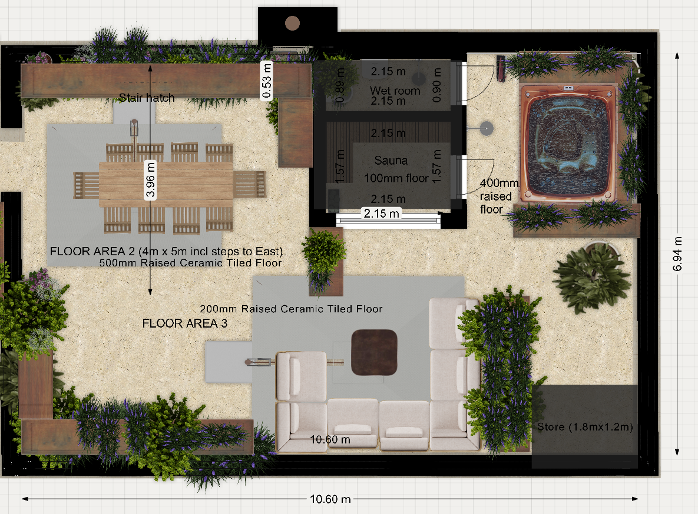

# Roof Terrace — Specification

> ⚠️ **IMPORTANT — please read first**
>
> This is **Chris's informal working document** for communicating his current best understanding of the project details with **Ronan Bond**. It is **not** a finished specification. It will contain inaccuracies, gaps, and assumptions that need to be checked. **Ronan's formal documents will be the authoritative source** — this document exists to feed into them.

## Brief for Surveyor

This is our draft of what we'd like to build on the roof terrace at 22 Sussex Square. It covers the sauna and wet room building, the hot tub, the surrounding terrace works (railings, parapets, parasols, fall protection, tiling, and planters). We've worked through it ourselves and there will be things we've got wrong, missed, or need your steer on. Where we're confident is the look and feel and the equipment we want; where we'd really value your input is on regs, structure, and any practical issues we haven't spotted.

The building shell (external walls, roof, weatherproofing) of the sauna/wet room structure is in your scope. This document covers the fit-out of those two rooms, the external openings (doors, windows), and all the terrace-wide works listed below.

**Orientation:** north is to the right of the floor plan drawing.

## Drawings

**Overall plan** (full terrace, including narrow section / FLOOR AREA 1 with lift bulkhead and stair hatch — latest revision **31 May 2026** with redesigned layout):


**Main section close-up** (FLOOR AREAS 2, 3, 4 — dining, lounge, sauna / wet room building, hot tub — 31 May 2026 revision):



## Contents

- [Part A — Sauna](#part-a--sauna)
- [Part B — Wet Room](#part-b--wet-room)
- [Part C — Smart Control (Home Assistant)](#part-c--smart-control-home-assistant)
- [Part D — Hot Tub](#part-d--hot-tub)
- [Part E — Railings](#part-e--railings)
- [Part F — Parapet Bird Deterrent (Post and Wire)](#part-f--parapet-bird-deterrent-post-and-wire)
- [Part G — Parasols](#part-g--parasols)
- [Part H — Fall Protection (Glass Balustrades & Planters)](#part-h--fall-protection-glass-balustrades--planters)
- [Part I — Terrace Tiling System](#part-i--terrace-tiling-system)
- [Part J — Planters](#part-j--planters)
- [Part K — Outdoor Tap](#part-k--outdoor-tap)
- [Part L — Existing and New Outdoor Sockets](#part-l--existing-and-new-outdoor-sockets)
- [Part M — Roof Build-up & Structure (Asphalt, Insulation, Joists)](#part-m--roof-build-up--structure-asphalt-insulation-joists)
- [Part N — Planting Palette & Biodiversity](#part-n--planting-palette--biodiversity)
- [Part O — Storage Units](#part-o--storage-units)
- [Part P — Outdoor Kitchen](#part-p--outdoor-kitchen)

---

# PART A — SAUNA

**Internal dimensions:** 1.57m (east–west) × 2.15m (north–south)
**Minimum internal ceiling height:** 2.15m (same as wet room — single internal ceiling height across the whole building)

> **Binding constraints from pre-application (PRE2025/00255):**
> - **Setback ≥ 3m from north parapet edge** — conceded in revised submission to planning (was originally 600mm; revised to match heritage officer's 3-4m ask)
> - **Maximum external height 900mm above parapet** — conceded in revised submission (was originally 600mm)
> All Part A design assumptions must respect these limits.

## Floor

- Tanked (continuous with adjacent wet room), screeded to fall, R11 porcelain tile to match the rest of the terrace
- Removable softwood duckboards laid on top of the tile (flat-pack kit, e.g. Finnmark, ~£80–150)
- Stainless steel high-temperature drain connected to the terrace drainage

## Walls and Ceiling

This is a working assumption — final makeup to follow your steer (see "What we'd value your steer on" below).

- **Insulation:** 75–100mm PIR (e.g. Celotex/Kingspan) in stud cavity, preferred over mineral wool for better thermal performance per mm of wall thickness — we're targeting the minimum viable external wall thickness (see footprint discussion below)
- **Foil vapour barrier** on the interior face of the insulation, fully taped, continuous around all junctions (especially the partition–external-wall corner)
- **25mm ventilated batten cavity** between the foil VB and the internal lining, to let the timber breathe between sessions
- **Internal lining:** untreated kiln-dried softwood tongue-and-groove — cedar, aspen, thermo-aspen, or spruce; final choice to follow the kit supplier's recommendation if kit-route is taken (see below)
- All fixings stainless steel
- **Internal partition (sauna ↔ wet room)** to be substantially slimmer than the external walls — see footprint discussion below

## Benches

L-shape wraparound, two-tier on both walls, all in the same untreated whitewood/spruce:

| Position | Height (FFL) | Depth | Length |
|---|---|---|---|
| Upper bench, west wall | 950mm | 550mm | 2.15m |
| Lower bench/step, west wall | 450mm | 350mm | 2.15m |
| Upper bench, south wall | 950mm | 550mm | 1.57m (less heater clearance) |
| Lower bench/step, south wall | 450mm | 350mm | 1.57m (less heater clearance) |

The upper bench wraps around the corner so two people can lie at right angles. The south-east end of the south wall benches (nearest the heater in the SE corner) needs to be cut back by approximately **250–300mm** to maintain clearance from the Harvia Cilindro PC90E heater body (360mm wide × 340mm deep) and its guard rail. Final dimensions to be confirmed against the manufacturer's installation manual.

## Door

- North wall, 600mm clear opening
- Pre-made outdoor sauna door, solid cedar, weatherproof frame and threshold — suppliers worth considering include **Finnmark Sauna** (UK), **Auroom** (Estonia/UK), **Tylö Helo** (Sweden), **Harvia** (Finland). Final choice likely tied to the kit-vs-site-built decision (see "What we'd value your steer on"), since door + interior typically come from one supplier.
- Solid timber, no glazing
- Magnetic catch, 50N+ pull force (we want it wind-resistant); wooden handles
- Outward-opening, with restrictor chain to limit swing in wind
- Approximate cost: £250–450

## Window

- East wall, positioned toward the **north end** of the wall (view to the NE)
- **1200mm wide × 800mm tall**, single pane, top-hung (awning) opening — outward, hinged at top
- Sill at 1100mm from FFL
- **Frame:** cedar or other heat-tolerant softwood on the interior face; external face can be aluminium-clad if needed for weatherproofing — **NOT aluminium internally** (would burn skin at sauna interior temperature)
- Triple-glazed (4-12-4-12-4), argon-filled, low-E coatings **rated for sauna interior temperatures**, warm edge spacers — chosen for thermal retention given rooftop exposure
- Compression seals: EPDM or silicone (heat/humidity tolerant)
- Restrictor stay to limit opening in wind
- External manual roller blackout blind on exterior above (sized to cover full 1200mm width)
- **To be specified in coordination with the kit supplier if kit-route is taken** — sauna-rated window assemblies are typically supplied or specified by the sauna specialist, not a domestic window supplier

## Heater

- **Harvia Cilindro PC90E** — 9.0 kW, 240V single-phase electric sauna heater, ~90 kg stone capacity, cylindrical floor-standing column positioned in the south-east corner
- Large stone mass for sustained, authentic löyly. Stones loaded loosely around a central heating column.
- Physical: ~1150mm tall × 360mm wide × 340mm deep, plus guard rail clearance of ~100–150mm around it
- Approximate UK price £1,100–1,400 (heater only; stones usually included)
- 25–35 min heat-up time to 90°C; managed via Home Assistant scheduling (Part C — Shelly Plus 1PM + 40A contactor)
- **Heat shield panel** above the heater is recommended given the radiant output of the 9 kW column heater
- 10mm² silicon-rated cable to a fused spur in the corner (cable rated comfortably above the 37.5 A continuous draw)
- Heater guard rail (usually supplied with unit)
- **Note:** previous spec assumed a Harvia Vega 4 kW — undersized for this volume and small stone mass = poor löyly. Superseded.
- **Sourcing note:** The PC90E is the 240V single-phase factory variant of the Cilindro PC90 line. Most UK retailers stock the standard PC90 (400V 3-phase); UK sauna suppliers should be able to source the PC90E directly, or alternatively wire a standard PC90 for 230V single-phase per the Harvia installation manual.

### Electrical assumption (to be verified)

This section assumes:
- **Single-phase 240V supply** to the flat (the standard for UK residential — but to be confirmed by electrical survey of 22 Sussex Square)
- **40A circuit** can be accommodated in the consumer unit (37.5 A continuous heater draw sits comfortably within a 40 A breaker rating)
- Three-phase supply, if available, would open up the higher-output Cilindro PC110 (10.8 kW, 3-phase only) — but we are not relying on this

**To check with electrician at first opportunity:**
1. Confirm single-phase 240V supply (vs three-phase) at 22 Sussex Square
2. Confirm a dedicated 40A circuit can be added to the consumer unit, or whether the consumer unit needs upgrading first
3. Confirm the sauna supplier can source the PC90E specifically, or wire a standard PC90 for 230V single-phase per Harvia's installation manual

## Ventilation

Passive only:
- 100mm inlet vent low on south or east wall, ~100mm from floor (near heater)
- 100mm outlet vent high on west or south wall, ~300mm from ceiling

## Lighting

- **2× sauna-rated LED ceiling fittings** (e.g. Cariitti, Tylö, Harvia) — purpose-made for sauna heat, ~£80–150 each
- Light switch outdoors on the terrace, beside the sauna door — IP55+ weatherproof

## Sockets (For Future Office / Bedroom Conversion)

We want this room to be convertible to an office or bedroom in future without retrofitting power, so:

- 2× IP54 double sockets at 300mm from FFL
- Socket 1: east wall, under the window at the north end (for a desk facing the view)
- Socket 2: north wall (general / bedside use)
- Dedicated 20A radial circuit
- Both sockets clear of the south-east heater corner
- Used only when the room is cold

## External Switches / Isolators (Sauna Side)

Grouped on the terrace wall beside the sauna door, IP55+ weatherproof:
- Sauna light switch (Shelly Plus 1 behind)
- 40A DP rotary isolator for the sauna heater (manual override / safety isolation) — sized for up to ~9kW single-phase heater (see Heater section)

## What we'd value your steer on

### Kit-supplied sauna interior vs site-built

We haven't decided whether the sauna interior — internal cedar T&G lining, foil vapour barrier, vented batten cavity, benches, heater installation, glass door, controls, sauna lighting — should be **site-built** by your team, or supplied as a **cut-to-size indoor sauna kit** from a sauna specialist who would install the interior into the shell you've built.

**Argument for kit:**
- Sauna-specific details (vapour barrier continuity, vented gap behind cedar, heater clearances, drain penetrations) handled by people who do this for a living, warranty-backed
- Frees your scope to focus on the shell, which is standard outbuilding work
- Door comes from the same supplier, coordinated finish

**Argument for site-built:**
- Slightly lower total cost if it all goes well
- Total control over internal finish details (bench layout, timber choice, reclaimed materials, etc.)

**Suppliers worth contacting against our internal dimensions:**

- **Finnmark Sauna** — UK (Leeds); cut-to-size indoor kits, outdoor doors, components, heaters
- **Auroom** — Estonia with UK distribution; premium modern aesthetic, custom indoor kits
- **Tylö Helo** — Sweden; established broad-range supplier, kits and components
- **Harvia** — Finland; large industry presence, full kits and heaters

We'd value your view on which route makes sense, and which supplier(s) you've worked with before or would recommend approaching. If kit-route is taken, the chosen supplier feeds back wall makeup, vapour barrier, electrical, drainage and ventilation requirements for the shell.

### Targeting minimum external building footprint

We'd like the **external** length and width of the sauna/wet room building kept as small as possible, to leave maximum surrounding terrace space. We accept this trades against insulation performance and weatherproofing robustness, and we'd value your steer on where the sensible limit sits.

**External walls** — thinnest viable makeup that retains good sauna thermal performance (we're aiming for U-value ≤ ~0.27 W/m²K) and is appropriate for coastal/exposed roof terrace conditions:

- Can we use 75 mm or 100 mm PIR in the stud cavity rather than mineral wool, to get better thermal performance per mm of thickness?
- Is a rigid 25 mm ventilated rain-screen cavity essential, or can a back-ventilated cladding detail direct to sheathing save thickness on this coastal site?
- What is the thinnest external wall makeup you'd be comfortable specifying for this exposure?

**Internal partition (sauna ↔ wet room)** — we're much less worried about wet-room warmth than sauna heat loss. In fact some heat leak into the wet room is welcome (pre-warms it for post-sauna showering). So the partition can be substantially slimmer than the external walls — perhaps 50 mm stud with mineral wool, no external weatherproofing layers. Would you agree, and is there anything (structural bracing, fire separation, regs) that requires it to be heavier?

**Vapour barrier continuity at the partition–external wall junction** — however the partition is built, the foil VB on the sauna face needs to be continuous around the corner with the external-wall VB. Any gap there is where moisture finds its way into the insulation long-term. We'd value your detailing on that junction.

### External cladding (whole building)

**Working choice: PVDF-coated marine-grade aluminium standing seam** (e.g. Kalzip, Riverclack, PREFA), in anthracite/charcoal — target RAL 7016 / 7022 / 7024. Applies to all four external walls of the combined sauna/wet room building.

**Why aluminium standing seam over the alternatives we looked at:**

- **Zinc and copper** (the other common standing-seam metals): seagull droppings are acidic (uric acid, pH ~3–4) and permanently etch the patina on both, leaving accumulating white or green halo marks. PVDF-coated aluminium is chemically inert to uric acid — droppings wash off in the rain with no ghost marking.
- **Equitone Tectiva fibre cement panels**: strong runner-up — similar coastal performance, ~£500–800 cheaper for our ~28 m² of cladding. Loses on continuous-skin aesthetic, build-up depth (~40mm vs ~30mm), and warranty length. Sensible fallback if metal is rejected.
- **Timber (cedar / Accoya / charred Accoya)**: planning preferred a longer-life finish than wood. Even charred Accoya — the best engineered-wood option we found — needs re-oiling every 8–10 years and ages less predictably than coated aluminium.

**Specification points that determine whether the system lasts 40 years or pits in 5:**

- **Marine-grade alloy** — aluminium 3003-H44, 3105-H44 or 5005. Mill-finish or anodised-only aluminium pits in salt aerosol; the alloy series matters here.
- **PVDF (Kynar 500 / Hylar 5000) factory coating** at minimum 25μm dry-film thickness. PVDF is UV-stable, hydrophobic, and salt-spray-resistant — documented on UK coastal commercial projects with 30+ year service records.
- **A4 / 316 stainless steel fasteners and clips only.** A2/304 stainless pits in marine atmosphere within a couple of years; galvanised steel sets up galvanic corrosion against the aluminium and rots the panels from behind.

Systems considered, all of which publish coastal warranties at marine specification: **Kalzip** (UK default), **Riverclack** (Italian, well-proven coastal), **PREFA** (Austrian, broad colour range), **VMZINC Pigmento Aluminium**.

**Build-up impact:** ~30mm total (panel ~1mm + ventilated batten cavity ~25mm + clips). No change to our 75–100mm PIR + foil VB insulation plan — cladding is a rainscreen only.

**What we'd value your steer on:**

- Acceptance of standing-seam aesthetic in the Kemp Town Conservation Area. Anthracite/charcoal is our target tone — discreet, recessive against the cream Regency stucco context, and hides gull marks best. If planning push back on metal, our fallback is Equitone Tectiva in mid-grey (TE20/TE30).
- Preferred system manufacturer from the four shortlisted above.
- Roof-to-wall transition — wrap continuously in one material, or break with a different roof system?
- Detailing of parapet, window reveal and door reveal terminations.

### Roof of the sauna/wet room building

**Working preference (subject to your visibility analysis):** **south-high mono-pitch at 15–20°**, in **continuous PVDF anthracite aluminium standing seam wrapping over from the wall cladding** so the building reads as a single skin.

**Why this shape — the logic that produced it:**

Two competing concerns drove the geometry. Setting them out so you can challenge the reasoning where appropriate.

**1. Gulls.** The sauna/wet room building is the highest object on the terrace. A flat or near-flat roof at the highest point would become prime gull real estate — directly above the people using the terrace, and rising above the parapet bird wire (Part F), which we'd otherwise be undermining. Once gulls habituate to a rooftop they return every year and defend it. The conventional pitch threshold above which gulls can't comfortably stand or nest is **~15°; 20°+ is bulletproof**. At 15° or steeper, no visible bird deterrents (wire grids, spikes, gel discs) are needed on the roof surface.

**2. Visibility from Bristol Gardens AND from within the terrace.** The heritage officer's pre-app condition is to minimise visibility from Bristol Gardens (we've already conceded a 3m setback from the north parapet and a 900mm maximum height above parapet). The **+500mm raised dining patio south of the building** also looks toward the sauna at a slight upward angle — any visible bird-deterrent clutter on the roof would read straight from the dining seats.

**Why south-high specifically:**

Counter-intuitive geometry rule: a roof surface above the dining-viewer's eye level is hidden behind whichever fascia sits closest to them. A roof that slopes UP and TOWARDS the dining viewer is largely hidden behind its own south fascia. A roof that slopes UP and AWAY is on full display.

| Viewpoint | What's visible with a south-high pitch |
|---|---|
| **Raised dining patio (south)** | The high south fascia screens the roof surface from view — no surface clutter visible from the dining seats |
| **Bristol Gardens (direct north view)** | The low north edge — lower than a flat-top building of the same internal volume would be |
| **Bristol Gardens (north-west diagonal)** | The pitch side-on, falling away from the viewer |
| **Bristol Gardens (south-west diagonal)** | The high south fascia angled away from the viewer; the pitch slope drops toward the viewer's line of sight |
| **East (away from all public views)** | The pitch side-on |

**Pitch tradeoff to be aware of:** across the building's ~2.45m N-S depth, 15° gives a 656mm rise and 20° gives 892mm rise. With a flat-top building already pushing the 900mm-above-parapet envelope, the south edge of a pitched roof will sit *above* 900mm at the highest point. The trade we'd be making: south edge higher (but hidden), north edge lower (and visible to Bristol Gardens). The argument to planning: **the visible edges are all lower than a flat-top equivalent; the high south edge is screened by its own geometry from every relevant viewpoint.**

**Working build-up assumption:**

| Layer (top to bottom) | Spec |
|---|---|
| PVDF anthracite aluminium standing seam | Continuous with wall cladding |
| UV-stable breather membrane | Tyvek UV Façade or Solitex Fronta WA |
| Counter-battens / sub-frame | A4 / 316 stainless clips |
| 100–150mm PIR between rafters | Thicker than the 75-100mm wall PIR (heat rises) — Ronan to detail the **wall-to-roof PIR transition** so the foil VB stays continuous through the junction |
| Structural OSB or marine ply deck | 18mm |
| Internal ceiling lining | **Sauna:** cedar T&G (heat-tolerant softwood, standard sauna spec). **Wet room:** **Aquapanel (or equivalent moisture-resistant cement-board) + bathroom-grade paint** — sleek, paintable in any colour (suggest warm white or matt anthracite to echo external cladding), fully waterproof, ~£40-60/m² fitted |

**Drainage:** small gutter along the low (north) edge discharging onto the warm-roof tile field, which then drains to the existing roof outlets. No new outlets required.

**Fallback if the pitched option isn't viable** (e.g. visibility splay shows the south edge can't be argued, or the height envelope can't accommodate it after Ronan's real build-up depth is known):

A **near-flat roof (3–5° drainage fall to north)** in the same standing-seam material, with an **integrated stainless post-and-wire bird grid** across the surface (matching the Part F parapet system). Lower profile from all directions, but the wire grid would be visible from the raised dining patio, and gulls habituate harder to flat surfaces — so this is a "last resort" if the height envelope rules out the pitched option.

**What we'd value your steer on:**

- **Visibility splays from realistic vantage points on Bristol Gardens** — drawn lines showing what's actually visible above parapet with the building at its current size, so we can judge whether the south edge of a pitched roof can be argued or whether the height-envelope is strict
- **Real warm-roof build-up depth** — if a slimmer build-up (e.g. ~180mm vs the 250mm we've assumed) is possible, that's headroom we can spend on pitch
- **Real parapet height above the new tile FFL** — drives the whole envelope calculation
- Roof-to-wall transition — continuous standing-seam wrap, or break at a discrete fascia line?
- Whether you'd recommend a different roof material that's even thinner / lower-mass than warm-roof + standing seam, to claw back more headroom

---

# PART B — WET ROOM

**Internal dimensions:** 2.15m (north–south) × 0.9m (east–west)
**Minimum internal ceiling height:** 2.15m (same as sauna — single internal ceiling height across the whole building)

> **Change from pre-application — note for planning:** The pre-app drawings showed a **sauna + storage** combined building. Storage has been **redistributed across four lower units along the parapet lines** (see Part O), where it sits below the parapet height and is essentially hidden from the streetscene. This freed up the internal volume to accommodate a **wet room (with WC)** as an addition. **The building's external footprint is unchanged from pre-app** — same shape, same setbacks, same height envelope — and the planning officer's preferred form is preserved. The wet room is purely an internal subdivision of space planning already accepted in principle.

## Layout

```
SOUTH                                            NORTH (door)

                  TOP/WEST WALL (2.15m)
        ┌──────────┬──────┬═════════╤═════════┐
        │          │      ║         │         │
        │  TOILET  │ SINK ║ ELECTRIC│ BUCKET  │
        │ on south │ on   ║ SHOWER  │ SHOWER  │
        │   wall   │ west ║ on west │ on west │ ← DOOR
        │          │ wall ║ wall    │ wall    │
        │          │      ║         │         │
        └──────────┴──────┴═════════╧═════════┘
                          ↑
                  ║ Linear drain runs east-west
                  ║ across the full 0.9m floor width,
                  ║ positioned 1050mm in from the
                  ║ north (door) wall

        BOTTOM/EAST WALL (clear standing space)

        ←─── DRY ZONE ───→  ←── WET ZONE ──→
              (~1.1m)             (~1.05m)
```

The whole floor is one tanked wet zone — no shower trays, no enclosures, no glass screens.

**Drain position (the key dimension):** linear drain across the full 0.9m room width, located **1050mm from the north (door) wall**. The floor falls 1:80 from both directions toward the drain — wet zone slopes south, dry zone slopes north.

## Floor

- Liquid tanking continuous with sauna, walls tanked to 1800mm minimum (full height in wet zone)
- Sand/cement screed to falls (1:80) toward the linear drain
- Stainless steel linear drain as above
- R11 porcelain floor tile, epoxy grout

## Walls

- Cement-board substrate (Hardiebacker, Aquapanel) on stud
- Porcelain wall tile to ceiling, epoxy grout
- Silicone to all internal corners and around fittings

## Toilet

- Standard wall-hung WC, ~520–560mm projection (e.g. Roca The Gap, Vitra S20, Geberit iCon)
- Centred on south wall
- Concealed cistern in stud framing behind

## Sink

- Wall-hung basin, approx 450mm wide × 350mm projection
- Single cold tap (no hot water in this room)
- Top/west wall, immediately north of the toilet

## Electric Shower

- 10.5kW unit (e.g. Mira Sport Max, Triton T90SR, Aqualisa Quartz Electric)
- Top/west wall, north end of wet zone
- Cold supply only
- Dedicated 10mm² circuit, 45A RCBO
- Ceiling pull-cord isolator within the room, away from the spray zone

## External Cold Shower (North Exterior Wall)

Replaces the previously-planned internal Finnish-style cold bucket shower. The bucket shower was dropped because its water would warm up to ambient over time inside the wet room — defeating the point of a post-sauna cold plunge. An external shower on the north (hot-tub-facing) exterior wall of the building draws fresh mains-cold water on demand, stays genuinely cold, and creates a natural circulation path: **sauna → step out onto terrace → cold rinse under the external shower → into the hot tub.**

- **Position:** mounted on the **north exterior wall** of the sauna/wet room building, ~2m above terrace tile FFL, accessible from the hot tub zone
- **Shower head:** **simple large fixed rainfall-style stainless head** (~250-300mm Ø) — no flexible hose, no diverter. Plain, robust, marine-grade brass or 316 stainless body.
- **Tap:** **single cold lever tap**, surface-mounted brass/stainless, simple quarter-turn or full-turn ceramic-disc cartridge. No mixer (cold-only). Sample: Hansgrohe Croma E or simpler outdoor brass garden-shower lever.
- **Supply:** tee off the existing terrace cold supply (same as Part K outdoor tap and Part P kitchen sink). Copper, no plastic on exposed runs.
- **Frost protection:** internal isolation valve and drain-down point so the external run can be drained for winter — consistent with Part K
- **Drainage:** water falls onto the terrace tiles and drains via the existing tile pedestal void to the existing roof falls. No new drain or gully required. (The tiles slope correctly per Part I.)
- **Privacy:** the shower is in an open position visible from the hot tub area only — no screening needed (it's a quick rinse, not a full body wash). If privacy is wanted later, a slim freestanding hardwood screen could be added without changing the plumbing.

## Plumbing Summary

- **Cold water only** — taken from existing terrace supply at south wall
- Cold runs to: toilet cistern (south wall), sink tap (south end of west wall), then along west wall to the electric shower at north end. Separate tee off the terrace supply feeds the **external cold shower** on the north exterior wall.
- Toilet waste: 110mm soil pipe south to existing soil stack
- Sink waste: bottle trap, connected to terrace drainage
- Linear drain: 50mm waste south to terrace drainage
- External shower drainage: free-falls onto the terrace tile field; drains via pedestal void to the existing roof falls

## Door

- North wall, 762mm leaf
- Pre-made external cedar door — same supplier as the sauna door, so they match in appearance
- Weatherproof frame, threshold, compression seals
- Outward-opening (the current drawing shows inward — please amend)
- Restrictor chain
- Approximate cost: £350–600

## Ventilation

- Inline duct extractor fan in ceiling void, ducted out through nearest external wall
- 15 L/s minimum, IP44 minimum
- Humidity sensor + overrun timer
- E.g. Vent-Axia ACM Inline, Manrose CF200T (~£50–80)

## Lighting

- 3× IP65 LED downlights in ceiling, warm white (3000K)
- Light switch outdoors on the terrace, beside the wet room door — IP55+ weatherproof

## External Switches / Isolators (Wet Room Side)

Grouped on the terrace wall beside the wet room door, IP55+ weatherproof:
- Wet room light switch (Shelly Plus 1 behind)
- 3-pole fan isolator (for the extractor fan)
- 45A DP isolator for the electric shower (in addition to the internal pull-cord)

## External Socket (Terrace)

- 1× IP66 weatherproof double 13A socket on the building's external north wall, east end
- Mounted at ~450mm FFL
- Dedicated 20A radial circuit, RCD protected
- Integral switches; lockable cover optional

---

# PART C — SMART CONTROL (HOME ASSISTANT)

We run Home Assistant at home and want to control the switched circuits in the sauna and wet room via Shelly relays. This is the part most likely to be unfamiliar — flagging up front so you and the electrician can factor it in.

| Circuit | Shelly | Notes |
|---|---|---|
| Sauna heater (~37.5A continuous) | Plus 1PM + **40A contactor** | Shelly switches the contactor coil, contactor switches the heater. The 1PM gives us power monitoring in HA. 40A sized for the Harvia Cilindro PC90E 9 kW single-phase heater specified in Part A. |
| Sauna light | Plus 1 | Behind the switch outside the sauna |
| Wet room light | Plus 1 | Behind the switch outside the wet room |
| Wet room fan | Plus 1 | Behind the fan isolator |
| Electric shower | None | Standard pull-cord isolator only |

What this needs from the install:
- Shellys located in dry, cool, accessible places with 2.4GHz WiFi coverage (we'll confirm coverage)
- Live and neutral at the back of every switch position (worth flagging early to the electrician)
- A small DIN-rail enclosure for the heater contactor + Shelly somewhere outside the two rooms

---

# PART D — HOT TUB

We're planning to site a hot tub on the terrace alongside the sauna/wet room building. Including this here because the **structural loading on the terrace deck is the critical question for you**, and the model choice drives weight, footprint, and electrical supply. Final model TBC; shortlist below in our preferred order.

> **Awaiting structural engineer.** We're waiting on our SE for: (1) whether any of the shortlisted tubs will work with the **current roof make-up** as it stands, (2) calculations on **doubled-up beams** in the NW quadrant (see Part M), and (3) on that basis, whether he would **steer us toward one tub over another** based on what the structure can carry. Final tub choice will follow that advice.

## Footprint envelope (locked-in 31 May 2026)

**Maximum hot tub envelope: 170cm wide × 210cm long** (W × L on the drawing — the long axis runs north-south on the terrace).

The previously-considered shortlist has been **filtered to this envelope** below; tubs that don't fit are removed. Final tub still TBC pending SE sign-off on load — but the choice will be made from within this envelope only.

## Shortlist (filtered to ≤170 × 210cm envelope)

| # | Model | Origin | Shape | Dimensions | Filled (kg) | kg/m² | Price |
|---|---|---|---|---|---|---|---|
| 1 | [Fisher 3](https://fisherspas.com/) | NZ designed (Vortex) | Rectangular | 207 × 153 × 82cm | 1,121 | 354 | £3,500–5,500 |

**Marginal — 3cm over envelope on length, otherwise fits:**

| # | Model | Origin | Shape | Dimensions | Filled (kg) | kg/m² | Price |
|---|---|---|---|---|---|---|---|
| (M) | [Pre-owned Marquis Spirit](https://www.hunsburyhottubs.co.uk/hot-tubs/pre-owned/) | USA (Oregon) | Rectangular | 213 × 165 × 91cm | 1,280 | 365 | £3,500–5,500 |

**Removed (don't fit 170 × 210cm envelope):**
- RotoSpa Orbis (183cm dia round — too wide)
- RotoSpa QuatroSpa (200cm dia round — too wide)
- Pre-owned Hot Spring Hot Spot (213 × 213cm — too big both dims)
- Pre-owned Jacuzzi J-200 (213 × 213cm — too big both dims)
- H2O 2000 Series (210 × 180cm — 10cm over on width)
- Sunbeach SB355L (225 × 180cm — over on both dims)

**Next:** the shortlist has narrowed to one (or two with the marginal Marquis). Chris to either confirm Fisher 3 as the chosen tub, or research additional rectangular tubs in the 170 × 210cm envelope to broaden the field before deciding.

Filled weight is shell + water, no occupants. Three adults add **~240kg** to the static structural load (full body mass — displacement only reduces the bather's *immersed* weight, not the load on the terrace). Add ~10–15% for dynamic loading on top.

## Recommended suppliers

- **[RotoSpa](https://www.rotospa.co.uk/)** — direct from manufacturer for the Orbis / QuatroSpa
- **[Hunsbury Hot Tubs](https://www.hunsburyhottubs.co.uk/hot-tubs/pre-owned/)** (Northampton) — dedicated pre-owned premium specialist; Hot Spring, Jacuzzi, Marquis
- **[Happy Hot Tubs](https://www.happyhottubs.co.uk/shop-hot-tubs/pre-owned-off-display-hot-tubs)** (7 UK showrooms incl. Sussex) — wet-testing of pre-owned and ex-display
- **[My Hot Tub Mover](https://www.myhottubmover.co.uk/used-hot-tub-sales.html)** — UK-wide pre-owned, fully wet-tested
- **[H2O Hot Tubs](https://www.h2ohottubs.co.uk/)** (Nottingham) — for the H2O 2000 with strong UK warranty

## What we need from you on this

- Sign-off on **filled load** (with dynamic allowance) for the heaviest realistic option (~1,500kg) on the terrace deck
- Steer on whether to design for the lightest option (RotoSpa Orbis ~950kg) or build in headroom for any option on the list
- Crane access vs hand-carry: the RotoSpas can be carried up by two people; acrylic options likely need a crane
- Drainage: tub will need emptying 2–3× per year — best route to terrace drainage

---

# PART E — RAILINGS

The narrow section of the roof terrace currently has three sets of railings. We want to simplify and reclad them.

## Changes

- **Remove:** the centre railing, and the short railing joining the centre railing to the west railing
- **Keep:** the east railing and the west railing

## Cladding and height

Both remaining railings to be:
- Clad in timber on the inboard face up to **1100mm above FFL** (taller than the current railings — meets Approved Doc K guarding height for a roof terrace)
- Timber: external-grade, e.g. Western Red Cedar or thermally modified ash/pine, to weather greyly without staining
- Stainless steel fixings throughout
- Detailing to allow water runoff (slight bottom gap, drainage at base)

## Bird deterrent

- Post and wire system running along the top of both clad railings
- Stainless steel posts at ~1m centres, 2–3 tensioned wires
- Posts ~150–200mm above the cladded top, so total visual height ~1300mm

## What we'd value your steer on

- **Wind loading** — cladding turns an open railing into a solid wind catch, materially changing the load on the existing posts/fixings. Are the existing railings adequate for this, or do they need reinforcement?
- **Removal of the centre / short railings** — confirm no structural role
- **Cladding fixing method** — best approach to attach timber to the existing railing structure without compromising weatherproofing

---

# PART F — PARAPET BIRD DETERRENT (POST AND WIRE)

The main parapet walls currently have bird spikes. They work but look bad. We want to replace them with a low-visibility post-and-wire system on the 450mm-wide precast concrete coping.

## 1. Scope

Supply and install a low-visibility stainless-steel post-and-wire system on the top face of a 450mm-wide precast concrete coping to deter pigeons and gulls.

## 2. Design intent

Gulls and pigeons need a clear, flat landing strip. On a wide (450mm) coping, a single row of wire is insufficient — birds simply land beside it. We deny the landing area by running **three parallel wires across the width**, all at the same height, so there is no usable perch anywhere on the 450mm top.

## 3. Layout (plan and section)

- **Wires:** 3 longitudinal runs, all at 85–90mm above coping
- **Lateral positions:**
  - Wire A: 30mm in from outer edge
  - Wire B: centre line of coping
  - Wire C: 30mm in from inner edge
- **Post spacing:** 1000–1200mm (consistent within a run)
- **Springs / tensioners:** at ~10m intervals and at line ends
- **Corners:** terminate and restart each wire at corners with corner posts (no sharp bends)
- **Clearances:** keep all fixings ≥25mm from coping edges/drips

## 4. Heights — what works best

- Pigeons: 70–100mm effective
- Gulls: 80–110mm effective
- **Chosen spec: 85–90mm** suits both species and looks neat

## 5. Materials (marine / coastal)

- All metalwork: **A4 / 316 or 316L stainless steel** (posts, wire, terminals, springs, screws, washers, ferrules)
- Wire: **1.2mm Ø 7×19 stainless cable** — chosen for coastal robustness, long-term fatigue resistance, and visual straightness; gives the best deterrent reliability over a 20+ year life
- Posts: turned stainless, 70–110mm stem height with swivel / tilting saddles (±10–15°) to allow posts to be plumb despite coping fall
- Base gaskets: neoprene or EPDM under base washers to protect the coping
- Anchors: stainless screws into mortar joints with resin/chemical anchors where required. **Do not drill waterproofing / membranes.**
- Dissimilar metals: isolate if any non-SS substrate/fastener is unavoidable

## 6. Fixing method (preserve fabric)

- Drill only mortar joints (perp or bed joints) between coping stones; **never the stone arris or roof build-up**
- If mortar joints are unsuitable at a location, use inner-face side-mount stand-offs into brick perp joints instead of top-mounting that stone
- Maintain minimum edge distances per anchor manufacturer data

## 7. Tension and tolerances (quality)

- **Tension:** light spring tension — enough to remove visible sag, no "banjo-tight" runs
- **Parallelism:** three wires parallel within ±2mm over any 2m length
- **Level:** top wire height 85–90mm above coping, tolerance ±3mm; posts plumb
- **Sag:** < 5mm mid-span over 3m in summer conditions
- **Finish:** no sharp burrs; trimmed ferrules; caps neat and aligned

## 8. Quantities (25m guide)

- Posts: at 1.1m centres ≈ 23 posts per run × 3 runs = **~69 posts** (+10% spares)
- Wire: ~80m total (75m + waste)
- Springs / tensioners: ~9–12 (one per end + ~every 10m per run)
- Terminals / ferrules / eyelets: as required for each end and spring

## 9. Visual / architectural requirements

- Minimal, discreet look — this is a deterrent, not a balustrade
- Keep post heads below sightline clutter; avoid reflective / glossy finishes (satin / brushed is ideal)
- Keep bases in line and centred on joints; no skewed bases

## 10. Acceptable systems / brands

Not brand-specific. Any proprietary bird post-and-wire system meeting this spec (A4/316 components; 1.0–1.2mm SS cable; swivel bases; springs; marine-grade anchors) is acceptable. Examples include mainstream UK bird-control suppliers' post-and-wire kits — contractor to propose and submit datasheets for approval.

---

# PART G — PARASOLS

We've used Morton Parasols before and want to use them again, or an equivalent commercial-grade alternative. Reference: [Morton Malaga commercial parasol](https://www.mortonparasols.com/commercial/malaga/).

## What we need

- **2× parasols**, freestanding, commercial / storm-resistant grade
  - 1× **3m × 3m** (square)
  - 1× **3m × 4.5m** (rectangular)
- Frame: anodised aluminium or powder-coated aluminium (marine-tolerant)
- Fabric: solution-dyed acrylic (e.g. Sunbrella or equivalent), Brighton coastal exposure

## Bases — key point for the surveyor

The heavy bases need to sit **under the porcelain tile finish**, not on top of it. So the deck build-up needs to accommodate the base.

Commercial parasol bases for this size are typically:
- 80–150kg cast / granite slab type, or
- Cassette-style steel frame filled with paving slabs on site

We'd like the **base plate(s) recessed into the deck build-up** so the tile finish runs continuously over the top, with only the mast emerging through a sealed sleeve / cup detail. The mast is removable so the cup can be capped flush when the parasol is taken down for winter.

## What we'd value your steer on

- **Recessed base detail** — the best way to set the base into the deck build-up without compromising the tanking, falls, or insulation. Likely a custom steel cassette set at screed level
- **Wind uplift loads** — a 3 × 4.5m parasol at full Brighton seafront wind exposure is a serious load. We need confidence the deck and base anchorage can take it, even with the parasol furled
- **Sleeve / cup detail** — how the mast passes through the tile surface, weather-sealed, and capped when removed
- Equivalent suppliers if you have a preferred specifier for commercial parasols

---

# PART H — FALL PROTECTION (GLASS BALUSTRADES & PLANTERS)

Two locations need fall protection to comply with Approved Doc K (1100mm above the standing level):

1. **Dining area (Floor Area 2)** — 1100mm above FFL along the relevant edge(s)
2. **Around the hot tub** — 1100mm above the **hot tub rim**, since BC will treat the rim as the standing level. The tub can't be positioned away from the edge, so this applies.

We've chosen frameless structural glass throughout for both locations — keeps the view, and minimises bulk from public viewpoints (conservation area).

## Glass spec

- Frameless toughened laminated glass (typ. 17.5mm or 21.5mm — engineer to confirm)
- Heights:
  - Dining area: top of glass at **1100mm FFL**
  - Hot tub area: top of glass at **1100mm above tub rim** (≈1900mm FFL depending on final tub choice)
- Designed to BS 6180 line loads + Brighton coastal wind loads (significant — seafront exposure)

## Planters (inside the glass)

- **500mm deep planters** running along the inside (terrace side) of the glass
- Planter top **300mm above hot tub rim** along the hot tub run
- Functions:
  - Visual / planting feature
  - Creates a 500mm physical setback between the hot tub and the glass — may help BC accept the guarding line (worth confirming with building control)
  - Adds visual interest at parapet level

## Mounting — top of parapet vs face of parapet

The key question: **does the glass channel sit on top of the parapet wall, or is it bolted to the inner face of the parapet?** This is primarily a wind-loading and waterproofing question.

| | Top-mounted (U-channel on coping) | Side-mounted (face-fix to inner face) |
|---|---|---|
| Load path | Direct moment + shear into parapet mass — generally more efficient | Cantilever moment pulls on parapet face — higher leverage on fixings |
| Waterproofing | Requires breaking through coping; careful detail needed | Existing coping/tanking undisturbed |
| Look from outside | Cleaner — glass appears to grow from wall | Glass sits behind/above coping line |
| Replacement / maintenance | Whole channel job | Individual clamps replaceable |

## What we'd value your steer on

- **Top-mount vs side-mount** — your view, given Brighton seafront wind exposure and the existing parapet construction. Likely needs SE input for wind-load calculations.
- **Glass thickness / spec** — to be sized by the supplier's engineer once the loading approach is agreed
- **Whether the 500mm planter setback** is acceptable to building control as part of the guarding strategy around the hot tub (could allow the glass to be slightly lower than the strict 1100mm-above-rim rule, though we're not banking on this)
- **Coping replacement** if top-mounted — whether the existing 450mm precast coping can take a channel cut, or needs replacing with a new coping detailed to integrate the channel and tanking

---

# PART I — TERRACE TILING SYSTEM

**Note on area:** previously specified at 120m². Final tiled area to be **recalculated to exclude the planter footprints** (see PART J) — planters sit on the Protectoboard at asphalt level, with the tile field butting up to their outer faces, so the planter footprints are not tiled. Builder to remeasure once planter positions are finalised on the drawings.

## Surface material

20mm porcelain pavers, R11 slip-rated minimum, frost-resistant. Italian or Spanish manufacture preferred for quality assurance. Large format preferred (600 × 600mm or larger). Finish to be mid-tone honed or textured — not polished, not white or very pale (glare and bird soiling). **Sandstone-coloured tones** (warm buff / honey / pale stone) to complement the anthracite cladding and Sussex Square's cream Regency stucco context, and to hide gull marks more forgivingly than grey.

**Hard rules:**
- 20mm thickness minimum
- R11 slip rating minimum
- No limestone or natural stone (bird uric acid etching risk)

**Supplier scope:** Porcelain Superstore, Paving Superstore, Tile Mountain, or equivalent trade supplier. Samples required before order confirmed. 10–15% overage to be ordered and surplus retained in the client's garage at Sussex Square for future repairs (not stored on the roof terrace).

## Pedestal system

Adjustable pedestal system with self-levelling head and integrated rubber acoustic / isolation pads. Must accommodate installation over Protectoboard on asphalt membrane without acoustic underlay mat (Protectoboard provides base decoupling; mat layer not appropriate on this substrate).

**Hard rules:**
- Padded head pedestals only — no unpadded basic systems
- Self-levelling head strongly preferred
- Pedestal base wide enough to distribute load over Protectoboard without point-loading damage

**Preferred systems:** Buzon DPH with rubber shims, or Eterno Ivica SE range. Either acceptable. Builder may source either subject to confirming spec compliance.

## Acoustic isolation — zoned by sensitivity of space below

We want acoustic isolation specced proportionally to what's underneath each part of the terrace, rather than uniform across the whole 120m². Three zones:

| Zone | What's below | Pedestal spec |
|---|---|---|
| **Main (large) section** | Habitable rooms (bedrooms / living) | **Double-isolated** — padded head + padded base (e.g. Buzon BC-PH range + base pad accessory, or Eterno Ivica AntiNoise / SE with PVC base pad) |
| **Narrow section** | Less acoustically sensitive | **Padded head only** (standard SE / DPH spec) |
| **Around the lift bulkhead** | Lift shaft (no occupants below) | **Basic pedestals** — no acoustic premium needed |

Both Buzon and Eterno Ivica offer base pads as a standard accessory; the cost premium for double-isolation is small (typically £1–3 per pedestal over head-only).

**Sanity check we'd value your steer on:** we've assumed the narrow section is over less sensitive space (utility, plant, or non-bedroom rooms). If it's actually over a habitable room, the acoustic spec for that section should be upgraded to match the main section.

## Drainage — open joints

Open joints throughout, as dictated by the pedestal head's spacer tabs (typically 3–5mm). Water drains freely through the joints into the void below and away across the asphalt falls to the existing drainage.

## Coordination — clearances and thresholds

The finished tile level needs to coordinate with:
- **Sauna and wet room door thresholds** — pedestal + tile build-up is typically 60–150mm above the asphalt depending on falls
- **Hot tub base** — recessed under-tile base detail (see PART D)
- **Parasol bases** — recessed under-tile cassettes (see PART G)
- **Linear drain in wet room** — continuity of tanking and falls
- **Lift bulkhead** — tiling must clear the bulkhead and not bridge or trap services
- **Emergency staircase access** — full unobstructed access to the stair head must be maintained at all times

## What builders have scope on

- Choice of Buzon vs Eterno Ivica (or equivalent quality tier), provided rubber pad and self-levelling spec is met
- Specific porcelain range and supplier, provided colour, tone, format, slip rating, and thickness rules are met
- Pedestal height selection based on actual survey levels
- Open joint width within the normal range for pedestal-laid 20mm pavers

## What is fixed

- 20mm porcelain only (not natural stone, not composite decking)
- R11 slip rating minimum
- Padded self-levelling pedestals
- No adhesive bed — pedestal / floating system only
- Open joints between tiles
- Overage tiles retained in the client's garage at Sussex Square (not on the roof terrace)

## What we'd value your steer on

- **Structural sign-off** for 120m² of 20mm porcelain + pedestals + furniture / occupancy load. Usually fine but worth on record before contractors price it
- **Total build-up height** at the highest and lowest points of the falls — needed to confirm sauna / wet room door threshold heights and the hot tub / parasol base recess depths
- **Edge detail** at the parapet / planter / glass balustrade interfaces — how the tile field terminates cleanly without a visible pedestal edge

---

# PART J — PLANTERS

We want planters built from the **salvaged hardwood decking** removed from the existing terrace. Locations and footprints per the drawings.

**Planter layout** is per the 31 May 2026 floorplan revision, which has been redesigned in part to **maximise wind defence** along the north and east parapets. The planting scheme — including the **8 olive trees** echoing the established Sussex Square / Kemp Town Enclosures planting — and the windbreak layering is set out in Part N. See the in-progress "Windbreak planting study" subsection within Part N for zone-by-zone plant choices.

> **For the planting palette, planted-area summary and biodiversity case, see [PART N — PLANTING PALETTE & BIODIVERSITY](#part-n--planting-palette--biodiversity) at the end of this document.**

## Construction principle

- Planters sit **on top of the Protectoboard**, at asphalt level (i.e. below the tile finish)
- Tile field butts up to the outside face of each planter
- Planters are **freestanding boxes** — they do not rely on the parapet or any other wall for structural or weatherproofing function
- Built with stainless steel fixings throughout

## Sizes (outside measurements)

| Location | Total occupied depth (incl. air gap) | Height (above terrace tile FFL) |
|---|---|---|
| General planters | 600mm — sized to align exactly with one 600mm tile width | 600mm |
| **North side of hot tub** (between hot tub and north parapet) | **300mm** (revised 31 May 2026) | finishes **300mm above the hot tub rim** |
| East / south sides of hot tub | 500mm | finishes **300mm above the hot tub rim** |

The general planters' total footprint (planter + air gap to wall behind) is **600mm**, so the planter occupies exactly the depth of one porcelain tile. The planter box itself is **570mm deep** externally, with a **30mm air gap** to the wall behind for ventilation and inspection access.

Because the planter base sits at Protectoboard level (below the tile FFL by the depth of the tile/pedestal build-up — typically 60–150mm), each planter is constructed taller than its visible height by that amount.

## Preventing leaching into walls behind

This is the key risk where planters sit against the parapet or building wall. Two-part approach:

1. **Freestanding back panel** — every planter has its own timber back wall (built integrally), so the planter contains itself. The parapet/building wall is never the back of the planter.
2. **Air gap** — **30mm** between the planter's back panel and the wall behind, to allow ventilation and a clear visual inspection route.

Result: any water that escapes the planter falls onto the Protectoboard / tile void and drains to the existing roof falls — never into a wall.

## Lining (plant health + planter longevity)

| Layer (inside-out) | Spec | Purpose |
|---|---|---|
| Topsoil / planting medium | Loam-based, free-draining (mixed with grit / perlite) | Avoid garden topsoil — compacts and waterlogs |
| Geotextile membrane | Non-woven, root-permeable | Stops fines washing into drainage layer |
| Drainage layer | 75–100mm expanded clay (LECA) or 10mm gravel | Free drainage, prevents waterlogged roots |
| Geotextile over drain holes | Non-woven offcuts | Stops drainage layer washing out |
| Liner | **EPDM rubber** (1.0–1.2mm), continuous, no PVC | Waterproof, root-resistant, food-safe, 30–50 year life |
| Liner support | Timber inner faces lined with breathable membrane between liner and timber | Allows any moisture between liner and timber to escape |
| Hardwood box | Reused decking, stainless fixings | Structural box |
| Bearers | Treated softwood or stainless feet, ~25mm | Lifts hardwood off Protectoboard so the base ventilates and doesn't sit in standing water |

## Drainage from planters

- Drainage holes through the **liner and timber base** at ~600mm centres, 25–30mm diameter
- Geotextile cap over each hole inside, to prevent media loss
- Water discharges onto Protectoboard, follows the asphalt falls to existing terrace drainage
- **No drainage discharged toward walls or into the tile pedestal void in a way that could pool**

## What we'd value your steer on

- **EPDM vs alternative liner** — happy to use HDPE or butyl if you have a preference for this exposure
- **Salvageable hardwood quantity** — assumes we have enough sound boards for the run shown on the drawings. Contingency strategy if short
- **Bearer / foot detail** — best way to lift the hardwood off the Protectoboard without point-loading the membrane

---

# PART K — OUTDOOR TAP

## Remove

- Existing plastic pipe water supply run on the terrace
- Existing outdoor tap
- Plastic panel behind the existing tap

## New tap — relocated

- **Position:** between the sauna and the hot tub
- **Tap:** high-quality solid brass garden tap (e.g. Hozelock Pro, Crosswater, or equivalent), with hose connector
- **Pipe:** copper (or LSF / external-grade equivalent) — no plastic on exposed runs
- **Frost protection:** internal isolation valve and drain-down point so the external run can be drained for winter, OR an integrated frost-resistant garden tap with self-draining body
- **Mounting:** to a discreet, weather-tolerant backplate (powder-coated stainless or hardwood off-cut from the planter run, to match the timber finish — not plastic)
- Connected to the existing terrace cold supply

## What we'd value your steer on

- Best frost-protection approach (internal stop + drain vs frost-resistant tap)
- Pipe routing across the terrace given the new tile / pedestal build-up — preferred concealment

---

# PART L — EXISTING AND NEW OUTDOOR SOCKETS

The terrace currently has **3 existing outdoor electrical sockets** in the main section, in IP-rated protective enclosures. We want to keep all three (relocating two of them) and add **2 new double sockets in the narrow section**.

## Main section — 3 existing sockets

| # | Existing position | What happens |
|---|---|---|
| **1** | West wall of main section (where the new sauna/wet room building will sit) | **Relocate** to the **south wall of the wet room**, near the dining table position. Becomes a convenient external socket for the dining area. |
| **2** | South wall of the main section | **Retain in place** but **lift** above the new floor build-up — final height **500mm above the new flat-roof finished tile level** (electrician to confirm exact dimension). |
| **3** | North-east corner of the main section | **Leave as is** — no relocation; height already suits the new FFL. Confirm IP rating and cable condition on site. |

## Narrow section — 2 new double sockets

| # | Position | Notes |
|---|---|---|
| **4** | Inside the **storage cupboard at the SW end** of the narrow section | An **existing electrical junction box is already in this cupboard** — pick up the supply from there. IP rating to match the cupboard's enclosure spec. |
| **5** | On the wall in the **NW corner** of the narrow section | IP66 weatherproof double 13A, mounted at the same height as the main-section sockets (≈500mm above FFL) for consistency. |

## General requirements (all sockets)

- All existing protective enclosures to be reused unless damaged or no longer IP-compliant — replace like-for-like (IP66) if so
- Cable runs made good — no exposed runs left over from previous mounting heights
- Re-test and certify after relocation
- Co-ordinate final socket positions with planters and parasol bases so they remain accessible
- Consistent mounting height across all sockets where practical

## Note on the additional IP66 socket in Part B

The **IP66 socket on the building's external north wall, east end** (specified in Part B — External Switches / Isolators) is **in addition to** the 5 sockets in this Part, not one of them.

## Wifi access point on the sauna/wet room building

To give reliable wifi coverage across the full terrace (hot tub, dining area, smart controls inside the sauna/wet room), we plan to mount a **Ubiquiti UniFi outdoor access point under the high south fascia of the sauna/wet room building** (the south-high mono-pitch in Part A gives a natural sheltered overhang). The position:

- Invisible from Bristol Gardens, from the dining patio, and from the rest of the terrace
- Sheltered from rain by the fascia overhang
- Aimed downward / outward to cover the whole terrace
- Line-of-sight back along the south parapet to the existing **UniFi study AP at the south end of the narrow terrace**, for wireless mesh backhaul (or wired ethernet daisy-chain if preferred)

**Power and cable approach — matches the existing flat setup:**

- **UniFi PoE injector (mains adapter) stays inside** — typically plugged into a regular indoor socket. No outdoor 240V mains required.
- A single low-voltage **PoE cable (Cat6)** routes from the injector through the building shell and out under the south fascia to the AP. The cable carries both power and data.
- This mirrors how the existing UniFi APs in the flat (including the study AP) are already powered.

**AP unit:** the existing **UniFi U6 Mesh** is already in place on the terrace — it just needs **relocating** to the new mount point under the south fascia of the sauna/wet room building (no new hardware purchase).

## What we'd value your steer on

- Whether all 3 existing main-section enclosures are worth retaining or if a uniform replacement (matching IP66 spec across all 5 terrace sockets) would be cleaner
- Confirmation that 500mm above new FFL is a sensible standard height — or your preferred standard
- Whether the SW cupboard junction box is suitable to pick up from, or needs upgrading
- **Wifi AP cable feed**: preferred Cat6 cable route from inside the flat (where the PoE injector lives) into the building shell and out under the south fascia — up the south face? through the door head? — and how to weatherproof the cable's exit point through the cladding
- Discreet mount point under the south fascia / eaves underside (coordinate with Part A's roof detail)

---

# PART M — ROOF BUILD-UP & STRUCTURE (ASPHALT, INSULATION, JOISTS)

This section is foundational to most others — please read alongside PART D (hot tub), PART I (tiling), and PART J (planters), since loads from those land here.

## Roof build-up — two systems

| Zone | Build-up | Reason |
|---|---|---|
| **Bulk of the terrace** (both narrow and main sections, except the hot tub zone) | **Warm roof** — insulation above structural deck, asphalt waterproofing on top | Standard, well understood, suits the loads from tiles / pedestals / furniture |
| **Hot tub zone** (NW quadrant of the main section) | **Inverted roof** — asphalt waterproofing on the deck, then insulation, then ballast / build-up to finish | Inverted construction takes the hot tub's concentrated load **without invalidating the asphalt warranty** — the membrane sits below the load and is protected |

The hot tub zone is therefore **built up approximately 200mm higher than the rest of the terrace** to accommodate the inverted layers. (Note: the floor plan currently shows "400mm raised floor" in this area — discrepancy to be reconciled in the detailing.)

## Protectoboard over the entire terrace

We want **Protectoboard installed over the top of the asphalt across the whole terrace** — both the warm-roof and inverted-roof zones. This protects the membrane from:

- Pedestal point loads from the tile system (Part I)
- Planter bases and their drainage discharge (Part J)
- Hot tub base (Part D)
- Parasol bases and any other recessed cassettes (Part G)
- Foot traffic during installation and any future maintenance

No acoustic underlay mat above the Protectoboard (Protectoboard alone is the substrate for the pedestals — see Part I).

## Building footprint — no asphalt under the building

- **No asphalt under the sauna / wet room building** — the asphalt is dressed up to the building itself
- The building sits on its own structural slab / base
- **Building base is likely to start ~200mm lower than the surrounding warm-roof tile FFL**, because there's no warm-roof insulation layer under the building. This keeps the external building height lower (helping with the heritage officer's "minimise visibility from Bristol Gardens" steer in the pre-app response). **Subject to SE confirmation** that this build-up makes sense structurally and that the doors / threshold geometry resolves cleanly against the surrounding tile field.
- We need to finalise the **detail just outside the building line** so the doors can open without fouling on the asphalt upstand or any threshold trim — this is one of the items needing Ronan's input

### Doors-vs-build-up — Chris is confused about this

The sauna and wet room doors open outward (Parts A and B). The hot tub zone immediately east of the building is on the higher **inverted roof build-up** (~200mm taller than the surrounding warm-roof terrace). Chris isn't clear how this resolves:

- If the area immediately outside the doors is at the **higher inverted-roof level**, the doors might not open cleanly — the threshold geometry needs designing
- If the area is at the **lower warm-roof level**, then there's a step between the doors and the hot tub zone — needs designing too
- Possibly a **third, intermediate build-up** in the strip between the building and the hot tub is the right answer

Flagging this as something Ronan should pick up alongside the asphalt-to-building junction detail.

## Action — detailing required from Ronan Bond

> **Note for Ronan Bond:** please provide the build-up details (warm roof, inverted roof, transition between the two, asphalt-to-building junction including the door-threshold detail) **as a matter of urgency** so they can be discussed with our surveyor, **Sussex Asphalt**, and **Seaview**.

## Structure — joists and steel

Our structural engineer is currently working up the calculations. Working assumptions to be confirmed:

- **Doubled joists** in the **NW quadrant of the main roof terrace** (the hot tub zone), running **east–west**, to take the hot tub load
- **Existing steel beam** runs **north–south**, approximately along the top edge of where the parasol sits in the **NE corner** — calcs to confirm whether this needs strengthening for the new loads in this zone

## What we'd value your steer on

- Warm-roof vs inverted-roof transition detail at the boundary of the hot tub zone — clean step, or a tapered transition?
- Asphalt-to-building junction and door threshold detail — needs to be both watertight and allow the outward-opening doors to clear
- Whether the ~200mm build-up in the hot tub zone is the right figure or should be larger (vs the "400mm" shown on the current drawing)
- Coordination with the SE on whether doubled E–W joists in the NW quadrant are sufficient, or whether the steel needs to take more

---

# PART N — PLANTING PALETTE & BIODIVERSITY

This section sets out the **approximate planted area**, the **planting palette**, and the **biodiversity case** for the full Listed Building Application — in particular for the **Biodiversity Net Gain (BNG)** demonstration and **Biodiversity Checklist** requirements that the planning officer raised at pre-application (PRE2025/00255).

**Companion working document:** the full plant list — with thumbnail images, mature dimensions (H × W), growth rate, biodiversity benefit and Sussex Square frequency for ~60 species — lives in **[`planting.md`](planting.md)** alongside this spec. (Open in a browser; thumbnails are pulled live from Wikimedia Commons.)

## Approximate planted area (to be confirmed from final drawings)

These are working estimates based on the planter runs currently planned. Ronan/architect to confirm exact lengths once positions are fixed.

Estimates revised against the 19 May 2026 floorplan revision (which adds storage #2 at NE end of narrow and the outdoor kitchen at NW corner of narrow — Parts O and P — both of which reduce the planter run on the narrow section's long parapets).

| Planter | Approx. length | Approx. width | Approx. area |
|---|---|---|---|
| **NARROW SECTION** | | | |
| East-parapet run (interrupted by storage #2 at NE end) | ~5-6m | 600mm | **~3.0-3.6m²** |
| West-parapet run (between storage #1 at SW corner and outdoor kitchen at NW corner) | ~3-4m | 600mm | **~1.8-2.4m²** |
| Internal divider planters, narrow (around the central seating zone) | various | various | **~1.5-2.5m²** |
| **MAIN SECTION** | | | |
| West-parapet run, main (dining backdrop) | ~3-4m | 600mm | **~1.8-2.4m²** |
| North-parapet run, main (between hot tub and sofa, around storage #4) | ~3-4m | 600mm | **~1.8-2.4m²** |
| East-parapet run, main (along FLOOR AREA 3 / lounge side) | ~4-5m | 600mm | **~2.4-3.0m²** |
| South-wall run, main (around storage #3) | ~3-4m | 600mm | **~1.8-2.4m²** |
| Hot tub surround (3 sides, 500mm setback for fall protection) | ~5-6m | 500mm | **~2.5-3.0m²** |
| **Total planted area (working estimate, 19 May 2026 drawing)** | | | **~17-22m²** |

That's **~14-18% of the total terrace footprint** given over to soft landscape, with the planter runs forming a near-continuous green perimeter around the usable hard-landscaped zones. The new outdoor kitchen and storage units (Parts O, P) reduce some parapet planter lengths but add internal divider planting around the narrow-section seating zone, so the overall planted area is unchanged within the estimate's uncertainty band.

In addition: **8 olive trees** as point specimens within the east-edge run (a substantial vertical planting layer, not captured in the area figure above).

## Planting palette — Sussex Square / Kemp Town vernacular

The palette has been selected to match the established planting character of **Sussex Square's communal gardens** (Grade II registered, Henry Phillips 1828, part of the Kemp Town Enclosures) and the wider **Kemp Town seafront vernacular**. A survey of 76 photos of Sussex Square planting confirms a strongly Mediterranean / silver-grey / coastal sub-shrub palette — rosemary, lavender, santolina, cardoon, salvias, Mediterranean spurge, catmint, red valerian — which suits both the heritage context and the terrace's exposed, salt-air, container conditions.

The full list with sizes, growth rate, biodiversity notes and images is in **[`planting.md`](planting.md)**. Headline structure:

- **Architectural / structural evergreens:** *Phormium tenax* 'Purpureum', *Cordyline australis* (limited / dwarf), *Yucca gloriosa*, *Cynara cardunculus* (cardoon), *Acanthus mollis*, *Euphorbia characias* subsp. *wulfenii*
- **Mediterranean / coastal sub-shrubs (the workhorse layer):** *Salvia rosmarinus*, *Lavandula angustifolia*, *Santolina chamaecyparissus*, *Helichrysum italicum*, *Cistus* × *purpureus*, *Brachyglottis* 'Sunshine', *Olearia* × *haastii*, *Genista lydia*, *Coronilla valentina* 'Citrina', *Phlomis fruticosa*, *Hebe pinguifolia*, *Choisya* ('Aztec Pearl' / 'Sundance'), *Pittosporum tenuifolium* ('Golf Ball' / 'Limelight'), *Pittosporum tobira*, *Lonicera nitida*
- **Silver / grey foliage perennials:** *Stachys byzantina*, *Senecio cineraria*, *Artemisia* 'Powis Castle', *Convolvulus cneorum*
- **Long-flowering perennials (pollinator layer):** *Nepeta* × *faassenii*, *Centranthus ruber*, *Geranium* 'Rozanne', *Salvia nemorosa* 'Caradonna', *Salvia microphylla* 'Hot Lips', *Erigeron karvinskianus*, *Geum* 'Totally Tangerine', *Aster* × *frikartii* 'Mönch', *Aquilegia vulgaris*, *Verbena bonariensis*, *Echinacea purpurea*
- **Bulbs and accents:** *Allium* 'Globemaster' / 'Purple Sensation', *Iris germanica*
- **Grasses:** *Stipa tenuissima*, *Festuca glauca* 'Elijah Blue'
- **Mat / trailing / wall-spill:** *Lithodora diffusa*, *Lysimachia nummularia* 'Aurea', *Sedum / Hylotelephium* 'Purple Emperor', *Iberis sempervirens*, *Cerastium tomentosum*
- **Coastal specialists:** *Eryngium giganteum* (Miss Willmott's Ghost), *Crambe maritima* (sea kale), *Armeria maritima* (sea thrift), *Glaucium flavum* (yellow horned poppy)
- **Herbs:** *Foeniculum vulgare*, *Achillea millefolium*, *Origanum vulgare*, *Thymus vulgaris*, *Mentha* sp.
- **Specimen trees:** **8 × *Olea europaea*** (olives) in the east-edge run

## Biodiversity case

- **Continuity with the protected Kemp Town Enclosures planting** — the palette is drawn from the same Mediterranean / coastal-meadow tradition that already characterises Sussex Square's communal gardens, so the terrace reads as an extension of the registered garden's biodiversity layer rather than an alien intrusion.
- **Strong pollinator support** — *Nepeta*, *Lavandula*, *Salvia*, *Centranthus ruber*, *Echinacea*, *Verbena bonariensis*, *Eryngium*, *Origanum* are all in the RHS "Plants for Pollinators" list; nectar-rich, long-flowering, supporting solitary bees, bumblebees, hoverflies, butterflies and moths from spring through to late autumn.
- **Seed and overwintering value** — *Eryngium*, *Echinacea*, *Sedum*, *Allium*, ornamental grasses provide seed heads and winter cover for invertebrates and finches.
- **Coastal-meadow niche** — *Eryngium giganteum*, *Crambe maritima*, *Armeria maritima*, *Glaucium flavum*, *Centranthus ruber* are coastal natives or naturalised, contributing to the rare seafront-meadow biotope.
- **Vertical layering** — 8 olive trees + sub-shrub mid-layer + perennial / mat understory gives multi-tier habitat structure within the ~17-21m² of planted area, plus the parasols' fabric provides bird-safe cover when retracted.
- **No invasive species** — the list deliberately excludes anything on Schedule 9 of the WCA 1981 (e.g. no *Cotoneaster horizontalis*, no *Crocosmia* × *crocosmiiflora*, no *Buddleja davidii* as a primary feature).
- **EPDM-lined hardwood planters** sized for adequate root volume + grit-amended free-draining loam = healthy long-term planting, not a one-season display.

## Biodiversity submission — package for Bond McCart

The pre-app response (PRE2025/00255, 30 April 2026) flagged two specific submission requirements: a **Biodiversity Checklist** (BHCC's local form) and a **Biodiversity Net Gain (BNG) demonstration** (statutory since 2 April 2024, triggered by the new sauna/wet room structure). A **Habitat Management & Monitoring Plan (HMMP)** also follows from any BNG submission.

This subsection sets out **what we've prepared for you**, **what physical features to incorporate in the drawings**, and **what we need you to produce** to satisfy the submission requirements.

### A. Material we've prepared — ready for direct use

| Item | Where | Use in submission |
|---|---|---|
| **Planting palette (~60 species)** with mature sizes, growth rate, biodiversity benefit, RHS Plants for Pollinators flags, Sussex Square in-situ photo references | `planting.md` in the project | Drop straight into the Biodiversity Statement / DAS planting appendix |
| **Pre-app baseline statement** | This document, below | Use in the BNG narrative |
| **Native species list and approximate proportion** | This document, below | Use in checklist + BNG narrative |
| **HMMP outline** | This document, below | Expand into the formal 30-year HMMP |
| **Heritage-continuity case** (palette matched to Sussex Square's Grade II registered planting character) | Part N intro + `planting.md` | Strengthens both heritage and biodiversity narratives |

**Pre-development baseline:** The existing roof terrace is an **asphalted flat roof with no vegetation**. Under the Statutory Biodiversity Metric this classifies as **"Developed land; sealed surface"** — the lowest distinctiveness band (zero biodiversity units). The proposed scheme therefore starts from zero, and any planting represents net biodiversity gain — the 10% BNG threshold is comfortably exceeded by definition.

**Post-development baseline:** Approximately **17-21m² of planted area** (~14-18% of the terrace footprint) plus **8 olive trees** as point specimens, plus the physical enhancement features below. Habitat types are a mix of "Ornamental non-native shrubs", "Native species-rich elements" and "Mixed scrub" within container planters.

**Native species and naturalised species in the palette** (UK natives or long-naturalised wildflowers — relevant for BNG quality scoring and the Local Wildlife Recording case):

| Species | Status |
|---|---|
| *Achillea millefolium* — yarrow | UK native |
| *Aquilegia vulgaris* — granny's bonnets | UK native |
| *Armeria maritima* — sea thrift | UK coastal native |
| *Buxus sempervirens* — common box | UK native (debated, native populations in S England) |
| *Crambe maritima* — sea kale | UK coastal native (Sussex shingle-shore native) |
| *Glaucium flavum* — yellow horned poppy | UK coastal native |
| *Origanum vulgare* — wild marjoram | UK native |
| *Taxus baccata* — yew | UK native |
| *Centranthus ruber* — red valerian | Long-naturalised (Brighton seafront signature) |
| *Erigeron karvinskianus* — Mexican fleabane | Long-naturalised in S England |

Approximately **~12-15% native or long-naturalised species** in the palette. Note that for BNG purposes the *condition* and *structural diversity* of habitat matter more than nativeness alone in ornamental contexts — but the native proportion supports the local-distinctiveness case.

### B. Physical biodiversity enhancements — to incorporate in your drawings

The pre-app didn't ask for these, but they materially strengthen the BNG metric, support the Biodiversity Checklist "enhancement measures included" answer, and demonstrate good faith. All are modest, low-cost, and should integrate cleanly with the existing design:

| Enhancement | Detail | Where | Why |
|---|---|---|---|
| **Sparrow terrace box** | Triple-cavity timber box (e.g. Schwegler 1SP) | East-facing wall of sauna/wet room, ~2m above terrace level | House sparrow is RSPB Red List; group-nesting species. Discreet against anthracite cladding. |
| **Bat box** | External wedge box (e.g. Schwegler 1FF or 2F) | North wall of sauna/wet room (cooler, sheltered side), ~2.5m above terrace | Common pipistrelle and soprano pipistrelle both forage along Brighton seafront. |
| **Bee bricks / solitary bee hotels** | 2× brick-format units (e.g. Green&Blue 'Bee Brick') OR a dedicated bee hotel | **East-facing exterior of storage #2** (north end of narrow terrace, against the east parapet) — well away from all seating / dining zones, faces morning sun (preferred by solitary bees), and faces toward Sussex Row | Solitary bees: red mason, leafcutter, harebell carpenter. These are *non-aggressive* (females rarely sting; no hive to defend) — but positioned away from people for peace of mind. |
| **Insect / invertebrate habitat — log pile** | A small stack of untreated hardwood offcuts from the planter build (~30 × 30 × 30cm) | In one corner of the east-edge planter (below olive level, hidden by understory) | Beetles, woodlice, ground-dwelling invertebrates. Costs nothing — uses leftover hardwood. |
| **Shallow water dish** | Ceramic / shallow bowl, ~30cm dia × 5cm deep, with stones inside as bee landing platforms | **North-parapet planter in main section, beyond the hot tub** — well away from dining and sofa zones | Drinking water for bees, butterflies, and small birds; relocated away from social areas because water dishes draw wasps as well as bees. |
| **Bird-safe parapet deterrent** | (Already in Part F — 3-wire stainless system replacing existing spikes) | All parapet tops | Excludes gulls/pigeons without injury; doesn't preclude smaller bird use of planters. |

Total likely cost across all features: **~£200-£500**. Total integration impact on the build: very low — most are surface-fixed after the building is complete.

### C. Habitat Management & Monitoring Plan (HMMP) — outline for Bond McCart to expand

The BNG regime requires a **30-year management commitment** to maintain biodiversity gains. The full HMMP is brief for a project this scale. Outline draft:

1. **Responsible party:** Chris Newson (owner), with successor flat-owners bound via Land Registry covenant if required by BHCC.
2. **Annual maintenance:**
   - Spring: replenish topsoil, check EPDM liners, replace any failed plants like-for-like from the approved palette
   - Summer: deadhead, water in dry spells, top up insect-habitat features
   - Autumn: leave seed heads (*Sedum*, *Eryngium*, grasses) standing for winter invertebrate cover and finch food
   - Winter: clean bird/bat boxes between Oct-Feb (outside nesting season)
3. **Plant replacement policy:** any plant that dies is replaced with the same species, or a substitute from the approved palette. No introductions outside the palette without notification.
4. **Invasive species control:** annual check for Schedule 9 species (none in palette by design); remove any windblown / bird-deposited invasive seedlings.
5. **Monitoring records:** annual photo-record of planters and enhancement features, retained by owner. Available to BHCC on request.
6. **Replacement of physical features:** bird boxes, bee bricks, log pile renewed as needed over the 30-year period.
7. **Transfer of obligation:** at sale of the flat, the HMMP is included in the conveyance pack so the obligation passes with title.

### D. Biodiversity Checklist — draft answers for the BHCC form

(Subject to BHCC's exact form wording, but covering the typical headings:)

- **Protected species on site?** No. Existing site is an asphalt flat roof with no vegetation; no historical records of protected species at this elevation.
- **Priority habitat on site?** No. Existing habitat: "Developed land; sealed surface" (lowest distinctiveness).
- **Ecological surveys undertaken?** No survey deemed proportionate — site has no pre-existing habitat to lose. A formal walkover by an ecologist can be commissioned if BHCC requires it.
- **Trees / hedgerows affected?** None on the terrace itself. No works to trees in the wider Sussex Square garden.
- **Lighting impact on biodiversity?** Lighting is minimal and downward-directed; no upward spill toward bat flight paths.
- **Mitigation / avoidance measures?** N/A — no biodiversity to mitigate losing.
- **Enhancement measures included?** **Yes** — see Section B above (planting palette, sparrow terrace, bat box, bee bricks, log pile, water dish).
- **HMMP in place?** Yes — see Section C.

### E. What we need from Bond McCart

To complete the biodiversity submission, please confirm or produce:

1. **Decision on BNG calculation route**: will you commission an ecologist for a formal Statutory Biodiversity Metric (SBI v4.0) report, or use the **Small Sites Metric (SSM)** route which can be self-completed? Given the project size and zero-baseline starting point, SSM is likely sufficient and a fraction of the cost. Please advise.
2. **Lead on the Biodiversity Checklist submission** — please confirm you'll fill BHCC's form using the draft answers in Section D, or flag if any answers should change.
3. **Formal HMMP document** — please expand Section C above into BHCC's preferred HMMP template and include with the application.
4. **Drawing updates to incorporate physical enhancements** — please add the items in Section B to the relevant elevations / plans so the planning officer can see them as part of the consented scheme. The sparrow terrace and bat box are the most important to show on the building elevations.
5. **Confirmation that the listed building consent application and planning permission application will be submitted together** (or whether the works fall under LBC only — which would simplify the BNG requirement).

## What we'd value your steer on

- Whether the **estimated planter lengths** (above) match the drawings, and whether any segments should be reshaped/sized
- Confirmation that the **east-edge run** (currently a placeholder, not on drawings) is structurally acceptable from a roof-load standpoint
- **8 olive trees** in pots — root volume / soil-depth recommendation from a structural / horticultural perspective (current planter depth 600mm; may need oversized 'feature' pots for the olives specifically)
- Any plants on the palette you'd flag as **unsuitable for the exposed seafront location** that we should swap out
- Confirmation of **biodiversity submission route** (SBI vs SSM) and **division of work** per Section E above

---

# PART O — STORAGE UNITS

**Revised 31 May 2026 — consolidated from four units to two.** Two longer outdoor storage cabinets — one on the narrow section, one on the main section — **both built from salvaged hardwood deck boards** (matching the planters and outdoor kitchen aesthetic). **Cabinet-style:** front-opening doors with internal shelves — not chest-style with top-opening lids.

> **Compass orientation:** RIGHT=N, LEFT=S, TOP=W, BOTTOM=E on the floorplan.

## Inventory

| # | Position | Footprint | Notes |
|---|---|---|---|
| **1 — Narrow section store** | Narrow section (exact position per 31 May drawing — TBC if west parapet run or south wall) | **2.30m wide × 0.85m deep × 1.10m high** | Houses the cat's **Litter Robot 4 or 5** + side shelves for general storage + **cat flap** in front face. Contains the electrical junction box used as pickup for socket #4 (Part L). Bee bricks integrated into one external face (see Part N enhancements). |
| **2 — Main section store** | SE area of main section (between lounge and east parapet, per 31 May drawing) | **1.80m wide × 1.20m deep × ~1.10m high *(height TBC)*** | General terrace storage — hot tub cover when off, BBQ accessories, garden tools, cushions. Optional **child-safe lock** if hot tub chemicals stored here. |

All dimensions to be confirmed by Bond McCart on the drawings.

## Construction principle

Cabinet-style units, broadly the same material family as the planters (Part J) but **simplified** — no EPDM membrane. Sealed marine ply on the inside is sufficient for dry-goods / cushion storage; the EPDM in the planters is there because they hold soil and water, which storage doesn't.

### Walls (bottom → outside)

| Layer | Spec | Purpose |
|---|---|---|
| Hardwood deck-board outer skin | Salvaged decking, stainless A4 fixings | Visual finish, matches planters; drip-sheds rain |
| Air gap (~10mm) | Open void, drains downward | Ventilation; prevents damp build-up between outer and inner |
| **Marine ply box (sealed)** | 18mm, joints sealed with marine epoxy | Structural and watertight inner box — no separate membrane needed |

### Roof (sloped fixed top — not a lid)

Because access is via front doors, the roof is a **fixed sloped top** with no openings:

| Layer | Spec |
|---|---|
| Marine ply substrate | 18mm, edges sealed with marine epoxy |
| **EPDM membrane** | 1.0-1.2mm — single waterproof layer over the top, dressed over all four edges and down the sides by ~50mm as a drip edge |
| Hardwood deck-board top finish | Salvaged boards, fixed to the ply only — **screws stop short of the EPDM** so no membrane penetrations |

**Roof geometry:**
- **Slope ~5-10°** front-to-back (drains away from the doors)
- **Overhang ~30-50mm** on all four sides as drip edge above the doors and walls

### Doors

- **Front-opening, hinged on the vertical side** (one or two doors per unit depending on width)
- **Hardwood-faced**, matching the wall cladding so the unit reads as a continuous timber box when closed
- **Door rebate at the head + rubber gasket** to keep wind-driven rain out of the door line
- **Door head sits below the roof's drip-edge overhang** so water sheds clear of the doors
- **Bottom of door clears the unit's floor by ~5mm** to allow any ingress to drain off the sloped internal floor

### Internal shelves

- 18mm marine ply, ~250-300mm deep, full width of unit
- **Narrow section store (with Litter Robot):** **no shelf in the LR's bay** (~800mm wide reserved for LR + drawer access). The remaining ~1.5m of width is divided into 2-3 vertical bays with **2-3 stacked shelves each at ~250-300mm spacing**.
- **Main section store:** **2-3 vertical bays** of shelving (full-width single shelves, or divided depending on what's stored). Sized to fit the hot tub cover when folded as one option.
- Stainless ply support cleats screwed to the side walls

### Base

| Layer | Spec |
|---|---|
| Marine ply floor | 18mm, sealed edges, sloped ~1% to drain |
| Bearers / stainless feet | ~25mm air gap between floor and Protectoboard for ventilation + drainage |
| Small drainage holes through ply | Allows any ingress to escape onto the Protectoboard below |

## Hardware

- **Hinges:** A4 / 316 stainless butt hinges (external/exposed) — typically 2 pairs per door
- **Door handles:** A4 / 316 stainless drop or D-handles
- **Latches:** stainless magnetic catches inside; visible **stainless turn-knob latch** or recessed lock on the front face
- **Lock:** child-safe lock specifically on unit #4 if hot tub chemicals stored there
- **All exposed fixings:** A4 / 316 stainless. **Internal / hidden bracketry and shelf cleats can be A2 / 304** (cost saving — A2 is fine where it's not exposed to salt aerosol).

## Litter Robot + cat-flap detail (Narrow section store only)

The narrow section store (#1) houses the cat's **Litter Robot 4 or 5** (self-cleaning litter box) in one bay, with general storage shelves alongside. The cat enters via a front-mounted cat flap to use the litter box; the front doors open for the owner to access for emptying / shelf contents.

**Litter Robot fit (LR4 / LR5):**

| | Dimension | Fits in Narrow store (2.30m × 0.85m × 1.10m) |
|---|---|---|
| LR4 / LR5 width | ~700mm | ✅ — leaves ~1.6m width for side shelves and other storage |
| LR4 / LR5 depth | ~610mm + ~150mm front clearance for waste-drawer slide-out = ~760mm | ⚠️ — 0.85m depth is just enough; **waste-drawer must slide out forward through the door, not sideways** — confirm front-face geometry works |
| LR4 / LR5 height | ~749mm | ✅ — 1.10m internal height gives ~350mm clearance above |

**Power:** Litter Robot needs 240V mains. Already provided: **socket #4 (Part L)** is inside Storage #1.

**WiFi:** Litter Robot has an app — UniFi network already covers the terrace.

**Cat flap:**
- **Brand:** **SureFlap Microchip Cat Flap** (DualScan or standard, ~£80-120) — best balance of weatherproof construction, long-term reliability, and microchip locking to keep neighbourhood cats out. Well-reviewed on coastal sites.
- **Size:** standard ~165 × 175mm cutout
- **Position:** ~150mm above floor, on the vertical front face of the narrow section store in the LR bay (so the cat enters directly onto the LR's access mat)
- **Weatherproofing:** small rain hood / drip edge above the flap
- **Power:** battery-only (4× AA) — no wiring needed
- **Internal coordination:** flap position must not conflict with the existing junction box / socket #4. Confirm internal layout with Ronan.

**A separate cat flap from the flat → terrace** is planned (location TBC — probably in one of the existing flat-to-terrace doors). Bond McCart to detail.

## Ventilation

Cushion / fabric storage needs **passive airflow** to prevent damp:
- **Small ventilation slots** (~50mm × 10mm × 2) low-level on the front face, screened with stainless mesh insect grille
- The hardwood outer cladding's natural board gaps also breathe
- For Storage #1, the cat flap doubles as a large air-exchange path

## What we'd value your steer on

- **Confirmation of the 2 positions** on the drawings and exact footprints (narrow store positioning along which parapet / wall)
- **Litter Robot waste-drawer clearance** — the 0.85m depth on the narrow store is tight; confirm the LR4/5 waste drawer slides cleanly out through the door without snagging
- **Main store internal height** — using ~1.10m to match the narrow store, or different?
- **Hardware finish** — brushed stainless vs powder-coated black (to match the building cladding)
- **Cat-flap brand confirmation** — SureFlap Microchip recommended
- **Separate cat flap from flat → terrace** — location TBC, for Ronan to detail

---

# PART P — OUTDOOR KITCHEN

**Revised 31 May 2026 — linear (not L-shape) layout.** An outdoor kitchen on the **narrow section** comprising **5 modules in a single straight run** under a continuous stainless worktop: two storage cabinets on the left, the BBQ in the centre (with vented LPG cabinet below), then fridge and sink cabinets on the right.

> **Compass orientation:** RIGHT=N, LEFT=S, TOP=W, BOTTOM=E on the floorplan.

## Layout

```
LEFT (south) →                                                ← RIGHT (north)
┌──────────┬──────────┬──────────────┬──────────┬──────────┐
│ STORAGE  │ STORAGE  │     BBQ      │  FRIDGE  │   SINK   │
│ CAB 1    │ CAB 2    │   (in-built  │   bay    │   cab    │
│          │          │  + LPG below)│          │          │
└──────────┴──────────┴──────────────┴──────────┴──────────┘
       ←—— continuous stainless worktop above all modules ——→
```

## Position and footprint

- **Narrow section, against the west parapet** (top edge of narrow in drawing) — exact position per 31 May drawing
- **Linear straight run** (no longer L-shape as previously)
- Approximate module widths (5 modules total):

| Module (L to R) | Function | Approx width | Notes |
|---|---|---|---|
| 1 | Storage cabinet | ~600mm | General BBQ-adjacent storage (utensils, cleaning kit) |
| 2 | Storage cabinet | ~600mm | General BBQ-adjacent storage |
| 3 | BBQ + vented LPG cabinet below | ~900mm | Beefeater Signature 3000E (820mm) + cabinet frame; LPG bottle vented below |
| 4 | Fridge bay (built ready, fridge deferred per Part P "Fridge" section) | ~600mm | 600mm bay sized for outdoor undercounter fridge — see Fridge section below |
| 5 | Sink cabinet | ~600mm | Caple Zero sink + Caple Robo tap above; waste plumbing below |
| **TOTAL** | | **~3.3m wide × ~0.7m deep × ~0.9m high (worktop height)** | |

Worktop runs continuously over all five modules — single fabricated stainless top with cut-outs for sink, BBQ and (when fitted) fridge ventilation grille at front.

## Components

### Cabinet structure (carcass)

Built to match the storage units and planters:
- **Outer:** salvaged hardwood deck boards
- **Frame / inner:** marine ply (sealed at joints with marine epoxy)
- **Doors / access panels:** hardwood-fronted, stainless hinges and handles

### BBQ — gas bottle (locked-in spec)

- **Model:** **Beefeater Signature 3000E 4-burner built-in** — ~£896 (sale; £995 RRP)
  - 304 stainless seam-welded body, porcelain enamel construction, cast iron grates
  - 4 cast iron burners, 72,000 BTU output, 3,840cm² cooking area
  - Roasting hood with viewing window
  - **10-year warranty** on enamel burner box, 3-year on grates and burners, 2-year on other parts
  - LPG-ready out of the box (factory-fitted regulator + hose included)
  - Dimensions (head only): 820W × 580D × 530H mm
- **Fuel:** LPG gas bottle (e.g. Calor 6kg or 13kg)
- **Bottle storage:** dedicated **vented cabinet** below the BBQ
  - **LOW-LEVEL ventilation grilles** at the base of the cabinet (≥200cm² total free area) — LPG is heavier than air and must drain out at floor level if leaked
  - **High-level vent** also recommended for through-flow
  - Vent grilles in stainless mesh (anti-corrosion + insect screen)
  - Cabinet vents to **outside only** — must not communicate with any sealed storage compartment
- **Hose and regulator:** included with the Beefeater (low-pressure, Calor-approved)
- **Safety isolation:** in-line stainless ball valve on the gas hose (for emergency shut-off without disturbing the bottle)
- **Spare bottle:** stored off-terrace (Chris's garage) — keeps the cabinet smaller and avoids two-bottle ventilation complexity

### Sink (locked-in spec)

- **Model:** **Caple Zero 1 Bowl 400 × 450mm in brushed stainless steel** — £346
  - Single bowl, brushed finish (hides water spotting/salt aerosol marks outdoors)
  - 1.0mm stainless, inset OR undermount capable
  - **Lifetime guarantee** (Caple)
  - Includes 90mm chrome basket strainer waste + overflow
  - Cut-out: 379 × 429mm; minimum base unit 400mm

### Tap (locked-in spec)

- **Model:** **Caple Robo brushed stainless monobloc** — ~£190 (sale; £254 RRP)
  - Brushed stainless finish (matches Caple Zero sink)
  - Single 35mm tap hole in worktop / sink rim
  - Twin levers, quarter-turn ceramic valves
  - **Plumbed COLD ONLY** — only the cold inlet is connected; the hot lever is left non-functional. (Outdoor BBQ kitchen, no hot supply.)
  - 5-year Caple guarantee
  - 352mm tall × 195mm spout reach

### Worktop (locked-in spec)

- **Material:** **304 stainless steel, brushed / satin finish** — fabricated to size with cut-outs for sink, BBQ head and (eventually) fridge ventilation grille. ~£500-£800 for the **3.3m × 0.7m** piece needed for the linear 5-module layout
  - **Brushed finish is essential outdoors** — polished stainless shows every water spot, raindrop and salt-aerosol mark within weeks at a coastal site. Brushed absorbs the marks into the grain direction and stays looking premium.
  - Grain direction to run parallel to the front edge of the worktop (matches the sink's brushed grain)
  - Heat-resistant (BBQ-adjacent), lightweight (good for roof load)
  - 304 grade is adequate here — the worktop is sheltered by the cabinet structure and the south parapet. 316 reserved for fully-exposed elements (cladding, parapet bird-wire).
- **Alternative:** stone (granite or slate) ~£300-£600, heavier, premium look but more porous and stain-prone — only if Chris later prefers the stone aesthetic

### Fridge — under-counter (locked-in spec)

- **Model:** **Beefeater Single Door Outdoor Tropical Fridge, 118L** — £1,299
  - **IPX4 splash-protected**, tested to 43°C ambient — engineered for outdoor kitchens
  - **304 stainless** cabinet
  - Lockable, digital thermostat (0–10°C), fan-assisted frost-free with auto defrost
  - Dimensions: 555W × 495D × 850H mm — fits a standard 600mm cabinet bay with margin
  - Matches the BBQ brand (Beefeater) — visual continuity in stainless finish
- **Position:** in module 4 (between BBQ and sink) per the linear layout above, worktop running continuously over the top
- **Power:** plugs into a 13A socket inside the cabinet (junction off **Socket #5** in Part L — single feed, switched on at the wall when needed)
- **Ventilation:** front-vented unit — keep front grille clear and ensure cabinet bay has the recommended manufacturer airgap above and behind

## Plumbing — cold water supply

- **Source:** tee off the existing terrace cold-water supply (same supply that feeds the outdoor tap in Part K)
- **Pipe material:** copper (LSF / external-grade if exposed), no plastic on exposed runs — consistent with Part K
- **Routing:** under the worktop, hidden inside the cabinet, then within the pedestal void if running any distance
- **Isolation valve:** internal stop and drain-down valve so the external run can be drained for winter (consistent with Part K — frost protection)
- **Backflow prevention:** type AA airgap at the tap outlet (standard for outdoor taps / non-potable use)

## Plumbing — waste / foul drain

- **Sink waste:** 40mm solvent-weld PVC waste pipe with **p-trap** below the sink for smell trapping
- **Routing:**
  - From the sink under the worktop, into the cabinet base
  - Through the pedestal void along the narrow terrace, running south
  - **Down through the gap between the narrow and main sections** of the terrace
  - Tie into the **existing foul stack accessible under the dining area** (FLOOR AREA 2 of the main section)
  - This same foul connection also serves: the **hot tub drain-down**, the **wet room WC** (Part B)
- **Gradient:** ~1:80 (12.5mm per metre fall) for self-cleaning flow
- **Pipe fixings:** stainless to underside of the tile pedestals or to the joist heads — concealed in the void, no clips visible above tile level
- **Frost protection:** waste runs in unheated void — drain the trap for prolonged winter absences

## Power

- **Existing socket:** **Socket #5 (Part L)** — IP66 double 13A at the NW corner of the narrow section — is the same corner as the kitchen and serves this position. **No new socket required.**
- Use: BBQ ignition (most gas BBQs have piezo igniters but some use 240V), phone charging, accessory power
- If a second socket is wanted closer to the worktop, add a junction off socket #5

## Construction sequence (rough)

1. Cabinet carcass built off-site or on-terrace from salvaged hardwood + marine ply
2. Plumbing routed through pedestal void before tile finish goes down — coordinated with Part I
3. Sink installed in worktop, worktop sat on cabinet
4. BBQ placed / installed; gas bottle connected with isolation valve
5. Final test: cold water, sink drain trace, BBQ ignition

## Budget summary

| Component | Product | Cost |
|---|---|---|
| BBQ head | Beefeater Signature 3000E 4-burner built-in | £896 |
| Sink | Caple Zero 1 Bowl 400×450mm brushed stainless | £346 |
| Tap | Caple Robo brushed stainless monobloc (cold-only) | £190 |
| Worktop | **304 brushed stainless, 3.3m × 0.7m fabricated (revised 31 May for linear 5-module layout)** | **~£500-£800** |
| Cabinet | **Salvaged hardwood + marine ply inner (5 modules, ~3.3m run)** | **~£500-£700** |
| Fridge | Beefeater Single Door Outdoor Tropical 118L | £1,299 |
| Plumbing / hardware | Pipe fittings, vents, hinges, drain trap, gas bottle, ball valve | ~£200 |
| **TOTAL** | | **~£3,931-£4,431** |

The linear 5-module layout has pushed total to ~£4,000-4,400 (vs the original £3k cap and the £3,531 of the L-shape design). The increase is primarily the longer worktop and additional cabinet modules.

## What we'd value your steer on

- **Confirmation of waste pipe tie-in point** under the dining area — please indicate on the drawing
- **Gas Safe-compliant LPG cabinet venting** — preferred grille type / sizing for the bottle compartment
- **Whether to install a second socket** flush with the worktop area, or to keep using socket #5 only
- **Whether the kitchen unit's base needs to be on stainless feet** like the storage units, or sit directly on the Protectoboard (to be coordinated with the waste pipe routing)
- **Confirmation of 3.3m total kitchen length** — fits within the available west-parapet run on the narrow section
- **Cabinet layout sequence** — confirm L-to-R reads: Storage / Storage / BBQ / Fridge / Sink (or whether you'd prefer the BBQ at one end with all storage / utility one side)
