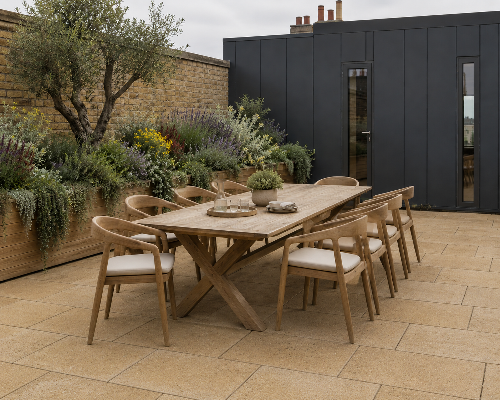
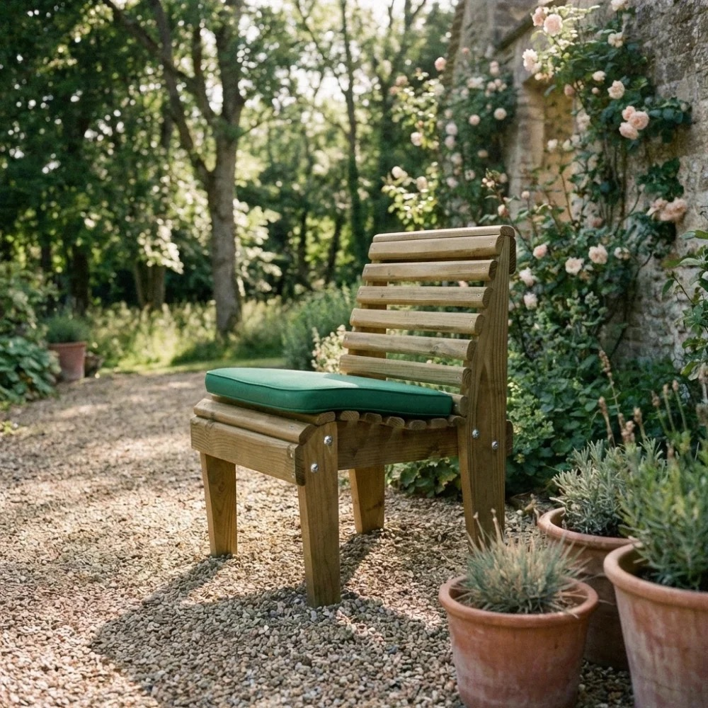
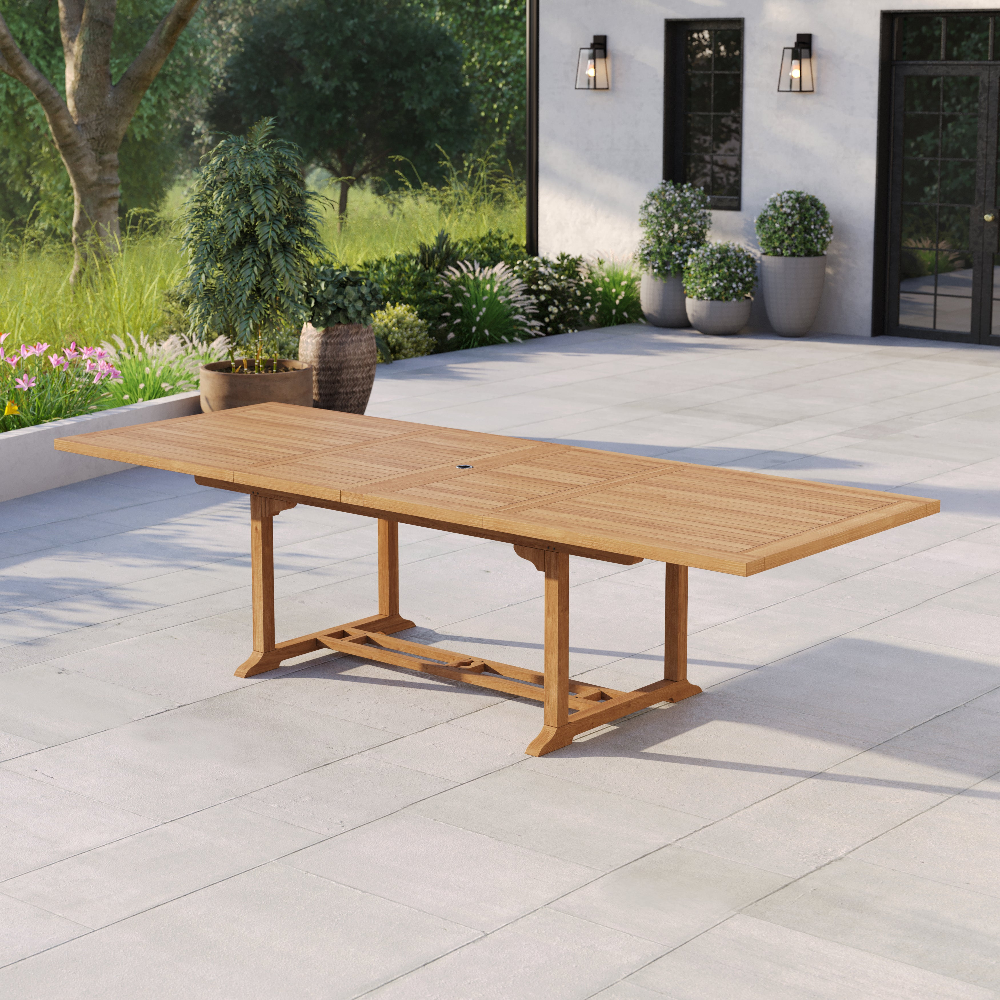
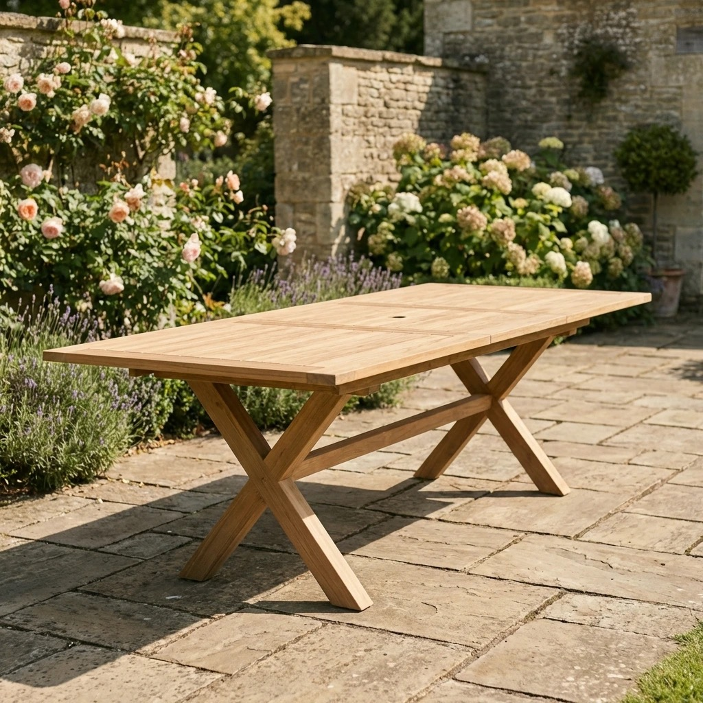
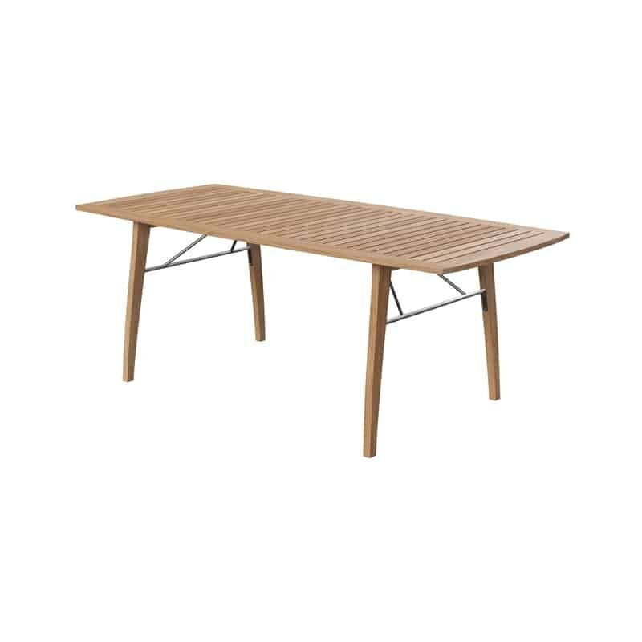
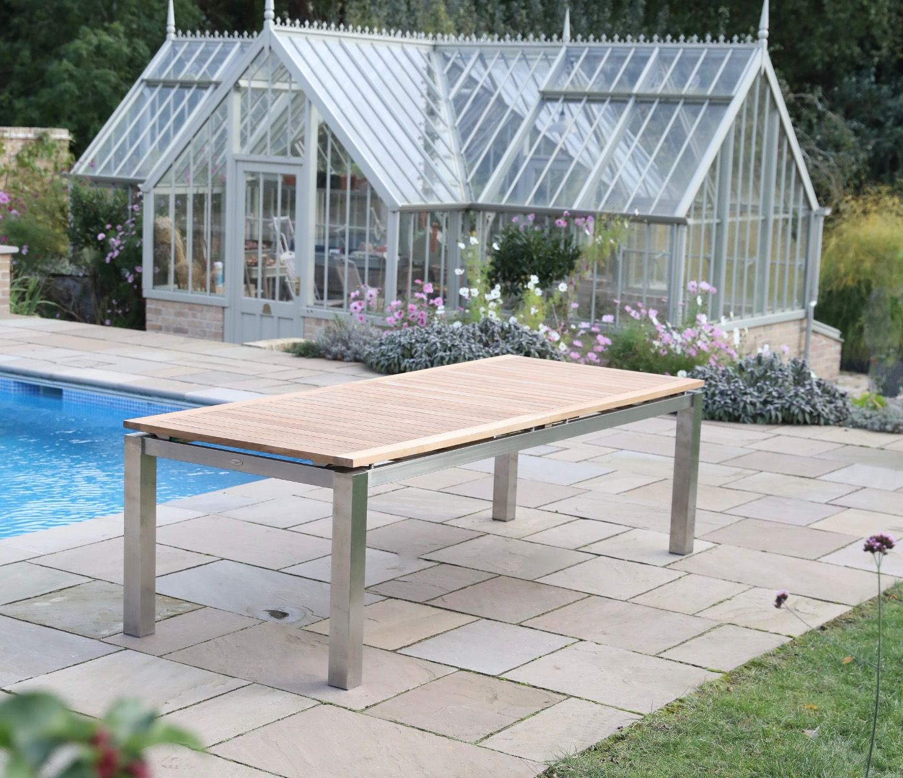
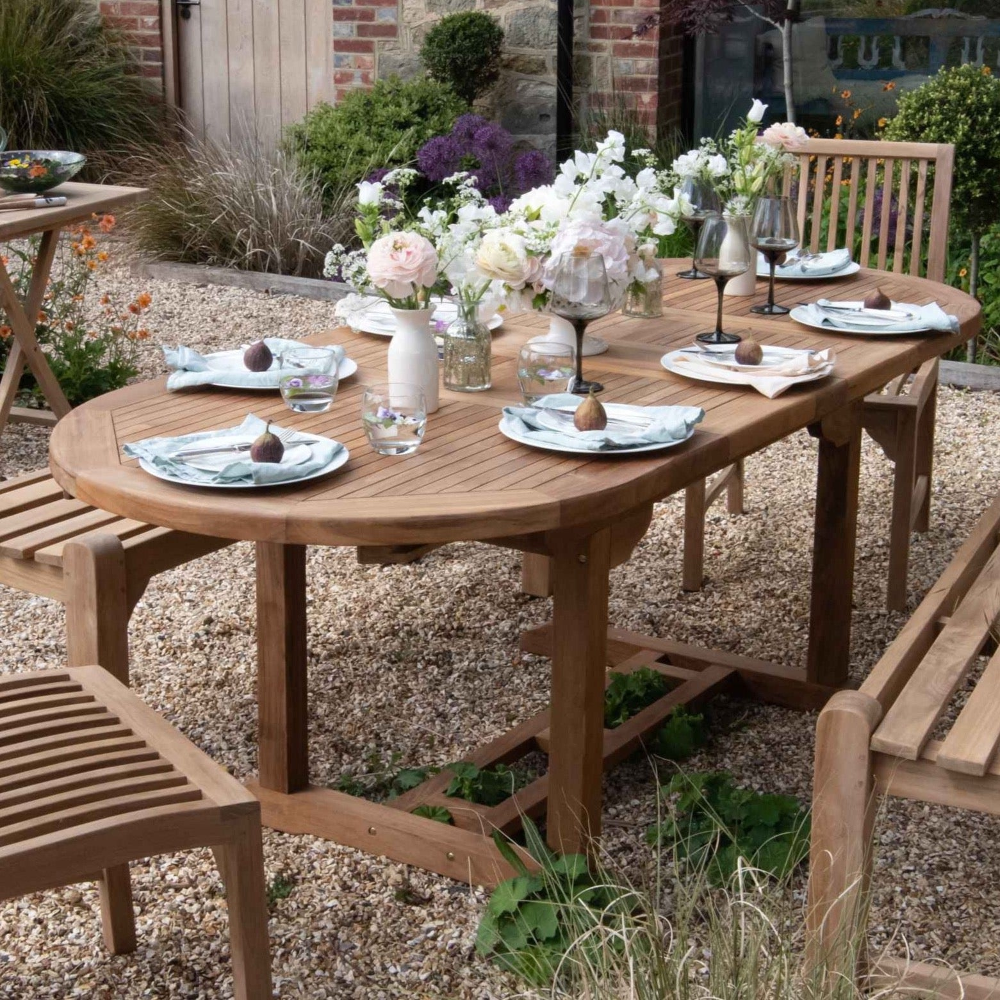
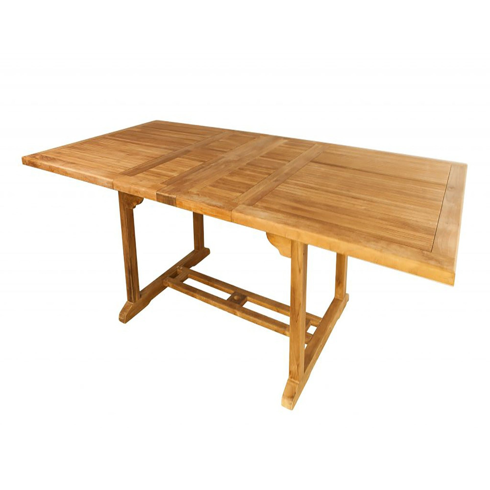

# Roof terrace — teak dining furniture

*Working document for Chris. Ronan's drawings and specs are authoritative for everything structural.*

---

## ✅ Confirmed choices

<table>
<tr>
<td width="50%" valign="top">

**Chair — Luxus Sydney armchair**

~£176/chair · set of 4 = £706
65cm W · 59cm D · 76cm H · stackable
[luxushomeandgarden.com](https://www.luxushomeandgarden.com/products/4-x-sydney-chairs-with-cushions)

</td>
<td width="50%" valign="top">

**Table — Sustainable Furniture Azura 10–12**

£1,280 · SVLK teak · X cross-leg
240cm compact → 320cm extended · 100cm wide · H75cm
[sustainable-furniture.co.uk](https://sustainable-furniture.co.uk/product/azura-10-12-seater-extending-dining-table/)

</td>
</tr>
</table>

### Dimensions — do they work together?

| Check | Chair | Table | Result |
|---|---|---|---|
| **Height compatibility** | Seat height ~45cm (standard) | Table H 75cm | ✓ 30cm knee clearance — standard comfortable dining |
| **Arm clearance** | Arms ~65–67cm (standard dining armchair) | X-leg design: no perimeter apron; tabletop underside ~72cm | ✓ ~5–7cm clearance on long sides; the X-brace is only at each end so arms slide under freely |
| **Chair width vs table** | 65cm wide (armchair with arms) | 240cm compact / 320cm extended | ✓ **See seating note below** |
| **Depth / pull-out** | 59cm D | 100cm wide → ~70cm each side clear to pull chair back | ✓ Plenty of room to pull chairs back from a 100cm-wide table |
| **SVLK certification** | SVLK Indonesian teak | SVLK Indonesian teak | ✓ Matched — same grade, same certification |

**Seating with the Sydney armchairs (65cm wide):** Practical counts with these chairs:

- **At 240cm compact:** 3 per long side + 1 each end = **8 seats comfortably** (3×65cm = 195cm, 45cm spread between chairs)
- **At 320cm extended:** 4 per long side + 1 each end = **10 seats** (4×65cm = 260cm, leaving a relaxed 60cm spread between chairs)

8 as the everyday size, 10 when extended for guests.

### Bistro table — Sustainable Furniture Rune Square 80cm · £240

Same supplier, same SVLK teak as the chairs and main table. **80cm × 80cm × H75cm** — sized for the narrow-terrace slot (the 100cm version was too big for it). Same 75cm height as the Azura, so it still lines up flush if ever pushed against the main table.

- **Narrow terrace bistro:** seats 2 everyday, 4 at a squeeze — right scale for the narrow section alongside the kitchen
- **Spare chairs live here:** we're ordering 12 Sydney chairs (they come in 4s); the 2–4 not needed at the main table sit round this
- **Optional extension:** can still be pushed flush onto the end of the Azura for a big occasion (same height), though at 80cm it's a touch narrower than the table's 100cm

Simple four-post teak frame (not the Azura's X cross-brace), so it reads as a deliberate bistro piece rather than a fake matching set. 5cm parasol hole if ever needed.

**Alternatives at this size** (same supplier): 80cm Teak Square **Folding** table (~£220 — folds flat for storage) · Nalani Square 90cm (~£260 — slightly bigger, chunkier slatted top). Round teak from this supplier only starts at 120cm, so nothing small enough — and square sits more efficiently in a corner slot anyway.

[sustainable-furniture.co.uk — Rune Square 80cm](https://sustainable-furniture.co.uk/product/rune-square-garden-table-fixed-80cm/)

---

## Contents

- [Confirmed choices (above)](#confirmed)
  - [Bistro table — Rune Square 80cm · £240](#rune)
- [Extending dining table — candidates](#tables)
  - **Cross/interesting legs (the brief):**
  - [Sustainable Furniture — Azura 8–10 (X-leg) · £920](#azura)
  - [Sustainable Furniture — Azura 10–12 (X-leg) · £1,280](#azura-12) *(confirmed — 8 seats everyday, 10 extended)*
  - [Skagerak Ballare (splayed legs + stainless X-brace) · £2,889](#ballare) *(over budget — reference)*
  - [Jo Alexander — Milano 270 (stainless apron frame) · £1,560](#milano) ⚠ sale ends 29 Jun
  - **Other square-ended options:**
  - [Luxus 200–300cm rect (SVLK) · £1,259](#luxus-table)
  - [Teakunique Orchid rect (large) · £1,845](#orchid-rect)
  - [Maze Jakarta (teak top + alu frame) · £1,059](#jakarta)
  - [Jo Alexander Henley 300cm (no image) · £1,145](#jo-alexander)
- [Steer & next steps](#steer)

---

## Confirmed: Luxus Home & Garden — Sydney armchair

*Set of 4 stacked — stackability and the rounded barrel-back clearly visible. Seat cushion included, stored indoors.*

**✅ Decision made.** This is the chosen chair.

- **Price:** ~£176/chair (sold in sets of 4, £706 — or as part of a table+chair set, see Luxus table below)
- **Material:** Indonesian teak, **SVLK certified** (EUTR compliant)
- **Colour:** Natural teak (silvers gradually if left untreated; oil once a season for honey colour) · cushion stores indoors
- **Dimensions:** 65cm W × 59cm D × 76cm H · **stackable** ✓ · Arms: Yes
- **Reviews:** Luxus — **Trustpilot 4.6/5 (675 reviews)**
- **Variant ordered:** [Check the exact cushion colour from your saved URL](https://www.luxushomeandgarden.com/products/4-x-sydney-chairs-with-cushions?variant=56920600674687) — confirm which shade of cushion before ordering

[luxushomeandgarden.com — Sydney (set of 4)](https://www.luxushomeandgarden.com/products/4-x-sydney-chairs-with-cushions)

---

## Extending dining table

Needs: **contemporary** · **extending to seat 10–12** · **teak top** (matches the Sydney chairs) · UK delivery.

---

### ⭐ Luxus Home & Garden — Rect 200–300cm · £1,259 table-only

- **Price:** £1,259 table-only (was £1,762 — ~28% off) · **or £2,259 for table + 10 Sydney chairs** (was £2,959) — same supplier, one order ⭐
- **Size:** 200cm compact → 300cm extended · 110cm wide · H75cm
- **Seats:** up to 12 extended
- **Material:** SVLK certified teak — matches the Sydney chairs exactly
- **Base:** trestle-style (two angled legs at each end)
- **Delivery:** Free, 1–2 weeks
- **Reviews:** Luxus — same 4.6/5 Trustpilot base

**Pros:** Cheapest table at this size · same supplier + same certification as the chairs · set deal saves ~£200 vs buying separately · SVLK matched throughout

**Cons:** CGI/render product photo suggests it's a newer listing (less independent review data for the table specifically) · trestle base (not four individual legs)

[luxushomeandgarden.com — Rect extending table](https://www.luxushomeandgarden.com/products/teak-rectangle-200-300-cm-extending-table) · [Table + 10 chairs set](https://www.luxushomeandgarden.com/products/teak-180-240cm-oval-extending-table-4cm-top-with-8-sydney-chairs)

[↑ Tables](#tables) · [↑ Top](#top)

---

### Sustainable Furniture — Azura · £920 *(X-leg cross-base)*

- **Price:** £920 table-only
- **Size:** 180cm compact → **240cm extended** · 100cm wide · H75cm
- **Seats:** Manufacturer calls it **"8–10 seater"** · with our 65cm Sydney armchairs: **6 at compact (180cm) / 8 at extended (240cm)**
- **Material:** SVLK certified teak (Indonesian managed forestry, A+ sustainability rating) · maritime-grade stainless steel fixings
- **Leg design:** ⭐ **X-shaped cross-brace at each end** — the most architecturally distinctive base here; very clean, contemporary, matches the Sydney chair's rounded aesthetic
- **Extension:** Butterfly-leaf (leaves fold from the centre)
- **Delivery:** Pre-order; **October 2026 delivery** — fine timing with the terrace fit-out completing late September

**Pros:** Most interesting leg design on the list — the X cross-brace is genuinely contemporary · same SVLK certification as the Sydney chairs · same supplier as the Arc chair (we already know the brand) · by far the cheapest table here · October delivery fits the fit-out window

**Cons:** ⚠ **Only seats 8–10** — if you regularly need 12 places, this won't stretch far enough. At 240cm extended you can seat 10 at a reasonable squeeze but not 12 · pre-order only, not in stock now · weight not published

[sustainable-furniture.co.uk — Azura](https://sustainable-furniture.co.uk/product/azura-8-10-seater-extending-dining-table/)

[↑ Tables](#tables) · [↑ Top](#top)

---

### Sustainable Furniture — Azura 10–12 seater · £1,280 *(same X-leg, bigger)*

*Extended to 320cm in a garden setting — the X-cross teak legs are clearly visible at both ends.*

- **Price:** £1,280 table-only
- **Size:** **240cm compact → 320cm extended** · 100cm wide · H75cm
- **Seats:** Manufacturer calls it **"10–12 seater"** · with our 65cm Sydney armchairs: **8 at compact (240cm) / 10 at extended (320cm)** ✓
- **Material:** SVLK certified teak · maritime-grade stainless fixings
- **Leg design:** Identical bold X cross-brace as the 8–10 — same chunky teak diagonals at each end
- **⚠ Compact size:** starts at 240cm — a substantially large everyday table. Fine if the dining area can take 240cm as its normal footprint; the 8–10 is better if you want to tuck it down smaller.
- **Delivery:** Pre-order; **October 2026** — timed well with fit-out completing late September

**Pros:** The only extending table found with X-cross teak legs that comfortably seats 12 · same SVLK certification as the Sydney chairs · October delivery fits the fit-out perfectly

**Cons:** 240cm compact is a large daily footprint · pre-order only · weight unpublished

[sustainable-furniture.co.uk — Azura 10–12](https://sustainable-furniture.co.uk/product/azura-10-12-seater-extending-dining-table/)

[↑ Tables](#tables) · [↑ Top](#top)

---

### Skagerak — Ballare · £2,889 *(over budget — design reference)*

- **Price:** £2,889 (Innes, Olson+Baker) — ~£400 over the £2,500 threshold
- **Size:** 196cm compact → 246cm (1 leaf) → 295cm (2 leaves) · 90cm wide · H74cm
- **Seats:** Up to 10 (tight at 90cm width — 8 comfortably)
- **Material:** **FSC 100% certified solid teak**, untreated · Designer: Jakob Berg (Skagerak / Fritz Hansen)
- **Leg design:** ⭐ **Four outward-splayed square teak legs with diagonal stainless steel tension rods forming a visible X cross-brace at each end** — a structural-engineering / Scandinavian maritime aesthetic. The most sophisticated leg design in this search.
- **Weight:** ~45–52kg · Leaves store separately
- **Guarantee:** Skagerak / Fritz Hansen — premium Danish brand

**Pros:** The most beautiful table in this list by some margin — the stainless X tension rods are a genuinely original detail · FSC 100% · designer pedigree · 196cm compact is a practical everyday size

**Cons:** £389 over the £2,500 budget cap · only seats 10 at full extension (90cm width is narrow for 10); 8 is more comfortable · smaller Scandinavian brand means harder to test / view in person

[innes.co.uk — Skagerak Ballare](https://www.innes.co.uk/products/skagerak-ballare-extendable-outdoor-dining-table)

[↑ Tables](#tables) · [↑ Top](#top)

---

### Jo Alexander — Milano 270 · £1,560 *(sale ends 29 Jun — 3 days)*

*Milano shown with dining chairs — the full-perimeter stainless steel apron frame is clearly visible under the teak slatted top.*

- **Price:** £1,560 on sale (was £1,950) — **⚠ sale ends 29 June 2026, 3 days from now**
- **Size:** 190cm compact → 230cm → 270cm extended (3 settings) · 90cm wide · H75cm
- **Seats:** ~8–10 (at 270×90cm)
- **Material:** Plantation teak slatted top · full **316 marine-grade brushed stainless steel perimeter apron frame** — legs and connecting rail all in stainless
- **Leg design:** Four square-section stainless steel legs connected by a continuous horizontal stainless apron running all four sides — creates a "floating teak on a steel platform" effect. Contemporary by material contrast rather than geometric complexity. New for 2025.
- **Teak:** Plantation, ethically sourced (no FSC/SVLK stated explicitly)
- **Stainless:** 316 marine-grade — excellent for Brighton seafront ✓

**Pros:** The stainless + teak material combination is genuinely contemporary and very coastal-appropriate · 316 marine stainless = best corrosion resistance · 190cm compact is a practical size · within budget at the sale price

**Cons:** 90cm width is narrow for 10 seats · seats 8–10 at 270cm, not 12 · no FSC/SVLK cert stated · not cross/trestle legs — the "interest" is in the material contrast, not the geometry · sale price may not last

[joalexander.co.uk — Milano 270](https://www.joalexander.co.uk/garden-furniture/garden-tables/extending-garden-tables/milano-double-extending-table-270cm)

[↑ Tables](#tables) · [↑ Top](#top)

---

### Teakunique — Orchid oval (large) · from £1,445

- **Price:** from £1,445 (large size — confirm on site, two sizes listed)
- **Size (large):** 200cm compact → 300cm extended · 120cm wide
- **Seats:** 8–10 compact · **12 extended**
- **Weight:** 97kg — substantial, wind-stable ✓
- **Material:** High-grade kiln-dried plantation teak (certified plantations — no FSC/SVLK label stated explicitly)
- **Base:** trestle
- **Guarantee:** 10 years
- **Delivery:** Free over £1,000; typically 7 days

**Pros:** Oval/rounded ends are softer — pairs beautifully with the barrel-back Sydney chairs · 97kg is the heaviest here (best wind resistance) · 10-yr guarantee · 120cm width gives more elbow room for 12 diners

**Cons:** Teakunique is a smaller brand with limited independent reviews (same concern as with the Poppy chair) · no FSC/SVLK label stated · slightly pricier than the Luxus

[teakunique.co.uk — Orchid oval](https://teakunique.co.uk/products/orchid-extending-oval-teak-garden-tables)

[↑ Tables](#tables) · [↑ Top](#top)

---

### Teakunique — Orchid rect (large) · £1,845

- **Price:** £1,845 (large size)
- **Size (large):** 120×200cm compact → 120×300cm extended
- **Seats:** 10→12–14 extended
- **Weight:** 98kg
- **Material/Guarantee:** Same as oval above

**Pros:** Larger still — could take 14 at a push; 120cm wide · 10-yr guarantee · huge weight

**Cons:** Most expensive of the group at £1,845 · rectangular hard ends feel less matched to the curved Sydney chairs than the oval version · same independent-review caveat as the oval

[teakunique.co.uk — Orchid rect](https://teakunique.co.uk/products/orchid-extending-rectangular-teak-garden-tables)

[↑ Tables](#tables) · [↑ Top](#top)

---

### Maze — Jakarta · £1,059 (teak top + dark grey aluminium frame)

*Photo shown extended — teak slat top and dark grey aluminium frame are the point.*

- **Price:** £1,059 table-only
- **Size:** 200cm → 260cm → 320cm (3-step) · 100cm wide · H75cm
- **Seats:** 6→8→**10 (max)** — does not reliably seat 12
- **Material:** Solid teak slat top + dark grey powder-coated aluminium frame
- **Certification:** Not stated
- **Weight:** Unpublished — heavy (teak + aluminium)
- **Reviews:** Maze — 9,600 Trustpilot reviews; delivery-damage risk on large items — inspect on arrival

**Pros:** Cheapest option · the dark grey aluminium frame is a handsome contemporary contrast · teak top bridges both chair styles

**Cons:** ⚠ **Only seats 10 at full extension** — borderline for a 10–12 seat brief · teak grade not confirmed · mixed Maze delivery reviews · the aluminium frame makes less sense now the chair choice is fully teak

[mazeliving.co.uk — Jakarta](https://www.mazeliving.co.uk/product/maze-jakarta-10-seat-extending-dining-table-teak-grey-frame)

[↑ Tables](#tables) · [↑ Top](#top)

---

### Jo Alexander — Henley 300cm · £1,145 *(no image — visit site)*

*(Image not available — Shopify CDN blocked scraping. Visit the link below to view.)*

- **Price:** £1,145 (double-extending to 300cm)
- **Size:** compact → 300cm extended · ~100cm wide
- **Seats:** 10–12 extended ✓
- **Material:** **A-grade plantation teak** — strong certification claim
- **Base:** trestle-style
- **Delivery:** UK standard

**Pros:** Cheapest 300cm table here · Grade A teak stated explicitly · 300cm fully extended seats 12 comfortably

**Cons:** No image retrieved — verify the look before ordering; base style may be more traditional · smaller brand, check reviews

[joalexander.co.uk — Henley 300cm](https://www.joalexander.co.uk/teak-rectangular-double-extending-table-300)

[↑ Tables](#tables) · [↑ Top](#top)

---

### Tikamoon — Noah · ~£1,599+ *(no image — visit site)*

*(Tikamoon blocks image scraping — visit the link to see the design.)*

- **Price:** £1,599 for the 220cm base version; **270cm and 320cm variants cost more (unknown — check on site)**
- **Size needed:** 270cm (seats 10–12) or 320cm (12+)
- **Material:** **FSC certified solid teak** ✓
- **Base:** ⭐ **Four individual square legs** — the only table here *not* using a trestle base
- **Extension:** Hidden butterfly leaves, stainless steel + nylon sliding mechanism

**Pros:** The most architecturally contemporary design — four clean square legs look like a serious indoor-quality dining table taken outside · FSC certified · matches the clean contemporary aesthetic of the Sydney chairs better than any trestle

**Cons:** No image retrieved — visit the site; price for the 270/320cm variants unknown · Tikamoon is primarily indoor furniture — confirm outdoor/coastal suitability; joinery/hardware may not be marine-spec

[tikamoon.co.uk — Noah extending](https://www.tikamoon.co.uk/art-noah-8-10-seater-solid-teak-extendable-table-7519.htm)

[↑ Tables](#tables) · [↑ Top](#top)

---

## Steer & next steps

### Market reality — cross-leg extending teak tables

After searching 20+ UK suppliers, the honest finding: **extending teak tables with genuinely interesting legs are extremely rare.** The overwhelming majority use a standard H-frame trestle (two vertical posts at each end + stretcher bar). The ones that break from this are listed first below. Everything else is a conventional trestle.

### Full comparison table

| Table | Price | Compact | Extended | Seats | Legs | Cert |
|---|---|---|---|---|---|---|
| **Azura 8–10 (X-leg)** | £920 | 180cm | 240cm | 8–10 | ⭐ X cross-brace | SVLK |
| **Azura 10–12 (X-leg)** | £1,280 | 240cm | 320cm | 10–12 | ⭐ X cross-brace | SVLK |
| **Milano 270 (stainless apron)** | £1,560 *(sale to 29 Jun)* | 190cm | 270cm | 8–10 | Stainless frame | plantation |
| **Skagerak Ballare** | £2,889 *(over budget)* | 196cm | 295cm | up to 10 | ⭐ splayed teak + stainless X | FSC 100% |
| **Cane-line Copenhagen** | £3,000 *(over budget, too small)* | 160cm | 243cm | up to 8 | ⭐ sled/trapezoid alu | SVLK |
| SF Lark 10–12 | £1,205 | 240cm | 320cm | 10–12 | Structural double trestle | SVLK |
| Luxus rect | £1,259 | 200cm | 300cm | 12 | Standard trestle | SVLK |
| Orchid rect | £1,845 | 200cm | 300cm | 12–14 | Standard trestle | plantation |
| Jakarta (teak+alu) | £1,059 | 200cm | 320cm | 10 max | Straight alu | — |
| Henley 300 (no image) | £1,145 | 200cm | 300cm | 12 | Unconfirmed | Grade A |

### The decision

**If the X-leg design matters most and 10 seats is enough:** Azura 8–10 (£920). Cheapest, most distinctive legs, SVLK, October delivery. At 180cm compact it's practical for everyday use.

**If you need 12 seats and want X-legs:** Azura 10–12 (£1,280). Same design, bigger — but 240cm compact is a large everyday table. Weigh that against the seat count.

**If the leg design matters and budget can stretch to ~£2,900:** Skagerak Ballare. The stainless X-rod tension brace is the most original detail in this category — genuinely a designer piece. Only seats 10 at full extension though.

**If you want 12 seats and aren't bothered about leg design:** Luxus set deal (£2,259 for table + 10 chairs, matched SVLK, one order) is by far the best value for that requirement.

**⚠ Time-sensitive:** Jo Alexander Milano sale (£1,560, was £1,950) ends **29 June** — 3 days from now. It's a good contemporary stainless+teak table if you want something that seats 8–10 at 190→270cm with a clean modern frame.

### Interesting fixed tables found (for reference)
The cross-leg aesthetic exists more freely in the fixed (non-extending) market:
- **Sustainable Furniture Eros** — chunky X-cross teak legs, 240cm or 300cm fixed, SVLK, pre-order Sept. The most architecturally bold design found anywhere in this search.
- **Alexander Rose Plank** — enormous FSC teak X-frame (104kg), 240cm fixed, £2,599. Pairs with matching benches.
- **Jati Blackrock 2.6m** — dark graphite aluminium A-frame trestle + teak slat top, fixed 260cm, £1,360. Very contemporary A-frame aesthetic.

None extend. Flagged if the brief ever relaxes, or as a fixed secondary table.

**Also noted but over budget / wrong size:** [Cane-line Copenhagen](https://cane-line.co.uk/products/copenhagen-dining-table) (£3,000, 160→243cm, sled/trapezoid aluminium legs — genuinely beautiful Scandinavian design but too small compact and over budget); [SF Lark 10–12](https://sustainable-furniture.co.uk/product/lark-10-12-seater-extending-dining-table/) (£1,205, 240→320cm, structural double trestle — good value for 12 seats but the legs are more traditional-crafts than cross-leg).

### Next actions
- Confirm Sydney chair cushion colour from your variant URL
- Decide seat count: 10 (Azura 8–10) or 12 (Azura 10–12 / Luxus set / Orchid rect)
- Decide leg priority: X-legs first (Azura) vs value (Luxus set) vs aspirational (Ballare)
- If Milano appeals, visit the site this week — sale ends 29 June
